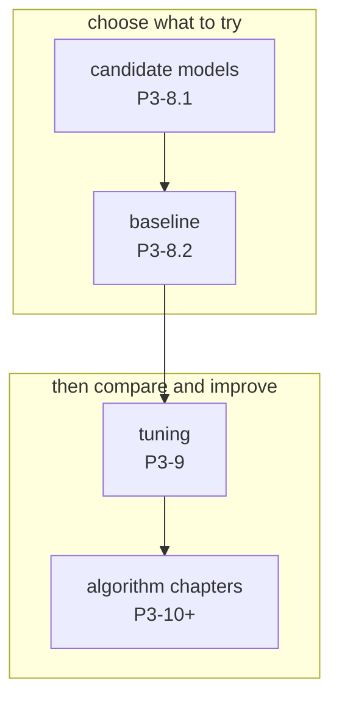
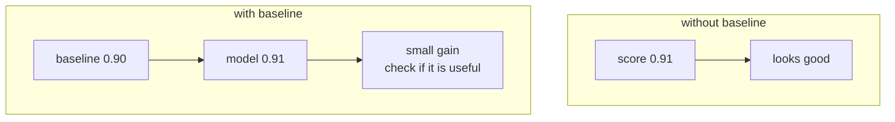
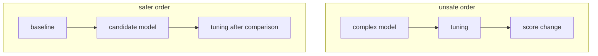

# P3-8.2 기준 모델(baseline)

P3-8.1에서는 어떤 모델 계열을 후보로 올릴지 봤습니다. 이제 그 후보들을 바로 복잡한 순서대로 붙잡기보다, 먼저 비교의 출발점을 세우는 질문으로 넘어갑니다.

`이 문제에서 가장 먼저 이겨야 할 가장 단순한 기준은 무엇인가?`

이 질문이 바로 기준 모델(baseline)의 출발점입니다.

초심자는 종종 기준 모델을 `성능이 낮은 임시 모델`처럼 이해합니다. 하지만 실제로는 그보다 훨씬 중요합니다. 기준 모델은 복잡한 모델이 정말로 의미 있는 개선을 만들고 있는지 확인하는 비교의 바닥선(floor)입니다.

학술 문맥과 실무 문맥 모두에서 baseline은 `좋은 모델`이 아니라 `비교를 가능하게 만드는 최소 기준`에 가깝습니다. 즉, baseline이 없으면 성능 숫자가 높아 보여도 그것이 쉬운 문제 덕분인지, 데이터 편향 덕분인지, 실제 모델링 덕분인지 구분하기 어렵습니다.

## 이 절의 범위

이 절은 다음 질문에 답합니다.

- 기준 모델(baseline)은 왜 먼저 필요한가?
- baseline이 없으면 어떤 착시가 생길 수 있는가?
- 분류(classification)와 회귀(regression)에서 어떤 단순 기준을 먼저 세울 수 있는가?
- dummy baseline과 실제 모델 비교는 무엇을 알려 주는가?

이 절은 다음 내용은 깊게 다루지 않습니다.

- 복잡한 벤치마크 설계
- 통계 검정 기반의 모델 비교 절차
- 대규모 리더보드 운영 방식

그 내용은 뒤의 튜닝, 알고리즘 비교, 실험 설계 절과 연결해서 다시 볼 수 있습니다.

## 이 절의 목표

- baseline을 `복잡한 모델보다 먼저 세우는 비교 기준`으로 설명할 수 있습니다.
- 분류와 회귀에서 아주 단순한 baseline이 왜 필요한지 말할 수 있습니다.
- DummyClassifier, DummyRegressor 같은 도구가 왜 교육적으로 유용한지 설명할 수 있습니다.
- 좋은 모델이란 단순히 높은 점수가 아니라, baseline보다 의미 있는 개선을 만든 모델이라는 관점을 가질 수 있습니다.

## 이 절이 커리큘럼에서 필요한 이유

P3-8.1에서 우리는 후보 모델군을 세웠습니다. 하지만 후보군을 세웠다고 바로 비교가 시작되는 것은 아닙니다. 비교에는 출발점이 필요합니다.

- 후보군이 있어도 비교 기준이 없으면 개선인지 착시인지 구분하기 어렵습니다.
- 평가 지표가 있어도, 그 점수가 쉬운 문제 덕분인지 모델 덕분인지 알기 어렵습니다.
- 전처리와 특징 선택을 했더라도, 단순 규칙보다 나은지 확인하지 않으면 실험이 공중에 뜹니다.

따라서 이 절은 커리큘럼상 다음 역할을 합니다.

| 커리큘럼 위치 | baseline 절의 역할 |
| --- | --- |
| 모델 선택 뒤 | 후보군을 실제 비교 가능한 형태로 바꿈 |
| 튜닝 전 | 튜닝이 의미 있는 개선인지 판별할 바닥선 제공 |
| 알고리즘 입문 전 | 복잡한 알고리즘이 단순 기준보다 왜 나은지 설명할 준비 |

즉, P3-8.1이 `무엇을 후보로 올릴까`를 다뤘다면, P3-8.2는 `무엇을 기준으로 이 후보를 비교할까`를 다룹니다.

이 흐름을 간단히 그리면 다음과 같습니다.



이 도식의 핵심은 baseline이 선택 이후, 튜닝 이전에 놓여야 한다는 점입니다.

## 기준 모델은 무엇을 하는가

scikit-learn의 `DummyClassifier` 문서는 입력 특징을 무시하고 예측하는 분류기를 `더 복잡한 분류기와 비교하기 위한 simple baseline`이라고 설명합니다. `DummyRegressor` 문서도 마찬가지로 평균(mean), 중앙값(median) 같은 단순 규칙으로 예측하는 회귀기를 `simple baseline`이라고 설명합니다.

이 설명을 초심자용으로 바꾸면 다음과 같습니다.

`기준 모델은 입력을 깊게 이해하지 않더라도 만들 수 있는 가장 단순한 비교 기준이다.`

즉, baseline은 현실 문제를 잘 풀기 위한 완성형 모델이 아니라, `이 정도보다 낫지 않으면 복잡한 모델을 쓴 의미가 없다`는 최소 기준입니다.

조금 더 학술적으로 말하면 baseline은 모델링의 유효성(validity)을 확인하는 최소 대조군(control) 역할을 합니다. 복잡한 구조를 넣고 튜닝을 많이 했더라도 baseline보다 의미 있게 낫지 않다면, 그 실험은 개선이 아니라 복잡도만 늘린 것일 수 있습니다.

## baseline이 없으면 어떤 착시가 생기는가

baseline이 없으면 높은 수치가 곧 좋은 모델처럼 보일 수 있습니다. 하지만 실제로는 그렇지 않을 수 있습니다.

예를 들어 이탈 고객이 10%뿐인 데이터에서 모두 `안 떠난다`라고 예측해도 정확도(accuracy)는 90%가 나올 수 있습니다. 이 경우 정확도만 보면 좋아 보이지만, 실제로는 중요한 소수 클래스를 전혀 잡지 못한 모델입니다.

즉, baseline이 없으면 다음 같은 착시가 생길 수 있습니다.

| 보이는 숫자 | 실제 문제 |
| --- | --- |
| 정확도가 높다 | 다수 클래스만 찍어도 높을 수 있음 |
| 회귀 오차가 작다 | 평균만 예측해도 비슷할 수 있음 |
| 새 모델이 복잡하다 | 복잡함이 개선을 뜻하지는 않음 |

그래서 baseline은 점수를 낮추기 위한 장치가 아니라, 점수를 `읽을 수 있게` 만드는 장치입니다.

이 차이를 가장 단순하게 그리면 다음과 같습니다.



이 도식의 핵심은 같은 숫자도 baseline이 있을 때와 없을 때 전혀 다르게 읽힌다는 점입니다.

## 분류에서 가장 단순한 baseline은 무엇인가

분류에서는 다음 같은 단순 baseline을 먼저 생각할 수 있습니다.

| baseline 형태 | 의미 |
| --- | --- |
| 가장 자주 나오는 클래스만 예측 | 다수 클래스 기준 |
| 클래스 비율대로 무작위 예측 | 분포 수준 기준 |
| 항상 같은 클래스 예측 | 정말 최소한의 바닥선 |

예를 들어 고객 이탈 예측에서 이탈이 드문 경우, `항상 비이탈`을 말하는 baseline은 꽤 높은 정확도를 낼 수 있습니다. 이 baseline보다 겨우 조금만 높은 모델이라면, 그 모델은 실제로는 별로 유용하지 않을 수 있습니다.

이 절의 핵심은 baseline이 좋아 보이는지를 평가하는 것이 아닙니다. 오히려 `너무 단순한데도 이 정도 점수가 나온다`는 사실이 문제의 난이도와 지표의 함정을 동시에 보여 준다는 점이 중요합니다.

실무 장면으로 바꾸면 다음처럼 읽을 수 있습니다.

| 업무 상황 | 너무 쉬운 baseline 예 | 왜 먼저 확인해야 하는가 |
| --- | --- | --- |
| 고객 이탈 예측 | 항상 `비이탈` 예측 | 높은 정확도 착시를 막기 위해 |
| 결제 사기 탐지 | 항상 `정상 거래` 예측 | 희귀 이벤트를 놓치는지 확인하기 위해 |
| 광고 클릭 예측 | 항상 `비클릭` 예측 | 불균형 데이터에서 지표를 바로 읽기 위해 |
| 불량 검출 | 항상 `정상 제품` 예측 | 생산 라인의 소수 불량을 잡는지 보기 위해 |

## 회귀에서 가장 단순한 baseline은 무엇인가

회귀에서는 다음 같은 단순 baseline을 먼저 둘 수 있습니다.

| baseline 형태 | 의미 |
| --- | --- |
| 모든 샘플에 평균값 예측 | 가장 기본적인 중심값 기준 |
| 모든 샘플에 중앙값 예측 | 극단값에 덜 민감한 기준 |
| 특정 상수값 예측 | 도메인 고정 기준 |

예를 들어 집값 예측에서 아무 입력도 보지 않고 평균 집값만 예측하는 baseline을 세울 수 있습니다. 이보다 나은 모델을 만들지 못한다면, 복잡한 전처리와 알고리즘을 도입했더라도 실제 개선은 없다고 봐야 합니다.

실무 장면으로 바꾸면 회귀 baseline은 다음처럼 읽을 수 있습니다.

| 업무 상황 | 단순 baseline 예 | 왜 필요한가 |
| --- | --- | --- |
| 집값 예측 | 평균 집값만 예측 | 입력 특징이 실제로 도움 되는지 확인하기 위해 |
| 배송 시간 예측 | 평균 배송 시간만 예측 | 지역, 거리, 물량 정보가 개선을 만드는지 보기 위해 |
| 월 매출 예측 | 지난 평균 매출만 예측 | 계절성이나 캠페인 정보가 추가 이득을 주는지 확인하기 위해 |
| 콜센터 통화량 예측 | 평균 통화량만 예측 | 시간대나 이벤트 정보가 유효한지 판단하기 위해 |

## baseline은 왜 튜닝보다 먼저 와야 하는가

초심자는 종종 이렇게 진행합니다.

1. 복잡한 모델을 고른다.
2. 파라미터를 많이 바꿔 본다.
3. 점수가 조금 오르면 성공으로 본다.

하지만 baseline이 없으면 이 개선이 정말 의미 있는지 알 수 없습니다.



이 도식의 핵심은 baseline이 튜닝의 일부가 아니라, 튜닝이 의미 있는지 판별하는 전제라는 점입니다.

실무에서는 이 순서 차이가 곧 비용 차이로 이어집니다. baseline도 넘지 못하는 후보를 오래 튜닝하면, 실험 시간과 계산 비용만 쓰고도 설명할 수 있는 개선이 남지 않을 수 있습니다.

## 작은 예시로 baseline의 역할 보기

다음과 같은 고객 이탈 예측 문제를 생각해 보겠습니다.

| 항목 | 내용 |
| --- | --- |
| 문제 | 다음 달 고객 이탈 여부 예측 |
| 클래스 분포 | 비이탈 90%, 이탈 10% |
| 지표 | 정확도, 재현율(recall), F1 |

이 경우 baseline으로 `항상 비이탈`을 예측하면 정확도는 90%가 될 수 있습니다. 하지만 이탈 고객 재현율은 0입니다.

이제 어떤 실제 모델이 정확도 91%를 냈다고 해 보겠습니다. 숫자만 보면 baseline보다 나아 보이지만, 이탈 재현율이 여전히 매우 낮다면 서비스적으로는 큰 의미가 없을 수 있습니다.

즉, baseline은 `점수의 절대값`보다 `점수의 해석 기준`을 제공합니다.

실무적으로는 다음처럼 읽을 수 있습니다.

| 비교 장면 | baseline이 알려 주는 것 |
| --- | --- |
| 새 모델이 정확도는 조금 높다 | 그 차이가 실제로 의미 있는지 다시 보게 함 |
| recall, F1이 크게 오른다 | 소수 클래스 문제를 더 잘 다루는지 보여 줌 |
| 복잡한 모델이 baseline보다 약간만 낫다 | 운영 비용까지 감수할 가치가 있는지 묻게 함 |
| 단순 모델이 baseline을 크게 넘는다 | 복잡한 모델로 급히 가지 않아도 될 수 있음을 보여 줌 |

## Python 예제로 baseline과 비교해 보기

아래 예제는 scikit-learn의 `DummyClassifier`와 간단한 분류 모델을 비교하는 아주 작은 실습입니다.

```python
from sklearn.datasets import make_classification
from sklearn.dummy import DummyClassifier
from sklearn.linear_model import LogisticRegression
from sklearn.metrics import accuracy_score, recall_score, f1_score
from sklearn.model_selection import train_test_split

X, y = make_classification(
    n_samples=400,
    n_features=6,
    n_informative=3,
    n_redundant=0,
    weights=[0.9, 0.1],
    random_state=42,
)

X_train, X_test, y_train, y_test = train_test_split(
    X, y, test_size=0.3, stratify=y, random_state=42
)

baseline = DummyClassifier(strategy="most_frequent")
baseline.fit(X_train, y_train)
baseline_pred = baseline.predict(X_test)

model = LogisticRegression(max_iter=1000)
model.fit(X_train, y_train)
model_pred = model.predict(X_test)

print("baseline accuracy :", round(accuracy_score(y_test, baseline_pred), 3))
print("baseline recall   :", round(recall_score(y_test, baseline_pred), 3))
print("baseline f1       :", round(f1_score(y_test, baseline_pred), 3))
print()
print("model accuracy    :", round(accuracy_score(y_test, model_pred), 3))
print("model recall      :", round(recall_score(y_test, model_pred), 3))
print("model f1          :", round(f1_score(y_test, model_pred), 3))
```

실행 결과 예시는 다음과 같습니다.

```text
baseline accuracy : 0.9
baseline recall   : 0.0
baseline f1       : 0.0

model accuracy    : 0.942
model recall      : 0.5
model f1          : 0.632
```

이 예제가 보여 주는 것은 단순합니다.

- baseline 정확도는 이미 높을 수 있다.
- 하지만 중요한 클래스는 전혀 잡지 못할 수 있다.
- 실제 모델의 개선은 baseline보다 얼마나 더 잘 잡는지로 읽어야 한다.

즉, baseline은 `낮은 성능 모델`이 아니라 `성능 숫자를 해석하기 위한 기준선`입니다.

## DummyClassifier와 DummyRegressor를 어떻게 이해하면 좋은가

scikit-learn의 dummy 계열 모델은 교육적으로 특히 유용합니다.

| 도구 | 입문적 이해 |
| --- | --- |
| `DummyClassifier` | 특징을 무시하고 단순 규칙으로 분류하는 기준선 |
| `DummyRegressor` | 평균, 중앙값 같은 단순 규칙으로 예측하는 기준선 |

이 도구들의 가치는 실제 서비스에 쓰기 위한 것이 아니라, `진짜 모델이 최소한 어디까지는 이겨야 하는가`를 빠르게 보여 준다는 데 있습니다.

즉, baseline은 모델 선택의 일부이면서 동시에 평가 읽기의 일부입니다.

## 이 절에서 기억할 관점

- baseline은 복잡한 모델 전에 세우는 비교 기준이다.
- 높은 점수도 baseline과 비교하지 않으면 해석하기 어렵다.
- 분류에서는 다수 클래스 예측, 회귀에서는 평균/중앙값 예측이 대표적인 단순 baseline이 될 수 있다.
- 튜닝은 baseline보다 나은 후보가 있는지 확인한 뒤에 들어가는 편이 안전하다.

## 체크리스트

- 지금 문제에 가장 단순한 baseline은 무엇인가?
- baseline 점수와 실제 모델 점수를 같은 지표로 비교하고 있는가?
- baseline보다 나은지, 아니면 단지 복잡하기만 한지 구분하고 있는가?
- 클래스 불균형이나 평균 예측 같은 쉬운 함정을 baseline으로 확인했는가?
- 튜닝 전에 먼저 baseline과 후보 모델의 차이를 읽었는가?

## 다음 절과의 연결

다음 절 P3-9에서는 baseline보다 나은 후보가 생겼을 때, 그 후보를 어떻게 조정하고 비교할지를 다룹니다. 이후의 알고리즘 절에서는 각 모델이 왜 baseline을 넘을 수 있는지, 또는 어떤 조건에서 baseline을 넘기 어려운지를 더 구체적으로 보게 됩니다.

## 출처와 참고 자료

- scikit-learn, `DummyClassifier`, scikit-learn API Reference, 확인 날짜: 2026-06-26. [https://scikit-learn.org/stable/modules/generated/sklearn.dummy.DummyClassifier.html](https://scikit-learn.org/stable/modules/generated/sklearn.dummy.DummyClassifier.html){: target="_blank" rel="noopener noreferrer" }
- scikit-learn, `DummyRegressor`, scikit-learn API Reference, 확인 날짜: 2026-06-26. [https://scikit-learn.org/stable/modules/generated/sklearn.dummy.DummyRegressor.html](https://scikit-learn.org/stable/modules/generated/sklearn.dummy.DummyRegressor.html){: target="_blank" rel="noopener noreferrer" }
- Sebastian Raschka, `Model Evaluation, Model Selection, and Algorithm Selection in Machine Learning`, arXiv, 2018, 확인 날짜: 2026-06-26. [https://arxiv.org/abs/1811.12808](https://arxiv.org/abs/1811.12808){: target="_blank" rel="noopener noreferrer" }
