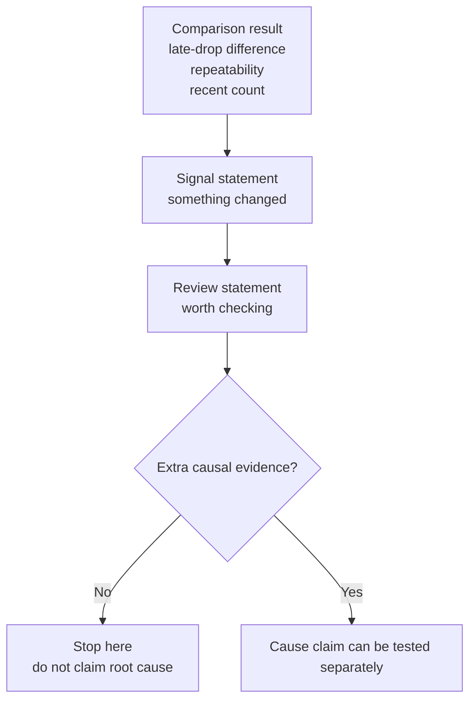

# P3-8.2 변화 신호를 어디까지 말하고 원인은 어디서 멈추는가

> Section ID: `P3-8.2`
> Version: `v2026.07.08`

기준선이 생기면 최근 구간과 평소 상태의 차이를 읽을 수 있습니다. 하지만 여기서도 `차이가 보였으니 원인도 바로 알 수 있겠지`라는 식의 해석은 매우 위험합니다. 변화 신호가 보인다는 것과, 그 원인이 무엇인지 확정하는 것은 전혀 다른 단계이기 때문입니다. 해석 강도를 조절한 뒤에는, 이제 `어디까지 말하고 어디서 멈출 것인가`를 더 분명히 정해야 합니다.

이 장에서 함께 회수해야 하는 또 하나의 관점은 `시각화 해석(visual interpretation)`입니다. 비교표를 숫자로 읽을 때도 과잉해석이 생기지만, 선 그래프, 막대그래프, 분포 그림처럼 눈에 잘 들어오는 그림에서는 그 위험이 더 커집니다. 선이 갈라져 보이거나 막대 높이가 달라 보인다는 사실은 변화 신호를 빨리 포착하게 도와주지만, 그 자체가 곧바로 원인 확정이나 강한 결론을 뜻하지는 않습니다. 따라서 Chapter 8에서는 `대푯값 하나로 너무 빨리 믿지 않는다`는 태도와 함께, `그림에서 보이는 차이도 같은 강도로 단정하지 않는다`는 태도를 같이 잡아야 합니다.

예를 들어 최근 20건의 동작에서 후반 하강률이 평소보다 더 커졌다고 하겠습니다. 이 차이는 분명히 중요한 변화 신호일 수 있습니다. 하지만 그 이유가 센서 문제인지, 입력 조건 변화인지, 제어 설정 변화인지, 일시적 환경 요인인지는 아직 알 수 없습니다. 비교표가 보여 주는 것은 `평소와 다른 구조가 있다`는 사실이지, `왜 그런가`에 대한 완성된 진단은 아닙니다.

같은 판단은 그림을 읽을 때도 그대로 적용됩니다. 예를 들어 최근 구간 선이 기준선보다 아래로 내려가 보이거나, 상자그림(box plot)에서 최근 구간의 범위가 더 넓어 보일 수 있습니다. 이런 그림은 `무엇이 달라 보이는가`를 빠르게 잡아 주지만, 그 차이가 표본 수 부족 때문인지, 일부 극단값 때문인지, 지속적인 구조 변화 때문인지는 그림만 보고 바로 확정할 수 없습니다.

| 그림에서 먼저 보이는 것 | 그림만 보고 바로 말하면 위험한 문장 | 더 안전한 해석 |
| --- | --- | --- |
| 최근 선이 기준선보다 아래에 있음 | 상태가 확실히 악화되었다 | 최근 구간이 기준선보다 낮아 보여 추가 확인이 필요하다 |
| 최근 막대가 더 큼 | 원인이 이미 분명하다 | 비교값 차이가 보여 원인 확정 없이 검토한다 |
| 상자그림 범위가 넓어짐 | 시스템이 불안정해졌다 | 최근 분산이 커 보이므로 반복성과 표본 수를 함께 본다 |

| 표현 | 뜻 | 지금 단계에서 말할 수 있는가 |
| --- | --- | --- |
| 변화 신호 | 평소와 다른 구조가 관찰됨 | 가능 |
| 경고 후보 | 사람이 먼저 볼 가치가 있음 | 가능 |
| 검토 필요 | 추가 확인을 해야 함 | 가능 |
| 원인 확정 | 왜 그런지 이미 판정함 | 대개 아직 어려움 |

이 표에서 보듯이 비교 구조가 직접 뒷받침하는 것은 대체로 `변화 신호`, `경고 후보`, `검토 필요` 수준까지입니다. 반면 `원인 확정`은 더 많은 근거가 필요합니다. 원시 로그 재확인, 운영 맥락, 추가 센서, 후행 결과, 사람의 판단이 모두 필요할 수 있습니다.

즉 비교표가 강한 도구라는 말과, 비교표만으로 모든 것을 말할 수 있다는 말은 다릅니다. 비교표는 `무엇이 평소와 다르게 보이는가`를 빠르게 드러내는 데 강하지만, `왜 그런가`를 단독으로 판정하는 도구는 아닙니다. 이 경계를 분명히 해야 경고와 진단, 검토 큐(review queue)와 자동 분류를 뒤섞지 않게 됩니다.

통계적 보수성은 바로 여기서 필요합니다. 표본 수가 적거나 반복성이 약하면, 차이가 보여도 표현 강도를 낮춰야 합니다. 따라서 여기서는 `변화는 관찰되지만 원인은 아직 확정되지 않았다`는 문장을 기본 태도로 삼습니다.

이 태도는 AI가 약해서가 아니라, 문제 구조가 원래 그렇게 되어 있기 때문에 필요합니다. 비교표는 `무엇이 달라졌는가`를 보여 주는 데는 강하지만, `왜 달라졌는가`를 단독으로 설명하기에는 근거가 부족한 경우가 많습니다. 그래서 데이터 모델링 단계에서 출력 구조를 `자동 진단`보다 `경고 후보`, `검토 필요`, `비교 리포트` 쪽으로 잡는 편이 더 정직할 수 있습니다.

이 경계는 상관관계(correlation)를 읽을 때 특히 중요합니다. 두 값이 함께 움직인다고 해서, 한쪽이 다른 쪽의 원인이라고 바로 말할 수는 없습니다. 예를 들어 특정 입력 조건과 후반 하강이 자주 같이 보인다고 해도, 그 사이에 숨은 운영 조건이나 계절성, 측정 방식 변화가 끼어 있을 수 있습니다. 따라서 Part 3에서는 `함께 움직였다`와 `원인이다`를 같은 문장으로 묶지 않는 습관을 먼저 잡아야 합니다.

이 점은 금융 모형화(financial modeling)처럼 잘못된 해석 비용이 큰 영역에서 더 민감해집니다. 가격 변화, 거래량, 위험 점수, 연체 가능성 같은 값은 겉으로는 상관이 높아 보여도, 실제 행동으로 바로 연결하면 손실이나 불공정한 판단으로 이어질 수 있습니다. 그래서 Part 3 단계에서는 `예측 점수`와 `실제 의사결정`을 분리하고, 원인 확정이나 자동 행동은 더 강한 근거가 생길 때만 말하는 편이 안전합니다.

시각화는 여기서 특히 양날의 도구입니다. 잘 만든 그림은 평균 하나보다 더 많은 구조를 보여 주지만, 동시에 눈에 띄는 패턴을 실제보다 더 큰 신호처럼 느끼게 만들 수도 있습니다. 그래서 그림은 `차이가 있는지 찾는 도구`로는 강하지만, `원인이 확정되었는지 판정하는 도구`로 바로 쓰면 안 됩니다. 이 경계가 있어야 Chapter 5에서 다룬 대푯값의 한계와 Chapter 8의 시각화 해석이 같은 방향으로 이어집니다.

예를 들어 아래 두 문장을 비교합니다.

| 표현 | 왜 더 안전하거나 위험한가 |
| --- | --- |
| 최근 구간은 기준선 대비 후반 하강이 커졌다 | 비교 결과를 말한다 |
| 최근 구간은 센서 이상으로 후반 하강이 커졌다 | 원인을 이미 확정해 버린다 |

운영 문장은 보통 다음 순서로 구성합니다.

1. 먼저 비교 결과를 말한다.
2. 표본 수와 반복성에 맞춰 표현 강도를 조절한다.
3. 사람이 해야 할 다음 행동을 붙인다.
4. 원인 확정은 별도 근거가 있을 때만 말한다.

예를 들어 `최근 구간은 기준선 대비 후반 하강이 커졌으며, 최근 건수는 6건이므로 원인 확정 없이 검토 우선순위를 높인다` 같은 문장은 비교 구조와 해석 경계를 함께 반영합니다. 반대로 `센서 이상이 발생했다` 같은 문장은 아직 없는 근거를 미리 끌어다 쓰는 셈이 됩니다. 이때 경고는 자동 진단 결과라기보다 사람이 먼저 볼 대상을 좁히는 신호라는 점을 유지해야 합니다.

## 작은 도식으로 보기

```mermaid
flowchart TD
    A[Comparison result<br/>late-drop difference<br/>repeatability<br/>recent count]
    A --> B[Signal statement<br/>something changed]
    B --> C[Review statement<br/>worth checking]
    C --> D{Extra causal evidence?}
    D -->|No| E[Stop here<br/>do not claim root cause]
    D -->|Yes| F[Cause claim can be tested separately]
```

이 도식은 비교 결과가 곧바로 원인 확정으로 이어지지 않는다는 점을 보여 줍니다. 먼저 변화 신호를 말하고, 그다음 검토 필요 수준까지는 갈 수 있지만, 원인 주장은 별도 근거가 생길 때만 다음 단계로 넘어갑니다. 즉 계산보다 `어디까지 말하고 어디서 멈추는가`라는 해석 경계입니다.

## 일반화된 상위 프레임으로 다시 보면

이 절은 `운영 문장을 보수적으로 쓰자`는 취향이 아니라, `관찰(observation)`, `검토(review)`, `인과 주장(causal claim)`의 층위를 분리하는 문제입니다.

| 상위 프레임 | 이 절에서의 대응 |
| --- | --- |
| 관찰된 신호 | 평소와 다른 구조가 보인다고 말하는 단계 |
| 추가 검토 필요 | 사람이 다시 볼 가치가 있다고 말하는 단계 |
| 원인 주장 | 별도 근거가 있을 때만 시험할 수 있는 단계 |

시각화 해석도 같은 프레임 안에 놓입니다. 그림은 `관찰된 신호`를 더 빨리 보이게 해 주지만, 그 자체만으로 `원인 주장` 단계로 건너뛰게 해 주지는 않습니다.

이 상위 프레임을 잡아 두면, 비교표는 관찰과 검토 단계까지는 잘 지지하지만 원인 주장을 자동으로 완성해 주지는 않는다는 점이 더 분명해집니다.

같은 경계를 더 짧게 줄이면 다음처럼 구분할 수 있습니다.

| 지금 말하는 문장 | 더 가까운 층위 |
| --- | --- |
| 평소와 다른 구조가 보인다 | 변화 신호 |
| 사람이 먼저 볼 가치가 있다 | 검토 후보 |
| 센서 이상이 원인이다 | 원인 확정 |

이 표의 핵심은 비교 구조가 직접 지지하는 층위와, 추가 근거가 더 필요한 층위를 섞지 않는 데 있습니다.

## 출처와 참고 자료

- W3C, `PROV-Overview`. 관찰 결과와 그 결과가 어떤 절차와 근거를 거쳐 나왔는지 구분해 남기는 provenance 관점을 제공하므로, 비교표가 뒷받침하는 것은 변화 관찰과 검토 후보 수준이지 원인 확정까지는 아니라는 이 절의 설명을 일반화하는 데 참고할 수 있습니다. [https://www.w3.org/TR/prov-overview/](https://www.w3.org/TR/prov-overview/){: target="_blank" rel="noopener noreferrer" } / 확인일: 2026-07-08
- NIST/SEMATECH e-Handbook of Statistical Methods, `What are Variables Control Charts?`. 현재 성능을 과거 성능과 비교하는 신호 구조와, control limits와 specification limits를 구분하는 설명을 제공하므로, 변화 신호와 원인 확정 또는 기능 판정을 같은 층위로 섞지 말아야 한다는 이 절의 판단 경계를 보강합니다. [https://www.itl.nist.gov/div898/handbook/pmc/section3/pmc32.htm](https://www.itl.nist.gov/div898/handbook/pmc/section3/pmc32.htm){: target="_blank" rel="noopener noreferrer" } / 확인일: 2026-07-08
