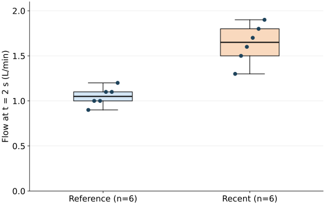

# P3-8.2 변화 신호를 어디까지 말하고 원인은 어디서 멈추는가

> Section ID: `P3-8.2`
> Version: `v2026.09.20`

그림에서 최근 값이 기준보다 높아 보이면 무엇을 말할 수 있을까요? 먼저 관측한 차이를 설명할 수 있습니다. 그러나 “센서가 고장 났기 때문”이라는 원인까지 그림에 들어 있는 것은 아닙니다. [해석 경계](../../../reference/concept-glossary-parts/14-hieut.md#glossary-interpretation-boundary)는 관측한 내용, 원인 후보, 확인할 기록을 구분하는 데서 시작합니다.

## 같은 원시값을 점과 상자로 읽기

[P3-4.1](../chapter-04/section-01.md)의 기존 [가상 측정 로그](../../../assets/part-03/chapter-04/p3_4_1_measurement_log.csv)를 다시 사용합니다. 각 동작의 `elapsed_seconds=2`인 행에서 `flow` 하나씩을 꺼냅니다. `is_recent=0`인 여섯 동작을 비교군(Reference), `is_recent=1`인 여섯 동작을 최근군(Recent)으로 묶습니다. 한 점은 한 동작의 2초 시점 유량이며, 후반 평균이나 동작 내부 하강률이 아닙니다.

| 그룹 | 동작 ID 순서 | 그 순서의 유량 (L/min) |
| --- | --- | --- |
| 비교군 | E02, E04, E06, E08, E10, E12 | 1.2, 1.0, 1.1, 1.1, 1.0, 0.9 |
| 최근군 | E01, E03, E05, E07, E09, E11 | 1.6, 1.8, 1.3, 1.5, 1.9, 1.7 |

이 자료의 구분 표시는 비교 연습용입니다. 실제 날짜, 설비 설정, 재료 묶음 정보가 없으므로 두 그룹의 조건이 같거나 비교군이 정상이라고 검증된 것은 아닙니다. 그림에 앞서 어느 범위의 관측인지 확인해야 한다는 한계도 함께 남깁니다.

가로축은 비교군과 최근군이고 시간 순서가 아닙니다. 세로축은 두 그룹이 공유하는 유량 눈금(L/min)입니다. 점의 좌우 위치는 겹침을 피하려고 조금 벌린 것이며 추가 변수를 뜻하지 않습니다. 그림의 수염은 최솟값과 최댓값까지 뻗습니다. 다른 상자그림에서는 수염 규칙이 다를 수 있으므로 범례나 설명을 확인해야 합니다.

중앙값은 값을 작은 순서로 놓았을 때 가운데 값입니다. 여섯 값이면 가운데 두 값의 평균을 씁니다. 비교군은 `0.9, 1.0, 1.0, 1.1, 1.1, 1.2`이므로 중앙값은 `(1.0+1.1)/2=1.05`이고, 최근군은 `1.3, 1.5, 1.6, 1.7, 1.8, 1.9`이므로 `(1.6+1.7)/2=1.65`입니다. 따라서 관측 중앙값 차이는 `1.65−1.05=0.60 L/min`입니다.

상자는 아래 사분위수(Q1)부터 위 사분위수(Q3)까지, 즉 가운데 50%를 요약하는 구간입니다. 이 그림에서는 정렬된 여섯 값을 아래 세 개와 위 세 개로 나누고 각각의 중앙값을 Q1과 Q3로 정합니다. 계산 방식에 따라 작은 표본의 사분위수는 달라질 수 있으므로 여기서는 이 규칙을 고정합니다.

| 그룹 | Q1 | 중앙값 | Q3 | 사분위 범위 Q3−Q1 (L/min) |
| --- | ---: | ---: | ---: | ---: |
| 비교군 | 1.00 | 1.05 | 1.10 | 0.10 |
| 최근군 | 1.50 | 1.65 | 1.80 | 0.30 |

최근군의 상자는 세로로 더 길어 가운데 구간의 퍼짐이 더 큽니다. 가로 폭은 두 상자를 똑같이 그리기 위한 설정이며 산포를 나타내지 않습니다. 사분위 범위는 분산 자체가 아니고, 표본 여섯 건의 차이가 장기적인 불안정이나 안전 문제를 확정하지도 않습니다. 좌우로 나뉜 두 그룹을 시간이 갈수록 증가한 궤적으로 읽어서도 안 됩니다.

## 같은 차이에 여러 원인 후보 붙이기

“최근군의 관측 중앙값이 0.60 L/min 높다”는 계산 결과입니다. “센서 오류 때문에 0.60 L/min 높다”는 아직 확인하지 않은 원인을 붙인 문장입니다. 같은 높은 측정값에는 아래처럼 서로 다른 설명이 가능하며, 이 표는 실제 발생 사실이 아니라 확인할 가설을 정리한 것입니다.

| 원인 후보 | 다음에 볼 기록 | 구분하려는 내용 |
| --- | --- | --- |
| 센서가 실제보다 높게 측정함 | 같은 시점의 독립 기준계 측정값과 교정 이력 | 실제 유량과 센서 표시가 함께 높았는가 |
| 유량 설정값이 높아짐 | 동작별 설정값·제어 변경 이력 | 같은 설정에서도 차이가 남는가 |
| 재료나 운전 조건의 구성이 달라짐 | 동작별 재료 묶음·운전 조건 기록 | 같은 조건끼리 묶어도 차이가 남는가 |

설정 변경 기록이 발견되어도 그것만으로 단독 원인이 증명되지는 않습니다. 센서 교체나 재료 변경이 같은 시기에 있었을 수 있습니다. 시간 대응과 다른 후보를 함께 확인하고, 필요하면 조건을 통제한 추가 비교를 설계합니다. 값이 함께 움직였다는 관찰과 한쪽이 다른 쪽을 일으켰다는 주장은 구분합니다.

## 변화 관찰과 원인 판단 사이의 경계 {#_1}

```mermaid
--8<-- "assets/part-03/chapter-08/p3-8-2-mermaid-01-ko.mmd"
```

이 사례에서 남길 수 있는 기록은 “각 여섯 동작의 2초 시점 유량에서 최근군 중앙값이 0.60 L/min 높았다. 그룹 간 조건 차이와 센서 상태는 미확인이다. 우선 동작별 설정 이력과 같은 시점의 기준계 기록을 확인한다”입니다. 추가 기록을 확보했다는 사실과 그 기록으로 원인을 검증했다는 판단도 나누어 남깁니다. 원인 미확인은 필요한 점검을 중단한다는 뜻이 아닙니다.

## 직접 확인하기

“최근군 상자가 세 배 길므로 분산이 세 배이고, 센서 고장이 확정됐다”를 관찰 문장과 확인 행동으로 고쳐 보세요.

해설: 이 규칙에서 사분위 범위는 `0.30/0.10=3`배이지만 분산을 계산한 것은 아닙니다. “최근군의 관측 사분위 범위는 0.30 L/min으로 비교군의 0.10 L/min보다 크다. 원인은 미확인이므로 같은 시점 기준계 값과 교정 이력을 확인한다”라고 고칠 수 있습니다. 설정·재료 차이도 후보로 남아 있으므로 그 기록 역시 확인해야 합니다.

## 체크리스트

- 원시값에서 두 중앙값과 사분위 범위를 계산하고 그림의 세로축·상자·수염과 연결할 수 있는가?
- 그림에서 관측한 차이와 확인하지 않은 원인을 서로 다른 문장으로 쓸 수 있는가?
- 원인 후보마다 이를 구분할 추가 기록을 지정할 수 있는가?

## 출처와 참고 자료

- [NIST/SEMATECH, Box Plot](https://www.itl.nist.gov/div898/handbook/eda/section3/boxplot.htm){: target="_blank" rel="noopener noreferrer" } — 중앙값·사분위 구간과 여러 수염 규칙의 설명을 참고했습니다. 그림은 기존 가상 로그로 자체 생성했습니다. 확인일: 2026-09-20.
- [NIST/SEMATECH, Scatter Plot](https://www.itl.nist.gov/div898/handbook/eda/section3/scatterp.htm){: target="_blank" rel="noopener noreferrer" } — 관측된 연관만으로 인과를 증명할 수 없다는 설명을 참고했습니다. 확인일: 2026-09-20.
