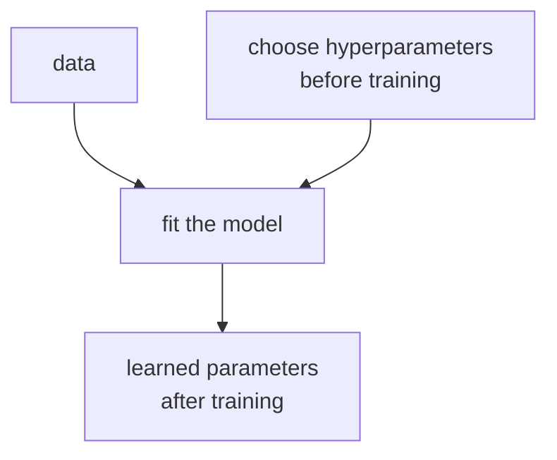

# P3-9.1 하이퍼파라미터(hyperparameter)

P3-8에서는 모델 후보를 고르고, baseline으로 비교의 출발점을 세웠습니다. 이제 다음 질문으로 넘어갑니다.

`같은 모델 계열이라도, 어떤 설정값으로 학습시킬 것인가?`

이 질문이 바로 하이퍼파라미터(hyperparameter)의 출발점입니다.

초심자는 종종 하이퍼파라미터를 `복잡한 고급 옵션`처럼 이해합니다. 하지만 실제로는 훨씬 더 기본적인 개념입니다. 하이퍼파라미터는 모델이 학습을 시작하기 전에 사람이 먼저 정해 두는 설정값입니다. 즉, 모델이 데이터에서 스스로 배우는 값이 아니라, 어떤 방식으로 배우게 할지를 바깥에서 정하는 값입니다.

scikit-learn 문서는 하이퍼파라미터를 `estimator 내부에서 직접 학습되지 않는 파라미터`라고 설명합니다. 같은 문서는 이런 값들이 추정기(estimator)를 만들 때 생성자 인자로 전달된다고 설명합니다. 초심자 기준으로는 다음처럼 이해하면 충분합니다.

`하이퍼파라미터는 모델이 배울 규칙 자체가 아니라, 그 모델이 어떤 모양과 강도로 배우게 할지를 미리 정하는 값이다.`

## 이 절의 범위

이 절은 다음 질문에 답합니다.

- 하이퍼파라미터(hyperparameter)는 무엇인가?
- 학습으로 바뀌는 값과 사람이 미리 정하는 값은 어떻게 다른가?
- 왜 같은 알고리즘도 하이퍼파라미터에 따라 전혀 다르게 보일 수 있는가?
- 초심자가 처음 구분해야 할 대표 하이퍼파라미터는 무엇인가?

이 절은 다음 내용은 깊게 다루지 않습니다.

- GridSearchCV, RandomizedSearchCV의 세부 사용법
- 탐색 공간(search space) 설계의 고급 전략
- 대규모 튜닝 자동화와 분산 실험 관리

그 내용은 다음 절 P3-9.2 튜닝(tuning)과 검증 비용에서 이어서 다룹니다.

## 이 절의 목표

- 하이퍼파라미터를 `학습 전에 정하는 설정값`으로 설명할 수 있습니다.
- 모델 파라미터(parameter)와 하이퍼파라미터(hyperparameter)를 구분할 수 있습니다.
- 같은 알고리즘도 하이퍼파라미터 값에 따라 복잡도, 일반화, 계산 비용이 달라질 수 있다는 점을 말할 수 있습니다.
- 다음 절에서 왜 튜닝(tuning)이라는 별도 작업이 필요한지 자연스럽게 이해할 수 있습니다.

## 이 절이 커리큘럼에서 필요한 이유

P3-8.2까지 오면 초심자는 이런 오해를 하기 쉽습니다.

`후보 모델만 고르면 이제 비교가 자동으로 되는 것 아닌가?`

하지만 실제로는 그렇지 않습니다. 같은 알고리즘 이름 아래에도 여러 설정이 숨어 있기 때문입니다.

- 결정트리(decision tree)는 얼마나 깊게 자랄지 정해야 합니다.
- k-NN은 이웃을 몇 개 볼지 정해야 합니다.
- 로지스틱 회귀(logistic regression)는 규제(regularization)를 얼마나 강하게 걸지 정해야 합니다.

즉, 모델 선택(model selection)이 `어떤 계열을 시험할 것인가`를 정하는 단계였다면, 하이퍼파라미터는 `그 계열을 어떤 설정으로 시험할 것인가`를 정하는 단계입니다.

| 커리큘럼 위치 | 이 절의 역할 |
| --- | --- |
| P3-8 모델 선택 뒤 | 같은 모델 계열 안의 설정 차이를 이해하게 함 |
| P3-9.2 튜닝 전 | 왜 탐색과 검증 비용이 생기는지 준비시킴 |
| P3-10 이후 알고리즘 절 전 | 각 알고리즘 장에서 반복될 설정값 이름에 익숙해지게 함 |

즉, 이 절은 `모델 이름을 아는 것`에서 `모델 설정을 읽는 것`으로 넘어가는 입구입니다.

## 파라미터(parameter)와 하이퍼파라미터(hyperparameter)는 어떻게 다른가

초심자에게 가장 먼저 필요한 구분은 이것입니다.

| 구분 | 누가 정하는가 | 예시 |
| --- | --- | --- |
| 모델 파라미터(parameter) | 데이터로부터 학습 과정에서 정해짐 | 선형회귀의 가중치(weight), 절편(intercept) |
| 하이퍼파라미터(hyperparameter) | 사람이 학습 전에 정함 | `max_depth`, `n_neighbors`, `C` |

이 구분은 머신러닝 전체에서 반복해서 등장합니다.

- 파라미터는 모델이 학습으로 `얻는 값`
- 하이퍼파라미터는 사람이 실험 설계에서 `먼저 넣는 값`

이 차이를 아주 짧게 그리면 다음과 같습니다.



이 도식의 핵심은 `하이퍼파라미터는 학습의 입력`이고, `파라미터는 학습의 결과`라는 점입니다.

## 왜 같은 알고리즘도 설정에 따라 달라지는가

하이퍼파라미터는 단지 옵션 이름이 아닙니다. 모델이 데이터를 보는 방식 자체를 바꿀 수 있습니다.

예를 들어 결정트리(decision tree)를 생각해 보겠습니다.

- `max_depth=1`이면 매우 얕은 규칙만 만듭니다.
- `max_depth=10`이면 훨씬 복잡한 규칙을 만들 수 있습니다.

둘 다 같은 결정트리지만, 실제로는 거의 다른 성격의 모델처럼 동작할 수 있습니다.

이 차이를 초심자 기준으로 정리하면 다음과 같습니다.

| 하이퍼파라미터 변화 | 자주 바뀌는 것 |
| --- | --- |
| 모델 복잡도(complexity) | 얼마나 세밀하게 맞추는가 |
| 일반화(generalization) | 새 데이터에서 버티는가 |
| 계산 비용(computational cost) | 학습과 예측에 시간이 얼마나 드는가 |
| 결과 해석 가능성(interpretability) | 사람이 읽기 쉬운가 |

즉, 하이퍼파라미터는 모델의 `성격`을 바꾸는 손잡이처럼 볼 수 있습니다.

## 자주 만나는 하이퍼파라미터 예시

처음부터 모든 알고리즘의 설정을 외울 필요는 없습니다. 입문 단계에서는 어떤 종류의 설정이 반복되는지만 잡으면 충분합니다.

| 모델 계열 | 대표 하이퍼파라미터 | 초심자용 질문 |
| --- | --- | --- |
| 결정트리(decision tree) | `max_depth` | 트리를 어디까지 깊게 자라게 할까? |
| k-NN | `n_neighbors` | 몇 개 이웃을 보고 판단할까? |
| 로지스틱 회귀(logistic regression) | `C` | 규제를 얼마나 약하게 또는 강하게 둘까? |
| 랜덤포레스트(random forest) | `n_estimators` | 몇 개 트리를 합칠까? |
| SVM | `kernel`, `C`, `gamma` | 어떤 경계를 만들고 얼마나 민감하게 반응할까? |

이 표의 목적은 세부 공식을 가르치는 것이 아닙니다. 오히려 `하이퍼파라미터 이름은 달라도, 결국 모델의 복잡도·민감도·규제 강도·계산량을 조절하는 경우가 많다`는 감각을 만드는 데 있습니다.

즉, 앞 절에서 본 `성격을 바꾸는 손잡이`가 실제로는 이런 이름으로 등장한다고 이해하면 됩니다. 이제 다음 질문이 자연스럽게 따라옵니다.

`이런 설정값들은 왜 예전부터 별도 문제로 다뤄졌을까?`

## 하이퍼파라미터는 왜 별도 주제가 되었는가

하이퍼파라미터의 역사적 배경을 아주 거칠게 요약하면 다음 흐름으로 볼 수 있습니다.

1. 초기에는 연구자와 실무자가 경험적으로 값을 손으로 조정했다.
2. 이후에는 미리 정한 후보표를 전부 시험하는 격자 탐색(grid search)이 널리 쓰였다.
3. 모델과 데이터가 복잡해지면서, 하이퍼파라미터 탐색 자체가 독립된 연구 주제가 되었다.

Marc Claesen과 Bart De Moor의 정리 논문은 많은 학습 알고리즘이 훈련 전에 정해야 하는 하이퍼파라미터를 가지며, 그 값 선택이 성능에 큰 영향을 준다고 설명합니다. 같은 논문은 실제 현장에서 하이퍼파라미터 탐색이 오랫동안 수동 조정(manual search), 경험 규칙(rules of thumb), 격자 탐색(grid search) 중심으로 수행되었다고 정리합니다.

이 설명을 초심자 기준으로 바꾸면 다음처럼 읽을 수 있습니다.

`머신러닝에서는 오래전부터 알고리즘 자체만큼이나, 그 알고리즘의 설정값을 얼마나 잘 맞추느냐가 결과를 크게 좌우했다.`

James Bergstra, Daniel Yamins, David Cox는 2012년 논문에서 컴퓨터 비전 알고리즘들이 다양한 설정값에 의존하며, 이런 튜닝이 흔히 부수적인 일처럼 취급되지만 실제로는 성능 평가에 결정적일 수 있다고 지적합니다. 이 논문은 더 나아가, 어떤 방법이 정말 더 좋은지 아니면 단지 더 잘 튜닝된 것인지 구분하기 어려울 수 있다고 설명합니다.

초심자에게 중요한 메시지는 이것입니다.

- 하이퍼파라미터는 최근에 갑자기 붙은 옵션이 아닙니다.
- 오래전부터 `알고리즘 비교를 공정하게 만들기 어렵게 하는 요소`였습니다.
- 그래서 하이퍼파라미터 탐색은 점점 `개인의 감`이 아니라 `재현 가능한 절차`로 다루어질 필요가 커졌습니다.

즉, 하이퍼파라미터의 역사는 `옵션이 많아졌다`는 이야기가 아니라 `모델 비교를 더 공정하게 만들 필요가 커졌다`는 이야기로 읽는 편이 맞습니다.

## 실증 사례로 보면 왜 별도 문제가 되었는가

역사 설명만으로는 감이 약할 수 있습니다. 실제로는 하이퍼파라미터가 `부가 옵션`이 아니라 결과를 크게 흔드는 요소라는 점이 여러 사례에서 반복해서 관찰되었습니다.

### 사례 1. 컴퓨터 비전에서는 같은 계열도 튜닝에 따라 비교가 흔들렸다

Bergstra, Yamins, Cox의 2012년 논문은 많은 컴퓨터 비전 알고리즘이 다양한 설정값에 의존하며, 이 설정을 어떻게 맞추느냐가 알고리즘의 잠재력을 평가하는 데 결정적일 수 있다고 설명합니다. 이 논문은 자동화된 모델 탐색 절차를 사용해 얼굴 검증(LFW), 얼굴 식별(PubFig83), 객체 인식(CIFAR-10) 같은 서로 다른 세 과제에서 강한 결과를 보고합니다.

초심자 관점에서 이 사례가 중요한 이유는 단순합니다.

- `어떤 알고리즘이 더 좋다`는 말만으로는 충분하지 않습니다.
- 같은 알고리즘 계열도 설정값이 다르면 전혀 다른 수준으로 보일 수 있습니다.
- 그래서 알고리즘 비교와 하이퍼파라미터 비교를 떼어 놓기 어렵습니다.

### 사례 2. 격자 탐색(grid search)은 항상 효율적이지 않았다

Bergstra와 Bengio의 2012년 JMLR 논문은 하이퍼파라미터 공간에서 실제 성능에 큰 영향을 주는 값이 일부만 중요한 경우가 많다고 설명합니다. 이 논문은 이런 상황에서는 grid search보다 random search가 더 효율적일 수 있다고 보였습니다.

초심자 기준으로는 다음처럼 이해하면 충분합니다.

- 모든 축을 같은 간격으로 촘촘히 보는 방식이 항상 좋은 것은 아닙니다.
- 실제로는 몇몇 중요한 하이퍼파라미터가 결과를 많이 흔들고, 다른 값은 덜 중요할 수 있습니다.
- 그래서 `많이 돌렸다`가 아니라 `어떤 공간을 어떻게 봤는가`가 중요해졌습니다.

즉, 하이퍼파라미터 문제는 단순히 값을 많이 바꾸어 보는 일이 아니라, `탐색 방법 자체를 설계하는 문제`로 발전했습니다.

### 사례 3. 지금 이 절의 작은 결정트리 예제도 같은 현상을 보여 준다

위의 Python 예제는 아주 작은 장난감 실험이지만, 하이퍼파라미터의 실증적 의미를 그대로 보여 줍니다.

- `max_depth=1`에서는 train과 test 점수가 둘 다 낮습니다.
- `max_depth=3`에서는 train 점수와 test 점수가 함께 올라갑니다.
- `max_depth=None`에서는 train 점수는 최고가 되지만 test 점수는 오히려 약해질 수 있습니다.

이 작은 예시만 보아도 하이퍼파라미터는 다음 세 가지를 동시에 흔들 수 있습니다.

| 관찰 | 뜻 |
| --- | --- |
| train 점수 상승 | 모델이 훈련 데이터를 더 잘 따라감 |
| test 점수 정체 또는 하락 | 일반화가 항상 같이 좋아지지는 않음 |
| 같은 알고리즘, 다른 결과 | 설정값 자체가 비교 대상이 됨 |

즉, 하이퍼파라미터의 역사는 거창한 별도 분야의 역사이기만 한 것이 아닙니다. 작은 실습에서도 바로 확인되는 문제였고, 그 문제가 커지면서 연구와 실무의 공통 주제가 된 것입니다.

## 하이퍼파라미터는 왜 사람이 직접 정해야 하는가

scikit-learn의 하이퍼파라미터 튜닝 문서는 이런 값들이 추정기 내부에서 직접 학습되지 않으므로, 교차검증(cross-validation) 점수를 기준으로 탐색하는 것이 가능하고 권장된다고 설명합니다. 이 설명을 초심자 기준으로 바꾸면 다음과 같습니다.

`하이퍼파라미터는 데이터가 스스로 알려 주지 않기 때문에, 여러 값을 시험해 보고 검증 점수로 비교해야 한다.`

즉, 데이터가 모델 파라미터를 직접 학습하게 해 주더라도, 하이퍼파라미터는 보통 `실험을 통해` 골라야 합니다.

그래서 하이퍼파라미터가 등장하면 자연스럽게 다음 절의 질문이 따라옵니다.

`어떤 값들을 어디까지 시험해야 하는가?`

그 질문이 바로 튜닝(tuning)입니다.

## 실무에서는 왜 하이퍼파라미터를 함부로 늘리면 안 되는가

초심자는 종종 하이퍼파라미터를 많이 만질수록 성능이 계속 좋아질 것처럼 느낍니다. 하지만 실제로는 반대 위험도 큽니다.

- 실험 횟수가 급격히 늘어날 수 있습니다.
- 검증 데이터를 자꾸 들여다보며 과적합될 수 있습니다.
- 우연히 좋아 보이는 설정을 `진짜 개선`으로 오해할 수 있습니다.

scikit-learn의 common pitfalls 문서는 테스트 데이터가 모델 선택에 들어오면 성능 추정이 지나치게 낙관적으로 보일 수 있다고 설명합니다. 이 위험은 전처리뿐 아니라 하이퍼파라미터 선택에서도 같은 방향으로 나타납니다. 즉, 테스트 데이터를 보며 설정을 고르면 `모델을 잘 만든 것`이 아니라 `테스트에 맞춰 버린 것`일 수 있습니다.

초심자에게는 다음 규칙이 중요합니다.

1. train과 test는 먼저 나눕니다.
2. 하이퍼파라미터 비교는 train 안의 검증 절차로 합니다.
3. test는 마지막 확인에만 둡니다.

이 절에서는 이 원칙만 기억하면 충분합니다. 실제 탐색 방법은 다음 절에서 다룹니다.

## 작은 예시로 감 잡기

같은 결정트리라도 깊이를 다르게 주면 어떻게 달라질까요?

아래는 매우 작은 장난감 예시입니다.

| 설정 | 초심자 직관 |
| --- | --- |
| `max_depth=1` | 아주 단순한 규칙만 허용 |
| `max_depth=3` | 조금 더 복잡한 규칙 허용 |
| `max_depth=None` | 멈출 조건 전까지 계속 깊어질 수 있음 |

이 표만 보아도, 하이퍼파라미터는 `모델 종류`를 바꾸지 않더라도 `모델의 행동 범위`를 바꾼다는 점을 알 수 있습니다.

## Python 예제로 하이퍼파라미터 차이 보기

아래 예제는 같은 결정트리 알고리즘에서 `max_depth`만 바꾸어 학습 결과가 어떻게 달라지는지 보는 실습입니다.

- 문제 상황: 꽃 데이터(iris)를 품종 분류(classification) 문제로 다룹니다.
- 입력(input): 꽃받침 길이, 너비, 꽃잎 길이, 너비 네 개의 특징(feature)
- 정답(label): 세 가지 품종(class)
- 확인할 개념: 같은 알고리즘도 하이퍼파라미터가 바뀌면 train 점수와 test 점수가 달라질 수 있다

```python
from sklearn.datasets import load_iris
from sklearn.model_selection import train_test_split
from sklearn.tree import DecisionTreeClassifier

X, y = load_iris(return_X_y=True)

X_train, X_test, y_train, y_test = train_test_split(
    X, y, test_size=0.3, random_state=42, stratify=y
)

for depth in [1, 3, None]:
    model = DecisionTreeClassifier(max_depth=depth, random_state=42)
    model.fit(X_train, y_train)

    train_score = model.score(X_train, y_train)
    test_score = model.score(X_test, y_test)

    print(f"max_depth={depth}")
    print("  train accuracy:", round(train_score, 3))
    print("  test accuracy :", round(test_score, 3))
    print("  tree depth    :", model.get_depth())
    print()
```

실행 결과 예시는 다음과 같습니다.

```text
max_depth=1
  train accuracy: 0.667
  test accuracy : 0.667
  tree depth    : 1

max_depth=3
  train accuracy: 0.981
  test accuracy : 0.933
  tree depth    : 3

max_depth=None
  train accuracy: 1.0
  test accuracy : 0.911
  tree depth    : 5
```

이 예제가 보여 주는 것은 단순합니다.

- 같은 결정트리라도 `max_depth` 값이 달라지면 결과가 달라집니다.
- 깊이를 무한히 허용하면 train 정확도는 아주 높아질 수 있습니다.
- 하지만 test 정확도는 꼭 같이 좋아지지 않을 수 있습니다.

즉, 하이퍼파라미터는 `모델 종류를 바꾸지 않고도 일반화 성질을 바꾸는 설정값`입니다.

## `random_state`는 어떤 하이퍼파라미터인가

초심자가 자주 헷갈리는 값이 `random_state`입니다.

이 값은 보통 모델의 복잡도를 직접 바꾸지는 않지만, 난수(randomness)가 들어가는 학습이나 데이터 분할에서 같은 결과를 재현할 수 있게 도와주는 설정값입니다.

scikit-learn 문서는 어떤 추정기와 교차검증 분할기가 본질적으로 무작위성을 가지며, `random_state`가 그 무작위성을 제어한다고 설명합니다. 입문 단계에서는 다음처럼 이해하면 충분합니다.

`random_state는 성능을 높이는 손잡이라기보다, 실험을 다시 했을 때 같은 결과를 확인하기 쉽게 만드는 손잡이다.`

그래서 `random_state`는 다른 하이퍼파라미터와 역할이 약간 다릅니다.

| 하이퍼파라미터 종류 | 대표 역할 |
| --- | --- |
| 모델 성격을 바꾸는 값 | `max_depth`, `n_neighbors`, `C` |
| 실험 재현성을 돕는 값 | `random_state` |

이 구분은 뒤에서 실험 비교를 정리할 때 특히 중요합니다.

## 이 절에서 기억할 관점

- 하이퍼파라미터는 학습 전에 사람이 정하는 설정값이다.
- 파라미터는 데이터로부터 배우고, 하이퍼파라미터는 실험 설계에서 먼저 넣는다.
- 같은 알고리즘도 하이퍼파라미터에 따라 복잡도, 일반화, 계산 비용이 달라질 수 있다.
- 하이퍼파라미터를 많이 건드리는 일은 곧 실험 비용과 검증 비용을 늘리는 일이다.
- `random_state`는 모델 복잡도보다 재현성과 관련된 특별한 설정값으로 자주 등장한다.

## 체크리스트

- 지금 보고 있는 값이 학습되는 파라미터인가, 미리 정하는 하이퍼파라미터인가?
- 같은 알고리즘이라도 설정값이 바뀌면 결과가 달라질 수 있다는 점을 이해했는가?
- train 점수와 test 점수를 함께 보아야 하는 이유를 설명할 수 있는가?
- `random_state`가 성능 향상보다 재현성과 더 관련 깊다는 점을 구분했는가?
- 다음 절에서 왜 `탐색 범위`와 `검증 비용`을 같이 봐야 하는지 예상할 수 있는가?

## 다음 절과의 연결

이 절은 하이퍼파라미터가 `무엇인지`를 설명하는 도입 절입니다. 다음 절 P3-9.2에서는 그 값을 실제로 어떻게 탐색할지, 왜 탐색 범위를 넓히면 계산 비용과 검증 비용이 같이 커지는지, 그리고 baseline 이후의 개선을 어떻게 해석해야 하는지를 이어서 다룹니다.

또한 뒤의 알고리즘 절로 가면 각 모델마다 대표 하이퍼파라미터가 다시 등장합니다.

- P3-10 선형회귀(linear regression)
- P3-11 로지스틱 회귀(logistic regression)
- P3-12 k-NN
- P3-13 SVM
- P3-14 결정트리(decision tree)
- P3-15 랜덤포레스트(random forest)

즉, 이 절은 뒤 알고리즘 장에서 설정값을 읽어 낼 공통 언어를 먼저 만드는 절입니다.

## 출처와 참고 자료

- scikit-learn, `Glossary of Common Terms and API Elements`, scikit-learn User Guide, 확인 날짜: 2026-06-26. [https://scikit-learn.org/stable/glossary.html](https://scikit-learn.org/stable/glossary.html){: target="_blank" rel="noopener noreferrer" }
- scikit-learn, `3.2. Tuning the hyper-parameters of an estimator`, scikit-learn User Guide, 확인 날짜: 2026-06-26. [https://scikit-learn.org/stable/modules/grid_search.html](https://scikit-learn.org/stable/modules/grid_search.html){: target="_blank" rel="noopener noreferrer" }
- scikit-learn, `12. Common pitfalls and recommended practices`, scikit-learn User Guide, 확인 날짜: 2026-06-26. [https://scikit-learn.org/stable/common_pitfalls.html](https://scikit-learn.org/stable/common_pitfalls.html){: target="_blank" rel="noopener noreferrer" }
- Marc Claesen, Bart De Moor, `Hyperparameter Search in Machine Learning`, arXiv, 2015, 확인 날짜: 2026-06-26. [https://arxiv.org/abs/1502.02127](https://arxiv.org/abs/1502.02127){: target="_blank" rel="noopener noreferrer" }
- James Bergstra, Daniel Yamins, David D. Cox, `Making a Science of Model Search`, arXiv, 2012, 확인 날짜: 2026-06-26. [https://arxiv.org/abs/1209.5111](https://arxiv.org/abs/1209.5111){: target="_blank" rel="noopener noreferrer" }
- James Bergstra, Yoshua Bengio, `Random Search for Hyper-Parameter Optimization`, Journal of Machine Learning Research, 2012, 확인 날짜: 2026-06-26. [https://jmlr.org/beta/papers/v13/bergstra12a.html](https://jmlr.org/beta/papers/v13/bergstra12a.html){: target="_blank" rel="noopener noreferrer" }
