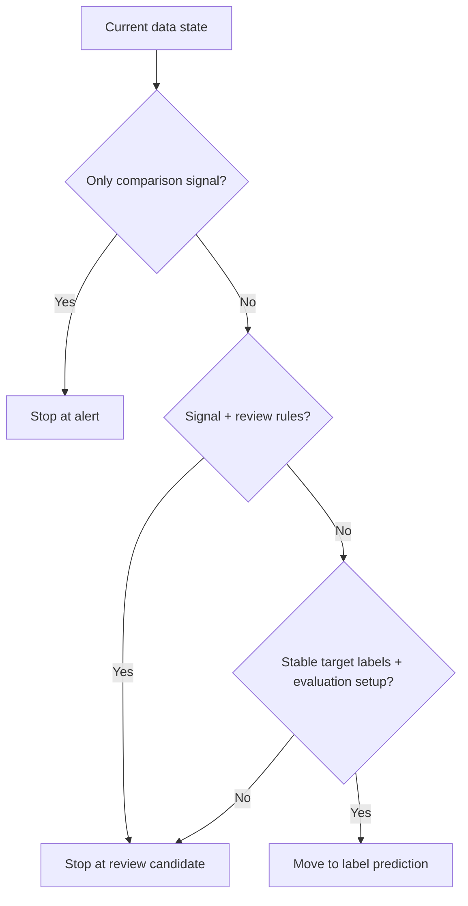

# P3-9.1 지금 문제를 어디까지 올려야 하는가

> Section ID: `P3-9.1`
> Version: `v2026.07.08`

현실 데이터를 보면 `센서 로그가 있고 결과도 조금은 있으니, 바로 분류 문제로 올리면 되지 않을까?`라는 반응이 먼저 나옵니다. 하지만 운영 데이터에서는 이 생각이 너무 빠를 때가 많습니다. 어떤 문제는 정말로 예측 문제로 만들 수 있지만, 어떤 문제는 아직 `검토 후보를 잘 골라 내는 문제`로 남겨 두는 편이 더 정직하며 현재 데이터 상태에도 더 잘 맞습니다. 해석 경계를 세웠다면, 이제는 지금 문제를 경고, 검토 후보, 라벨 예측 중 어디까지 올릴지 정해야 합니다.

이 차이를 보려면 먼저 세 가지를 분리해야 합니다. 경고(alert), 검토 후보(review candidate), 라벨 예측(label prediction)입니다.

| 구분 | 지금 단계에서 뜻하는 것 | 필요한 근거 수준 |
| --- | --- | --- |
| 경고 | 평소와 다른 변화가 보여 먼저 보라고 알림 | 비교 구조와 차이값 |
| 검토 후보 | 사람이 실제로 다시 확인할 가치가 있는 사례 | 변화 신호 + 운영 맥락 + 우선순위 판단 |
| 라벨 예측 | 이미 정의된 목표 라벨(target)을 맞히는 문제 | 비교적 안정된 라벨과 학습 구조 |

경고는 가장 가볍습니다. 기준선과 다른 변화가 보이면 만들 수 있습니다. 검토 후보는 그보다 한 단계 무겁습니다. 변화가 보이고, 사람이 다시 확인할 가치도 있어야 합니다. 반면 라벨 예측은 가장 무겁습니다. 무엇을 맞힐지 목표 라벨(target)이 분명해야 하고, 그 라벨이 비교적 안정적으로 붙어 있어야 하며, 학습과 평가 구조도 준비되어 있어야 합니다.

이 차이를 `문제가 단순한가 복잡한가`로만 읽으면 안 됩니다. 더 중요한 질문은 `지금 데이터 상태에서 무엇을 정직하게 말할 수 있는가`입니다. 경고는 비교 구조만으로도 시작할 수 있지만, 라벨 예측은 그보다 훨씬 더 많은 약속을 필요로 합니다. 따라서 문제를 위로 올릴수록 더 좋은 것이 아니라, 더 강한 근거를 요구하는 문제로 바뀐다고 이해해야 합니다.

현실 문제에서 자주 어려운 것은 바로 이 마지막 단계입니다. 예를 들어 `검토 필요` 같은 운영 판단은 만들 수 있어도, `실제 내부 원인`이나 `고장 유형` 같은 확정 라벨은 부족할 수 있습니다. 한 증상이 여러 원인에서 나올 수도 있고, 나중에 사람이 뒤늦게 원인을 적는 경우도 있습니다. 이런 상황에서 무리하게 분류 문제를 만들면, 라벨 품질이 약한 상태에서 복잡한 문제 틀만 먼저 세우게 됩니다.

그래서 이 절에서는 다음 질문을 먼저 던집니다.

- 지금 당장 필요한 것은 자동 진단인가, 검토 우선순위인가
- 라벨이 실제로 충분한가
- 분류 문제 대신 비교 리포트가 더 현실적인가

다음 표는 세 가지 문제 유형을 더 구체적으로 비교한 것입니다.

| 문제 형태 | 입력 예시 | 출력 예시 | 지금 단계에서 필요한 것 |
| --- | --- | --- | --- |
| 경고 | 최근 구간과 기준선 차이 | `주의` | 비교 구조 |
| 검토 후보 | 차이값 + 반복성 + 운영 조건 | `먼저 확인` | 우선순위 규칙 |
| 라벨 예측 | 동작 단위 특징 표 | `정상/이상` 또는 특정 상태 | 안정된 목표 라벨과 평가 구조 |

세 문제는 `한 단계씩 올라가는 사다리`를 이룹니다. 그래서 현재 데이터 상태에서 어디까지 말할 수 있는지가 더 분명해집니다.

| 단계 | 먼저 있어야 하는 것 | 아직 없으면 올리지 않는 것 |
| --- | --- | --- |
| 경고 | 비교 구조와 차이값 | 원인 라벨 |
| 검토 후보 | 경고 + 반복성 + 운영 우선순위 기준 | 안정된 목표 라벨 |
| 라벨 예측 | 비교적 안정된 목표 라벨과 평가 구조 | 충분한 라벨 없이 복잡한 분류 문제부터 세우는 일 |

즉 `더 높은 단계의 학습 문제로 올리고 싶다`는 이유만으로 바로 위 단계로 올라가는 것이 아니라, 아래 단계의 근거가 충분히 쌓였을 때만 다음 단계로 올라갑니다.

다음 표처럼 `지금 당장 어디서 멈추는가`를 판단하면 무리한 문제 승격을 줄일 수 있습니다.

| 지금 확인한 상태 | 이 단계에서의 산출물 | 아직 올리지 않는 단계 |
| --- | --- | --- |
| 기준선 대비 차이만 안정적으로 보인다 | 경고(alert) | 검토 후보, 라벨 예측 |
| 차이와 함께 반복성, 운영 우선순위 기준도 있다 | 검토 후보(review candidate) | 라벨 예측 |
| 목표 라벨이 비교적 안정적이고 평가 구조도 있다 | 라벨 예측(label prediction) | 없음 |

이 표를 실제 운영 흐름으로 옮기면 보통 다음 순서가 됩니다.

1. 최근 구간과 기준선을 비교해 경고 신호를 만든다.
2. 반복성, 표본 수, 운영 문맥을 더해 검토 후보를 고른다.
3. 그 과정에서 비교적 안정된 운영 라벨이 쌓이면 예측 문제를 검토한다.

즉 예측 문제는 출발점이 아니라, 앞 단계가 어느 정도 정리된 뒤에 올라가는 경우가 많습니다. 이 점은 `모델링 사다리`를 이해하는 데도 중요합니다.

어떤 운영 문제는 끝까지 비교 리포트와 검토 큐(review queue)로 남겨 두는 편이 더 정직할 수도 있습니다. 비교 구조만으로 충분히 지원할 수 있는 판단을 굳이 분류 문제로 끌어올릴 필요는 없습니다.

## 작은 도식으로 보기

```mermaid
flowchart TD
    A[Current data state]
    A --> B{Only comparison signal?}
    B -->|Yes| C[Stop at alert]
    B -->|No| D{Signal + review rules?}
    D -->|Yes| E[Stop at review candidate]
    D -->|No| F{Stable target labels + evaluation setup?}
    F -->|Yes| G[Move to label prediction]
    F -->|No| E
```

이 도식은 문제를 위로 올리는 판단이 `무조건 한 단계 상승`이 아니라, 현재 근거가 어느 수준까지 있는지를 묻는 분기라는 점을 보여 줍니다. 즉 라벨 목록을 찍는 것이 아니라 `경고에서 멈출지`, `검토 후보까지 갈지`, `라벨 예측으로 올릴지`를 단계별로 가르는 판단 구조입니다.

즉 `위로 올릴수록 더 고급`이라기보다, `위로 올릴수록 더 강한 전제와 근거가 필요`하다고 보는 편이 정확합니다.

이 예제는 지금 만들 수 있는 문제 형태와 아직 올리기 어려운 문제 형태를 다음 순서로 보여 줍니다.

1. 이미 있는 라벨이 `review_needed`인지 `root_cause_label`인지 구분한다.
2. 지금 있는 라벨만으로 만들 수 있는 문제 형태가 경고인지, 검토 후보인지, 라벨 예측인지 판단한다.
3. 비어 있는 라벨을 억지로 상상해서 모델 문제를 올리지 않는다는 원칙을 확인한다.

핵심은 `경고는 변화 신호이고, 검토 후보는 운영 우선순위이며, 라벨 예측은 그보다 더 강한 문제 설정이다`는 점입니다. 다음 절에서는 바로 이 구분을 바탕으로, 어떤 문제를 끝까지 비교 리포트로 남기는 편이 더 정직한지 정리합니다.

## 출처와 참고 자료

- U.S. Bureau of Labor Statistics(BLS), *BLS Handbook of Methods: Glossary*, baseline. [https://www.bls.gov/bls/glossary.htm](https://www.bls.gov/bls/glossary.htm){: target="_blank" rel="noopener noreferrer" }
- National Cancer Institute(NCI), *NCI Dictionary of Cancer Terms: baseline*, baseline. [https://www.cancer.gov/publications/dictionaries/cancer-terms/def/baseline](https://www.cancer.gov/publications/dictionaries/cancer-terms/def/baseline){: target="_blank" rel="noopener noreferrer" }
- Google, *Machine Learning Glossary*, `label`, `labeled example`, `proxy labels`, 확인일 2026-07-08. [https://developers.google.com/machine-learning/glossary](https://developers.google.com/machine-learning/glossary){: target="_blank" rel="noopener noreferrer" }
- NIST/SEMATECH, *e-Handbook of Statistical Methods: What are Control Charts?*, signal detection and process monitoring. [https://www.itl.nist.gov/div898/handbook/pmc/section3/pmc32.htm](https://www.itl.nist.gov/div898/handbook/pmc/section3/pmc32.htm){: target="_blank" rel="noopener noreferrer" }
