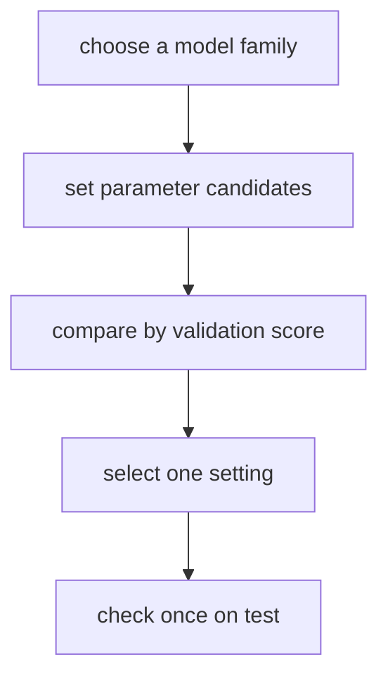
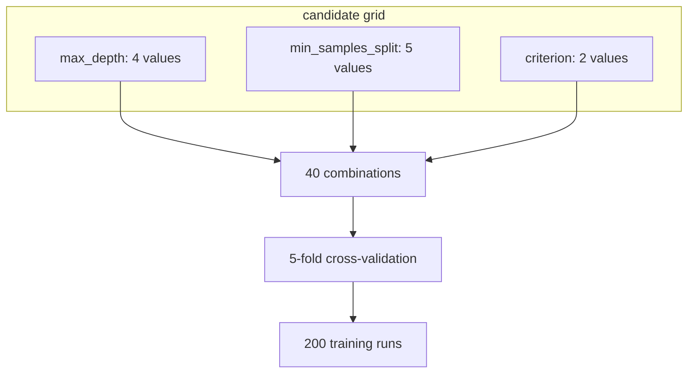
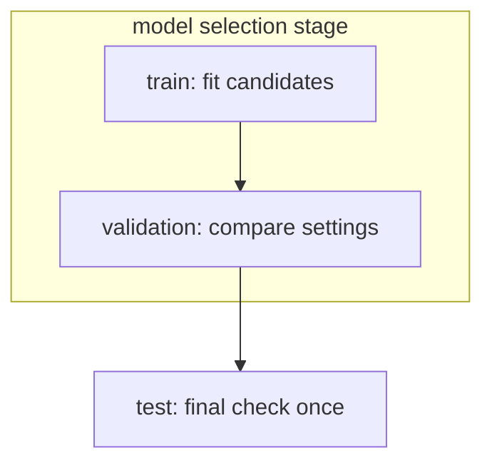
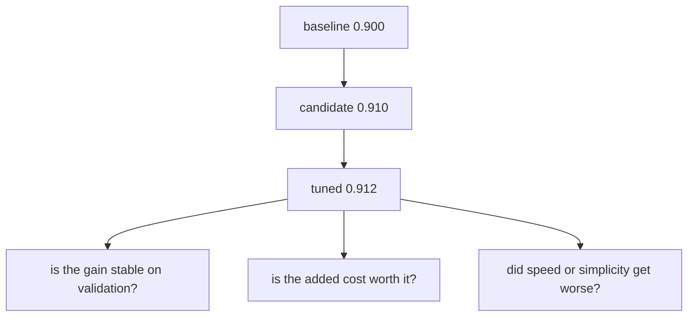

# P3-9.2 튜닝(tuning)과 검증 비용

P3-9.1에서는 하이퍼파라미터(hyperparameter)가 무엇인지, 왜 오래전부터 별도 문제로 다뤄졌는지 봤습니다. 이제 다음 질문으로 넘어갑니다.

`좋아 보이는 설정값을 실제로 어떻게 고를 것인가?`

이 질문이 바로 튜닝(tuning)의 출발점입니다.

초심자는 종종 튜닝을 `값을 이것저것 많이 바꿔 보는 일`처럼 이해합니다. 하지만 실제로는 그보다 더 좁고 엄격한 작업입니다. 튜닝은 단순히 성능 숫자를 올리는 과정이 아니라, 검증 가능한 절차 안에서 하이퍼파라미터 후보를 비교하고, 그 비교에 드는 계산 비용과 검증 비용을 함께 관리하는 일입니다.

즉, 튜닝은 `더 좋은 값 찾기`이기도 하지만, 동시에 `비교를 망치지 않는 실험 설계`이기도 합니다.

## 이 절의 범위

이 절은 다음 질문에 답합니다.

- 튜닝(tuning)은 무엇을 하는 작업인가?
- 왜 하이퍼파라미터를 많이 만진다고 항상 좋은 것이 아닌가?
- 검증 비용(validation cost)은 왜 생기는가?
- test 데이터를 마지막에만 써야 하는 이유는 무엇인가?
- grid search와 random search를 초심자 수준에서 어떻게 이해하면 좋은가?

이 절은 다음 내용은 깊게 다루지 않습니다.

- Bayesian optimization, Hyperband 같은 고급 탐색 기법
- nested cross-validation의 세부 절차
- 분산 튜닝 인프라와 실험 추적 시스템

그 내용은 뒤의 알고리즘 절이나 프로젝트 파트에서 다시 다룰 수 있습니다.

## 이 절의 목표

- 튜닝을 `검증 절차 안에서 설정값을 비교하는 일`로 설명할 수 있습니다.
- 계산 비용(computational cost)과 검증 비용(validation cost)을 구분할 수 있습니다.
- test 데이터를 자꾸 보며 설정을 고르면 왜 위험한지 설명할 수 있습니다.
- grid search와 random search의 차이를 초심자 수준에서 말할 수 있습니다.
- baseline 이후의 개선을 읽을 때 왜 튜닝 로그보다 검증 절차가 더 중요한지 이해할 수 있습니다.

## 이 절이 커리큘럼에서 필요한 이유

P3-8.2까지는 `무엇을 기준으로 비교할 것인가`를 정리했고, P3-9.1에서는 `같은 모델 계열 안에서 어떤 설정값이 있는가`를 봤습니다. 하지만 여기서 멈추면 아직 실험은 절반만 준비된 상태입니다.

- 후보 모델이 있어도 설정값을 어떻게 고를지 정하지 않으면 비교가 흔들립니다.
- 설정값 후보가 많아질수록 계산 시간과 실험 횟수가 늘어납니다.
- 검증 절차가 느슨하면 우연히 좋아 보인 값을 진짜 개선처럼 오해할 수 있습니다.

즉, 이 절은 `하이퍼파라미터가 있다`는 사실에서 `그 하이퍼파라미터를 공정하게 고르는 방법이 필요하다`는 사실로 넘어가는 절입니다.

| 커리큘럼 위치 | 이 절의 역할 |
| --- | --- |
| P3-9.1 뒤 | 설정값의 존재를 실험 절차로 연결 |
| P3-10 이후 알고리즘 전 | 알고리즘별 하이퍼파라미터를 읽을 때 기준 제공 |
| 프로젝트 실습 전 | 실험 비용과 검증 비용을 같이 보는 습관 준비 |

## 튜닝은 무엇을 하는가

scikit-learn의 하이퍼파라미터 튜닝 문서는 추정기(estimator)의 설정값을 후보 집합으로 두고, 교차검증(cross-validation) 점수로 비교하는 절차를 설명합니다. 초심자 기준으로는 다음처럼 바꿔 이해하면 충분합니다.

`튜닝은 하이퍼파라미터 후보를 정해 놓고, 검증 점수로 비교해 현재 데이터와 목적에 더 맞는 설정을 고르는 일이다.`

여기서 중요한 것은 두 가지입니다.

1. 아무 값이나 무한히 바꾸는 것이 아니다.
2. train 안의 검증 절차로 비교해야 한다.

즉, 튜닝은 감으로 `좋아 보이는 값`을 찍는 작업이 아니라, 미리 정한 후보 공간과 검증 규칙 안에서 비교하는 작업입니다.



이 도식의 핵심은 `test는 마지막 한 번`이라는 점입니다. tuning의 본체는 `B -> C -> D` 구간에 있습니다.

## 계산 비용과 검증 비용은 어떻게 다른가

초심자는 비용(cost)을 보통 학습 시간만으로 생각합니다. 하지만 튜닝에서는 적어도 두 가지 비용을 구분하는 편이 좋습니다.

| 비용 종류 | 뜻 |
| --- | --- |
| 계산 비용(computational cost) | 모델을 여러 번 학습하고 점수 내는 데 드는 시간, 메모리, GPU/CPU 자원 |
| 검증 비용(validation cost) | 검증 데이터를 반복해서 보며 설정을 고르는 과정에서 생기는 과대적합 위험 |

계산 비용은 비교적 눈에 보입니다.

- 후보 값이 많을수록 오래 걸립니다.
- 교차검증 fold 수가 많을수록 더 오래 걸립니다.
- 모델 하나를 학습하는 시간이 길수록 전체 튜닝 시간도 커집니다.

하지만 검증 비용은 숫자처럼 바로 보이지 않습니다. 그래서 더 위험할 수 있습니다.

- 검증 점수를 너무 오래 들여다보면, 검증 데이터에 맞춘 선택을 하게 될 수 있습니다.
- 그러면 validation에서는 좋아 보이지만, 진짜 새 데이터에서는 그만큼 좋지 않을 수 있습니다.

즉, 계산 비용은 `얼마나 비싼가`의 문제이고, 검증 비용은 `비교가 얼마나 믿을 만한가`의 문제입니다.

아래 도식은 계산 비용이 왜 빠르게 커지는지 가장 단순한 형태로 보여 줍니다.



## 실증 사례로 보면 비용과 위험이 더 분명해진다

정의만 보면 계산 비용과 검증 비용이 추상적으로 느껴질 수 있습니다. 하지만 실제 실험 장면으로 바꾸면 왜 이 둘을 따로 봐야 하는지 더 분명해집니다.

### 사례 1. 후보 조합 수가 조금만 늘어나도 계산 비용은 빠르게 커진다

이 절 앞부분에서 본 것처럼, 하이퍼파라미터 축이 몇 개만 늘어나도 조합 수는 곱셈으로 커집니다.

- `max_depth`: 4개 후보
- `min_samples_split`: 5개 후보
- `criterion`: 2개 후보

이 세 축만으로도 40개 조합입니다. 여기에 5-fold 교차검증을 붙이면 실제 학습은 200번 일어날 수 있습니다.

이 숫자는 장난감 예제에서는 버틸 만해 보일 수 있지만, 모델 하나를 학습하는 데 몇 분이나 몇 시간이 걸리는 과제에서는 의미가 완전히 달라집니다.

| 상황 | 같은 200회 학습이 뜻하는 바 |
| --- | --- |
| 작은 결정트리 실습 | 금방 끝나는 비교 |
| 큰 텍스트 분류 모델 | 긴 실험 대기 시간 |
| 대규모 이미지 모델 | GPU 비용과 실험 일정 증가 |

즉, 계산 비용은 추상적인 이론이 아니라 `후보를 몇 개 넣을 것인가`를 바로 제한하는 실제 제약입니다.

### 사례 2. 검증 점수를 오래 들여다보면 validation도 오염될 수 있다

scikit-learn의 common pitfalls 문서는 테스트 데이터를 모델 선택에 섞으면 성능 추정이 과도하게 낙관적으로 보일 수 있다고 설명합니다. 초심자는 이 경고를 test에만 해당하는 이야기로 읽기 쉽지만, validation도 반복해서 들여다보면 비슷한 방향의 문제가 생길 수 있습니다.

예를 들어 이런 장면을 생각할 수 있습니다.

1. validation 점수가 조금 오를 때까지 후보를 계속 늘린다.
2. 결과가 잘 나온 설정만 기억하고, 잘 안 나온 조합은 버린다.
3. 같은 validation 분할에서 다시 또 미세 조정을 반복한다.

이런 과정이 길어질수록 모델은 `일반적인 패턴`보다 `그 validation 분할의 우연한 특징`에 맞춰질 수 있습니다.

초심자 기준에서는 다음처럼 이해하면 충분합니다.

`validation은 선택용이지만, 너무 오래 선택에 쓰면 그 자체가 부분적으로 학습 대상처럼 변할 수 있다.`

즉, 검증 비용은 별도의 금전 비용이 아니라 `비교의 신뢰도를 조금씩 깎아 먹는 비용`입니다.

### 사례 3. 작은 성능 향상은 운영 관점에서 의미가 작을 수 있다

P3-8.2에서 baseline을 봤다면, 이제는 후보 모델과 튜닝 후 모델의 차이를 더 보수적으로 읽을 필요가 있습니다.

예를 들어 다음 비교를 생각해 볼 수 있습니다.

| 단계 | 점수 | 처음 보기 |
| --- | --- | --- |
| baseline | 0.900 | 출발점 |
| 후보 모델 | 0.910 | 개선처럼 보임 |
| 튜닝 후 | 0.912 | 더 좋아진 것처럼 보임 |

하지만 이 장면을 그대로 믿기 전에 다시 물어야 합니다.

- 0.002의 추가 개선이 validation 기준에서 일관된가?
- 이 작은 차이를 위해 조합 수가 몇 배 늘어났는가?
- 예측 속도, 설명 가능성, 운영 단순성이 희생되지는 않았는가?

즉, 실무에서는 `조금 더 높은 숫자`와 `조금 더 나은 선택`이 같은 말이 아닐 수 있습니다.

### 사례 4. random search가 의미 있었던 이유는 공간 전체가 늘 중요하지 않았기 때문이다

Bergstra와 Bengio의 논문은 하이퍼파라미터 공간에서 실제 성능을 크게 흔드는 축이 일부만 중요한 경우가 많다고 설명합니다. 그래서 모든 축을 같은 간격으로 다 훑는 grid search보다, 일부 조합을 더 넓게 샘플링하는 random search가 효율적일 수 있다고 보였습니다.

초심자에게 중요한 포인트는 이것입니다.

- 탐색 공간의 모든 축이 똑같이 중요하지 않을 수 있습니다.
- 그래서 `꼼꼼함`이 항상 `효율적임`을 뜻하지는 않습니다.
- 실증 사례는 탐색 방법 자체도 비교 대상이 된다는 점을 보여 줍니다.

즉, 튜닝은 단순히 값만 고르는 일이 아니라 `어떤 방식으로 비교할 것인가`까지 포함하는 실험 설계 문제입니다.

## 왜 test 데이터를 마지막에만 써야 하는가

scikit-learn의 common pitfalls 문서는 모델 선택이나 전처리 과정에 test 데이터를 섞으면 성능 추정이 과도하게 낙관적으로 보일 수 있다고 설명합니다. 이 원칙은 튜닝에서도 그대로 적용됩니다.

초심자 기준으로는 이렇게 이해하면 됩니다.

`test는 점수 확인용이지, 의사결정용이 아니다.`

즉,

- train은 학습용
- validation은 선택용
- test는 마지막 확인용

입니다.

이 순서를 뒤집으면 어떤 문제가 생길까요?

| 잘못된 사용 | 생기는 문제 |
| --- | --- |
| test 점수를 보며 하이퍼파라미터를 고름 | test가 더 이상 새 데이터 역할을 못 함 |
| test를 여러 번 확인하며 모델을 바꿈 | 최종 점수가 과하게 좋아 보일 수 있음 |
| 전처리까지 test를 참고함 | 누수(leakage)와 과대평가가 함께 생길 수 있음 |

이 역할 분리를 간단히 그리면 다음과 같습니다.



핵심은 test가 `비교를 돕는 데이터`가 아니라 `비교가 끝난 뒤 남겨 둔 확인 데이터`라는 점입니다.

## grid search와 random search를 어떻게 이해하면 좋은가

scikit-learn은 대표적인 탐색 방식으로 grid search와 randomized search를 제공합니다.

초심자 기준에서는 다음 표면 충분합니다.

| 방법 | 입문적 이해 |
| --- | --- |
| grid search | 미리 정한 후보표를 전부 돌려 보는 방식 |
| random search | 정한 분포나 범위 안에서 일부 조합을 뽑아 비교하는 방식 |

grid search는 단순하고 설명하기 쉽습니다.

- 어떤 값을 돌렸는지 명확합니다.
- 후보가 적으면 구현과 설명이 편합니다.

하지만 후보 축이 늘어나면 금방 비싸집니다.

예를 들어,

- `max_depth`: 4개 후보
- `min_samples_split`: 5개 후보
- `criterion`: 2개 후보

만 있어도 `4 x 5 x 2 = 40`개 조합입니다. 여기에 5-fold 교차검증을 하면 실제 학습은 200번 일어날 수 있습니다.

random search는 모든 조합을 다 보지 않아도 되므로, 넓은 공간을 더 싸게 훑을 수 있습니다. Bergstra와 Bengio의 논문은 성능에 중요한 축이 일부일 때 random search가 더 효율적일 수 있다고 설명합니다.

초심자에게는 다음처럼 이해하면 충분합니다.

- grid search: 좁은 후보표를 꼼꼼히 비교할 때
- random search: 넓은 후보 범위를 상대적으로 싸게 훑고 싶을 때

즉, 둘의 차이는 `정확한 방법 이름`보다 `모든 조합을 다 볼 것인가, 일부를 전략적으로 볼 것인가`의 차이로 잡으면 됩니다.

## baseline 이후의 개선은 어떻게 읽어야 하는가

P3-8.2에서 baseline을 먼저 둔 이유는 여기서 더 분명해집니다. 튜닝 결과가 조금 좋아졌다고 해서 항상 큰 의미가 있는 것은 아닙니다.

예를 들어 다음과 같은 상황을 생각할 수 있습니다.

| 비교 장면 | 해석 질문 |
| --- | --- |
| baseline 0.90 -> 후보 모델 0.91 | 이 차이가 실제로 의미 있는가? |
| 후보 모델 0.91 -> 튜닝 후 0.912 | 계산 비용 증가를 감수할 가치가 있는가? |
| 후보 모델 recall 상승, precision 하락 | 어떤 오류 비용을 줄인 것인가? |

즉, 튜닝은 `숫자를 더 높이는 작업`이 아니라 `어떤 비용을 더 써서 어떤 종류의 개선을 얻었는지 읽는 작업`입니다.

그래서 튜닝을 읽을 때는 항상 세 가지를 같이 봐야 합니다.

1. baseline보다 얼마나 나아졌는가
2. validation 기준에서 일관되게 나아졌는가
3. 그 개선이 계산 비용과 복잡도 증가를 감수할 만큼 의미 있는가

점수의 흐름만 보면 단순해 보이지만, 읽는 질문은 점점 더 까다로워집니다.



## 실무에서는 왜 튜닝을 일찍 멈출 수도 있는가

실무에서는 항상 최고 점수를 끝까지 쫓지 않습니다. 다음 상황에서는 튜닝을 일찍 멈추는 것이 더 낫기도 합니다.

- baseline보다 충분히 나은 단순 모델이 이미 있는 경우
- 계산 비용이 빠르게 증가하는 경우
- validation 점수 개선이 너무 작아진 경우
- 설명 가능성이나 배포 속도가 더 중요한 경우

즉, 튜닝의 목표는 `가능한 가장 높은 숫자`가 아니라 `현재 목적에 비해 충분히 좋은 모델`일 수 있습니다.

이 관점은 뒤의 알고리즘 절에서도 계속 중요합니다. 성능 차이보다 운영 차이가 더 큰 장면이 자주 나오기 때문입니다.

## Python 예제로 작은 튜닝 절차 보기

아래 예제는 같은 결정트리 모델에 대해 `max_depth`와 `min_samples_split` 후보를 두고 `GridSearchCV`로 비교하는 아주 작은 실습입니다.

- 문제 상황: 꽃 데이터(iris)를 품종 분류 문제로 다룹니다.
- 입력(input): 네 개의 수치 특징
- 정답(label): 세 가지 품종
- 확인할 개념:
  - 여러 하이퍼파라미터 조합을 validation 절차로 비교할 수 있다
  - `best_params_`, `best_score_`, `test score`를 구분해서 읽어야 한다

```python
from sklearn.datasets import load_iris
from sklearn.model_selection import GridSearchCV, train_test_split
from sklearn.tree import DecisionTreeClassifier

X, y = load_iris(return_X_y=True)

X_train, X_test, y_train, y_test = train_test_split(
    X, y, test_size=0.3, random_state=42, stratify=y
)

param_grid = {
    "max_depth": [1, 2, 3, None],
    "min_samples_split": [2, 4, 6],
}

search = GridSearchCV(
    estimator=DecisionTreeClassifier(random_state=42),
    param_grid=param_grid,
    cv=5,
)

search.fit(X_train, y_train)

print("candidate combinations:", len(search.cv_results_["params"]))
print("best params           :", search.best_params_)
print("best cv score         :", round(search.best_score_, 3))
print("test score            :", round(search.score(X_test, y_test), 3))
```

실행 결과 예시는 다음과 같습니다.

```text
candidate combinations: 12
best params           : {'max_depth': 3, 'min_samples_split': 2}
best cv score         : 0.952
test score            : 0.933
```

이 예제가 보여 주는 것은 단순합니다.

- 후보 조합 수는 곧 계산 비용과 연결됩니다.
- `best cv score`는 validation 절차 안에서 가장 좋았던 점수입니다.
- `test score`는 마지막 확인 점수입니다.

둘을 같은 칸의 숫자로 읽으면 안 됩니다.

이 장난감 예제도 작은 실증 사례로 읽을 수 있습니다.

- 후보 조합 수 12개는 작은 실습에서는 부담이 크지 않습니다.
- 하지만 같은 방식으로 축을 몇 개 더 늘리면 계산 비용은 빠르게 커집니다.
- `best cv score`와 `test score`가 같지 않다는 점은 validation과 최종 확인이 서로 다른 역할을 가진다는 사실을 다시 보여 줍니다.

## 이 절에서 기억할 관점

- 튜닝은 하이퍼파라미터 후보를 validation 절차로 비교하는 일이다.
- 계산 비용과 검증 비용은 다르다.
- test 데이터는 마지막 확인용으로 남겨 두어야 한다.
- grid search는 전부 비교, random search는 일부를 전략적으로 비교하는 방식으로 이해할 수 있다.
- baseline 이후의 작은 점수 차이는 비용과 함께 읽어야 한다.

## 체크리스트

- 지금 보고 있는 점수가 train, validation, test 중 어디서 나온 것인지 구분했는가?
- 하이퍼파라미터 후보 수가 계산 비용과 직접 연결된다는 점을 이해했는가?
- test를 보며 설정값을 고르면 왜 위험한지 설명할 수 있는가?
- baseline 대비 개선이 실제로 의미 있는지 따지고 있는가?
- grid search와 random search를 언제 다르게 쓸지 감을 잡았는가?

## 다음 절과의 연결

P3-9까지 오면 이제 `모델을 고르고`, `baseline을 세우고`, `설정값을 비교하는 절차`까지 갖추게 됩니다. 그다음부터는 각 알고리즘 절에서 이 절의 관점을 계속 다시 쓰게 됩니다.

- P3-10 선형회귀(linear regression)
- P3-11 로지스틱 회귀(logistic regression)
- P3-12 k-NN
- P3-13 SVM
- P3-14 결정트리(decision tree)
- P3-15 랜덤포레스트(random forest)

즉, 뒤 절에서 나오는 각 알고리즘의 설정값은 이제 `이름을 외울 대상`이 아니라, `validation 절차 안에서 비교할 후보`로 읽으면 됩니다.

## 출처와 참고 자료

- scikit-learn, `3.2. Tuning the hyper-parameters of an estimator`, scikit-learn User Guide, 확인 날짜: 2026-06-26. [https://scikit-learn.org/stable/modules/grid_search.html](https://scikit-learn.org/stable/modules/grid_search.html){: target="_blank" rel="noopener noreferrer" }
- scikit-learn, `12. Common pitfalls and recommended practices`, scikit-learn User Guide, 확인 날짜: 2026-06-26. [https://scikit-learn.org/stable/common_pitfalls.html](https://scikit-learn.org/stable/common_pitfalls.html){: target="_blank" rel="noopener noreferrer" }
- James Bergstra, Yoshua Bengio, `Random Search for Hyper-Parameter Optimization`, Journal of Machine Learning Research, 2012, 확인 날짜: 2026-06-26. [https://jmlr.org/beta/papers/v13/bergstra12a.html](https://jmlr.org/beta/papers/v13/bergstra12a.html){: target="_blank" rel="noopener noreferrer" }
