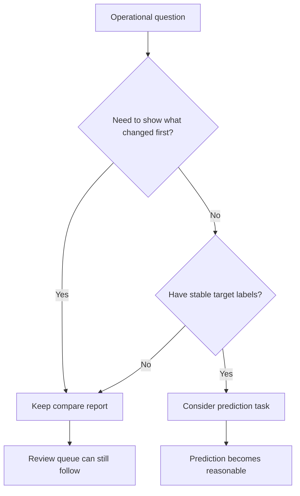

# P3-9.2 어떤 문제는 왜 끝까지 비교 리포트로 남겨야 하는가

> Section ID: `P3-9.2`
> Version: `v2026.07.07`

모든 운영 문제를 예측 문제로 밀어 넣는 것은 좋은 데이터 모델링이 아닙니다. 어떤 경우에는 비교 리포트가 더 정직하며 현재 데이터 상태에도 더 잘 맞습니다. 특히 원인 라벨이 약하거나, 운영자가 실제로 보고 싶은 것이 `정답 분류`보다 `지금 먼저 볼 대상을 고르는 일`일 때 그렇습니다. Part 3의 마지막 문제 유형 판단에서는, 어떤 문제를 위로 올리지 않고 끝까지 비교 리포트로 남겨 두는 편이 더 올바를 수 있다는 점도 함께 정리해야 합니다.

이 지점에서는 `입력 -> 정답 라벨 -> 자동 판별` 구조가 먼저 떠오르기 때문에, 현실 문제도 모두 그 틀에 넣어야 할 것처럼 느껴질 수 있습니다. 하지만 운영 데이터에서는 `정답을 맞히는 일`보다 `무엇을 먼저 보여 줄 것인가`가 더 중요한 경우가 많습니다. 이런 문제를 억지로 분류 문제로 바꾸면, 오히려 라벨 품질이 약한 상태에서 과장된 자동화를 만들기 쉽습니다.

비교 리포트가 더 적합한 상황은 보통 다음과 같습니다.

- 평소 대비 최근 변화 방향을 먼저 보여 주는 것이 중요할 때
- 확정 라벨보다 검토 우선순위가 더 실용적일 때
- 변화 원인을 아직 자동으로 단정할 수 없을 때
- 사람의 후속 확인이 운영 절차에 포함될 때

예를 들어 최근 구간 평균, 변동성, 패턴 차이, 기준선 대비 차이값, 검토 필요 여부만 잘 정리해도 운영자에게 충분히 유용할 수 있습니다. 이 경우 중요한 것은 `무엇을 맞혔는가`보다 `무엇을 먼저 보여 주었는가`입니다. 즉 좋은 비교 리포트는 단순한 중간 산출물이 아니라, 실제 운영 의사결정의 한 형태가 됩니다.

반대로 예측 문제로 넘어가려면 적어도 다음 조건이 필요합니다.

- 목표 라벨(target)이 비교적 안정적으로 정의되어 있다.
- 샘플 단위와 라벨 단위가 맞는다.
- 학습/평가 분할(split)과 평가(evaluation)를 설계할 만큼 표본 구조가 정리되어 있다.

두 접근의 차이는 아래처럼 정리할 수 있습니다.

| 구분 | 비교 리포트 | 예측 문제 |
| --- | --- | --- |
| 중심 질문 | 무엇을 먼저 검토할 것인가 | 무엇을 자동으로 맞힐 것인가 |
| 필요한 라벨 | 약해도 시작 가능 | 비교적 안정적이어야 함 |
| 산출물 | 우선순위 표, 비교 문장, 검토 큐(review queue) | 목표 라벨, 예측값, 평가 결과 |
| 사람의 역할 | 후속 확인의 중심 | 평가와 예외 처리의 중심 |

이 표는 비교 리포트가 `예측을 못 해서 잠깐 쓰는 임시물`이 아니라, 애초에 다른 문제 설정이라는 점을 보여 줍니다. 비교 리포트는 운영자가 상태를 읽고 다음 행동을 정하게 하는 구조이고, 예측 문제는 비교적 안정된 목표 라벨(target)을 자동으로 맞히는 구조입니다.

실제로는 다음 표처럼 `비교 리포트로 남기는 편이 더 정직한가`를 먼저 판단하는 편이 안전합니다.

| 현재 상태 | 더 자연스러운 산출물 | 이유 |
| --- | --- | --- |
| 원인 라벨이 거의 없고 변화 비교만 가능하다 | 비교 리포트 | 무엇이 달라졌는지는 말할 수 있지만 원인은 아직 단정하기 어렵다 |
| 검토 우선순위는 정할 수 있지만 확정 라벨은 약하다 | 비교 리포트 또는 검토 큐 | 운영자는 먼저 볼 대상을 원하고, 분류 정답은 아직 약하다 |
| 목표 라벨과 평가 구조가 비교적 안정적이다 | 예측 문제 | 자동으로 맞힐 대상을 정의할 근거가 있다 |

작은 표를 보면 비교 리포트와 예측 문제의 차이가 더 잘 보입니다.

| event_id | diff | repeatability | review_needed | cause_label |
| --- | --- | --- | --- | --- |
| A | -0.35 | high | 1 | 없음 |
| B | -0.08 | low | 0 | 없음 |
| C | -0.31 | high | 1 | 없음 |

## 작은 도식으로 보기

```mermaid
flowchart TD
    A[Operational question]
    A --> B{Need to show what changed first?}
    B -->|Yes| C[Keep compare report]
    B -->|No| D{Have stable target labels?}
    D -->|No| C
    D -->|Yes| E[Consider prediction task]

    C --> F[Review queue can still follow]
    E --> G[Prediction becomes reasonable]
```

이 도식은 비교 리포트가 예측을 못 해서 잠깐 머무는 단계가 아니라, 어떤 질문에서는 끝까지 더 맞는 산출물일 수 있다는 점을 보여 줍니다. 먼저 필요한 것이 `무엇이 달라졌는가`를 보여 주는 일이라면 비교 리포트가 자연스럽고, 안정된 목표 라벨이 있을 때만 예측 문제로 넘어갑니다.

## 일반화된 상위 프레임으로 다시 보면

이 절은 `예측으로 갈까 말까`의 문제가 아니라, `산출물 선택(output choice)`을 현재 데이터 성숙도에 맞게 하는 문제로 다시 볼 수 있습니다.

| 상위 프레임 | 이 절에서의 대응 |
| --- | --- |
| 변화 설명 중심 산출물 | 비교 리포트 |
| 검토 우선순위 중심 산출물 | 검토 큐 |
| 자동 정답 예측 중심 산출물 | 예측 문제 |

이 프레임을 잡아 두면 비교 리포트는 예측 이전의 임시 단계가 아니라, 어떤 질문에서는 끝까지 더 맞는 출력 구조라는 점이 더 선명해집니다.

여기서 한 걸음 더 나가면 `모델링 사다리` 관점도 보입니다. 비교 리포트와 규칙 기반 검토 큐(review queue)로 시작하고, 라벨이 쌓이면 `review_needed` 예측으로 넘어가며, 그보다 더 안정된 라벨이 생기면 원인 분류나 더 복잡한 모델을 검토할 수 있습니다. 즉 좋은 데이터 모델링은 처음부터 가장 복잡한 문제를 세우는 일이 아니라, 현재 데이터 상태에 맞는 문제를 정직하게 고르는 일입니다.

결론은 단순합니다. `비교 리포트는 임시 대안이 아니라, 그 자체로 올바른 문제 설정일 수 있다.` 다음 장에서는 바로 이 구분을 바탕으로, Part 4로 넘길 feature, target, split 전제가 어디까지 정리되어야 하는지 마무리합니다.

## 짧은 점검

- 왜 어떤 운영 문제에서는 `무엇을 맞히는가`보다 `무엇을 먼저 보여 주는가`가 더 중요한지 설명할 수 있는가
- `review_needed`는 있지만 `cause_label`이 없을 때 어떤 산출물이 더 정직한지 말할 수 있는가
- 비교 리포트가 임시물인지, 독립적인 문제 설정인지 현재 예제로 구분할 수 있는가

## 언제 이 관점을 먼저 떠올려야 하는가

- 예측 문제로 끌어올리는 것보다 비교 리포트로 남겨 두는 편이 더 정직한지 판단해야 할 때 이 절을 먼저 떠올립니다.
- 운영자가 실제로 원하는 것이 정답 분류보다 `무엇을 먼저 보여 줄 것인가`인지 점검해야 할 때 이 절로 돌아옵니다.
- `review_needed`는 있으나 `cause_label`은 없는 상태에서 어떤 산출물이 더 맞는지 다시 확인할 때 이 절이 기준이 됩니다.

## 출처와 참고 자료

- U.S. Bureau of Labor Statistics, `Base period`. 기준 시점은 다른 시점과 비교하기 위한 reference라고 설명하므로, 비교 리포트가 먼저 `무엇이 달라졌는가`를 보여 주는 산출물이라는 점을 일반화하는 근거가 됩니다. [https://www.bls.gov/bls/glossary.htm](https://www.bls.gov/bls/glossary.htm){: target="_blank" rel="noopener noreferrer" } / 확인일: 2026-07-08
- National Cancer Institute, `baseline`. baseline을 시간에 따른 변화를 보기 위한 비교 기준으로 설명하므로, 비교 리포트가 예측 이전의 실패한 단계가 아니라 변화 설명 구조라는 점을 보강합니다. [https://www.cancer.gov/publications/dictionaries/cancer-terms/def/baseline](https://www.cancer.gov/publications/dictionaries/cancer-terms/def/baseline){: target="_blank" rel="noopener noreferrer" } / 확인일: 2026-07-08
- Google for Developers, `Machine Learning Glossary`의 `proxy labels`. proxy label은 종종 imperfect하다고 설명하므로, 라벨이 약한 상태에서 예측 문제로 억지 승격하지 말고 비교 리포트나 검토 큐로 남겨 두는 판단을 뒷받침합니다. [https://developers.google.com/machine-learning/glossary](https://developers.google.com/machine-learning/glossary){: target="_blank" rel="noopener noreferrer" } / 확인일: 2026-07-08
