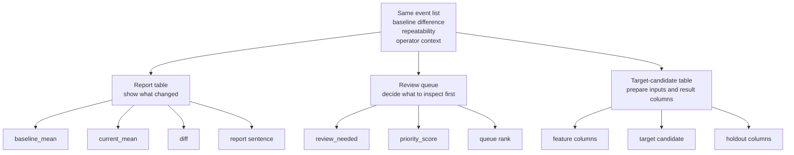

# P3-9.3 비교 리포트, 검토 후보 큐, 목표 라벨 후보 표는 어떻게 다른가

> Section ID: `P3-9.3`
> Version: `v2026.07.10`

같은 사건 목록도 목적에 따라 [비교 리포트(comparison report)](../../../reference/concept-glossary.md#glossary-comparison-report), [검토 후보 큐(review queue)](../../../reference/concept-glossary.md#glossary-review-queue), [목표 라벨 후보(target candidate)](../../../reference/concept-glossary.md#glossary-target-candidate) 표로 달라집니다. 어떤 표는 비교 문장과 차이값을 앞세우고, 어떤 표는 검토 우선순위를 앞세우며, 어떤 표는 입력 열과 결과 후보 열 구분을 앞세웁니다. 여기서 목표 라벨 후보는 아직 확정 정답으로 굳지 않았더라도, 입력 열과 결과 열을 가르는 문제 구조 안에서 결과 후보로 세워 보는 준비 열로 읽습니다.

핵심은 `무엇을 계산하느냐`보다 `같은 사건 목록을 어떤 질문에 맞춰 다시 조직하느냐`가 다르다는 점입니다.

| 산출물 | 지금 가장 직접적인 목적 | 표에서 먼저 보이는 것 |
| --- | --- | --- |
| 비교 리포트 | 무엇이 평소와 달라졌는지 바로 보여 준다 | 차이값, 비교 문장, 기준선 대비 변화 |
| 검토 후보 큐 | 사람이 먼저 볼 대상을 순서대로 고른다 | 우선순위, 검토 필요 여부, 반복성 |
| 목표 라벨 후보 표 | 나중에 맞히고 싶은 결과를 학습 문제로 정리한다 | 특징 열, 목표 라벨 후보, 보류할 열 |

같은 사건을 두고도 질문이 달라지면 표의 중심 열이 달라집니다. `평소보다 무엇이 얼마나 달라졌는가`를 묻는다면 비교 리포트가 자연스럽고, `지금 무엇부터 사람이 봐야 하는가`를 묻는다면 검토 후보 큐가 자연스럽습니다. `나중에 무엇을 자동으로 맞히고 싶은가`를 묻는다면 목표 라벨 후보 표가 필요합니다.

예를 들어 동작 1회 요약 표가 이미 있고, 기준선 대비 차이와 반복성, 운영 메모가 함께 있다고 가정해 봅시다. 이때 같은 데이터도 아래처럼 세 번 다른 표로 읽힐 수 있습니다.

## 1. 비교 리포트는 변화 읽기 표다

비교 리포트에서는 `무엇이 달라졌는가`가 가장 먼저 나와야 합니다. 아직 자동 판단보다 변화의 모양을 보여 주는 것이 목적이기 때문입니다.

| event_id | baseline_mean | current_mean | diff | repeatability | report_sentence |
| --- | --- | --- | --- | --- | --- |
| A | 2.6 | 2.2 | -0.4 | high | 후반 구간 평균이 기준선보다 뚜렷하게 낮다 |
| B | 2.5 | 2.4 | -0.1 | low | 기준선과 큰 차이는 없다 |
| C | 2.7 | 2.1 | -0.6 | high | 평균 하락과 변동성 증가가 함께 보인다 |

이 표의 중심은 `차이 설명`입니다. 운영자는 여기서 무엇이 평소와 달라졌는지 바로 읽을 수 있습니다. 하지만 이 표만으로는 아직 `무엇을 먼저 볼지`가 자동으로 정해지지 않을 수 있고, `정상/이상` 같은 목표 라벨도 아직 분명하지 않을 수 있습니다.

## 2. 검토 후보 큐는 우선순위 표다

검토 후보 큐로 바뀌면 표의 중심이 달라집니다. 이제는 변화의 존재만이 아니라, `사람이 먼저 볼 가치가 있는가`가 중요합니다.

| event_id | diff | repeatability | review_needed | priority_score | queue_rank |
| --- | --- | --- | --- | --- | --- |
| C | -0.6 | high | 1 | 0.92 | 1 |
| A | -0.4 | high | 1 | 0.81 | 2 |
| B | -0.1 | low | 0 | 0.18 | 3 |

이 표에서는 `report_sentence`보다 `priority_score`, `queue_rank`, `review_needed`가 앞에 섭니다. 즉 비교 리포트가 `무슨 변화가 보이는가`를 말한다면, 검토 후보 큐는 `그중 무엇부터 사람이 볼 것인가`를 말합니다.

중요한 점은 검토 후보 큐가 곧바로 목표 라벨 표가 아니라는 사실입니다. `review_needed`는 운영 판단에는 쓸 수 있지만, 그것만으로 곧장 안정된 원인 라벨이나 최종 상태 라벨이 되지는 않을 수 있습니다.

## 3. 목표 라벨 후보 표는 학습 준비 표다

목표 라벨 후보 표로 넘어가면 중심은 다시 바뀝니다. 이제는 `무엇을 보여 줄까`보다 `무엇을 입력으로 주고 무엇을 결과로 둘까`가 중요합니다.

| event_id | mid_flow_mean | late_drop_rate | flow_variability | review_needed | cause_label |
| --- | --- | --- | --- | --- | --- |
| A | 2.2 | -0.4 | 0.21 | 1 | 없음 |
| B | 2.4 | -0.1 | 0.08 | 0 | 없음 |
| C | 2.1 | -0.6 | 0.27 | 1 | 없음 |

여기서는 `mid_flow_mean`, `late_drop_rate`, `flow_variability` 같은 특징 열과 `review_needed` 같은 목표 라벨 후보가 함께 보입니다. 이 표는 비교 리포트처럼 문장을 바로 읽기 위한 표도 아니고, 검토 큐처럼 우선순위를 정하기 위한 표도 아닙니다. 입력 열과 결과 열을 분리해 문제 구조를 정리하는 준비 표에 가깝습니다.

다만 위 예시에서도 `cause_label`은 여전히 비어 있습니다. 따라서 이 표가 있다고 해서 모든 예측 문제가 곧바로 가능한 것은 아닙니다. `review_needed` 같은 운영 라벨 후보는 일부 예측 문제의 출발점이 될 수 있지만, 원인 분류까지 바로 올라갈 근거는 아직 부족할 수 있습니다.

## 같은 데이터가 세 표로 갈라지는 최소 절차

위 차이는 아래 순서로 읽으면 더 단순해집니다.

1. 먼저 기준선과 현재 구간을 비교해 비교 리포트를 만든다.
2. 그 차이에 반복성과 운영 기준을 붙여 검토 후보 큐를 만든다.
3. 그중 학습으로 넘길 수 있는 열만 다시 모아 목표 라벨 후보 표를 만든다.

이 순서가 중요한 이유는 세 표가 서로 대체재가 아니기 때문입니다. 비교 리포트 없이 검토 후보 큐를 만들면 왜 그 사례가 올라왔는지 설명이 약해집니다. 검토 후보 큐 없이 목표 라벨 후보 표만 만들면 운영상 왜 이 문제가 중요했는지가 빠질 수 있습니다. 반대로 목표 라벨 후보 표 없이 검토 큐만 있으면 입력 열과 결과 열을 어디서 가를지 정리하기 어렵습니다.

아래 도식은 같은 사건 목록이 세 산출물로 어떻게 갈라지는지 보여 줍니다.

이 도식에서 먼저 봐야 할 것은 `한 표가 세 번 복제된다`가 아니라 `한 사건 목록이 세 질문에 맞게 다시 자른다`는 점입니다. 비교 리포트는 변화 설명을 남기고, 검토 후보 큐는 운영 우선순위를 남기고, 목표 라벨 후보 표는 입력 열과 결과 열 구분을 남깁니다. 즉 세 표는 같은 데이터를 중복 복사한 결과가 아니라, 서로 다른 질문에 맞춰 같은 사건 목록을 다시 조직한 결과로 읽어야 합니다.

## 언제 무엇으로 멈춰야 하는가

마지막으로는 아래처럼 판정하면 헷갈림이 줄어듭니다.

| 지금 가장 필요한 것 | 먼저 만들 산출물 | 아직 미루는 것 |
| --- | --- | --- |
| 변화 자체를 읽는 일 | 비교 리포트 | 검토 우선순위, 목표 라벨 표 |
| 사람이 먼저 볼 순서를 정하는 일 | 검토 후보 큐 | 안정된 예측 라벨 |
| 학습 입력과 결과를 정리하는 일 | 목표 라벨 후보 표 | 비교 리포트 설명을 대체하는 일 |

핵심은 세 산출물이 `같은 데이터를 세 번 낭비하는 중복 작업`이 아니라, 서로 다른 질문에 답하는 구조라는 점입니다. 비교 리포트는 변화 해석을 맡고, 검토 후보 큐는 운영 우선순위를 맡고, 목표 라벨 후보 표는 입력 열과 결과 열 구분을 맡습니다.

## 출처와 참고 자료

- U.S. Bureau of Labor Statistics(BLS), *BLS Handbook of Methods: Glossary*, baseline. [https://www.bls.gov/bls/glossary.htm](https://www.bls.gov/bls/glossary.htm){: target="_blank" rel="noopener noreferrer" }
- National Cancer Institute(NCI), *NCI Dictionary of Cancer Terms: baseline*, baseline. [https://www.cancer.gov/publications/dictionaries/cancer-terms/def/baseline](https://www.cancer.gov/publications/dictionaries/cancer-terms/def/baseline){: target="_blank" rel="noopener noreferrer" }
- Google, *Machine Learning Glossary*, `label`, `labeled example`, 확인일 2026-07-08. [https://developers.google.com/machine-learning/glossary](https://developers.google.com/machine-learning/glossary){: target="_blank" rel="noopener noreferrer" }
- W3C, *PROV-Overview: An Overview of the PROV Family of Documents*, entity/activity provenance overview. [https://www.w3.org/TR/prov-overview/](https://www.w3.org/TR/prov-overview/){: target="_blank" rel="noopener noreferrer" }
