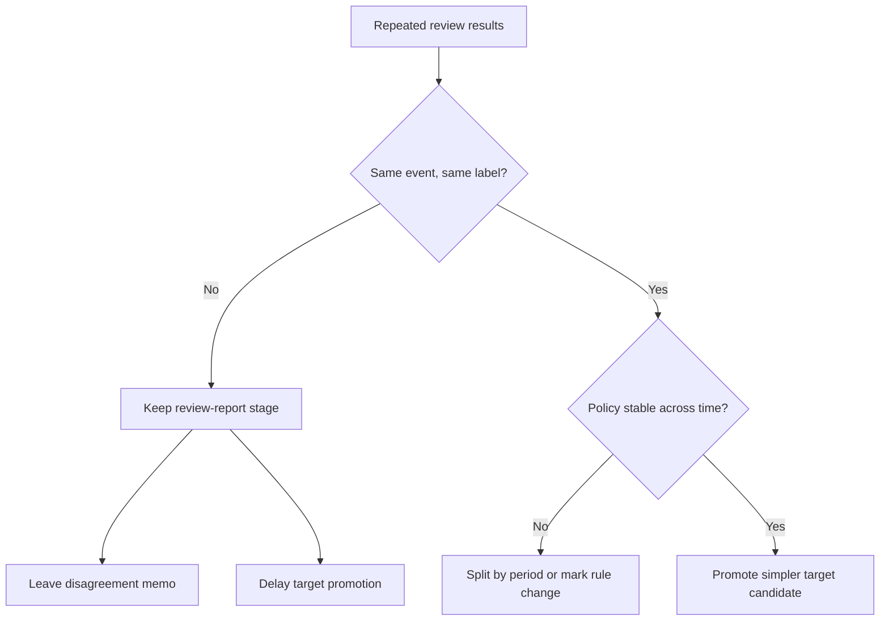

# P3-9.6 같은 사건도 사람이나 시기에 따라 다른 라벨이 붙으면 어떻게 해야 하는가

> Section ID: `P3-9.6`
> Version: `v2026.07.08`

Chapter 9에서 운영 메모가 목표 라벨 후보로 바뀌는 흐름까지 보면, 자연스럽게 한 걸음 더 들어갑니다. `라벨 후보 열이 생기긴 했는데, 사람마다 판단이 다르거나 시기마다 기준이 바뀌면 이 열을 그대로 써도 되는가` 하는 질문입니다. 현실 데이터에서는 이 문제가 자주 생깁니다. 같은 사건을 두 검토자가 다르게 적을 수 있고, 지난달에는 `주의`로 보던 상태를 이번 달에는 `정상`으로 기록할 수도 있습니다.

목표 라벨 후보는 `열이 있는가`만으로 충분하지 않고, `같은 사건에 비슷한 조건이면 비슷한 라벨이 붙는가`도 함께 봐야 합니다.

## 왜 이 질문이 Part 3에 필요한가

이 문제는 Part 4의 평가 단계나 Part 5의 학습 안정성 문제처럼 보일 수 있습니다. 하지만 실제로는 Part 3에서 이미 다루던 `무엇을 예측 문제로 올릴 수 있는가`를 더 정확하게 따지는 질문입니다.

| Part 3에서 이미 정한 것 | 여기서 다시 점검해야 하는 이유 |
| --- | --- |
| 샘플 단위 | 같은 샘플 기준인데도 라벨이 흔들릴 수 있기 때문 |
| 목표 라벨 후보 열 | 열이 있어도 붙는 기준이 제각각이면 바로 학습 문제로 올리기 어렵기 때문 |
| 비교 리포트와 검토 큐 | 검토 과정이 라벨 후보로 축적될 때 판단 일관성도 함께 봐야 하기 때문 |

즉 이 절은 새로운 품질 관리 절차를 배우는 것이 아니라, `이 라벨 후보가 정말 같은 뜻으로 반복되고 있는가`를 확인하는 절입니다.

## 왜 같은 사건에도 다른 라벨이 붙는가

라벨 후보가 흔들리는 이유는 대체로 아래 몇 가지로 모입니다.

| 흔들리는 이유 | 실제로 생기는 일 |
| --- | --- |
| 검토자마다 기준이 다름 | 같은 패턴을 어떤 사람은 `검토 필요`, 어떤 사람은 `정상`으로 본다 |
| 시기마다 운영 기준이 바뀜 | 예전에는 경고로 보던 패턴이 새 운영 정책에서는 정상 처리된다 |
| 근거 문장이 부족함 | 왜 그렇게 판단했는지 남지 않아 나중에 다시 맞추기 어렵다 |
| 경계 사례가 많음 | 기준선과 아주 비슷한 사례는 사람마다 다르게 붙기 쉽다 |

즉 라벨 후보의 문제는 `틀렸다/맞았다`만이 아니라, `같은 규칙이 반복되고 있는가`의 문제이기도 합니다.

## 비교 표로 먼저 보기

| event_id | diff | repeatability | reviewer | review_label |
| --- | ---: | --- | --- | --- |
| A | -0.34 | high | kim | review_needed |
| A | -0.34 | high | lee | normal |
| B | -0.08 | low | kim | normal |
| B | -0.08 | low | lee | normal |
| C | -0.29 | medium | kim | review_needed |
| C | -0.29 | medium | lee | review_needed |

이 표에서 `A`는 같은 사건인데 `kim`은 `review_needed`, `lee`는 `normal`로 적었습니다. `B`와 `C`는 일치합니다. 이 상태를 보고 종종 `그래도 라벨 열은 있으니 Part 4로 넘기면 되겠네`라고 생각하기 쉽습니다. 하지만 실제로는 `A` 같은 사건이 얼마나 많은지 먼저 봐야 합니다.

핵심은 라벨 후보 열이 있다는 사실보다, `같은 조건에서 같은 판단이 얼마나 반복되는가`입니다.

## 지금 단계에서 무엇을 먼저 적어 두면 좋은가

Part 3에서는 아직 복잡한 통계 지표보다 아래 메모를 먼저 남기면 충분합니다.

| 먼저 적을 메모 | 왜 필요한가 |
| --- | --- |
| 같은 사건의 중복 검토에서 자주 갈리는 라벨이 있는가 | 일관성 낮은 구간을 먼저 보기 위해 |
| 기준이 바뀐 시점이 있는가 | 시기별 라벨 의미 변화 가능성을 적어 두기 위해 |
| 현재 라벨 후보를 바로 target으로 올릴지, 비교 리포트 비중을 더 유지할지 | 문제 승격을 늦출 근거를 남기기 위해 |

이 메모는 완벽한 품질 인증이 아니라, `라벨이 흔들릴 수 있다`는 사실을 숨기지 않고 인계 메모에 남기는 일입니다.

## 언제 바로 target으로 올리기 어렵다고 봐야 하는가

아래 같은 장면이 반복되면 목표 라벨 후보를 그대로 학습 문제로 올리기보다 한 번 더 다듬는 편이 안전합니다.

| 보이는 신호 | 더 자연스러운 다음 행동 |
| --- | --- |
| 같은 사건에 검토자별 라벨이 자주 다르다 | 비교 리포트와 검토 큐를 더 유지한다 |
| 특정 날짜 이후 라벨 기준이 갑자기 바뀐다 | 기간을 나누어 읽거나 기준 변경 메모를 남긴다 |
| 자유 메모는 있는데 공통 판단 열이 약하다 | 운영 메모 정리 규칙을 먼저 보강한다 |
| 경계 사례에서 자주 갈린다 | `확정 라벨`보다 `검토 필요` 수준을 먼저 목표로 둔다 |

즉 불안정한 원인 분류를 억지로 바로 예측 문제로 올리는 것보다, 더 단순하고 반복적인 판단 열부터 목표 후보로 잡는 편이 Part 3 흐름에 맞습니다.

이 메모를 남겨 두어야 뒤에서 학습 입력이나 긴 시퀀스를 다룰 때도 `열이 있다`는 사실보다 `그 열이 같은 뜻으로 반복되는가`를 먼저 점검할 수 있습니다. 즉 이 절의 중심은 Part 4·5의 학습 설명을 미리 펼치는 데 있지 않고, 현재 목표 라벨 후보가 아직 비교 리포트 단계에 머물러야 하는지까지 판단하는 데 있습니다.

## 작은 도식으로 보기



## 작은 코드 예시

```python
import pandas as pd

reviews = pd.DataFrame(
    [
        {"event_id": "A", "reviewer": "kim", "review_label": "review_needed"},
        {"event_id": "A", "reviewer": "lee", "review_label": "normal"},
        {"event_id": "B", "reviewer": "kim", "review_label": "normal"},
        {"event_id": "B", "reviewer": "lee", "review_label": "normal"},
        {"event_id": "C", "reviewer": "kim", "review_label": "review_needed"},
        {"event_id": "C", "reviewer": "lee", "review_label": "review_needed"},
    ]
)

label_variety = reviews.groupby("event_id")["review_label"].nunique()
disagreed_events = label_variety[label_variety > 1]

review_counts = reviews.groupby("event_id").size()

print("1) reviews per event:")
print(review_counts)
print()
print("2) label variety by event:")
print(label_variety)
print()
print("3) events with disagreement:")
print(disagreed_events.index.tolist())
```

예상 출력:

```text
1) reviews per event:
event_id
A    2
B    2
C    2
dtype: int64

2) label variety by event:
event_id
A    2
B    1
C    1
Name: review_label, dtype: int64

3) events with disagreement:
['A']
```

이 예제의 목적은 모델 입력을 만드는 것이 아니라, `같은 사건에 대해 검토가 몇 번 있었고 그중 어디서 라벨이 갈렸는가`를 먼저 확인하는 데 있습니다. 먼저 사건별 검토 수를 보고, 그다음 라벨 종류 수를 세고, 마지막에 실제 불일치 사건 목록만 뽑아내면 왜 이 절에서 `라벨 열이 있다`보다 `라벨 의미가 반복되는가`를 먼저 보라고 하는지 더 분명해집니다.

## 일반화된 상위 프레임으로 다시 보면

이 절의 핵심은 특정 운영팀의 메모 습관이 아니라, `라벨 의미 안정성(label meaning stability)`을 확인하는 문제입니다.

| 상위 프레임 | 이 절에서의 대응 |
| --- | --- |
| 라벨 존재 여부 | 열이 있는가 |
| 라벨 일관성 | 같은 사건이나 비슷한 조건에서 비슷한 판단이 반복되는가 |
| 라벨 승격 가능성 | 바로 target으로 쓸지, 더 단순한 후보로 낮출지 |

이 프레임을 잡아 두면 `라벨 열이 있다`는 사실은 출발점일 뿐이고, 실제로는 그 열이 같은 뜻으로 반복되는지까지 봐야 한다는 점이 더 선명해집니다.

## 인계 직전의 마지막 판정

Part 4와 Part 5로 넘기기 전에는 아래처럼 짧게 판정하면 좋습니다.

| 점검 질문 | 예라고 답할 수 있어야 하는 것 |
| --- | --- |
| 현재 라벨 후보가 같은 뜻으로 비교적 반복되는가 | 자주 갈리는 사례와 구간을 적을 수 있다 |
| 기준 변경 시점이 있는가 | 시기별 의미 차이를 메모할 수 있다 |
| 불안정한 라벨을 바로 학습 문제로 올리지 않고 있는가 | 비교 리포트 유지 또는 더 단순한 target 후보 선택을 설명할 수 있다 |

이 세 줄이 있어야 목표 라벨 후보 표는 단순한 열 목록이 아니라, `라벨 의미의 안정성`까지 포함한 인계 구조가 됩니다.

## 한 문장으로 묶기

이 절에서 붙잡아야 할 문장은 다음과 같습니다.

`목표 라벨 후보는 열이 있다는 사실만으로 충분하지 않고, 같은 사건과 비슷한 조건에서 비슷한 판단이 반복되는지도 함께 확인해야 한다.`

