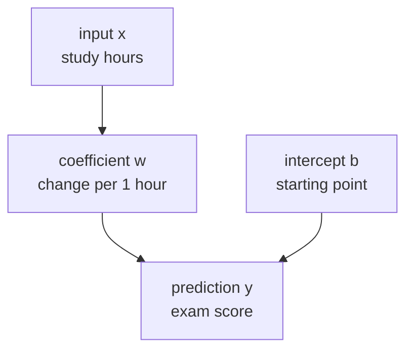
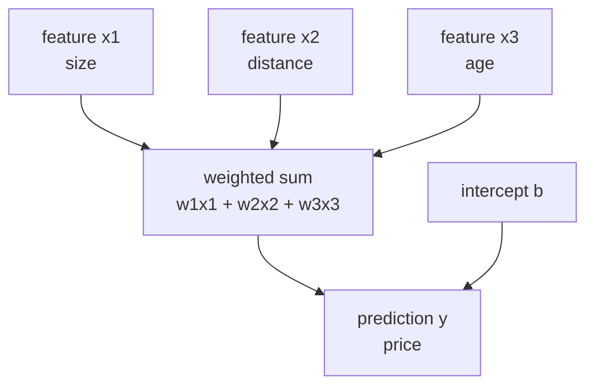
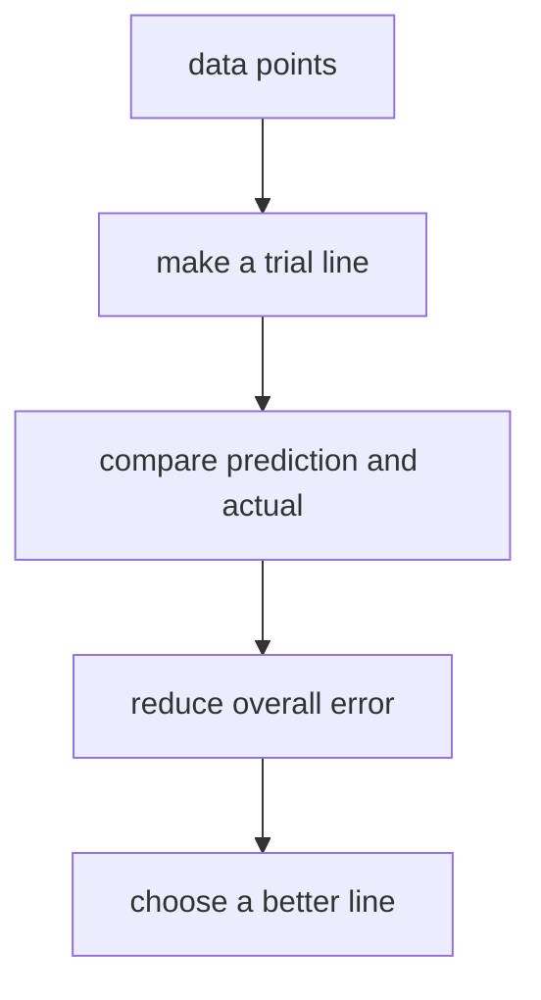
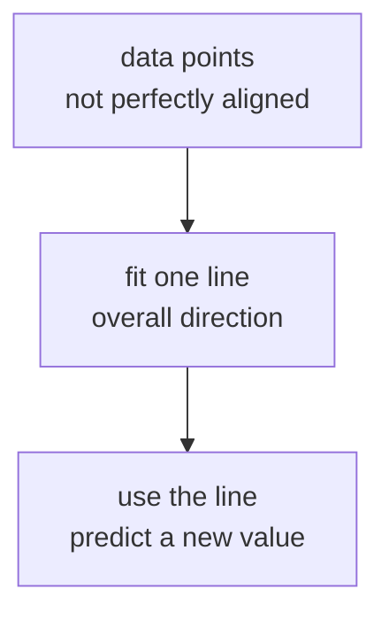
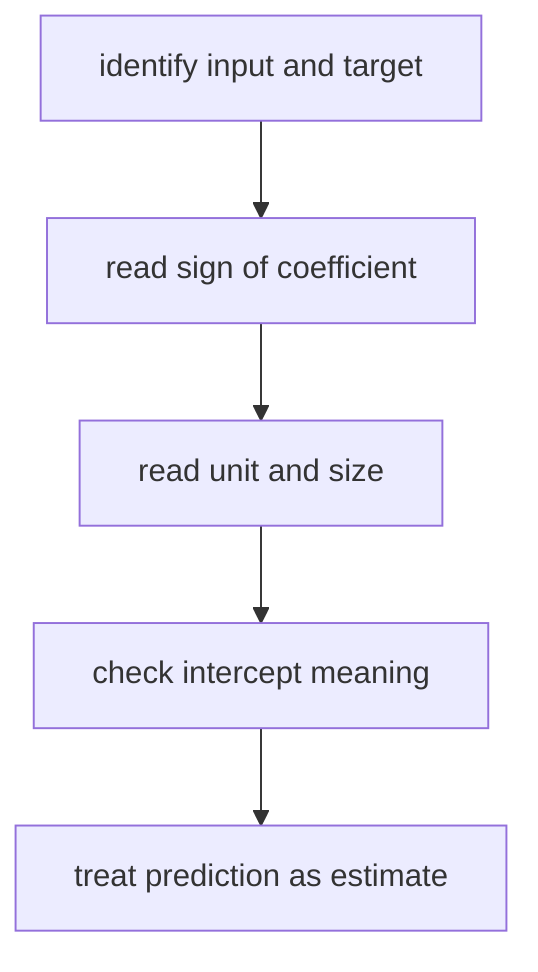

# P3-10.1 선형회귀(linear regression)의 직관

P3-9.2에서는 튜닝(tuning)과 검증 비용(validation cost)을 통해 `좋아 보이는 설정을 어떻게 비교할 것인가`를 봤습니다. 이제 그 비교 절차를 실제 알고리즘 하나에 연결할 차례입니다.

Part 3의 첫 알고리즘으로 선형회귀(linear regression)를 먼저 보는 이유는 단순합니다. 선형회귀는 회귀(regression) 문제의 가장 기본적인 출발점이면서, 입력과 출력의 관계를 `기울기`와 `절편`으로 가장 투명하게 보여 주는 모델이기 때문입니다.

이 절의 중심 질문은 다음입니다.

`입력이 커질수록 출력도 커진다거나 작아진다는 관계를 가장 단순하게 어떻게 모델로 표현할 수 있을까?`

선형회귀는 이 질문에 대해 `직선(line)`으로 먼저 답해 보는 모델입니다.

## 이 절의 범위

이 절은 다음 질문에 답합니다.

- 회귀(regression)는 어떤 문제를 다루는가?
- 선형회귀는 왜 `직선`으로 관계를 표현한다고 말하는가?
- 입력(feature)과 출력(target) 사이의 방향성과 크기를 어떻게 읽을 수 있는가?
- 선형회귀를 왜 Part 3의 첫 알고리즘으로 배우는가?

이 절은 다음 내용은 깊게 다루지 않습니다.

- 잔차(residual)의 통계적 성질
- 최소제곱법(ordinary least squares)의 엄밀한 유도
- 다중공선성(multicollinearity), 정규화(regularization), 가정 검정
- R², MAE, RMSE 같은 평가 지표의 자세한 비교

그 내용은 다음 절인 P3-10.2와 뒤의 알고리즘 절에서 다시 이어집니다.

## 이 절의 목표

- 회귀를 `연속값을 예측하는 문제`라고 설명할 수 있습니다.
- 선형회귀를 `입력과 출력의 관계를 직선으로 먼저 근사하는 모델`이라고 말할 수 있습니다.
- 선형(linear)이라는 말이 `입력 전체를 일정한 가중 합으로 읽는다`는 뜻임을 설명할 수 있습니다.
- 기울기(slope, coefficient)와 절편(intercept)의 직관을 설명할 수 있습니다.
- 선형회귀가 무엇을 줄이려는 알고리즘인지 입문 수준에서 설명할 수 있습니다.
- 선형회귀가 좋은 baseline이자 좋은 출발점인 이유를 이해할 수 있습니다.

## 이 절이 커리큘럼에서 필요한 이유

Part 3 앞부분에서는 데이터 분리, baseline, 튜닝, 평가 기준을 먼저 정리했습니다. 그 이유는 알고리즘을 배울 때 이름부터 외우기보다, `무슨 문제를 어떤 형태로 풀려는가`를 먼저 읽게 하기 위해서였습니다.

선형회귀는 이 커리큘럼에서 다음 역할을 합니다.

| 커리큘럼 위치 | 선형회귀의 역할 |
| --- | --- |
| P3-4 회귀와 분류 뒤 | 회귀 문제를 실제 모델로 연결 |
| P3-8 baseline 뒤 | 단순하지만 해석 가능한 첫 비교 모델 제공 |
| P3-11 이후 분류 모델 전 | 연속값 예측과 확률적 분류의 차이를 준비 |

즉, 선형회귀는 `가장 쉬운 알고리즘`이라서 먼저 오는 것이 아니라, `입력과 출력의 관계를 가장 설명하기 쉬운 알고리즘`이라서 먼저 옵니다.

## 회귀(regression)는 어떤 문제를 다루는가

회귀는 분류(classification)처럼 범주(class)를 맞히는 문제가 아니라, 연속적으로 변하는 수치를 예측하는 문제입니다.

예를 들면 다음과 같습니다.

| 업무 상황 | 예측하려는 값 |
| --- | --- |
| 집 크기와 위치로 집값 예측 | 가격 |
| 광고비와 시즌 정보로 매출 예측 | 매출액 |
| 이동 거리와 교통 상황으로 배송 시간 예측 | 시간 |
| 공부 시간과 과제 점수로 최종 점수 예측 | 점수 |

이런 문제의 공통점은 출력이 `예/아니오`가 아니라 숫자라는 점입니다.

초심자 기준에서는 이렇게 잡으면 충분합니다.

`회귀는 입력을 보고 하나의 연속값을 추정하는 문제다.`

## 선형회귀는 왜 직선으로 관계를 표현하는가

scikit-learn의 선형 모델 문서는 선형회귀를 관측값과 선형 결합(linear combination) 사이의 관계를 학습하는 모델 계열로 설명합니다. 초심자 관점에서는 이를 더 쉬운 질문으로 바꿔 읽는 편이 좋습니다.

`입력이 조금 늘면 출력은 평균적으로 얼마나 늘어나는가?`

이 질문에 가장 단순하게 답하는 식이 다음 형태입니다.

\\[
y = wx + b
\\]

- `x`: 입력(input)
- `y`: 예측값(prediction)
- `w`: 기울기(coefficient)
- `b`: 절편(intercept)

기울기 `w`는 `x가 1만큼 바뀔 때 y가 얼마나 바뀌는가`를 뜻합니다. 절편 `b`는 입력이 0일 때 모델이 두는 출발점입니다.

이 구조를 그림처럼 읽으면 다음과 같습니다.



핵심은 선형회귀가 `현실이 완벽한 직선이라고 주장하는 모델`이 아니라, `직선으로 먼저 설명해 볼 수 있는 관계가 있는가`를 확인하는 모델이라는 점입니다.

하지만 여기서 한 가지를 더 정확히 짚어 둘 필요가 있습니다. 초심자는 선형회귀를 종종 `항상 2차원 그래프에서 직선 하나를 그리는 모델`로만 기억합니다. 그 기억은 한 변수 예시에서는 맞지만, 알고리즘 자체를 설명하기에는 좁습니다.

## 선형(linear)이라는 말은 정확히 무엇을 뜻하는가

선형회귀의 `선형`은 보통 `직선`이라는 그림으로 먼저 소개되지만, 이론적으로는 `입력들을 가중치(weight)의 합으로 읽는다`는 뜻에 더 가깝습니다.

입력이 하나일 때는

\\[
y = wx + b
\\]

형태가 되고, 입력이 여러 개일 때는 다음처럼 넓어집니다.

\\[
y = w_1x_1 + w_2x_2 + \cdots + w_nx_n + b
\\]

즉, 선형회귀는 각 입력(feature)에 하나의 계수(coefficient)를 두고, 그 기여를 더해서 최종 예측을 만드는 모델입니다.

초심자 기준에서는 다음처럼 이해하면 충분합니다.

`선형회귀는 여러 입력의 영향을 각각 숫자로 배정하고, 그 영향을 더해 하나의 예측값을 만드는 모델이다.`

이 점을 간단히 그리면 다음과 같습니다.



그래서 한 변수 예시에서는 `직선`, 두 변수 이상에서는 `평면`이나 더 높은 차원의 `선형 관계`로 읽게 됩니다. 독자는 여기서 수학적 차원 개념을 모두 이해할 필요는 없고, `입력이 늘어나도 구조는 가중 합`이라는 점만 잡으면 됩니다.

## 직선이라는 가정은 왜 유용한가

현실 데이터는 대부분 완벽한 직선 위에 놓이지 않습니다. 그래도 선형회귀가 여전히 중요한 이유는 세 가지입니다.

1. 가장 단순한 설명을 먼저 시도할 수 있습니다.
2. 기울기와 절편이 비교적 해석하기 쉽습니다.
3. 더 복잡한 모델이 정말 필요한지 판단하는 기준점이 됩니다.

예를 들어 공부 시간이 늘수록 시험 점수가 대체로 올라간다면, 선형회귀는 먼저 `한 시간 증가가 평균적으로 몇 점 변화와 연결되는가`를 직선으로 요약해 봅니다.

이 직선이 완벽하지 않더라도, 다음 같은 질문에 바로 답하게 해 줍니다.

- 관계의 방향은 양수인가 음수인가?
- 변화의 크기는 큰가 작은가?
- 너무 단순해서 놓치는 패턴이 있는가?

즉, 선형회귀는 현실을 다 담는 도구라기보다, 현실을 읽기 시작하는 첫 좌표축에 가깝습니다.

## 선형회귀는 무엇을 학습하는가

알고리즘 장에서는 `직선으로 읽는다`는 직관만으로는 조금 부족합니다. 모델이 실제로 학습하는 것이 무엇인지도 짚어야 합니다.

선형회귀는 데이터 점들에 대해 예측값을 만들고, 그 예측값과 실제값의 차이(error)가 전체적으로 작아지도록 계수(coefficient)와 절편(intercept)을 조정합니다.

이때 각 데이터에서

- 실제값(actual)
- 예측값(prediction)
- 둘의 차이(residual 또는 error)

가 생깁니다. 선형회귀는 이 차이들이 전체적으로 너무 크지 않게 만드는 방향으로 선을 정합니다.

scikit-learn의 `LinearRegression`은 기본적으로 ordinary least squares에 해당하는 해를 사용합니다. 입문적으로는 이를 다음처럼 읽으면 충분합니다.

`데이터 전체에 대해 예측 오차가 가장 덜 남는 선을 찾으려는 방법`

여기서 아직 중요한 것은 엄밀한 증명이나 행렬 계산이 아니라, `좋아 보이는 선을 눈으로 그리는 것`이 아니라 `오차를 줄이는 기준으로 선을 고른다`는 점입니다.

이 흐름을 가장 단순하게 그리면 다음과 같습니다.



즉, 선형회귀는 `직선을 긋는 모델`이면서 동시에 `오차를 줄이는 모델`입니다. 알고리즘이라는 말은 바로 이 두 번째 관점에서 더 분명해집니다.

## 한 변수 선형회귀를 가장 단순하게 읽어 보기

공부 시간과 시험 점수 예시를 생각해 보겠습니다.

| study_hours | exam_score |
| --- | --- |
| 1 | 52 |
| 2 | 55 |
| 3 | 61 |
| 4 | 64 |
| 5 | 68 |
| 6 | 72 |

이 데이터를 보면 점수는 완벽하게 일정한 폭으로 오르지 않지만, 대체로 시간이 늘수록 점수도 올라갑니다. 선형회귀는 이 장면을 보고 다음 같은 직선을 하나 찾으려 합니다.

`공부 시간이 늘어날수록 점수도 평균적으로 올라가는 직선`

이 흐름을 간단히 그리면 다음과 같습니다.



여기서 중요한 것은 `모든 점을 정확히 지나는 선`이 아니라, `전체 방향을 가장 무난하게 설명하는 선`을 찾는다는 점입니다.

이 표현을 조금 더 이론적으로 바꾸면 다음과 같습니다.

- 개별 데이터마다 오차는 남을 수 있습니다.
- 하지만 데이터 전체를 놓고 보면 어떤 선은 오차가 더 작고, 어떤 선은 오차가 더 큽니다.
- 선형회귀는 그중에서 `전체 오차를 더 잘 줄이는 선`을 선택합니다.

즉, 선형회귀는 개별 점에 완벽히 맞추는 모델이 아니라, `전체 경향을 가장 경제적으로 요약하는 모델`입니다.

## 기울기(coefficient)와 절편(intercept)은 어떻게 읽는가

선형회귀를 처음 배울 때 많은 독자가 식은 보지만 의미는 놓칩니다. 이 절에서는 계산보다 해석을 먼저 잡는 편이 좋습니다.

### 기울기(coefficient)

기울기는 입력이 변할 때 출력이 어느 방향으로 얼마나 바뀌는지를 나타냅니다.

- 기울기 > 0: 입력이 커질수록 출력도 커지는 경향
- 기울기 < 0: 입력이 커질수록 출력은 작아지는 경향
- 기울기 크기가 큼: 입력 변화에 따라 출력도 더 민감하게 변함

예를 들어 광고비가 1단위 늘 때 예상 매출이 평균적으로 3단위 늘어난다면, 기울기는 대략 `+3`으로 읽을 수 있습니다.

하지만 해석할 때는 두 가지를 같이 봐야 합니다.

- `방향`: 늘어나는가, 줄어드는가
- `단위`: 입력 1단위가 실제로 무엇을 뜻하는가

예를 들어 입력이 `공부 시간 1시간`인지, `광고비 1만 원`인지에 따라 같은 숫자 3이라도 전혀 다른 의미가 됩니다. 따라서 기울기는 숫자 자체보다 `무엇이 1만큼 변할 때 무엇이 얼마나 바뀌는가`라는 문장으로 읽는 편이 안전합니다.

### 절편(intercept)

절편은 입력이 0일 때 모델이 두는 시작점입니다. 다만 절편은 항상 현실적 해석이 가능한 것은 아닙니다.

예를 들어 공부 시간이 0일 때 시험 점수를 예측하는 것은 문맥상 어느 정도 읽을 수 있지만, 집 크기 0㎡에서 집값을 해석하는 것은 현실적으로 큰 의미가 없을 수 있습니다.

따라서 절편은 다음처럼 읽는 편이 안전합니다.

`모델의 수학적 출발점이지만, 도메인에 따라 직접 해석 가능성은 다르다.`

## 해석에서 가장 자주 생기는 오해는 무엇인가

선형회귀를 처음 읽을 때는 수식보다 해석에서 더 자주 실수합니다. 특히 다음 세 가지는 초심자가 자주 헷갈리는 지점입니다.

### 1. 기울기가 크면 항상 중요한 특징이라고 오해할 수 있다

기울기 숫자가 크다고 해서 그 특징이 무조건 더 중요하다고 단정할 수는 없습니다.

왜냐하면 기울기의 크기는 입력의 단위(scale)와 측정 방식에 영향을 받기 때문입니다.

- 입력이 `시간`이면 1단위는 1시간입니다.
- 입력이 `원`이면 1단위는 1원일 수도 있습니다.
- 입력이 `킬로미터`이면 1단위는 1km입니다.

따라서 단위가 다른 특징끼리 기울기 숫자만 바로 비교하면 해석이 흔들릴 수 있습니다.

이 절에서는 다음 정도로 이해하면 충분합니다.

`기울기는 방향을 읽는 데 특히 유용하고, 크기 비교는 단위와 전처리를 함께 봐야 한다.`

### 2. 양의 기울기를 곧 원인(cause)이라고 오해할 수 있다

선형회귀가 보여 주는 것은 먼저 `함께 움직이는 경향`입니다. 이것이 곧 인과관계(causality)를 뜻하지는 않습니다.

예를 들어 광고비와 매출이 함께 증가했다고 해서, 그 숫자만으로 광고비 증가가 매출 증가의 유일한 원인이라고 단정할 수는 없습니다.

중간에는 다음 같은 다른 설명도 있을 수 있습니다.

- 계절 효과
- 프로모션 시기
- 기존 브랜드 인지도
- 측정되지 않은 외부 변수

즉, 선형회귀의 계수는 먼저 `관계의 방향과 크기`를 보여 주는 해석 도구이지, 자동으로 원인을 증명하는 도구는 아닙니다.

### 3. 예측값을 실제값처럼 읽을 수 있다

선형회귀의 출력은 실제 세계를 그대로 복사한 값이 아니라, 현재 데이터와 현재 가정 위에서 얻은 추정값(estimate)입니다.

예를 들어 `공부 시간 7시간 -> 예측 점수 76.4`라는 출력은

- 반드시 76.4점을 받는다는 뜻이 아니라
- 현재 학습한 직선에 따르면 그 근처 값을 기대한다는 뜻입니다.

이 차이를 이해해야 다음 절에서 잔차(residual)와 오차(error)를 읽을 준비가 됩니다.

## 선형회귀가 암묵적으로 두는 가정은 무엇인가

알고리즘을 배울 때는 성능보다 먼저 `이 모델이 세상을 어떤 방식으로 단순화하는가`를 보는 습관이 중요합니다. 선형회귀는 다음과 같은 단순화를 둡니다.

### 1. 관계가 대체로 선형적이다

입력이 바뀔 때 출력도 대체로 일정한 방향과 비율로 움직인다고 봅니다.

예를 들어 공부 시간이 늘수록 점수가 오르기는 하지만, 실제 현실에서는 어느 구간부터 증가 폭이 줄어들 수도 있습니다. 그럼에도 선형회귀는 먼저 전체를 하나의 직선 방향으로 요약합니다.

### 2. 각 입력의 영향은 더해질 수 있다

여러 특징이 있을 때 선형회귀는 그것들을 복잡한 상호작용보다 `각자의 기여를 더한 값`으로 먼저 봅니다.

예를 들어 집값 문제에서 크기, 거리, 연식이 모두 영향을 준다면, 선형회귀는 각 요소가 가격에 얼마씩 기여하는지의 합으로 먼저 읽습니다.

### 3. 오차는 설명되지 않은 부분으로 남는다

현실의 모든 변동을 모델이 설명하지는 못합니다. 선형회귀는 설명되지 않은 차이를 오차로 남기고, 그 오차가 전체적으로 작아지도록 모델을 잡습니다.

이 세 가지는 엄밀한 통계 가정 전체를 다 설명하는 것은 아니지만, 초심자가 선형회귀의 세계관을 이해하는 데는 충분합니다.

`선형회귀는 관계를 일정한 방향의 합으로 단순화하고, 남는 차이를 오차로 처리하는 모델이다.`

## 선형회귀는 왜 좋은 첫 baseline이 되는가

선형회귀는 해석 가능성(explainability)과 단순성(simplicity) 때문에 baseline 모델로 자주 사용됩니다.

복잡한 모델을 보기 전에 선형회귀를 먼저 돌려 보면 다음을 확인할 수 있습니다.

- 단순한 직선 관계만으로도 어느 정도 설명이 되는가?
- 특징(feature)과 타깃(target)의 방향성이 기대와 맞는가?
- 더 복잡한 모델이 필요한 정도가 어느 수준인가?

즉, 선형회귀는 높은 성능만을 노리는 모델이라기보다, `문제가 얼마나 선형적으로 읽히는가`를 먼저 시험하는 기준 모델로도 유용합니다.

또한 선형회귀는 해석 훈련에 특히 좋습니다. 더 복잡한 모델은 성능이 조금 더 높을 수 있어도, 왜 그런 예측이 나왔는지 바로 설명하기 어려운 경우가 많습니다. 반면 선형회귀는 적어도 다음 질문에는 비교적 직접 답하기 쉽습니다.

- 어떤 방향으로 관계를 읽었는가?
- 어떤 입력이 증가할수록 예측은 같이 증가하는가?
- 직선 하나로 설명하기에 너무 거친 문제는 아닌가?

즉, 선형회귀는 성능의 출발점일 뿐 아니라 `해석의 출발점`이기도 합니다.

이 비교는 뒤의 알고리즘 절과도 연결됩니다.

- P3-11 로지스틱 회귀에서는 직선을 확률적 분류 경계로 바꾸어 읽게 됩니다.
- P3-14 결정트리에서는 직선 대신 분기 규칙으로 관계를 읽게 됩니다.
- P3-15 랜덤포레스트에서는 여러 트리를 합쳐 비선형 관계를 다루게 됩니다.

## Python 예제로 작은 선형회귀 보기

아래 예제는 공부 시간(`study_hours`)으로 시험 점수(`exam_score`)를 예측하는 아주 작은 선형회귀 실습입니다.

- 문제 상황: 공부 시간으로 점수를 대략 예측해 봅니다.
- 입력(input): 공부 시간
- 정답(label): 실제 시험 점수
- 확인할 개념:
  - 선형회귀는 직선 하나를 학습합니다.
  - `coef_`는 기울기, `intercept_`는 출발점입니다.
  - 새 입력에 대해 연속값 예측을 만들 수 있습니다.

```python
import numpy as np
from sklearn.linear_model import LinearRegression

study_hours = np.array([1, 2, 3, 4, 5, 6]).reshape(-1, 1)
exam_score = np.array([52, 55, 61, 64, 68, 72])

model = LinearRegression()
model.fit(study_hours, exam_score)

pred_2 = model.predict([[2]])[0]
pred_7 = model.predict([[7]])[0]

print("sample count      :", len(study_hours))
print("coefficient       :", round(model.coef_[0], 3))
print("intercept         :", round(model.intercept_, 3))
print("prediction at x=2 :", round(pred_2, 3))
print("prediction at x=7 :", round(pred_7, 3))
```

실행 결과 예시는 다음과 같습니다.

```text
sample count      : 6
coefficient       : 4.114
intercept         : 47.6
prediction at x=2 : 55.829
prediction at x=7 : 76.4
```

이 결과는 다음처럼 읽으면 됩니다.

- 기울기 약 `4.114`는 공부 시간이 1시간 늘 때 점수가 평균적으로 약 4점 정도 오른다는 뜻입니다.
- 절편 약 `47.6`은 모델이 두는 수학적 출발점입니다.
- `x=7` 예측값은 학습에 없던 새 입력에 대해서도 직선을 따라 연속값을 만들 수 있음을 보여 줍니다.

여기서 아직 중요한 것은 `정확히 몇 점이 맞았는가`보다, `관계의 방향과 크기를 직선으로 읽어 냈는가`입니다.

해석을 조금 더 조심스럽게 쓰면 다음과 같습니다.

- 이 예제에서는 `공부 시간이 늘수록 점수도 오르는 방향`을 읽었습니다.
- 하지만 그것이 모든 구간에서 똑같은 증가 폭을 가진다는 뜻은 아닙니다.
- 예측값 76.4는 `현재 직선 모델이 그렇게 추정한다`는 뜻이지, 실제 점수가 반드시 그 값이라는 뜻은 아닙니다.

즉, 선형회귀의 첫 해석은 `정확한 미래 예언`이 아니라 `관계의 단순한 요약`입니다.

## Python 예제로 여러 계수 읽어 보기

한 변수 예제는 직선의 감각을 잡기에 좋지만, 실제 업무 데이터는 보통 특징이 여러 개입니다. 아래 예제는 `study_hours`, `attendance`, `assignment_score` 세 특징으로 `final_score`를 예측하는 작은 다변수 선형회귀 실습입니다.

- 문제 상황: 공부 시간, 출석, 과제 점수를 함께 보고 최종 점수를 예측해 봅니다.
- 입력(input): 세 개의 수치 특징
- 정답(label): 최종 점수
- 확인할 개념:
  - 선형회귀는 특징마다 계수(coefficient)를 하나씩 둡니다.
  - 계수의 부호로 방향을 읽을 수 있습니다.
  - 계수의 크기는 단위와 함께 조심해서 읽어야 합니다.

```python
import numpy as np
from sklearn.linear_model import LinearRegression

X = np.array([
    [2, 80, 60],
    [3, 82, 65],
    [4, 85, 70],
    [5, 88, 72],
    [6, 90, 78],
    [7, 93, 83],
])

y = np.array([58, 63, 67, 71, 77, 82])

feature_names = ["study_hours", "attendance", "assignment_score"]

model = LinearRegression()
model.fit(X, y)

new_student = np.array([[5, 89, 75]])
pred_new = model.predict(new_student)[0]

print("sample count :", len(X))
for name, coef in zip(feature_names, model.coef_):
    print(f"{name:17}: {coef:.3f}")
print("intercept         :", round(model.intercept_, 3))
print("prediction new    :", round(pred_new, 3))
```

실행 결과 예시는 다음과 같습니다.

```text
sample count : 6
study_hours      : 2.174
attendance       : 0.609
assignment_score : 1.130
intercept         : -6.391
prediction new    : 73.12
```

이 결과는 다음처럼 읽을 수 있습니다.

- `study_hours`의 계수가 양수이므로, 다른 조건이 같다면 공부 시간이 늘수록 예측 점수도 올라가는 방향으로 읽습니다.
- `attendance`와 `assignment_score`도 양수이므로, 이 예제에서는 세 특징 모두 점수를 올리는 방향으로 반영됩니다.
- 하지만 `2.174`와 `0.609`를 보고 곧바로 `공부 시간이 출석보다 세 배 이상 중요하다`고 단정하면 안 됩니다. 두 특징의 단위와 분포가 다를 수 있기 때문입니다.
- 절편이 음수라고 해서 `현실에서 점수가 음수`라는 뜻은 아닙니다. 이 역시 모델의 수학적 출발점으로 읽는 편이 안전합니다.

이 다변수 예제는 선형회귀를 다음처럼 다시 보여 줍니다.

`여러 특징의 영향을 각각 읽고, 그 영향을 더해 하나의 예측값을 만드는 모델`

## 이 절에서 숫자를 읽는 기본 순서

알고리즘 절에서 숫자를 보면 바로 `성능이 좋다` 또는 `예측이 맞다`로 가기 쉽습니다. 선형회귀에서는 다음 순서로 읽는 편이 더 안전합니다.

1. 이 문제가 회귀인지 먼저 확인합니다.
2. 입력과 출력이 무엇인지 확인합니다.
3. 기울기의 부호로 방향을 읽습니다.
4. 기울기의 단위로 변화 크기를 읽습니다.
5. 절편이 해석 가능한 문맥인지 확인합니다.
6. 예측값은 추정값이지 실제값이 아니라는 점을 기억합니다.

이 순서를 짧게 그리면 다음과 같습니다.



이 도식의 핵심은 `숫자를 보는 순서`가 있다는 점입니다. 선형회귀는 계산 결과를 바로 믿기보다, 먼저 해석 규칙에 따라 읽어야 합니다.

## 이 절에서 기억할 관점

- 회귀는 연속값을 예측하는 문제입니다.
- 선형회귀는 입력과 출력의 관계를 직선으로 먼저 근사하는 모델입니다.
- 기울기(coefficient)는 변화의 방향과 크기를 보여 주고, 절편(intercept)은 모델의 출발점을 보여 줍니다.
- 기울기 숫자는 단위와 함께 읽어야 하고, 양의 관계를 바로 원인으로 읽으면 안 됩니다.
- 선형회귀는 현실을 완벽하게 설명하는 모델이 아니라, 관계를 가장 단순하게 읽기 시작하는 첫 모델입니다.
- 예측값은 실제값이 아니라 현재 모델이 만든 추정값입니다.
- 더 복잡한 모델을 보기 전에 선형회귀를 baseline처럼 사용해 볼 수 있습니다.

## 체크리스트

- 지금 다루는 문제가 분류가 아니라 회귀라는 점을 구분했는가?
- 선형회귀의 출력이 범주가 아니라 연속값이라는 점을 이해했는가?
- 기울기와 절편을 식이 아니라 의미로 설명할 수 있는가?
- 선형회귀가 왜 좋은 첫 baseline이 되는지 말할 수 있는가?
- 직선이 완벽하지 않아도 왜 여전히 유용한지 설명할 수 있는가?

## 다음 절과의 연결

이 절에서는 선형회귀를 `직선으로 관계를 읽는 모델`로 먼저 보았습니다. 다음 절인 P3-10.2에서는 이 직선이 실제로 얼마나 잘 맞았는지, 어떤 경우에 쉽게 틀어지는지, 잔차(residual)와 오차(error)를 어떻게 읽는지로 넘어갑니다.

즉, P3-10.1이 `모델의 모양`을 보는 절이라면, P3-10.2는 `그 모양이 얼마나 적절했는가`를 검토하는 절입니다.

## 출처와 참고 자료

- scikit-learn, `1.1. Linear Models`, scikit-learn User Guide, 확인 날짜: 2026-06-26. [https://scikit-learn.org/stable/modules/linear_model.html](https://scikit-learn.org/stable/modules/linear_model.html){: target="_blank" rel="noopener noreferrer" }
- scikit-learn, `LinearRegression`, scikit-learn API Reference, 확인 날짜: 2026-06-26. [https://scikit-learn.org/stable/modules/generated/sklearn.linear_model.LinearRegression.html](https://scikit-learn.org/stable/modules/generated/sklearn.linear_model.LinearRegression.html){: target="_blank" rel="noopener noreferrer" }
