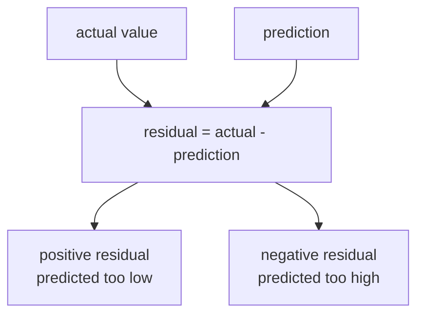
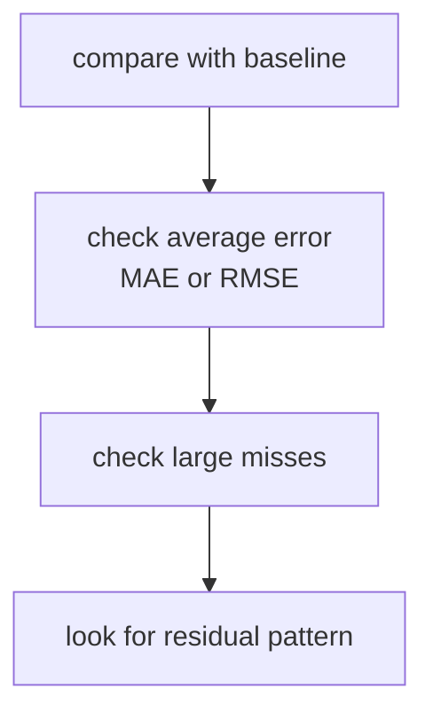

# P3-10.2 선형회귀의 평가와 한계

P3-10.1에서는 선형회귀(linear regression)를 `관계를 직선으로 먼저 읽어 보는 모델`로 보았습니다. 이제 다음 질문으로 넘어갑니다.

`그 직선이 실제로 얼마나 잘 맞았는가, 그리고 어디서부터 쉽게 틀어지는가?`

이 질문이 바로 평가(evaluation)와 한계(limit)의 출발점입니다.

초심자는 종종 선형회귀를 학습한 뒤 `기울기가 그럴듯하다`, `예측값이 비슷해 보인다` 정도에서 멈춥니다. 하지만 알고리즘 장에서는 거기서 한 단계 더 나가야 합니다. 예측과 실제의 차이를 어떻게 읽을지, 어떤 지표(metric)로 요약할지, 그리고 직선 가정이 언제 무리해지는지를 함께 봐야 합니다.

즉, 이 절은 `직선을 그렸다`에서 끝나지 않고, `그 직선이 데이터를 얼마나 설명했는가`를 읽는 절입니다.

## 이 절의 범위

이 절은 다음 질문에 답합니다.

- 잔차(residual)와 오차(error)는 어떻게 이해하면 좋은가?
- 선형회귀의 예측이 잘 맞는다는 말은 무엇을 뜻하는가?
- MAE, MSE, RMSE, R²를 입문 수준에서 어떻게 구분할 수 있는가?
- 직선 가정이 어긋나면 어떤 한계가 생기는가?
- 선형회귀 결과를 어디까지 믿고, 어디서부터 조심해야 하는가?

이 절은 다음 내용은 깊게 다루지 않습니다.

- 통계적 유의성 검정
- 잔차의 정규성, 등분산성에 대한 엄밀 검정
- 다중공선성 진단
- 정규화(regression regularization)와 feature engineering의 심화

그 내용은 뒤 절이나 보충학습에서 다시 연결할 수 있습니다.

## 이 절의 목표

- 잔차를 `실제값과 예측값의 차이`로 설명할 수 있습니다.
- MAE, MSE, RMSE, R²를 각각 어떤 관점의 지표인지 말할 수 있습니다.
- 큰 오차를 더 민감하게 보는 지표와 덜 민감하게 보는 지표를 구분할 수 있습니다.
- 선형회귀가 잘 맞지 않는 전형적인 상황을 설명할 수 있습니다.
- 좋은 숫자 하나만 보고 선형회귀를 과신하면 안 되는 이유를 이해할 수 있습니다.

## 이 절이 커리큘럼에서 필요한 이유

P3-10.1은 선형회귀를 `관계를 요약하는 첫 모델`로 소개했습니다. 하지만 모델을 세웠다면 다음에는 반드시 `얼마나 맞았는가`를 읽어야 합니다.

- 직선이 있어도 예측 오차는 남습니다.
- 오차가 남는다면 그 크기를 어떻게 요약할지 정해야 합니다.
- 지표가 좋아 보여도, 직선이 놓친 패턴이 있으면 모델을 다시 의심해야 합니다.

따라서 이 절은 알고리즘 장에서 다음 역할을 합니다.

| 커리큘럼 위치 | 이 절의 역할 |
| --- | --- |
| P3-10.1 뒤 | 직관적 해석을 수치 평가로 연결 |
| P3-6 평가 지표 뒤 | 회귀 지표를 실제 모델 문맥으로 재사용 |
| P3-11 이후 다른 알고리즘 전 | `예측이 맞는가`와 `모델이 잘 설명하는가`를 구분하는 기준 제공 |

즉, P3-10.1이 `모델의 모양`을 보는 절이었다면, P3-10.2는 `모델의 남는 차이`를 보는 절입니다.

## 잔차(residual)와 오차(error)는 무엇이 다른가

입문 단계에서는 두 용어가 비슷하게 보일 수 있습니다. 이 책에서는 다음처럼 구분해 두면 충분합니다.

- 잔차(residual): 개별 데이터에서 `실제값 - 예측값`
- 오차(error): 모델이 남긴 차이를 일반적으로 가리키는 말

예를 들어 실제 점수가 72점이고 예측값이 68점이면 잔차는 `72 - 68 = 4`입니다. 반대로 실제 점수가 64점인데 예측값이 67점이면 잔차는 `64 - 67 = -3`입니다.

이때 중요한 것은 부호(sign)와 크기(size)입니다.

- 양수 잔차: 모델이 실제보다 작게 예측함
- 음수 잔차: 모델이 실제보다 크게 예측함
- 절댓값이 큼: 그 데이터에서는 예측이 더 많이 빗나감

이 차이를 간단히 그리면 다음과 같습니다.



핵심은 잔차가 단순한 `틀림`이 아니라, `어느 방향으로 얼마나 틀렸는가`를 보여 준다는 점입니다.

## 선형회귀의 예측이 잘 맞는다는 말은 무엇인가

회귀에서는 분류처럼 `정답/오답`으로 바로 나누기 어렵습니다. 숫자 예측은 대개 조금씩 빗나가기 때문입니다. 그래서 회귀 모델을 읽을 때는 `얼마나 자주 맞는가`보다 `평균적으로 얼마나 멀리 빗나가는가`를 먼저 봅니다.

예를 들어 같은 두 모델이 있다고 합시다.

| 모델 | 오차의 특징 |
| --- | --- |
| 모델 A | 대부분 2~3점 정도씩 빗나감 |
| 모델 B | 대부분은 비슷하지만 가끔 20점씩 크게 빗나감 |

둘 다 평균적으로 그럴듯해 보일 수 있지만, 실제 사용에서는 B가 더 위험할 수 있습니다. 그래서 회귀 평가는 `오차를 어떻게 요약하느냐`가 핵심입니다.

즉, 회귀에서 `잘 맞는다`는 말은 보통 다음 질문으로 다시 풀어야 합니다.

- 평균적으로 얼마나 빗나가는가?
- 큰 오차가 자주 있는가?
- baseline보다 실제로 나아졌는가?
- 직선이 놓치는 구조적 패턴이 있는가?

## MAE, MSE, RMSE는 어떻게 구분하면 좋은가

scikit-learn의 회귀 지표 문서는 평균 절대 오차(mean absolute error), 평균 제곱 오차(mean squared error), 결정계수(R²) 같은 지표를 제공합니다. 초심자는 수식보다 `무엇을 더 민감하게 벌주느냐`로 먼저 이해하는 편이 좋습니다.

### MAE(mean absolute error)

MAE는 잔차의 절댓값을 평균낸 값입니다.

- 해석이 직관적입니다.
- 평균적으로 몇 점, 몇 분, 몇 원 정도 빗나가는지 읽기 쉽습니다.
- 큰 오차를 특별히 과장하지는 않습니다.

즉, MAE는 `평균적으로 얼마나 틀리는가`를 가장 담백하게 보여 주는 지표입니다.

### MSE(mean squared error)

MSE는 잔차를 제곱한 뒤 평균냅니다.

- 큰 오차에 더 민감합니다.
- 작은 오차 여러 개보다 큰 오차 몇 개를 더 무겁게 봅니다.
- 해석은 직관적이지 않을 수 있습니다. 단위가 제곱되기 때문입니다.

즉, MSE는 `큰 실수를 더 강하게 벌주고 싶을 때` 유용합니다.

### RMSE(root mean squared error)

RMSE는 MSE에 다시 제곱근을 취한 값입니다.

- 큰 오차에 민감하다는 장점은 유지합니다.
- 단위를 원래 값의 단위로 되돌려 읽기 쉬워집니다.

즉, RMSE는 `큰 오차를 민감하게 보되, 해석은 실제 단위로 하고 싶을 때` 자주 봅니다.

이 차이를 아주 짧게 정리하면 다음과 같습니다.

| 지표 | 입문적 해석 |
| --- | --- |
| MAE | 평균적으로 얼마나 틀리는가 |
| MSE | 큰 오차를 더 강하게 벌주는 평균 오차 |
| RMSE | 큰 오차에 민감하지만 단위는 원래 단위로 읽는 오차 |

실무형 장면으로 바꾸면 이 차이는 더 분명해집니다.

| 업무 상황 | 더 먼저 볼 지표 | 이유 |
| --- | --- | --- |
| 택배 도착 시간 예측 | MAE | 평균적으로 몇 분 정도 빗나가는지 바로 읽고 싶기 때문 |
| 병원 대기 시간 예측 | RMSE | 일부 환자에게 너무 큰 지연이 생기면 더 민감하게 보고 싶기 때문 |
| 매출 예측 | MAE + RMSE | 평균적인 빗나감과 큰 실패를 함께 보고 싶기 때문 |
| 설비 고장 시점 예측 | RMSE | 드문 큰 오차가 운영 리스크로 이어질 수 있기 때문 |

즉, 지표 선택은 수학 취향이 아니라 `어떤 실수가 더 아픈가`의 문제와 연결됩니다.

## R²는 무엇을 보여 주는가

R²(score, coefficient of determination)는 선형회귀 입문에서 자주 보이는 숫자지만, 초심자는 쉽게 오해합니다. 이 절에서는 다음 수준으로 이해하면 충분합니다.

`R²는 이 모델이 단순한 평균 예측보다 데이터를 얼마나 더 설명하는지 보여 주는 요약값이다.`

입문적으로는 다음처럼 읽을 수 있습니다.

- R²가 1에 가까움: 현재 데이터에서 직선이 꽤 많은 변동을 설명함
- R²가 0에 가까움: 평균으로 예측하는 것과 큰 차이가 없음
- R²가 음수일 수도 있음: 평균 예측보다도 못할 수 있음

여기서 중요한 것은 R²가 `무조건 높을수록 좋다`는 단순 점수처럼 읽히기 쉽다는 점입니다. 하지만 R² 하나만으로는 큰 오차 몇 개가 숨어 있는지 알 수 없습니다. 따라서 MAE, RMSE 같은 오차 지표와 함께 보는 편이 안전합니다.

실증적으로도 이런 장면은 자주 나옵니다. 예를 들어 매출 예측에서 대부분의 평일은 잘 맞지만, 몇 번의 대형 행사일에 크게 틀릴 수 있습니다. 이 경우 전체 변동은 꽤 설명해서 R²는 높게 나올 수 있어도, 운영자는 그 몇 번의 큰 실패 때문에 모델을 신뢰하기 어려울 수 있습니다.

즉, R²는 `전체 설명력`에는 강하지만, `개별 큰 실패의 체감`을 대신해 주지는 않습니다.

## 지표는 어떻게 같이 읽어야 하는가

선형회귀를 읽을 때 지표 하나만 보면 해석이 흔들리기 쉽습니다. 예를 들어 다음 장면을 생각해 볼 수 있습니다.

| 장면 | 해석 위험 |
| --- | --- |
| R²는 높다 | 큰 오차가 몇 개 숨어 있을 수 있음 |
| MAE는 낮다 | 특정 구간에서 구조적으로 틀릴 수 있음 |
| RMSE가 높다 | 큰 실수가 일부 있다는 신호일 수 있음 |

그래서 입문 단계에서도 다음 순서로 보는 습관이 좋습니다.

1. baseline보다 나아졌는가?
2. 평균 오차는 어느 정도인가?
3. 큰 오차가 유난히 존재하는가?
4. 잔차가 한쪽 방향으로 몰리지는 않는가?

이 순서를 간단히 그리면 다음과 같습니다.



핵심은 `숫자가 하나 좋아 보인다`에서 멈추지 않는 것입니다.

### 실증 예시 1. 배송 시간 예측

같은 지역 배송 시간을 예측한다고 해 보겠습니다.

| 모델 | MAE | RMSE | 해석 |
| --- | --- | --- | --- |
| 모델 A | 8분 | 9분 | 전반적으로 고르게 틀림 |
| 모델 B | 7분 | 18분 | 평균은 더 좋아 보이지만, 큰 실패가 섞여 있음 |

이 경우 평균적인 숫자만 보면 B가 좋아 보일 수 있습니다. 하지만 일부 고객에게 30분, 40분씩 늦는 일이 섞여 있다면 실제 서비스 체감은 오히려 더 나쁠 수 있습니다.

즉, 실증 예시는 MAE와 RMSE를 함께 읽어야 하는 이유를 보여 줍니다.

### 실증 예시 2. 집값 예측

집값 예측에서는 대부분의 중간 가격대는 잘 맞는데, 아주 비싼 주택에서 크게 틀릴 수 있습니다.

- MAE는 꽤 낮을 수 있습니다.
- RMSE는 큰 고가 주택 오차 때문에 더 높아질 수 있습니다.
- R²는 전체 변동을 많이 설명해서 높게 나올 수도 있습니다.

이 장면에서 중요한 질문은 `평균적으로 괜찮은가`가 아니라 `어느 구간에서 특히 위험한가`입니다.

즉, 지표는 전체 평균을 보여 주지만, 실무 해석은 구간별 실패 패턴까지 보아야 완성됩니다.

## 선형회귀가 잘 맞지 않는 전형적인 상황은 무엇인가

선형회귀의 한계는 대부분 `직선 하나로는 부족한데도 직선으로 밀어붙일 때` 드러납니다.

대표적인 장면은 다음과 같습니다.

### 1. 관계가 비선형적일 때

입력이 커질수록 출력이 처음에는 빠르게 늘다가, 어느 지점 이후 완만해질 수 있습니다. 이런 경우 직선 하나는 초반과 후반을 동시에 잘 맞추기 어렵습니다.

예를 들어 공부 시간이 늘수록 점수는 올라가지만, 일정 시간 이상에서는 상승 폭이 줄어드는 경우가 그렇습니다.

### 2. 구간마다 관계가 달라질 때

어떤 데이터는 특정 구간 전후로 성격이 바뀝니다.

- 소형 주택과 대형 주택의 가격 구조가 다를 수 있음
- 짧은 배송 거리와 장거리 배송의 시간 패턴이 다를 수 있음

이런 경우 전체를 하나의 직선으로 요약하면 평균적으로는 그럴듯해 보여도, 각 구간에서는 계속 틀릴 수 있습니다.

### 3. 중요한 특징이 빠졌을 때

직선 자체가 문제가 아니라, 설명에 필요한 입력(feature)이 빠져 있을 수도 있습니다.

예를 들어 집값 예측에서 크기만 넣고 위치를 빼면, 모델은 크기와 가격의 관계를 읽는 척하지만 실제로는 중요한 구조를 놓치게 됩니다.

### 4. 이상치(outlier)가 강할 때

선형회귀는 큰 오차를 무시하지 못합니다. 데이터 몇 개가 유난히 멀리 있으면, 직선이 그 점들에 끌려가 전체 해석이 흔들릴 수 있습니다.

실증 장면으로는 다음과 같은 경우가 있습니다.

- 평소 5분~20분 사이이던 배송 시간이, 폭우 하루 때문에 90분이 찍힘
- 대부분 2천만~6천만 원이던 매출이, 특정 행사 한 번으로 20억 원이 찍힘
- 일반 주택 가격대 속에 초고가 펜트하우스 몇 건이 섞임

이런 데이터는 현실적으로는 중요한 사건일 수 있지만, 직선 하나로 전체를 읽을 때는 모델을 과도하게 끌어당길 수 있습니다.

즉, 선형회귀의 한계는 `알고리즘이 나쁘다`기보다, `현재 문제를 직선 하나로 요약하는 것이 무리일 수 있다`는 신호로 읽는 편이 좋습니다.

## 학술적 배경과 역사

평가와 한계를 먼저 본 뒤에야, 선형회귀가 왜 이런 방식으로 오차를 읽는지 역사적 배경도 더 자연스럽게 이해할 수 있습니다. 선형회귀의 배경에는 두 개의 흐름이 함께 있습니다.

첫 번째는 `least squares`의 흐름입니다. 관측 오차가 있는 데이터를 가장 잘 설명하는 선이나 식을 어떻게 고를 것인가 하는 문제는 19세기 초 천문학(astronomy)과 측지학(geodesy)에서 매우 중요했습니다. 이 맥락에서 least squares는 관측값의 차이를 체계적으로 줄이는 방법으로 빠르게 자리 잡았습니다.

두 번째는 `regression`이라는 이름의 흐름입니다. `regression`이라는 말은 19세기 후반 Francis Galton의 유전과 키(height) 연구에서 널리 알려졌습니다. 당시에는 극단적인 값이 다음 세대에서 평균 쪽으로 돌아오는 경향을 설명하는 말이었고, 이후 통계학에서 더 일반적인 선형 관계 추정의 이름으로 넓어졌습니다.

초심자 관점에서는 이 정도로 정리하면 충분합니다.

- least squares는 `오차를 줄이는 계산 방법`의 역사에서 왔습니다.
- regression은 `관계를 수량화하려는 통계적 해석`의 역사에서 왔습니다.
- 오늘의 선형회귀는 이 두 흐름이 합쳐진 결과로 볼 수 있습니다.

이 배경을 알고 나면, 선형회귀가 단지 교과서의 첫 알고리즘이 아니라 `관측 오차를 다루는 방법`과 `관계를 해석하는 방법`이 만나는 지점이라는 사실이 더 분명해집니다.

## 주요 논란은 어디에서 생기는가

이제 지표와 한계를 본 뒤에야, 선형회귀를 둘러싼 논란도 더 정확히 읽을 수 있습니다. 선형회귀 자체는 오래된 고전 도구이지만, 해석을 둘러싼 논란은 지금도 반복됩니다. 초심자에게 중요한 논란은 다음 네 가지입니다.

### 1. 예측(prediction)과 설명(explanation)을 같은 말처럼 다루는 문제

어떤 회귀식이 예측을 꽤 잘한다고 해서, 그 계수가 곧 현실의 원인을 설명한다고 단정할 수는 없습니다. 예측 성능이 있는 것과 인과(causality)를 설명하는 것은 다른 문제입니다.

이 논란은 데이터 기반 서비스에서도 자주 보입니다.

- 매출 예측이 잘 된다고 해서 광고비 계수가 곧 원인 효과를 증명하는 것은 아님
- 집값 예측이 잘 된다고 해서 특정 변수 하나가 가격을 결정한다고 단정할 수는 없음

즉, 선형회귀는 설명을 돕지만, 인과를 자동으로 증명하지는 않습니다.

### 2. 계수(coefficient)를 곧 중요도(importance)로 읽는 문제

계수 숫자가 크다고 해서 그 특징이 더 본질적이라고 바로 말할 수는 없습니다. 단위(scale), 전처리(preprocessing), 변수 선택 방식이 함께 영향을 주기 때문입니다.

이 논란은 특히 다변수 회귀에서 자주 생깁니다. 독자는 선형회귀의 계수를 볼 때 `크다/작다`보다 먼저 `어떤 단위로 측정되었는가`를 물어야 합니다.

### 3. 높은 R²를 과신하는 문제

R²가 높으면 모델이 데이터를 잘 설명하는 것처럼 보입니다. 하지만 일부 큰 실패, 특정 구간의 구조적 오차, 중요한 변수 누락은 높은 R² 아래에서도 숨을 수 있습니다.

즉, R²는 유용한 요약값이지만 최종 판정값은 아닙니다.

### 4. 회귀의 역사적 출발점과 사회적 해석 사이의 문제

`regression`이라는 용어는 Galton의 유전 연구와 함께 널리 퍼졌고, 그 주변에는 오늘날 비판적으로 검토되는 유전 결정론(determinism)과 우생학(eugenics)의 역사도 있었습니다. 현대 통계학과 머신러닝에서 선형회귀를 배울 때는 그 수학적 도구 자체와, 당시의 사회적 해석을 분리해서 읽는 태도가 필요합니다.

이 지점은 기술적 한계와는 다른 종류의 논란이지만, `숫자로 관계를 설명한다`는 일이 사회적 의미를 자동으로 정당화하지 않는다는 점을 보여 줍니다.

## 좋은 선형회귀 해석과 나쁜 선형회귀 해석

선형회귀는 해석 가능성이 높다는 장점이 있지만, 그만큼 섣부른 해석도 쉽게 나옵니다.

| 나쁜 해석 | 더 나은 해석 |
| --- | --- |
| 기울기가 양수이니 원인이다 | 양의 관계가 보이지만, 원인은 별도 검토가 필요하다 |
| R²가 높으니 충분히 좋다 | R²는 높지만 큰 오차와 잔차 패턴도 함께 봐야 한다 |
| 계수가 크니 가장 중요한 특징이다 | 계수는 단위와 전처리 맥락을 함께 봐야 한다 |
| 예측값이 76.4이니 실제도 그 근처다 | 현재 모델은 그 근처를 추정하지만, 오차 가능성은 남아 있다 |

초심자에게 특히 중요한 것은 다음 문장입니다.

`선형회귀는 설명을 시작하게 해 주지만, 설명을 끝내 주지는 않는다.`

## Python 예제로 잔차와 지표 함께 보기

아래 예제는 10.1의 공부 시간 데이터를 다시 사용해, 예측값과 잔차, MAE, RMSE, R²를 함께 확인하는 작은 실습입니다.

- 문제 상황: 공부 시간으로 시험 점수를 예측한 뒤, 얼마나 빗나갔는지 확인합니다.
- 입력(input): 공부 시간
- 정답(label): 실제 시험 점수
- 확인할 개념:
  - 잔차는 데이터마다 따로 생깁니다.
  - MAE와 RMSE는 오차를 요약합니다.
  - R²는 평균 예측보다 얼마나 더 설명하는지 보여 줍니다.

```python
import numpy as np
from sklearn.linear_model import LinearRegression
from sklearn.metrics import mean_absolute_error, mean_squared_error, r2_score

study_hours = np.array([1, 2, 3, 4, 5, 6]).reshape(-1, 1)
exam_score = np.array([52, 55, 61, 64, 68, 72])

model = LinearRegression()
model.fit(study_hours, exam_score)

pred = model.predict(study_hours)
residuals = exam_score - pred

print("predictions :", np.round(pred, 3))
print("residuals   :", np.round(residuals, 3))
print("MAE         :", round(mean_absolute_error(exam_score, pred), 3))
print("RMSE        :", round(mean_squared_error(exam_score, pred) ** 0.5, 3))
print("R2          :", round(r2_score(exam_score, pred), 3))
```

실행 결과 예시는 다음과 같습니다.

```text
predictions : [51.714 55.829 59.943 64.057 68.171 72.286]
residuals   : [ 0.286 -0.829  1.057 -0.057 -0.171 -0.286]
MAE         : 0.448
RMSE        : 0.608
R2          : 0.992
```

이 출력은 다음처럼 읽을 수 있습니다.

- 잔차가 양수와 음수로 섞여 있으므로, 한쪽으로만 계속 틀리는 모습은 강하지 않습니다.
- MAE 약 `0.448`은 평균적으로 0.45점 정도 빗나간다는 뜻입니다.
- RMSE 약 `0.608`은 큰 오차를 조금 더 민감하게 반영한 평균 오차입니다.
- R² 약 `0.992`는 이 작은 예제에서는 직선이 데이터 변동을 상당히 잘 설명하고 있음을 보여 줍니다.

하지만 여기서도 조심할 점이 있습니다.

- 이 예제는 데이터가 작고 단순합니다.
- 학습 데이터와 같은 점에서 다시 평가했기 때문에 실제 일반화 성능과는 다를 수 있습니다.
- 숫자가 예쁘게 나왔다고 해서, 모든 회귀 문제에서 선형회귀가 충분하다는 뜻은 아닙니다.

즉, 지표는 해석을 돕는 도구이지, 한 번에 최종 판정을 내려 주는 도구는 아닙니다.

## Python 예제로 이상치가 지표를 어떻게 흔드는지 보기

아래 예제는 같은 흐름의 데이터에 마지막 한 점의 큰 오차를 일부러 넣어, MAE와 RMSE가 어떻게 다르게 반응하는지 보여 줍니다.

- 문제 상황: 대부분은 비슷한 패턴인데, 한 데이터만 크게 빗나가는 상황을 가정합니다.
- 확인할 개념:
  - MAE는 평균적인 빗나감을 보여 줍니다.
  - RMSE는 큰 실패 하나에 더 민감하게 반응합니다.

```python
import numpy as np
from sklearn.metrics import mean_absolute_error, mean_squared_error

actual = np.array([52, 55, 61, 64, 68, 72])
pred_good = np.array([51, 56, 60, 65, 67, 73])
pred_outlier = np.array([51, 56, 60, 65, 67, 90])

print("good MAE    :", round(mean_absolute_error(actual, pred_good), 3))
print("good RMSE   :", round(mean_squared_error(actual, pred_good) ** 0.5, 3))
print("outlier MAE :", round(mean_absolute_error(actual, pred_outlier), 3))
print("outlier RMSE:", round(mean_squared_error(actual, pred_outlier) ** 0.5, 3))
```

실행 결과 예시는 다음과 같습니다.

```text
good MAE    : 1.0
good RMSE   : 1.0
outlier MAE : 3.833
outlier RMSE: 7.431
```

이 출력은 해석 훈련에 매우 유용합니다.

- `good` 예측에서는 MAE와 RMSE가 거의 같습니다.
- 마지막 한 점이 크게 틀린 `outlier` 예측에서는 MAE도 커지지만, RMSE가 훨씬 더 크게 반응합니다.

즉, 실증적으로 보면 RMSE는 `큰 실패를 더 싫어하는 지표`라는 말이 숫자로 바로 드러납니다.

## 이 절에서 기억할 관점

- 잔차(residual)는 실제값과 예측값의 차이입니다.
- MAE는 평균적으로 얼마나 빗나가는지, RMSE는 큰 오차를 더 민감하게 반영한 평균 오차를 보여 줍니다.
- R²는 평균 예측보다 얼마나 더 설명하는지를 보여 주는 요약값입니다.
- 지표 하나만 보면 해석이 흔들릴 수 있으므로, baseline, 평균 오차, 큰 오차, 잔차 패턴을 함께 봐야 합니다.
- 선형회귀의 한계는 대개 `직선 하나로는 부족한 문제`에서 드러납니다.

## 체크리스트

- 잔차의 부호가 무엇을 뜻하는지 설명할 수 있는가?
- MAE와 RMSE의 차이를 `큰 오차에 대한 민감도`로 설명할 수 있는가?
- R²를 단순 점수처럼만 읽지 않고 baseline 대비 설명력으로 이해했는가?
- 직선 가정이 어긋나는 장면을 한두 가지 예로 들 수 있는가?
- 좋은 숫자가 나와도 왜 바로 과신하면 안 되는지 설명할 수 있는가?

## 다음 절과의 연결

선형회귀를 지나면, 이제 `직선으로 연속값을 예측하는 모델`에서 `직선을 분류 경계처럼 읽는 모델`로 넘어갈 준비가 됩니다. 다음 Chapter 11의 로지스틱 회귀(logistic regression)는 이 연결을 가장 자연스럽게 보여 줍니다.

- 선형회귀: 연속값 예측
- 로지스틱 회귀: 분류를 위한 확률적 출력과 경계 해석

즉, 10장은 `직선이 회귀에서는 어떻게 쓰이는가`를 보여 주고, 11장은 `그 직선적 사고가 분류에서는 어떻게 바뀌는가`를 보여 줍니다.

## 출처와 참고 자료

- scikit-learn, `1.1. Linear Models`, scikit-learn User Guide, 확인 날짜: 2026-06-26. [https://scikit-learn.org/stable/modules/linear_model.html](https://scikit-learn.org/stable/modules/linear_model.html){: target="_blank" rel="noopener noreferrer" }
- scikit-learn, `3.4. Metrics and scoring: quantifying the quality of predictions`, scikit-learn User Guide, 확인 날짜: 2026-06-26. [https://scikit-learn.org/stable/modules/model_evaluation.html](https://scikit-learn.org/stable/modules/model_evaluation.html){: target="_blank" rel="noopener noreferrer" }
- scikit-learn, `mean_absolute_error`, scikit-learn API Reference, 확인 날짜: 2026-06-26. [https://scikit-learn.org/stable/modules/generated/sklearn.metrics.mean_absolute_error.html](https://scikit-learn.org/stable/modules/generated/sklearn.metrics.mean_absolute_error.html){: target="_blank" rel="noopener noreferrer" }
- scikit-learn, `mean_squared_error`, scikit-learn API Reference, 확인 날짜: 2026-06-26. [https://scikit-learn.org/stable/modules/generated/sklearn.metrics.mean_squared_error.html](https://scikit-learn.org/stable/modules/generated/sklearn.metrics.mean_squared_error.html){: target="_blank" rel="noopener noreferrer" }
- scikit-learn, `r2_score`, scikit-learn API Reference, 확인 날짜: 2026-06-26. [https://scikit-learn.org/stable/modules/generated/sklearn.metrics.r2_score.html](https://scikit-learn.org/stable/modules/generated/sklearn.metrics.r2_score.html){: target="_blank" rel="noopener noreferrer" }
