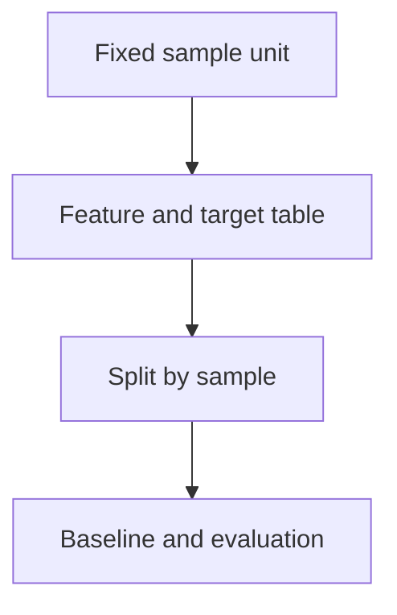

# 3.20 Part 4로 넘기기 전에 무엇을 다시 점검해야 하는가

> Section ID: `P3-10.2`
> Version: `v2026.07.06`

Part 4에서는 학습/검증/평가 분할(train, validation, test)과 기준 모델(baseline), 평가(evaluation)를 다룹니다. 하지만 그 내용은 아무 표에서나 바로 시작할 수 있는 주제가 아닙니다. 샘플 단위가 흔들리거나, 목표 라벨이 불안정하거나, 비교 구조와 평가 구조를 혼동하면 분할(split)과 평가 설명도 함께 흔들립니다. 그래서 Part 3의 마지막 문장은 언제나 `이제 무엇을 넘겨도 되는가`와 `무엇은 아직 넘기지 않는가`를 다시 확인하는 쪽으로 끝나야 합니다.

그래서 넘어가기 전에는 다음 항목을 다시 확인해야 합니다.

| 확인 항목 | 왜 필요한가 |
| --- | --- |
| 샘플 단위가 고정되었는가 | 분할과 평가 단위가 함께 정해지기 때문 |
| 특징과 목표 라벨이 구분되었는가 | 무엇을 입력으로 쓰고 무엇을 맞히는지 정해야 하기 때문 |
| 기준선 비교와 모델 기준점(baseline)을 구분하는가 | 같은 단어를 다른 뜻으로 쓰지 않기 위해 |
| 비교 리포트로 남길 문제를 분리했는가 | 모든 문제를 억지로 예측 문제로 만들지 않기 위해 |
| 목표 라벨이 비교적 안정적인가 | 아직 검토 큐 수준의 판단을 무리하게 라벨로 고정하지 않기 위해 |

특히 샘플 단위가 흔들리면 분할도 흔들립니다. 시점별 측정값을 샘플처럼 다루면 같은 동작에서 나온 행들이 훈련과 평가에 섞일 수 있고, 그러면 실제보다 더 잘 맞는 것처럼 보일 수 있습니다. 따라서 Part 4의 학습/검증/평가 분할 설명은 Part 3의 샘플 정의를 전제로 합니다.

또 하나 주의할 점은 `baseline`이라는 단어의 층위가 달라진다는 사실입니다. Part 3에서는 기준선이 `최근 상태를 무엇과 비교할 것인가`를 뜻했다면, Part 4에서는 기준 모델이나 기준 지표처럼 `모델 평가의 출발점`을 뜻하는 맥락이 등장합니다. 같은 단어라도 단계와 역할이 달라진다는 점을 미리 구분해야 혼동이 줄어듭니다.

이 인계 구조는 아래처럼 정리됩니다.


```mermaid
flowchart TD
    A[Fixed sample unit] --> B[Feature and target table]
    B --> C[Split by sample]
    C --> D[Baseline and evaluation]
```

이 순서를 거꾸로 읽으면 안 됩니다. `Split by sample`이 가능하려면 먼저 `Fixed sample unit`이 있어야 하고, 평가 지표를 붙이기 전에 `Feature and target table`이 무엇인지 분명해야 합니다. 즉 Part 4는 빈 상태에서 시작하지 않고, Part 3가 설계한 표 구조를 이어받아 시작합니다.

직전 절의 인계 표를 여기서 다시 짧게 점검 질문으로 바꾸면 다음과 같습니다.

| 인계 전 점검 | 지금 바로 확인할 것 |
| --- | --- |
| 샘플 단위 | 한 행이 정말 같은 종류의 동작 1건인가 |
| 특징 표 | 입력 열이 설명 가능한 특징으로만 구성되었는가 |
| 목표 라벨 | 나중에 맞히고 싶은 결과가 비교적 일관되게 붙는가 |
| 분할 전제 | 같은 동작이 훈련/평가 양쪽에 섞이지 않는가 |

따라서 Part 4로 넘어가기 직전에는 단순히 파일이 있는지보다, 그 파일이 어떤 전제를 이미 만족하는지 다시 확인해야 합니다. 예를 들어 CSV가 하나 있다고 해서 곧바로 학습을 시작하는 것이 아니라, 그 안의 행이 정말 같은 단위인지, 목표 라벨이 예측 문제로 올릴 만큼 안정적인지, 비교 리포트로 남길 문제를 억지로 끌고 오지 않았는지를 먼저 확인해야 합니다. 머신러닝은 정리되지 않은 문제 정의를 대신 정리해 주지 않으므로, 인계 직전의 점검이 곧 모델링 품질의 시작점이 됩니다.

아래 예시는 왜 분할 전제를 먼저 확인해야 하는지 보여 줍니다.

```python
import pandas as pd

dataset = pd.DataFrame(
    [
        {"event_id": "A", "row_id": "A-0", "feature": 0.8, "review_needed": 1},
        {"event_id": "A", "row_id": "A-1", "feature": 1.1, "review_needed": 1},
        {"event_id": "B", "row_id": "B-0", "feature": 0.3, "review_needed": 0},
        {"event_id": "B", "row_id": "B-1", "feature": 0.4, "review_needed": 0},
    ]
)

row_level_train = dataset.iloc[[0, 2]]
row_level_test = dataset.iloc[[1, 3]]

event_level = (
    dataset.groupby("event_id")
    .agg(feature_mean=("feature", "mean"), review_needed=("review_needed", "max"))
    .reset_index()
)

print("row-level train event_ids:", row_level_train["event_id"].tolist())
print("row-level test event_ids:", row_level_test["event_id"].tolist())
print(event_level)
```

예상 출력:

```text
row-level train event_ids: ['A', 'B']
row-level test event_ids: ['A', 'B']
  event_id  feature_mean  review_needed
0        A          0.95              1
1        B          0.35              0
```

행 단위로 나누면 훈련과 평가에 같은 `event_id`가 함께 들어갑니다. 반면 동작 1회를 샘플로 고정하면 `event_level`처럼 두 건의 샘플이 생기고, 그 다음에야 올바른 분할을 논할 수 있습니다. 즉 분할(split)은 단순히 데이터를 나누는 기술이 아니라, 샘플 단위가 고정된 뒤에야 의미가 생깁니다.

넘어가기 전 마지막 점검 질문을 짧게 정리하면 다음과 같습니다.

- 이 표의 한 행은 정말 같은 종류의 샘플인가
- 특징과 목표 라벨 구분을 한 문장으로 설명할 수 있는가
- 기준선 비교용 열과 모델 평가용 baseline 개념을 구분하고 있는가
- 아직 비교 리포트로 두어야 할 문제를 무리하게 예측 문제로 바꾸고 있지 않은가

이 질문에 답할 수 있어야 Part 4의 분할(split), 기준 모델(baseline), 평가(evaluation)를 절차 암기가 아니라 구조 이해로 읽을 수 있습니다.

Part 4 첫 구간에서 실제로 하게 될 일은 다음과 같습니다.

1. 동작 1회 같은 샘플 단위가 정말 고정되었는지 다시 본다.
2. 입력으로 줄 열과 맞히고 싶은 결과 열을 분리한다.
3. 같은 동작이 학습용과 평가용 양쪽에 동시에 들어가지 않도록 분할 기준을 정한다.
4. 그 다음에야 기준 모델과 평가 점수를 붙일 준비가 되었다고 말할 수 있다.

즉 Part 4는 `모델부터 고르는 장`이 아니라 `이미 정리된 표를 학습 가능한 구조로 넘기는 장`입니다.

이 절의 마지막 문장은 다음과 같습니다. `머신러닝은 정리되지 않은 데이터를 대신 정리해 주지 않는다.` Part 4는 Part 3에서 만든 구조를 이어받아 학습, 분리, 평가를 설명하는 자리입니다. 따라서 Part 3의 마무리는 끝맺음이면서도, 동시에 Part 4의 입력 정의이기도 합니다.
