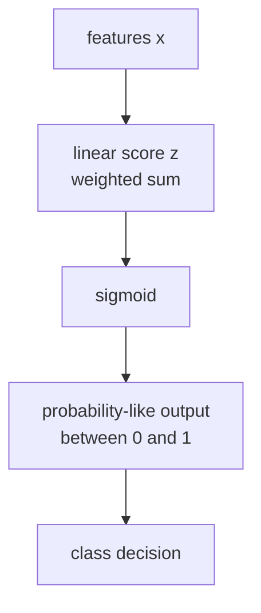

# P3-11.1 로지스틱 회귀(logistic regression)의 직관

P3-10에서는 선형회귀(linear regression)를 통해 `직선으로 연속값을 예측하는 방법`을 보았습니다. 이제 같은 선형적 사고가 분류(classification)에서는 어떻게 바뀌는지로 넘어갑니다.

이번 절의 중심 질문은 다음입니다.

`직선적 계산을 유지하면서, 출력은 0과 1 사이의 값으로 읽고 싶다면 어떻게 해야 할까?`

이 질문이 바로 로지스틱 회귀(logistic regression)의 출발점입니다.

초심자는 종종 이름 때문에 헷갈립니다. `회귀(regression)`라고 부르는데 왜 분류를 하는가? 이 혼란은 자연스럽습니다. 로지스틱 회귀는 최종 목적은 분류이지만, 내부에서는 여전히 선형 결합(linear combination)을 계산하고, 그 값을 확률처럼 읽히는 형태로 바꾸기 때문에 이런 이름이 남아 있습니다.

즉, 로지스틱 회귀는 `선형회귀를 그대로 분류에 쓰는 모델`이 아니라, `선형 계산의 출력을 분류용 확률처럼 해석할 수 있게 바꾼 모델`입니다.

## 이 절의 범위

이 절은 다음 질문에 답합니다.

- 로지스틱 회귀는 왜 분류 문제에서 쓰이는가?
- 왜 이름은 `regression`인데 결과는 분류처럼 읽는가?
- 선형 결합이 어떻게 0과 1 사이의 값으로 바뀌는가?
- `predict_proba` 같은 출력은 무엇을 의미하는가?
- threshold(임계값)는 왜 필요한가?

이 절은 다음 내용은 깊게 다루지 않습니다.

- log-odds의 엄밀한 유도
- 최대우도추정(maximum likelihood estimation)의 수식 전개
- 다중 클래스(multinomial) 로지스틱 회귀의 세부 수식
- solver별 차이와 정규화 설정

그 내용은 11.2와 뒤의 알고리즘 절, 또는 보충학습으로 넘깁니다.

## 이 절의 목표

- 로지스틱 회귀를 `분류 문제에서 확률처럼 읽히는 출력을 만드는 선형 모델`이라고 설명할 수 있습니다.
- 선형회귀와 로지스틱 회귀의 공통점과 차이를 구분할 수 있습니다.
- sigmoid 함수가 왜 등장하는지 입문 수준에서 설명할 수 있습니다.
- `predict_proba`와 최종 class prediction이 다른 단계라는 점을 이해할 수 있습니다.
- threshold가 분류 판단에 개입한다는 사실을 설명할 수 있습니다.

## 이 절이 커리큘럼에서 필요한 이유

Part 3의 알고리즘 흐름은 회귀에서 분류로 갑자기 뛰지 않도록 설계되어 있습니다. 선형회귀를 먼저 본 이유는 로지스틱 회귀가 완전히 새로운 세계가 아니라, 같은 선형 모델 계열 안에서 출력 해석이 바뀐 사례라는 점을 보여 주기 위해서입니다.

| 커리큘럼 위치 | 로지스틱 회귀의 역할 |
| --- | --- |
| P3-10 선형회귀 뒤 | 선형적 사고를 분류 문제로 확장 |
| P3-6 평가 지표 뒤 | 확률 출력과 분류 지표의 연결 준비 |
| P3-11.2 앞 | 결정 경계(decision boundary) 개념의 도입 |

즉, 11.1은 `분류 모델을 처음 소개하는 절`이면서도, 동시에 `선형회귀와의 연속성`을 보여 주는 절입니다.

## 로지스틱 회귀는 어떤 문제를 다루는가

로지스틱 회귀는 보통 `둘 중 하나를 고르는 분류 문제(binary classification)`에서 먼저 소개됩니다.

예를 들면 다음과 같습니다.

| 업무 상황 | 예측하려는 값 |
| --- | --- |
| 고객이 이탈하는가? | 이탈 / 비이탈 |
| 이메일이 스팸인가? | 스팸 / 정상 |
| 거래가 사기인가? | 사기 / 정상 |
| 환자에게 특정 질환 위험이 높은가? | 위험 / 비위험 |

이런 문제의 공통점은 출력이 연속값이 아니라 `범주`라는 점입니다. 하지만 내부 계산은 여전히 숫자로 이뤄집니다.

초심자 기준으로는 이렇게 정리하면 충분합니다.

`로지스틱 회귀는 입력을 보고 한 클래스에 속할 가능성을 0과 1 사이의 값으로 추정한 뒤, 그 값을 기준으로 분류를 결정하는 모델이다.`

## 왜 이름은 regression인데 분류를 하는가

이 절에서 가장 먼저 풀어야 할 오해가 바로 이것입니다. 로지스틱 회귀는 분류를 하지만, 내부에서는 여전히 선형식(linear score)을 계산합니다.

가장 단순한 형태는 다음처럼 생각할 수 있습니다.

\\[
z = w_1x_1 + w_2x_2 + \cdots + w_nx_n + b
\\]

이 식은 선형회귀에서 보던 구조와 같습니다. 차이는 여기서 끝나지 않는다는 점입니다. 선형회귀는 이 값을 그대로 예측값으로 읽으려 했지만, 로지스틱 회귀는 이 값을 sigmoid 함수에 통과시켜 0과 1 사이 값으로 바꿉니다.

즉, 이름의 `regression`은 선형 결합과 수치적 추정 방식의 흔적이고, 실제 사용 목적은 `classification`에 더 가깝습니다.

## sigmoid 함수는 왜 필요한가

분류 문제에서 선형식의 출력값을 그대로 쓰면 1.7, -2.3, 5.8 같은 값이 나올 수 있습니다. 하지만 분류에서는 이런 값을 그대로 읽기 어렵습니다. 우리는 보통 `이 클래스일 가능성이 얼마나 큰가`를 0과 1 사이에서 읽고 싶어 합니다.

sigmoid 함수는 바로 이 역할을 합니다.

- 아주 큰 양수 입력은 1에 가까운 값으로 보냅니다.
- 아주 큰 음수 입력은 0에 가까운 값으로 보냅니다.
- 중간값은 0.5 근처로 보냅니다.

초심자 기준에서는 이 정도로 이해하면 충분합니다.

`sigmoid는 선형 계산 결과를 분류용으로 읽기 쉬운 0~1 범위의 값으로 눌러 넣는 함수다.`

이 흐름을 간단히 그리면 다음과 같습니다.



핵심은 로지스틱 회귀가 직선을 버리는 것이 아니라, `직선적 계산 뒤에 해석용 변환을 하나 더 붙인다`는 점입니다.

## 선형회귀와 로지스틱 회귀는 무엇이 같고 무엇이 다른가

두 모델은 선형 결합을 사용한다는 점에서 닮았습니다. 하지만 출력의 의미가 다릅니다.

| 항목 | 선형회귀 | 로지스틱 회귀 |
| --- | --- | --- |
| 주로 다루는 문제 | 회귀(regression) | 분류(classification) |
| 내부 계산 | 선형 결합 | 선형 결합 |
| 최종 출력 | 연속값 | 0~1 사이 값, 그리고 class 결정 |
| 입문적 해석 | 몇 점, 몇 분, 몇 원 예측 | 어느 클래스일 가능성이 큰가 |

즉, 로지스틱 회귀는 선형회귀와 완전히 다른 출발점을 갖는 모델이 아니라, 같은 선형적 구조를 분류용으로 재해석한 모델입니다.

## `predict_proba`는 무엇을 보여 주는가

scikit-learn의 로지스틱 회귀 문서에서 중요한 출력 중 하나는 `predict_proba`입니다. 초심자는 이 값을 곧바로 `최종 정답`처럼 읽기 쉽지만, 실제로는 한 단계 전의 정보입니다.

예를 들어 `0.82`라는 값이 나왔다면, 이는 보통 `모델이 positive class에 속할 가능성을 꽤 높게 본다`는 뜻입니다. 하지만 최종적으로 클래스를 0으로 찍을지 1로 찍을지는 threshold가 정합니다.

즉,

- `predict_proba`: 가능성의 정도
- `predict`: 최종 분류 결정

입니다.

이 차이를 놓치면 `점수(score)`와 `판단(decision)`을 같은 것으로 오해하게 됩니다.

아주 작은 예시로 보면 더 분명합니다.

| 사용자 | `predict_proba`로 읽은 class 1 점수 | 0.5 기준 판단 |
| --- | ---: | --- |
| A | 0.18 | class 0 |
| B | 0.49 | class 0 |
| C | 0.51 | class 1 |
| D | 0.87 | class 1 |

이 표에서 중요한 것은 B와 C입니다. 두 사용자의 점수 차이는 크지 않지만, threshold 0.5를 기준으로 최종 class는 갈립니다. 즉, 모델이 만든 점수 공간은 연속적이지만, 서비스의 판단은 그 위에서 불연속적으로 나뉠 수 있습니다.

## threshold(임계값)는 왜 필요한가

로지스틱 회귀는 대개 0.5를 기준으로 분류를 결정하는 예시로 처음 소개됩니다.

- 확률처럼 읽히는 값 >= 0.5 이면 class 1
- 확률처럼 읽히는 값 < 0.5 이면 class 0

하지만 이 기준은 자연법칙이 아니라 선택된 정책(policy)입니다.

예를 들어 사기 탐지에서는 놓치는 비용이 크기 때문에 더 민감하게 잡고 싶을 수 있습니다. 반대로 정상 사용자를 과하게 차단하면 안 되는 서비스에서는 threshold를 더 보수적으로 둘 수 있습니다.

즉, 로지스틱 회귀는 `확률처럼 읽히는 값`을 만들고, 실제 서비스는 그 위에 `어디서 선을 그을지`를 정합니다.

이 점은 P3-6의 평가 지표, P3-8의 baseline, P3-9의 튜닝과도 연결됩니다.

간단한 예시를 하나 더 보겠습니다.

| 고객 | 이탈 점수 | threshold = 0.5 | threshold = 0.7 |
| --- | ---: | --- | --- |
| E | 0.42 | 유지 | 유지 |
| F | 0.58 | 경고 | 유지 |
| G | 0.73 | 경고 | 경고 |

같은 점수라도 threshold가 바뀌면 서비스 행동이 바뀝니다. 이 때문에 로지스틱 회귀를 읽을 때는 `모델 점수`와 `운영 정책`을 분리해서 봐야 합니다.

## Python 예제로 작은 로지스틱 회귀 보기

아래 예제는 공부 시간(`study_hours`)으로 시험 합격 여부(`passed`)를 예측하는 아주 작은 이진 분류(binary classification) 실습입니다.

- 문제 상황: 공부 시간이 늘수록 합격 가능성이 높아진다고 가정합니다.
- 입력(input): 공부 시간
- 정답(label): 합격(1) / 불합격(0)
- 확인할 개념:
  - 선형 점수가 sigmoid를 거쳐 0~1 사이 값으로 읽힙니다.
  - `predict_proba`와 `predict`는 같은 단계가 아닙니다.
  - 계수의 부호는 어느 방향으로 가능성을 올리는지 보여 줍니다.

```python
import numpy as np
from sklearn.linear_model import LogisticRegression

study_hours = np.array([1, 2, 3, 4, 5, 6, 7, 8]).reshape(-1, 1)
passed = np.array([0, 0, 0, 0, 1, 1, 1, 1])

model = LogisticRegression()
model.fit(study_hours, passed)

proba = model.predict_proba([[3], [5], [7]])
pred = model.predict([[3], [5], [7]])

print("coefficient      :", round(model.coef_[0][0], 3))
print("intercept        :", round(model.intercept_[0], 3))
print("proba at x=3     :", np.round(proba[0], 3))
print("proba at x=5     :", np.round(proba[1], 3))
print("proba at x=7     :", np.round(proba[2], 3))
print("class prediction :", pred)
```

실행 결과 예시는 다음과 같습니다.

```text
coefficient      : 1.236
intercept        : -5.561
proba at x=3     : [0.831 0.169]
proba at x=5     : [0.452 0.548]
proba at x=7     : [0.117 0.883]
class prediction : [0 1 1]
```

이 출력은 다음처럼 읽으면 됩니다.

- 계수가 양수이므로, 공부 시간이 늘수록 `합격 class` 쪽으로 점수가 이동합니다.
- `x=3`에서는 class 1 확률처럼 읽히는 값이 낮아 불합격 쪽으로 분류됩니다.
- `x=5`에서는 0.5 근처를 지나면서 분류가 바뀝니다.
- `x=7`에서는 합격 쪽 가능성을 더 높게 봅니다.

중요한 것은 `0.548` 같은 값이 보이면, 그것이 곧 절대적 사실이라기보다 `현재 모델이 이 데이터를 보고 그쪽 class를 더 가능성 높게 본다`는 뜻으로 읽어야 한다는 점입니다.

## Python 예제로 threshold 차이도 함께 보기

이번에는 같은 점수라도 threshold를 어떻게 두느냐에 따라 최종 행동이 달라진다는 점을 눈으로 확인해 보겠습니다.

- 문제 상황: 고객 이탈 점수를 받았다고 가정합니다.
- 입력(input): 이미 계산된 class 1 점수
- 기대 출력(output): threshold 0.5와 0.7에서 판단이 어떻게 달라지는지
- 확인할 개념:
  - 점수는 같아도 정책 기준이 바뀌면 class decision이 달라집니다.
  - 모델의 출력과 서비스의 행동은 분리해서 읽어야 합니다.

```python
import numpy as np

scores = np.array([0.42, 0.58, 0.73])

pred_05 = (scores >= 0.5).astype(int)
pred_07 = (scores >= 0.7).astype(int)

print("scores          :", scores)
print("threshold 0.5   :", pred_05)
print("threshold 0.7   :", pred_07)
```

실행 결과 예시는 다음과 같습니다.

```text
scores          : [0.42 0.58 0.73]
threshold 0.5   : [0 1 1]
threshold 0.7   : [0 0 1]
```

이 출력은 `모델이 점수를 만들고, 그 점수를 어떤 행동으로 바꿀지는 운영 규칙이 정한다`는 사실을 다시 보여 줍니다.

## 학술적 배경과 역사

여기까지 읽으면 자연스럽게 이런 질문이 생깁니다. `왜 굳이 이런 모델이 따로 필요했을까?` 로지스틱 회귀는 이름 때문에 선형회귀의 단순한 변형처럼 보일 수 있지만, 역사적으로는 `연속값을 설명하던 회귀의 흐름`과 `이항 결과를 다루려는 통계적 필요`가 만나는 지점에 있습니다.

초심자 기준에서는 다음 순서로 이해하면 충분합니다.

1. 먼저 고전 통계에서는 키, 점수, 가격, 시간처럼 `연속값`을 설명하는 선형회귀가 널리 쓰였습니다.
2. 그런데 현실에는 `성공/실패`, `통과/탈락`, `생존/사망`, `구매/비구매`처럼 결과가 둘 중 하나로 갈리는 문제가 많았습니다.
3. 이런 문제에 선형회귀를 그대로 쓰면 출력이 0보다 작거나 1보다 큰 값으로도 나올 수 있어, 확률처럼 읽기 어렵다는 문제가 생겼습니다.
4. 그래서 통계학에서는 선형식 자체를 버리기보다, `선형식의 결과를 0~1 범위로 옮겨 해석하는 방법`을 정리하게 되었습니다.

이 흐름 속에서 logistic function은 19세기에는 성장 곡선과 누적 현상을 설명하는 데도 쓰였고, 이후에는 이항 결과(binary outcome)를 다루는 통계 모델의 중요한 연결 고리가 되었습니다.

즉, 로지스틱 회귀의 역사적 의미는 `직선을 포기한 것`이 아니라, `직선만으로는 다루기 어려운 분류 문제를 통계적으로 다룰 수 있게 해석을 바꾼 것`에 가깝습니다.

이 관점에서 보면 선형회귀와 로지스틱 회귀의 순서도 자연스럽습니다.

- 선형회귀: 연속값을 설명하는 가장 기본적인 선형 모델
- 로지스틱 회귀: 선형 모델의 사고를 유지하되, 출력을 이진 분류(binary classification)에 맞게 해석한 모델

현대 머신러닝 문맥에서는 이 모델을 보통 `classification을 위한 linear model`로 소개합니다. 따라서 역사 전체를 외울 필요는 없고, 다음 한 문장을 잡으면 충분합니다.

`선형회귀가 연속값을 설명하는 대표적 선형 모델이었다면, 로지스틱 회귀는 그 선형적 사고를 이진 분류와 확률 해석 쪽으로 확장한 모델이다.`

## 주요 논의점은 어디에서 생기는가

작동 방식과 예제를 본 뒤에는 `이 모델을 어디까지 믿고, 어디서부터 조심해야 하는가`가 다음 질문이 됩니다. 로지스틱 회귀는 입문용으로 자주 쓰이고, 해석 가능성(interpretability)도 비교적 높다고 알려져 있습니다. 하지만 실제로는 `설명이 쉬워 보이는 만큼, 과하게 단순화해서 오해하기 쉬운 모델`이기도 합니다. 초심자 기준에서는 다음 논의점을 잡아 두는 것이 중요합니다.

### 1. 점수(score)와 결정(decision)은 같은가

가장 흔한 오해는 모델의 출력과 서비스의 행동을 같은 것으로 보는 것입니다.

- 모델은 보통 `class 1일 가능성을 얼마나 높게 보는가`에 가까운 점수를 냅니다.
- 서비스는 그 점수 위에서 `차단`, `경고`, `검토`, `통과` 같은 행동을 결정합니다.

따라서 로지스틱 회귀를 둘러싼 첫 번째 논의점은 `모델이 어디까지 말하고, 서비스 정책이 어디서부터 개입하는가`입니다.

초심자에게는 다음 문장이 안전합니다.

`로지스틱 회귀는 판단 재료를 만들지만, 최종 행동 규칙까지 자동으로 정해 주지는 않는다.`

### 2. 확률처럼 보이는 값은 언제까지 확률인가

`0.82`라는 값이 나왔다고 해서, 그것이 곧 현실 세계의 참확률을 완벽하게 뜻하는 것은 아닙니다. 데이터 분포, 학습 방식, calibration 상태에 따라 `확률처럼 보이는 점수`와 `실제 빈도`는 다를 수 있습니다.

여기서 생기는 논의점은 단순합니다.

- 이 값은 `순서를 매기는 점수`에 더 가까운가
- 아니면 `현실 확률`로 읽어도 괜찮은가

실무에서는 이 차이가 중요합니다. 고객 우선순위를 정하는 일이라면 점수의 순서가 더 중요할 수 있고, 의료 위험 안내처럼 확률 해석이 민감한 장면에서는 calibration이 더 중요해질 수 있습니다.

초심자에게는 다음처럼 정리하면 안전합니다.

`로지스틱 회귀의 출력은 확률처럼 읽히는 점수이지만, 그것이 언제나 완벽한 실제 확률을 뜻하는 것은 아니다.`

### 3. 계수(coefficient)는 설명인가, 원인인가

로지스틱 회귀가 널리 쓰이는 이유 중 하나는 계수(coefficient)를 비교적 읽기 쉽기 때문입니다. 하지만 `읽을 수 있다`와 `원인을 안다`는 다른 말입니다.

- 계수의 부호는 어느 방향으로 점수를 밀어 주는지 보여 줄 수 있습니다.
- 계수의 크기는 모델 안에서 상대적 영향을 비교하는 단서가 될 수 있습니다.
- 그러나 그것이 곧 현실의 직접 원인(cause)을 증명하지는 않습니다.

이 논의점은 특히 사회 데이터, 의료 데이터, 사용자 행동 데이터에서 중요합니다. 상관관계(correlation)와 인과관계(causation)를 섞으면, 설명은 쉬워 보여도 결론은 위험해질 수 있습니다.

### 4. 로지스틱 회귀는 단순해서 좋은가, 단순해서 약한가

로지스틱 회귀는 선형 모델(linear model)입니다. 이 단순함은 장점이기도 하고 한계이기도 합니다.

- 장점: 빠르고, baseline으로 쓰기 좋고, 해석이 비교적 쉽습니다.
- 한계: 입력과 결과의 관계가 매우 복잡하거나 비선형(nonlinear)일 때는 표현력이 부족할 수 있습니다.

그래서 실무에서는 종종 이런 논의가 생깁니다.

- 먼저 로지스틱 회귀로 시작해 기준선을 잡을 것인가
- 아니면 처음부터 더 복잡한 모델로 갈 것인가

이 책의 관점에서는 첫 번째가 더 안전합니다. 로지스틱 회귀는 `가장 좋은 모델`이라서가 아니라, `분류 문제를 처음 구조적으로 이해하기 좋은 모델`이기 때문에 중요합니다.

### 5. threshold 0.5는 왜 자주 쓰이지만, 왜 절대 기준은 아닌가

0.5는 자주 쓰는 기본값(default)일 뿐입니다. 실제 서비스에서는 비용 구조, 클래스 불균형(class imbalance), 정책 기준에 따라 다른 임계값이 더 적절할 수 있습니다.

- 스팸을 놓치면 안 되는 서비스
- 정상 사용자를 잘못 차단하면 안 되는 서비스
- 위험 신호를 조기에 넓게 잡아야 하는 서비스

는 같은 로지스틱 회귀 출력이라도 다른 threshold를 쓸 수 있습니다.

즉, 로지스틱 회귀를 둘러싼 중요한 논의점 하나는 `좋은 점수`와 `좋은 행동 기준`이 항상 같지 않다는 점입니다.

## 실증 예시로 보면 더 분명해진다

### 사례 1. 고객 이탈 예측

고객 이탈(churn) 예측에서는 로지스틱 회귀가 baseline처럼 자주 쓰입니다.

- 출력값은 `이탈할 가능성`
- 실제 서비스 판단은 `어느 점수 이상이면 리텐션 캠페인을 보낼 것인가`

이 장면에서 중요한 것은 모델 자체보다 threshold 정책입니다. 0.42를 위험 고객으로 볼지, 0.70 이상만 볼지는 비용 구조에 따라 달라집니다.

### 사례 2. 이메일 스팸 분류

스팸 필터에서는 false positive가 너무 많으면 정상 메일이 차단됩니다. 반대로 false negative가 많으면 스팸을 놓칩니다.

즉, 같은 로지스틱 회귀라도

- 보수적으로 차단할 서비스
- 공격적으로 걸러야 하는 서비스

에서 threshold는 달라질 수 있습니다.

간단히 말하면 다음 두 질문이 항상 따라옵니다.

- 스팸을 놓치는 비용이 더 큰가
- 정상 메일을 잘못 막는 비용이 더 큰가

로지스틱 회귀는 이 질문에 직접 답하지 않습니다. 다만 그 질문을 threshold 정책으로 옮길 수 있는 점수를 제공합니다.

### 사례 3. 의료 위험 분류

의료 분야에서는 양성 위험을 놓치는 비용이 매우 클 수 있습니다. 이 경우 0.5보다 더 낮은 threshold를 써서 더 민감하게 경고를 띄우는 정책이 필요할 수도 있습니다.

이 장면에서는 단순 정확도(accuracy)만 보면 안 되고, 민감도에 가까운 관점이 더 중요해질 수 있습니다. 그래서 로지스틱 회귀는 보통 `점수 모델`로 먼저 쓰고, 실제 운영은 의료 기준과 함께 별도로 설계합니다.

### 사례 4. 대출 심사와 사기 거래 탐지의 차이

대출 심사에서는 잘못 승인하는 비용과 잘못 거절하는 비용이 모두 큽니다. 사기 거래 탐지에서는 정상 사용자를 막는 비용도 크지만, 실제 사기를 놓쳤을 때의 비용이 더 클 수 있습니다.

두 문제 모두 이진 분류처럼 보이지만, 운영 관점은 다릅니다.

- 대출 심사: 설명 가능성과 정책 일관성이 중요할 수 있습니다.
- 사기 탐지: 빠른 경고와 높은 재현율이 더 중요할 수 있습니다.

이 때문에 같은 로지스틱 회귀라도 어떤 분야에서는 baseline으로 오래 살아남고, 어떤 분야에서는 더 복잡한 모델의 출발점으로만 쓰이기도 합니다.

이 사례들은 공통적으로 다음 사실을 보여 줍니다.

`로지스틱 회귀는 점수를 만들고, 서비스는 그 점수를 어떻게 행동으로 바꿀지 따로 정한다.`

## 이 절에서 기억할 관점

- 로지스틱 회귀는 분류 문제에서 확률처럼 읽히는 출력을 만드는 선형 모델입니다.
- 내부 계산은 선형 결합이지만, 최종 해석은 sigmoid를 거친 0~1 범위 값으로 바뀝니다.
- `predict_proba`는 점수의 단계이고, `predict`는 threshold를 적용한 결정 단계입니다.
- 계수는 방향을 읽는 데 유용하지만, 자동으로 원인을 증명하지는 않습니다.
- threshold는 모델의 일부라기보다 서비스 정책과 맞물린 판단 기준입니다.

## 체크리스트

- 로지스틱 회귀가 회귀 문제용이 아니라 분류 문제용이라는 점을 구분했는가?
- 선형회귀와 로지스틱 회귀가 선형 결합을 공유한다는 점을 이해했는가?
- sigmoid가 왜 필요한지 0~1 범위 해석과 연결해서 설명할 수 있는가?
- `predict_proba`와 `predict`의 차이를 설명할 수 있는가?
- threshold가 고정된 진실이 아니라 정책 선택이라는 점을 이해했는가?

## 다음 절과의 연결

11.1에서는 로지스틱 회귀를 `확률처럼 읽히는 점수를 만드는 선형 모델`로 보았습니다. 다음 절인 P3-11.2에서는 이 점수가 입력 공간에서 어떤 경계(boundary)를 만든다고 볼 수 있는지, 즉 결정 경계(decision boundary)의 관점으로 넘어갑니다.

즉, 11.1이 `출력 해석`의 절이라면, 11.2는 `공간과 경계 해석`의 절입니다.

## 출처와 참고 자료

- scikit-learn, `1.1.11. Logistic regression`, scikit-learn User Guide, 확인 날짜: 2026-06-26. [https://scikit-learn.org/stable/modules/linear_model.html#logistic-regression](https://scikit-learn.org/stable/modules/linear_model.html#logistic-regression){: target="_blank" rel="noopener noreferrer" }
- scikit-learn, `LogisticRegression`, scikit-learn API Reference, 확인 날짜: 2026-06-26. [https://scikit-learn.org/stable/modules/generated/sklearn.linear_model.LogisticRegression.html](https://scikit-learn.org/stable/modules/generated/sklearn.linear_model.LogisticRegression.html){: target="_blank" rel="noopener noreferrer" }
