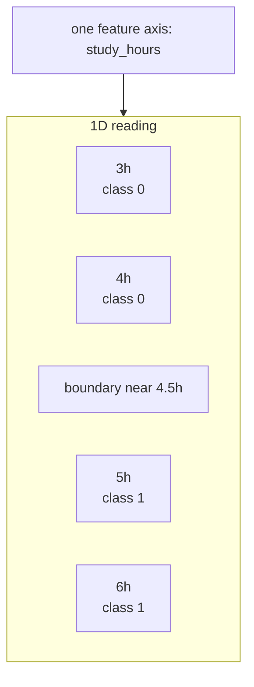
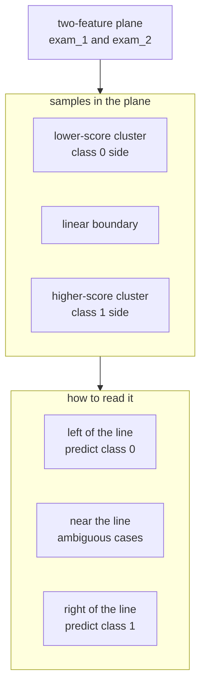
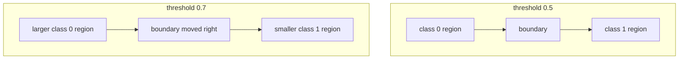
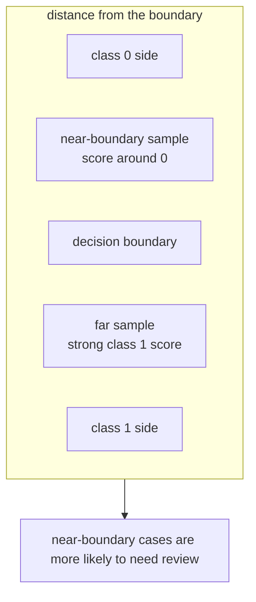

# P3-11.2 결정 경계(decision boundary)

P3-11.1에서는 로지스틱 회귀(logistic regression)를 `확률처럼 읽히는 점수를 만드는 선형 모델`로 보았습니다. 이제 질문을 한 단계 바꿉니다.

`그 점수는 입력 공간(input space)에서 어디에 선을 긋는가?`

이 질문이 바로 결정 경계(decision boundary)의 출발점입니다.

11.1이 출력(output)을 읽는 절이었다면, 11.2는 입력(input)을 바라보는 절입니다. 초심자 기준으로는 다음처럼 이해하면 충분합니다.

`결정 경계는 모델이 class 0과 class 1을 나누는 기준선 또는 기준면이다.`

## 이 절의 범위

이 절은 다음 질문에 답합니다.

- 결정 경계(decision boundary)는 무엇인가?
- 1차원 입력에서는 경계가 어떻게 보이는가?
- 2차원 입력에서는 경계가 왜 선(line)처럼 보이는가?
- 로지스틱 회귀의 계수(coefficient)는 경계의 방향과 어떤 관련이 있는가?
- threshold가 바뀌면 경계는 어떻게 달라지는가?

이 절은 다음 내용은 깊게 다루지 않습니다.

- 고차원 공간에서의 엄밀한 초평면(hyperplane) 기하
- 다중 클래스(multiclass) 분류의 경계 분할
- kernel 방법이나 비선형 경계의 수학적 전개
- 경계 시각화용 plot 세부 구현

그 내용은 뒤 알고리즘 절과 보충학습으로 넘깁니다.

## 이 절의 목표

- 결정 경계를 `출력 점수`가 아니라 `입력 공간을 나누는 기준`으로 설명할 수 있습니다.
- 1차원에서는 경계가 `한 점`, 2차원에서는 보통 `한 선`으로 보인다는 점을 이해할 수 있습니다.
- 로지스틱 회귀의 계수가 경계의 방향을 바꾸는 데 관여한다는 점을 설명할 수 있습니다.
- threshold를 바꾸면 경계 자체도 움직일 수 있다는 점을 설명할 수 있습니다.
- 11.1의 확률 출력과 11.2의 경계 관점이 같은 모델의 두 표현이라는 점을 연결할 수 있습니다.

## 왜 결정 경계를 따로 봐야 하는가

11.1에서는 `0.58`, `0.73` 같은 점수를 읽었습니다. 그런데 실무나 학습에서는 종종 이런 질문이 더 중요해집니다.

- 어떤 입력은 왜 class 0이 되었는가?
- 어떤 입력은 왜 class 1이 되었는가?
- 두 class 사이의 기준은 어디에 있는가?

이 질문에 답하려면 출력표만 봐서는 부족합니다. 입력 공간에서 `어디를 기준으로 둘로 나누었는가`를 봐야 합니다. 그때 등장하는 관점이 결정 경계입니다.

## 결정 경계는 무엇인가

분류 모델은 보통 내부에서 점수(score)를 계산하고, 그 점수를 기준으로 class를 나눕니다. 결정 경계는 바로 `그 점수가 기준값과 같아지는 자리`입니다.

로지스틱 회귀를 입문 수준으로 단순화하면 다음처럼 생각할 수 있습니다.

\\[
z = w_1x_1 + w_2x_2 + \cdots + w_nx_n + b
\\]

이 선형 점수 \(z\)를 sigmoid에 넣으면 0과 1 사이 값이 나옵니다. 그리고 보통 threshold 0.5를 쓰면, sigmoid 출력이 0.5가 되는 자리가 class의 경계가 됩니다.

sigmoid 출력이 0.5라는 것은 선형 점수 \(z\)가 0이라는 뜻과 연결됩니다. 그래서 로지스틱 회귀의 결정 경계는 보통 `선형 점수 = 0이 되는 자리`로 이해할 수 있습니다.

초심자에게는 이 문장이 핵심입니다.

`결정 경계는 확률이 애매해지는 자리이면서, 동시에 class가 갈리는 자리다.`

## 1차원에서는 경계가 한 점처럼 보인다

입력이 하나뿐이면 경계는 선이 아니라 `한 점`처럼 보입니다.

예를 들어 입력이 공부 시간(`study_hours`) 하나뿐이라면, 모델은 어떤 시간을 기준으로 불합격과 합격을 가를 수 있습니다.

| 공부 시간 | class 1 점수 | 예측 |
| ---: | ---: | --- |
| 3 | 0.17 | 불합격 |
| 4 | 0.31 | 불합격 |
| 5 | 0.55 | 합격 |
| 6 | 0.76 | 합격 |

이 경우 경계는 `4시간과 5시간 사이 어딘가`에 있다고 읽을 수 있습니다. 즉, 1차원 결정 경계는 `하나의 cutoff point`에 가깝습니다.

간단히 그리면 다음과 같습니다.



이 관점은 threshold를 점검할 때 매우 중요합니다. 11.1에서는 점수표로 보였던 것이, 11.2에서는 `입력축 위의 경계점`으로 다시 보이기 시작합니다.

## 2차원에서는 경계가 선처럼 보인다

입력이 두 개가 되면, 예를 들어 `exam_1`, `exam_2` 두 점수로 합격 여부를 분류한다고 해 보겠습니다. 이제 입력 공간은 표가 아니라 평면(plane)처럼 생각할 수 있습니다.

- 한 축은 `exam_1`
- 다른 축은 `exam_2`
- 각 학생은 이 평면 위의 한 점(point)

이때 로지스틱 회귀는 그 점들을 둘로 나누는 기준선을 찾으려 합니다. 그래서 2차원에서는 결정 경계가 보통 `직선(line)`처럼 보입니다.



초심자에게는 다음처럼 정리하면 충분합니다.

`입력이 하나 늘어나면 경계도 한 점에서 한 선으로 바뀐다.`

## 계수(coefficient)는 경계의 방향과 어떤 관련이 있는가

로지스틱 회귀의 계수는 단지 점수를 계산하는 데만 쓰이지 않습니다. 입력 공간에서 보면, 이 값들은 경계가 어느 방향으로 놓일지에도 영향을 줍니다.

예를 들어 두 특징이 있을 때

\\[
z = w_1x_1 + w_2x_2 + b
\\]

라고 쓰면, \(w_1\)과 \(w_2\)의 상대적 크기와 부호에 따라 경계선의 기울기와 방향이 달라집니다.

초심자 기준에서는 수식 유도보다 다음 감각이 더 중요합니다.

- 어떤 특징의 계수가 커지면 그 축의 영향력이 더 커질 수 있습니다.
- 두 계수의 조합이 바뀌면 class를 나누는 경계의 기울기도 달라집니다.
- 절편(intercept)은 경계를 평행 이동시키는 역할로 볼 수 있습니다.

즉, 11.1에서 계수는 `점수를 만드는 숫자`였고, 11.2에서는 `경계를 정하는 숫자`로도 읽힙니다.

## threshold가 바뀌면 경계도 움직일 수 있다

11.1에서는 threshold가 바뀌면 최종 행동이 달라진다고 보았습니다. 11.2에서는 그 말을 공간 관점으로 다시 읽어야 합니다.

threshold가 0.5일 때의 경계와 0.7일 때의 경계는 같은 자리에 있지 않을 수 있습니다. 이유는 단순합니다.

- threshold 0.5: 점수가 이 기준을 넘는 자리부터 class 1
- threshold 0.7: 더 높은 점수를 요구하는 자리부터 class 1

즉, threshold를 올리면 class 1로 분류되는 영역이 줄어들고, 경계는 더 보수적인 방향으로 이동할 수 있습니다.

초심자에게는 다음처럼 기억하면 충분합니다.

`모델의 계수는 경계의 방향을 만들고, threshold는 그 경계를 어디에 둘지 다시 조정할 수 있다.`

이 움직임을 개념적으로 그리면 다음과 같습니다.



이 도식에서 핵심은 `모델 자체를 새로 학습하지 않아도`, threshold를 더 엄격하게 잡으면 class 1 영역을 더 좁게 읽을 수 있다는 점입니다.

## 학술적 배경과 역사

결정 경계라는 말은 처음 보면 시각화용 표현처럼 보일 수 있습니다. 하지만 역사적으로는 `분류를 어떻게 이해할 것인가`와 관련된 중요한 관점 변화와 연결됩니다.

초기의 통계와 회귀(regression) 전통에서는 주로 `값을 추정하는 문제`가 중심이었습니다. 즉, 입력이 주어졌을 때 연속적인 결과를 얼마나 잘 설명할 것인가가 핵심이었습니다. 그러나 분류(classification) 문제에서는 질문이 조금 달라집니다.

- 이 샘플은 어느 class에 들어가는가?
- 두 class는 어떤 기준으로 갈리는가?
- 같은 입력 공간 안에서 위험 영역과 안전 영역은 어디인가?

이런 질문이 등장하면서, 분류 모델은 단순히 `점수를 내는 함수`가 아니라 `공간을 나누는 장치`로도 읽히기 시작했습니다.

로지스틱 회귀를 이 관점에서 보면 다음과 같이 정리할 수 있습니다.

- 11.1의 관점: 로지스틱 회귀는 확률처럼 읽히는 점수를 만든다.
- 11.2의 관점: 로지스틱 회귀는 입력 공간에 경계를 그어 class를 나눈다.

이 두 관점은 서로 다른 모델이 아니라, 같은 모델을 두 방향에서 읽는 방법입니다.

현대 머신러닝에서 결정 경계 관점이 중요한 이유는 더 분명합니다. 뒤에서 보게 될 SVM(support vector machine), 결정트리(decision tree), 신경망(neural network)도 결국 `입력을 어떻게 나눌 것인가`라는 질문으로 다시 읽을 수 있기 때문입니다.

따라서 결정 경계의 역사적 의미를 초심자 수준에서 정리하면 다음과 같습니다.

`분류는 점수 계산 문제이기도 하지만, 동시에 입력 공간을 어떻게 나눌 것인가의 문제이기도 하다.`

이 문장이 잡히면 로지스틱 회귀 다음에 왜 다른 분류 알고리즘이 이어지는지도 자연스럽게 이해할 수 있습니다.

## Python 예제로 2차원 결정 경계 읽기

이번 예제는 두 시험 점수(`exam_1`, `exam_2`)로 합격 여부(`passed`)를 분류하는 아주 작은 이진 분류 실습입니다.

- 문제 상황: 두 점수가 함께 높을수록 합격 가능성이 높다고 가정합니다.
- 입력(input): 두 과목 점수
- 정답(label): 합격(1) / 불합격(0)
- 확인할 개념:
  - 로지스틱 회귀는 두 특징을 함께 써서 점수를 계산합니다.
  - 계수 두 개와 절편 하나가 결정 경계의 위치와 방향에 관여합니다.
  - 같은 입력 공간에서도 경계 양쪽의 class가 나뉩니다.

```python
import numpy as np
from sklearn.linear_model import LogisticRegression

X = np.array([
    [35, 40],
    [40, 45],
    [45, 35],
    [55, 60],
    [60, 55],
    [65, 70],
    [50, 52],
    [48, 46],
])
y = np.array([0, 0, 0, 1, 1, 1, 1, 0])

model = LogisticRegression()
model.fit(X, y)

samples = np.array([
    [42, 42],
    [50, 50],
    [62, 60],
])

print("coef            :", np.round(model.coef_[0], 3))
print("intercept       :", round(model.intercept_[0], 3))
print("decision score  :", np.round(model.decision_function(samples), 3))
print("predict_proba   :", np.round(model.predict_proba(samples), 3))
print("prediction      :", model.predict(samples))
```

실행 결과 예시는 다음과 같습니다.

```text
coef            : [0.518 0.471]
intercept       : -48.263
decision score  : [-4.102  0.187  12.979]
predict_proba   : [[0.984 0.016]
                   [0.453 0.547]
                   [0.    1.   ]]
prediction      : [0 1 1]
```

이 출력은 다음처럼 읽으면 됩니다.

- 두 계수 모두 양수이므로, 두 점수가 함께 높아질수록 class 1 쪽으로 점수가 이동합니다.
- `[42, 42]`는 경계의 class 0 쪽에 있습니다.
- `[50, 50]`은 경계 근처에 있어 확률처럼 읽히는 값도 0.5 근처로 나옵니다.
- `[62, 60]`은 class 1 쪽으로 충분히 멀리 들어간 점입니다.

특히 `decision score`가 0 근처라는 것은 경계 근처에 있다는 뜻으로 읽을 수 있습니다. 이 점은 11.1에서 본 `predict_proba가 0.5 근처일 때 애매하다`는 설명과 정확히 연결됩니다.

같은 장면을 경계 관점으로 간단히 그리면 다음과 같습니다.



이 도식은 `경계 근처 샘플`과 `경계에서 충분히 떨어진 샘플`을 구분해 읽는 감각을 주기 위한 것입니다. 실제 운영에서는 이 차이가 자동 처리와 검토 대상을 나누는 기준으로도 이어질 수 있습니다.

## threshold 변화도 작은 코드로 확인하기

이번에는 이미 계산된 class 1 점수를 가지고, threshold가 바뀌면 경계 해석도 어떻게 달라지는지 확인해 보겠습니다.

- 입력(input): 세 샘플의 class 1 점수
- 기대 출력(output): threshold 0.5와 0.7에서 분류가 어떻게 달라지는지
- 확인할 개념:
  - threshold 변화는 class 영역의 크기를 바꿉니다.
  - 경계는 단지 수학식이 아니라 운영 규칙과도 연결됩니다.

```python
import numpy as np

proba_class_1 = np.array([0.48, 0.62, 0.81])

pred_05 = (proba_class_1 >= 0.5).astype(int)
pred_07 = (proba_class_1 >= 0.7).astype(int)

print("class 1 scores  :", proba_class_1)
print("threshold 0.5   :", pred_05)
print("threshold 0.7   :", pred_07)
```

실행 결과 예시는 다음과 같습니다.

```text
class 1 scores  : [0.48 0.62 0.81]
threshold 0.5   : [0 1 1]
threshold 0.7   : [0 0 1]
```

이 결과는 0.62 같은 점이 `모델 기준으로는 꽤 긍정적`일 수 있어도, 더 엄격한 threshold에서는 아직 class 1 영역으로 받아들여지지 않을 수 있음을 보여 줍니다.

## 실무 예시로 보면 경계 관점이 더 분명해진다

### 사례 1. 합격 예측

점수 하나만 보면 cutoff point 하나가 경계가 됩니다. 하지만 과목이 두 개가 되면, `수학 점수는 높지만 영어 점수는 낮은 경우`처럼 상쇄 관계가 생길 수 있습니다. 이때는 `어느 한 점수만의 기준`보다 `두 점수를 함께 보는 경계선`이 더 자연스럽습니다.

이 사례가 중요한 이유는, 초심자가 분류를 자꾸 `점수 하나의 합격선`처럼만 이해하기 쉽기 때문입니다. 결정 경계 관점은 `여러 특징이 함께 작동하면 기준도 조합으로 바뀐다`는 점을 보여 줍니다.

### 사례 2. 고객 이탈 예측

입력이 `최근 접속일`, `결제 빈도`, `고객센터 문의 횟수`처럼 여러 개가 되면, 특정 변수 하나만으로는 이탈을 설명하기 어렵습니다. 결정 경계 관점은 `여러 특징이 함께 있을 때 어느 조합이 위험 영역으로 들어가는가`를 보게 해 줍니다.

예를 들어 접속이 조금 줄었더라도 결제 빈도가 안정적이면 아직 유지 고객으로 볼 수 있고, 접속 감소와 결제 중단이 동시에 나타나면 위험 영역으로 넘어갈 수 있습니다. 즉, 경계는 `값 하나`보다 `조합의 패턴`을 읽게 합니다.

### 사례 3. 의료 위험 분류

검사 수치 하나만으로는 애매하지만, `혈압`, `혈당`, `연령`을 함께 보면 위험 영역이 더 분명해질 수 있습니다. 이때 결정 경계는 `어떤 조합이 위험 class로 넘어가는가`를 시각적으로 상상하는 데 도움을 줍니다.

이 사례에서는 특히 `경계 근처 환자`가 중요합니다. 점수가 아주 높은 환자보다, 여러 수치가 애매하게 겹쳐 경계 부근에 있는 환자가 실제 의사결정에서는 더 어렵기 때문입니다. 그래서 결정 경계는 단순 분류를 넘어서 `어떤 사례가 애매한가`를 읽는 데도 도움을 줍니다.

### 사례 4. 대출 심사

대출 심사에서는 `소득`, `부채 비율`, `연체 기록`, `재직 기간` 같은 특징이 함께 작동합니다. 이때 결정 경계 관점은 `어떤 신청자가 승인 영역에 있고, 어떤 신청자가 거절 영역에 있는가`를 설명하는 데 유용합니다.

중요한 점은, 단 하나의 기준으로 설명하기 어려운 신청자들이 존재한다는 것입니다. 소득은 높지만 부채 비율도 높을 수 있고, 재직 기간은 짧지만 연체 기록은 없을 수 있습니다. 이런 조합형 판단은 결정 경계 관점이 아니면 설명하기 어렵습니다.

### 사례 5. 스팸과 정상 메일의 분리

이메일 분류에서는 `특정 단어의 빈도`, `발신자 패턴`, `링크 수`, `제목 표현` 등이 함께 작동할 수 있습니다. 이때 경계는 `어떤 메일이 정상 메일 영역을 벗어나 스팸 영역으로 넘어가는가`를 생각하게 합니다.

이 사례는 선형 경계의 장점과 한계를 같이 보여 줍니다. 단순한 분리는 빠르고 설명하기 쉽지만, 실제 스팸은 매우 다양한 형태로 섞여 있기 때문에 직선 하나로 충분하지 않을 수 있습니다.

## 주요 논의점은 어디에서 생기는가

결정 경계는 그림으로 보면 단순해 보여도, 초심자가 자주 오해하는 지점이 있습니다.

### 1. 경계선은 벽인가

결정 경계는 현실 세계의 벽이 아니라 `모델이 편의상 그은 분리 기준`입니다. 경계 근처의 샘플은 작은 변화에도 반대편 class로 넘어갈 수 있습니다.

### 2. 경계에서 멀수록 더 확실한가

로지스틱 회귀에서는 보통 경계에서 멀수록 점수는 더 강하게 한쪽 class로 기울어집니다. 하지만 그 점수가 곧 현실의 확실성을 완벽히 보장하는 것은 아닙니다. 데이터 품질과 분포가 여전히 중요합니다.

### 3. 선형 경계면 항상 충분한가

아닙니다. 데이터가 곡선형으로 섞여 있거나, class를 나누는 구조가 매우 복잡하면 직선 하나로는 충분하지 않을 수 있습니다. 이 한계 때문에 뒤에서 더 복잡한 모델들이 등장합니다.

### 4. 경계는 데이터가 바뀌어도 고정되는가

아닙니다. 학습 데이터가 달라지면 계수와 절편이 달라질 수 있고, 그에 따라 경계의 위치와 방향도 달라질 수 있습니다. 즉, 결정 경계는 자연에 원래 존재하던 선을 `발견`하는 것이라기보다, 현재 데이터와 모델이 만든 `학습 결과`에 가깝습니다.

이 논의점은 데이터 분할(train/test split), 표본 편향(sample bias), 데이터셋 갱신이 왜 중요한지와도 연결됩니다.

### 5. 경계 근처 샘플은 왜 중요하게 다뤄야 하는가

경계에서 멀리 떨어진 샘플은 보통 모델이 안정적으로 분류합니다. 반대로 경계 근처 샘플은 작은 변화에도 class가 바뀔 수 있습니다.

이 때문에 실무에서는 종종 다음과 같은 정책이 붙습니다.

- 경계에서 멀면 자동 처리
- 경계 근처면 사람 검토(review)
- 경계 근처 사례를 따로 모아 품질 점검

즉, 결정 경계는 단순히 class를 나누는 도구가 아니라, `어떤 사례가 애매하고 운영 위험이 큰가`를 찾는 데도 쓰일 수 있습니다.

### 6. 좋은 경계와 좋은 서비스는 항상 같은가

모델 관점에서 분류가 깔끔해 보여도, 서비스 관점에서는 그 경계가 적절하지 않을 수 있습니다. 예를 들어 잘못 분류했을 때의 비용이 class마다 다르면, 수학적으로 보기 좋은 경계보다 운영적으로 더 안전한 경계가 필요할 수 있습니다.

이 논의점은 11.1의 threshold, Part 3 앞부분의 평가 지표(metric), 뒤의 모델 선택(model selection)과 연결됩니다.

## 이 절에서 기억할 관점

- 결정 경계는 class를 나누는 기준선 또는 기준면입니다.
- 1차원에서는 경계가 한 점처럼, 2차원에서는 보통 한 선처럼 보입니다.
- 로지스틱 회귀의 계수와 절편은 경계의 방향과 위치에 관여합니다.
- threshold를 바꾸면 class 영역과 경계 해석도 달라질 수 있습니다.
- 경계는 모델의 계산 결과를 입력 공간에서 읽는 방법입니다.

## 체크리스트

- 결정 경계를 `입력 공간을 나누는 기준`으로 설명할 수 있는가?
- 1차원과 2차원에서 경계가 어떻게 다르게 보이는지 설명할 수 있는가?
- 계수와 절편이 경계의 방향과 위치에 관여한다는 점을 이해했는가?
- threshold가 바뀌면 class 영역도 달라질 수 있다는 점을 설명할 수 있는가?
- 선형 경계의 한계가 뒤 알고리즘 절로 이어진다는 점을 이해했는가?

## 다음 절과의 연결

11.2에서는 로지스틱 회귀가 `어디에 선을 긋는가`를 보았습니다. 다음 장들에서는 질문이 더 바뀝니다.

- 경계가 직선이면 충분한가?
- 데이터를 더 잘 설명하는 다른 분류 알고리즘은 무엇인가?
- 평가 지표와 모델 선택은 이 경계를 어떻게 비교하는가?

즉, 11.2는 분류 모델을 `공간을 나누는 장치`로 읽기 시작하는 절입니다. 이 관점은 뒤의 트리, SVM, 더 복잡한 분류기들로 자연스럽게 이어집니다.

## 출처와 참고 자료

- scikit-learn, `1.1.11. Logistic regression`, scikit-learn User Guide, 확인 날짜: 2026-06-26. [https://scikit-learn.org/stable/modules/linear_model.html#logistic-regression](https://scikit-learn.org/stable/modules/linear_model.html#logistic-regression){: target="_blank" rel="noopener noreferrer" }
- scikit-learn, `LogisticRegression`, scikit-learn API Reference, 확인 날짜: 2026-06-26. [https://scikit-learn.org/stable/modules/generated/sklearn.linear_model.LogisticRegression.html](https://scikit-learn.org/stable/modules/generated/sklearn.linear_model.LogisticRegression.html){: target="_blank" rel="noopener noreferrer" }
