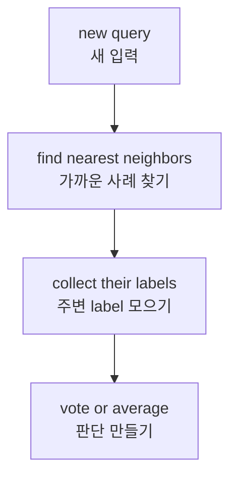
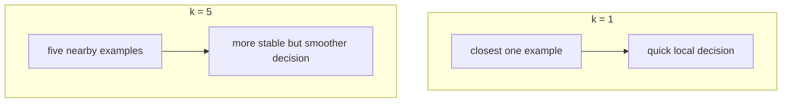

# P3-12.1 k-NN의 직관

P3-11.2에서는 로지스틱 회귀(logistic regression)를 통해 `입력 공간에 경계를 그어 class를 나누는 방식`을 보았습니다. 이제 질문을 조금 바꿉니다.

`직선을 먼저 만들지 않고, 주변의 비슷한 사례를 보고 판단할 수는 없을까?`

이 질문이 바로 k-NN(k-nearest neighbors)의 출발점입니다.

k-NN은 초심자에게 중요한 전환을 보여 줍니다. 앞에서 본 선형회귀(linear regression)나 로지스틱 회귀는 `모델이 학습된 식`을 앞세웠습니다. 반면 k-NN은 `새 입력 주변에 어떤 사례가 모여 있는가`를 먼저 봅니다.

즉, k-NN은 `식을 먼저 세우는 모델`이라기보다 `가까운 예시를 먼저 참조하는 모델`로 읽는 편이 이해에 도움이 됩니다.

## 이 절의 범위

이 절은 다음 질문에 답합니다.

- k-NN은 어떤 발상으로 분류를 하는가?
- 왜 `가까운 이웃(neighbors)`이 판단의 근거가 되는가?
- `k`는 무엇을 뜻하며, 값을 바꾸면 무엇이 달라지는가?
- k-NN에서 `학습(training)`은 무엇을 한다고 봐야 하는가?
- k-NN이 잘 맞는 상황과 조심해야 할 상황은 무엇인가?

이 절은 다음 내용은 깊게 다루지 않습니다.

- 거리(distance) 함수의 수학적 비교
- 스케일(scale) 차이가 결과를 바꾸는 이유의 세부 전개
- 가중 거리(weighted distance), KDTree, BallTree 같은 구현 최적화
- 회귀(regression)용 k-NN의 세부 변형

그 내용은 P3-12.2 거리(distance)와 스케일(scale), 뒤 알고리즘 절과 보충학습으로 넘깁니다.

## 이 절의 목표

- k-NN을 `가까운 사례를 모아 다수결 또는 평균으로 판단하는 방법`이라고 설명할 수 있습니다.
- k-NN이 선형 경계를 먼저 학습하는 방식과 다른 계열이라는 점을 설명할 수 있습니다.
- `k`가 너무 작을 때와 너무 클 때 생길 수 있는 해석 차이를 설명할 수 있습니다.
- k-NN에서 학습은 `복잡한 식을 만드는 일`이라기보다 `비교에 쓸 기준 사례를 준비하는 일`에 가깝다는 점을 이해할 수 있습니다.
- 뒤 절에서 왜 거리와 스케일을 따로 배워야 하는지 예상할 수 있습니다.

## 이 절이 커리큘럼에서 필요한 이유

Part 3의 앞 절들은 주로 `학습된 식` 또는 `학습된 경계`를 읽는 연습이었습니다. k-NN은 그 흐름에 다른 관점을 추가합니다.

| 커리큘럼 위치 | k-NN이 추가하는 관점 |
| --- | --- |
| P3-10 선형회귀 뒤 | 직선식으로 예측하는 방식과 대비 |
| P3-11 로지스틱 회귀 뒤 | 경계를 미리 만드는 방식과 사례 기반 판단을 비교 |
| P3-12.2 앞 | 거리와 스케일이 왜 모델의 핵심이 되는지 준비 |

즉, 12.1의 목적은 k-NN 자체를 외우게 하는 것이 아니라, `머신러닝 모델이 항상 식부터 학습하는 것은 아니다`라는 사실을 보여 주는 데 있습니다.

## k-NN은 어떤 문제를 다루는가

k-NN은 분류(classification)와 회귀(regression) 둘 다에 쓸 수 있지만, 초심자에게는 먼저 분류로 읽는 편이 직관적입니다.

예를 들어 다음과 같은 질문을 생각할 수 있습니다.

| 업무 상황 | 입력 예시 | 예측하려는 값 |
| --- | --- | --- |
| 새로운 고객이 기존 고객 중 누구와 비슷한가 | 구매 빈도, 방문 시간, 결제 금액 | 이탈 가능성 범주 |
| 새 글이 어떤 문서군과 비슷한가 | 단어 특징, 임베딩 일부 좌표 | 주제 범주 |
| 새 사용자의 행동이 어느 그룹에 가까운가 | 클릭 수, 체류 시간, 사용 경로 | 관심 상품 범주 |

이런 문제에서 k-NN은 다음처럼 생각합니다.

1. 새 입력(query)이 들어온다.
2. 기존 학습 데이터(training data) 중에서 가까운 사례를 찾는다.
3. 그 이웃들의 label을 모은다.
4. 다수결로 class를 정한다.

초심자 기준으로는 다음 한 문장이 핵심입니다.

`k-NN은 새로운 점을 혼자 해석하지 않고, 주변의 이미 알려진 사례들과 비교해서 판단한다.`

## 왜 가까운 사례가 판단의 근거가 되는가

k-NN은 매우 인간적인 직관을 계산으로 옮긴 모델처럼 보일 수 있습니다.

- 키와 몸무게가 비슷한 사람들은 비슷한 체형 그룹에 속할 가능성이 있다.
- 구매 패턴이 비슷한 고객들은 비슷한 반응을 보일 가능성이 있다.
- 시험 점수 패턴이 비슷한 학생들은 비슷한 결과를 낼 가능성이 있다.

물론 현실에서는 `가깝다`는 말이 자동으로 옳은 판단을 보장하지는 않습니다. 어떤 특징을 기준으로 가까움을 읽느냐에 따라 결과가 달라질 수 있기 때문입니다. 바로 이 지점 때문에 다음 절에서 거리와 스케일을 따로 다룹니다.

그래도 입문 단계에서는 다음 감각이 중요합니다.

`k-NN의 핵심 가정은 비슷한 입력은 비슷한 출력을 가질 가능성이 높다는 것이다.`

이 발상을 간단히 그리면 다음과 같습니다.



## k는 무엇을 바꾸는가

`k`는 몇 개의 이웃을 보고 판단할지를 뜻합니다.

- `k = 1`이면 가장 가까운 한 개만 보고 결정합니다.
- `k = 3`이면 가장 가까운 세 개를 보고 다수결합니다.
- `k = 5`이면 다섯 개를 보고 더 넓게 판단합니다.

이 값은 모델의 성격을 바꿉니다.

| k 값 | 해석 |
| --- | --- |
| 너무 작음 | 가까운 한두 사례에 민감해집니다. 노이즈(noise)나 예외값(outlier)에 흔들리기 쉽습니다. |
| 적당함 | 지역적인 패턴을 살리면서도 지나친 흔들림을 줄일 수 있습니다. |
| 너무 큼 | 멀리 있는 사례까지 섞여 들어와 경계가 둔해질 수 있습니다. |

초심자에게는 다음처럼 기억하면 충분합니다.

`작은 k는 민감한 판단, 큰 k는 둔한 판단을 만들 수 있다.`

이를 개념적으로 그리면 다음과 같습니다.



## k-NN에서 학습은 무엇을 하는가

선형회귀나 로지스틱 회귀에서는 `계수(coefficient)를 학습한다`고 말했습니다. k-NN은 이 점에서 분위기가 다릅니다.

입문 수준에서 보면 k-NN의 학습은 보통 다음에 가깝습니다.

- 입력과 label을 저장한다.
- 새 입력이 들어왔을 때 비교할 준비를 한다.
- 필요하면 거리 계산을 빠르게 하기 위한 내부 구조를 쓴다.

즉, 초심자 관점에서는 `정교한 공식을 미리 만들어 두는 학습`보다 `나중에 비교할 기준 사례를 잘 보관하는 학습`처럼 읽는 편이 맞습니다.

이 때문에 k-NN은 다음 두 성질을 함께 떠올리면 이해가 쉽습니다.

- 앞 단계의 `데이터 정리`가 매우 중요합니다.
- 예측 시점(prediction time)에 계산량이 커질 수 있습니다.

다시 말해, k-NN은 `훈련 때 많이 배우고 예측은 빠른 모델`이라기보다, `훈련은 단순해 보여도 예측 때 비교 작업이 들어가는 모델`로 읽을 수 있습니다.

## 선형 경계 모델과는 무엇이 다른가

P3-11.2의 로지스틱 회귀는 입력 공간에 하나의 경계를 그어 class를 나누는 시각을 보여 주었습니다. k-NN은 그와 다른 질문을 합니다.

- 로지스틱 회귀: `하나의 식이나 경계로 전체 공간을 어떻게 나눌까?`
- k-NN: `이 점 주변에는 어떤 사례들이 모여 있는가?`

이 차이를 간단히 비교하면 다음과 같습니다.

| 모델 관점 | 중심 질문 |
| --- | --- |
| 로지스틱 회귀 | 어떤 경계선을 그으면 class를 잘 나눌까? |
| k-NN | 새 점 주변의 비슷한 사례는 어떤 class인가? |

즉, k-NN은 `전역적(global) 규칙`보다 `국소적(local) 이웃`을 더 앞세웁니다.

이 차이 때문에 어떤 데이터에서는 로지스틱 회귀보다 자연스럽게 읽히고, 다른 데이터에서는 오히려 더 불안정할 수 있습니다.

## 학술적 배경과 역사

k-NN은 오늘날에도 자주 등장하는 고전적인 사례 기반(instance-based) 방법입니다. scikit-learn 공식 문서에서는 nearest neighbors를 분류와 회귀 모두에 쓰이는 `non-parametric methods`로 소개합니다.

여기서 초심자가 먼저 잡아야 할 말은 `non-parametric`입니다. 입문 단계에서는 이를 엄밀하게 정의하기보다 다음처럼 읽으면 충분합니다.

`미리 정해진 간단한 식의 계수 몇 개만 학습하는 방식이 아니라, 데이터 자체를 비교 근거로 더 직접 사용한다.`

또한 nearest neighbor 계열은 아주 이른 시기부터 패턴 분류(pattern classification) 문제에서 중요한 아이디어로 다뤄졌습니다. 교육적으로 중요한 점은 세부 연표보다 다음 흐름입니다.

1. 모든 분류를 하나의 공식으로만 설명하기는 어렵다.
2. 그렇다면 이미 label이 붙은 사례를 비교 기준으로 삼을 수 있다.
3. 새 입력을 주변 사례와 비교해 판단하는 방법이 등장한다.
4. 이 과정에서 `거리`, `스케일`, `지역성(locality)`이 핵심 문제가 된다.

즉, k-NN의 역사적 의미는 `분류를 경계식으로만 보지 않고, 사례 비교 문제로도 읽게 만든다`는 데 있습니다.

## 실무에서 어떤 상황이 잘 맞고, 어떤 상황이 조심스러운가

k-NN은 개념은 단순하지만 아무 상황에서나 좋은 선택은 아닙니다.

잘 맞는 쪽은 보통 다음과 같습니다.

- 데이터 수가 아주 크지 않고 비교가 가능한 경우
- 비슷한 사례의 근처에서 비슷한 결과가 나오는 경우
- 모델의 전체 식보다 `어떤 이웃을 보고 판단했는지`를 먼저 보여 주고 싶은 경우

조심해야 할 쪽은 보통 다음과 같습니다.

- 특징 수가 많아 거리 해석이 흐려지는 경우
- 스케일이 섞여 있어 어떤 특징이 거리를 지배하는 경우
- 예측 요청이 많아 매번 비교 비용이 부담되는 경우
- class 불균형이 커서 주변 다수결이 쉽게 한쪽으로 쏠리는 경우

이 네 번째 성질은 이후 절과도 연결됩니다. `가깝다`는 말은 직관적이지만, 실제로는 `무엇을 기준으로`, `어떤 단위로`, `몇 개까지 볼 것인가`를 함께 정해야 합니다.

## Python 예제로 작은 k-NN 보기

이번 예제는 두 숫자 특징을 가진 작은 분류 문제입니다.

- 문제 상황: 새 점이 기존의 두 그룹 중 어느 쪽에 더 가까운지 본다.
- 입력(input): 2차원 좌표처럼 읽을 수 있는 두 특징
- 정답(label): class 0 / class 1
- 확인할 개념:
  - 예측은 이웃의 label을 보고 만들어진다.
  - 거리와 이웃 목록을 직접 출력하면 k-NN의 판단 근거를 눈으로 볼 수 있다.
  - 경계 근처 query는 이웃 구성이 조금만 달라져도 해석이 흔들릴 수 있다.

```python
from math import dist
from collections import Counter

train = [
    ((1.0, 1.0), 0),
    ((1.5, 1.2), 0),
    ((2.0, 1.8), 0),
    ((6.0, 6.0), 1),
    ((6.5, 5.8), 1),
    ((7.0, 6.5), 1),
]

queries = [
    (2.5, 2.0),
    (5.5, 5.3),
    (4.0, 4.2),
]

def knn_predict(train, query, k=3):
    ranked = sorted(
        [(dist(point, query), point, label) for point, label in train],
        key=lambda x: x[0]
    )
    neighbors = ranked[:k]
    labels = [label for _, _, label in neighbors]
    prediction = Counter(labels).most_common(1)[0][0]
    return prediction, neighbors

for query in queries:
    prediction, neighbors = knn_predict(train, query, k=3)
    print("query:", query)
    print("prediction:", prediction)
    print("neighbors:")
    for d, point, label in neighbors:
        print(" ", point, "label=", label, "distance=", round(d, 3))
    print()
```

실행 결과 예시는 다음과 같습니다.

```text
query: (2.5, 2.0)
prediction: 0
neighbors:
  (2.0, 1.8) label= 0 distance= 0.539
  (1.5, 1.2) label= 0 distance= 1.281
  (1.0, 1.0) label= 0 distance= 1.803

query: (5.5, 5.3)
prediction: 1
neighbors:
  (6.0, 6.0) label= 1 distance= 0.86
  (6.5, 5.8) label= 1 distance= 1.118
  (7.0, 6.5) label= 1 distance= 1.921

query: (4.0, 4.2)
prediction: 1
neighbors:
  (6.0, 6.0) label= 1 distance= 2.691
  (6.5, 5.8) label= 1 distance= 2.968
  (2.0, 1.8) label= 0 distance= 3.124
```

이 출력은 세 가지를 보여 줍니다.

1. 예측값은 공식을 바로 읽어서 나온 값이 아니라, `이웃 목록`을 통해 만들어집니다.
2. 경계에서 멀리 떨어진 query는 주변 label이 한쪽으로 모여 있어 판단이 쉽습니다.
3. `(4.0, 4.2)`처럼 중간 지점에 가까운 query는 이웃 구성에 따라 판단이 바뀔 수 있어 더 조심스럽습니다.

## 이 절에서 기억할 관점

- k-NN은 `비슷한 입력은 비슷한 출력을 가질 가능성이 높다`는 직관을 계산으로 옮긴 모델입니다.
- 이 모델의 핵심은 식보다 `거리 비교`와 `이웃 선택`에 있습니다.
- `k`는 민감도와 안정성을 바꾸는 중요한 선택입니다.
- k-NN은 학습이 단순해 보여도, 예측은 주변 사례를 실제로 찾아보는 과정이 들어갑니다.
- 그래서 다음 절에서는 거리(distance)와 스케일(scale)을 따로 봐야 합니다.

## 체크리스트

- k-NN을 `가까운 이웃을 모아 판단하는 모델`이라고 설명할 수 있는가?
- `k = 1`과 `k = 5`의 차이를 직관적으로 설명할 수 있는가?
- 선형 경계 모델과 k-NN의 차이를 `전역 경계`와 `국소 이웃`의 대비로 말할 수 있는가?
- 왜 다음 절에서 거리와 스케일을 별도로 다뤄야 하는지 설명할 수 있는가?

## 출처와 참고 자료

- scikit-learn, *Nearest Neighbors*, scikit-learn User Guide, 확인 날짜: 2026-06-27. <https://scikit-learn.org/stable/modules/neighbors.html>{: target="_blank" rel="noopener noreferrer" }
- T. Cover and P. Hart, *Nearest Neighbor Pattern Classification*, IEEE Transactions on Information Theory, 1967, DOI: 10.1109/TIT.1967.1053964, 확인 날짜: 2026-06-27.
