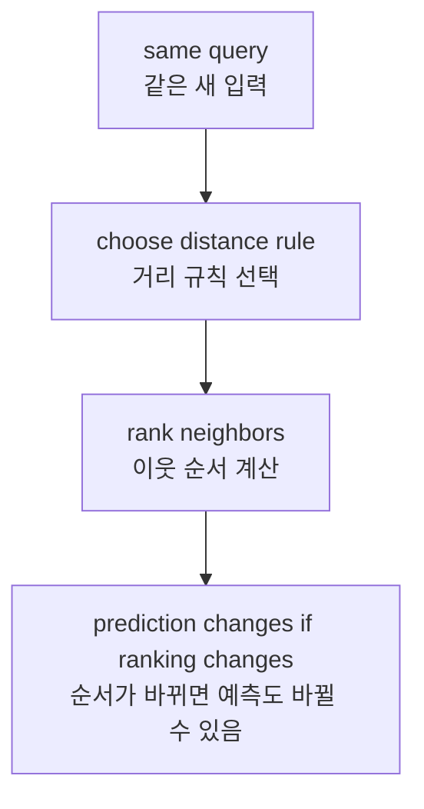
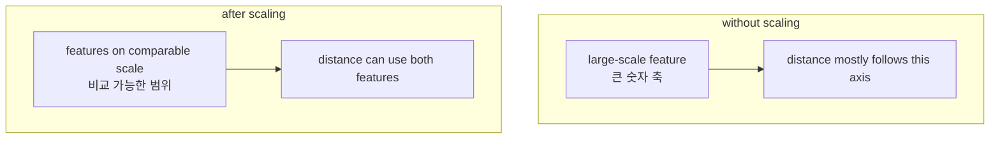

# P3-12.2 거리(distance)와 스케일(scale)

P3-12.1에서는 k-NN(k-nearest neighbors)을 `가까운 사례를 보고 판단하는 모델`로 보았습니다. 이제 그 설명에서 가장 중요한 단어 하나를 꺼내야 합니다.

`그런데 가까움은 정확히 무엇을 뜻하는가?`

이 질문을 빼고 k-NN을 이해하면, 모델을 이해한 것이 아니라 결과만 본 셈이 됩니다. k-NN은 주변 이웃을 찾는 모델이므로, `무엇을 기준으로 가까움을 계산하는가`가 모델의 일부입니다.

즉, 12.2는 k-NN의 부가 설명이 아니라, 사실상 k-NN의 핵심 정의를 보완하는 절입니다.

## 이 절의 범위

이 절은 다음 질문에 답합니다.

- 거리(distance)는 k-NN에서 어떤 역할을 하는가?
- 같은 점이라도 거리 계산 방식이 바뀌면 이웃 순서가 달라질 수 있는가?
- 스케일(scale)이 왜 거리 계산을 왜곡할 수 있는가?
- 거리 기반 모델에서 전처리(preprocessing)는 왜 선택이 아니라 핵심 준비인가?
- 실무에서 어떤 입력 칼럼이 거리를 지배하는지 어떻게 의심할 수 있는가?

이 절은 다음 내용은 깊게 다루지 않습니다.

- 모든 거리 함수(metric)의 수학적 성질 비교
- Minkowski metric의 일반식 유도
- 표준화(standardization), 정규화(normalization)의 모든 변형
- 고차원 공간에서 거리 집중(distance concentration)의 엄밀한 이론

그 내용은 뒤 알고리즘 절, 보충학습, 또는 더 심화된 수학 절로 넘깁니다.

## 이 절의 목표

- k-NN에서 거리 계산이 `모델의 바깥 설정`이 아니라 `모델의 판단 규칙 일부`라는 점을 설명할 수 있습니다.
- 거리 함수가 달라지면 가까운 이웃의 순서가 달라질 수 있음을 설명할 수 있습니다.
- 특징의 단위(scale)가 다르면 큰 숫자 축이 거리를 지배할 수 있다는 점을 설명할 수 있습니다.
- 스케일 조정이 `숫자를 보기 좋게 만드는 일`이 아니라 `비교 기준을 다시 공정하게 맞추는 일`이라는 점을 설명할 수 있습니다.
- 뒤에서 SVM, 임베딩, 벡터 검색(vector search)으로 갈 때도 거리와 표현이 함께 움직인다는 관점을 준비할 수 있습니다.

## 이 절이 커리큘럼에서 필요한 이유

12.1에서 k-NN의 직관은 이미 잡혔습니다. 하지만 그 설명만으로는 실제 모델의 동작을 잘못 해석하기 쉽습니다. 이유는 간단합니다.

- `가깝다`는 말은 자연어에서는 직관적이지만,
- 머신러닝에서는 계산 규칙이 필요하고,
- 그 계산 규칙은 전처리와 단위 선택에 직접 영향을 받기 때문입니다.

이 절은 다음 장들과도 직접 연결됩니다.

| 이어지는 위치 | 지금 절에서 준비하는 관점 |
| --- | --- |
| P3-13 SVM | 경계 이전에 거리와 간격을 어떻게 읽는가 |
| P3-14~16 트리/앙상블 | 왜 어떤 모델은 스케일에 덜 민감한가 |
| P3-18 차원 축소 | 가까움과 표현 공간이 함께 바뀔 수 있음 |
| Part 5 임베딩, 벡터 검색 | 텍스트/의미 공간에서도 거리 정의가 핵심이 됨 |

즉, 12.2는 단지 k-NN을 위한 절이 아니라, `거리 기반 사고`를 처음 명시적으로 소개하는 절입니다.

## 거리(distance)는 모델의 판단 규칙이다

k-NN은 새 입력과 기존 데이터 사이의 거리를 계산한 뒤, 가장 가까운 이웃을 찾습니다. 따라서 거리 함수는 단순 계산 도구가 아니라, `누가 이웃으로 뽑힐지`를 정하는 규칙입니다.

초심자 기준에서는 먼저 다음처럼 이해하면 충분합니다.

- 유클리드 거리(Euclidean distance): 직선거리처럼 읽는 방법
- 맨해튼 거리(Manhattan distance): 축 방향 이동량을 더하는 방법

같은 query라도 어떤 거리를 쓰느냐에 따라 `가장 가깝다`는 판단이 달라질 수 있습니다.

간단히 그리면 다음과 같습니다.



핵심은 이 문장입니다.

`거리 함수는 입력을 해석하는 관점의 일부다.`

## 거리 함수가 달라지면 이웃 순서도 달라질 수 있다

입문 단계에서는 모든 거리 공식을 외울 필요는 없습니다. 대신 `같은 데이터라도 가까움의 기준이 여러 개일 수 있다`는 감각이 중요합니다.

예를 들어 query와 두 후보 점이 있다고 해 보겠습니다.

| 대상 | 좌표 |
| --- | --- |
| query | (0, 0) |
| 점 A | (3, 0) |
| 점 B | (2, 2) |

유클리드 거리로 보면:

- query와 A의 거리 = 3
- query와 B의 거리 = 약 2.83

즉, B가 더 가깝습니다.

하지만 맨해튼 거리로 보면:

- query와 A의 거리 = 3
- query와 B의 거리 = 4

이번에는 A가 더 가깝습니다.

같은 점을 놓고도 이웃 순서가 바뀌는 이유는, 두 거리 함수가 `이동을 읽는 방식`이 다르기 때문입니다.

초심자에게는 다음처럼 정리하면 충분합니다.

`유클리드 거리는 직선적 가까움을 읽고, 맨해튼 거리는 축을 따라 이동한 총량을 읽는다.`

이 차이를 본 뒤에는 `왜 이 문제에 이 거리를 썼는가`를 묻는 습관이 생겨야 합니다.

## 스케일(scale)은 왜 거리 계산을 왜곡하는가

거리 함수만큼 중요한 것이 스케일입니다. 두 특징이 모두 숫자라고 해서, 거리 계산에서 같은 무게로 읽히는 것은 아닙니다.

예를 들어 두 특징이 다음과 같다고 합시다.

- 연 소득(annual income): 원 단위, 수백만에서 수천만
- 연체 횟수(late payments): 0회, 1회, 2회, 7회

둘 다 중요한 정보일 수 있습니다. 하지만 숫자 범위를 그대로 두면 연 소득 쪽 차이가 훨씬 크게 보입니다. 그러면 거리 계산은 사실상 이렇게 묻는 셈이 됩니다.

`누가 연체가 비슷한가?`  
보다는  
`누가 소득 숫자가 더 비슷한가?`

즉, 큰 숫자 축이 작은 숫자 축의 영향을 압도할 수 있습니다.

이 상황을 개념적으로 그리면 다음과 같습니다.



초심자 기준에서는 다음 한 문장이 중요합니다.

`스케일 문제는 데이터 표현 문제이자, 동시에 모델 판단 문제다.`

## 스케일 조정은 무엇을 바꾸는가

스케일 조정은 숫자를 예쁘게 만들기 위한 장식이 아닙니다. 더 정확히 말하면, `각 특징이 거리 계산에 끼치는 영향의 균형`을 바꿉니다.

대표적으로 많이 보는 방식은 표준화(standardization)입니다. 입문 수준에서는 다음처럼만 이해해도 충분합니다.

- 각 특징에서 평균(mean)을 뺀다.
- 특징의 퍼짐 정도(표준편차, standard deviation)로 나눈다.
- 그러면 큰 단위와 작은 단위를 더 비교 가능한 범위로 옮길 수 있다.

다만 중요한 주의가 하나 있습니다.

`스케일 조정이 항상 성능을 올린다고 단정하면 안 된다.`

왜냐하면 스케일 조정은 `무시되던 특징을 다시 반영`하게 만들기 때문입니다. 그 특징이 유익한 정보일 수도 있지만, 반대로 잡음(noise)일 수도 있습니다.

이 점은 scikit-learn의 feature scaling 예제에서도 드러납니다. 스케일 조정은 여러 모델에서 중요하지만, 그것이 자동으로 만능 개선을 뜻하지는 않습니다.

## Python 예제로 원본 거리와 스케일 조정 후 거리를 비교해 보기

이번 예제는 `연 소득`과 `연체 횟수` 두 특징으로 새 고객의 위험 범주를 가늠하는 아주 작은 실습입니다.

- 문제 상황: 새 고객이 `안전(safe)` 쪽에 가까운지, `위험(risky)` 쪽에 가까운지 본다.
- 입력(input): 연 소득, 연체 횟수
- 정답(label): `safe` / `risky`
- 확인할 개념:
  - 원본 숫자에서는 큰 단위의 소득이 거리를 지배할 수 있다.
  - 표준화 후에는 연체 횟수 같은 작은 축의 정보가 다시 살아날 수 있다.
  - 따라서 같은 query라도 가까운 이웃이 바뀔 수 있다.

```python
from math import sqrt

train = [
    ((1800000, 1), "safe"),
    ((2200000, 0), "safe"),
    ((9000000, 7), "risky"),
    ((9500000, 8), "risky"),
]

query = (6000000, 0)

def euclidean(a, b):
    return sqrt(sum((x - y) ** 2 for x, y in zip(a, b)))

def zscore_from_train(train_points):
    cols = list(zip(*train_points))
    means = [sum(col) / len(col) for col in cols]
    stds = []
    for i, col in enumerate(cols):
        m = means[i]
        var = sum((x - m) ** 2 for x in col) / len(col)
        stds.append(var ** 0.5)
    return means, stds

def scale(point, means, stds):
    return tuple((x - m) / s for x, m, s in zip(point, means, stds))

train_points = [point for point, _ in train]
means, stds = zscore_from_train(train_points)

print("raw distances")
for point, label in train:
    print(point, label, round(euclidean(point, query), 3))

print()

scaled_query = scale(query, means, stds)
print("scaled distances")
for point, label in train:
    scaled_point = scale(point, means, stds)
    print(
        point,
        label,
        "scaled =", tuple(round(v, 3) for v in scaled_point),
        "distance =", round(euclidean(scaled_point, scaled_query), 3),
    )

print()
print("scaled query =", tuple(round(v, 3) for v in scaled_query))
```

실행 결과 예시는 다음과 같습니다.

```text
raw distances
(1800000, 1) safe 4200000.0
(2200000, 0) safe 3800000.0
(9000000, 7) risky 3000000.0
(9500000, 8) risky 3500000.0

scaled distances
(1800000, 1) safe scaled = (-1.053, -0.849) distance = 1.305
(2200000, 0) safe scaled = (-0.943, -1.131) distance = 1.046
(9000000, 7) risky scaled = (0.929, 0.849) distance = 1.897
(9500000, 8) risky scaled = (1.067, 1.131) distance = 2.179

scaled query = (0.11, -1.131)
```

이 출력은 아주 중요합니다.

- 원본 거리에서는 `risky` 그룹이 더 가까워 보입니다.
- 하지만 표준화 후에는 `safe` 그룹이 더 가까워집니다.

즉, 데이터는 그대로인데 `가까움의 계산 조건`이 바뀌자 이웃 해석이 달라졌습니다.

초심자 기준으로 여기서 반드시 잡아야 할 문장은 다음입니다.

`k-NN의 결과는 데이터만이 아니라, 데이터 표현 방식에도 의존한다.`

## 실무에서는 어떤 신호를 보면 스케일 문제를 의심해야 하는가

실무에서는 모델 내부를 수식으로 먼저 보기보다, 데이터 칼럼과 단위를 먼저 보는 편이 안전합니다.

다음 상황이면 스케일 문제를 의심할 수 있습니다.

| 의심 신호 | 왜 문제일 수 있는가 |
| --- | --- |
| 어떤 칼럼은 수백만 단위이고, 다른 칼럼은 0~10 범위다 | 큰 숫자 칼럼이 거리를 거의 독점할 수 있음 |
| 단위가 서로 다르다 | 원, 초, 회수, 비율이 그대로 섞이면 비교 기준이 불균형해짐 |
| 거리 기반 모델인데 전처리 설명이 없다 | 결과 재현과 해석이 흔들릴 수 있음 |
| 스케일 조정 전후에 예측이 크게 바뀐다 | 입력 표현이 모델 판단을 강하게 좌우하고 있다는 뜻 |

이 점은 뒤 절과도 이어집니다.

- SVM은 거리와 간격에 민감합니다.
- 임베딩 기반 검색은 유사도(similarity) 정의에 민감합니다.
- 차원 축소도 어떤 축이 강조되는가에 따라 그림이 달라질 수 있습니다.

즉, 거리와 스케일은 k-NN 하나의 특수 주제가 아니라, 표현 공간 전체를 읽는 기본 질문입니다.

## 이 절에서 기억할 관점

- k-NN에서 거리 함수는 모델 바깥의 부수 설정이 아니라 판단 규칙의 일부입니다.
- 같은 query라도 거리 함수가 달라지면 이웃 순서가 달라질 수 있습니다.
- 특징의 숫자 범위가 크게 다르면 큰 축이 거리를 지배할 수 있습니다.
- 스케일 조정은 각 특징이 비교에 끼치는 영향 균형을 다시 맞추는 일입니다.
- 따라서 거리 기반 모델을 읽을 때는 항상 `무슨 거리인가`, `전처리를 어떻게 했는가`를 함께 물어야 합니다.

## 체크리스트

- 왜 k-NN에서 거리 함수가 모델의 일부라고 말할 수 있는가?
- 유클리드 거리와 맨해튼 거리가 같은 점을 다르게 읽을 수 있음을 설명할 수 있는가?
- 스케일 차이가 큰 특징들이 섞이면 어떤 축이 거리를 지배할 수 있는가?
- 스케일 조정 전후에 이웃이 바뀌는 예를 읽고 설명할 수 있는가?
- 뒤에서 SVM, 임베딩, 벡터 검색을 읽을 때도 거리와 표현을 함께 봐야 함을 연결할 수 있는가?

## 출처와 참고 자료

- scikit-learn, *Nearest Neighbors*, scikit-learn User Guide, 확인 날짜: 2026-06-27. <https://scikit-learn.org/stable/modules/neighbors.html>{: target="_blank" rel="noopener noreferrer" }
- scikit-learn, *Importance of Feature Scaling*, scikit-learn Examples, 확인 날짜: 2026-06-27. <https://scikit-learn.org/stable/auto_examples/preprocessing/plot_scaling_importance.html>{: target="_blank" rel="noopener noreferrer" }
