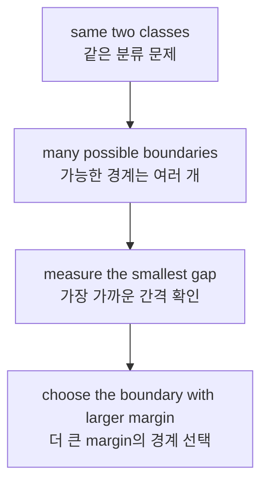
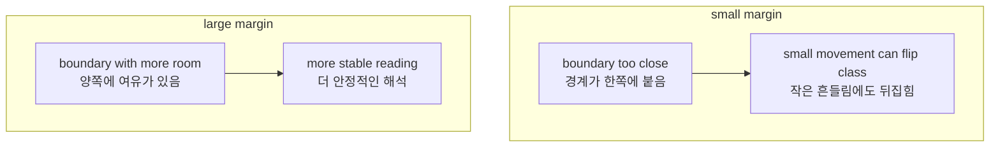
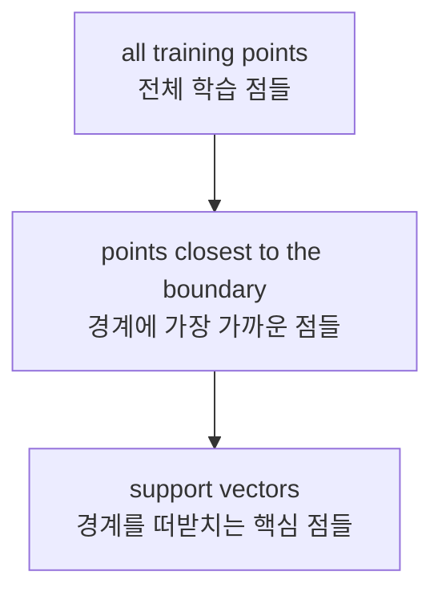
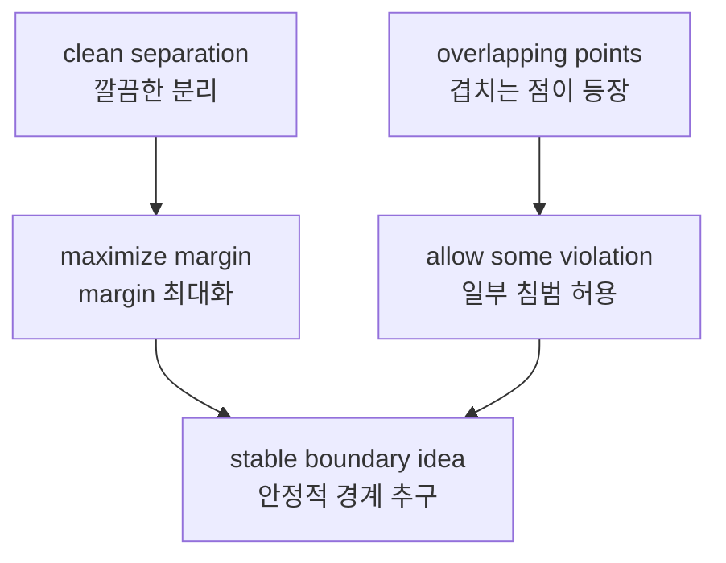

# P3-13.1 SVM의 직관

P3-11.2에서는 분류를 `경계(boundary)를 그어 공간을 나누는 일`로 보았습니다. P3-12에서는 `가까운 이웃을 보고 판단하는 방식`도 살펴보았습니다. 이제 같은 분류 문제를 다른 질문으로 다시 읽습니다.

`경계를 그을 수 있다면, 그중 어떤 경계가 더 좋은 경계인가?`

이 질문이 바로 SVM(support vector machine)의 출발점입니다.

초심자 기준에서는 SVM을 복잡한 수식 모델로 시작할 필요가 없습니다. 먼저 다음처럼 이해하면 충분합니다.

`SVM은 class를 나누는 선을 찾되, 그 선이 양쪽 데이터로부터 가능한 한 여유 있게 떨어지도록 하려는 모델이다.`

즉, SVM은 단지 `분류선 하나`를 찾는 데서 멈추지 않고, `가장 안정적으로 보이는 분리선`을 찾으려는 시도로 읽을 수 있습니다.

## 이 절의 범위

이 절은 다음 질문에 답합니다.

- SVM은 왜 단순한 경계선보다 `margin`을 더 중요하게 보는가?
- margin은 무엇이며, 왜 분류 안정성과 연결되는가?
- support vector는 무엇이고 왜 이름의 중심에 있는가?
- 데이터가 완벽히 나뉘지 않을 때는 어떤 생각이 추가되는가?
- SVM은 앞의 로지스틱 회귀, k-NN과 어떤 점이 다른가?

이 절은 다음 내용은 깊게 다루지 않습니다.

- 최적화 목적 함수의 엄밀한 수식 전개
- 라그랑주 승수(Lagrange multiplier)와 듀얼(dual) 문제
- 커널(kernel) 트릭의 세부 계산
- `C`, `gamma` 같은 하이퍼파라미터의 세부 튜닝

그 내용은 P3-13.2 커널(kernel)의 입문적 의미와 뒤 절, 또는 보충학습으로 넘깁니다.

## 이 절의 목표

- SVM을 `margin을 최대화하는 분류기`라는 직관으로 설명할 수 있습니다.
- 같은 데이터를 나누는 여러 경계 중에서 왜 어떤 경계가 더 낫다고 말할 수 있는지 설명할 수 있습니다.
- support vector가 `경계에서 가장 가까운 핵심 점들`이라는 점을 설명할 수 있습니다.
- 완벽한 분리가 어려울 때 margin과 오류 허용이 함께 등장한다는 점을 입문 수준에서 이해할 수 있습니다.
- 11장의 결정 경계, 12장의 거리와 스케일 논의가 왜 SVM으로 자연스럽게 이어지는지 설명할 수 있습니다.

## 이 절이 커리큘럼에서 필요한 이유

P3-11의 로지스틱 회귀는 `입력 공간을 나누는 경계`를 보여 주었습니다. 하지만 그 절만으로는 이런 질문이 남습니다.

- 나누기만 하면 충분한가?
- 경계가 class에 너무 바짝 붙어 있어도 괜찮은가?
- 경계 주변의 작은 흔들림에도 예측이 쉽게 바뀌면 어떻게 되는가?

SVM은 이 질문에 답하는 첫 번째 대표 사례입니다.

| 앞 절 | 지금 절에서 이어받는 질문 |
| --- | --- |
| P3-11.2 결정 경계 | 경계를 그었다면, 어떤 경계가 더 좋은가? |
| P3-12.2 거리와 스케일 | 경계와 점 사이의 간격을 어떻게 읽을 것인가? |
| P3-9 하이퍼파라미터 | `C` 같은 값이 왜 중요해지는가? |

즉, SVM은 `분류선`을 배우는 절이 아니라, `좋은 분류선의 기준`을 배우는 절입니다.

## SVM은 어떤 문제를 다루는가

SVM은 scikit-learn 공식 문서에서도 분류(classification), 회귀(regression), 이상치 탐지(outlier detection)에 쓰이는 지도학습(supervised learning) 방법군으로 소개됩니다. 하지만 입문에서는 먼저 이진 분류(binary classification)만 잡는 편이 좋습니다.

예를 들면 다음과 같습니다.

| 업무 상황 | 예측하려는 값 |
| --- | --- |
| 정상 거래 / 사기 거래 | 0 / 1 |
| 불합격 / 합격 | 0 / 1 |
| 비이탈 / 이탈 | 0 / 1 |

이때 SVM의 관심은 단순히 `예측을 맞힌다`에만 있지 않습니다. `맞히는 선이 얼마나 여유 있게 놓였는가`도 함께 봅니다.

실무 감각으로 다시 읽으면 다음과 같습니다.

| 장면 | SVM이 특히 신경 쓰는 질문 |
| --- | --- |
| 사기 거래 탐지 | 정상 거래와 사기 거래의 경계가 너무 촘촘해 작은 흔들림에도 뒤집히지 않는가? |
| 채용 서류 분류 | 합격/보류 경계가 특정 사례에 과하게 끌려가지 않는가? |
| 설비 이상 탐지 | 정상과 이상 상태가 구분되더라도 경계가 너무 빡빡해 경보가 불안정하지 않은가? |

즉, SVM은 단지 `누가 어느 class인가`보다 `그 기준이 얼마나 불안정한가`를 함께 의식하게 만드는 모델입니다.

## 왜 margin을 따로 보아야 하는가

두 class를 분리할 수 있는 직선은 하나만 있는 것이 아닐 수 있습니다. 같은 데이터를 놓고도 여러 개의 선이 그려질 수 있습니다.

문제는 이런 선들이 모두 똑같이 좋아 보이지 않는다는 점입니다.

- 어떤 선은 한쪽 점에 너무 바짝 붙어 있습니다.
- 어떤 선은 양쪽 점과 조금 더 떨어져 있습니다.
- 어떤 선은 작은 노이즈(noise)만 들어와도 class가 뒤집힐 것처럼 보입니다.

SVM은 바로 이 차이를 `margin`이라는 말로 잡습니다.

초심자 기준으로는 다음처럼 기억하면 충분합니다.

`margin은 경계선과 가장 가까운 데이터들 사이의 여유 폭이다.`

이 여유 폭이 크면, 경계가 데이터 사이에 더 안정적으로 놓여 있다고 읽을 수 있습니다.

이를 개념적으로 그리면 다음과 같습니다.



같은 생각을 더 직접적으로 비교하면 다음과 같습니다.



## 큰 margin은 왜 좋은가

큰 margin이 언제나 절대 정답이라고 말할 수는 없습니다. 하지만 교육적으로는 다음 이유 때문에 매우 중요한 기준이 됩니다.

1. 경계가 양쪽 class에 너무 붙지 않습니다.
2. 경계 근처의 작은 흔들림에 덜 민감해 보입니다.
3. 처음 보는 데이터에서도 조금 더 안정적인 일반화(generalization)를 기대할 수 있다는 직관을 줍니다.

이 세 번째 이유 때문에 SVM은 통계학습이론(statistical learning theory)과 자주 함께 언급됩니다. 이 책의 앞절에서 보았듯, 일반화는 `훈련 데이터를 잘 외우는 것`이 아니라 `새 데이터에도 타당한 판단을 유지하는 것`에 더 가깝습니다. SVM은 그 일반화 문제를 `margin`이라는 기하학적 언어로 읽게 해 줍니다.

초심자에게는 다음 한 문장이 핵심입니다.

`SVM은 경계를 맞히는 문제를, 여유 있는 경계를 찾는 문제로 다시 바꿔 읽는다.`

## support vector는 무엇인가

SVM이라는 이름에는 `support vector`가 들어 있습니다. 이 말이 중요한 이유는, 모든 점이 똑같은 정도로 경계를 결정하지 않기 때문입니다.

SVM의 직관에서 가장 중요한 점들은 보통 `경계에 가장 가까운 점들`입니다. 이 점들이 경계의 위치를 사실상 떠받치고 있다고 읽을 수 있습니다. 그래서 support vector라는 이름이 붙습니다.

초심자 기준에서는 이렇게 정리하면 충분합니다.

- 멀리 떨어진 점들은 경계 결정에 덜 민감합니다.
- 경계에 가장 바짝 붙은 점들이 경계 위치를 더 강하게 좌우합니다.
- 그래서 SVM은 전체 데이터 중에서도 `가장 빡빡한 점들`을 특히 중요하게 봅니다.

간단히 그리면 다음과 같습니다.



실무적으로는 support vector를 다음처럼 읽을 수도 있습니다.

- 모든 고객 기록이 같은 중요도를 갖는 것은 아닙니다.
- 모든 시험 답안이 같은 정도로 경계 기준을 흔드는 것도 아닙니다.
- 실제로는 `애매한 경계 근처 사례`가 모델 기준을 더 많이 바꿉니다.

이 감각은 뒤의 모델 해석과 오류 분석에도 중요합니다. 어떤 모델이든 `경계에서 애매한 사례`를 먼저 확인하는 습관이 생기면, 단순 정확도 숫자보다 더 많은 것을 읽을 수 있습니다.

## Python 예제로 `어떤 경계가 더 큰 margin을 가지는가` 보기

이번 예제는 SVM 학습기를 직접 구현하는 것이 아닙니다. 대신 같은 두 class를 나누는 여러 `세로 경계 후보`를 두고, 어느 경계가 더 큰 margin을 가지는지 직접 계산해 봅니다.

- 문제 상황: 두 class가 x축의 왼쪽과 오른쪽에 나뉘어 있다.
- 입력(input): 2차원 점
- 정답(label): negative / positive
- 확인할 개념:
  - 경계를 만들 수 있는 후보는 여러 개일 수 있다.
  - SVM의 관심은 그중 `가장 작은 여유 폭(minimum gap)`이 큰 경계를 찾는 데 있다.
  - 경계에서 가장 가까운 점들이 support vector처럼 읽힌다.

```python
negative = [(1.0, 2.0), (2.0, 3.0), (3.0, 2.5)]
positive = [(5.0, 2.2), (6.0, 3.2), (7.0, 2.8)]

candidates = [3.4, 4.0, 4.6]

for boundary_x in candidates:
    neg_min = min(boundary_x - x for x, _ in negative)
    pos_min = min(x - boundary_x for x, _ in positive)
    margin = min(neg_min, pos_min)

    support_neg = [p for p in negative if abs((boundary_x - p[0]) - neg_min) < 1e-9]
    support_pos = [p for p in positive if abs((p[0] - boundary_x) - pos_min) < 1e-9]

    print("boundary x =", boundary_x)
    print("  negative-side nearest distance =", round(neg_min, 3))
    print("  positive-side nearest distance =", round(pos_min, 3))
    print("  margin =", round(margin, 3))
    print("  support-like points =", support_neg + support_pos)
    print()
```

실행 결과 예시는 다음과 같습니다.

```text
boundary x = 3.4
  negative-side nearest distance = 0.4
  positive-side nearest distance = 1.6
  margin = 0.4
  support-like points = [(3.0, 2.5), (5.0, 2.2)]

boundary x = 4.0
  negative-side nearest distance = 1.0
  positive-side nearest distance = 1.0
  margin = 1.0
  support-like points = [(3.0, 2.5), (5.0, 2.2)]

boundary x = 4.6
  negative-side nearest distance = 1.6
  positive-side nearest distance = 0.4
  margin = 0.4
  support-like points = [(3.0, 2.5), (5.0, 2.2)]
```

이 출력에서 읽어야 할 핵심은 다음입니다.

- 세 경계 모두 두 class를 나누기는 합니다.
- 하지만 `x = 4.0`일 때 가장 작은 여유 폭이 가장 큽니다.
- 경계에 가장 가까운 `(3.0, 2.5)`와 `(5.0, 2.2)`가 support vector처럼 작동합니다.

즉, SVM은 `나눌 수 있는가`에서 멈추지 않고 `얼마나 여유 있게 나누는가`를 추가로 묻습니다.

## 사례로 다시 읽기

이 절의 직관은 추상적으로만 남기면 쉽게 흐려집니다. 그래서 업무 장면으로 다시 읽어 볼 필요가 있습니다.

### 사례 1. 사기 거래 탐지

- 너무 작은 margin:
  - 정상 거래와 사기 거래 경계가 너무 촘촘합니다.
  - 소액 결제, 해외 접속, 시간대 같은 특징이 조금만 흔들려도 class가 바뀔 수 있습니다.
- 더 큰 margin:
  - 경계가 양쪽 class에서 조금 더 떨어져 있습니다.
  - 애매한 거래는 남더라도, 기준선 자체는 덜 예민하게 흔들립니다.

### 사례 2. 채용 서류 분류

- 너무 작은 margin:
  - 특정 몇 명의 특이한 지원서가 경계를 과도하게 끌어당깁니다.
  - 점수 체계가 바뀌거나 새로운 배경을 가진 지원자가 들어오면 결과가 쉽게 흔들릴 수 있습니다.
- 더 큰 margin:
  - 경계가 한두 사례에 덜 끌립니다.
  - 기준이 더 일반적이고 설명 가능한 방향으로 유지될 가능성이 높습니다.

초심자 기준에서는 다음처럼 요약하면 충분합니다.

`SVM의 margin 직관은 모델이 만든 경계가 현장에서 얼마나 예민하게 흔들릴지를 묻는 질문과 연결된다.`

## 데이터가 완벽히 나뉘지 않으면 어떻게 되는가

현실 데이터는 항상 이렇게 깔끔하지 않습니다. 어떤 점은 반대 class 쪽 가까이에 섞여 들어올 수 있습니다. 그러면 완벽한 분리선(perfect separating line)을 만들기 어렵습니다.

이때 SVM 직관은 이렇게 바뀝니다.

- 모든 점을 완벽하게 분리하는 것만 고집하지 않는다.
- 일부 오류나 침범을 허용하더라도,
- 전체적으로 더 타당한 margin을 찾으려 한다.

이 생각이 뒤에서 `soft margin`과 하이퍼파라미터 `C`로 이어집니다. 지금 절에서는 다음 정도만 잡으면 충분합니다.

`현실의 SVM은 완벽한 분리만이 아니라, 여유와 오류 허용 사이의 균형도 함께 다룬다.`

이를 개념적으로 그리면 다음과 같습니다.



## Python 예제로 `완벽 분리`가 깨지면 무엇이 달라지는가 보기

이번 예제는 앞 예제에 경계 근처의 `애매한 negative 점` 하나를 더 넣습니다.

- 문제 상황: 원래는 잘 분리되던 두 class 사이에 경계 근처 예외 사례가 들어온다.
- 확인할 개념:
  - 어떤 경계는 더 이상 완벽한 분리를 만들지 못한다.
  - 완벽한 분리가 어려워지면 `margin이 큰가`만이 아니라 `어느 정도의 침범을 허용할 것인가`도 같이 생각해야 한다.

```python
negative = [(1.0, 2.0), (2.0, 3.0), (3.0, 2.5), (4.7, 2.4)]
positive = [(5.0, 2.2), (6.0, 3.2), (7.0, 2.8)]

for boundary_x in [4.0, 4.8, 5.2]:
    neg_min = min(boundary_x - x for x, _ in negative)
    pos_min = min(x - boundary_x for x, _ in positive)
    margin = min(neg_min, pos_min)

    print("boundary x =", boundary_x)
    print("  negative-side nearest distance =", round(neg_min, 3))
    print("  positive-side nearest distance =", round(pos_min, 3))
    print("  margin =", round(margin, 3))
    print("  perfectly separates? =", neg_min > 0 and pos_min > 0)
    print()
```

실행 결과 예시는 다음과 같습니다.

```text
boundary x = 4.0
  negative-side nearest distance = -0.7
  positive-side nearest distance = 1.0
  margin = -0.7
  perfectly separates? = False

boundary x = 4.8
  negative-side nearest distance = 0.1
  positive-side nearest distance = 0.2
  margin = 0.1
  perfectly separates? = True

boundary x = 5.2
  negative-side nearest distance = 0.5
  positive-side nearest distance = -0.2
  margin = -0.2
  perfectly separates? = False
```

이 출력에서 읽을 점은 분명합니다.

- 경계 근처의 예외 점 하나만 들어와도 일부 경계는 더 이상 완벽히 분리되지 않습니다.
- 겨우 분리가 되더라도 margin이 매우 작아질 수 있습니다.
- 그래서 현실의 SVM은 `완벽 분리만 고집하지 않고`, `margin과 오류 허용을 함께 조정`하는 방향으로 넘어갑니다.

## 로지스틱 회귀, k-NN과는 무엇이 다른가

앞 절의 모델들과 SVM을 나란히 놓으면 차이가 더 선명해집니다.

| 모델 | 중심 질문 |
| --- | --- |
| 로지스틱 회귀 | 어떤 선형 점수와 threshold로 class를 나눌까? |
| k-NN | 이 점 주변의 가까운 사례들은 어떤 class인가? |
| SVM | 두 class를 나누되, 가장 여유 있는 경계는 무엇인가? |

이 비교는 매우 중요합니다. 세 모델 모두 분류(classification)를 하지만, `무엇을 좋은 판단 기준으로 보는가`가 다릅니다.

- 로지스틱 회귀는 점수와 확률처럼 읽히는 출력을 잘 보여 줍니다.
- k-NN은 주변 사례를 근거로 삼는 판단을 보여 줍니다.
- SVM은 경계와 margin 중심의 판단을 보여 줍니다.

따라서 SVM을 읽을 때는 `예측값`만 보지 말고, `경계가 얼마나 빡빡한가`, `어떤 점들이 경계를 떠받치는가`도 함께 봐야 합니다.

## 학술적 배경과 역사

SVM은 통계학습이론과 일반화 논의에서 매우 중요한 위치를 차지하는 방법입니다. 앞서 P3-5.2에서 보았듯, 일반화는 훈련 데이터만 잘 맞히는 문제를 넘어서 `새 데이터에서도 타당한 판단을 유지하는가`라는 질문과 연결됩니다.

역사적으로는 1990년대 Cortes와 Vapnik의 논문 *Support-Vector Networks*가 이 흐름을 대표합니다. 입문 단계에서 중요한 것은 세부 증명보다 다음 변화입니다.

1. 분류는 경계를 찾는 문제로 읽을 수 있다.
2. 경계는 하나가 아니라 여러 개일 수 있다.
3. 그러므로 `어떤 경계가 더 좋은가`라는 기준이 필요하다.
4. SVM은 그 기준을 margin 최대화라는 언어로 제시했다.

이 때문에 SVM은 단순한 알고리즘 이름이 아니라, `일반화를 기하학적으로 설명하려는 대표 사례`로도 자주 소개됩니다.

## 이 절에서 기억할 관점

- SVM은 class를 나누는 경계 중에서도 `더 큰 margin`을 갖는 경계를 찾으려는 모델입니다.
- margin은 경계와 가장 가까운 데이터들 사이의 여유 폭으로 읽을 수 있습니다.
- support vector는 경계에 가장 가까운 핵심 점들입니다.
- 현실 데이터에서는 완벽한 분리보다 `여유`와 `오류 허용`의 균형이 중요해집니다.
- 그래서 SVM은 분류 문제를 `경계의 품질` 문제로 다시 보게 해 줍니다.

## 체크리스트

- 왜 `분리 가능하다`는 사실만으로는 충분하지 않은가?
- margin을 입문 수준에서 설명할 수 있는가?
- support vector가 왜 모든 점이 아니라 `경계에 가까운 점들`인지 설명할 수 있는가?
- 로지스틱 회귀, k-NN, SVM의 중심 질문 차이를 말할 수 있는가?
- soft margin이 왜 필요한지 직관 수준에서 설명할 수 있는가?

## 출처와 참고 자료

- scikit-learn, *Support Vector Machines*, scikit-learn User Guide, 확인 날짜: 2026-06-27. <https://scikit-learn.org/stable/modules/svm.html>{: target="_blank" rel="noopener noreferrer" }
- C. Cortes and V. Vapnik, *Support-Vector Networks*, Machine Learning, 1995, DOI: 10.1007/BF00994018, 확인 날짜: 2026-06-27.
