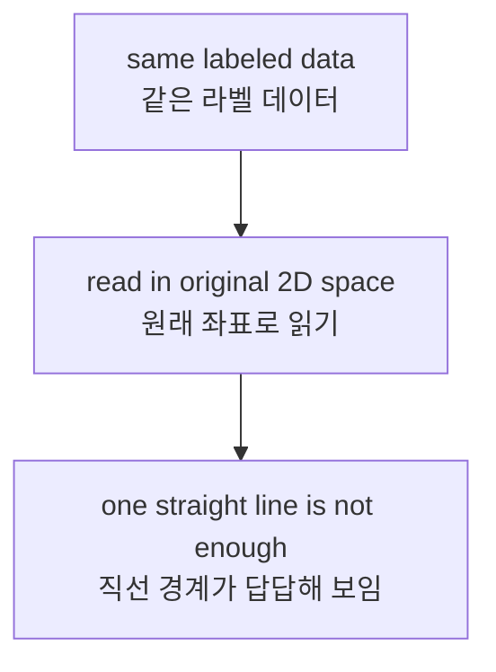
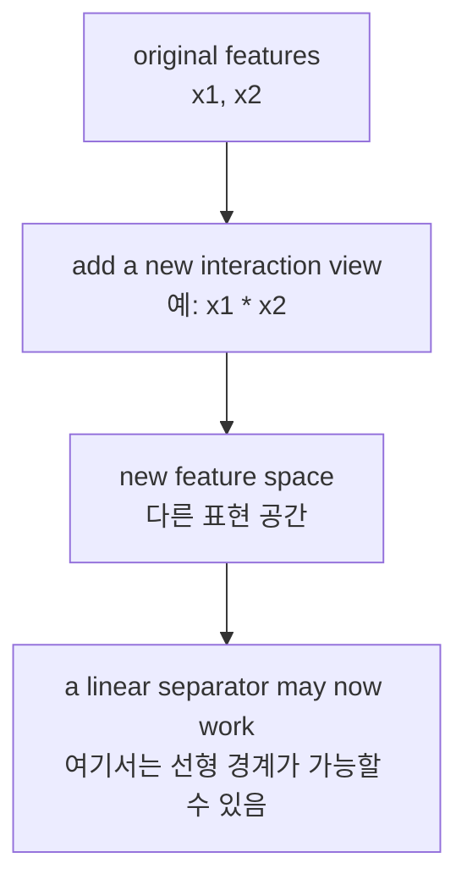
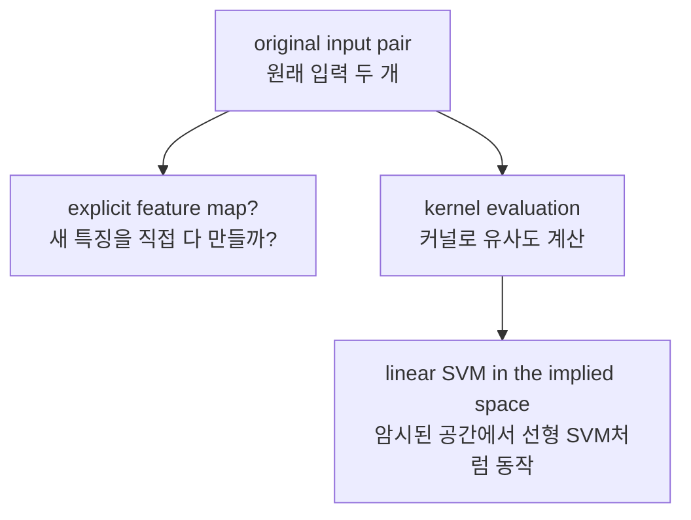

# P3-13.2 커널(kernel)의 입문적 의미

P3-13.1에서는 SVM(support vector machine)을 `margin이 큰 경계를 찾는 분류기`로 보았습니다. 그런데 거기서 자연스럽게 다음 질문이 생깁니다.

`그 경계가 직선(line)이어야만 한다면, 직선으로는 잘 나눌 수 없는 데이터는 어떻게 해야 할까?`

이 질문이 바로 커널(kernel)을 소개해야 하는 이유입니다.

초심자 기준에서는 커널을 복잡한 함수 목록으로 외우기보다, 먼저 다음처럼 이해하면 충분합니다.

`커널은 데이터를 다른 표현 공간에서 비교하게 해, 원래는 선형으로 나누기 어려운 문제를 더 다룰 수 있게 해 주는 발상이다.`

즉, 13.2의 핵심은 `새로운 마법 함수`가 아니라, `표현을 바꾸면 선형 경계도 다른 의미를 가질 수 있다`는 관점입니다.

## 이 절의 범위

이 절은 다음 질문에 답합니다.

- 왜 어떤 데이터는 선형 경계만으로 잘 나뉘지 않는가?
- 표현(feature space)을 바꾼다는 말은 무엇을 뜻하는가?
- 커널은 왜 `직접 새 특징을 만들지 않고도` 도움이 된다고 말하는가?
- 다항식(polynomial), RBF 같은 커널 이름은 무엇을 암시하는가?
- 커널 기반 SVM을 언제 후보로 떠올릴 수 있는가?

이 절은 다음 내용은 깊게 다루지 않습니다.

- 커널 함수의 엄밀한 양의 정부호(positive semidefinite) 조건
- RKHS(reproducing kernel Hilbert space)의 수학
- 듀얼 최적화에서 커널이 들어가는 식의 전개
- `gamma`, `degree`, `coef0`의 세부 튜닝 전략

그 내용은 뒤 튜닝 절, 보충학습, 또는 더 심화된 수학 문서로 넘깁니다.

## 이 절의 목표

- 선형 경계가 잘 작동하지 않는 문제를 예시로 설명할 수 있습니다.
- 표현 공간(feature space)을 바꾸면 같은 데이터가 다르게 읽힐 수 있음을 설명할 수 있습니다.
- 커널을 `유사도를 계산하는 방식이자, 새 표현 공간을 우회해서 쓰는 아이디어`로 입문 수준에서 설명할 수 있습니다.
- 다항식 커널과 RBF 커널이 각각 어떤 종류의 비선형성을 의식하는지 감각적으로 말할 수 있습니다.
- 커널 기반 방법을 `항상 쓰는 기본값`이 아니라 `선형 경계가 부족해 보일 때 떠올리는 후보`로 위치 지을 수 있습니다.

## 이 절이 커리큘럼에서 필요한 이유

13.1에서 SVM은 `좋은 선형 경계`를 찾는 모델로 읽혔습니다. 하지만 현실 데이터는 종종 다음처럼 보입니다.

- class가 곡선처럼 얽혀 있습니다.
- 중앙과 바깥쪽처럼 원형 구조를 가집니다.
- 두 특징의 곱이나 상호작용이 중요해 보입니다.

이때 질문은 `더 좋은 직선이 있나?`에서 멈추지 않습니다. 오히려 `직선으로 읽는 방식 자체가 부족한가?`로 이동합니다.

| 앞 절 | 지금 절에서 바뀌는 질문 |
| --- | --- |
| P3-13.1 SVM의 직관 | 좋은 직선 경계는 무엇인가? |
| P3-13.2 커널의 입문적 의미 | 직선으로 읽는 공간 자체를 바꿔야 하는가? |

즉, 13.2는 13.1을 뒤집는 절이 아니라, `선형 경계의 힘`을 인정하되 `표현을 바꾸면 선형의 의미도 달라진다`는 점을 보강하는 절입니다.

## 왜 어떤 데이터는 직선으로 잘 나뉘지 않는가

입문 단계에서 가장 유명한 예시는 XOR처럼 생긴 분류 문제입니다. 2차원 평면에 점이 네 개 있다고 해 봅시다.

- 왼아래와 오른위는 class 0
- 왼위와 오른아래는 class 1

이 경우 하나의 직선으로는 두 class를 깔끔하게 나누기 어렵습니다. 어떤 직선을 그어도 대각선 방향의 두 점이 같은 쪽에 남기 쉽기 때문입니다.

초심자 기준에서는 다음처럼 기억하면 됩니다.

`문제가 어려운 것이 아니라, 지금 쓰는 좌표와 특징 표현이 직선 분리에 불리할 수 있다.`

이를 개념적으로 그리면 다음과 같습니다.



## 표현을 바꾼다는 말은 무엇인가

표현을 바꾼다는 말은 `원래 특징을 버린다`는 뜻이 아닙니다. 보통은 다음에 가깝습니다.

- 기존 특징을 조합한다.
- 새 상호작용 특징을 만든다.
- 다른 관점에서 같은 데이터를 다시 본다.

예를 들어 \(x_1\)과 \(x_2\) 두 특징이 있을 때, 여기에 `x1 * x2` 같은 새 특징을 더 만들 수 있습니다. 그러면 원래 2차원에서 분리하기 어려웠던 패턴이, 새 특징이 추가된 공간에서는 더 단순하게 보일 수 있습니다.

이 흐름을 간단히 그리면 다음과 같습니다.



핵심은 다음 문장입니다.

`커널의 출발점은 경계를 바꾸기 전에 표현을 바꿔 보는 것이다.`

## Python 예제로 XOR 형태를 다시 읽어 보기

이번 예제는 원래 2차원에서는 직선으로 나누기 어려운 XOR형 데이터를 아주 작게 보여 줍니다.

- 문제 상황: 점 네 개가 대각선 방향으로 class가 엇갈려 있다.
- 입력(input): `x1`, `x2`
- 정답(label): class 0 / class 1
- 확인할 개념:
  - 원래 좌표에서는 `x1 + x2` 같은 단순 선형 읽기가 자연스럽지 않다.
  - `x1 * x2`라는 새 특징을 보면 class가 더 단순하게 나뉜다.

```python
points = [
    ((-1, -1), 0),
    ((-1,  1), 1),
    (( 1, -1), 1),
    (( 1,  1), 0),
]

print("original space")
for (x1, x2), label in points:
    print((x1, x2), "label=", label, "x1+x2=", x1 + x2)

print()
print("transformed space with z = x1 * x2")
for (x1, x2), label in points:
    z = x1 * x2
    print((x1, x2), "label=", label, "z=", z)
```

실행 결과 예시는 다음과 같습니다.

```text
original space
(-1, -1) label= 0 x1+x2= -2
(-1, 1) label= 1 x1+x2= 0
(1, -1) label= 1 x1+x2= 0
(1, 1) label= 0 x1+x2= 2

transformed space with z = x1 * x2
(-1, -1) label= 0 z= 1
(-1, 1) label= 1 z= -1
(1, -1) label= 1 z= -1
(1, 1) label= 0 z= 1
```

이 결과에서 읽어야 할 핵심은 분명합니다.

- 원래 공간에서는 네 점이 대각선으로 엇갈려 있어 직선 하나로 읽기 답답합니다.
- 하지만 `z = x1 * x2`를 보면 class 0은 `z = 1`, class 1은 `z = -1`로 갈립니다.

즉, 데이터가 바뀐 것이 아니라 `표현 방식`이 바뀐 것입니다.

## 커널은 왜 직접 특징을 다 만들지 않아도 된다고 말하는가

여기서 초심자가 가장 헷갈리는 지점이 나옵니다.

- 그럼 새 특징을 직접 다 만들면 되는 것 아닌가?
- 왜 굳이 커널이라는 말을 따로 쓰는가?

입문 수준에서는 이렇게 이해하면 충분합니다.

`커널은 새 표현 공간에서의 내적(inner product)이나 유사도를, 원래 공간 계산만으로 대신 구하게 해 주는 아이디어다.`

즉, 모든 고차원 특징을 명시적으로 펼쳐 쓰지 않고도, `그 공간에서 서로 얼마나 비슷한가`를 계산하는 길을 주는 것입니다.

초심자 기준에서는 `고차원 전체를 다 적지 않고도, 그 공간에서 비교한 효과를 흉내 내는 계산` 정도로 이해해도 충분합니다.

이를 흐름으로 그리면 다음과 같습니다.



## 다항식(polynomial)과 RBF 커널은 무엇을 암시하는가

13.2에서 모든 커널을 다 외울 필요는 없습니다. 대신 대표적인 두 이름이 무엇을 시도하는지만 잡으면 됩니다.

### 다항식 커널(polynomial kernel)

- 특징들 사이의 곱, 제곱, 상호작용을 더 의식합니다.
- `x1`, `x2`만 보는 대신 `x1^2`, `x1*x2`, `x2^2` 같은 조합이 중요할 때 떠올리기 쉽습니다.
- 입문적으로는 `명시적 상호작용 특징을 많이 늘린 것과 닮은 발상`으로 읽을 수 있습니다.

### RBF 커널(radial basis function kernel)

- 점 주변의 지역성(locality)과 거리 기반 유사도를 더 강하게 의식합니다.
- 멀면 유사도가 빨리 줄고, 가까우면 크게 반응하는 식의 감각을 줍니다.
- 입문적으로는 `복잡한 곡선 경계를 더 유연하게 만들 수 있는 대표 커널`로 많이 소개됩니다.

이 둘을 아주 간단히 비교하면 다음과 같습니다.

| 커널 | 초심자용 감각 |
| --- | --- |
| polynomial | 상호작용 특징을 더 본다 |
| RBF | 가까운 주변 구조를 더 민감하게 본다 |

## 실무에서 언제 커널 기반 SVM을 후보로 떠올릴 수 있는가

커널 기반 SVM은 모든 문제의 기본 선택지는 아닙니다. 다만 다음 같은 상황에서는 후보로 떠올릴 수 있습니다.

| 장면 | 왜 후보가 되는가 |
| --- | --- |
| 선형 모델 성능이 계속 애매하다 | 직선 경계만으로는 패턴이 부족할 수 있음 |
| 특징 상호작용이 중요해 보인다 | polynomial 계열 발상이 맞을 수 있음 |
| 데이터 수가 아주 대규모는 아니고, 경계의 형태가 중요하다 | 커널 기반 경계가 더 유연할 수 있음 |
| 차원은 많지 않지만 패턴이 곡선적이다 | 선형 SVM보다 확장된 표현이 필요할 수 있음 |

반대로, 데이터가 매우 크거나 실시간 예측 비용이 특히 중요하면 커널 기반 방법은 부담이 될 수 있습니다. 이 점은 P3-9의 하이퍼파라미터와 계산 비용 절에서도 다시 이어집니다.

## 로지스틱 회귀, 선형 SVM, 커널 SVM은 어떻게 이어지는가

세 방법은 서로 완전히 다른 세계가 아니라, 경계를 읽는 수준이 조금씩 달라집니다.

| 모델 | 중심 아이디어 |
| --- | --- |
| 로지스틱 회귀 | 선형 점수와 확률처럼 읽히는 출력 |
| 선형 SVM | margin이 큰 선형 경계 |
| 커널 SVM | 표현 공간을 바꾸어 비선형처럼 보이는 구조까지 선형 SVM 발상으로 읽기 |

즉, 커널 SVM은 `선형 SVM을 버리는 방법`이라기보다 `선형 SVM이 읽는 공간을 더 풍부하게 바꾸는 방법`으로 이해하는 편이 정확합니다.

## 학술적 배경과 역사

커널 발상은 SVM이 널리 알려지는 과정에서 함께 중요해졌습니다. 역사적으로는 Boser, Guyon, Vapnik의 *A Training Algorithm for Optimal Margin Classifiers*와, 이어지는 커널 방법 연구들이 `최적 마진 분류기`를 더 유연한 데이터 구조에도 적용하는 길을 열었습니다.

입문 단계에서 중요한 것은 세부 증명보다 다음 흐름입니다.

1. 선형 경계는 강력하지만 모든 구조를 다 담지는 못한다.
2. 그렇다면 더 풍부한 특징 공간에서 선형 경계를 찾을 수 있다.
3. 모든 새 특징을 직접 펼치지 않고도, 그 공간의 유사도를 계산하는 길이 필요하다.
4. 커널은 그 우회로를 제공한다.

이 때문에 커널은 단순한 함수 목록이 아니라, `표현을 바꾸는 계산적 우회 전략`으로도 읽을 수 있습니다.

## 이 절에서 기억할 관점

- 선형 경계가 부족해 보인다고 해서 곧바로 선형 사고를 버리는 것은 아닙니다.
- 먼저 `표현 공간을 바꾸면 선형 경계가 다시 의미를 가질 수 있는가`를 묻습니다.
- 커널은 새 공간의 유사도를 원래 공간 계산으로 대신 다루는 아이디어입니다.
- polynomial은 상호작용 특징을, RBF는 지역적 유사도 구조를 더 강하게 의식하게 합니다.
- 커널 기반 SVM은 비선형 패턴을 다루는 유력한 후보이지만, 항상 기본 선택지는 아닙니다.

## 체크리스트

- 왜 어떤 데이터는 직선 경계만으로는 답답하게 보이는가?
- 표현 공간을 바꾼다는 말을 예시와 함께 설명할 수 있는가?
- `x1 * x2` 같은 새 특징이 왜 XOR형 문제를 더 단순하게 보이게 하는가?
- 커널을 `고차원 특징을 직접 다 적지 않고도 유사도를 계산하는 아이디어`로 설명할 수 있는가?
- polynomial과 RBF 커널의 감각적 차이를 말할 수 있는가?

## 출처와 참고 자료

- scikit-learn, *Support Vector Machines*, scikit-learn User Guide, 확인 날짜: 2026-06-27. <https://scikit-learn.org/stable/modules/svm.html>{: target="_blank" rel="noopener noreferrer" }
- B. E. Boser, I. M. Guyon, V. N. Vapnik, *A Training Algorithm for Optimal Margin Classifiers*, COLT 1992, 확인 날짜: 2026-06-27.
