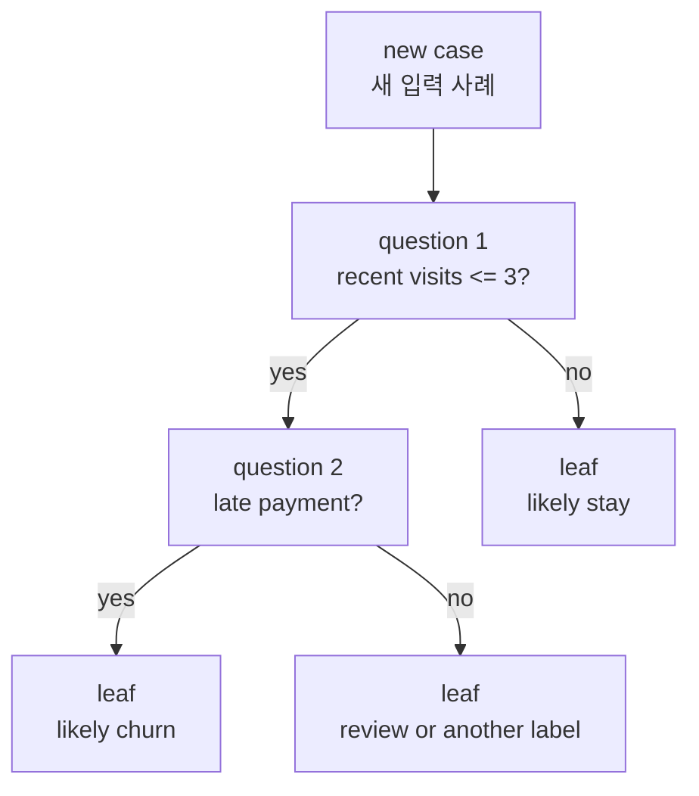
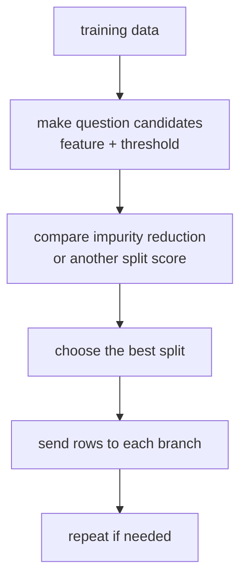

# P3-14.1 결정트리(decision tree)

P3-11에서는 경계(boundary)를 직선처럼 그어 보는 관점을 보았고, P3-12에서는 가까운 이웃을 보는 방식을 보았으며, P3-13에서는 더 좋은 경계의 기준으로 margin을 보았습니다. 이제 같은 지도학습(supervised learning) 문제를 전혀 다른 방식으로 다시 읽습니다.

`직선 하나를 그리는 대신, 질문을 차례로 나누어 가면 어떨까?`

이 질문이 결정트리(decision tree)의 출발점입니다.

초심자 기준에서는 다음 한 문장으로 먼저 잡아도 충분합니다.

`결정트리는 데이터를 한 번에 설명하려 하지 않고, yes/no 질문을 반복해 점점 더 비슷한 사례끼리 나누어 예측하는 모델이다.`

즉, 결정트리는 `경계선 하나`보다 `질문 흐름`에 더 가깝게 읽을 수 있습니다.

## 이 절의 범위

이 절은 다음 질문에 답합니다.

- 결정트리는 어떤 방식으로 예측하는가?
- `분기(split)`, `노드(node)`, `잎(leaf)`은 무엇인가?
- 트리는 왜 사람에게 비교적 읽기 쉬운 모델로 여겨지는가?
- 학습할 때는 어떤 질문 후보를 비교하는가?
- 분류(classification)와 회귀(regression) 모두에 왜 쓸 수 있는가?

이 절은 다음 내용은 깊게 다루지 않습니다.

- 트리 깊이가 커질 때 생기는 과적합(overfitting)
- 가지치기(pruning)의 세부 절차
- 랜덤포레스트(random forest)와 그래디언트 부스팅(gradient boosting)
- 엔트로피(entropy), 정보 이득(information gain)의 수식 전개

그 내용은 P3-14.2, P3-15, P3-16에서 이어서 다룹니다.

## 이 절의 목표

- 결정트리를 `질문을 나누어 예측하는 모델`이라고 설명할 수 있습니다.
- 분기, 노드, 잎, 임계값(threshold)의 의미를 말할 수 있습니다.
- 결정트리가 분류와 회귀에 모두 쓰일 수 있다는 점을 이해할 수 있습니다.
- 학습 과정이 `좋아 보이는 질문을 고르는 반복`이라는 점을 설명할 수 있습니다.
- `읽기 쉬움`과 `과하게 깊어질 위험`이 함께 있다는 점을 구분할 수 있습니다.

## 이 절이 커리큘럼에서 필요한 이유

앞 장들에서 본 대표 모델들은 대체로 이런 인상을 줍니다.

- 선형회귀(linear regression): 직선이나 평면으로 관계를 본다.
- 로지스틱 회귀(logistic regression): 경계 확률을 본다.
- k-NN: 가까운 이웃을 본다.
- SVM: 여유 있는 경계를 본다.

결정트리는 여기서 질문 자체를 바꿉니다.

| 앞 절의 관점 | 결정트리에서 바뀌는 질문 |
| --- | --- |
| 하나의 경계를 잘 그릴 수 있는가? | 어떤 질문으로 데이터를 나누는 것이 좋은가? |
| 거리나 마진이 중요한가? | 지금 분기하면 label이 더 정리되는가? |
| 수식으로 경향을 표현하는가? | 조건문 흐름처럼 사례를 나눌 수 있는가? |

즉, 결정트리는 `공간에 선을 긋는 모델`에서 `질문을 이어 붙이는 모델`로 시야를 바꿔 줍니다. 이 관점은 뒤의 랜덤포레스트와 부스팅을 이해하는 데도 바로 이어집니다.

## 결정트리는 어떤 모델인가

scikit-learn 사용자 가이드는 결정트리(decision tree)를 분류와 회귀에 쓰이는 비모수적(non-parametric) 지도학습 방법으로 소개합니다. 같은 문서는 이 모델의 목표를 `데이터 특징(feature)으로부터 추론한 단순한 의사결정 규칙(simple decision rules)을 학습해 목표값(target value)을 예측하는 것`으로 설명합니다. 또 이 구조를 `piecewise constant approximation`으로도 볼 수 있다고 덧붙입니다.

입문 단계에서는 이 설명을 다음처럼 더 쉽게 옮기면 됩니다.

`결정트리는 입력 특징을 보고, 어떤 기준값보다 큰지 작은지 같은 질문을 차례로 던지면서 입력 공간을 여러 조각으로 나누고, 각 조각마다 대표 예측값을 두는 모델이다.`

예를 들어 고객 이탈(churn) 예측을 생각해 볼 수 있습니다.

| 특징(feature) | 질문 예시 |
| --- | --- |
| 최근 30일 접속 수 | 접속 수가 3회 이하인가? |
| 결제 지연 여부 | 최근 결제 지연이 있었는가? |
| 고객센터 문의 횟수 | 문의가 2회 이상인가? |

결정트리는 이런 질문 중 하나를 먼저 고르고, 그 답에 따라 데이터를 두 갈래 이상으로 나눕니다. 그리고 각 갈래에서 다시 질문을 이어 갈 수 있습니다.

## 먼저 작은 흐름으로 보기

결정트리를 아직 학습기로 보지 말고, `질문을 따라 내려가는 의사결정 흐름`으로 먼저 보는 편이 좋습니다.



이 그림에서 핵심은 다음입니다.

- 중간의 질문 상자가 노드(node)입니다.
- 질문에 따라 갈라지는 지점이 분기(split)입니다.
- 더 이상 질문하지 않고 예측을 내놓는 끝점이 잎(leaf)입니다.

즉, 결정트리는 `질문 node를 따라 내려가 leaf에 도달하는 구조`라고 읽을 수 있습니다.

## node, split, leaf를 어떻게 이해하면 좋은가

초심자에게는 용어를 짧고 분명하게 끊어 주는 것이 중요합니다.

| 용어 | 쉬운 설명 | 이 절에서의 역할 |
| --- | --- | --- |
| 노드(node) | 질문이 놓이는 지점 | 데이터를 나눌 기준을 둔다 |
| 분기(split) | 질문 결과에 따라 갈라지는 일 | 데이터를 더 비슷한 묶음으로 나누려 한다 |
| 잎(leaf) | 마지막 예측이 적히는 끝점 | class 또는 수치를 낸다 |
| 임계값(threshold) | 숫자를 자르는 기준값 | `x <= 3.5` 같은 질문을 만든다 |

이 용어들은 뒤의 하이퍼파라미터 절과도 바로 연결됩니다.

- `max_depth`는 트리를 얼마나 깊게 허용할지와 연결됩니다.
- `min_samples_split`은 한 node를 더 나눌 만큼 사례가 충분한지와 연결됩니다.

하지만 이 절에서는 아직 `깊이를 어디까지 허용할까`보다 `질문을 나누는 구조 자체가 무엇인가`에 집중합니다.

## 왜 비교적 읽기 쉬운 모델이라고 하는가

결정트리는 Part 3에서 처음 만나는 모델들 중 비교적 `규칙처럼 읽기 쉬운` 편에 속합니다. scikit-learn 사용자 가이드는 이를 `white box model` 관점으로 설명합니다. 즉, 어떤 상황이 모델 안에서 관찰된다면 그 조건을 비교적 불리언 논리(boolean logic)로 설명하기 쉽다는 뜻입니다. 앞 절들에서 본 선형 모델의 가중치(weight)나 SVM의 margin보다, `질문을 따라가면 예측이 나온다`는 구조가 사람에게 더 익숙하기 때문입니다.

예를 들어 다음 두 설명을 비교해 보면 감이 더 분명해집니다.

- 선형 모델: 여러 특징의 가중합이 기준보다 크면 positive
- 결정트리: 최근 접속 수가 적고, 결제 지연이 있으면 churn 가능성 높음

둘 다 모델이지만, 후자는 사람이 업무 규칙을 읽는 방식과 더 닮아 있습니다.

실무에서도 이 장점은 자주 언급됩니다.

| 상황 | 결정트리가 주는 장점 |
| --- | --- |
| 고객 이탈 분석 | 어떤 질문 순서로 이탈을 가른 것인지 보기 쉽다 |
| 대출 심사 보조 | 어떤 조건이 먼저 분기를 만든 것인지 설명하기 쉽다 |
| 설비 이상 탐지 | 특정 센서 값 범위가 어떤 분기를 만들었는지 읽기 쉽다 |

다만 여기서 바로 주의할 점도 있습니다.

`읽기 쉬운 것과 항상 좋은 일반화를 주는 것은 같은 말이 아니다.`

이 위험은 바로 다음 절 P3-14.2에서 다룹니다.

## 분류와 회귀에 모두 쓸 수 있다는 말은 무슨 뜻인가

결정트리는 분류(classification)에도, 회귀(regression)에도 쓸 수 있습니다. 달라지는 것은 `leaf에서 무엇을 내놓는가`입니다.

| 문제 유형 | leaf에서 내놓는 것 |
| --- | --- |
| 분류 | 가장 많은 class, 또는 class 비율 |
| 회귀 | 그 leaf에 들어온 값들의 평균처럼 대표 수치 |

예를 들어:

- 고객 이탈 예측: `이탈`, `유지`
- 주택 가격 예측: `예상 가격 5.2억`

즉, 트리 구조는 비슷하고 마지막 출력의 성격이 달라집니다. scikit-learn의 `predict_proba` 설명도 분류 트리에서 예측 확률을 `해당 leaf에 들어온 같은 class 샘플의 비율`로 읽습니다. 이 때문에 Part 3의 평가 지표 절에서 강조했듯이, 알고리즘 이름보다 먼저 `이 문제가 분류인가 회귀인가`를 확인해야 합니다.

## 학습은 어떻게 질문을 고르는가

결정트리 학습의 핵심은 `좋아 보이는 질문 후보를 비교하는 일`입니다.

초심자 기준에서는 다음처럼 이해하면 충분합니다.

1. 여러 feature를 본다.
2. 각 feature에서 잘라 볼 수 있는 threshold 후보를 만든다.
3. 나누기 전보다 나눈 뒤가 label을 더 정리해 주는지 계산한다.
4. 가장 좋은 질문을 현재 node에 둔다.
5. 필요하면 각 가지에서 다시 반복한다.

이를 간단히 그리면 다음과 같습니다.



여기서 `impurity`는 node 안이 얼마나 섞여 있는지를 보는 말입니다. API 문서 기준으로는 분류 트리에서 `criterion`으로 `gini`, `entropy`, `log_loss` 같은 기준을 둘 수 있습니다. 아직 수식을 길게 외울 필요는 없습니다. 이 절에서는 `한 node 안에 class가 섞여 있으면 impurity가 높고, 한쪽 class로 정리되면 impurity가 낮다` 정도로 잡으면 충분합니다.

## impurity를 직관으로 읽기

분류 트리에서는 `질문을 던졌더니 label이 더 정리되었는가?`를 보고 싶습니다.

예를 들어 node 안에 고객 10명이 있는데:

- 5명은 churn
- 5명은 stay

라면 꽤 섞여 있습니다.

반면 어떤 질문으로 나눈 뒤:

- 왼쪽 가지는 churn 4명, stay 1명
- 오른쪽 가지는 churn 1명, stay 4명

이 되었다면, 두 가지 모두 전보다 더 정리된 상태라고 읽을 수 있습니다.

즉, 좋은 split은 대체로 `섞인 node를 덜 섞인 node들로 바꾸는 질문`입니다.

## Python 예제로 `좋은 첫 질문` 찾기

이번 예제는 scikit-learn 학습기를 바로 쓰기보다, 결정트리가 첫 split을 고르는 느낌을 직접 확인하는 작은 실습입니다.

- 문제 상황: 고객 이탈(churn) 분류의 첫 질문을 고른다.
- 입력(input): `visits`, `late_payment`
- 정답(label): `stay`, `churn`
- 확인할 개념:
  - feature와 threshold를 바꾸면 split 점수가 달라진다.
  - 더 잘 정리되는 질문이 더 좋은 첫 질문이 될 수 있다.
  - 결정트리는 결국 이런 질문 선택을 반복한다.

```python
rows = [
    {"customer": "A", "visits": 1, "late_payment": 1, "label": "churn"},
    {"customer": "B", "visits": 2, "late_payment": 1, "label": "churn"},
    {"customer": "C", "visits": 2, "late_payment": 0, "label": "stay"},
    {"customer": "D", "visits": 4, "late_payment": 0, "label": "stay"},
    {"customer": "E", "visits": 5, "late_payment": 0, "label": "stay"},
    {"customer": "F", "visits": 6, "late_payment": 1, "label": "stay"},
]


def gini(group):
    total = len(group)
    if total == 0:
        return 0.0

    counts = {}
    for row in group:
        counts[row["label"]] = counts.get(row["label"], 0) + 1

    score = 1.0
    for count in counts.values():
        p = count / total
        score -= p * p
    return score


def weighted_gini(left, right):
    total = len(left) + len(right)
    return (len(left) / total) * gini(left) + (len(right) / total) * gini(right)


candidates = [
    ("visits", 1.5),
    ("visits", 3.0),
    ("visits", 5.5),
    ("late_payment", 0.5),
]

best = None

for feature, threshold in candidates:
    left = [row for row in rows if row[feature] <= threshold]
    right = [row for row in rows if row[feature] > threshold]
    score = weighted_gini(left, right)

    print(f"feature={feature:12} threshold={threshold:>3} weighted_gini={score:.3f}")
    print("  left :", [(row["customer"], row["label"]) for row in left])
    print("  right:", [(row["customer"], row["label"]) for row in right])
    print()

    if best is None or score < best["score"]:
        best = {"feature": feature, "threshold": threshold, "score": score}

print("best first split")
print(best)
```

실행 결과 예시는 다음과 같습니다.

```text
feature=visits       threshold=1.5 weighted_gini=0.400
  left : [('A', 'churn')]
  right: [('B', 'churn'), ('C', 'stay'), ('D', 'stay'), ('E', 'stay'), ('F', 'stay')]

feature=visits       threshold=3.0 weighted_gini=0.222
  left : [('A', 'churn'), ('B', 'churn'), ('C', 'stay')]
  right: [('D', 'stay'), ('E', 'stay'), ('F', 'stay')]

feature=visits       threshold=5.5 weighted_gini=0.400
  left : [('A', 'churn'), ('B', 'churn'), ('C', 'stay'), ('D', 'stay'), ('E', 'stay')]
  right: [('F', 'stay')]

feature=late_payment threshold=0.5 weighted_gini=0.250
  left : [('C', 'stay'), ('D', 'stay'), ('E', 'stay')]
  right: [('A', 'churn'), ('B', 'churn'), ('F', 'stay')]

best first split
{'feature': 'visits', 'threshold': 3.0, 'score': 0.2222222222222222}
```

이 출력에서 읽어야 할 것은 세 가지입니다.

1. 아무 질문이나 같은 품질을 주지 않습니다.
2. `visits <= 3.0`이 현재 데이터에서는 가장 잘 정리되는 첫 질문으로 보입니다.
3. 트리 학습은 이런 비교를 반복하면서 구조를 만듭니다.

즉, 결정트리는 `사람이 직감으로 질문을 쓰는 모델`이 아니라, `데이터를 더 정리해 주는 질문을 찾아 누적하는 모델`이라고 읽는 편이 정확합니다.

## 아주 작은 트리를 직접 적용해 보기

방금 찾은 첫 split을 바탕으로, 사람이 읽을 수 있는 작은 트리를 손으로 적어 보면 다음처럼 볼 수 있습니다.

```text
if visits <= 3:
    if late_payment == 1:
        predict churn
    else:
        predict stay
else:
    predict stay
```

이 코드는 `학습기 전체`가 아니라, 학습 결과를 사람이 읽는 모습을 단순화한 것입니다. 결정트리가 비교적 설명 가능해 보인다는 말은 보통 이런 모습에서 옵니다.

같은 구조를 Python으로 아주 짧게 실행해 보면 더 분명합니다.

```python
def predict(tree_input):
    if tree_input["visits"] <= 3:
        if tree_input["late_payment"] == 1:
            return "churn"
        return "stay"
    return "stay"


examples = [
    {"customer": "G", "visits": 2, "late_payment": 1},
    {"customer": "H", "visits": 2, "late_payment": 0},
    {"customer": "I", "visits": 5, "late_payment": 1},
]

for row in examples:
    print(row["customer"], "->", predict(row))
```

실행 결과 예시는 다음과 같습니다.

```text
G -> churn
H -> stay
I -> stay
```

이 예제는 결정트리의 중요한 성격을 보여 줍니다.

- 예측 경로를 따라가며 읽을 수 있습니다.
- 어떤 질문에서 갈라졌는지 설명하기 쉽습니다.
- 하지만 질문을 계속 추가하면 구조가 빠르게 커질 수 있습니다.

마지막 항목이 바로 다음 절의 주제입니다.

## 실무 장면에서 어떻게 읽을 수 있는가

결정트리는 특히 `표 형식 데이터(tabular data)`에서 자주 떠오르는 모델입니다. 이유는 숫자와 범주 특징을 기준값이나 조건으로 나누는 방식이 비교적 자연스럽기 때문입니다.

| 업무 장면 | 결정트리식 질문 예시 |
| --- | --- |
| 고객 이탈 | 최근 방문 수가 적은가? 결제 지연이 있었는가? |
| 대출 심사 보조 | 소득이 일정 기준 이상인가? 연체 기록이 있는가? |
| 설비 이상 탐지 | 온도가 기준을 넘었는가? 진동이 특정 범위 밖인가? |
| 마케팅 반응 예측 | 최근 구매가 있었는가? 할인 메시지 반응률이 높은가? |

이런 장면에서는 선형 모델보다 결정트리가 더 직관적으로 느껴질 수 있습니다. 반대로 데이터가 매우 매끄러운 연속 관계를 가지거나, 작은 흔들림에도 구조가 크게 바뀌는 상황에서는 주의가 필요합니다. 또한 API 문서가 경고하듯 기본 크기 제어값을 두지 않으면 트리가 fully grown and unpruned 상태로 매우 커질 수 있습니다. 이 지점이 바로 다음 절의 과적합 논의와 이어집니다.

## 이 절에서 기억할 관점

- 결정트리는 `질문을 나누어 예측하는 모델`입니다.
- node는 질문, split은 분기, leaf는 최종 예측입니다.
- 좋은 split은 대체로 label을 더 덜 섞인 묶음으로 바꿉니다.
- 결정트리는 분류와 회귀 모두에 쓸 수 있습니다.
- 비교적 읽기 쉬운 모델이지만, 깊어지면 위험도 함께 커집니다.

## 체크리스트

- 결정트리를 경계선이 아니라 질문 흐름으로 설명할 수 있는가?
- `feature + threshold`가 질문 후보가 된다는 점을 말할 수 있는가?
- 분류에서는 `더 잘 정리되는 split`을 고르려 한다는 점을 설명할 수 있는가?
- leaf가 class를 낼 수도 있고 수치를 낼 수도 있다는 점을 구분할 수 있는가?
- 과적합 이야기는 아직 시작하지 않았고, 다음 절에서 다룬다는 점을 알고 있는가?

## 출처와 참고 자료

- scikit-learn developers, `1.10. Decision Trees`, scikit-learn User Guide, 확인 날짜: 2026-06-27. [https://scikit-learn.org/stable/modules/tree.html](https://scikit-learn.org/stable/modules/tree.html){: target="_blank" rel="noopener noreferrer" }
- scikit-learn developers, `DecisionTreeClassifier`, scikit-learn API Reference, 확인 날짜: 2026-06-27. [https://scikit-learn.org/stable/modules/generated/sklearn.tree.DecisionTreeClassifier.html](https://scikit-learn.org/stable/modules/generated/sklearn.tree.DecisionTreeClassifier.html){: target="_blank" rel="noopener noreferrer" }
- Leo Breiman, Jerome Friedman, Richard Olshen, Charles Stone, *Classification and Regression Trees*, Routledge, 1984.
