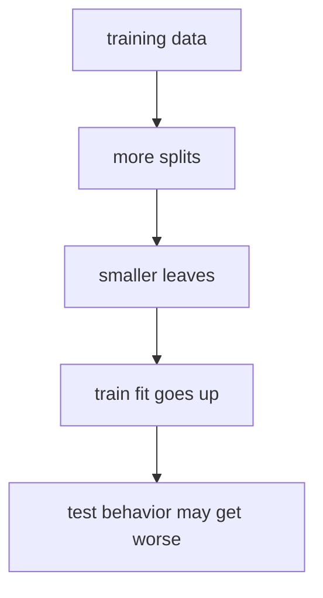
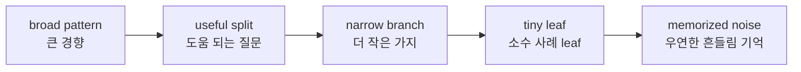
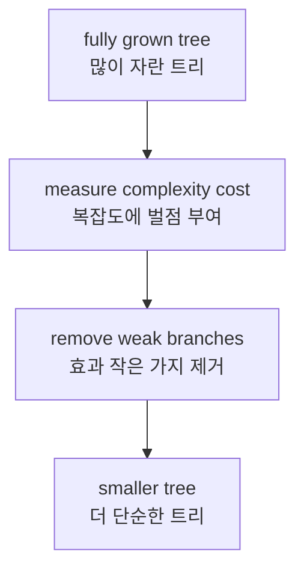

# P3-14.2 트리의 과적합

P3-14.1에서는 결정트리(decision tree)를 `질문을 나누어 예측하는 모델`로 보았습니다. 그 절의 장점은 분명했습니다.

- 질문 흐름으로 읽기 쉽다.
- 조건문처럼 설명하기 쉽다.
- 표 형식 데이터(tabular data)에서 직관적으로 느껴진다.

하지만 같은 성질이 바로 위험으로도 이어집니다.

`질문을 계속 더 만들 수 있다면, 훈련 데이터를 거의 외워 버릴 수도 있지 않을까?`

이 질문이 바로 트리의 과적합(overfitting) 문제입니다.

## 이 절의 범위

이 절은 다음 질문에 답합니다.

- 결정트리는 왜 다른 모델보다 과적합이 쉽게 눈에 띄는가?
- 트리가 깊어질수록 무슨 일이 생기는가?
- `max_depth`, `min_samples_leaf`, `ccp_alpha`는 어떤 역할을 하는가?
- train 성능과 test 성능이 왜 다르게 움직일 수 있는가?

이 절은 다음 내용은 깊게 다루지 않습니다.

- 랜덤포레스트(random forest)의 bagging 완화 효과
- 그래디언트 부스팅(gradient boosting)의 순차 보정 구조
- pruning 알고리즘의 수학적 최적화 세부
- 교차검증 기반의 정교한 하이퍼파라미터 탐색 절차

이 내용은 P3-15, P3-16, 그리고 P3-9의 튜닝 문맥과 다시 연결합니다.

## 이 절의 목표

- 트리의 과적합을 `너무 세밀한 질문이 훈련 데이터를 외우는 현상`으로 설명할 수 있습니다.
- 깊이(depth), leaf 크기, pruning이 트리 복잡도를 제어하는 장치라는 점을 말할 수 있습니다.
- train 성능 상승이 test 성능 상승을 보장하지 않는다는 점을 다시 확인할 수 있습니다.
- 결정트리의 장점과 과적합 위험을 함께 읽는 기준을 갖게 됩니다.

## 왜 트리는 과적합이 잘 보이는가

결정트리는 본질적으로 `분기(split)를 반복하면서 node를 더 작게 나누는 구조`입니다. 이 구조는 강력하지만, 제한이 없으면 점점 더 작은 잎(leaf)을 만들 수 있습니다.

scikit-learn 사용자 가이드는 결정트리 학습기가 `over-complex trees`를 만들 수 있고, 이런 트리는 데이터를 잘 일반화(generalize)하지 못한다고 설명합니다. 같은 문서는 이를 overfitting이라고 부르며, pruning, `min_samples_leaf`, `max_depth` 같은 장치가 필요하다고 설명합니다.

초심자 기준으로는 다음처럼 이해하면 충분합니다.

`트리는 질문을 더 추가할수록 훈련 데이터의 예외까지 따라갈 수 있다. 하지만 그 예외가 새 데이터에서도 반복된다는 보장은 없다.`

## 작은 트리와 큰 트리를 비교하는 직관

예를 들어 고객 이탈 데이터를 다시 생각해 볼 수 있습니다.

| 트리 상태 | 직관 |
| --- | --- |
| 얕은 트리 | 큰 경향만 본다 |
| 적당한 깊이의 트리 | 중요한 패턴과 예외를 균형 있게 본다 |
| 지나치게 깊은 트리 | 훈련 데이터의 우연한 흔들림까지 따라간다 |

같은 내용을 더 짧게 그리면 다음과 같습니다.



핵심은 마지막 화살표입니다.

`더 잘 맞춘다`와 `더 잘 일반화한다`는 같은 말이 아닙니다.

## 깊어질수록 무슨 일이 생기는가

트리가 깊어질수록 각 leaf에는 더 적은 수의 샘플이 남습니다. 그러면 다음과 같은 일이 벌어집니다.

1. 한두 개의 예외 사례가 분기를 새로 만들 수 있습니다.
2. leaf 하나가 아주 적은 샘플만 보고 예측을 내릴 수 있습니다.
3. train 데이터에서는 거의 틀리지 않게 될 수 있습니다.
4. 하지만 test 데이터에서는 작은 흔들림에도 예측이 쉽게 바뀔 수 있습니다.

scikit-learn 문서는 트리의 레벨이 하나 늘어날 때마다 트리를 채워야 하는 샘플 수가 두 배로 늘어난다고 설명하며, `max_depth`로 크기를 제어하라고 권합니다. 또 `min_samples_split`과 `min_samples_leaf`를 사용해 모든 결정이 여러 샘플의 정보를 바탕으로 이루어지게 하라고 권합니다.

이 설명을 초심자 문장으로 바꾸면 다음과 같습니다.

`트리가 깊어질수록 더 자세해지지만, 그 자세함을 떠받칠 데이터가 충분하지 않으면 트리는 똑똑해지는 것이 아니라 예민해질 수 있다.`

## 과적합을 데이터 흐름으로 보기

과적합을 수식보다 흐름으로 이해하면 더 오래 갑니다.



앞쪽 분기는 종종 의미 있는 큰 경향을 잡습니다. 문제는 뒤로 갈수록 생깁니다. 마지막 몇 단계는 `진짜 구조`가 아니라 `훈련 데이터에서만 보인 우연한 흔들림`을 설명하게 될 수 있습니다.

## train 성능과 test 성능을 함께 봐야 하는 이유

트리의 과적합은 train 성능과 test 성능을 같이 보면 특히 잘 드러납니다.

| 관찰 | 해석 |
| --- | --- |
| train과 test가 둘 다 낮다 | 아직 단순해서 충분히 배우지 못했을 수 있다 |
| train과 test가 함께 높다 | 현재는 균형이 괜찮아 보인다 |
| train만 아주 높고 test가 떨어진다 | 과적합을 의심해야 한다 |

이 관점은 결정트리에서 특히 자주 보이지만, 사실 Part 3 전체의 공통 원리이기도 합니다. 선형회귀, 로지스틱 회귀, SVM, 트리 모델 모두 결국 `보지 못한 데이터에서 어떻게 버티는가`가 더 중요합니다.

## Python 예제로 깊이에 따른 과적합 보기

이번 예제는 같은 결정트리 분류기에서 깊이만 바꾸어 train/test 결과가 어떻게 갈라지는지 보는 실습입니다.

- 문제 상황: iris 데이터셋으로 품종 분류를 한다.
- 입력(input): 꽃받침, 꽃잎 길이와 너비
- 정답(label): 세 가지 품종
- 확인할 개념:
  - 깊이가 커질수록 train 성능은 쉽게 올라갈 수 있다.
  - test 성능은 어느 지점 이후 정체하거나 떨어질 수 있다.
  - 트리 깊이는 복잡도 손잡이 중 하나다.

```python
from sklearn.datasets import load_iris
from sklearn.model_selection import train_test_split
from sklearn.tree import DecisionTreeClassifier

X, y = load_iris(return_X_y=True)

X_train, X_test, y_train, y_test = train_test_split(
    X, y, test_size=0.3, random_state=42, stratify=y
)

for depth in [1, 2, 3, 5, None]:
    model = DecisionTreeClassifier(max_depth=depth, random_state=42)
    model.fit(X_train, y_train)

    print(f"max_depth={depth}")
    print("  depth          :", model.get_depth())
    print("  leaves         :", model.get_n_leaves())
    print("  train accuracy :", round(model.score(X_train, y_train), 3))
    print("  test accuracy  :", round(model.score(X_test, y_test), 3))
    print()
```

실행 결과 예시는 다음과 같습니다.

```text
max_depth=1
  depth          : 1
  leaves         : 2
  train accuracy : 0.667
  test accuracy  : 0.667

max_depth=2
  depth          : 2
  leaves         : 3
  train accuracy : 0.952
  test accuracy  : 0.889

max_depth=3
  depth          : 3
  leaves         : 5
  train accuracy : 0.981
  test accuracy  : 0.933

max_depth=5
  depth          : 5
  leaves         : 8
  train accuracy : 1.0
  test accuracy  : 0.911

max_depth=None
  depth          : 5
  leaves         : 8
  train accuracy : 1.0
  test accuracy  : 0.911
```

이 결과에서 읽어야 할 것은 다음입니다.

1. 깊이를 늘리면 train accuracy는 계속 좋아지기 쉽습니다.
2. 하지만 test accuracy는 어느 지점 이후 더 좋아지지 않을 수 있습니다.
3. `max_depth=3` 부근이 현재 예제에서는 더 균형 있어 보입니다.

즉, 트리의 성능을 볼 때는 `깊어졌는가`보다 `깊어졌을 때 train/test가 어떻게 갈리는가`를 같이 봐야 합니다.

## `min_samples_leaf`는 왜 필요한가

`max_depth`가 트리 전체의 높이를 제한하는 손잡이라면, `min_samples_leaf`는 leaf 하나가 너무 작아지는 것을 막는 손잡이입니다.

API 문서는 `min_samples_leaf`를 leaf node에 들어가야 하는 최소 샘플 수로 설명합니다. 또 이 값이 회귀(regression)에서는 모델을 더 부드럽게(smoothing) 만드는 효과를 줄 수 있다고 설명합니다.

입문 단계에서는 다음처럼 이해하면 좋습니다.

`leaf 하나가 한두 개 사례만 품게 두면, 그 leaf는 패턴보다 예외를 말할 가능성이 커진다.`

예를 들어:

- `min_samples_leaf=1`: 한 개 사례만 남는 leaf도 허용
- `min_samples_leaf=5`: 적어도 다섯 사례는 있어야 leaf로 인정

이 차이는 `얼마나 작은 예외를 믿을 것인가`의 차이로 읽을 수 있습니다.

## Python 예제로 leaf 크기 제어 보기

이번에는 깊이를 고정하지 않고 leaf 크기만 바꾸어 봅니다.

- 문제 상황: 같은 데이터에서 leaf를 얼마나 작게 허용할지 바꾼다.
- 확인할 개념:
  - leaf가 너무 작으면 train 점수는 높아지기 쉽다.
  - leaf 크기를 키우면 구조가 덜 예민해질 수 있다.

```python
from sklearn.datasets import load_iris
from sklearn.model_selection import train_test_split
from sklearn.tree import DecisionTreeClassifier

X, y = load_iris(return_X_y=True)

X_train, X_test, y_train, y_test = train_test_split(
    X, y, test_size=0.3, random_state=42, stratify=y
)

for leaf_size in [1, 2, 5, 10]:
    model = DecisionTreeClassifier(
        min_samples_leaf=leaf_size,
        random_state=42
    )
    model.fit(X_train, y_train)

    print(f"min_samples_leaf={leaf_size}")
    print("  depth          :", model.get_depth())
    print("  leaves         :", model.get_n_leaves())
    print("  train accuracy :", round(model.score(X_train, y_train), 3))
    print("  test accuracy  :", round(model.score(X_test, y_test), 3))
    print()
```

실행 결과 예시는 다음과 같습니다.

```text
min_samples_leaf=1
  depth          : 5
  leaves         : 8
  train accuracy : 1.0
  test accuracy  : 0.911

min_samples_leaf=2
  depth          : 4
  leaves         : 7
  train accuracy : 0.981
  test accuracy  : 0.933

min_samples_leaf=5
  depth          : 3
  leaves         : 4
  train accuracy : 0.971
  test accuracy  : 0.933

min_samples_leaf=10
  depth          : 2
  leaves         : 3
  train accuracy : 0.952
  test accuracy  : 0.889
```

이 예제는 중요한 감각 하나를 줍니다.

`작은 leaf를 막는다고 해서 무조건 성능이 나빠지는 것은 아니다. 오히려 test 쪽이 더 안정되는 경우가 있다.`

## pruning은 무엇을 하는가

깊이를 미리 막는 방법을 `pre-pruning`처럼 읽을 수 있다면, 이미 자란 트리를 다시 단순하게 줄이는 방법은 `pruning`이라고 읽을 수 있습니다.

scikit-learn은 `Minimal Cost-Complexity Pruning`을 지원하며, API 문서에서는 `ccp_alpha`를 그 pruning의 복잡도 파라미터로 설명합니다. 값이 커질수록 더 많은 노드가 잘려 나갈 수 있습니다.

초심자 기준에서는 다음 정도면 충분합니다.

- `max_depth`, `min_samples_leaf`: 처음부터 너무 복잡해지지 않게 막는다.
- `ccp_alpha`: 자란 뒤에 복잡도를 벌점처럼 주어 줄인다.

즉, 둘 다 목적은 같습니다.

`훈련 데이터를 외우기보다, 새 데이터에서도 버틸 구조를 남기려는 것`

## pruning을 흐름으로 보기



이 절에서는 pruning 공식을 계산하지 않습니다. 대신 `너무 많은 가지를 그대로 두지 않는 이유`만 잡으면 충분합니다.

## 실무에서 어떤 손잡이를 먼저 보아야 하는가

입문자와 실무 초반에는 모든 값을 한 번에 건드리기보다 역할별로 나누어 보는 편이 낫습니다.

| 손잡이 | 먼저 읽는 질문 |
| --- | --- |
| `max_depth` | 트리가 어디까지 깊어지게 둘 것인가? |
| `min_samples_split` | 이 node를 더 나눌 만큼 샘플이 충분한가? |
| `min_samples_leaf` | leaf 하나가 너무 작아지지 않게 할 것인가? |
| `ccp_alpha` | 이미 자란 가지를 얼마나 줄일 것인가? |

실무 감각으로 바꾸면 다음과 같습니다.

- 설명이 너무 길고 복잡하게 느껴진다 -> `max_depth` 확인
- 소수 사례만 설명하는 leaf가 많아 보인다 -> `min_samples_leaf` 확인
- 가지가 지나치게 많고 잔가지가 많다 -> `ccp_alpha` 검토

## 이 절에서 기억할 관점

- 트리는 읽기 쉬운 대신, 제한이 없으면 훈련 데이터를 과하게 따라가기 쉽습니다.
- 깊이가 커지고 leaf가 작아질수록 과적합 위험이 커집니다.
- train 성능이 높아져도 test 성능이 같이 좋아진다는 보장은 없습니다.
- `max_depth`, `min_samples_leaf`, `ccp_alpha`는 트리 복잡도를 제어하는 대표 손잡이입니다.
- 과적합을 줄인다는 말은 보통 `조금 덜 완벽하게 외우고, 조금 더 일반화되게 만든다`는 뜻입니다.

## 체크리스트

- 트리의 과적합을 `질문이 너무 세밀해져 훈련 데이터를 외우는 현상`으로 설명할 수 있는가?
- train과 test 결과를 함께 보아야 하는 이유를 말할 수 있는가?
- `max_depth`와 `min_samples_leaf`의 역할 차이를 구분할 수 있는가?
- pruning을 `복잡한 가지를 줄이는 과정`으로 이해하고 있는가?
- 이 절이 랜덤포레스트와 부스팅으로 넘어가기 전 복잡도 감각을 잡는 절이라는 점을 알고 있는가?

## 출처와 참고 자료

- scikit-learn developers, `1.10. Decision Trees`, scikit-learn User Guide, 확인 날짜: 2026-06-27. [https://scikit-learn.org/stable/modules/tree.html](https://scikit-learn.org/stable/modules/tree.html){: target="_blank" rel="noopener noreferrer" }
- scikit-learn developers, `DecisionTreeClassifier`, scikit-learn API Reference, 확인 날짜: 2026-06-27. [https://scikit-learn.org/stable/modules/generated/sklearn.tree.DecisionTreeClassifier.html](https://scikit-learn.org/stable/modules/generated/sklearn.tree.DecisionTreeClassifier.html){: target="_blank" rel="noopener noreferrer" }
- Leo Breiman, Jerome Friedman, Richard Olshen, Charles Stone, *Classification and Regression Trees*, Routledge, 1984.
