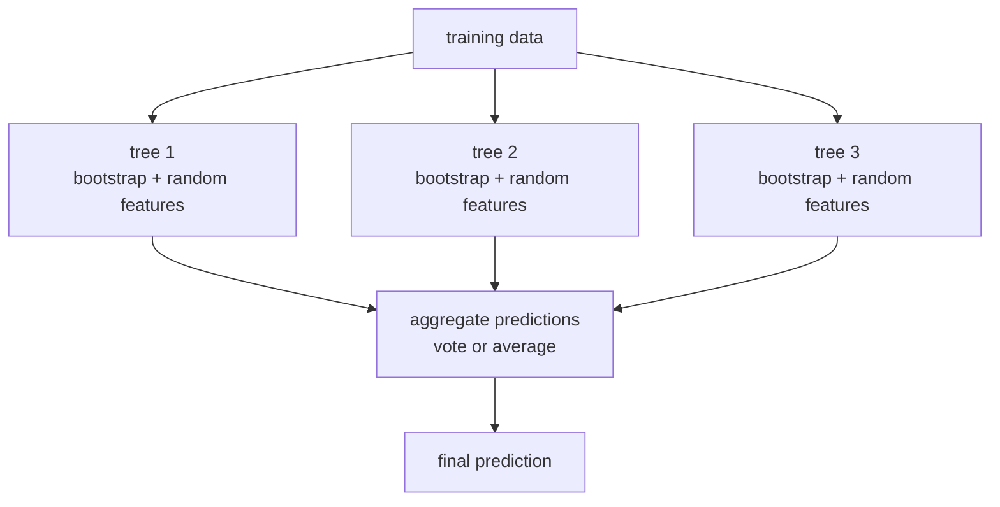
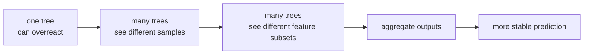

# P3-15.1 랜덤포레스트(random forest)

P3-14에서는 결정트리(decision tree)가 왜 직관적이면서도 과적합(overfitting)에 쉽게 빠질 수 있는지 보았습니다. 이제 자연스럽게 다음 질문이 나옵니다.

`그렇다면 트리의 장점은 살리고, 한 그루의 과한 흔들림은 줄일 방법이 없을까?`

이 질문이 바로 랜덤포레스트(random forest)의 출발점입니다.

초심자 기준에서는 다음 한 문장으로 먼저 잡으면 충분합니다.

`랜덤포레스트는 서로 조금씩 다르게 학습된 여러 결정트리의 예측을 모아, 한 그루 트리보다 더 안정적인 판단을 만들려는 모델이다.`

즉, 랜덤포레스트는 `트리를 버리는 모델`이 아니라 `트리를 여러 개 모아 약점을 줄이는 모델`입니다.

## 이 절의 범위

이 절은 다음 질문에 답합니다.

- 랜덤포레스트는 왜 여러 트리를 쓰는가?
- `bootstrap`, `max_features`, `averaging`은 어떤 역할을 하는가?
- 한 그루 트리보다 왜 더 안정적으로 보일 수 있는가?
- 분류와 회귀에서 랜덤포레스트는 어떻게 동작하는가?
- `n_estimators`, `max_features`, `bootstrap`, `oob_score`는 무엇을 뜻하는가?

이 절은 다음 내용은 깊게 다루지 않습니다.

- 특징 중요도(feature importance)의 해석
- OOB(out-of-bag) 점수의 엄밀한 평가 해석
- Extra Trees와의 세부 비교
- 그래디언트 부스팅과의 심화 비교

특징 중요도는 P3-15.2에서 이어서 다룹니다.

## 이 절의 목표

- 랜덤포레스트를 `여러 randomized tree의 평균/집계 모델`로 설명할 수 있습니다.
- bootstrap 샘플링과 feature 무작위 선택이 왜 필요한지 말할 수 있습니다.
- 랜덤포레스트가 결정트리의 분산(variance)을 줄이려는 시도라는 점을 이해할 수 있습니다.
- 대표 하이퍼파라미터의 역할을 초심자 수준에서 구분할 수 있습니다.

## 이 절이 커리큘럼에서 필요한 이유

결정트리 장까지 오면 초심자는 보통 두 감각을 동시에 갖게 됩니다.

- 좋았던 점: 읽기 쉽고 표 형식 데이터에 잘 맞아 보인다.
- 불안한 점: 트리가 깊어지면 너무 많이 외우는 것 같다.

랜덤포레스트는 바로 이 긴장 위에서 등장합니다.

| 14장에서 남은 질문 | 15.1이 답하려는 방향 |
| --- | --- |
| 한 그루 트리가 흔들리면 어떻게 할까? | 여러 그루를 모아 흔들림을 평균낸다 |
| 예외에 끌리는 분기를 줄일 수 있을까? | 각 트리를 서로 다르게 만들어 오류를 덜 묶이게 한다 |
| 트리의 해석 가능성을 완전히 잃는가? | 일부 잃지만, 안정성과 성능을 얻는 경우가 많다 |

즉, 랜덤포레스트는 `결정트리의 단점을 부정`하기보다, `그 단점을 집단화로 완화`하는 방식입니다.

## 앙상블(ensemble)이라는 큰 틀

scikit-learn 사용자 가이드는 ensemble methods를 `여러 base estimator의 예측을 결합해 단일 estimator보다 더 나은 generalizability / robustness를 얻으려는 방법`으로 설명합니다.

랜덤포레스트는 이 앙상블(ensemble) 계열 안에서, 트리를 여러 개 쓰는 대표 사례입니다.

입문 수준에서는 이렇게 받아들이면 좋습니다.

`한 모델의 판단을 그대로 믿기보다, 서로 조금 다른 여러 모델의 판단을 모아 더 안정적인 답을 만들자.`

이 큰 틀을 먼저 보면 랜덤포레스트가 왜 나왔는지 더 자연스럽습니다.

## 랜덤포레스트는 어떤 모델인가

scikit-learn 문서는 random forests를 `decision tree 기반의 averaging algorithm`으로 설명합니다. 각 트리는 훈련 세트에서 복원추출(with replacement)한 bootstrap sample로 학습되고, 각 split에서는 feature의 임의 부분집합만 후보로 봅니다.

핵심은 두 가지 무작위성입니다.

1. 샘플을 다르게 뽑는다.  
2. 각 분기에서 feature를 다르게 본다.

그리고 마지막에 여러 트리의 예측을 모읍니다.

이 구조를 초심자 문장으로 바꾸면 다음과 같습니다.

`랜덤포레스트는 같은 데이터를 모든 트리에 똑같이 주지 않고, 각 트리가 조금씩 다른 데이터와 다른 feature 후보를 보게 만든 뒤, 마지막에 결과를 합친다.`

## 한 장면으로 먼저 보기



이 그림에서 중요한 점은 `모든 트리가 완전히 같은 것을 보지 않는다`는 것입니다. 그래야 서로 다른 실수를 만들 여지가 생기고, 그 실수를 평균내거나 투표로 묶을 수 있습니다.

## 왜 여러 트리를 모으면 더 안정적일 수 있는가

결정트리는 high variance 모델로 자주 설명됩니다. scikit-learn 사용자 가이드도 개별 결정트리는 variance가 크고 overfit하기 쉽다고 설명합니다. 랜덤포레스트는 이 variance를 줄이기 위해 여러 diverse tree를 결합합니다.

초심자용 직관은 다음과 같습니다.

- 한 트리는 특정 예외 사례에 과하게 끌릴 수 있습니다.
- 다른 트리는 bootstrap 샘플이 달라 그 예외를 덜 강하게 볼 수 있습니다.
- 또 다른 트리는 분기 feature 후보가 달라 전혀 다른 경로를 만들 수 있습니다.
- 여러 트리의 답을 모으면, 한 트리만의 과한 흔들림이 덜 드러날 수 있습니다.

즉, 랜덤포레스트는 보통 `한 그루의 확신`보다 `여러 그루의 합의`를 택합니다.

## bootstrap은 무엇을 하는가

random forest의 첫 번째 무작위성은 bootstrap sampling입니다.

scikit-learn 문서는 각 트리가 훈련 세트에서 복원추출한 bootstrap sample로 만들어진다고 설명합니다. 복원추출이므로 어떤 샘플은 한 트리에 두 번 들어갈 수 있고, 어떤 샘플은 아예 빠질 수 있습니다.

이를 직관으로 읽으면 다음과 같습니다.

`각 트리는 전체 데이터를 복사해 그대로 배우는 것이 아니라, 조금 다른 훈련 경험을 하게 된다.`

아주 작은 예를 생각해 볼 수 있습니다.

원래 데이터가 `A, B, C, D, E`라면 한 bootstrap sample은 다음처럼 보일 수 있습니다.

- tree 1: `A, B, B, D, E`
- tree 2: `A, C, D, D, E`
- tree 3: `B, C, C, D, E`

같은 원본 데이터에서 출발했어도 각 트리의 시야가 조금씩 다릅니다.

## feature 무작위 선택은 무엇을 하는가

두 번째 무작위성은 feature sub-sampling입니다.

scikit-learn 문서는 각 split에서 candidate feature의 무작위 부분집합을 본다고 설명합니다. 이 역할을 하는 대표 하이퍼파라미터가 `max_features`입니다.

왜 이게 필요할까요?

만약 강한 feature 하나가 항상 모든 트리의 첫 분기를 장악한다면, 트리들이 너무 비슷해질 수 있습니다. 그러면 여러 개를 모아도 diversity가 부족합니다.

따라서 feature 후보를 일부만 보게 하면:

- 어떤 트리는 feature A를 중심으로 분기하고
- 어떤 트리는 feature B를 먼저 보고
- 어떤 트리는 다른 우회 경로를 만들 수 있습니다

즉, `max_features`는 단순 속도 옵션이 아니라 `트리들을 서로 덜 닮게 만드는 장치`로 읽는 편이 더 중요합니다.

## 분류와 회귀에서 어떻게 합치는가

랜덤포레스트는 분류와 회귀에 모두 쓰일 수 있습니다. 달라지는 것은 여러 트리의 답을 합치는 방법입니다.

| 문제 유형 | 여러 트리의 출력 | 최종 집계 |
| --- | --- | --- |
| 분류(classification) | 각 트리의 class 또는 class 확률 | 투표 또는 확률 평균 |
| 회귀(regression) | 각 트리의 예측 수치 | 평균 |

scikit-learn 문서는 분류 random forest에서 트리들의 확률 예측을 평균해 결합한다고 설명합니다. 반면 초심자에게는 종종 `majority vote`라는 설명이 더 익숙할 수 있습니다. 둘 다 큰 흐름에서는 맞지만, scikit-learn 구현 기준으로는 확률 평균 쪽이 더 정확한 설명입니다.

## 랜덤포레스트를 흐름으로 읽기



핵심은 `더 많은 트리` 자체가 아니라 `서로 다른 오류를 만들 수 있는 트리들`이라는 점입니다.

## Python 예제로 한 그루와 여러 그루를 비교하기

이번 예제는 같은 iris 분류 문제에서 결정트리 하나와 랜덤포레스트를 비교하는 작은 실습입니다.

- 문제 상황: 한 그루 트리와 여러 그루 숲의 차이를 본다.
- 입력(input): iris 특징 4개
- 정답(label): 품종 class
- 확인할 개념:
  - random forest는 여러 트리를 묶는다
  - 같은 데이터에서도 test 성능과 안정성이 달라질 수 있다
  - `n_estimators`가 숲의 크기와 연결된다

```python
from sklearn.datasets import load_iris
from sklearn.model_selection import train_test_split
from sklearn.tree import DecisionTreeClassifier
from sklearn.ensemble import RandomForestClassifier

X, y = load_iris(return_X_y=True)

X_train, X_test, y_train, y_test = train_test_split(
    X, y, test_size=0.3, random_state=42, stratify=y
)

single_tree = DecisionTreeClassifier(random_state=42)
single_tree.fit(X_train, y_train)

forest = RandomForestClassifier(
    n_estimators=100,
    random_state=42
)
forest.fit(X_train, y_train)

print("single tree")
print("  train accuracy:", round(single_tree.score(X_train, y_train), 3))
print("  test accuracy :", round(single_tree.score(X_test, y_test), 3))
print("  depth         :", single_tree.get_depth())
print("  leaves        :", single_tree.get_n_leaves())
print()

print("random forest")
print("  train accuracy:", round(forest.score(X_train, y_train), 3))
print("  test accuracy :", round(forest.score(X_test, y_test), 3))
print("  trees         :", len(forest.estimators_))
print("  first depth   :", forest.estimators_[0].get_depth())
```

실행 결과 예시는 다음과 같습니다.

```text
single tree
  train accuracy: 1.0
  test accuracy : 0.911
  depth         : 5
  leaves        : 8

random forest
  train accuracy: 1.0
  test accuracy : 0.911
  trees         : 100
  first depth   : 4
```

이 작은 결과만 보면 둘이 비슷해 보일 수 있습니다. 그래서 한 번 더 봐야 할 것은 `random_state`를 바꾸었을 때의 흔들림입니다.

## Python 예제로 흔들림 차이 보기

이번 예제는 같은 데이터 분할을 여러 난수 시드로 반복하면서 단일 트리와 랜덤포레스트의 test 성능이 얼마나 흔들리는지 보는 실습입니다.

- 문제 상황: 성능 평균뿐 아니라 흔들림을 본다.
- 확인할 개념:
  - 랜덤포레스트의 장점은 최고점보다 `흔들림 감소`에서 더 잘 보일 수 있다.

```python
from sklearn.datasets import load_iris
from sklearn.model_selection import train_test_split
from sklearn.tree import DecisionTreeClassifier
from sklearn.ensemble import RandomForestClassifier

X, y = load_iris(return_X_y=True)

X_train, X_test, y_train, y_test = train_test_split(
    X, y, test_size=0.3, random_state=42, stratify=y
)

tree_scores = []
forest_scores = []

for seed in range(10):
    tree = DecisionTreeClassifier(random_state=seed)
    tree.fit(X_train, y_train)
    tree_scores.append(tree.score(X_test, y_test))

    forest = RandomForestClassifier(n_estimators=100, random_state=seed)
    forest.fit(X_train, y_train)
    forest_scores.append(forest.score(X_test, y_test))

print("single tree test scores :", [round(s, 3) for s in tree_scores])
print("forest test scores      :", [round(s, 3) for s in forest_scores])
print("tree avg                :", round(sum(tree_scores) / len(tree_scores), 3))
print("forest avg              :", round(sum(forest_scores) / len(forest_scores), 3))
```

실행 결과 예시는 다음과 같습니다.

```text
single tree test scores : [0.978, 0.933, 0.911, 0.933, 0.911, 0.911, 0.933, 0.911, 0.911, 0.933]
forest test scores      : [0.978, 0.956, 0.933, 0.933, 0.933, 0.933, 0.956, 0.933, 0.933, 0.956]
tree avg                : 0.927
forest avg              : 0.944
```

이 예제가 보여 주는 것은 다음입니다.

1. 단일 트리도 어떤 시드에서는 잘 나올 수 있습니다.
2. 하지만 랜덤포레스트는 평균적으로 덜 흔들리고 더 안정적인 경우가 많습니다.
3. 랜덤포레스트의 가치는 `완전히 새로운 구조`라기보다 `불안정한 트리들을 평균내는 방식`에서 옵니다.

## 대표 하이퍼파라미터를 어떻게 읽으면 좋은가

API 문서 기준으로 랜덤포레스트에서 초심자가 먼저 알아야 할 손잡이는 다음 정도입니다.

| 하이퍼파라미터 | 먼저 읽는 질문 |
| --- | --- |
| `n_estimators` | 트리를 몇 그루 만들 것인가? |
| `max_features` | 각 분기에서 feature를 몇 개 후보로 볼 것인가? |
| `bootstrap` | 각 트리를 복원추출 샘플로 학습시킬 것인가? |
| `max_depth` | 개별 트리가 어디까지 깊어질 수 있는가? |
| `min_samples_leaf` | 개별 트리의 leaf가 너무 작아지지 않게 할 것인가? |
| `oob_score` | bootstrap에서 빠진 샘플로 내부 평가를 볼 것인가? |

이 중에서 15.1 수준에서 가장 중요한 것은 세 가지입니다.

- `n_estimators`: 숲의 크기
- `max_features`: 트리 다양성의 정도
- `bootstrap`: 각 트리의 학습 경험을 다르게 만드는가

## OOB(out-of-bag)는 무엇인가

bootstrap sampling을 하면 어떤 샘플은 특정 트리의 학습에 들어가지 않습니다. scikit-learn 문서는 이런 빠진 샘플을 이용해 OOB(out-of-bag) 방식의 일반화 오차 추정을 할 수 있다고 설명합니다.

입문 단계에서는 다음처럼만 이해해도 충분합니다.

`각 트리가 보지 못한 샘플을 활용해, 별도 검증 감각을 일부 얻을 수 있다.`

다만 OOB를 `아무 검증 절차나 대체하는 만능 장치`로 이해하면 안 됩니다. 이 절에서는 이름과 역할만 잡고 넘어갑니다.

## 실무 장면에서 어떻게 읽을 수 있는가

랜덤포레스트는 특히 다음처럼 읽을 수 있습니다.

| 업무 장면 | 랜덤포레스트가 유리하게 느껴질 수 있는 이유 |
| --- | --- |
| 고객 이탈 예측 | 한 트리의 예외적 분기에 덜 끌리고, 표 형식 데이터에서 출발하기 쉽다 |
| 대출 심사 보조 | 비선형 관계를 잡으면서도 트리 계열의 감각을 유지한다 |
| 설비 이상 탐지 | 복잡한 센서 조합을 여러 트리로 나누어 볼 수 있다 |
| 마케팅 반응 예측 | 한두 개 특징에만 과하게 기대는 단일 트리보다 안정성을 얻기 쉽다 |

반대로, 해석 가능성이 최우선이어서 `왜 이런 예측이 나왔는지`를 개별 규칙으로 바로 설명해야 하는 상황에서는 단일 결정트리보다 불리하게 느껴질 수 있습니다. 숲 전체는 한 그루보다 훨씬 읽기 어렵기 때문입니다.

## 이 절에서 기억할 관점

- 랜덤포레스트는 `여러 randomized decision tree의 집계 모델`입니다.
- bootstrap과 feature 무작위 선택은 트리들을 서로 덜 닮게 만들기 위한 장치입니다.
- 여러 트리의 예측을 모아 단일 트리의 분산(variance)을 줄이려 합니다.
- 장점은 흔히 `최고 한 번의 성능`보다 `덜 흔들리는 안정성`에서 잘 드러납니다.
- 해석 가능성은 단일 트리보다 낮아질 수 있습니다.

## 체크리스트

- 랜덤포레스트를 `트리 여러 개의 평균/집계`로 설명할 수 있는가?
- bootstrap과 `max_features`가 왜 둘 다 필요한지 말할 수 있는가?
- 단일 트리와 랜덤포레스트의 차이를 `분산 감소` 관점으로 설명할 수 있는가?
- `n_estimators`, `bootstrap`, `oob_score`의 역할을 구분할 수 있는가?
- 특징 중요도 해석은 다음 절 P3-15.2의 범위라는 점을 알고 있는가?

## 출처와 참고 자료

- scikit-learn developers, `1.11. Ensembles: Gradient boosting, random forests, bagging, voting, stacking`, scikit-learn User Guide, 확인 날짜: 2026-06-27. [https://scikit-learn.org/stable/modules/ensemble.html](https://scikit-learn.org/stable/modules/ensemble.html){: target="_blank" rel="noopener noreferrer" }
- scikit-learn developers, `RandomForestClassifier`, scikit-learn API Reference, 확인 날짜: 2026-06-27. [https://scikit-learn.org/stable/modules/generated/sklearn.ensemble.RandomForestClassifier.html](https://scikit-learn.org/stable/modules/generated/sklearn.ensemble.RandomForestClassifier.html){: target="_blank" rel="noopener noreferrer" }
- Leo Breiman, `Random Forests`, Machine Learning, 45(1), 5-32, 2001.
