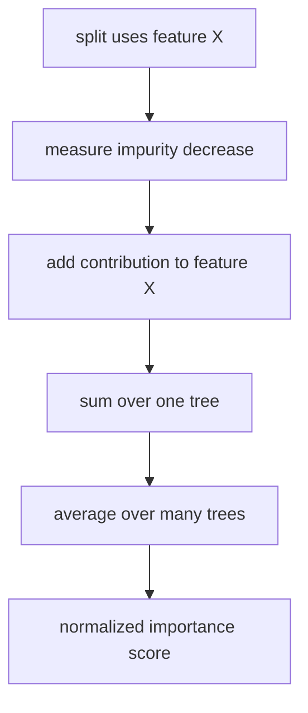
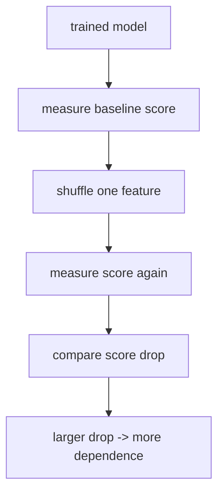

# P3-15.2 특징 중요도(feature importance)

P3-15.1에서는 랜덤포레스트(random forest)가 왜 여러 트리를 모아 더 안정적인 예측을 만들 수 있는지 보았습니다. 그러면 바로 다음 질문이 생깁니다.

`이 숲은 무엇을 중요하게 보고 판단했는가?`

이 질문이 바로 특징 중요도(feature importance)의 출발점입니다.

초심자 기준에서는 다음 한 문장으로 먼저 잡으면 충분합니다.

`특징 중요도는 모델이 어떤 특징을 더 자주, 더 크게 활용했는지 요약한 숫자이지만, 그 숫자를 곧바로 원인이나 진실의 순위라고 읽으면 위험하다.`

즉, 특징 중요도는 유용한 요약이지만, 해석의 함정도 함께 가진 도구입니다.

## 이 절의 범위

이 절은 다음 질문에 답합니다.

- 랜덤포레스트에서 특징 중요도는 어떻게 만들어지는가?
- `feature_importances_`는 무엇을 뜻하는가?
- impurity-based importance와 permutation importance는 어떻게 다른가?
- 왜 중요한 숫자처럼 보여도 오해를 만들 수 있는가?

이 절은 다음 내용은 깊게 다루지 않습니다.

- PDP(partial dependence plot), SHAP 같은 다른 해석 기법
- 인과 추론(causal inference) 관점의 중요도 해석
- 상관 특성이 매우 강한 실제 대규모 데이터셋의 해석 전략

이 절은 입문적으로 `숫자를 읽는 태도`를 만드는 데 집중합니다.

## 이 절의 목표

- 특징 중요도를 `모델 내부 사용량의 요약`으로 설명할 수 있습니다.
- impurity-based importance(MDI)와 permutation importance를 구분할 수 있습니다.
- 특징 중요도가 곧 인과관계(causality)나 진짜 원인 순위를 뜻하지 않는다는 점을 설명할 수 있습니다.
- 상관 특성(multicollinear or correlated features)과 high-cardinality feature가 왜 해석을 왜곡할 수 있는지 말할 수 있습니다.

## 왜 이 절이 필요한가

랜덤포레스트를 배우고 나면 초심자는 이런 기대를 갖기 쉽습니다.

- 숲이 잘 맞춘다.
- 숲 안에는 많은 트리가 있다.
- 그러면 이 모델은 무엇이 중요한지도 잘 말해 줄 것 같다.

이 기대는 절반만 맞습니다.

| 기대 | 실제로는 |
| --- | --- |
| 중요도 숫자가 크면 원인이다 | 모델이 많이 썼다는 뜻에 더 가깝다 |
| 중요도 숫자가 낮으면 쓸모없는 특징이다 | 다른 특징과 겹치거나 대체되었을 수 있다 |
| 중요도는 항상 공정한 순위다 | 계산 방식에 따라 편향이 생길 수 있다 |

즉, 15.2는 `중요도 숫자를 믿는 법`이 아니라 `중요도 숫자를 과신하지 않는 법`을 배우는 절입니다.

## 특징 중요도는 어떤 생각에서 나오나

scikit-learn 사용자 가이드는 트리에서 상위에 있는 decision node가 더 많은 샘플의 예측에 기여하고, split으로 impurity를 얼마나 줄였는지를 합쳐 상대적 중요도를 추정할 수 있다고 설명합니다. 이 아이디어를 여러 randomized tree에 대해 평균낸 것이 mean decrease in impurity, 즉 MDI입니다.

입문 수준에서는 다음처럼 이해하면 좋습니다.

`어떤 특징이 자주, 그리고 큰 분기 개선을 만들었다면 그 특징을 더 중요하게 본다.`

이 설명만 보면 매우 자연스러워 보입니다. 실제로도 빠르고 편리합니다. 하지만 여기에는 중요한 단서가 붙습니다.

`이 값은 모델이 학습 데이터 안에서 분기에 사용한 흔적을 요약한 것이다.`

즉, 중요도는 `모델 내부의 사용 기록`에 가깝지, 세상에서의 진짜 중요도나 원인의 크기를 바로 뜻하지는 않습니다.

## MDI(mean decrease in impurity)는 무엇인가

scikit-learn 문서는 tree ensemble의 특징 중요도를 impurity-based feature importance로 설명하고, 이를 여러 tree에 평균낸 것이 MDI라고 설명합니다.

초심자 기준으로는 다음 순서로 생각하면 충분합니다.

1. 트리의 각 분기에서 impurity가 얼마나 줄었는지 본다.
2. 그 분기를 만든 feature에 그 감소량을 배정한다.
3. 트리 전체에서 합친다.
4. 숲 전체에서 평균낸다.
5. 1이 되도록 정규화(normalize)한다.

이를 짧게 그리면 다음과 같습니다.



이 구조 덕분에 `feature_importances_`는 계산이 빠르고, 랜덤포레스트를 학습한 뒤 바로 볼 수 있습니다.

## 왜 상위 분기가 더 크게 작용하는가

scikit-learn 문서는 트리의 상위 분기에서 사용된 feature가 더 많은 입력 샘플의 최종 예측에 영향을 준다고 설명합니다. 그래서 같은 impurity 감소라도, 더 많은 샘플 흐름을 바꾼 분기가 중요도에 더 크게 반영될 수 있습니다.

이 감각을 초심자 문장으로 바꾸면 다음과 같습니다.

`트리 초반의 질문은 더 많은 사람을 나누고, 뒤쪽의 질문은 더 적은 사람만 나눈다. 그래서 초반 분기 feature가 전체 중요도에서 더 크게 보일 수 있다.`

## `feature_importances_`는 어떻게 읽어야 하나

API 문서는 `feature_importances_`를 impurity-based feature importances라고 설명합니다. 값은 양수이고 합은 1.0입니다.

입문 단계에서는 이렇게 읽으면 좋습니다.

| 숫자 모습 | 뜻 |
| --- | --- |
| 값이 크다 | 모델이 그 feature를 상대적으로 더 많이 활용했다 |
| 값이 작다 | 모델이 그 feature를 상대적으로 덜 활용했다 |
| 합이 1이다 | 절대 점수보다 상대 비중으로 읽어야 한다 |

여기서 중요한 것은 `상대 비중`이라는 점입니다.

예를 들어 중요도가:

- `visits = 0.45`
- `late_payment = 0.35`
- `support_calls = 0.20`

라면, 모델 내부 분기 기준에서는 `visits`가 가장 큰 역할을 했다고 읽을 수 있습니다. 하지만 이것이 곧 `방문 수가 가장 강한 원인이다`라는 뜻은 아닙니다.

## permutation importance는 왜 따로 필요한가

scikit-learn 문서는 impurity-based feature importance의 대안으로 permutation importance를 제시합니다. permutation importance는 특정 feature 값을 무작위로 섞었을 때 성능이 얼마나 나빠지는지를 봅니다.

즉, MDI가 `모델 내부 사용 기록`이라면, permutation importance는 `그 feature를 망가뜨렸을 때 실제 예측 성능이 얼마나 흔들리는가`에 더 가깝습니다.

두 방식을 비교하면 다음과 같습니다.

| 방식 | 핵심 질문 |
| --- | --- |
| MDI | 이 feature가 분기에서 얼마나 많이, 얼마나 크게 쓰였는가? |
| permutation importance | 이 feature를 섞어 버리면 모델 성능이 얼마나 떨어지는가? |

이 차이는 매우 중요합니다. 하나는 `모델 안에서의 사용 흔적`이고, 다른 하나는 `성능 의존도 검사`에 가깝기 때문입니다.

## permutation importance를 흐름으로 보기



이 흐름은 초심자에게 매우 유익합니다. 왜냐하면 중요도를 `숫자 속성`이 아니라 `성능 변화 실험`으로 다시 읽게 하기 때문입니다.

## 왜 impurity-based importance는 조심해야 하나

scikit-learn 사용자 가이드는 impurity-based feature importances에 두 가지 주요 문제가 있다고 경고합니다.

1. 학습 데이터에서 계산된 통계에 의존하므로, hold-out 데이터에서 일반화 성능의 중요도를 반드시 반영하지는 않는다.
2. unique value가 많은 high-cardinality feature를 선호할 수 있다.

초심자 기준에서는 다음처럼 바꾸어 말할 수 있습니다.

`MDI는 빠르고 편하지만, 훈련 데이터 안에서 분기를 잘게 만들기 쉬운 feature를 과대평가할 수 있다.`

예를 들어 고객 ID처럼 값 종류가 매우 많은 열이 있다면, 실제로는 일반화에 도움이 적어도 훈련 데이터 안에서는 분기를 잘게 나누기 쉬워 중요도가 커 보일 수 있습니다.

## 상관 특성이 있으면 왜 헷갈리는가

scikit-learn 예제는 multicollinear or correlated features에서는 permutation importance가 기대와 다르게 보일 수 있음을 보여 줍니다. 서로 비슷한 정보를 가진 feature가 여러 개 있으면, 하나를 섞어도 다른 feature가 대신 역할을 할 수 있기 때문입니다.

이 상황에서는 다음 오해가 생깁니다.

- test accuracy는 높다
- 그런데 어떤 feature의 permutation importance는 낮다
- 그러면 그 feature는 중요하지 않은가?

항상 그렇지는 않습니다.

`중요하지 않다`가 아니라 `다른 correlated feature가 대신 정보를 제공하고 있다`일 수 있습니다.

즉, 중요도 해석은 feature 하나만 보는 일이 아니라, feature들 사이의 관계를 함께 읽는 일입니다.

## Python 예제로 MDI 보기

이번 예제는 랜덤포레스트를 학습한 뒤 `feature_importances_`를 직접 읽어 보는 가장 작은 실습입니다.

- 문제 상황: iris 데이터에서 어떤 특징이 더 중요하게 쓰였는지 본다.
- 입력(input): iris의 4개 feature
- 정답(label): 품종 class
- 확인할 개념:
  - 중요도는 상대 비중이다
  - 값의 합은 1에 가깝다

```python
from sklearn.datasets import load_iris
from sklearn.model_selection import train_test_split
from sklearn.ensemble import RandomForestClassifier

iris = load_iris()
X, y = iris.data, iris.target
feature_names = iris.feature_names

X_train, X_test, y_train, y_test = train_test_split(
    X, y, test_size=0.3, random_state=42, stratify=y
)

model = RandomForestClassifier(n_estimators=200, random_state=42)
model.fit(X_train, y_train)

print("test accuracy:", round(model.score(X_test, y_test), 3))
print("feature importances:")

for name, score in zip(feature_names, model.feature_importances_):
    print(f"  {name:20} {score:.3f}")

print("sum:", round(model.feature_importances_.sum(), 3))
```

실행 결과 예시는 다음과 같습니다.

```text
test accuracy: 0.911
feature importances:
  sepal length (cm)    0.098
  sepal width (cm)     0.028
  petal length (cm)    0.444
  petal width (cm)     0.430
sum: 1.0
```

이 예제에서 읽어야 할 것은:

1. 중요도는 상대 비중으로 나온다.
2. petal length와 petal width가 이 모델에서 더 많이 쓰였다.
3. 이것은 `이 모델의 분기 사용 흔적`이지, 곧바로 인과 설명은 아니다.

## Python 예제로 permutation importance와 나란히 보기

이번에는 같은 모델에 대해 permutation importance를 같이 봅니다.

- 확인할 개념:
  - MDI와 permutation importance는 같은 값을 내놓지 않는다.
  - 두 숫자가 다르면 계산 방식이 다른 것임을 먼저 떠올려야 한다.

```python
from sklearn.datasets import load_iris
from sklearn.model_selection import train_test_split
from sklearn.ensemble import RandomForestClassifier
from sklearn.inspection import permutation_importance

iris = load_iris()
X, y = iris.data, iris.target
feature_names = iris.feature_names

X_train, X_test, y_train, y_test = train_test_split(
    X, y, test_size=0.3, random_state=42, stratify=y
)

model = RandomForestClassifier(n_estimators=200, random_state=42)
model.fit(X_train, y_train)

perm = permutation_importance(
    model,
    X_test,
    y_test,
    n_repeats=20,
    random_state=42
)

print("feature".ljust(20), "MDI".rjust(8), "perm_mean".rjust(12))
for i, name in enumerate(feature_names):
    mdi = model.feature_importances_[i]
    pmean = perm.importances_mean[i]
    print(f"{name:20} {mdi:8.3f} {pmean:12.3f}")
```

실행 결과 예시는 다음과 같습니다.

```text
feature                   MDI    perm_mean
sepal length (cm)       0.098        0.011
sepal width (cm)        0.028        0.000
petal length (cm)       0.444        0.222
petal width (cm)        0.430        0.189
```

이 결과가 뜻하는 바는 다음과 같습니다.

- 두 방식은 순위가 비슷할 수도 있고 다를 수도 있습니다.
- 같은 feature라도 `분기에서 많이 쓰였는가`와 `섞었을 때 성능이 얼마나 떨어지는가`는 다른 질문입니다.
- 따라서 하나의 중요도 숫자만 보고 해석을 끝내면 위험합니다.

## high-cardinality feature를 조심해야 하는 이유

트리 계열은 unique value가 많은 feature에 쉽게 반응할 수 있습니다. 이런 feature는 훈련 데이터 안에서 분기를 더 세밀하게 만들 기회를 많이 주기 때문입니다.

예를 들어:

- 고객 ID
- 주문 번호
- 타임스탬프 원본

같은 열은 실제 업무 의미보다 `분기 후보가 너무 많다`는 이유로 중요해 보일 수 있습니다.

따라서 중요도를 볼 때는 항상 묻는 편이 안전합니다.

`이 열은 정말 의미 있는 변수인가, 아니면 그냥 값을 잘게 나누기 쉬운 열인가?`

## 상관 특성(correlated features)을 조심해야 하는 이유

예를 들어 `monthly_spend`와 `yearly_spend / 12`처럼 거의 같은 뜻의 열이 둘 다 들어 있다면, 모델은 둘 중 하나를 주로 쓰고 다른 하나는 덜 쓸 수 있습니다.

그 결과:

- 한쪽 중요도는 높고
- 다른 쪽 중요도는 낮게

보일 수 있습니다.

하지만 이것이 낮은 쪽이 쓸모없다는 뜻은 아닙니다. 단지 정보가 겹쳐서 대체되었을 수 있습니다.

이 때문에 중요도 해석은 늘 다음 질문과 함께 가야 합니다.

- 비슷한 뜻의 feature가 여러 개 있는가?
- 숫자가 큰 feature가 정말 독립적으로 중요한가?
- 숫자가 낮은 feature가 다른 feature에 가려진 것은 아닌가?

## 실무에서 어떻게 읽으면 좋은가

특징 중요도는 다음처럼 쓰는 편이 보수적입니다.

| 좋은 사용법 | 위험한 사용법 |
| --- | --- |
| 모델이 주로 어떤 신호를 보는지 점검 | 중요도 순위를 원인 순위로 단정 |
| 이상한 열이 상위에 올라왔는지 확인 | 숫자가 낮은 feature를 즉시 삭제 |
| permutation 결과와 함께 교차 확인 | 훈련 데이터 기반 MDI 하나만 보고 결론 |
| 상관 관계와 데이터 의미를 함께 검토 | 숫자만 보고 정책 변경 |

즉, 중요도는 `설명 도구의 시작점`이지 `최종 판결문`이 아닙니다.

## 이 절에서 기억할 관점

- 특징 중요도는 모델이 무엇을 봤는지 요약하는 유용한 도구입니다.
- MDI는 분기 사용과 impurity 감소를 평균낸 내부 요약입니다.
- permutation importance는 feature를 섞었을 때 성능이 얼마나 떨어지는지 보는 외부 점검입니다.
- 중요도 숫자는 곧바로 인과관계나 원인 순위를 뜻하지 않습니다.
- high-cardinality feature와 correlated feature는 해석을 왜곡할 수 있습니다.

## 체크리스트

- `feature_importances_`를 상대 비중으로 읽을 수 있는가?
- MDI와 permutation importance가 다른 질문에 답한다는 점을 설명할 수 있는가?
- 중요도 숫자를 원인 순위로 단정하면 왜 위험한지 말할 수 있는가?
- 값 종류가 많은 열과 상관 feature가 해석을 왜곡할 수 있다는 점을 이해했는가?
- 중요도 해석은 모델 점검의 출발점이지 종착점이 아니라는 점을 알고 있는가?

## 출처와 참고 자료

- scikit-learn developers, `1.11. Ensembles: Gradient boosting, random forests, bagging, voting, stacking`, scikit-learn User Guide, 확인 날짜: 2026-06-27. [https://scikit-learn.org/stable/modules/ensemble.html](https://scikit-learn.org/stable/modules/ensemble.html){: target="_blank" rel="noopener noreferrer" }
- scikit-learn developers, `RandomForestClassifier`, scikit-learn API Reference, 확인 날짜: 2026-06-27. [https://scikit-learn.org/stable/modules/generated/sklearn.ensemble.RandomForestClassifier.html](https://scikit-learn.org/stable/modules/generated/sklearn.ensemble.RandomForestClassifier.html){: target="_blank" rel="noopener noreferrer" }
- scikit-learn developers, `Permutation feature importance`, scikit-learn User Guide, 확인 날짜: 2026-06-27. [https://scikit-learn.org/stable/modules/permutation_importance.html](https://scikit-learn.org/stable/modules/permutation_importance.html){: target="_blank" rel="noopener noreferrer" }
- Gilles Louppe, *Understanding Random Forests: From Theory to Practice*, PhD Thesis, University of Liege, 2014. [https://arxiv.org/abs/1407.7502](https://arxiv.org/abs/1407.7502){: target="_blank" rel="noopener noreferrer" }
