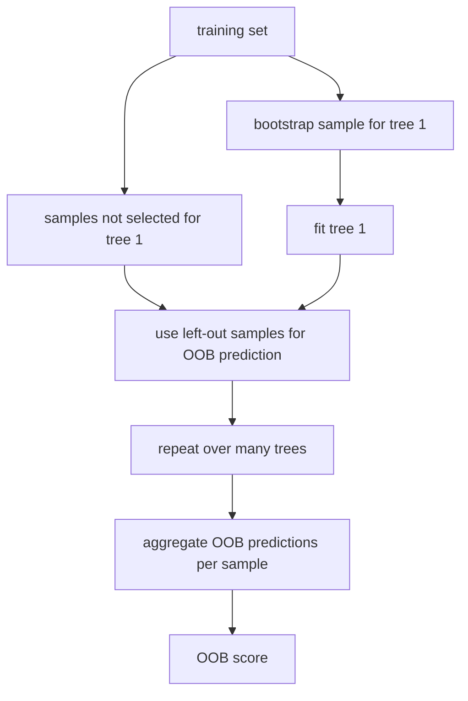
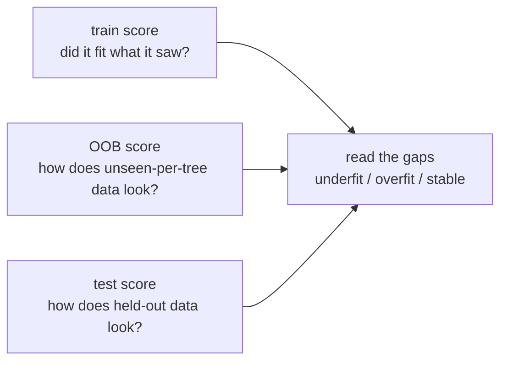

# P3-15.3 OOB(out-of-bag)와 랜덤포레스트 점검

P3-15.1에서는 랜덤포레스트(random forest)가 왜 여러 트리를 모아 더 안정적인 예측을 만들 수 있는지 보았습니다. P3-15.2에서는 그 숲이 무엇을 중요하게 보았는지, 즉 특징 중요도(feature importance)를 조심해서 읽는 법을 보았습니다.

그러면 이제 남는 질문은 이것입니다.

`이 숲이 정말 괜찮게 학습되고 있는지는 어떻게 점검할 수 있을까?`

랜덤포레스트에서는 이 질문에 대해 초심자가 가장 먼저 만나는 손잡이 중 하나가 OOB(out-of-bag)입니다.

초심자 기준에서는 다음 한 문장으로 먼저 잡으면 충분합니다.

`OOB는 bootstrap에 뽑히지 않은 샘플을 이용해, 랜덤포레스트가 학습 중에 스스로를 거칠게 점검하는 내부 검증 방식이다.`

즉, OOB는 `새로운 모델`이 아니라, 랜덤포레스트를 읽고 점검하는 방법입니다.

## 이 절의 범위

이 절은 다음 질문에 답합니다.

- OOB(out-of-bag)는 왜 생기는가?
- bootstrap과 OOB는 어떤 관계인가?
- `oob_score=True`는 무엇을 뜻하는가?
- OOB 점수는 train accuracy, validation score, test score와 어떻게 다른가?
- OOB를 어디까지 믿고, 어디서 멈춰야 하는가?

이 절은 다음 내용은 깊게 다루지 않습니다.

- 교차검증(cross-validation)의 모든 변형
- 확률 보정(calibration)과 threshold 조정
- 그래디언트 부스팅의 OOB 성격 차이

교차검증과 모델 비교의 더 넓은 문맥은 뒤의 Chapter 16과 후속 프로젝트 Part에서 다시 이어집니다.

## 이 절의 목표

- OOB를 `bootstrap에 빠진 샘플을 이용한 내부 일반화 추정`으로 설명할 수 있습니다.
- 왜 `bootstrap=True`일 때만 OOB가 가능한지 말할 수 있습니다.
- OOB 점수와 test score를 같은 것으로 단정하면 왜 위험한지 설명할 수 있습니다.
- 랜덤포레스트 실험에서 `train / OOB / test`를 함께 읽는 기본 태도를 가질 수 있습니다.

## 왜 이 절이 필요한가

랜덤포레스트를 처음 쓰면 초심자는 보통 이런 흐름을 겪습니다.

1. 일단 학습이 잘 된다.
2. train accuracy가 높게 나온다.
3. 그러면 모델이 좋은 것처럼 느껴진다.

하지만 이 흐름에는 큰 빈칸이 있습니다.

`훈련에 잘 맞는 것`과 `처음 보는 데이터에도 잘 맞는 것`은 다를 수 있습니다.

랜덤포레스트는 bootstrap을 쓰기 때문에, 학습 과정 안에서 자연스럽게 `이번 트리가 보지 않은 샘플`이 생깁니다. OOB는 바로 이 틈을 활용합니다.

즉, 15.3은 `숲이 낸 점수 하나를 믿는 법`이 아니라 `숲의 상태를 여러 점수로 점검하는 법`을 배우는 절입니다.

## OOB는 왜 생기는가

scikit-learn 사용자 가이드는 random forest에서 각 트리가 bootstrap sample, 즉 복원추출(with replacement)한 샘플로 만들어진다고 설명합니다. 이렇게 복원추출을 하면 어떤 샘플은 한 트리에 여러 번 들어가고, 어떤 샘플은 그 트리 학습에서 아예 빠집니다.

그 빠진 샘플이 바로 out-of-bag sample입니다.

초심자 기준에서는 다음처럼 읽으면 좋습니다.

- 한 트리는 전체 훈련 데이터를 다 보지 않는다.
- 그래서 `그 트리가 보지 않은 훈련 샘플`이 생긴다.
- 그 샘플로 그 트리를 부분적으로 점검할 수 있다.

즉, OOB는 bootstrap이 만든 부산물이고, 랜덤포레스트는 그 부산물을 점검 자원으로 다시 사용합니다.

## bootstrap과 OOB의 관계

한 장면으로 그리면 다음과 같습니다.



이 그림에서 중요한 점은 OOB가 `별도의 추가 데이터셋`이 아니라는 것입니다. 여전히 훈련 세트 안의 샘플이지만, 특정 트리 입장에서는 `보지 않은 샘플`이었다는 점이 중요합니다.

## `oob_score=True`는 무엇을 뜻하는가

scikit-learn API 문서는 `oob_score`를 `out-of-bag samples를 사용해 generalization score를 추정할지`를 정하는 옵션으로 설명합니다. 그리고 이 기능은 `bootstrap=True`일 때만 사용할 수 있다고 설명합니다.

입문 수준에서는 다음처럼 해석하면 충분합니다.

- `bootstrap=True`: 각 트리가 복원추출 샘플로 학습된다.
- `oob_score=True`: 빠진 샘플을 모아 내부 점검 점수를 계산한다.

즉, OOB는 bootstrap이 없으면 성립하지 않습니다. 모든 트리가 항상 전체 데이터를 다 본다면, `보지 않은 샘플`이라는 개념 자체가 사라지기 때문입니다.

## OOB는 어떤 점수인가

API 문서는 `oob_score_`를 training dataset에 대한 out-of-bag estimate로 얻은 score라고 설명합니다.

여기서 초심자가 조심해야 할 점은 두 가지입니다.

1. OOB는 훈련 데이터 바깥의 완전한 새 데이터 점수가 아니다.
2. 그렇다고 단순한 train accuracy도 아니다.

즉, OOB는 둘 사이에 있는 `내부 일반화 추정치`라고 읽는 것이 가장 안전합니다.

| 점수 | 무엇을 기준으로 하나 |
| --- | --- |
| train accuracy | 학습에 직접 사용된 데이터에 얼마나 잘 맞았는가 |
| OOB score | 각 샘플을 보지 않은 트리들의 예측으로 얼마나 맞았는가 |
| test score | 완전히 따로 떼어 둔 데이터에 얼마나 맞았는가 |

그래서 OOB는 train score보다 현실적일 수 있지만, test score를 완전히 대체한다고 단정하면 위험합니다.

## OOB를 왜 편리하다고 느끼는가

scikit-learn 문서와 예제 설명은 OOB error가 random forest를 학습시키는 동안 검증 추정을 함께 얻을 수 있게 해 준다고 설명합니다.

초심자 관점에서 이 장점은 매우 실용적입니다.

- 작은 실험을 빠르게 반복할 수 있습니다.
- train score만 보는 실수를 줄일 수 있습니다.
- 트리 수(`n_estimators`)를 늘릴 때 상태가 어떻게 바뀌는지 빨리 점검할 수 있습니다.

즉, OOB는 `정식 평가의 종착점`이라기보다 `빠른 내부 점검판`에 가깝습니다.

## 그렇다면 OOB만 보면 충분한가

여기서 반드시 한 번 멈춰야 합니다.

`아니다. 보통은 OOB만으로 끝내지 않는다.`

이유는 간단합니다.

- OOB는 bootstrap 구조에 의존한 내부 추정입니다.
- 실제 배포 상황의 새 데이터와 완전히 같은 조건은 아닙니다.
- 데이터가 작거나, 클래스 불균형이 있거나, 평가 기준이 민감하면 따로 떼어 둔 validation/test 점수가 여전히 중요합니다.

초심자에게는 다음 기준이 안전합니다.

| 상황 | OOB의 역할 |
| --- | --- |
| 빠른 실험 초반 | 매우 유용한 내부 점검 |
| 하이퍼파라미터 대략 탐색 | 참고 지표로 유용 |
| 최종 성능 보고 | test/validation과 함께 봐야 함 |
| 배포 전 최종 판단 | OOB 하나로 끝내지 않음 |

## train / OOB / test를 함께 읽는 이유

랜덤포레스트 점검에서는 세 숫자를 같이 놓고 보는 습관이 중요합니다.



예를 들어:

- train은 매우 높고 OOB와 test가 많이 낮으면: 과적합(overfitting)을 의심할 수 있습니다.
- train, OOB, test가 모두 비슷하게 낮으면: 표현력 부족이나 데이터 한계를 의심할 수 있습니다.
- train은 높고 OOB와 test가 비슷하게 따라오면: 비교적 안정적인 상태로 읽을 수 있습니다.

이 절의 핵심은 특정 숫자 하나보다 `숫자 사이의 간격`입니다.

## Python 예제로 OOB 점수 보기

이번 예제는 유방암(breast cancer) 분류 데이터에서 train / OOB / test를 같이 출력해 보는 작은 실습입니다.

- 문제 상황: 랜덤포레스트가 학습에 잘 맞는지, 내부 점검과 별도 test에서도 비슷하게 가는지 본다.
- 입력(input): 30개 연속형 특징
- 정답(label): 악성/양성 class
- 확인할 개념:
  - OOB는 `oob_score_`로 읽는다
  - OOB는 train과 test 사이에서 내부 점검 역할을 한다
  - 세 점수의 간격을 같이 본다

```python
from sklearn.datasets import load_breast_cancer
from sklearn.model_selection import train_test_split
from sklearn.ensemble import RandomForestClassifier

X, y = load_breast_cancer(return_X_y=True)

X_train, X_test, y_train, y_test = train_test_split(
    X, y, test_size=0.3, random_state=42, stratify=y
)

model = RandomForestClassifier(
    n_estimators=300,
    bootstrap=True,
    oob_score=True,
    random_state=42
)
model.fit(X_train, y_train)

print("train accuracy:", round(model.score(X_train, y_train), 3))
print("oob score     :", round(model.oob_score_, 3))
print("test accuracy :", round(model.score(X_test, y_test), 3))
print("n_estimators  :", model.n_estimators)
```

실행 결과 예시는 다음과 비슷하게 나올 수 있습니다. 실제 값은 데이터 분할, 라이브러리 버전, 난수 설정에 따라 조금 달라질 수 있습니다.

```text
train accuracy: 1.0
oob score     : 0.96
test accuracy : 0.947
n_estimators  : 300
```

이 결과를 읽는 순서는 다음과 같습니다.

1. train accuracy가 1.0이므로, 숲은 훈련 세트를 매우 잘 설명했다.
2. 그러나 train만 보면 너무 낙관적일 수 있다.
3. OOB 0.96과 test 0.947이 크게 벌어지지 않으므로, 이 실험에서는 숲이 완전히 허상만 학습한 것은 아니라는 신호를 준다.

물론 이것만으로 모델이 충분히 좋다고 확정할 수는 없습니다. 하지만 `train 1.0`이라는 숫자를 바로 믿지 않게 해 주는 점에서 OOB는 매우 유용합니다.

## Python 예제로 트리 수가 늘 때 OOB가 어떻게 보이는지 보기

이번 예제는 `n_estimators`를 바꾸며 OOB와 test가 어떻게 움직이는지 보는 실습입니다.

- 확인할 개념:
  - 트리 수가 늘면 보통 OOB가 어느 정도 안정되는 방향을 볼 수 있다
  - 무조건 트리를 많이 늘린다고 모든 문제가 해결되지는 않는다

```python
from sklearn.datasets import load_breast_cancer
from sklearn.model_selection import train_test_split
from sklearn.ensemble import RandomForestClassifier

X, y = load_breast_cancer(return_X_y=True)

X_train, X_test, y_train, y_test = train_test_split(
    X, y, test_size=0.3, random_state=42, stratify=y
)

for n_trees in [10, 50, 100, 300]:
    model = RandomForestClassifier(
        n_estimators=n_trees,
        bootstrap=True,
        oob_score=True,
        random_state=42
    )
    model.fit(X_train, y_train)

    print(
        f"trees={n_trees:3d} | "
        f"oob={model.oob_score_:.3f} | "
        f"test={model.score(X_test, y_test):.3f}"
    )
```

실행 결과 예시는 다음과 비슷하게 나올 수 있습니다. 실제 값은 데이터 분할, 라이브러리 버전, 난수 설정에 따라 조금 달라질 수 있습니다.

```text
trees= 10 | oob=0.942 | test=0.947
trees= 50 | oob=0.957 | test=0.947
trees=100 | oob=0.960 | test=0.947
trees=300 | oob=0.960 | test=0.947
```

이 예제에서 초심자가 읽어야 할 것은:

- 트리 수가 너무 적을 때는 OOB가 다소 흔들릴 수 있습니다.
- 어느 정도 이후에는 OOB가 안정되는 모습이 보일 수 있습니다.
- 하지만 test 점수가 같은 수준에 머물 수 있으므로, `트리를 계속 늘리면 성능이 계속 오른다`고 읽으면 안 됩니다.

즉, OOB는 `언제쯤 숲이 대체로 안정되는가`를 보는 데 도움을 줄 수 있지만, 그 자체가 성능 보증서는 아닙니다.

## OOB를 해석할 때 자주 생기는 오해

초심자에게 특히 자주 생기는 오해는 다음과 같습니다.

| 오해 | 더 안전한 해석 |
| --- | --- |
| OOB가 높으니 배포해도 된다 | OOB는 내부 점검일 뿐, 최종 검증은 따로 필요하다 |
| OOB가 test와 비슷하니 항상 같다 | 이번 실험에서 비슷했을 뿐이다 |
| OOB가 있으면 validation split은 필요 없다 | 상황에 따라 여전히 필요하다 |
| OOB가 낮으면 랜덤포레스트는 쓸모없다 | 데이터 품질, 특징 표현, 하이퍼파라미터를 함께 봐야 한다 |

중요한 것은 `OOB를 과소평가하지도, 과대평가하지도 않는 태도`입니다.

## 실무에서 어떻게 쓰는가

실무 흐름으로 바꾸면 OOB는 보통 다음처럼 읽을 수 있습니다.

1. baseline 모델로 랜덤포레스트를 빠르게 학습한다.
2. train score와 OOB score를 함께 본다.
3. 너무 낙관적인 train score만 보고 멈추지 않는다.
4. 필요하면 validation/test로 다시 확인한다.
5. 그 다음에야 특징 중요도나 threshold 같은 해석/조정을 본다.

즉, OOB는 `점검 순서`를 바로잡아 주는 장치입니다.

이 절의 다음 장면은 자연스럽게 그래디언트 부스팅(gradient boosting)입니다. 랜덤포레스트가 `여러 트리를 병렬적으로 모아 흔들림을 줄이는 방식`이었다면, Chapter 16의 부스팅은 `이전 오류를 다음 트리가 순차적으로 보정하는 방식`으로 넘어갑니다.

## 이 절에서 기억할 관점

- OOB는 bootstrap에 빠진 샘플을 활용한 내부 점검 방식입니다.
- `oob_score=True`는 bootstrap 기반 랜덤포레스트에서만 의미가 있습니다.
- OOB는 train score보다 현실적일 수 있지만, test score를 완전히 대체하지는 않습니다.
- 랜덤포레스트 점검에서는 `train / OOB / test`를 함께 읽는 태도가 중요합니다.
- OOB는 빠른 실험의 손잡이로 매우 유용하지만, 최종 배포 판단의 유일한 근거는 아닙니다.

## 체크리스트

- OOB가 bootstrap에서 자연스럽게 생긴다는 점을 설명할 수 있는가?
- 왜 `bootstrap=True`일 때만 OOB를 쓸 수 있는지 말할 수 있는가?
- train accuracy와 OOB score가 왜 다른지 설명할 수 있는가?
- OOB가 높다고 바로 최종 성능으로 단정하면 왜 위험한지 알고 있는가?
- 랜덤포레스트를 점검할 때 train / OOB / test를 함께 보아야 한다는 점을 이해했는가?

## 출처와 참고 자료

- scikit-learn developers, `1.11. Ensembles: Gradient boosting, random forests, bagging, voting, stacking`, scikit-learn User Guide, 확인 날짜: 2026-06-27. [https://scikit-learn.org/stable/modules/ensemble.html](https://scikit-learn.org/stable/modules/ensemble.html){: target="_blank" rel="noopener noreferrer" }
- scikit-learn developers, `RandomForestClassifier`, scikit-learn API Reference, 확인 날짜: 2026-06-27. [https://scikit-learn.org/stable/modules/generated/sklearn.ensemble.RandomForestClassifier.html](https://scikit-learn.org/stable/modules/generated/sklearn.ensemble.RandomForestClassifier.html){: target="_blank" rel="noopener noreferrer" }
