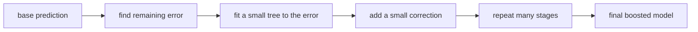
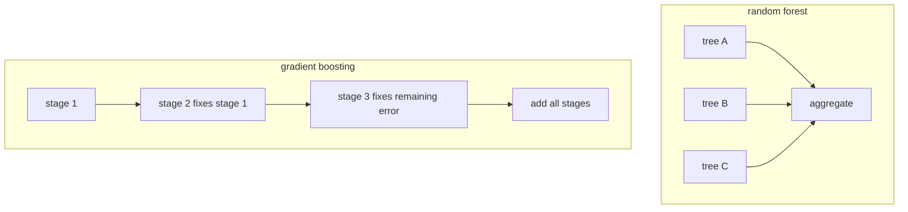

# P3-16.1 그래디언트 부스팅(gradient boosting)

P3-15에서는 랜덤포레스트(random forest)를 보았습니다. 랜덤포레스트는 여러 트리를 `병렬적으로` 만들고, 그 결과를 모아 흔들림을 줄이려는 모델이었습니다.

그러면 다음 질문이 자연스럽게 나옵니다.

`여러 트리를 그냥 모으는 대신, 앞선 트리의 실수를 다음 트리가 바로 보정하게 만들 수는 없을까?`

이 질문이 그래디언트 부스팅(gradient boosting)의 출발점입니다.

초심자 기준에서는 다음 한 문장으로 먼저 잡으면 충분합니다.

`그래디언트 부스팅은 앞 단계 모델이 남긴 오차를 다음 작은 트리가 순서대로 줄여 가도록 쌓는 앙상블 방식이다.`

즉, 랜덤포레스트가 `여러 의견의 평균`에 가깝다면, 그래디언트 부스팅은 `이전 답안의 틀린 부분을 다음 답안이 고쳐 쓰는 흐름`에 더 가깝습니다.

## 이 절의 범위

이 절은 다음 질문에 답합니다.

- 그래디언트 부스팅은 왜 `순차적(sequential)`이라고 부르는가?
- `weak learner`, `residual`, `additive model`은 어떤 뜻으로 쓰이는가?
- 랜덤포레스트와 그래디언트 부스팅의 사고방식은 어떻게 다른가?
- `n_estimators`와 `learning_rate`는 왜 함께 읽어야 하는가?

이 절은 다음 내용은 깊게 다루지 않습니다.

- 미분식의 엄밀한 전개
- 분류 손실(loss) 함수의 세부 수학
- XGBoost, LightGBM, CatBoost 같은 구현 차이
- early stopping과 정규화(regularization)의 세부 전략

이 절은 입문적으로 `부스팅이 무엇을 하려는 방식인가`를 이해하는 데 집중합니다. 성능과 위험은 P3-16.2에서 이어서 다룹니다.

## 이 절의 목표

- 그래디언트 부스팅을 `오차를 순차적으로 줄이는 앙상블`로 설명할 수 있습니다.
- weak learner가 왜 보통 작은 트리로 설명되는지 말할 수 있습니다.
- residual을 `이전 단계가 아직 설명하지 못한 부분`으로 설명할 수 있습니다.
- `learning_rate`와 `n_estimators`를 함께 읽어야 하는 이유를 말할 수 있습니다.

## 왜 이 절이 필요한가

랜덤포레스트를 이해한 직후에는 초심자가 이런 생각을 하기 쉽습니다.

- 트리를 여러 개 모으는 것은 알겠다.
- 그러면 앙상블은 다 비슷한 것 아닌가?

하지만 여기서 큰 차이가 갈립니다.

| 질문 | 랜덤포레스트 | 그래디언트 부스팅 |
| --- | --- | --- |
| 트리를 어떻게 만드나 | 여러 트리를 서로 다르게 만들어 함께 본다 | 앞선 트리의 오차를 다음 트리가 받는다 |
| 핵심 목적 | 분산(variance) 감소, 안정성 | 편향(bias) 감소, 오차 보정 |
| 학습 흐름 | 병렬적(parallel) | 순차적(sequential) |

즉, 16.1은 `트리를 여러 개 쓴다`는 공통점 뒤에 있는 전혀 다른 학습 철학을 구분하는 절입니다.

## 부스팅(boosting)은 어떤 큰 틀인가

scikit-learn 사용자 가이드는 부스팅을 약한 학습기(weak learner)를 순차적으로 결합해 더 강한 예측기를 만드는 대표적 앙상블 방식으로 설명합니다. 그 안에서 gradient boosting은 이 아이디어를 미분 가능한 손실(loss)까지 일반화한 방식입니다.

초심자 수준에서는 먼저 이렇게 이해하면 좋습니다.

`처음부터 완벽한 큰 모델 하나를 만들기보다, 작은 모델을 차례대로 더해 가며 틀린 부분을 줄여 나가자.`

즉, 그래디언트 부스팅은 `한 번에 정답을 찍는 모델`보다는 `조금씩 수정하며 다가가는 모델`로 이해하는 편이 쉽습니다.

## 왜 순차적(sequential)이라고 부르는가

scikit-learn 문서는 gradient boosted trees를 순차적으로 트리를 쌓는 방식으로 설명합니다. 각 단계의 트리는 앞선 단계의 예측 결과를 바탕으로 추가됩니다.

이 점이 랜덤포레스트와 가장 크게 다릅니다.

- 랜덤포레스트에서는 tree 1이 tree 2의 실수를 직접 알지 못합니다.
- 그래디언트 부스팅에서는 stage 2가 stage 1의 남은 오차를 보고 들어옵니다.

즉, 그래디언트 부스팅은 `다음 단계가 이전 단계를 안다`는 점에서 순차적입니다.

## 한 장면으로 먼저 보기



이 그림에서 핵심은 `새 트리가 처음부터 전체 문제를 다시 푸는 것이 아니라, 남은 오차에 반응한다`는 점입니다.

## residual은 무엇인가

회귀(regression) 문맥에서 residual은 보통 다음처럼 읽을 수 있습니다.

`실제값 - 현재 예측값`

예를 들어 실제값이 `120`인데 현재 모델이 `100`을 예측했다면 residual은 `20`입니다. 반대로 실제값이 `80`인데 현재 모델이 `95`를 예측했다면 residual은 `-15`입니다.

초심자 기준에서는 수학식보다 다음 직관이 더 중요합니다.

`residual은 모델이 아직 설명하지 못한 남은 부분이다.`

그래디언트 부스팅은 바로 이 남은 부분을 계속 줄여 나가려 합니다.

## additive model은 무엇을 뜻하나

scikit-learn 문서는 gradient boosting regressor를 additive model로 설명합니다. 이는 최종 예측이 여러 단계 모델의 출력을 더해 가며 만들어진다는 뜻입니다.

입문적으로는 다음처럼 읽으면 충분합니다.

1. 처음에는 아주 단순한 기본 예측을 둔다.
2. 다음 단계 트리가 작은 보정값을 만든다.
3. 그 보정값을 기존 예측에 더한다.
4. 다시 남은 오차를 본다.
5. 이 과정을 반복한다.

즉, 그래디언트 부스팅은 `작은 보정의 누적`입니다.

## weak learner는 왜 작은 트리로 설명되나

scikit-learn 문서는 gradient boosting 문맥에서 weak learner를 보통 고정된 크기의 regression tree로 설명합니다. 예제에서는 decision stump처럼 매우 작은 트리를 약한 학습기의 예로 자주 듭니다.

여기서 weak learner를 `무능한 모델`로 이해하면 곤란합니다. 더 정확한 해석은 다음과 같습니다.

`한 번에 전체 문제를 해결하려 하지 않고, 한 단계에서 작은 수정만 담당하는 모델`

왜 작은 트리를 쓰는가를 초심자 기준으로 바꾸면:

- 단계별 역할이 더 분명해집니다.
- 한 단계가 너무 과하게 전체를 외우는 것을 줄일 수 있습니다.
- 여러 단계가 차곡차곡 보정하는 구조와 잘 맞습니다.

## 랜덤포레스트와 그래디언트 부스팅의 차이

두 모델 모두 트리를 여러 개 쓰지만, 작동 철학은 다릅니다.



이 차이를 짧게 요약하면 다음과 같습니다.

- 랜덤포레스트: `여러 독립 의견을 모은다`
- 그래디언트 부스팅: `이전 답을 다음 답이 고친다`

이 대비는 앞으로 성능, 튜닝 민감성, 과적합 위험을 읽는 데 매우 중요합니다.

## 작은 숫자 예제로 보정 흐름 보기

이번 예제는 회귀 관점에서 `보정이 누적된다`는 감각만 익히기 위한 장난감 예제입니다.

- 문제 상황: 현재 예측이 실제값과 얼마나 다른지 보고, 다음 단계가 작은 보정을 더한다.
- 입력(input): 현재 예측과 실제값
- 기대 출력(output): 단계별 residual과 업데이트된 예측
- 확인할 개념:
  - residual은 남은 오차다
  - 다음 단계는 residual을 줄이는 방향으로 움직인다
  - learning rate는 한 번에 얼마나 고칠지 정한다

```python
actual = [120, 110, 90, 80]
pred_stage0 = [100, 100, 100, 100]

residual_stage1 = [a - p for a, p in zip(actual, pred_stage0)]
tree1_correction = [15, 10, -10, -15]
learning_rate = 0.1

pred_stage1 = [
    p + learning_rate * c
    for p, c in zip(pred_stage0, tree1_correction)
]

residual_stage2 = [a - p for a, p in zip(actual, pred_stage1)]

print("actual           :", actual)
print("stage0 prediction:", pred_stage0)
print("stage1 residual  :", residual_stage1)
print("tree1 correction :", tree1_correction)
print("stage1 prediction:", [round(x, 1) for x in pred_stage1])
print("stage2 residual  :", [round(x, 1) for x in residual_stage2])
```

실행 결과는 다음과 같습니다.

```text
actual           : [120, 110, 90, 80]
stage0 prediction: [100, 100, 100, 100]
stage1 residual  : [20, 10, -10, -20]
tree1 correction : [15, 10, -10, -15]
stage1 prediction: [101.5, 101.0, 99.0, 98.5]
stage2 residual  : [18.5, 9.0, -9.0, -18.5]
```

이 예제에서 초심자가 읽어야 할 것은:

1. 첫 예측은 단순해서 오차가 큽니다.
2. 다음 단계는 residual 방향을 따라 작은 보정을 더합니다.
3. `learning_rate = 0.1`이라서 correction을 한 번에 다 쓰지 않고 조금만 반영합니다.
4. 그래서 residual이 즉시 0이 되지 않고, 여러 단계가 이어질 여지가 남습니다.

즉, 그래디언트 부스팅은 `큰 수정 한 번`보다 `작은 수정 여러 번`에 가깝습니다.

## learning_rate는 왜 중요한가

scikit-learn 문서는 learning rate를 shrinkage로 설명합니다. 각 weak learner의 기여를 축소해서 반영하는 값이며, 작은 learning rate를 쓰면 더 많은 weak learner가 필요하다고 설명합니다.

초심자 기준에서는 이렇게 읽으면 좋습니다.

- `learning_rate`가 크다: 한 단계 correction을 더 세게 반영한다
- `learning_rate`가 작다: 한 단계 correction을 더 약하게 반영한다

따라서 `learning_rate`는 단독으로 읽지 않고 `n_estimators`와 함께 읽어야 합니다.

| 설정 | 직관 |
| --- | --- |
| 큰 learning_rate + 적은 트리 | 빨리 움직이지만 과하게 흔들릴 수 있다 |
| 작은 learning_rate + 많은 트리 | 천천히 움직이지만 더 세밀하게 맞출 수 있다 |

이 때문에 부스팅에서는 `몇 단계 보정할지`와 `한 단계에서 얼마나 고칠지`가 함께 움직입니다.

## n_estimators는 무엇을 뜻하나

scikit-learn 문서는 `n_estimators`를 boosting process의 반복 횟수, 즉 fit할 weak learner의 수로 설명합니다.

랜덤포레스트에서 `n_estimators`가 `숲의 나무 수`였다면, 그래디언트 부스팅에서는 `몇 번의 보정 단계를 둘 것인가`에 더 가깝습니다.

초심자 기준으로는 이렇게 읽으면 좋습니다.

- 랜덤포레스트: 나무 수를 늘리면 더 많은 의견을 모은다
- 그래디언트 부스팅: 단계를 늘리면 더 많은 수정 기회를 준다

즉, 같은 `n_estimators`라도 두 모델에서 감각이 다릅니다.

## 왜 부스팅은 표 형식 데이터에서 자주 강한가

scikit-learn 사용자 가이드는 gradient-boosted trees와 histogram-based gradient boosting이 실무에서 자주 강한 성능 후보임을 보여 줍니다. 특히 표 형식(tabular) 데이터에서 강력한 기준선(baseline)이나 상위 성능 후보로 자주 언급됩니다.

초심자 관점에서 그 이유를 직관적으로 정리하면:

- 수치형, 범주형 변환 뒤의 표 데이터를 잘 다룹니다.
- 이전 단계 오차를 직접 겨냥해 보정합니다.
- 작은 비선형 패턴을 단계적으로 쌓을 수 있습니다.

그래서 많은 실무 장면에서 `선형 모델보다 더 강한 후보`, `랜덤포레스트보다 더 높은 성능 후보`로 자주 검토됩니다.

하지만 이 강점은 동시에 더 높은 튜닝 민감성과 과적합 위험을 함께 가져올 수 있습니다. 이 부분은 P3-16.2에서 이어집니다.

## 실무에서 어떤 장면으로 떠올리면 좋은가

| 업무 장면 | 부스팅을 떠올릴 수 있는 이유 |
| --- | --- |
| 이탈 예측(churn prediction) | 여러 약한 패턴을 순차적으로 보정하며 잡아낼 수 있다 |
| 사기 탐지(fraud detection) | 이전 단계가 놓친 어려운 사례를 다음 단계가 더 반응하게 만들 수 있다 |
| 대출 심사(score modeling) | 작은 규칙과 비선형 상호작용을 누적해 점수를 만들 수 있다 |
| 광고 클릭 예측 | 많은 feature 조합에서 남은 오차를 계속 줄이는 방식이 유리할 수 있다 |

즉, 부스팅은 `한 번에 크게 나누는 모델`이라기보다 `작은 보정을 많이 쌓는 모델`로 떠올리면 실무 감각과 더 잘 연결됩니다.

## 이 절에서 기억할 관점

- 그래디언트 부스팅은 앞선 단계의 오차를 다음 단계가 순차적으로 줄이는 앙상블입니다.
- residual은 이전 단계가 아직 설명하지 못한 남은 부분입니다.
- weak learner는 작은 보정을 담당하는 작은 트리로 이해하면 좋습니다.
- `learning_rate`와 `n_estimators`는 함께 읽어야 합니다.
- 랜덤포레스트가 병렬적 집계라면, 그래디언트 부스팅은 순차적 보정입니다.

## 체크리스트

- 그래디언트 부스팅을 `오차를 순차적으로 보정하는 모델`로 설명할 수 있는가?
- residual을 `실제값과 현재 예측의 차이`로 읽을 수 있는가?
- weak learner가 왜 작은 트리로 자주 설명되는지 말할 수 있는가?
- `learning_rate`와 `n_estimators`를 함께 봐야 하는 이유를 알고 있는가?
- 랜덤포레스트와 그래디언트 부스팅의 차이를 `병렬 집계`와 `순차 보정`으로 구분할 수 있는가?

## 출처와 참고 자료

- scikit-learn developers, `1.11. Ensembles: Gradient boosting, random forests, bagging, voting, stacking`, scikit-learn User Guide, 확인 날짜: 2026-06-27. [https://scikit-learn.org/stable/modules/ensemble.html](https://scikit-learn.org/stable/modules/ensemble.html){: target="_blank" rel="noopener noreferrer" }
- Jerome H. Friedman, `Greedy Function Approximation: A Gradient Boosting Machine`, Annals of Statistics, 2001.
- Jerome H. Friedman, `Stochastic Gradient Boosting`, Computational Statistics & Data Analysis, 2002.
