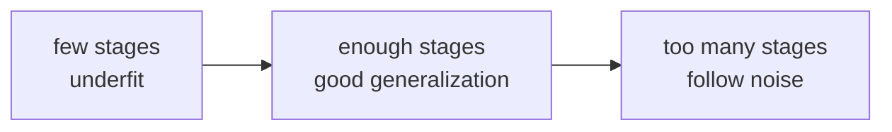

# P3-16.2 부스팅의 성능과 위험

P3-16.1에서는 그래디언트 부스팅(gradient boosting)이 앞선 단계의 오차를 다음 단계가 순차적으로 보정하는 방식이라는 점을 보았습니다. 바로 여기서 부스팅의 강점과 위험이 동시에 나옵니다.

같은 질문을 더 정확히 바꾸면 다음과 같습니다.

`오차를 계속 줄여 나가는 구조라면, 왜 성능이 강해 보이면서도 동시에 과적합(overfitting)에 민감할 수 있을까?`

초심자 기준에서는 다음 한 문장으로 먼저 잡으면 충분합니다.

`부스팅은 작은 보정을 많이 쌓아 강한 성능을 만들 수 있지만, 그만큼 데이터의 우연한 흔들림까지 따라가 버릴 위험도 함께 커진다.`

즉, 부스팅의 장점은 `정교한 보정`이고, 위험은 `너무 정교한 보정`입니다.

## 이 절의 범위

이 절은 다음 질문에 답합니다.

- 왜 그래디언트 부스팅은 표 형식 데이터(tabular data)에서 강한 후보로 자주 언급되는가?
- 왜 learning rate, tree size, n_estimators가 민감한 조합이 되는가?
- 과적합은 어떤 모습으로 드러날 수 있는가?
- shrinkage, subsampling, early stopping은 어떤 위험을 줄이려는가?
- 랜덤포레스트와 비교할 때 어떤 상황에서 더 강하게 느껴지고, 어떤 상황에서 더 조심해야 하는가?

이 절은 다음 내용은 깊게 다루지 않습니다.

- XGBoost, LightGBM, CatBoost의 구현 차이
- GPU, histogram binning, distributed training의 세부 구조
- 교차검증(cross-validation) 실전 자동화
- 손실 함수별 세밀한 미분 전개

이 절은 입문적으로 `강한 성능 후보를 다루는 태도`를 만드는 데 집중합니다.

## 이 절의 목표

- 부스팅의 높은 성능 가능성과 높은 튜닝 민감성을 함께 설명할 수 있습니다.
- `learning_rate`, `n_estimators`, tree size가 서로 연결된다는 점을 말할 수 있습니다.
- shrinkage, subsampling, early stopping이 왜 필요한지 초심자 수준에서 설명할 수 있습니다.
- train 성능이 좋아 보여도 바로 신뢰하지 않는 점검 관점을 가질 수 있습니다.

## 왜 이 절이 필요한가

그래디언트 부스팅을 처음 접한 독자는 보통 두 가지 인상을 같이 받습니다.

- 인상 1: 오차를 계속 줄인다고 하니 똑똑해 보인다.
- 인상 2: 단계가 많아질수록 오히려 불안해 보인다.

둘 다 맞는 감각입니다.

| 부스팅이 강하게 느껴지는 이유 | 동시에 위험해지는 이유 |
| --- | --- |
| 남은 오차를 직접 겨냥해 보정한다 | 우연한 노이즈(noise)까지 따라갈 수 있다 |
| 작은 비선형 패턴을 누적할 수 있다 | 단계가 많아질수록 과한 수정이 쌓일 수 있다 |
| 표 형식 데이터에서 강력한 후보가 되기 쉽다 | 하이퍼파라미터 조합에 민감하다 |

즉, 16.2는 `부스팅이 왜 강한가`와 `왜 조심해야 하는가`를 동시에 붙잡는 절입니다.

## 왜 부스팅은 성능이 강하게 느껴지는가

scikit-learn 사용자 가이드는 gradient-boosted trees와 histogram-based gradient boosting이 실무에서 자주 강한 성능 후보라고 설명합니다. 그 배경에는 순차 보정 구조가 있습니다.

초심자 기준에서는 다음처럼 이해하면 좋습니다.

- 한 번에 큰 규칙 하나를 찾기보다
- 작은 규칙을 계속 더해 가며
- 아직 틀린 부분을 조금씩 줄인다

이 방식은 표 형식 데이터에서 자주 만나는 `조금씩 겹치는 패턴`을 다루기에 유리합니다.

예를 들어 고객 이탈(churn) 예측에서:

- 가입 기간이 짧은데
- 최근 접속도 줄었고
- 결제 실패 이력이 있으며
- 문의 횟수도 늘었다

같은 신호가 조금씩 겹쳐 있다면, 부스팅은 이런 조각난 패턴을 단계적으로 반영하는 데 강한 후보가 될 수 있습니다.

## 그런데 왜 과적합에 민감한가

16.1에서 본 것처럼, 그래디언트 부스팅은 `이전 단계의 남은 오차`를 보고 다음 단계를 만듭니다. 이 구조는 강력하지만, 동시에 위험합니다.

왜냐하면 후반 단계로 갈수록 모델은 점점 더 작은 차이, 더 미세한 남은 흔들림에 반응할 수 있기 때문입니다.

초심자 문장으로 바꾸면:

`초반에는 큰 실수를 고치지만, 뒤로 갈수록 작은 실수와 우연한 잡음까지 고치려 들 수 있다.`

바로 이 지점에서 과적합이 생깁니다.

## 과적합은 어떤 모습으로 보이는가

scikit-learn 문서는 gradient boosting 모델의 `train_score_`와 `staged_predict`를 이용해 단계 수가 늘어날 때 성능 흐름을 점검할 수 있다고 설명합니다. 이 흐름은 early stopping의 근거가 되기도 합니다.

입문적으로는 다음 그림이 중요합니다.



이 그림의 뜻은 단순합니다.

- 단계가 너무 적으면 아직 충분히 배우지 못합니다.
- 적당한 지점에서는 일반화(generalization)가 좋아질 수 있습니다.
- 너무 많이 가면 훈련 데이터의 세세한 흔들림까지 외울 수 있습니다.

즉, 부스팅에서는 `많을수록 무조건 좋다`가 아닙니다.

## learning_rate와 n_estimators를 왜 함께 봐야 하나

scikit-learn 문서는 learning rate를 shrinkage라고 설명하고, 작은 learning rate는 더 많은 weak learner가 필요하다고 설명합니다.

이 관계는 초심자가 가장 먼저 익혀야 할 부스팅 감각입니다.

| 설정 | 장점처럼 보이는 점 | 위험 |
| --- | --- | --- |
| 큰 learning_rate + 적은 단계 | 빨리 개선된다 | 과한 수정으로 흔들릴 수 있다 |
| 작은 learning_rate + 많은 단계 | 더 천천히, 세밀하게 맞춘다 | 단계가 너무 많아지면 결국 과적합으로 갈 수 있다 |

즉, `learning_rate`와 `n_estimators`는 서로 반대쪽 손잡이처럼 작동합니다.

`한 번에 얼마나 많이 고칠 것인가`와 `몇 번에 걸쳐 고칠 것인가`를 같이 설계해야 하기 때문입니다.

## tree size가 왜 중요해지는가

scikit-learn 문서는 gradient boosting에서 tree size가 모델이 포착할 수 있는 상호작용(interaction)의 복잡도와 연결된다고 설명합니다.

초심자 관점에서는 이렇게 이해하면 충분합니다.

- 작은 트리: 단계 하나가 단순한 보정만 한다
- 큰 트리: 단계 하나가 더 복잡한 보정을 한다

따라서 큰 트리를 쓰면:

- 한 단계의 표현력은 올라갈 수 있지만
- 한 단계가 너무 많은 것을 한꺼번에 외워 버릴 위험도 커집니다

즉, 부스팅의 복잡도는 `트리 수`만이 아니라 `각 단계 트리의 크기`에도 크게 좌우됩니다.

## shrinkage는 무엇을 막으려 하나

scikit-learn 문서는 Friedman(2001)의 shrinkage 전략을 소개하며, 각 weak learner의 기여를 learning rate로 축소해 반영한다고 설명합니다.

입문적으로는 shrinkage를 다음처럼 읽으면 좋습니다.

`새 단계가 정답을 크게 밀어붙이지 못하게 속도를 늦춘다.`

즉, shrinkage는 부스팅의 보정이 너무 급하게 움직이지 않게 하는 브레이크입니다.

이 브레이크가 없으면:

- 초반에 빠르게 train score를 올릴 수 있지만
- 금방 과하게 휘어질 수 있습니다

따라서 부스팅에서 learning rate는 단순 속도 조절이 아니라 `과적합 제어 장치`로 읽는 편이 더 중요합니다.

## subsampling은 무엇을 막으려 하나

scikit-learn 문서는 stochastic gradient boosting을 설명하면서, 각 단계의 base learner를 전체 훈련 데이터가 아니라 일부 `subsample`로 학습시킬 수 있다고 설명합니다. 보통 `subsample = 0.5` 같은 값이 예시로 제시됩니다.

초심자 관점에서 이는 이렇게 읽을 수 있습니다.

`모든 단계를 항상 전체 데이터에 딱 맞추게 하지 말고, 일부 데이터만 보고 조금 덜 집착하게 만들자.`

즉, subsampling은:

- 보정 방향에 약간의 무작위성을 넣고
- 분산(variance)을 줄이며
- 과한 적합을 완화하려는 장치입니다

랜덤포레스트의 bootstrap과 완전히 같은 구조는 아니지만, `과하게 한 방향으로 맞추지 않게 흔들어 준다`는 감각에서는 비교가 가능합니다.

## early stopping은 왜 필요한가

scikit-learn 문서는 `staged_predict`, `train_score_`, validation 기반 점검을 통해 적절한 단계 수를 찾을 수 있다고 설명하고, histogram-based gradient boosting에서는 `early_stopping`, `validation_fraction`, `n_iter_no_change` 같은 옵션을 제공합니다.

초심자 기준에서는 early stopping을 다음처럼 이해하면 좋습니다.

`계속 좋아질 것 같아 보여도, 검증 성능이 더 이상 좋아지지 않으면 거기서 멈추자.`

이는 부스팅의 매우 중요한 운영 감각입니다.

- train score는 계속 좋아질 수 있습니다.
- 그러나 validation/test 성능은 어느 시점 이후 더 이상 좋아지지 않거나 오히려 떨어질 수 있습니다.

따라서 early stopping은 `단계를 얼마나 더 갈지`를 감으로 정하지 않게 해 주는 안전장치입니다.

## 작은 숫자 예제로 과한 보정 감각 보기

이번 예제는 learning rate가 너무 크면 보정이 어떻게 과해질 수 있는지 장난감 숫자로 보는 실습입니다.

- 문제 상황: 현재 예측을 남은 오차 방향으로 고치되, correction을 너무 크게 반영하면 무슨 일이 생기는지 본다
- 입력(input): 실제값, 현재 예측, correction
- 기대 출력(output): 작은 learning rate와 큰 learning rate의 차이
- 확인할 개념:
  - correction 자체보다 `얼마나 반영하는가`가 중요하다
  - 큰 learning rate는 overshoot를 만들 수 있다

```python
actual = [120, 110, 90, 80]
pred = [100, 100, 100, 100]
correction = [15, 10, -10, -15]

for lr in [0.1, 0.8]:
    updated = [p + lr * c for p, c in zip(pred, correction)]
    residual = [a - u for a, u in zip(actual, updated)]

    print(f"learning_rate={lr}")
    print("  updated prediction:", [round(x, 1) for x in updated])
    print("  new residual      :", [round(x, 1) for x in residual])
```

실행 결과는 다음과 같습니다.

```text
learning_rate=0.1
  updated prediction: [101.5, 101.0, 99.0, 98.5]
  new residual      : [18.5, 9.0, -9.0, -18.5]
learning_rate=0.8
  updated prediction: [112.0, 108.0, 92.0, 88.0]
  new residual      : [8.0, 2.0, -2.0, -8.0]
```

이 숫자만 보면 `0.8이 더 빨리 좋아진다`고 느낄 수 있습니다. 실제로 초반에는 그럴 수 있습니다. 하지만 부스팅의 핵심 위험은 그 다음 단계들입니다.

- correction이 조금만 잘못돼도 큰 learning rate는 흔들림을 크게 키울 수 있습니다.
- 데이터에 잡음이 많은 경우, 큰 보정은 우연한 흔들림까지 따라가기 쉬워집니다.

즉, 큰 learning rate는 초반 개선을 빨리 보여 줄 수 있지만, 더 위험한 방향으로도 빨리 갈 수 있습니다.

## 실무 점검표로 바꾸면

부스팅을 실제로 읽을 때는 보통 다음 항목을 함께 봅니다.

| 점검 항목 | 왜 보나 |
| --- | --- |
| train 성능 | 모델이 학습 데이터를 얼마나 설명하는지 |
| validation/test 성능 | 처음 보는 데이터에서도 유지되는지 |
| 단계 수(`n_estimators`) | 너무 적거나 너무 많은지 |
| learning rate | 보정 속도가 너무 급하지 않은지 |
| tree size / depth | 한 단계가 너무 복잡하지 않은지 |
| subsample | 과한 적합을 줄일 장치가 있는지 |

이 점검표를 보면 부스팅은 `좋은 기본값 하나로 끝나는 모델`이라기보다 `조정과 검증이 중요한 모델`임이 드러납니다.

## 랜덤포레스트와 비교하면 어떤가

입문 수준에서는 다음 비교가 실용적입니다.

| 질문 | 랜덤포레스트 | 그래디언트 부스팅 |
| --- | --- | --- |
| 기본적으로 안정적인가 | 상대적으로 그렇다 | 더 민감할 수 있다 |
| 튜닝 없이도 무난한가 | 비교적 무난한 편 | 더 세심한 조정이 필요할 수 있다 |
| 더 높은 성능 후보가 되기 쉬운가 | 좋은 기준선이 되기 쉽다 | 더 높은 상한을 보일 때가 많다 |
| 과적합 관리가 중요한가 | 중요하지만 비교적 덜 예민한 편 | 매우 중요하다 |

즉, 랜덤포레스트가 `안정적인 출발선`이라면, 그래디언트 부스팅은 `더 공격적인 성능 후보`에 가깝습니다.

## 왜 histogram-based gradient boosting이 자주 함께 언급되는가

scikit-learn 문서는 HistGradientBoostingClassifier와 HistGradientBoostingRegressor를 대용량 표 형식 데이터에서 더 빠른 대안으로 소개합니다. 또한 missing value, categorical feature, early stopping 같은 실무 기능을 더 많이 제공합니다.

초심자 관점에서는 지금 당장 세부 구현보다 다음 정도만 기억하면 충분합니다.

- 일반 gradient boosting은 입문 개념을 배우기에 좋습니다.
- histogram-based gradient boosting은 실무 구현에서 자주 만나는 현대적 형태입니다.

즉, 16.1과 16.2에서 배우는 사고방식은 이후 XGBoost, LightGBM, CatBoost를 읽을 때도 그대로 이어집니다.

## 이 절에서 기억할 관점

- 부스팅은 높은 성능 후보가 될 수 있지만, 그만큼 조정과 검증이 중요합니다.
- learning rate, 단계 수, 트리 크기는 함께 읽어야 합니다.
- shrinkage는 과한 보정을 늦추는 장치입니다.
- subsampling은 보정에 무작위성을 넣어 과적합을 줄이려는 장치입니다.
- early stopping은 더 이상 일반화 성능이 좋아지지 않을 때 멈추게 하는 안전장치입니다.

## 체크리스트

- 왜 그래디언트 부스팅이 강한 성능 후보가 되기 쉬운지 설명할 수 있는가?
- 왜 그 구조가 동시에 과적합에 민감한지 말할 수 있는가?
- `learning_rate`와 `n_estimators`를 함께 봐야 하는 이유를 알고 있는가?
- shrinkage, subsampling, early stopping의 역할을 구분할 수 있는가?
- 랜덤포레스트와 비교해 부스팅이 더 공격적인 성능 후보라는 점을 이해했는가?

## 출처와 참고 자료

- scikit-learn developers, `1.11. Ensembles: Gradient boosting, random forests, bagging, voting, stacking`, scikit-learn User Guide, 확인 날짜: 2026-06-27. [https://scikit-learn.org/stable/modules/ensemble.html](https://scikit-learn.org/stable/modules/ensemble.html){: target="_blank" rel="noopener noreferrer" }
- Jerome H. Friedman, `Greedy Function Approximation: A Gradient Boosting Machine`, Annals of Statistics, 2001.
- Jerome H. Friedman, `Stochastic Gradient Boosting`, Computational Statistics & Data Analysis, 2002.
