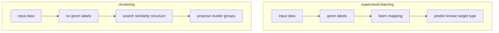
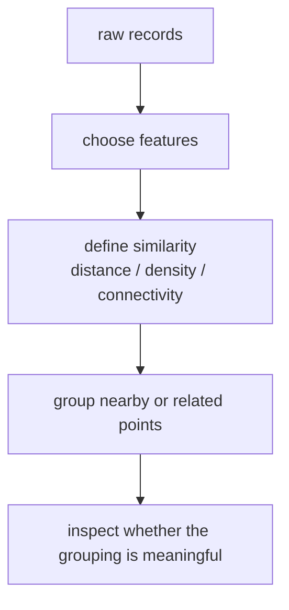
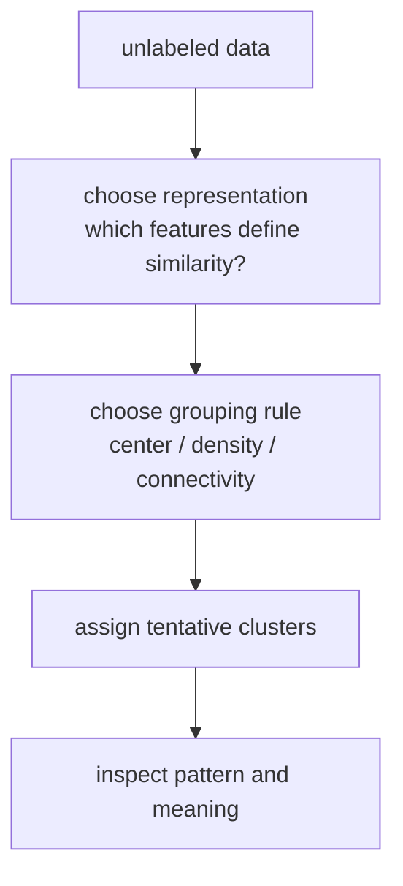
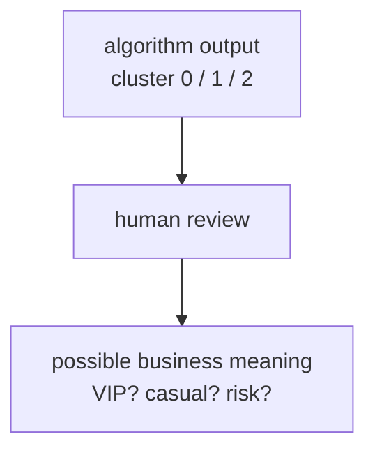
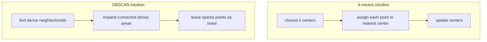

# P3-17.1 클러스터링(clustering)의 직관

P3-16에서는 그래디언트 부스팅(gradient boosting)까지 보면서, 정답(label)이 있는 문제에서 모델이 어떻게 예측 성능을 올리는지를 따라왔습니다. 이제 시선을 조금 바꿔 보겠습니다.

정답 라벨이 아예 없다면, 데이터 안의 구조는 어떻게 찾을 수 있을까?

이 질문이 클러스터링(clustering)의 출발점입니다.

클러스터링은 정답 라벨 없이, 서로 비슷한 데이터가 어떤 묶음(cluster)을 이루는지 찾으려는 비지도학습(unsupervised learning) 문제다.

즉, 클러스터링은 `정답을 맞히는 문제`라기보다 `구조를 발견해 보는 문제`에 가깝습니다.

## 이 절의 범위

이 절은 다음 질문에 답합니다.

- 클러스터링은 지도학습(supervised learning)과 무엇이 다른가?
- `비슷하다(similar)`는 말은 왜 중요한가?
- 군집(cluster)은 정답 클래스(class)와 왜 다른가?
- k-means와 DBSCAN은 어떤 다른 직관을 보여 주는가?
- 클러스터링 결과를 어떤 태도로 읽어야 하는가?

이 절은 다음 내용은 깊게 다루지 않습니다.

- k-means의 수식 최적화
- DBSCAN의 세부 파라미터 조정
- 계층적 군집화(hierarchical clustering)와 스펙트럴 클러스터링(spectral clustering)의 구현
- silhouette score 같은 군집 품질 지표

이 절은 입문적으로 `클러스터링이 어떤 질문에 답하는가`를 이해하는 데 집중합니다. 결과 해석의 주의점은 P3-17.2에서 이어서 다루고, silhouette score 같은 군집 품질 지표는 P3-6.4 보충학습에서 다시 회수합니다. 차원 축소와 함께 군집 구조를 읽을 때의 주의점은 P3-18.1, P3-18.2에서 다시 연결합니다. 계층적 군집화와 스펙트럴 클러스터링의 구현은 이 책의 현재 본편 범위 밖에 둡니다.

## 이 절의 목표

- 클러스터링을 `라벨 없는 구조 찾기`로 설명할 수 있습니다.
- 군집은 사람이 붙여 준 정답이 아니라 데이터에서 찾은 묶음이라는 점을 설명할 수 있습니다.
- k-means와 DBSCAN이 서로 다른 군집 직관을 가진다는 점을 말할 수 있습니다.
- 클러스터링 결과를 곧바로 사실이나 원인으로 단정하면 왜 위험한지 감을 잡을 수 있습니다.

## 왜 이 절이 필요한가

머신러닝을 처음 배우면 보통 `분류냐 회귀냐`부터 생각합니다. 하지만 실제 업무에서는 라벨이 없는 데이터가 더 흔한 경우도 많습니다.

예를 들어:

- 고객을 몇 가지 이용 패턴으로 묶어 보고 싶다
- 뉴스 기사들이 어떤 주제 덩어리로 모이는지 보고 싶다
- 센서 데이터가 몇 가지 상태로 나뉘는지 보고 싶다
- 이상한 점(outlier)이 따로 튀는지 보고 싶다

이런 질문은 “정답이 무엇인가?”보다 “어떤 구조가 숨어 있는가?”를 먼저 묻습니다. 클러스터링은 바로 이런 질문에 들어가는 첫 도구입니다.

즉, 17.1은 `예측 모델` 중심의 시야에서 `데이터 구조 탐색` 중심의 시야로 넘어가는 절입니다.

## 클러스터링은 무엇을 하려는가

scikit-learn 사용자 가이드는 clustering을 unlabeled data에 대해 수행하는 작업으로 설명합니다. 즉, 이미 정답이 주어진 상태에서 맞히는 것이 아니라, 데이터를 묶을 기준을 알고리즘이 찾아보게 하는 것입니다.

여기서는 이렇게 읽으면 좋습니다.

`라벨이 없는 점들을 보고, 서로 가까운 것끼리 혹은 비슷한 패턴을 가진 것끼리 묶어 보자.`

이때 중요한 것은 `비슷함(similarity)`입니다. 클러스터링은 결국 `무엇을 비슷하다고 볼 것인가`의 문제와 연결됩니다.

## 지도학습과 무엇이 다른가

분류(classification)에서는 보통 이런 질문을 합니다.

- 이 이메일은 스팸인가 아닌가?
- 이 고객은 이탈할까 아닐까?

여기에는 이미 정답 라벨이 있습니다.

반면 클러스터링은 이렇게 묻습니다.

- 이 고객들은 어떤 이용 패턴별로 나뉘어 보이는가?
- 이 문서들은 어떤 주제 덩어리처럼 보이는가?

즉, 클러스터링은 `라벨을 맞히는 문제`가 아니라 `라벨이 없을 때 묶음을 제안하는 문제`입니다.

| 질문 | 지도학습 | 클러스터링 |
| --- | --- | --- |
| 정답 라벨이 있는가 | 있다 | 없다 |
| 목표 | 정답 예측 | 구조 탐색 |
| 출력 | class, score, value | cluster label, grouping |
| 핵심 질문 | 무엇을 맞힐까 | 무엇이 비슷하게 묶이는가 |

여기서 cluster label은 사람이 미리 준 의미가 아닙니다. 알고리즘이 편의상 붙인 번호일 뿐입니다.

이 차이를 한 번 더 도식으로 보면 다음과 같습니다.



이 도식은 지도학습과 클러스터링의 출발점이 어디서 갈리는지 한 번에 보여 줍니다. 지도학습은 정답 라벨을 가지고 mapping을 배우지만, 클러스터링은 라벨 없이 비슷함의 구조를 먼저 찾고 그 묶음을 사람이 다시 해석해야 합니다.

## `비슷하다`는 말이 왜 중요한가

클러스터링은 결국 데이터 사이의 거리(distance), 밀도(density), 연결(connectivity), 중심(center) 같은 개념 위에서 작동합니다.

즉, 군집은 그냥 생기는 것이 아니라, `어떤 기준으로 비슷함을 정의했는가`에 따라 달라집니다.

예를 들어 고객 데이터를 생각해 봅시다.

- 월 방문 수
- 평균 구매 금액
- 최근 로그인 일수

이 세 특징(feature)을 가지고 고객을 본다면, 비슷함은 이 세 축에서의 위치가 가깝다는 뜻이 될 수 있습니다.

하지만 텍스트 문서라면 비슷함은 단어 분포나 임베딩(embedding) 공간에서의 가까움으로 바뀔 수 있습니다.

즉, 클러스터링에서 “비슷하다”는 말은 감정적 표현이 아니라 `특징 공간(feature space)에서의 관계 정의`입니다.

이를 데이터 흐름처럼 줄이면 다음과 같습니다.



이 도식은 클러스터링이 데이터 원본에서 곧바로 답을 꺼내는 과정이 아니라는 점을 보여 줍니다. 어떤 특징을 고르고, 어떤 비슷함 규칙을 쓸지 정한 뒤에야 군집이 만들어지므로, 결과는 항상 표현 방식과 유사도 정의의 영향을 받습니다.

## 한 장면으로 먼저 보기



이 도식의 핵심은 클러스터링 결과가 `최종 정답`이 아니라 `구조 제안`이라는 점입니다. 알고리즘이 군집을 나누더라도, 그 묶음이 실제로 어떤 의미를 가지는지는 마지막 해석 단계에서 사람이 다시 확인해야 합니다.

이 흐름에서 중요한 점은 클러스터링이 `정답 생성기`가 아니라 `구조 제안기`라는 것입니다. 결과가 나오면, 그다음에는 사람이 그 묶음이 무슨 뜻인지 해석해야 합니다.

## 군집은 클래스(class)와 왜 다른가

가장 자주 하는 오해는 이것입니다.

`군집이 나왔으니, 이것이 곧 진짜 카테고리이겠구나.`

하지만 군집은 클래스와 다릅니다.

- 클래스(class): 사람이 의미를 정해 둔 정답 범주
- 군집(cluster): 데이터 안에서 알고리즘이 찾아낸 묶음

예를 들어 고객 세그먼트를 3개 군집으로 나눴다고 해서, 그것이 곧 “VIP / 일반 / 이탈위험” 같은 공식 범주를 뜻하는 것은 아닙니다. 그런 해석은 나중에 사람이 붙이는 것입니다.

즉, 클러스터링은 의미를 `자동으로 확정`하는 것이 아니라, `해석 후보를 제안`하는 쪽에 가깝습니다.

이 점을 그림으로 보면 다음과 같습니다.



이 도식은 군집 번호와 비즈니스 의미를 분리해서 읽게 해 줍니다. `cluster 0`, `cluster 1` 같은 출력은 아직 임시 번호일 뿐이고, 그것을 `VIP 고객`, `가벼운 사용자`, `위험군`처럼 해석하는 일은 뒤의 사람 검토 단계에서 이루어집니다.

## k-means는 어떤 직관을 보여 주는가

scikit-learn 사용자 가이드는 K-means를 샘플을 `n groups of equal variance`로 나누고, inertia(within-cluster sum-of-squares)를 줄이려는 알고리즘으로 설명합니다. 또한 중심점(centroid)을 기준으로 각 샘플을 가장 가까운 군집에 배정하는 흐름을 설명합니다.

입문적으로는 다음처럼 이해하면 충분합니다.

`k-means는 몇 개의 중심점을 놓고, 각 점을 가장 가까운 중심에 붙이는 방식으로 군집을 만든다.`

즉, k-means는 중심(center) 기반 직관입니다.

그래서 다음 상황에서 잘 어울리는 편입니다.

- 군집 수를 미리 정할 수 있을 때
- 군집이 둥글고 비교적 고른 크기처럼 보일 때
- 빠르게 기본 구조를 보고 싶을 때

하지만 scikit-learn 문서도 지적하듯, 길쭉하거나 복잡한 모양의 군집에는 잘 맞지 않을 수 있습니다.

## DBSCAN은 어떤 직관을 보여 주는가

scikit-learn clustering 개요 표는 DBSCAN을 `non-flat geometry`, `uneven cluster sizes`, `outlier removal`에 유용한 방식으로 설명합니다.

여기서는 다음처럼 보면 좋습니다.

`DBSCAN은 중심점을 먼저 정하지 않고, 점이 얼마나 빽빽하게 모여 있는지를 보고 군집을 만든다.`

즉, DBSCAN은 밀도(density) 기반 직관입니다.

그래서 다음 상황에서 떠올리기 좋습니다.

- 군집 모양이 둥글지 않을 때
- 일부 점을 노이즈(noise)나 이상치처럼 따로 두고 싶을 때
- 군집 크기가 고르지 않을 수 있을 때

반대로, 밀도 차이가 매우 크거나 파라미터가 맞지 않으면 군집이 잘 안 잡힐 수 있습니다.

## k-means와 DBSCAN을 나란히 보면

| 질문 | k-means | DBSCAN |
| --- | --- | --- |
| 군집 직관 | 중심(center) | 밀도(density) |
| 군집 수를 미리 정하나 | 보통 그렇다 | 보통 아니다 |
| 이상치 처리 | 약하다 | 상대적으로 잘 드러낸다 |
| 군집 모양 | 둥글고 고른 모양에 더 잘 맞는다 | 복잡한 모양에도 대응할 수 있다 |

이 비교는 “무엇이 더 좋다”가 아니라 “무슨 구조를 기대하느냐”의 차이입니다.

직관만 비교하면 다음처럼 볼 수 있습니다.



이 도식은 k-means와 DBSCAN이 `무엇을 중심으로 군집을 만든다고 보는가`가 다르다는 점을 압축합니다. k-means는 중심점을 기준으로 점을 모으고, DBSCAN은 빽빽하게 이어진 영역을 확장하면서 듬성한 점은 노이즈로 남길 수 있습니다.

## 작은 숫자 예제로 군집 직관 보기

이번 예제는 좌표 두 개만으로, 점들이 두 덩어리처럼 보이는지 확인하는 아주 작은 실습입니다.

- 문제 상황: 라벨이 없는 점들이 자연스럽게 몇 덩어리처럼 보이는지 본다
- 입력(input): 2차원 좌표
- 기대 출력(output): 가까운 점 묶음에 대한 직관
- 확인할 개념:
  - 군집은 위치 관계에서 시작한다
  - 라벨이 없어도 묶음 감각은 만들 수 있다

```python
points = [
    (1.0, 1.2),
    (1.1, 0.9),
    (0.8, 1.0),
    (5.0, 5.1),
    (5.2, 4.9),
    (4.8, 5.0),
]

left_group = [p for p in points if p[0] < 3]
right_group = [p for p in points if p[0] >= 3]

print("all points :", points)
print("group A    :", left_group)
print("group B    :", right_group)
print("group sizes:", len(left_group), len(right_group))
```

실행 결과는 다음과 같습니다.

```text
all points : [(1.0, 1.2), (1.1, 0.9), (0.8, 1.0), (5.0, 5.1), (5.2, 4.9), (4.8, 5.0)]
group A    : [(1.0, 1.2), (1.1, 0.9), (0.8, 1.0)]
group B    : [(5.0, 5.1), (5.2, 4.9), (4.8, 5.0)]
group sizes: 3 3
```

이 코드는 실제 클러스터링 알고리즘이 아닙니다. 하지만 독자에게 중요한 감각을 줍니다.

1. 라벨이 없어도 점 위치를 보면 덩어리 감각이 생길 수 있습니다.
2. 군집은 결국 어떤 공간에서 가까운 점들이 모이는가의 문제와 연결됩니다.
3. 실제 알고리즘은 이 묶음 기준을 더 일반화해 자동으로 찾으려는 것입니다.

## 업무에서는 어떤 질문으로 연결되나

클러스터링은 보통 다음 같은 질문으로 등장합니다.

| 업무 장면 | 클러스터링이 하는 일 |
| --- | --- |
| 고객 세그먼트 분석 | 비슷한 행동 패턴의 고객 묶음을 제안한다 |
| 상품 추천 전 탐색 | 비슷한 상품군이나 사용자군을 발견한다 |
| 문서 정리 | 주제별 문서 덩어리를 찾는다 |
| 이상 징후 탐색 | 묶음에서 멀리 떨어진 점을 눈에 띄게 만든다 |

즉, 클러스터링은 최종 의사결정 모델보다 `탐색적 분석(exploratory analysis)`에 먼저 쓰이는 경우가 많습니다.

## 사례로 보기

### 사례 1. 쇼핑몰 고객을 매출 순위가 아니라 이용 패턴으로 다시 묶어 보고 싶을 때

온라인 쇼핑몰 팀이 고객을 볼 때 처음에는 `이번 달 구매액이 큰가` 같은 단일 기준으로만 나누기 쉽습니다. 하지만 실제로는 방문은 잦지만 소액으로 자주 사는 고객, 방문은 드물지만 한 번에 크게 사는 고객, 최근 방문이 끊긴 고객처럼 서로 다른 패턴이 섞여 있어서, 금액 하나만 보면 같은 부류로 묶여 버릴 수 있습니다. 클러스터링은 방문 수, 구매 금액, 최근 접속일 같은 특징을 함께 보고 비슷한 고객 묶음을 제안합니다. 그래서 팀은 단순 매출 순위표로는 보이지 않던 `행동 패턴 중심`의 고객 그룹을 발견하고, 이후 해석과 마케팅 전략 검토를 이어갈 수 있습니다.

## 이 절에서 기억할 관점

- 클러스터링은 라벨 없는 데이터에서 구조를 찾는 비지도학습입니다.
- 군집은 사람이 정한 정답 클래스가 아니라 알고리즘이 제안한 묶음입니다.
- 비슷함은 거리, 밀도, 연결 같은 기준 위에서 정의됩니다.
- k-means는 중심 기반, DBSCAN은 밀도 기반 직관을 보여 줍니다.
- 클러스터링 결과는 해석의 출발점이지, 자동으로 확정된 진실은 아닙니다.

## 체크리스트

- 클러스터링을 `정답 예측`이 아니라 `구조 탐색`으로 설명할 수 있는가?
- 군집과 클래스의 차이를 말할 수 있는가?
- 왜 `비슷하다`는 정의가 중요해지는지 설명할 수 있는가?
- k-means와 DBSCAN의 직관 차이를 구분할 수 있는가?
- 클러스터링 결과를 사람이 다시 해석해야 한다는 점을 이해했는가?

## 출처와 참고 자료

- scikit-learn developers, `2.3. Clustering`, scikit-learn User Guide, 확인 날짜: 2026-06-27. [https://scikit-learn.org/stable/modules/clustering.html](https://scikit-learn.org/stable/modules/clustering.html){: target="_blank" rel="noopener noreferrer" }
- scikit-learn developers, `KMeans`, scikit-learn API Reference, 확인 날짜: 2026-06-27. [https://scikit-learn.org/stable/modules/generated/sklearn.cluster.KMeans.html](https://scikit-learn.org/stable/modules/generated/sklearn.cluster.KMeans.html){: target="_blank" rel="noopener noreferrer" }
- scikit-learn developers, `DBSCAN`, scikit-learn API Reference, 확인 날짜: 2026-06-27. [https://scikit-learn.org/stable/modules/generated/sklearn.cluster.DBSCAN.html](https://scikit-learn.org/stable/modules/generated/sklearn.cluster.DBSCAN.html){: target="_blank" rel="noopener noreferrer" }
