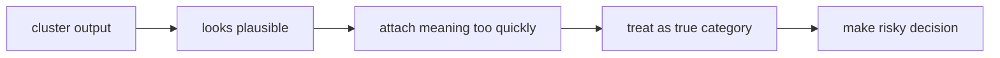
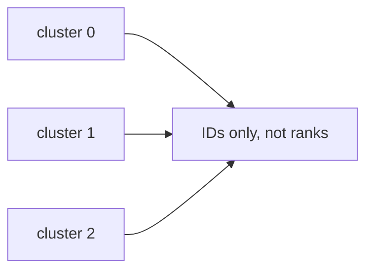
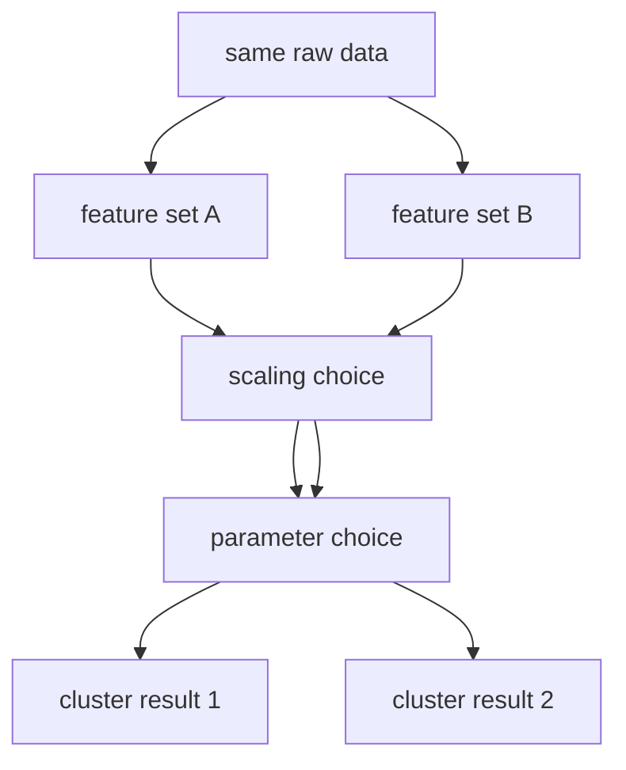
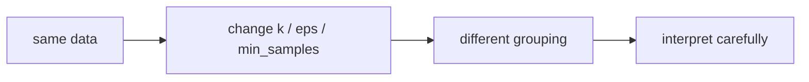
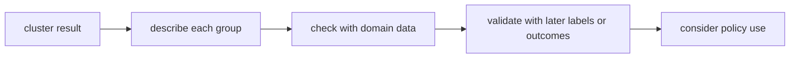
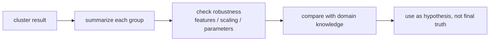

# P3-17.2 군집 결과를 해석할 때의 주의점

P3-17.1에서는 클러스터링(clustering)을 라벨 없는 데이터에서 구조를 찾는 비지도학습(unsupervised learning) 문제로 보았습니다. 이제 바로 다음 단계가 중요합니다.

`알고리즘이 묶음을 제안했다면, 그 묶음을 우리는 어디까지 믿어도 될까?`

초심자 기준에서는 다음 한 문장으로 먼저 잡으면 충분합니다.

`군집 결과는 데이터 구조에 대한 제안이지, 자동으로 확정된 정답이나 원인 설명이 아니다.`

즉, 클러스터링의 위험은 보통 알고리즘 계산 자체보다 `사람이 결과를 과하게 해석하는 일`에서 더 자주 생깁니다.

## 이 절의 범위

이 절은 다음 질문에 답합니다.

- 왜 군집 결과를 곧바로 정답(label)처럼 읽으면 안 되는가?
- 왜 같은 데이터도 표현 방식과 파라미터에 따라 다른 군집이 나올 수 있는가?
- 군집 번호는 왜 의미가 없는가?
- 군집 결과를 업무 정책이나 사람 평가로 바로 연결하면 왜 위험한가?
- 군집 결과를 어떻게 보수적으로 읽어야 하는가?

이 절은 다음 내용은 깊게 다루지 않습니다.

- 실루엣 점수(silhouette score), Davies-Bouldin index 같은 군집 평가 지표
- 고급 시각화와 임베딩 공간 왜곡
- 반지도학습(semi-supervised learning)과의 연결

이 절은 입문적으로 `군집 결과를 과신하지 않는 태도`를 만드는 데 집중합니다.

## 이 절의 목표

- 군집 결과가 정답 클래스와 다르다는 점을 설명할 수 있습니다.
- 같은 데이터라도 특징 선택과 파라미터에 따라 다른 군집이 나올 수 있다는 점을 말할 수 있습니다.
- 군집 번호 자체에는 고정된 의미가 없다는 점을 설명할 수 있습니다.
- 군집 결과를 업무 판단에 연결할 때 왜 추가 검토가 필요한지 이해할 수 있습니다.

## 왜 이 절이 필요한가

클러스터링은 처음 보면 매우 설득력 있게 보일 수 있습니다.

- 데이터가 몇 묶음으로 나뉜다
- 각 묶음이 꽤 그럴듯해 보인다
- 그러면 이 묶음이 진짜 범주처럼 느껴진다

바로 여기서 오해가 시작됩니다.

클러스터링은 `정답을 맞힌 것`이 아니라 `구조를 제안한 것`입니다. 사람은 이 제안을 보고 의미를 붙이고 싶어 하지만, 그 의미 붙이기가 너무 빠르면 잘못된 결론으로 이어질 수 있습니다.

즉, 17.2는 클러스터링의 계산보다 `해석의 브레이크`를 배우는 절입니다.

이 위험 흐름을 먼저 보면 다음과 같습니다.



## 군집은 정답 라벨이 아니다

17.1에서 본 것처럼, 군집(cluster)은 알고리즘이 데이터 안에서 찾은 묶음입니다. 반면 정답 라벨(label)은 사람이 문제 정의에 따라 미리 정한 범주입니다.

이 둘은 겉보기에는 비슷할 수 있지만 역할이 다릅니다.

| 항목 | 정답 라벨(label) | 군집(cluster) |
| --- | --- | --- |
| 누가 정했는가 | 사람, 도메인 규칙, 데이터 수집 과정 | 알고리즘 |
| 목적 | 예측 대상 정의 | 구조 탐색 |
| 의미 | 보통 미리 정의됨 | 해석을 나중에 붙임 |
| 안정성 | 정의가 바뀌지 않으면 비교적 안정적 | 표현, 거리, 파라미터에 따라 달라질 수 있음 |

초심자에게 가장 중요한 문장은 이것입니다.

`군집은 설명 후보이지, 정답 범주가 아니다.`

## 군집 번호에는 왜 의미가 없는가

클러스터링 결과를 보면 종종 이런 식으로 나옵니다.

- cluster 0
- cluster 1
- cluster 2

여기서 많은 초심자가 무의식적으로 다음처럼 읽습니다.

- 0은 낮은 등급
- 2는 높은 등급

하지만 보통 이런 해석은 틀립니다.

군집 번호는 단지 알고리즘이 임시로 붙인 식별자일 뿐입니다. 다음 실행에서는 같은 묶음이 다른 번호를 받을 수도 있습니다.

즉, `cluster 2가 cluster 1보다 크다` 같은 해석은 보통 의미가 없습니다.



## 왜 같은 데이터도 다른 군집이 나올 수 있는가

17.1에서 보았듯, 클러스터링은 `무엇을 비슷하다고 볼 것인가`에 크게 의존합니다. 따라서 같은 원본 데이터라도 다음이 달라지면 결과가 달라질 수 있습니다.

- 어떤 특징(feature)을 넣었는가
- 스케일(scale)을 맞췄는가
- 거리(distance)를 어떻게 봤는가
- 군집 수(k)를 몇으로 두었는가
- DBSCAN의 `eps`, `min_samples`를 어떻게 두었는가

즉, 클러스터링 결과는 보통 `데이터 그 자체의 유일한 진실`이 아니라 `표현과 기준 위에서 얻은 하나의 해석`입니다.

이 점을 흐름으로 그리면 다음과 같습니다.



이 그림의 의미는 단순합니다.

`같은 데이터여도 읽는 렌즈가 달라지면 묶음도 달라질 수 있다.`

## 특징 선택과 스케일이 왜 큰 영향을 주는가

예를 들어 고객 데이터를 군집화한다고 합시다.

- 월 방문 수는 1에서 20 사이
- 평균 구매 금액은 1만 원에서 100만 원 사이

이 두 특징을 그대로 같이 쓰면, 금액 축의 크기가 훨씬 커서 군집이 방문 수보다 금액 쪽에 더 끌릴 수 있습니다.

또 어떤 특징을 빼고 넣느냐에 따라 아예 다른 구조가 드러날 수도 있습니다.

즉, 클러스터링은 종종 이렇게 읽어야 합니다.

`군집이 달라졌다`보다 먼저 `무엇을 군집의 기준으로 삼았는가`를 봐야 한다.

## 파라미터가 군집을 만든다는 말의 뜻

k-means에서는 `k`를 몇으로 둘지에 따라 결과가 달라집니다. DBSCAN에서는 `eps`와 `min_samples`에 따라 dense region의 정의가 달라집니다.

초심자에게 중요한 것은 수식보다 다음 감각입니다.

- 알고리즘이 군집을 `발견`하는 부분이 있다
- 동시에 사람이 군집을 `유도`하는 부분도 있다

즉, 파라미터는 숨은 진실의 문을 여는 비밀번호라기보다, 구조를 어떻게 읽을지 정하는 손잡이에 가깝습니다.

이 감각을 간단히 그리면 다음과 같습니다.



## 군집은 원인을 설명하지 않는다

클러스터링 결과를 보고 자주 나오는 위험한 해석은 다음과 같습니다.

- 이 군집은 충성 고객이다
- 이 군집은 문제 고객이다
- 이 군집은 위험군이다

이런 말은 가능할 수는 있지만, 자동으로 따라오지는 않습니다.

왜냐하면 클러스터링은 보통 다음까지만 말해 주기 때문입니다.

`이 점들은 서로 비슷하게 보인다.`

그 비슷함이 왜 생겼는지, 어떤 원인이 있는지, 어떤 정책을 적용해야 하는지는 별도의 분석이 필요합니다.

즉, 군집은 상관된 패턴을 제안할 수는 있어도 인과관계(causality)를 자동으로 주지는 않습니다.

## 업무 정책에 바로 연결하면 왜 위험한가

클러스터링은 탐색적 분석(exploratory analysis)에 유용하지만, 바로 의사결정 규칙으로 옮기면 문제가 생길 수 있습니다.

예를 들어:

- `cluster 2는 이탈 위험군이니 자동으로 할인 쿠폰을 보내자`
- `cluster 1은 충성 고객이니 심사 절차를 줄이자`
- `cluster 0은 비정상 사용자 묶음이니 차단 후보로 두자`

이런 판단은 군집 결과 하나만으로는 너무 빠를 수 있습니다.

왜냐하면:

- 군집은 파라미터와 표현에 따라 달라질 수 있고
- 실제 업무 목표와 연결되는 라벨 검증이 없을 수 있으며
- 노이즈나 데이터 편향이 특정 묶음을 만들었을 가능성도 있기 때문입니다

즉, 군집은 `정책 자동화의 출발 버튼`이 아니라 `추가 검토의 시작 신호`에 더 가깝습니다.

업무 연결에서의 안전한 흐름은 다음에 가깝습니다.



## 작은 숫자 예제로 해석 오해 보기

이번 예제는 고객을 두 군집으로 나누었다고 해서 그 번호가 자동으로 의미를 가지지 않는다는 점을 보여 주는 작은 실습입니다.

- 문제 상황: 알고리즘이 두 그룹을 만들었지만, 번호만 보고 의미를 붙이면 안 된다는 점을 본다
- 입력(input): 고객별 cluster ID와 관찰값
- 기대 출력(output): 번호와 의미를 분리해서 읽는 감각
- 확인할 개념:
  - cluster ID는 식별자이지 등급이 아니다
  - 의미는 나중에 사람이 검토해서 붙인다

```python
customers = [
    {"name": "A", "cluster": 0, "visits": 3, "spend": 20},
    {"name": "B", "cluster": 0, "visits": 2, "spend": 18},
    {"name": "C", "cluster": 1, "visits": 10, "spend": 95},
    {"name": "D", "cluster": 1, "visits": 11, "spend": 88},
]

cluster_0 = [c["name"] for c in customers if c["cluster"] == 0]
cluster_1 = [c["name"] for c in customers if c["cluster"] == 1]

print("cluster 0 members:", cluster_0)
print("cluster 1 members:", cluster_1)
print("note: cluster IDs are labels for groups, not ranks.")
```

실행 결과는 다음과 같습니다.

```text
cluster 0 members: ['A', 'B']
cluster 1 members: ['C', 'D']
note: cluster IDs are labels for groups, not ranks.
```

이 예제에서 읽어야 할 것은:

1. 숫자 0과 1은 단지 묶음을 구분하는 번호입니다.
2. `cluster 1이 더 우수하다` 같은 해석은 데이터 의미를 따로 검토하기 전에는 할 수 없습니다.
3. 군집의 의미를 붙이려면 각 군집의 특징 요약, 업무 맥락, 추가 검증이 필요합니다.

## 군집 결과를 어떻게 보수적으로 읽을 것인가

초심자에게는 다음 질문 순서가 안전합니다.

1. 이 군집은 어떤 특징 기준에서 만들어졌는가?
2. 다른 스케일링이나 파라미터에서도 비슷한 구조가 보이는가?
3. 각 군집을 요약하면 실제로 어떤 차이가 있는가?
4. 이 차이는 업무적으로 해석 가능한가?
5. 정책에 쓰기 전에 별도 라벨이나 후속 분석으로 확인했는가?

이 흐름을 도식으로 보면 다음과 같습니다.



핵심은 마지막 문장입니다.

`군집 결과는 가설(hypothesis)로 쓰고, 최종 진실(final truth)로 쓰지 않는다.`

## 17.1과 17.2를 함께 보면

17.1이 `어떻게 묶을 수 있는가`를 설명했다면, 17.2는 `그 묶음을 어디까지 믿을 것인가`를 설명합니다.

| 절 | 중심 질문 |
| --- | --- |
| P3-17.1 | 라벨이 없을 때 어떤 구조를 찾아볼 수 있는가 |
| P3-17.2 | 찾은 구조를 어떻게 과신하지 않고 읽을 것인가 |

이 두 절을 함께 이해해야 클러스터링을 실무에서 안전하게 다룰 수 있습니다.

## 이 절에서 기억할 관점

- 군집은 정답 라벨이 아니라 알고리즘이 제안한 묶음입니다.
- 군집 번호 자체에는 보통 의미나 순위가 없습니다.
- 특징 선택, 스케일, 거리, 파라미터가 바뀌면 군집도 달라질 수 있습니다.
- 군집은 원인을 자동으로 설명하지 않습니다.
- 군집 결과는 정책의 최종 근거보다 추가 분석의 출발점으로 쓰는 편이 안전합니다.

## 체크리스트

- 군집 결과가 정답 클래스와 다르다는 점을 설명할 수 있는가?
- cluster ID를 순위나 등급처럼 읽으면 왜 위험한지 말할 수 있는가?
- 같은 데이터도 다른 표현과 파라미터에서 다른 군집이 나올 수 있다는 점을 이해했는가?
- 군집 결과만으로 원인 해석이나 정책 결정을 바로 하면 왜 위험한지 말할 수 있는가?
- 군집을 가설 생성 도구로 읽는 태도를 가질 수 있는가?

## 출처와 참고 자료

- scikit-learn developers, `2.3. Clustering`, scikit-learn User Guide, 확인 날짜: 2026-06-27. [https://scikit-learn.org/stable/modules/clustering.html](https://scikit-learn.org/stable/modules/clustering.html){: target="_blank" rel="noopener noreferrer" }
- scikit-learn developers, `Common pitfalls and recommended practices`, scikit-learn User Guide, 확인 날짜: 2026-06-27. [https://scikit-learn.org/stable/common_pitfalls.html](https://scikit-learn.org/stable/common_pitfalls.html){: target="_blank" rel="noopener noreferrer" }
