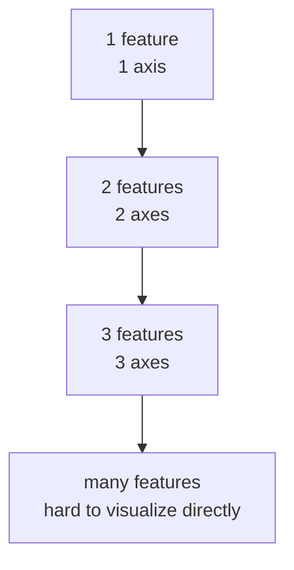
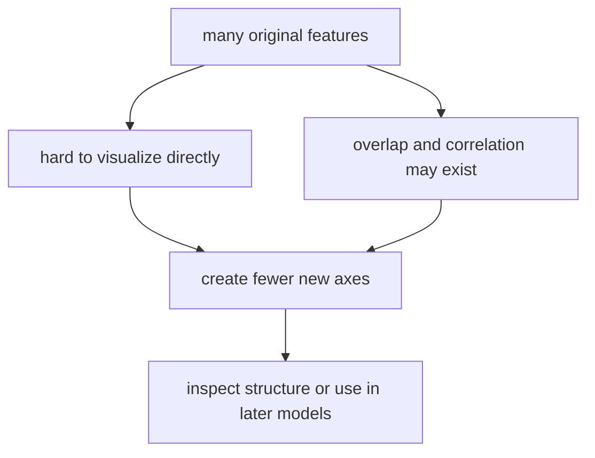
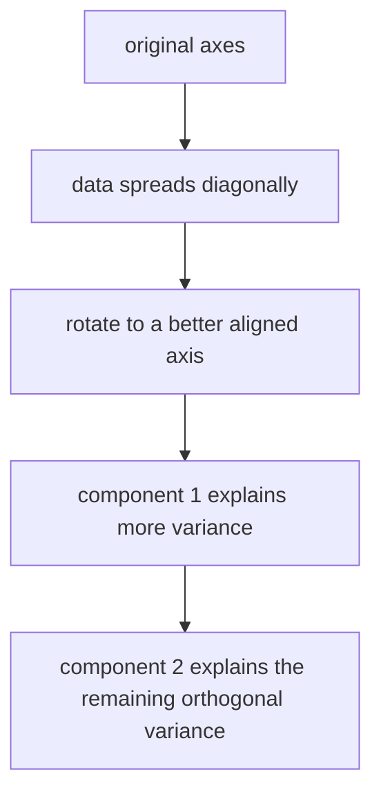
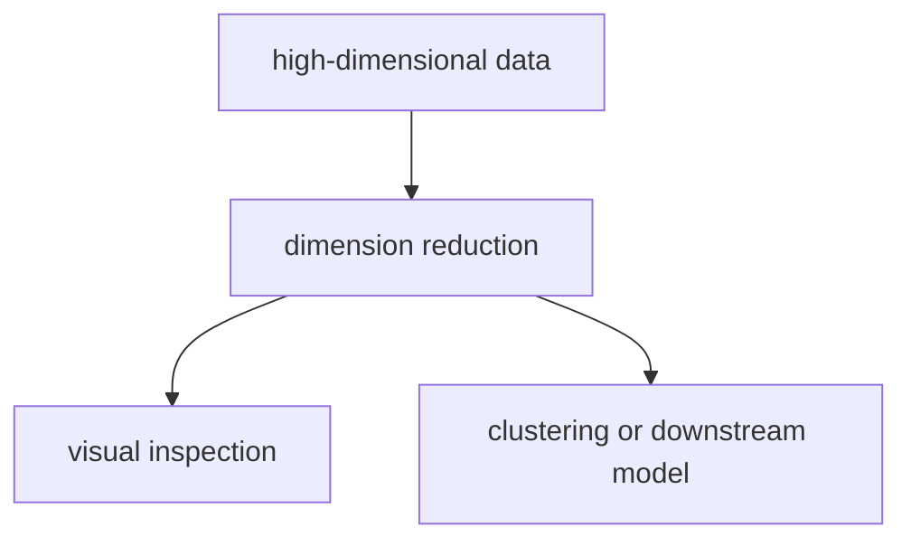

# P3-18.1 차원 축소(dimensionality reduction)

P3-17에서는 클러스터링(clustering)을 통해 라벨 없이 데이터 구조를 찾아보는 관점을 보았습니다. 이제 비슷한 비지도학습 흐름 안에서, 또 다른 중요한 질문으로 넘어갑니다.

특징(feature)이 너무 많을 때, 그 정보를 더 적은 축으로 줄여서 볼 수는 없을까?

이 질문이 차원 축소(dimensionality reduction)의 출발점입니다.

차원 축소는 많은 특징을 더 적은 수의 축이나 성분(component)으로 바꾸어, 구조를 더 단순하게 보고 계산을 더 다루기 쉽게 만들려는 방법이다.

즉, 차원 축소는 정보를 `없애는 일`이면서 동시에 `구조를 더 잘 보이게 만드는 일`이기도 합니다.

## 이 절의 범위

이 절은 다음 질문에 답합니다.

- 차원(dimension)은 머신러닝에서 무엇을 뜻하는가?
- 왜 특징 수가 많으면 학습과 해석이 어려워질 수 있는가?
- 차원 축소는 어떤 문제를 완화하려고 하는가?
- PCA(principal component analysis)는 어떤 대표 직관을 보여 주는가?
- 차원 축소는 무엇을 남기고 무엇을 버리는가?

이 절은 다음 내용은 깊게 다루지 않습니다.

- PCA의 고유값(eigenvalue), 고유벡터(eigenvector) 유도
- 커널 PCA(kernel PCA), Truncated SVD의 수학적 차이
- t-SNE, UMAP 같은 시각화 중심 기법의 세부 파라미터
- 재구성 오차(reconstruction error)의 엄밀한 계산

이 절은 입문적으로 `왜 차원을 줄이려 하는가`를 이해하는 데 집중합니다. 시각화와 정보 손실의 주의점은 P3-18.2에서 이어서 다룹니다.

## 이 절의 목표

- 차원 축소를 `특징 공간을 더 적은 축으로 다시 표현하는 일`로 설명할 수 있습니다.
- 특징 수가 많을 때 왜 해석과 계산이 어려워지는지 말할 수 있습니다.
- PCA를 `분산(variance)을 많이 설명하는 직교 축을 찾는 방법`으로 입문적으로 설명할 수 있습니다.
- 차원 축소가 편리함과 정보 손실을 함께 가져온다는 점을 이해할 수 있습니다.

## 왜 이 절이 필요한가

머신러닝을 계속 공부하다 보면 점점 특징(feature)이 많아집니다.

- 고객 데이터에는 수십 개의 수치 지표가 있을 수 있습니다.
- 문서 데이터에는 수천 개 단어 특징이 있을 수 있습니다.
- 이미지 데이터는 픽셀 수만큼 특징이 생깁니다.

이때 독자는 이런 감각을 느끼기 쉽습니다.

- 특징이 많을수록 더 자세한 것 아닌가?
- 그런데 왜 오히려 이해가 더 어려워지는가?

바로 여기서 차원 축소가 필요해집니다.

즉, 18.1은 `정보가 많아질수록 왜 단순화가 다시 필요해지는가`를 배우는 절입니다.

바로 앞의 클러스터링과 나란히 놓고 보면, 비지도학습 안에서도 붙잡는 질문이 다르다는 점이 먼저 보여야 합니다.

| 질문 | 클러스터링 | 차원 축소 |
| --- | --- | --- |
| 먼저 묻는 것 | 어떤 묶음이 숨어 있는가? | 어떤 축으로 다시 표현하면 더 잘 보이는가? |
| 바로 얻고 싶은 것 | 군집 구조, 이상치 후보 | 더 적은 성분, 더 읽기 쉬운 표현 |
| 다음 단계에서 자주 하는 일 | 군집 의미 해석, 세그먼트 검토 | 시각화, 잡음 완화, 후속 모델 입력 정리 |

즉, 클러스터링이 `묶음 찾기`에 가깝다면, 차원 축소는 `표현 다시 만들기`에 더 가깝습니다. 이 차이가 잡혀야 PCA도 또 하나의 알고리즘 이름이 아니라, `고차원 표현을 어떻게 읽기 쉬운 축으로 바꿀까`라는 질문의 대표 답으로 읽힙니다.

## 차원(dimension)은 무엇을 뜻하나

머신러닝 문맥에서 차원은 보통 데이터 한 샘플을 설명하는 축의 수, 즉 특징 수와 연결됩니다.

예를 들어 고객 한 명을 다음 세 숫자로 표현하면:

- 월 방문 수
- 평균 구매 금액
- 최근 로그인 일수

이 고객은 3차원 특징 공간 안의 한 점처럼 볼 수 있습니다.

즉, 차원은 수학적인 추상 개념이면서 동시에 `데이터를 설명하는 좌표 축의 개수`로 이해할 수 있습니다.

다음처럼 기억하면 충분합니다.

`특징이 하나 늘어날 때마다, 데이터를 보는 축이 하나 더 생긴다.`

이를 아주 단순하게 그리면 다음과 같습니다.



이 도식은 차원이 늘어날수록 데이터를 직접 그림처럼 상상하기 어려워진다는 점을 보여 줍니다. 특징 하나가 축 하나를 만든다는 감각만 잡아도, 왜 고차원 데이터에서 다시 요약 축이 필요해지는지 이해하기 쉬워집니다.

## 특징이 많아지면 왜 어려워지는가

특징이 많다는 것은 표현력이 커질 수 있다는 뜻이기도 하지만, 동시에 세 가지 어려움을 만듭니다.

1. 사람이 구조를 상상하기 어려워집니다.
2. 계산 비용이 커질 수 있습니다.
3. 불필요하거나 겹치는 정보가 많아질 수 있습니다.

예를 들어 2차원 점은 그림으로 바로 볼 수 있습니다. 하지만 50차원, 500차원, 5000차원 데이터는 직접 볼 수 없습니다. 결국 다른 방식으로 요약해야 합니다.

또 특징이 많으면 서로 비슷한 정보를 중복해서 담는 경우도 많습니다. 예를 들어:

- 월 구매 금액
- 연 구매 금액
- 구매 건수
- 평균 주문 금액

이런 값들은 서로 완전히 독립적이지 않을 수 있습니다.

즉, 차원 축소는 종종 `정말 새로운 정보가 얼마나 있는가`를 다시 묻는 과정입니다.

## 차원 축소는 무엇을 완화하려 하나

scikit-learn 사용자 가이드는 PCA를 다변량(multivariate) 데이터셋을 연속적인 직교 성분(orthogonal components)으로 분해해, 가장 많은 분산을 설명하는 방향을 찾는 방법으로 설명합니다.

입문적으로는 차원 축소를 다음 문제를 완화하려는 시도로 읽으면 좋습니다.

| 어려움 | 차원 축소가 주려는 도움 |
| --- | --- |
| 특징이 너무 많아 구조를 보기 어렵다 | 더 적은 축으로 요약해 본다 |
| 특징이 서로 겹친다 | 겹치는 변동을 몇 개 성분으로 묶어 본다 |
| 시각화가 어렵다 | 2차원, 3차원으로 내려서 대략 구조를 본다 |
| 계산이 무겁다 | 더 작은 표현으로 바꿔 후속 모델을 다루기 쉽게 한다 |

즉, 차원 축소는 `원래 데이터를 완전히 대체`하기보다 `더 읽기 쉬운 표현을 만드는 도구`로 이해하는 편이 안전합니다.

## 한 장면으로 먼저 보기



이 도식의 핵심은 차원 축소가 단순 삭제가 아니라 `새 축을 다시 만드는 재표현`이라는 점입니다. 특징이 너무 많아 직접 보기 어렵고, 서로 겹치는 정보도 있을 때, 더 적은 수의 축을 만들어 구조를 다시 해석하거나 후속 모델에 넘기게 됩니다.

이 그림의 핵심은 차원 축소가 원래 특징을 무작정 버리는 일이 아니라, `새로운 축으로 다시 보는 일`이라는 점입니다.

## PCA는 어떤 대표 직관을 보여 주는가

scikit-learn 문서는 PCA(principal component analysis)를 `가장 많은 분산을 설명하는 연속적인 직교 성분(successive orthogonal components)`을 찾는 방법으로 설명합니다.

다음처럼 이해하면 좋습니다.

`데이터가 가장 많이 퍼져 있는 방향을 첫 번째 축으로 잡고, 그다음 그와 직각인 방향 중에서 또 많이 퍼진 방향을 두 번째 축으로 잡는다.`

즉, PCA는 원래 축(x, y, z)을 그대로 쓰지 않고, 데이터가 실제로 많이 변하는 방향으로 축을 다시 돌려 잡는 감각에 가깝습니다.

## PCA를 더 쉽게 비유하면

많은 점이 비스듬한 타원 모양으로 퍼져 있다고 생각해 봅시다.

- 원래 x축, y축으로 보면 퍼짐이 어색하게 나뉩니다.
- 그런데 타원의 긴 방향을 새 축 1로 잡으면, 데이터 변동의 큰 흐름이 더 잘 보입니다.
- 타원의 짧은 방향을 새 축 2로 잡으면, 덜 중요한 흔들림을 분리해서 볼 수 있습니다.

즉, PCA는 `원래 좌표계보다 데이터 흐름에 더 잘 맞는 좌표계`를 찾으려는 시도입니다.

이를 도식으로 줄이면 다음과 같습니다.



이 도식은 PCA를 `데이터가 실제로 많이 퍼진 방향으로 축을 다시 돌려 잡는 과정`으로 읽게 해 줍니다. 원래 좌표축보다 데이터 흐름에 더 잘 맞는 축을 찾으면, 첫 번째 성분이 큰 변동을 더 효율적으로 설명할 수 있습니다.

## 왜 분산(variance)을 보나

P2와 P3 초반에서 보았듯, 분산은 값들이 얼마나 퍼져 있는지를 보여 주는 기본 감각입니다. PCA는 바로 이 퍼짐의 큰 방향을 먼저 잡으려 합니다.

여기서는 다음처럼 읽으면 좋습니다.

- 분산이 큰 방향: 데이터가 많이 달라지는 방향
- 분산이 작은 방향: 상대적으로 덜 중요한 흔들림일 수 있는 방향

물론 분산이 작다고 해서 항상 의미가 없는 것은 아닙니다. 하지만 차원을 줄일 때는 보통 `큰 변동을 먼저 남기고 작은 변동을 나중에 버릴 수 있는가`를 묻습니다.

즉, PCA는 `무엇이 더 많이 변하는가`를 기준으로 요약 우선순위를 정합니다.

우선순위 감각만 간단히 말하면, PCA는 전체 변동을 한 번에 다 보존하지 않고 먼저 가장 큰 변동을 설명하는 성분부터 남깁니다. 그다음 성분은 앞 성분과 겹치지 않는 방향에서 남은 변동을 설명합니다.

## 직교(orthogonal)한다는 말은 왜 나오나

scikit-learn 문서는 PCA 성분을 orthogonal components라고 설명합니다. 여기서 직교는 새 축들이 서로 겹치지 않도록, 즉 중복 설명을 줄이도록 잡힌다는 뜻으로 이해하면 좋습니다.

짧게 바꾸면:

`첫 번째 성분이 설명한 변동을 두 번째 성분이 그대로 다시 설명하지 않게 하려는 것이다.`

즉, PCA는 새로운 축을 만들되, 서로 다른 방향의 정보를 나누어 담게 하려는 방식입니다.

## 작은 숫자 예제로 축 줄이기 감각 보기

이번 예제는 두 특징이 거의 함께 움직일 때, 하나의 새로운 축으로도 큰 흐름을 어느 정도 요약할 수 있다는 감각을 보는 장난감 예제입니다.

- 문제 상황: 서로 비슷하게 움직이는 두 특징을 하나의 대표 축처럼 보고 싶다
- 입력(input): 두 개의 비슷한 특징 값
- 기대 출력(output): 두 특징을 하나의 합성 점수처럼 요약한 값
- 확인할 개념:
  - 새 축은 원래 특징을 조합해 만들어질 수 있다
  - 축을 줄이면 표현은 단순해지지만 세부 정보 일부는 잃을 수 있다

```python
samples = [
    {"x1": 2.0, "x2": 2.1},
    {"x1": 3.0, "x2": 3.2},
    {"x1": 4.0, "x2": 3.9},
    {"x1": 5.0, "x2": 5.1},
]

component_1_like = [
    round((row["x1"] + row["x2"]) / 2, 2)
    for row in samples
]

print("original samples :", samples)
print("reduced to 1 axis:", component_1_like)
```

실행 결과는 다음과 같습니다.

```text
original samples : [{'x1': 2.0, 'x2': 2.1}, {'x1': 3.0, 'x2': 3.2}, {'x1': 4.0, 'x2': 3.9}, {'x1': 5.0, 'x2': 5.1}]
reduced to 1 axis: [2.05, 3.1, 3.95, 5.05]
```

이 코드는 PCA 자체는 아닙니다. 하지만 독자에게 중요한 직관을 줍니다.

1. 원래 두 축이 함께 움직인다면 하나의 요약 축을 만들 수 있습니다.
2. 요약 축은 원래 특징을 조합한 새 표현일 수 있습니다.
3. 표현은 단순해지지만, 원래 각 축의 세부 차이는 줄어듭니다.

## 차원을 줄이면 무엇이 좋아지고 무엇이 사라지는가

차원 축소는 늘 교환(trade-off)을 만듭니다.

| 얻는 것 | 잃을 수 있는 것 |
| --- | --- |
| 더 단순한 표현 | 원래 특징별 세부 정보 |
| 더 쉬운 시각화 | 일부 미세한 차이 |
| 더 빠른 계산 | 해석의 직접성 |
| 중복 정보 압축 | 특정 축의 업무 의미 |

따라서 차원 축소를 본 뒤에는 늘 물어야 합니다.

`지금 단순해진 표현이, 내가 보려는 문제에 충분한가?`

즉, 차원 축소는 편리하지만 공짜는 아닙니다.

## 어디에서 많이 쓰이나

차원 축소는 보통 다음 같은 장면에서 자주 등장합니다.

| 업무 장면 | 차원 축소가 하는 일 |
| --- | --- |
| 시각화 준비 | 고차원 데이터를 2D/3D로 줄여 대략 구조를 본다 |
| 전처리(preprocessing) | 후속 모델 입력을 더 압축된 표현으로 바꾼다 |
| 노이즈 완화 시도 | 큰 변동을 먼저 남기고 작은 흔들림을 덜 강조해 본다 |
| 텍스트 / 이미지 요약 | 매우 많은 특징을 더 적은 성분으로 줄여 본다 |

즉, 차원 축소는 `최종 모델` 자체보다 `데이터를 다시 읽는 렌즈`로 먼저 쓰이는 경우가 많습니다.

## 클러스터링과 차원 축소는 어떻게 연결되나

17장에서 클러스터링을 봤고, 18장에서 차원 축소를 봅니다. 이 둘은 자주 함께 등장합니다.

- 차원 축소로 데이터를 2차원으로 내려서 군집 구조를 눈으로 봅니다.
- 반대로 군집을 더 잘 보이게 하려고 표현을 먼저 압축해 보기도 합니다.

scikit-learn 문서도 PCA가 K-means 같은 downstream 모델에 유용할 수 있음을 설명합니다.

즉, 차원 축소는 독립된 기법이면서 동시에 `후속 군집화나 시각화의 준비 단계`가 될 수 있습니다.

이 연결을 그림으로 줄이면 다음과 같습니다.



## 사례로 보기

### 사례 1. 수십 개 고객 지표를 한눈에 보기 어려워 먼저 몇 개 축으로 줄여 보고 싶을 때

고객 분석 팀이 방문 수, 구매 금액, 최근 접속, 반품 비율, 카테고리 선호도처럼 많은 지표를 한꺼번에 보고 있다고 해 보겠습니다. 숫자는 많지만 서로 비슷하게 움직이는 지표도 섞여 있어서, 원래 표만으로는 어떤 고객 흐름이 있는지 직관적으로 잡기 어렵습니다. 차원 축소는 이런 여러 지표를 몇 개의 새 축으로 다시 묶어, `활동성`, `구매 규모`, `최근성`처럼 큰 변동 흐름을 더 압축된 형태로 보게 도와줍니다. 그래서 팀은 원래 표에서는 보이지 않던 전체 구조를 먼저 보고, 이후 군집화나 후속 모델링에 쓸 표현을 더 단순하게 준비할 수 있습니다.

## 이 절에서 기억할 관점

- 차원은 데이터를 설명하는 축의 수, 즉 특징 수와 연결됩니다.
- 특징이 많을수록 표현력이 커질 수 있지만, 해석과 계산은 더 어려워질 수 있습니다.
- 차원 축소는 많은 특징을 더 적은 축으로 다시 표현하려는 시도입니다.
- PCA는 데이터 분산을 많이 설명하는 직교 성분을 찾는 대표적 방법입니다.
- 차원을 줄이면 구조를 보기 쉬워지지만, 일부 정보는 잃을 수 있습니다.

## 체크리스트

- 차원 축소를 `특징 공간을 더 적은 축으로 다시 표현하는 일`로 설명할 수 있는가?
- 특징이 많아질 때 왜 구조를 보기 어려워지는지 말할 수 있는가?
- PCA를 `분산이 큰 방향을 먼저 잡는 방법`으로 설명할 수 있는가?
- 직교 성분이 왜 중복 설명을 줄이는 감각과 연결되는지 이해했는가?
- 차원 축소가 편리함과 정보 손실을 함께 가져온다는 점을 알고 있는가?

## 출처와 참고 자료

- scikit-learn developers, `2.5. Decomposing signals in components (matrix factorization problems)`, scikit-learn User Guide, 확인 날짜: 2026-06-27. [https://scikit-learn.org/stable/modules/decomposition.html](https://scikit-learn.org/stable/modules/decomposition.html){: target="_blank" rel="noopener noreferrer" }
- scikit-learn developers, `PCA`, scikit-learn API Reference, 확인 날짜: 2026-06-27. [https://scikit-learn.org/stable/modules/generated/sklearn.decomposition.PCA.html](https://scikit-learn.org/stable/modules/generated/sklearn.decomposition.PCA.html){: target="_blank" rel="noopener noreferrer" }
