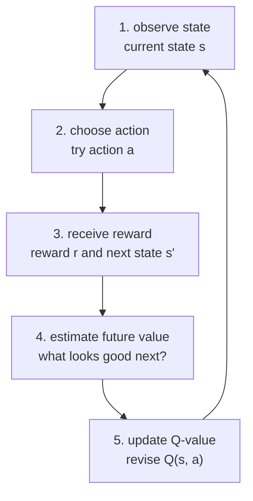
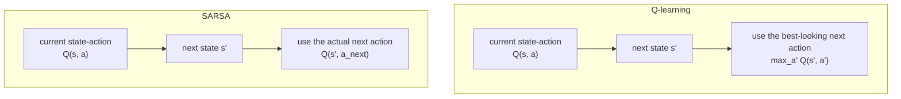

# P3-19.1 가치 기반 강화학습(value-based reinforcement learning)

P3-2.3에서는 강화학습(reinforcement learning)을 `행동(action)과 보상(reward)을 통해 정책(policy)을 조정하는 학습`으로 먼저 잡았습니다. 이제 그 안으로 한 단계 더 들어가 보겠습니다.

강화학습 알고리즘을 처음 만나면 질문이 바로 생깁니다.

- 어떤 상태(state)에서 어떤 행동이 좋은지, 모델은 무엇을 기준으로 배우는가?
- `좋다`는 것을 규칙처럼 적는가, 숫자로 적는가?
- Q-learning과 SARSA는 둘 다 강화학습이라는데 무엇이 다른가?

이 절은 그 질문에 답하는 첫 번째 절입니다.

가치 기반 강화학습은 어떤 상태에서 어떤 행동이 장기적으로 얼마나 좋은지 값을 붙여 가며 배우는 접근이다.

## 이 절의 범위

이 절은 다음 질문에 답합니다.

- 가치(value)를 배운다는 말은 무엇을 뜻하는가?
- 상태 가치(state value)와 행동 가치(action value)는 어떻게 다른가?
- Q-value는 왜 강화학습에서 중요한가?
- Q-learning과 SARSA는 어떤 점에서 닮았고, 어떤 점에서 다른가?
- 가치 기반 강화학습은 어떤 문제에 잘 맞고, 어디서 한계를 보이기 시작하는가?

이 절은 다음 내용은 깊게 다루지 않습니다.

- 벨만 방정식(Bellman equation)의 엄밀한 유도
- 수렴(convergence) 증명
- 함수 근사(function approximation)와 딥 Q-네트워크(DQN)
- policy gradient, actor-critic의 업데이트 절차

정책 기반 강화학습(policy-based reinforcement learning)은 P3-19.2에서 이어서 다룹니다. 보상 설계, 탐험 비용, 현실 적용의 주의점은 P3-19.3에서 다시 정리합니다.

## 이 절의 목표

- 가치 기반 강화학습을 `행동의 장기적 좋음을 숫자로 배우는 접근`으로 설명할 수 있습니다.
- 상태 가치(state value)와 행동 가치(action value)를 구분할 수 있습니다.
- Q-learning이 `다음 상태에서 가장 좋아 보이는 행동`을 기준으로 갱신한다는 점을 말할 수 있습니다.
- SARSA가 `실제로 다음에 선택한 행동`을 기준으로 갱신한다는 점을 말할 수 있습니다.
- 두 알고리즘의 차이가 학습 태도의 차이와 연결된다는 점을 이해할 수 있습니다.

## 왜 가치(value)를 배우려 하는가

강화학습 문제에서는 매번 정답 라벨이 주어지지 않습니다. 대신 에이전트(agent)는 행동을 해 보고, 보상(reward)을 받고, 다음 상태(next state)를 경험합니다.

이때 직접 정책(policy)부터 쓰는 대신, 먼저 `이 행동이 얼마나 괜찮았는가`를 숫자로 적어 두면 여러 장점이 생깁니다.

- 행동을 비교하기 쉬워집니다.
- 아직 완성되지 않은 정책도 점진적으로 개선할 수 있습니다.
- 같은 상태에서 여러 행동 후보를 상대적으로 읽을 수 있습니다.

즉, 가치 기반 강화학습은 `무엇을 할지 바로 외우기`보다 `무엇이 더 좋은지 먼저 점수화하기`에 가깝습니다.

식당 추천 비유로 보면 다음과 같습니다.

- 정책(policy): 지금 이 동네에서 어디로 갈지 바로 결정하는 방식
- 가치(value): 이 선택이 장기적으로 얼마나 만족스러울지에 대한 예상 점수

독자에게는 이 차이가 중요합니다. 가치 기반 강화학습은 행동 규칙을 바로 외우기보다, `행동의 예상 점수판`을 먼저 만든다고 이해하면 읽기 쉬워집니다.

## 상태 가치와 행동 가치는 다르다

강화학습 책과 논문에서는 가치(value)라고만 쓰지 않고, 보통 두 가지를 나눠 말합니다.

| 용어 | 영어 | 쉬운 뜻 |
| --- | --- | --- |
| 상태 가치 | state value | 이 상태에 와 있는 것이 전반적으로 얼마나 좋은가 |
| 행동 가치 | action value | 이 상태에서 이 행동을 하는 것이 얼마나 좋은가 |

예를 들어 미로 게임을 생각해 봅니다.

- 출구 바로 앞 칸은 상태 가치가 높을 수 있습니다.
- 하지만 그 칸에서도 벽 쪽으로 움직이는 행동은 행동 가치가 낮을 수 있습니다.

즉, `좋은 상태 안에도 나쁜 행동이 있을 수 있다`는 점 때문에 행동 가치(action value)가 특히 중요해집니다.

## Q-value는 무엇을 적는가

행동 가치(action value)는 보통 Q-value라고 씁니다. `Q(s, a)`는 상태 `s`에서 행동 `a`를 했을 때 기대하는 장기 보상(expected long-term return)을 뜻합니다.

여기서 여기서 중요한 것은 수식보다 해석입니다.

`Q-value는 지금 이 상태에서 이 행동을 선택하면, 앞으로 얼마나 괜찮은 결과가 이어질지에 대한 예상 점수다.`

즉, Q-table이나 Q-function은 다음 질문에 답하려는 시도입니다.

- 지금 여기서 위로 가는 것이 좋은가?
- 아래로 가는 것이 좋은가?
- 당장은 손해처럼 보여도 나중에 더 큰 보상을 만드는가?

이를 작은 표로 그리면 다음과 같습니다.

| 상태(state) | 행동(action) | 현재 Q-value 해석 |
| --- | --- | --- |
| 출발 위치 | 오른쪽 | 출구 쪽이라 비교적 높음 |
| 출발 위치 | 왼쪽 | 막다른 길이라 낮음 |
| 출구 앞 | 앞으로 | 도착 보상에 가까워 높음 |
| 출구 앞 | 뒤로 | 멀어지므로 낮음 |

## 가치 기반 강화학습의 기본 루프

가치 기반 강화학습의 핵심은 `행동하고, 결과를 보고, 가치 표를 조금 수정하는 반복`입니다.



이 도식은 가치 기반 강화학습을 `행동 결과를 본 뒤 점수표를 조금씩 고쳐 가는 반복`으로 읽게 해 줍니다. 정책 전체를 한 번에 완성하는 것이 아니라, 상태-행동 값이 루프를 돌며 점진적으로 조정된다는 점이 핵심입니다.

이 루프는 P3-2.3에서 본 강화학습의 일반 루프보다 한 단계 더 구체적입니다. 여기서는 정책 전체를 한 번에 바꾸는 대신, `Q(s, a)` 같은 값 추정을 계속 손보는 데 초점이 있습니다.

## Q-learning은 무엇을 배우나

Q-learning은 가장 널리 알려진 가치 기반 강화학습 알고리즘입니다. 핵심 생각은 단순합니다.

`다음 상태에 도착했을 때, 거기서 가장 좋아 보이는 행동의 값을 기준으로 현재 행동의 가치를 수정한다.`

즉, Q-learning은 다음 상태에서 `실제로 무엇을 했는가`보다 `가장 좋아 보이는 선택이 무엇인가`를 기준으로 업데이트합니다.

이 점 때문에 Q-learning은 보통 `오프-정책(off-policy)` 알고리즘으로 소개됩니다. 이렇게 읽으면 충분합니다.

`현재 실제 행동 흐름과는 조금 떨어져서, 다음 상태에서 가장 좋아 보이는 선택을 기준으로 배우는 방식`

작은 미로 예시로 보면:

- 지금은 탐험 때문에 아래로 움직였더라도
- 업데이트할 때는 `다음 상태에서 사실 가장 좋은 행동은 오른쪽이었다`를 기준으로 현재 값을 조정할 수 있습니다.

즉, Q-learning은 다소 낙관적으로 `앞으로 가장 잘할 수 있다고 가정한 경로`를 반영합니다.

## SARSA는 무엇을 배우나

SARSA도 가치 기반 강화학습 알고리즘입니다. 이름은 상태(state), 행동(action), 보상(reward), 다음 상태(state), 다음 행동(action)의 머리글자에서 왔습니다.

SARSA의 핵심 생각은 Q-learning과 비슷하지만 기준이 다릅니다.

`다음 상태에서 실제로 선택한 행동을 기준으로 현재 행동의 가치를 수정한다.`

즉, SARSA는 `가장 좋아 보이는 행동`이 아니라 `내가 실제로 이어서 취한 행동`을 반영합니다.

이 점 때문에 SARSA는 보통 `온-정책(on-policy)` 알고리즘으로 설명됩니다. 이렇게 읽으면 충분합니다.

`내가 실제로 따르고 있는 행동 방식 안에서 배우는 방식`

예를 들어 탐험 때문에 다소 위험한 행동을 계속 섞어 쓰고 있다면, SARSA는 그 탐험 성향까지 포함한 실제 경로를 기준으로 배웁니다.

## Q-learning과 SARSA 차이

둘 다 Q-value를 갱신하지만, 다음 값을 어디에서 가져오느냐가 다릅니다.



이 도식은 Q-learning과 SARSA의 차이를 시각적으로 나눠 보여 줍니다. 둘 다 다음 상태를 보지만, 하나는 `가장 좋아 보이는 다음 행동`을 기준으로 하고 다른 하나는 `실제로 이어서 한 다음 행동`을 기준으로 값을 고친다는 점이 다릅니다.

이를 표로 줄이면 다음과 같습니다.

| 항목 | Q-learning | SARSA |
| --- | --- | --- |
| 다음 값 기준 | 다음 상태에서 가장 큰 Q-value | 다음 상태에서 실제 선택한 행동의 Q-value |
| 학습 태도 | 더 낙관적일 수 있음 | 실제 행동 흐름을 더 직접 반영 |
| 자주 붙는 설명 | off-policy | on-policy |

독자에게는 용어보다 감각이 더 중요합니다.

- Q-learning: `이론상 가장 좋아 보이는 다음 선택`을 반영
- SARSA: `실제로 내가 이어서 한 다음 선택`을 반영

## 왜 이 차이가 중요한가

이 차이는 특히 위험한 행동이 섞인 환경에서 해석 차이를 만듭니다.

예를 들어 미로 옆에 큰 벌점이 있는 낭떠러지가 있다고 생각해 봅니다.

- Q-learning은 `최적으로만 움직인다면 괜찮다`는 쪽으로 값을 키우기 쉽습니다.
- SARSA는 `실제로 탐험하다가 실수할 수도 있다`는 점을 더 반영할 수 있습니다.

즉, SARSA는 현재 행동 정책이 조심스럽지 않다면 그 조심스럽지 않은 현실도 같이 배웁니다. 이 때문에 입문 교재에서는 SARSA가 더 보수적(conservative)으로 보일 수 있다고 설명하는 경우가 많습니다.

## 어디에 쓰이는가

가치 기반 강화학습은 상태와 행동 수가 비교적 명확하고, 행동의 결과를 반복 실험할 수 있는 문제에서 직관을 주기 좋습니다.

- 격자 미로와 게임 이동
- 단순 로봇 경로 탐색
- 자원 배분의 장난감 시뮬레이션
- 순차 선택 문제의 입문 예제

실무에서는 문제 규모가 커지면 단순 Q-table만으로는 상태 수를 감당하기 어렵습니다. 그때는 함수 근사(function approximation), 신경망, 더 복잡한 정책 기반 기법으로 넘어가게 됩니다. 이 연결은 Part 4와 Part 5에서 다시 중요해집니다.

## 작은 Python 예제로 업데이트 감각 보기

이번 예제의 목표는 강화학습 전체를 구현하는 것이 아니라, `Q-learning과 SARSA가 같은 경험을 조금 다르게 읽는다`는 점을 숫자로 확인하는 것입니다.

입력은 다음과 같습니다.

- 현재 상태 `S0`
- 현재 행동 `right`
- 즉시 보상 `+1`
- 다음 상태 `S1`
- 현재 Q-table의 값들

출력은 다음 두 가지입니다.

- Q-learning이 계산한 업데이트 결과
- SARSA가 계산한 업데이트 결과

```python
alpha = 0.5
gamma = 0.9

q_table = {
    ("S0", "right"): 0.40,
    ("S1", "up"): 0.80,
    ("S1", "down"): 0.30,
}

state = "S0"
action = "right"
reward = 1.0
next_state = "S1"
actual_next_action = "down"

old_value = q_table[(state, action)]

# Q-learning: next state에서 가장 큰 값을 사용
best_next_value = max(
    q_table[(next_state, "up")],
    q_table[(next_state, "down")],
)
q_learning_target = reward + gamma * best_next_value
q_learning_updated = old_value + alpha * (q_learning_target - old_value)

# SARSA: 실제 다음 행동의 값을 사용
actual_next_value = q_table[(next_state, actual_next_action)]
sarsa_target = reward + gamma * actual_next_value
sarsa_updated = old_value + alpha * (sarsa_target - old_value)

print("old Q(S0, right) =", round(old_value, 3))
print("Q-learning target =", round(q_learning_target, 3))
print("Q-learning updated =", round(q_learning_updated, 3))
print("SARSA target =", round(sarsa_target, 3))
print("SARSA updated =", round(sarsa_updated, 3))
```

실행 결과는 다음처럼 읽을 수 있습니다.

```text
old Q(S0, right) = 0.4
Q-learning target = 1.72
Q-learning updated = 1.06
SARSA target = 1.27
SARSA updated = 0.835
```

여기서 중요한 점은 두 알고리즘이 같은 현재 경험에서 출발했는데도, 다음 값을 읽는 기준이 달라 결과가 달라진다는 점입니다.

- Q-learning은 `S1에서 가장 좋아 보이는 행동(up)`의 값 `0.8`을 사용했습니다.
- SARSA는 `S1에서 실제로 택한 행동(down)`의 값 `0.3`을 사용했습니다.

따라서 Q-learning 쪽 업데이트가 더 크게 올라갔습니다.

## 이 절에서 기억할 관점

- 가치 기반 강화학습은 정책을 바로 외우기보다, 상태와 행동의 장기적 좋음을 값으로 배우는 접근입니다.
- 상태 가치(state value)와 행동 가치(action value)는 다르며, 행동을 고르려면 보통 행동 가치가 더 직접적입니다.
- Q-value는 `이 상태에서 이 행동을 하면 앞으로 얼마나 괜찮은가`를 적는 예상 점수입니다.
- Q-learning은 `가장 좋아 보이는 다음 행동`을 기준으로 배우고, SARSA는 `실제로 다음에 한 행동`을 기준으로 배웁니다.
- 이 차이는 탐험이 섞인 현실적 행동 흐름을 얼마나 직접 반영하느냐와 연결됩니다.

## 체크리스트

- 가치 기반 강화학습을 `행동의 장기적 좋음을 숫자로 배우는 방식`으로 설명할 수 있는가?
- 상태 가치와 행동 가치를 구분할 수 있는가?
- Q-value가 어떤 질문에 답하려는 값인지 말할 수 있는가?
- Q-learning과 SARSA의 차이를 `best next action`과 `actual next action`의 차이로 설명할 수 있는가?
- 두 알고리즘이 같은 경험에서도 다른 업데이트를 만들 수 있음을 이해했는가?
- 정책 기반 강화학습은 다음 절(P3-19.2)에서 이어진다는 흐름을 알고 있는가?

## 출처와 참고 자료

- Richard S. Sutton and Andrew G. Barto, `Reinforcement Learning: An Introduction`, 2nd ed., The MIT Press, 2018, 확인 날짜: 2026-06-27. [https://mitpress.mit.edu/9780262039246/reinforcement-learning/](https://mitpress.mit.edu/9780262039246/reinforcement-learning/){: target="_blank" rel="noopener noreferrer" }
- Christopher J. C. H. Watkins, Peter Dayan, `Q-learning`, Machine Learning, 1992, 확인 날짜: 2026-06-27. [https://link.springer.com/article/10.1007/BF00992698](https://link.springer.com/article/10.1007/BF00992698){: target="_blank" rel="noopener noreferrer" }
- Satinder Singh, Tommi Jaakkola, Michael L. Littman, Csaba Szepesvari, `Convergence Results for Single-Step On-Policy Reinforcement-Learning Algorithms`, Machine Learning, 2000, 확인 날짜: 2026-06-27. [https://link.springer.com/article/10.1023/A:1022689125041](https://link.springer.com/article/10.1023/A:1022689125041){: target="_blank" rel="noopener noreferrer" }
