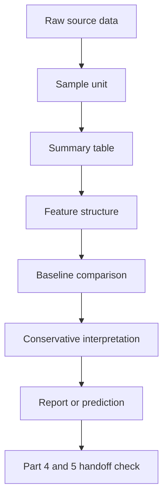

# Part 3. 데이터 모델링

> Section ID: `P3-index`
> Version: `v2026.07.07`

Part 2에서 우리는 수학, Python, 배열, 표, 그래프를 다시 읽는 기초를 복구했습니다. 그러나 계산 도구를 다시 읽을 수 있게 되었다고 해서 곧바로 AI 문제를 제대로 만들 수 있는 것은 아닙니다. 실제 원천데이터를 만나면 먼저 부딪히는 질문은 `어떤 모델을 쓸까`보다 `무엇을 한 건의 데이터로 볼까`에 가깝습니다.

Part 3의 대표 사례는 특정 장비 이름보다 더 일반적인 구조로 설명합니다. 자동으로 실행되는 동작 1회가 있고, 그 동작에서 사용한 제어 파라미터 시계열과 동작 중 관측된 센서 데이터 시계열이 함께 남고, 여러 동작을 다시 묶어 최근 구간과 기준선으로 비교하는 구조입니다. 이때 한 시점의 측정값 하나를 샘플로 볼 수도 있고, 동작 1회를 샘플로 볼 수도 있고, 여러 동작을 묶은 최근 구간을 샘플로 볼 수도 있습니다. 어떤 선택을 하느냐에 따라 만들어지는 데이터셋, 비교 방식, 해석 가능한 질문, 그리고 실제 행동이 몇 갈래로 나뉘는지에 대한 운영 흐름 구조가 모두 달라집니다. 같은 원천데이터라도 어떻게 묶고, 무엇을 남기고, 무엇과 비교하고, 어떤 행동 흐름 구조로 넘길지에 따라 전혀 다른 AI 문제가 됩니다.

이 책의 전체 구조에서는 Part 2와 Part 3이 함께 기본기 점검 구간을 이룹니다. Part 2가 계산과 표현 도구를 복구했다면, Part 3은 그 도구로 데이터과학 문제 구조를 어떻게 다시 세울지 복구합니다.

Part 3은 바로 그 지점을 다룹니다. 여기서 데이터 모델링은 저장 구조를 정리하는 일만을 뜻하지 않습니다. 데이터 모델링은 현실에서 발생한 원천데이터를 사람이 비교하고 AI가 활용할 수 있는 샘플, 특징, 기준선, 출력 구조로 다시 표현하는 일입니다. 더 정확히 말하면 `주어진 표를 읽는 일`이 아니라 `어떤 사건을 한 샘플로 볼지`, `원시 로그를 어떤 요약 표로 다시 묶을지`, `어떤 특징과 비교 구조를 남길지`, `어디까지 보수적으로 말할지`, `무엇을 아직 비교 리포트로 남기고 무엇을 예측 문제로 올릴지`를 설계하는 일에 가깝습니다.

Part 3은 데이터과학 커리큘럼에서 따로따로 보이는 데이터 정리(data wrangling), 특징 설계(feature engineering), 샘플 설계(sample design), 추론(inference), 문제 구조화(problem framing)를 재학습 흐름으로 다시 묶어 설명합니다. 여기서는 이 항목들을 이름별 절차로 나열하지 않고, 하나의 사례를 따라 `무엇을 샘플로 만들고`, `어떤 표로 다시 묶고`, `무엇과 비교하고`, `어디까지 말할 수 있는가`를 차례로 확인합니다. 따라서 Part 3의 초점은 알고리즘보다 먼저 `문제 표현 구조`를 세우는 데 있습니다.

이렇게 정리한 구조는 뒤 Part의 전제가 됩니다. Part 4는 이 구조 위에서 입력 `X`, 목표 `y`, 분할(split), 평가(evaluation), 일반화(generalization)를 읽고, Part 5는 같은 구조를 더 긴 시계열 입력과 표현 학습으로 확장합니다.

Part 3 안에서는 `데이터 모델링` 자체의 큰 정의를 3.1에서 먼저 잡고, 3.2에서 진행 순서를 고정합니다. 이후 Section에서는 같은 용어의 상세 정의를 반복하기보다 현재 질문에 필요한 최소 연결만 남깁니다. `샘플`, `특징`, `기준선`, `비교 리포트`, `타깃`의 위치가 다시 헷갈릴 때는 [개념사전](../../reference/concept-glossary.md)의 `중심 Section`과 `등장 Section`이 기준 참조점이 됩니다.

Part 3에서는 먼저 데이터 모델링이 무엇을 달성하려는지와 어떤 순서로 진행되는지부터 고정합니다. 그 다음 저장된 기록을 왜 곧바로 데이터셋처럼 읽으면 안 되는지 확인하고, 한 행과 한 샘플의 뜻을 정한 뒤, 원시 로그를 비교 가능한 표로 다시 묶습니다. 이어서 특징과 중간 표현을 설계하고, 어떤 열이 식별용인지, 어떤 열이 비교용인지, 어떤 열이 목표 후보인지 같은 열 역할도 분리합니다. 그 다음 최근 구간과 기준선을 비교하는 구조를 세우고, 적은 표본과 흔들리는 반복성 앞에서 어디까지 해석할 수 있는지 경계를 둡니다. 마지막 Chapter에서는 비교 리포트와 목표 후보를 구분하고, 뒤 Part로 넘어가기 전에 `입력과 결과`, `표 입력과 시계열 입력`, `미래 정보와 운영 시점 재현 가능성` 같은 최소 전제를 함께 닫습니다.

## Part 3의 목적

- 데이터 모델링을 DB 설계로만 오해하지 않게 한다.
- 원천데이터를 샘플, 요약 표, 특징, 기준선으로 다시 표현하는 흐름을 익히게 한다.
- 데이터 정리, 특징 공학, 보수적 해석, 문제 설정이 하나의 흐름임을 이해하게 한다.
- Part 4에서 다룰 머신러닝과 데이터 과학 절차, 즉 입력 `X`, 목표 `y`, 분할, 평가, 일반화가 기대는 데이터 표현 전제를 먼저 세운다.
- Part 5에서 다룰 시계열 딥러닝과 표현 학습이 기대는 입력 구조 전제도 먼저 세운다.

## 왜 필요한가

- 원시 로그가 곧바로 데이터셋이 아니라는 점을 먼저 배워야 하기 때문이다.
- 샘플 단위와 비교 기준이 정해지지 않으면 feature와 label 설명이 흔들리기 때문이다.
- 경고 후보와 진단 확정, 기준선 비교와 절대값 판단을 자주 혼동하기 때문이다.
- 같은 평균이라도 구간 패턴과 변동성은 다를 수 있는데, 대표값 하나로 너무 빨리 단정하기 쉽기 때문이다.
- Part 4의 분할, 평가, 일반화도 결국 잘 정리된 샘플 구조와 목표 구조를 전제로 읽히기 때문이다.
- 딥러닝을 쓰더라도 어떤 구간을 한 입력으로 묶을지 먼저 정하지 않으면 Part 5의 시계열 모델 설명도 공중에 뜨기 때문이다.

## 주요 질문

- 데이터 모델링은 데이터과학 전체 흐름에서 어떤 역할을 맡는가
- 저장된 기록은 왜 곧바로 데이터셋이 아닌가
- 한 행과 한 샘플은 어떻게 다르며, 어떤 표 구조가 필요한가
- 특징과 중간 표현은 무엇을 남기기 위해 설계하는가
- 기준선과 비교 구조는 왜 모델보다 먼저 정해져야 하는가
- 표본 수와 반복성 앞에서 어디까지 해석할 수 있는가
- 무엇을 비교 리포트로 두고 무엇을 학습 문제로 넘겨야 하는가

## 읽는 순서

Part 3은 다음 9개 Chapter 흐름을 의도적으로 따릅니다.

1. 데이터 모델링이 무엇을 달성하고 어디까지 맡는지 고정한다.
2. 데이터 모델링을 어떤 순서로 진행할지 고정한다.
3. 저장된 기록을 데이터셋 후보로 다시 보는 관점을 세운다.
4. 한 행, 한 샘플, 표 구조를 정한다.
5. 원시 로그를 비교 가능한 표로 다시 묶는다.
6. 특징과 중간 표현을 설계한다.
7. 기준선과 비교 구조를 만든다.
8. 해석 경계를 세운다.
9. 비교 리포트와 예측 문제를 구분하고, 뒤 Part로 넘길 최소 전제를 함께 닫는다.

이 순서를 지키는 이유는 저장 구조를 문제 구조로 바꾸기 전에 feature와 label을 말하면 용어가 공중에 뜨고, 해석 경계가 세워지기 전에 예측 문제부터 꺼내면 데이터 구조보다 모델 이름이 먼저 보이기 쉽기 때문입니다.

아래 표는 Part 3 전체 흐름을 한 줄씩 요약한 지도입니다.

| Chapter 역할 | 중심 질문 | 대표 결과 구조 |
| --- | --- | --- |
| 목표와 범위 고정 | 데이터 모델링은 무엇을 달성하고 어디까지 맡는가 | 문제 구조 설계의 위치 |
| 진행 순서 고정 | 어떤 순서로 모델링 판단을 진행할 것인가 | 작업 순서 지도 |
| 데이터셋 후보 만들기 | 저장된 기록을 어떻게 다시 읽을 것인가 | 원천데이터와 문제 표현 구조의 구분 |
| 샘플과 표 구조 정하기 | 한 행과 한 샘플은 무엇을 뜻하는가 | 동작 단위 표, 요약 표, 집계 표, 대표성 범위 메모 |
| 원시 로그 재구성 | 비교 가능한 표는 어떻게 다시 묶는가 | 요약 표, 비교 표, 누락/샘플 붕괴 구분 |
| 특징 설계 | 무엇을 남겨야 비교와 학습이 가능한가 | 특징 열, 중간 표현, 열 역할 구분, 단위와 구조 역할 구분, 특징 정의 일치 점검 |
| 비교 구조 설계 | 최근 상태를 무엇과 비교할 것인가 | 기준선, 최근 구간 비교표 |
| 해석 경계 세우기 | 어디까지 말하고 어디서 멈출 것인가 | 보수적 문장, 검토 필요 표기, 우선순위 후보 축, 구조화된 운영 출력 초안 |
| 문제 유형 구분과 뒤 Part 연결 | 무엇을 리포트로 두고 무엇을 예측 문제로 올리며, 무엇을 뒤 Part 전제로 닫아 두어야 하는가 | 경고, 검토 후보, 라벨 예측 구분, 산출물 간 추적 기준, 라벨 후보 일관성 메모, 입력/결과 구분, 표 벡터와 시계열 입력 표현 구분, 미래 정보 누수 방지, 운영 시점 재현성, cutoff와 horizon |

이 흐름은 아래처럼 하나의 파이프라인으로도 읽을 수 있습니다.

이 도식에서 중요한 점은 `모델`이 아직 중간에 등장하지 않는다는 사실입니다. 먼저 원천데이터를 어떤 샘플 단위로 읽을지 정하고, 그 샘플을 어떤 표와 특징으로 표현할지 정한 뒤에야, 비교 리포트로 남길 문제와 예측 문제를 나눌 수 있습니다.

Part 3에서 반복해서 다루는 질문은 몇 갈래로 묶입니다. 무엇을 한 샘플로 볼지, 원시 로그를 어떤 표로 다시 묶을지, 어떤 특징과 기준선을 남길지, 어디까지를 비교 리포트로 두고 어디부터를 목표 후보로 올릴지, 뒤 Part로 넘길 입력 구조와 관측 경계가 닫혔는지입니다. 각 Chapter는 이 질문 묶음 가운데 하나를 더 분명하게 만드는 역할을 맡습니다.

## 범위와 비범위

Part 3에서는 샘플 단위, 원시 로그와 요약 표, 특징과 중간 표현, 기준선 비교, 표본 수와 반복성, 경고 후보와 라벨 예측의 경계를 다룹니다.

반면 특정 머신러닝 알고리즘의 학습 방식과 train/validation/test 분리의 세부 절차는 Part 4에서, 복잡한 시계열 딥러닝 구조는 Part 5에서 다시 다룹니다.

이 생략은 회피가 아니라 역할 분리입니다. Part 3의 책임은 `어떤 데이터를 어떤 구조로 만들어야 하는가`를 먼저 분명히 하는 데 있습니다.

## 앞선 Part와의 연결

Part 2가 계산과 표현 도구를 복구했다면, Part 3은 그 도구로 `무엇을 어떤 구조로 표현할 것인가`를 정합니다. 표, 배열, 요약 통계, 시각화는 여기서 비로소 `문제 표현 도구`로 쓰이기 시작합니다.

## 이후 Part로의 연결

Part 3이 끝나면 Part 4에서는 이렇게 정리한 특징 표와 목표 후보를 바탕으로 학습, 분할, 평가를 읽고, Part 5에서는 같은 구조를 더 긴 시계열 입력과 표현 학습으로 확장합니다. 따라서 이 Part의 마무리는 뒤 Part 설명을 미리 대신하는 일이 아니라, 두 Part가 기대는 입력 구조와 문제 경계를 먼저 닫아 두는 일입니다.

## Part 3을 읽고 나면 생겨야 할 이해

데이터셋은 주어진 표가 아니라 설계된 비교 구조이며, 머신러닝은 그 구조 위에서만 제대로 읽힌다는 감각이 남아야 합니다.
