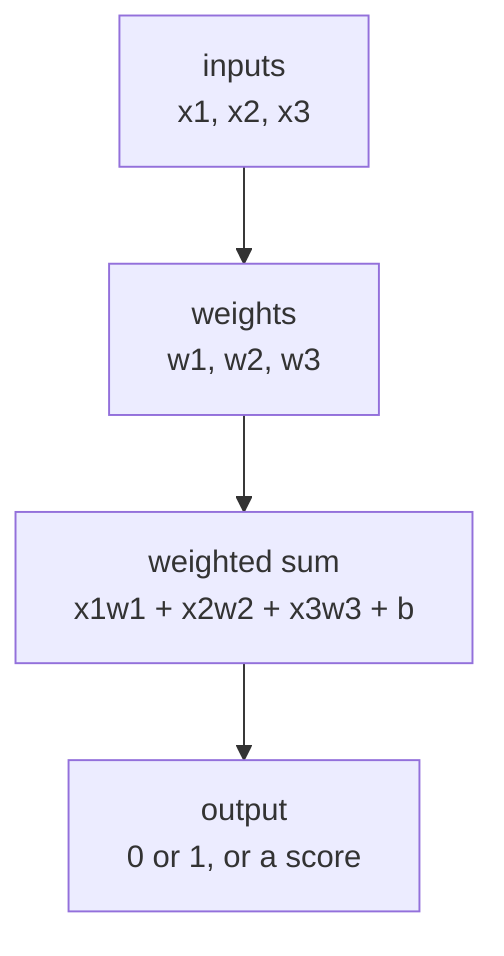

# P4-1.1 퍼셉트론(perceptron)의 직관

Part 3에서는 머신러닝을 문제 정의, 데이터 분리, 일반화, 평가, 모델 선택의 흐름으로 읽었습니다. 이제 Part 4에서는 질문이 조금 달라집니다.

모델이 값을 받아서 출력을 만드는 가장 작은 신경망 계산 단위는 어떻게 생겼는가?

이 질문에서 시작하는 것이 퍼셉트론(perceptron)입니다.

퍼셉트론은 여러 입력(input)에 서로 다른 중요도(weight)를 곱해 합친 뒤, 그 결과를 기준으로 출력을 내는 가장 단순한 신경망 판단 단위이다.

## 이 절의 범위

이 절은 다음 질문에 답합니다.

- 퍼셉트론은 어떤 역사적 맥락에서 등장했는가?
- 입력(input), 가중치(weight), 합(sum), 출력(output)은 어떤 흐름으로 이어지는가?
- 퍼셉트론을 왜 신경망(neural network)의 출발점처럼 다루는가?
- 퍼셉트론 계산을 작은 숫자 예제로 어떻게 확인할 수 있는가?

이 절에서는 다음 내용을 깊게 다루지 않습니다.

- 선형 결합(linear combination)의 기하학적 의미
- 활성화 함수(activation function)의 종류 비교
- 퍼셉트론의 표현 한계와 XOR 문제
- 다층 신경망(multilayer neural network)의 필요성

선형 결합의 기하학적 의미와 퍼셉트론 경계의 직관은 P4-1.2에서 바로 이어서 다루고, XOR 문제와 다층 신경망의 필요성은 P4-2.1, P4-2.2에서 다시 연결합니다. 활성화 함수 종류 비교는 P4-3.1, P4-3.2에서 따로 봅니다.

## 이 절의 목표

- 퍼셉트론을 `입력값을 가중합으로 모아 판단하는 단위`로 설명할 수 있습니다.
- 가중치(weight)가 입력마다 중요도를 다르게 주는 값이라는 점을 말할 수 있습니다.
- 퍼셉트론이 선형 모델과 신경망 사이의 연결 고리처럼 보인다는 점을 이해할 수 있습니다.
- 실행 가능한 Python 예제로 퍼셉트론의 순전파(forward pass) 계산을 확인할 수 있습니다.

## 왜 퍼셉트론부터 시작하는가

딥러닝(deep learning)은 결국 많은 층(layer)의 신경망을 다루는 이야기입니다. 하지만 처음부터 깊은 네트워크를 보면 계산이 복잡해 보이고, 왜 이런 구조가 필요한지도 흐려집니다.

그래서 가장 작은 단위부터 봐야 합니다.

- 입력이 들어오고
- 각 입력에 중요도가 붙고
- 합쳐진 결과를 보고
- 어떤 출력을 내는가

이 단순한 흐름이 퍼셉트론 안에 이미 들어 있습니다.

즉, 퍼셉트론은 `신경망이 무엇을 계산하는가`를 처음 읽기 위한 출발점입니다.

## 역사적 배경

퍼셉트론이라는 이름은 Frank Rosenblatt의 1958년 논문에서 널리 알려졌습니다. 이 시기 연구의 핵심 생각은 단순했습니다.

`여러 입력 신호를 받아, 어떤 기준을 넘으면 반응하도록 만들 수 있는가?`

이 관점은 더 앞선 McCulloch와 Pitts의 1943년 인공 뉴런(artificial neuron) 모형과도 이어집니다. 다음 정도로만 기억하면 충분합니다.

- McCulloch-Pitts: 뉴런을 매우 단순한 논리적 반응 단위로 본 초기 관점
- Rosenblatt perceptron: 입력과 가중치를 두고 학습 가능한 판단 장치로 발전시킨 초기 관점

즉, 퍼셉트론은 오늘날 딥러닝의 모든 구조를 설명하는 완성형 모델은 아니지만, `입력을 받아 가중합을 만들고, 그 결과로 판단한다`는 기본 문법을 가장 일찍 보여 준 대표 예입니다.

## 퍼셉트론을 한 장면으로 보기

퍼셉트론의 계산 흐름은 매우 짧게 줄일 수 있습니다.



이 도식에서 중요한 것은 가중치(weight)입니다. 모든 입력을 똑같이 보지 않고, 어떤 입력은 더 크게 보고 어떤 입력은 더 작게 보는 구조가 이미 들어 있습니다.

## 입력, 가중치, 편향은 무엇을 뜻하나

퍼셉트론을 읽을 때 처음 등장하는 기본 단어는 세 개입니다.

| 용어 | 영어 | 쉬운 뜻 |
| --- | --- | --- |
| 입력 | input | 현재 판단에 들어오는 값 |
| 가중치 | weight | 각 입력이 얼마나 중요한지 조절하는 값 |
| 편향 | bias | 전체 기준선을 조금 옮기는 값 |

예를 들어 스팸 메일 판단을 아주 단순화해 보겠습니다.

- `광고 단어가 많은가`
- `링크가 많은가`
- `보낸 사람이 낯선가`

이 세 입력이 들어오고, 각 입력에 다른 가중치를 줄 수 있습니다.

- 광고 단어는 중요도가 클 수 있습니다.
- 링크 수는 중간 정도일 수 있습니다.
- 보낸 사람이 낯선지는 약한 신호일 수 있습니다.

즉, 퍼셉트론은 `입력이 있느냐 없느냐`만 보는 것이 아니라, `무엇을 더 중요하게 볼 것인가`를 함께 표현합니다.

## 가중합(weighted sum)은 왜 중요한가

퍼셉트론의 핵심 계산은 가중합(weighted sum)입니다.

이렇게 이해하면 충분합니다.

`여러 신호를 한꺼번에 볼 때, 각 신호에 서로 다른 비중을 주고 하나의 점수처럼 모으는 계산`

이 감각은 Part 3에서 본 선형회귀(linear regression), 로지스틱 회귀(logistic regression)와도 이어집니다. 그 모델들도 결국 입력과 계수(coefficient)를 곱해 합치는 구조를 갖습니다.

퍼셉트론이 중요한 이유는, 이 가중합이 이후 신경망 전체의 기본 계산 단위로 계속 반복되기 때문입니다.

즉:

> 입력을 받는다
> -> 가중치를 곱한다
> -> 합친다
> -> 다음 판단으로 넘긴다

이 흐름이 층을 쌓으며 반복되면 다층 신경망(multilayer neural network)으로 이어집니다.

## 편향(bias)은 왜 따로 두는가

독자는 가중치만 이해하고 편향(bias)을 빼먹기 쉽습니다. 하지만 편향은 중요한 기준 조정값입니다.

편향은 아주 직관적으로 말하면:

`입력들이 모두 0에 가까워도, 기본적으로 어느 쪽으로 기울게 할지 정하는 값`

예를 들어 어떤 판단이 매우 엄격해야 한다면:

- 가중합이 조금 높다고 바로 1을 내지 않고
- 더 높은 기준을 넘어야 하게 만들 수 있습니다.

반대로 아주 민감하게 반응해야 한다면:

- 작은 신호에도 쉽게 출력이 바뀌게 만들 수 있습니다.

편향은 이런 기준선을 움직이는 역할을 합니다.

## 퍼셉트론은 무엇을 출력하나

초기 퍼셉트론 설명에서는 보통 `반응한다 / 반응하지 않는다`, 즉 `1 / 0`처럼 이진 출력(binary output)으로 설명하는 경우가 많습니다.

하지만 이렇게 이해하는 편이 좋습니다.

`퍼셉트론은 먼저 점수 비슷한 값을 만들고, 그 값을 기준으로 어떤 쪽 판단을 낼지 정한다.`

이 점이 중요한 이유는, 이후 활성화 함수(activation function)를 보면 출력 방식이 더 다양해지기 때문입니다.

즉, 1.1에서는 퍼셉트론을 `가중합으로 점수를 만들고 판단으로 연결하는 단위`로 먼저 잡으면 충분합니다.

## 사례로 보기

### 사례 1. 행사장 입장 승인

행사장 입장 승인 장면을 생각해 봅니다. 문 앞 직원은 `신분 확인이 되었는가`, `예약이 있는가`, `위험 신호가 있는가`를 빠르게 훑고 결정을 내립니다. 사람은 이런 판단을 직관적으로 하지만, 실제로는 모든 조건을 같은 무게로 보지 않습니다. 신분 확인과 예약 확인은 강한 승인 신호로, 위험 신호는 한 번만 보여도 크게 감점하는 조건으로 읽기 쉽습니다. 다만 사람이 머릿속으로만 판단하면 어떤 기준이 얼마나 크게 작용했는지 분리해서 보기 어렵습니다. 퍼셉트론은 바로 이 장면을 숫자로 옮겨, 각 조건에 서로 다른 비중을 주고 최종 점수 하나로 모읍니다. 여기서 바뀌는 점은 `대충 함께 본다`에서 `입력별 중요도를 분리해 합산한다`로 판단 구조가 드러난다는 것입니다.

입력:

- 신분 확인 완료: 1
- 예약 확인 완료: 1
- 위험 신호 있음: 0

가중치:

- 신분 확인: 0.8
- 예약 확인: 0.7
- 위험 신호: -1.0

편향:

- 기본 기준: -1.0

이 경우 퍼셉트론은 다음처럼 읽을 수 있습니다.

| 항목 | 값 |
| --- | --- |
| 신분 확인 | `1 x 0.8 = 0.8` |
| 예약 확인 | `1 x 0.7 = 0.7` |
| 위험 신호 | `0 x -1.0 = 0.0` |
| 편향 추가 | `-1.0` |
| 최종 합 | `0.8 + 0.7 + 0.0 - 1.0 = 0.5` |

최종 합이 기준보다 높으면 승인, 아니면 거절처럼 읽을 수 있습니다.

이 예시에서는 사람이 하던 `조건 몇 개를 함께 보고 빠르게 통과 여부를 정하는 일`이 퍼셉트론의 가중합 계산으로 바뀝니다. 그래서 어떤 신호가 더 중요했고, 어떤 신호가 강한 감점 조건이었는지를 숫자로 분리해 다룰 수 있습니다. 만약 위험 신호가 1이었다면 같은 계산식에서도 최종 합이 크게 낮아져 결과가 뒤집힐 수 있다는 점도 바로 확인할 수 있습니다. 그래서 이 예시에서 확인해야 할 결과는 여러 조건을 따로 읽는 것보다, 가중합 하나로 모았을 때 어떤 입력이 판단을 뒤집는지 실제로 더 분명해지는가입니다.

### 사례 2. 스팸 메일 1차 판정

스팸 메일 1차 판정도 같은 방식으로 읽을 수 있습니다. 사람은 `광고 단어가 많은가`, `링크가 과도한가`, `보낸 사람이 낯선가`를 함께 보고 대략적인 위험 점수를 매깁니다. 하지만 어떤 메일은 광고 단어는 적어도 링크가 지나치게 많고, 어떤 메일은 링크는 적어도 발신자가 매우 수상할 수 있어 한 조건만으로 닫기 어렵습니다. 퍼셉트론은 이런 신호에 서로 다른 가중치를 주어 `전체적으로 스팸 쪽에 얼마나 가까운가`를 하나의 점수로 모읍니다. 그래서 사람이 막연히 `수상하다`고 느끼는 판단이 `어떤 입력이 얼마나 점수에 기여했는가`라는 형태로 더 분명해집니다. 그래서 이 사례에서 확인해야 할 결과는 광고 단어 수 하나보다, 링크 수와 발신자 신호까지 함께 합친 가중합이 실제로 판정을 뒤집는 핵심 입력을 더 분명하게 드러내는가입니다.

이 두 사례를 한 줄로 묶으면 퍼셉트론의 핵심은 같습니다.

`여러 입력을 서로 다른 비중으로 합쳐 하나의 점수로 만들고, 그 점수로 판단한다.`

## 실행 가능한 Python 예제로 순전파 보기

이번 예제의 목표는 학습(training)을 구현하는 것이 아니라, 퍼셉트론이 입력에서 출력을 만드는 `순전파(forward pass)` 계산을 눈으로 확인하는 것입니다. 한 번의 결과만 찍는 대신, 입력 조건이 바뀌면 어떤 항목이 점수를 뒤집는지도 같이 확인합니다.

입력은 다음과 같습니다.

- 세 개의 입력값
- 각 입력의 가중치
- 편향값

출력은 다음입니다.

- 항목별 기여도
- 가중합 결과
- 최종 이진 출력

문제 상황:

- 퍼셉트론이 여러 입력 신호를 어떻게 하나의 판단으로 합치는지 숫자로 확인해 볼 필요가 있다

확인할 개념:

- 퍼셉트론은 입력별 기여도를 가중합한 뒤 임계값 기준으로 출력을 만든다
- 항목별 기여도와 최종 판단을 같이 출력하면 계산 흐름을 더 쉽게 따라갈 수 있다

입력(input):

위에 정리한 입력 특징, 가중치, 편향값을 사용합니다.

```python
weights = {
    "id_checked": 0.8,
    "reservation_checked": 0.7,
    "risk_signal": -1.0,
}

bias = -1.0

cases = {
    "safe_guest": {
        "id_checked": 1,
        "reservation_checked": 1,
        "risk_signal": 0,
    },
    "risk_guest": {
        "id_checked": 1,
        "reservation_checked": 1,
        "risk_signal": 1,
    },
}


def run_case(name, inputs):
    contributions = {
        key: inputs[key] * weights[key]
        for key in inputs
    }
    weighted_sum = sum(contributions.values()) + bias
    output = 1 if weighted_sum > 0 else 0

    print(f"[{name}]")
    print("inputs =", inputs)
    print("contributions =", {k: round(v, 3) for k, v in contributions.items()})
    print("bias =", bias)
    print("weighted_sum =", round(weighted_sum, 3))
    print("output =", output)
    print("---")


for name, inputs in cases.items():
    run_case(name, inputs)
```

출력에서는 각 입력의 contributions, 최종 weighted_sum, 그리고 output 판단을 순서대로 보면 됩니다.

```text
[safe_guest]
inputs = {'id_checked': 1, 'reservation_checked': 1, 'risk_signal': 0}
contributions = {'id_checked': 0.8, 'reservation_checked': 0.7, 'risk_signal': -0.0}
bias = -1.0
weighted_sum = 0.5
output = 1
---
[risk_guest]
inputs = {'id_checked': 1, 'reservation_checked': 1, 'risk_signal': 1}
contributions = {'id_checked': 0.8, 'reservation_checked': 0.7, 'risk_signal': -1.0}
bias = -1.0
weighted_sum = -0.5
output = 0
---
```

이 예제에서 중요한 것은 `output = 1`이라는 결과보다, 그 전에 `weighted_sum = 0.5`가 어떻게 만들어졌는가입니다. 두 번째 사례까지 함께 보면, 같은 신분 확인과 예약 완료가 있어도 `risk_signal` 하나가 전체 판단을 뒤집는 장면도 직접 확인할 수 있습니다.

즉, 퍼셉트론을 읽는 첫 감각은 다음과 같습니다.

`출력은 갑자기 나타나는 것이 아니라, 입력과 가중치와 편향이 만든 합의 결과다.`

## 왜 아직 딥러닝처럼 보이지 않는가

여기서 이런 의문이 생길 수 있습니다.

`이건 그냥 가중치를 둔 선형 판단 아닌가? 왜 이것이 딥러닝의 시작인가?`

그 의문이 맞습니다. 퍼셉트론 하나만 보면 아직 깊지 않습니다. 층도 하나고, 표현도 단순합니다.

하지만 딥러닝의 핵심 계산 문법은 이미 여기 들어 있습니다.

- 값이 들어온다
- 가중치가 곱해진다
- 합쳐진다
- 출력이 다음 계산으로 넘어간다

이 단위가 여러 층으로 쌓이고, 활성화 함수가 들어가고, 역전파(backpropagation)로 가중치가 조정되면 우리가 보통 말하는 딥러닝 모델로 이어집니다.

즉, 퍼셉트론은 딥러닝의 완성형이 아니라, `딥러닝이 반복하는 가장 작은 계산 단위`로 보는 편이 정확합니다.

## 이 절에서 기억할 관점

- 퍼셉트론은 여러 입력을 가중합으로 모아 출력을 만드는 가장 단순한 신경망 판단 단위이며, 핵심 계산은 `입력 -> 가중치 -> 합 -> 출력` 흐름입니다.
- 가중치(weight)는 입력마다 중요도를 다르게 주는 값입니다.
- 편향(bias)은 기준선을 옮기는 값입니다.
- 이후 다층 신경망과 딥러닝도 이 기본 계산 단위를 반복하고 확장합니다.

이 절의 핵심은 퍼셉트론 이름을 외우는 일이 아니라, 신경망 계산의 가장 작은 문법을 고정하는 데 있습니다.

| 지금 절에서 먼저 잡을 것 | 바로 다음에 이어질 질문 | 아직 여기서 하지 않는 것 |
| --- | --- | --- |
| 입력, 가중치, 편향이 어떻게 하나의 출력으로 모이는가 | 이 단위를 여러 층으로 쌓으면 무엇이 달라지는가 | 손실로 오차를 만들고 역전파로 가중치를 고치는 절차 |

## 체크리스트

- 퍼셉트론을 `입력값의 가중합으로 판단하는 단위`로 설명할 수 있는가?
- 입력(input), 가중치(weight), 편향(bias), 출력(output)의 역할을 구분할 수 있는가?
- 가중합(weighted sum)이 왜 중요한 계산인지 말할 수 있는가?
- 작은 숫자 예제로 퍼셉트론의 순전파(forward pass)를 설명할 수 있는가?
- 퍼셉트론 하나가 아직 깊은 네트워크는 아니지만, 딥러닝 계산 문법의 출발점이라는 점을 이해했는가?

## 출처와 참고 자료

- Frank Rosenblatt, `The Perceptron: A Probabilistic Model for Information Storage and Organization in the Brain`, Psychological Review, 1958, 확인 날짜: 2026-06-28.
- Ian Goodfellow, Yoshua Bengio, Aaron Courville, `Deep Learning`, MIT Press, 2016, 확인 날짜: 2026-06-28. [https://www.deeplearningbook.org/](https://www.deeplearningbook.org/){: target="_blank" rel="noopener noreferrer" }
- Yann LeCun, Yoshua Bengio, Geoffrey Hinton, `Deep learning`, Nature, 2015, 확인 날짜: 2026-06-28. [https://www.nature.com/articles/nature14539](https://www.nature.com/articles/nature14539){: target="_blank" rel="noopener noreferrer" }
