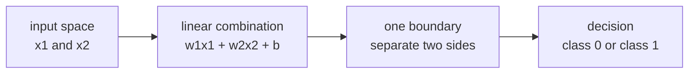
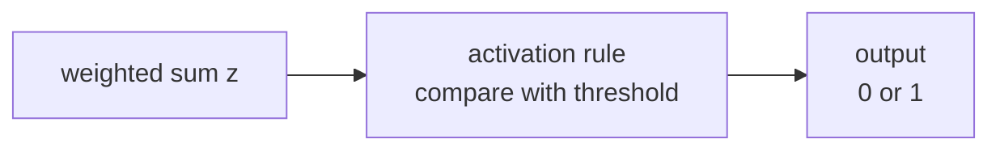
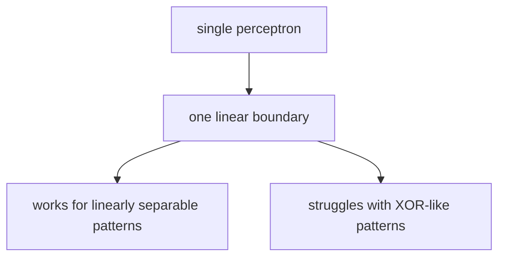

# P4-1.2 선형 결합과 활성화

P4-1.1에서는 퍼셉트론(perceptron)을 `입력(input) -> 가중치(weight) -> 합(sum) -> 출력(output)` 흐름으로 보았습니다. 이제 바로 다음 질문이 생깁니다.

`입력들을 가중합으로 묶는다는 것은 정확히 어떤 뜻인가? 그리고 왜 그 합만으로는 딥러닝이 되지 않는가?`

이 절은 그 질문에 답합니다.

초심자 기준에서는 다음 한 문장으로 먼저 잡으면 충분합니다.

`퍼셉트론은 먼저 입력들의 선형 결합(linear combination)을 만들고, 그 결과를 활성화(activation) 규칙에 통과시켜 판단을 만든다.`

## 이 절의 범위

이 절은 다음 질문에 답합니다.

- 선형 결합(linear combination)은 무엇을 뜻하는가?
- 퍼셉트론이 판단 경계(decision boundary)를 만든다는 말은 무엇인가?
- 활성화(activation)는 왜 필요한가?
- 퍼셉트론 하나의 표현 한계는 어디에서 나타나는가?
- 왜 다음 장에서 다층 신경망(multilayer neural network)이 필요해지는가?

이 절은 다음 내용은 깊게 다루지 않습니다.

- 활성화 함수들의 수학적 미분
- sigmoid, tanh, ReLU의 상세 비교
- 역전파(backpropagation)의 계산 절차
- 보편 근사 정리(universal approximation theorem)

활성화 함수 종류는 P4-3장에서, 다층 구조는 P4-2장에서 이어서 다룹니다.

## 이 절의 목표

- 선형 결합을 `입력마다 비중을 주어 하나의 점수로 모으는 계산`으로 설명할 수 있습니다.
- 퍼셉트론이 선형 경계(linear boundary)를 만든다는 점을 말할 수 있습니다.
- 활성화가 단순한 합을 판단으로 바꾸는 단계라는 점을 이해할 수 있습니다.
- 퍼셉트론 하나만으로는 표현이 어려운 문제가 있다는 점을 설명할 수 있습니다.
- 다층 구조가 왜 필요한지 직관적으로 이어 말할 수 있습니다.

## 선형 결합은 무엇을 하고 있나

Part 3의 선형회귀(linear regression)와 로지스틱 회귀(logistic regression)에서도 보았듯, 여러 입력을 한 번에 다룰 때 가장 먼저 하는 일은 `각 입력에 비중을 주어 합치는 것`입니다.

이를 선형 결합(linear combination)이라고 부릅니다.

아주 짧게 쓰면 다음과 같습니다.

\[
z = w_1 x_1 + w_2 x_2 + w_3 x_3 + b
\]

초심자에게는 이 식을 다음처럼 읽으면 충분합니다.

- \(x_1, x_2, x_3\): 입력값
- \(w_1, w_2, w_3\): 각 입력의 중요도
- \(b\): 기준선을 옮기는 값
- \(z\): 모든 입력 신호를 모아 만든 중간 점수

즉, 퍼셉트론은 처음부터 `판단`을 만드는 것이 아니라, 먼저 `판단에 쓸 점수`를 하나 만듭니다.

## 왜 점수로 먼저 모으는가

입력이 여러 개일 때는 신호가 서로 충돌할 수 있습니다.

- 어떤 입력은 긍정 신호일 수 있습니다.
- 어떤 입력은 부정 신호일 수 있습니다.
- 어떤 입력은 매우 강한 신호일 수 있고
- 어떤 입력은 약한 보조 신호일 수 있습니다.

선형 결합은 이들을 한 줄의 점수로 압축합니다.

예를 들어 다음처럼 생각할 수 있습니다.

| 입력 | 의미 | 가중치 역할 |
| --- | --- | --- |
| 시험 점수 | 높을수록 유리 | 양수 가중치 |
| 결석 횟수 | 많을수록 불리 | 음수 가중치 |
| 추가 과제 제출 | 있으면 유리 | 양수 가중치 |

이처럼 퍼셉트론은 여러 입력 조건을 각각 독립적으로 보는 대신, 하나의 축 위로 모아 판단하기 시작합니다.

## 퍼셉트론은 선형 경계를 만든다

퍼셉트론이 입력을 선형 결합으로 읽는다는 말은, 결국 데이터를 한 직선(line)이나 한 평면(plane), 또는 더 일반적으로는 초평면(hyperplane)으로 나누는 판단과 연결된다는 뜻입니다.

초심자 기준에서는 다음 문장으로 기억하면 충분합니다.

`퍼셉트론 하나는 입력 공간을 한 번에 하나의 직선 또는 평면 기준으로 나누는 판단기처럼 볼 수 있다.`

2차원 예시를 아주 단순하게 그리면 다음과 같습니다.



이 도식은 퍼셉트론 하나가 입력 공간에서 실제로 무엇을 하는지 보여 줍니다. 여러 입력을 선형 결합으로 모아 하나의 경계를 만들고, 그 경계를 기준으로 두 쪽 중 어디에 놓이는지 판단하는 구조라는 점이 핵심입니다.

이 도식의 핵심은 퍼셉트론이 복잡한 굴곡 경계가 아니라, 한 번에 하나의 선형 경계만 만든다는 점입니다.

## 활성화는 왜 필요한가

선형 결합만 보면 아직 결과는 단순한 숫자 \(z\)입니다. 하지만 우리는 보통 다음 중 하나를 원합니다.

- 0인가 1인가
- 승인인가 거절인가
- 반응하는가 반응하지 않는가

이렇게 점수를 실제 판단으로 바꾸는 단계가 활성화(activation)입니다.

초기 퍼셉트론에서는 흔히 임계값(threshold) 규칙으로 설명합니다.

- 점수가 기준보다 크면 1
- 아니면 0

즉, 활성화는 `계산된 점수를 출력 규칙으로 바꾸는 단계`입니다.



이 도식은 선형 결합과 활성화가 왜 분리되어 설명되어야 하는지 보여 줍니다. 먼저 점수 `z`를 만들고, 그다음 활성화 규칙이 그 점수를 실제 출력 0 또는 1 같은 판단으로 바꾸기 때문에 퍼셉트론은 `합산기`가 아니라 `합산 + 결정` 단위가 됩니다.

이 구조 때문에 퍼셉트론은 단순한 합산기가 아니라, `합산 + 판단` 단위가 됩니다.

## 왜 선형 결합만 반복하면 부족한가

여기서 중요한 딥러닝 직관이 하나 나옵니다.

`선형 결합만 여러 번 해도, 여전히 전체는 선형 결합으로 접힐 수 있다.`

초심자에게는 이것을 아주 엄밀하게 증명할 필요는 없습니다. 다만 감각은 중요합니다.

- 직선 하나로 나눌 수 있는 문제는 퍼셉트론 하나로 비교적 잘 표현됩니다.
- 하지만 구부러진 경계, 여러 조각으로 나뉜 경계, 조건이 얽힌 문제는 퍼셉트론 하나로 어렵습니다.

즉, 딥러닝이 깊어지는 이유 중 하나는 `더 복잡한 경계와 표현`이 필요하기 때문입니다.

## XOR가 왜 자주 등장하나

퍼셉트론의 한계를 설명할 때 XOR 문제가 자주 등장합니다. 이유는 간단합니다.

XOR는 입력 두 개가 `다를 때만 1`이 되는 규칙입니다.

| x1 | x2 | XOR 출력 |
| --- | --- | --- |
| 0 | 0 | 0 |
| 0 | 1 | 1 |
| 1 | 0 | 1 |
| 1 | 1 | 0 |

이 배치는 한 직선으로 깔끔하게 둘로 나누기 어렵습니다. 즉, 퍼셉트론 하나가 만드는 단일 선형 경계로는 잘 표현되지 않는 대표 사례입니다.

초심자 기준에서는 다음 정도로 이해하면 충분합니다.

`퍼셉트론 하나는 한 번에 하나의 직선 경계만 만들 수 있기 때문에, XOR처럼 단순하지만 선형적으로 나누기 어려운 패턴에서 한계를 드러낸다.`

이를 도식으로 아주 간단히 줄이면 다음과 같습니다.



이 도식은 단일 퍼셉트론의 한계를 직관적으로 보여 줍니다. 한 번에 하나의 선형 경계만 만들 수 있기 때문에, XOR처럼 패턴은 단순해 보여도 직선 하나로 나누기 어려운 문제에서는 곧바로 표현 한계가 드러납니다.

## 그러면 다층 구조는 무엇을 더해 주나

바로 여기서 P4-2장의 다층 신경망(multilayer neural network)이 필요해집니다.

퍼셉트론 하나가 직선 하나를 만든다면, 여러 층을 쌓은 신경망은 단순한 선형 판단을 여러 번 조합해 더 복잡한 표현을 만들 수 있습니다.

즉, 다음 흐름으로 이해하면 좋습니다.

> 퍼셉트론 하나
> -> 선형 결합과 활성화
> -> 단순한 경계
> -> 여러 층을 쌓아 더 복잡한 표현 구성

이 연결이 딥러닝의 출발점입니다.

## 작은 숫자 예제로 보기

이번 예제의 목표는 `선형 결합이 먼저 점수를 만들고, 활성화가 그 점수를 판단으로 바꾼다`는 점을 확인하는 것입니다.

입력:

- `x1 = 1.0`
- `x2 = 0.5`

가중치:

- `w1 = 0.8`
- `w2 = -0.6`

편향:

- `b = -0.1`

출력:

- 선형 결합 점수 `z`
- 임계값 기준 이진 출력

```python
x1 = 1.0
x2 = 0.5

w1 = 0.8
w2 = -0.6
b = -0.1

z = x1 * w1 + x2 * w2 + b
output = 1 if z > 0 else 0

print("linear combination z =", round(z, 3))
print("activated output =", output)
```

실행 결과 예시는 다음처럼 읽을 수 있습니다.

```text
linear combination z = 0.4
activated output = 1
```

이 예제에서 중요한 것은 `0.4`라는 중간 점수와 `1`이라는 최종 출력이 구분된다는 점입니다.

- 선형 결합은 점수를 만듭니다.
- 활성화는 그 점수를 판단으로 바꿉니다.

이 구분은 이후 sigmoid, tanh, ReLU를 읽을 때도 계속 중요합니다.

## Part 3와 어떻게 이어지는가

Part 3에서 봤던 선형회귀와 로지스틱 회귀를 떠올리면, 퍼셉트론은 전혀 낯선 구조가 아닙니다.

- 입력과 가중치를 곱해 합친다
- 편향을 더한다
- 어떤 출력 규칙으로 연결한다

차이는 Part 4에서 이 구조가 `층(layer)`을 이루며 반복되고, 활성화가 비선형성(nonlinearity)을 넣어 더 복잡한 표현을 가능하게 만든다는 점입니다.

즉, 퍼셉트론은 Part 3의 선형 모델 감각과 Part 4의 신경망 감각을 이어 주는 징검다리입니다.

## 이 절에서 기억할 관점

- 퍼셉트론은 먼저 입력의 선형 결합(linear combination)을 만들어 점수를 계산합니다.
- 활성화(activation)는 그 점수를 실제 출력 규칙으로 바꾸는 단계입니다.
- 퍼셉트론 하나는 입력 공간을 하나의 선형 경계로 나누는 판단기로 볼 수 있습니다.
- 이 때문에 퍼셉트론 하나만으로는 XOR 같은 패턴에서 한계를 보일 수 있습니다.
- 여러 층을 쌓는 이유는 이런 단순 선형 판단을 조합해 더 복잡한 표현을 만들기 위해서입니다.

## 체크리스트

- 선형 결합을 `입력에 비중을 주어 하나의 점수로 모으는 계산`으로 설명할 수 있는가?
- 활성화가 왜 필요한지 말할 수 있는가?
- 퍼셉트론이 선형 경계를 만든다는 뜻을 직관적으로 설명할 수 있는가?
- 선형 결합 점수와 최종 출력이 서로 다른 단계라는 점을 구분할 수 있는가?
- 퍼셉트론 하나의 한계가 왜 다층 신경망으로 이어지는지 설명할 수 있는가?

## 출처와 참고 자료

- Frank Rosenblatt, `The Perceptron: A Probabilistic Model for Information Storage and Organization in the Brain`, Psychological Review, 1958, 확인 날짜: 2026-06-28.
- Marvin Minsky, Seymour Papert, `Perceptrons: An Introduction to Computational Geometry`, MIT Press, 1969/1988, 확인 날짜: 2026-06-28.
- Ian Goodfellow, Yoshua Bengio, Aaron Courville, `Deep Learning`, MIT Press, 2016, 확인 날짜: 2026-06-28. [https://www.deeplearningbook.org/](https://www.deeplearningbook.org/){: target="_blank" rel="noopener noreferrer" }
