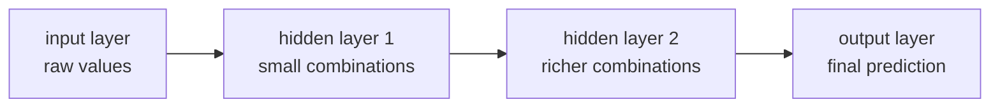
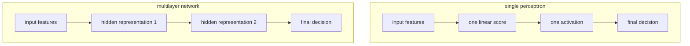

# P4-2.1 다층 신경망(multilayer neural network)

P4-1.2에서는 퍼셉트론(perceptron) 하나가 입력의 선형 결합(linear combination)과 활성화(activation)로 판단을 만든다는 점을 보았습니다. 동시에 퍼셉트론 하나는 한 번에 하나의 선형 경계(linear boundary)만 만들기 때문에, 표현할 수 있는 패턴에 한계가 있다는 점도 보았습니다.

그다음 질문은 자연스럽습니다.

퍼셉트론 하나가 부족하다면, 이런 계산 단위를 여러 개 쌓으면 무엇이 달라지는가?

이 질문에서 시작하는 것이 다층 신경망(multilayer neural network)입니다.

다층 신경망은 퍼셉트론 같은 계산 단위를 여러 층으로 쌓아, 단순한 입력 조합을 중간 표현으로 바꾸고 그 표현을 다시 더 복잡한 판단으로 연결하는 구조이다.

## 이 절의 범위

이 절은 다음 질문에 답합니다.

- 왜 퍼셉트론 하나로는 부족한가?
- 층(layer)을 더 쌓는다는 말은 무엇을 뜻하는가?
- 입력층(input layer), 은닉층(hidden layer), 출력층(output layer)은 어떻게 다르게 읽어야 하는가?
- 다층 구조가 더 복잡한 표현을 만든다는 말은 무엇인가?
- 왜 다층 신경망이 딥러닝(deep learning)의 출발점처럼 취급되는가?

이 절에서는 다음 내용을 깊게 다루지 않습니다.

- 은닉층의 세부 활성화 함수 비교
- 역전파(backpropagation)의 계산 공식
- 보편 근사 정리(universal approximation theorem)의 엄밀한 증명
- 깊이(depth)와 너비(width)의 이론 비교

은닉층이 실제로 어떤 표현을 만든다고 읽을 수 있는지는 P4-2.2에서 더 이어서 다루고, 활성화 함수 비교는 P4-3.1, P4-3.2에서 다시 연결합니다. 역전파(backpropagation)의 계산 공식은 P4-5.1, P4-5.2에서 다시 봅니다. 보편 근사 정리와 깊이·너비의 이론 비교는 이 책의 현재 본편 범위 밖에 둡니다.

## 이 절의 목표

- 다층 신경망을 `퍼셉트론을 여러 층으로 쌓은 구조`로 설명할 수 있습니다.
- 은닉층(hidden layer)이 입력과 출력 사이의 중간 표현을 담당한다는 점을 말할 수 있습니다.
- 단일 퍼셉트론보다 다층 구조가 더 복잡한 경계와 패턴을 표현할 수 있다는 점을 이해할 수 있습니다.
- Part 3의 선형 모델과 Part 4의 깊은 모델이 어디서 갈라지는지 설명할 수 있습니다.

## 왜 층을 더 쌓는가

퍼셉트론 하나는 이미 유용한 계산 단위였습니다.

- 입력을 받습니다.
- 가중합을 만듭니다.
- 활성화를 거쳐 출력을 냅니다.

문제는 이 단위 하나만으로는 복잡한 패턴을 표현하기 어렵다는 점입니다.

예를 들어 현실 문제에서는 다음 같은 일이 자주 생깁니다.

- 입력 특징(feature)들이 단순히 하나의 선으로 나뉘지 않습니다.
- 중요한 조건이 여러 단계로 조합되어야 합니다.
- 낮은 수준 신호를 먼저 묶은 뒤, 그 묶음을 다시 더 큰 의미로 결합해야 합니다.

즉, 퍼셉트론 하나가 `바로 최종 판단`을 하게 두면 너무 많은 일을 한 번에 맡기게 됩니다.

다층 신경망은 이 문제를 구조적으로 나눕니다.

> 첫 층은 작은 조합을 만든다
> -> 중간 층은 그 조합들을 다시 묶는다
> -> 마지막 층은 최종 판단으로 연결한다

## 다층 신경망을 한 장면으로 보기



이 도식의 핵심은 층(layer)이 늘어날수록 단순히 계산이 많아지는 것이 아니라, `중간 표현`이 생긴다는 점입니다.

즉, 다층 신경망은 처음 입력을 그대로 최종 판단으로 보내지 않고, 중간에서 여러 번 재표현(representation)합니다.

## 입력층, 은닉층, 출력층은 어떻게 다르나

독자에게는 층 이름이 추상적으로 들릴 수 있습니다. 그래서 역할로 나누어 보는 편이 좋습니다.

| 층 | 영어 | 쉬운 역할 |
| --- | --- | --- |
| 입력층 | input layer | 원래 값을 받아들이는 입구 |
| 은닉층 | hidden layer | 입력을 중간 특징으로 바꾸는 계산 구간 |
| 출력층 | output layer | 최종 예측이나 점수를 내는 마지막 구간 |

여기서 특히 중요한 것은 은닉층(hidden layer)입니다.

은닉층은 `사람이 직접 이름 붙인 특징`이 아니라, 모델이 계산 과정 속에서 만들어 쓰는 중간 표현입니다. 바로 이 점 때문에 신경망은 Part 3의 전통적인 모델들과 다른 방향으로 나아갑니다.

## 은닉층은 왜 hidden인가

`hidden`이라는 이름 때문에 독자는 은닉층을 비밀 공간처럼 이해하기 쉽습니다. 하지만 여기서 hidden은 신비롭다는 뜻이 아니라, `입력도 아니고 최종 출력도 아닌 중간 계산층`이라는 뜻에 가깝습니다.

즉:

- 입력층은 우리가 직접 보는 값입니다.
- 출력층은 우리가 직접 읽는 결과입니다.
- 은닉층은 그 사이에서 모델이 내부적으로 쓰는 표현입니다.

그래서 은닉층은 사람이 바로 `이 노드는 정확히 이 의미다`라고 해석하기 어려운 경우가 많습니다. 대신 우리는 `이 층이 더 유용한 중간 표현을 만들고 있는가`를 보게 됩니다.

## 왜 더 복잡한 표현이 가능해지는가

퍼셉트론 하나는 입력을 한 번의 선형 결합으로 보고 바로 판단했습니다. 반면 다층 구조에서는 한 층의 출력이 다음 층의 입력이 됩니다.

이 말은 곧:

- 첫 번째 층이 만든 조합을
- 두 번째 층이 다시 새로운 입력처럼 받아
- 더 큰 패턴으로 묶을 수 있다는 뜻입니다.

예를 들어 이미지라면 다음처럼 비유할 수 있습니다.

- 아주 낮은 수준: 선, 모서리, 밝기 차이
- 그다음 수준: 작은 모양 조각
- 더 높은 수준: 더 큰 부분 구조
- 마지막 수준: 특정 물체와 가까운 판단

물론 이 절에서는 CNN(convolutional neural network)을 아직 다루지 않습니다. 하지만 `작은 조합을 더 큰 조합으로 쌓아 올린다`는 감각은 지금부터 필요합니다.

## 다층 구조를 표 형식 비유로 보기

표 형식 데이터라도 비슷한 일이 일어날 수 있습니다.

예를 들어 고객 데이터를 생각해 봅니다.

- 입력값: 방문 수, 구매 금액, 최근 활동일, 문의 횟수
- 첫 은닉층: 활동성, 관심도, 이탈 위험 같은 중간 조합
- 다음 층: 더 큰 패턴 조합
- 출력층: 구매 가능성, 이탈 가능성 같은 최종 예측

예를 들어 방문 수는 높지만 최근 활동일이 오래되었고 문의 횟수도 늘고 있다면, 사람은 처음에는 숫자 네 개를 따로따로 보고 판단해도 충분하다고 느끼기 쉽습니다. 하지만 실제로는 이 숫자들을 한 번에 묶어 `관심은 있었지만 지금은 이탈 위험이 커진 고객`처럼 읽고 싶어집니다. 은닉층은 바로 이런 중간 조합을 내부적으로 만들 수 있는 자리로 이해하면 좋습니다. 다만 중요한 것은 은닉층이 실제로 `활동성`이라는 이름을 알고 있는 것은 아니라는 점입니다. 우리는 직관을 위해 그렇게 설명할 뿐이고, 실제로는 모델이 여러 가중치 조합을 통해 어떤 중간 표현을 내부적으로 만들고 있다고 이해하는 편이 더 정확합니다.

## 퍼셉트론 하나와 다층 구조 비교



왼쪽은 입력 특징을 한 번의 선형 점수와 한 번의 활성화로 바로 최종 판단에 연결합니다. 오른쪽은 입력 특징이 먼저 중간 표현으로 바뀌고, 그 표현이 다시 다음 표현으로 바뀐 뒤 최종 판단에 도달합니다. 딥러닝의 중요한 변화는 바로 이 `중간 표현을 여러 단계에 걸쳐 학습할 수 있다`는 점입니다.

## 다층 구조가 딥러닝의 출발점인 이유

다층 신경망이 중요하게 취급되는 이유는, 여기서부터 모델이 단순한 선형 경계를 넘어서 `표현 학습(representation learning)`으로 들어가기 시작하기 때문입니다.

Part 3의 많은 전통 모델은 사람이 정한 특징(feature)을 기반으로 학습합니다. 물론 조합과 분할은 할 수 있지만, `중간 표현을 여러 층에 걸쳐 학습한다`는 감각은 상대적으로 약합니다.

반면 다층 신경망은:

- 입력을 그대로 쓰지 않고
- 내부 표현을 여러 단계 거쳐 바꾸며
- 최종 판단에 유리한 구조를 스스로 만들어 갑니다.

이 때문에 다층 구조는 딥러닝의 출발점처럼 보입니다.

## 작은 Python 예제로 층 흐름 보기

이번 예제의 목표는 학습을 구현하는 것이 아니라, `한 층의 출력이 다음 층의 입력이 된다`는 점을 숫자로 확인하는 것입니다.

입력:

- `x1 = 1.0`
- `x2 = 0.5`

첫 번째 은닉층:

- 노드 2개

출력층:

- 노드 1개

출력:

- 첫 번째 은닉층의 중간값
- 최종 출력값

```python
def step(z):
    return 1 if z > 0 else 0

x1 = 1.0
x2 = 0.5

# hidden layer
h1 = step(x1 * 0.8 + x2 * -0.2 - 0.1)
h2 = step(x1 * -0.4 + x2 * 0.9 - 0.1)

# output layer
output = step(h1 * 0.7 + h2 * 0.6 - 0.5)

print("hidden layer outputs =", h1, h2)
print("final output =", output)
```

실행 결과 예시는 다음처럼 읽을 수 있습니다.

```text
hidden layer outputs = 1 0
final output = 1
```

이 예제에서 중요한 것은 숫자 자체보다 흐름입니다.

- 입력값이 바로 최종 출력으로 가지 않습니다.
- 먼저 은닉층의 출력 두 개가 생깁니다.
- 그 중간 출력이 다시 다음 층의 입력처럼 쓰입니다.

즉, 다층 신경망은 `입력 -> 중간 표현 -> 최종 판단` 구조를 갖습니다.

## 아직 남아 있는 질문

여기까지 오면 독자는 또 질문을 하게 됩니다.

- 은닉층은 실제로 무엇을 배우는가?
- 중간 표현은 왜 유용한가?
- 층이 많아질수록 무엇이 달라지는가?

이 질문은 바로 다음 절 P4-2.2의 주제입니다.

즉, 2.1에서는 `층을 더 쌓는 이유`를 먼저 잡고, 2.2에서는 `그 층이 어떤 표현을 만들고 있다고 볼 수 있는가`를 이어서 봅니다.

## 이 절에서 기억할 관점

- 다층 신경망은 퍼셉트론 같은 계산 단위를 여러 층으로 쌓은 구조입니다.
- 은닉층(hidden layer)은 입력과 출력 사이의 중간 표현을 담당합니다.
- 다층 구조에서는 한 층의 출력이 다음 층의 입력이 됩니다.
- 이 구조 덕분에 단일 퍼셉트론보다 더 복잡한 패턴과 경계를 표현할 수 있습니다.
- 다층 신경망은 딥러닝이 표현 학습으로 들어가는 출발점입니다.

## 체크리스트

- 왜 퍼셉트론 하나만으로는 부족할 수 있는지 말할 수 있는가?
- 입력층, 은닉층, 출력층의 역할을 구분할 수 있는가?
- 다층 구조에서 `중간 표현`이 생긴다는 말을 설명할 수 있는가?
- 한 층의 출력이 다음 층의 입력이 된다는 흐름을 작은 예제로 말할 수 있는가?
- 다층 신경망이 왜 딥러닝의 출발점처럼 보이는지 설명할 수 있는가?

## 출처와 참고 자료

- Ian Goodfellow, Yoshua Bengio, Aaron Courville, `Deep Learning`, MIT Press, 2016, 확인 날짜: 2026-06-28. [https://www.deeplearningbook.org/](https://www.deeplearningbook.org/){: target="_blank" rel="noopener noreferrer" }
- Yann LeCun, Yoshua Bengio, Geoffrey Hinton, `Deep learning`, Nature, 2015, 확인 날짜: 2026-06-28. [https://www.nature.com/articles/nature14539](https://www.nature.com/articles/nature14539){: target="_blank" rel="noopener noreferrer" }
- George Cybenko, `Approximation by Superpositions of a Sigmoidal Function`, Mathematics of Control, Signals, and Systems, 1989, 확인 날짜: 2026-06-28.
