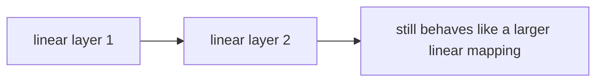
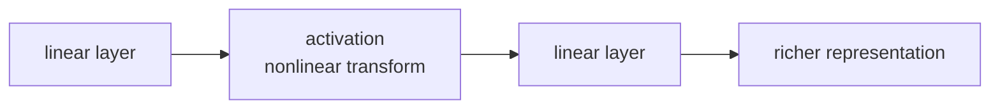

# P4-3.1 활성화 함수(activation function)

P4-2.2에서는 은닉층(hidden layer)이 입력을 더 유용한 내부 표현(representation)으로 바꿀 수 있다는 점을 보았습니다. 이제 바로 다음 질문이 생깁니다.

신경망은 단순히 가중합만 반복하는 것이 아니라는데, 그 변화를 실제로 만들어 주는 것은 무엇인가?

그 역할을 하는 것이 활성화 함수(activation function)입니다.

활성화 함수는 가중합으로 만들어진 점수를 그대로 두지 않고, 비선형성(nonlinearity)을 넣어 신경망이 더 복잡한 패턴을 표현하게 만드는 변환 규칙이다.

## 이 절의 범위

이 절은 다음 질문에 답합니다.

- 활성화 함수는 왜 필요한가?
- 선형 결합만 반복하면 왜 표현력이 제한되는가?
- 비선형성(nonlinearity)을 넣는다는 말은 무엇인가?
- 활성화 함수가 은닉층 표현과 어떤 관계가 있는가?

이 절은 다음 내용은 깊게 다루지 않습니다.

- ReLU, sigmoid, tanh의 세부 수식 비교
- 미분값과 gradient flow의 상세 분석
- 출력층에서 쓰는 활성화와 은닉층 활성화의 미세한 구분

대표 활성화 함수의 차이는 P4-3.2에서 이어서 다루고, 출력층 활성화와 손실 함수의 연결은 P4-3.3과 P4-4.1, P4-4.2에서 다시 봅니다. gradient flow의 더 자세한 맥락은 P4-5.1과 P4-7.1에서 다시 연결합니다.

## 이 절의 목표

- 활성화 함수를 `점수에 비선형 변환을 주는 규칙`으로 설명할 수 있습니다.
- 선형 결합만 반복하면 전체도 선형적으로 접히기 쉽다는 점을 이해할 수 있습니다.
- 활성화 함수가 다층 신경망의 표현력을 키우는 핵심 이유를 말할 수 있습니다.
- 작은 Python 예제로 활성화 전후 값 차이를 확인할 수 있습니다.

## 왜 활성화 함수가 필요한가

P4-1장과 P4-2장에서 본 신경망 계산은 기본적으로 다음 구조를 가집니다.

> 입력을 받는다
> -> 가중합(weighted sum)을 만든다
> -> 출력을 다음 층으로 넘긴다

문제는 이 중간 단계가 전부 선형(linear) 계산뿐이라면, 층을 여러 개 쌓아도 전체는 크게 복잡해지지 않을 수 있다는 점입니다.

독자에게는 다음 문장으로 이해하면 충분합니다.

`선형 계산만 여러 번 하는 것만으로는, 신경망이 정말로 더 복잡한 모양과 규칙을 배우기 어렵다.`

즉, 층을 쌓는 것만으로는 충분하지 않습니다. 층 사이에 `직선적인 관계를 꺾는 변환`이 필요합니다. 그 변환이 바로 활성화 함수입니다.

## 비선형성(nonlinearity)은 무엇을 뜻하나

비선형성은 독자에게 가장 추상적으로 들리는 단어 중 하나입니다. 이 책에서는 먼저 이렇게 이해하면 충분합니다.

`입력이 조금 바뀌었다고 해서 출력이 항상 직선처럼 비례해서만 바뀌지 않게 만드는 성질`

예를 들어:

- 어떤 값 이하에서는 거의 반응하지 않고
- 특정 구간부터 갑자기 반응이 커지거나
- 음수는 잘라내고 양수만 통과시키는 식의 규칙이 생기면

이제 모델은 단순한 직선 판단기보다 더 복잡한 패턴을 표현할 수 있습니다.

## 선형 결합만으로는 왜 부족한가

선형 결합을 여러 층에 걸쳐 반복한다고 가정해 봅시다.

- 첫 번째 층은 입력을 가중합으로 바꿉니다.
- 두 번째 층도 그 출력을 다시 가중합으로 바꿉니다.

그런데 중간에 비선형 변환이 없으면, 이 연속된 계산은 결국 하나의 더 큰 선형 변환으로 묶이기 쉽습니다.

즉:

> 선형 결합
> -> 선형 결합
> -> 선형 결합

만 반복하면, 모델 깊이는 늘었지만 표현력은 기대만큼 늘지 않을 수 있습니다.

이 때문에 딥러닝에서 활성화 함수는 부가 기능이 아니라, `깊이가 의미를 갖게 만드는 핵심 장치`입니다.

이를 아주 단순하게 그리면 다음과 같습니다.



이 도식은 선형 층만 여러 번 쌓아도 표현력이 자동으로 크게 늘지 않는다는 점을 보여 줍니다. 겉으로는 깊어 보여도, 중간에 비선형 변환이 없으면 전체가 결국 더 큰 선형 계산처럼 접힐 수 있습니다.

반대로 활성화 함수가 사이에 들어가면 흐름이 달라집니다.



이 도식은 활성화 함수가 왜 `깊이를 의미 있게 만드는 장치`인지 보여 줍니다. 선형 계산 사이에 비선형 변환이 들어가야 다음 층이 더 복잡한 표현을 만들 수 있고, 그때 비로소 깊은 신경망의 장점이 살아납니다.

## 활성화 함수는 점수에 어떤 일을 하나

활성화 함수는 보통 가중합 결과 \(z\)를 받아 다른 값으로 바꿉니다.

\[
a = f(z)
\]

다음처럼 읽으면 충분합니다.

- \(z\): 선형 결합으로 만들어진 점수
- \(f\): 활성화 함수
- \(a\): 다음 층으로 넘길 새 값

즉, 활성화 함수는 `계산된 점수를 그대로 전달하지 않고, 다음 층이 더 유용하게 쓸 수 있는 형태로 바꾼다`고 이해할 수 있습니다.

## 은닉층과 활성화는 어떻게 연결되나

P4-2.2에서 은닉층이 내부 표현을 만든다고 했습니다. 활성화 함수는 바로 그 표현이 `단순한 선형 복사`에 머물지 않게 합니다.

즉:

- 가중합은 입력 신호를 조합합니다.
- 활성화는 그 조합에 비선형 변환을 줍니다.
- 그 결과 다음 층은 더 복잡한 내부 표현을 만들 수 있습니다.

이 연결 때문에 활성화 함수는 단순한 출력 규칙이 아니라, representation learning을 가능하게 하는 장치로 읽어야 합니다.

## 작은 사례로 보기

간단한 이미지 분류 비유를 생각해 봅니다.

- 어떤 필터는 선(edge) 비슷한 신호를 계산할 수 있습니다.
- 하지만 모든 계산이 선형이라면, 여러 층을 쌓아도 결국 큰 선형 필터 비슷한 구조에 머물 수 있습니다.
- 중간에 활성화가 들어가면, 어떤 신호는 강하게 통과하고 어떤 신호는 약하게 잘리면서 더 복잡한 조합이 가능해집니다.

표 형식 데이터도 비슷합니다.

- 고객 활동 점수를 계산하고
- 그 점수를 그대로 선형 조합만 반복하면 단순한 관계에 머물기 쉽습니다.
- 활성화가 들어가면 특정 구간에서 반응이 달라지는 표현이 생길 수 있습니다.

즉, 활성화 함수는 다양한 데이터 도메인에서 `복잡한 규칙을 표현하게 하는 공통 장치`로 이해할 수 있습니다.

## 작은 Python 예제로 활성화 전후 값 보기

이번 예제의 목표는 활성화 함수가 `선형 결합 점수`를 `다음 층에 넘길 값`으로 바꾸는 감각을 숫자로 확인하는 것입니다.

입력:

- 두 개의 입력값
- 두 개의 가중치
- 편향

출력:

- 선형 결합 결과 `z`
- ReLU 활성화 후 결과

```python
def relu(z):
    return max(0.0, z)

x1 = 1.0
x2 = -0.5
w1 = 0.7
w2 = 0.9
b = -0.1

z = x1 * w1 + x2 * w2 + b
a = relu(z)

print("linear score z =", round(z, 3))
print("after activation =", round(a, 3))
```

실행 결과 예시는 다음처럼 읽을 수 있습니다.

```text
linear score z = 0.15
after activation = 0.15
```

다른 입력을 넣어 보면 더 차이가 잘 보입니다.

```python
x1 = 0.1
x2 = -1.0

z = x1 * w1 + x2 * w2 + b
a = relu(z)

print("linear score z =", round(z, 3))
print("after activation =", round(a, 3))
```

실행 결과 예시는 다음처럼 읽을 수 있습니다.

```text
linear score z = -0.93
after activation = 0.0
```

이 예제에서 중요한 것은 활성화 함수가 단순히 숫자를 복사하는 것이 아니라, 다음 층이 읽게 될 값을 바꾼다는 점입니다.

## 활성화 함수가 없으면 딥러닝이 왜 약해지나

활성화 함수가 없다면:

- 층은 많아 보여도
- 중간 표현은 충분히 꺾이지 않고
- 전체는 큰 선형 계산으로 접힐 수 있습니다.

반대로 활성화 함수가 있으면:

- 어떤 신호는 살리고
- 어떤 신호는 자르고
- 다음 층이 더 복잡한 조합을 만들 수 있게 됩니다.

이 때문에 딥러닝의 깊이(depth)는 활성화 함수와 함께 읽어야 의미가 생깁니다.

## 역사와 커리큘럼 관점

딥러닝 역사에서 퍼셉트론과 다층 신경망이 다시 주목받은 이유 중 하나도 바로 이 지점과 연결됩니다. 단일 퍼셉트론의 한계는 오래전부터 알려져 있었지만, 다층 구조와 비선형 활성화, 그리고 이를 학습할 수 있는 계산 자원과 알고리즘이 다시 결합되면서 신경망이 큰 표현력을 갖기 시작했습니다.

커리큘럼 관점에서도 활성화 함수는 초반부에 꼭 등장해야 합니다. 이유는 단순합니다.

- 퍼셉트론을 보면 선형 결합이 이해됩니다.
- 다층 신경망을 보면 중간 표현이 이해됩니다.
- 활성화 함수를 보면 왜 그 중간 표현이 선형 복사가 아니게 되는지 이해됩니다.

즉, 활성화 함수는 Part 4 초반부의 핵심 연결고리입니다.

## 다음 절과의 연결

여기까지 오면 다음 질문이 남습니다.

- 어떤 활성화 함수를 많이 쓰는가?
- sigmoid, tanh, ReLU는 무엇이 다른가?
- 왜 현대 신경망에서는 ReLU 계열이 자주 등장하는가?

이 질문은 바로 P4-3.2에서 이어서 다룹니다.

## 이 절에서 기억할 관점

- 활성화 함수는 가중합 점수에 비선형 변환을 주는 규칙입니다.
- 선형 결합만 반복하면 깊이가 늘어도 표현력이 충분히 늘지 않을 수 있습니다.
- 활성화 함수는 은닉층이 더 유용한 내부 표현을 만들게 하는 핵심 장치입니다.
- 딥러닝의 깊이는 활성화 함수와 함께 읽을 때 비로소 의미가 생깁니다.

## 체크리스트

- 활성화 함수를 `비선형 변환 규칙`으로 설명할 수 있는가?
- 선형 계산만 반복하면 왜 한계가 생기는지 말할 수 있는가?
- 활성화 함수가 은닉층 표현과 어떤 관계가 있는지 설명할 수 있는가?
- 작은 예제로 활성화 전후 값 차이를 읽을 수 있는가?
- 대표 활성화 함수 비교는 다음 절에서 이어진다는 흐름을 알고 있는가?

## 출처와 참고 자료

- Ian Goodfellow, Yoshua Bengio, Aaron Courville, `Deep Learning`, MIT Press, 2016, 확인 날짜: 2026-06-29. [https://www.deeplearningbook.org/](https://www.deeplearningbook.org/){: target="_blank" rel="noopener noreferrer" }
- Yann LeCun, Yoshua Bengio, Geoffrey Hinton, `Deep learning`, Nature, 2015, 확인 날짜: 2026-06-29. [https://www.nature.com/articles/nature14539](https://www.nature.com/articles/nature14539){: target="_blank" rel="noopener noreferrer" }
