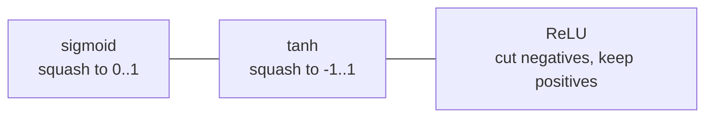

# P4-3.2 ReLU, sigmoid, tanh

P4-3.1에서는 활성화 함수(activation function)가 왜 필요한지, 그리고 비선형성(nonlinearity)이 딥러닝의 깊이를 실제 표현력으로 바꾸는 핵심 장치라는 점을 보았습니다. 이제 다음 질문이 자연스럽게 이어집니다.

그렇다면 실제로는 어떤 활성화 함수를 많이 쓰며, 서로 무엇이 다른가?

이 절은 그 질문에 답합니다.

ReLU, sigmoid, tanh는 모두 점수를 비선형적으로 바꾸는 함수이지만, 반응 구간과 출력 범위가 다르기 때문에 쓰임새와 학습 감각도 달라진다.

## 이 절의 범위

이 절은 다음 질문에 답합니다.

- sigmoid, tanh, ReLU는 각각 어떤 모양과 출력을 가지는가?
- 왜 서로 다른 활성화 함수가 필요한가?
- 현대 신경망에서 ReLU 계열이 자주 쓰이는 이유는 무엇인가?
- sigmoid와 tanh는 어떤 맥락에서 여전히 중요하게 등장하는가?

이 절은 다음 내용은 깊게 다루지 않습니다.

- 미분값의 엄밀한 수식 유도
- vanishing gradient의 상세 수학
- GELU, Swish, Leaky ReLU 같은 후속 함수 비교
- 출력층 activation 설계의 세부 규칙

이 절의 목적은 세 함수를 `암기`하는 것이 아니라, `어떤 성질 때문에 다르게 읽히는가`를 설명하는 것입니다.

## 이 절의 목표

- sigmoid, tanh, ReLU의 출력 범위와 직관적 차이를 설명할 수 있습니다.
- 활성화 함수의 선택이 학습 흐름과 표현 방식에 영향을 준다는 점을 이해할 수 있습니다.
- 왜 ReLU 계열이 현대 딥러닝에서 자주 등장하는지 말할 수 있습니다.
- sigmoid와 tanh가 초창기 신경망과 특정 출력 설계에서 왜 중요했는지 설명할 수 있습니다.

## 먼저 큰 차이부터 보기

세 함수의 차이는 먼저 `출력을 어떻게 자르는가`로 읽으면 좋습니다.

| 함수 | 출력 범위 | 직관적 반응 |
| --- | --- | --- |
| sigmoid | 0 ~ 1 | 큰 음수는 0에 가깝게, 큰 양수는 1에 가깝게 눌러 줍니다. |
| tanh | -1 ~ 1 | 0을 중심으로 음수와 양수를 대칭적으로 눌러 줍니다. |
| ReLU | 0 이상 | 음수는 0으로 자르고, 양수는 거의 그대로 통과시킵니다. |

이 표만 먼저 기억해도 독자에게는 큰 도움이 됩니다.

- sigmoid: `확률처럼 보이는 값`
- tanh: `0 중심의 눌린 값`
- ReLU: `음수 차단, 양수 통과`

## sigmoid는 어떤 함수인가

sigmoid는 초기 신경망과 로지스틱 회귀(logistic regression) 설명에서 매우 자주 등장하는 함수입니다. 입력이 커질수록 1에 가까워지고, 작아질수록 0에 가까워집니다.

즉, sigmoid는 다음처럼 읽을 수 있습니다.

- 아주 작은 점수는 거의 0처럼 본다
- 아주 큰 점수는 거의 1처럼 본다
- 중간 점수는 0과 1 사이의 연속값으로 바꾼다

이 때문에 sigmoid는 특히 `어떤 사건이 일어날 가능성처럼 보이는 출력`을 만들 때 직관적입니다.

Part 3의 로지스틱 회귀를 떠올리면 이해가 더 쉽습니다. 로지스틱 회귀도 선형 결합 결과를 sigmoid에 통과시켜 0과 1 사이 값으로 바꾸었습니다.

즉, sigmoid는 딥러닝 이전의 확률적 분류 감각과도 이어지는 함수입니다.

## tanh는 sigmoid와 어떻게 다른가

tanh는 모양 자체는 sigmoid와 비슷하게 가운데는 기울고 양끝은 눌리는 함수입니다. 하지만 중요한 차이는 출력 범위가 `-1 ~ 1`이라는 점입니다.

독자에게는 다음 차이로 읽으면 충분합니다.

- sigmoid는 0과 1 사이만 냅니다
- tanh는 음수와 양수를 모두 유지하면서 0을 중심으로 표현합니다

이 특성 때문에 tanh는 은닉층에서 `양의 신호와 음의 신호를 모두 표현하고 싶을 때` 더 자연스럽게 읽히는 경우가 있습니다.

즉, tanh는 sigmoid보다 더 `0 중심(zero-centered)`인 표현을 만들어 준다고 이해할 수 있습니다.

## ReLU는 왜 다르게 보이나

ReLU(rectified linear unit)는 모양과 직관이 훨씬 단순합니다.

- 입력이 0보다 작으면 0
- 입력이 0보다 크면 거의 그대로 통과

즉, ReLU는 `음수 신호는 끊고, 양수 신호만 살리는 문`처럼 읽을 수 있습니다.

이 단순함 때문에 ReLU는 현대 딥러닝에서 매우 널리 쓰입니다.

다음처럼 기억하면 충분합니다.

`ReLU는 계산이 단순하고, 양수 구간에서는 신호를 강하게 남겨 두기 때문에 깊은 신경망에서 자주 쓰인다.`

## 세 함수를 그림 감각으로 비교하기

함수의 이름을 외우는 것보다 모양을 감으로 잡는 편이 중요합니다.



이 도식은 수학 그래프를 정확히 그린 것은 아니지만, 세 함수의 해석 차이를 압축합니다.

- sigmoid: 확률형 압축
- tanh: 대칭형 압축
- ReLU: 절단형 통과

## 왜 sigmoid와 tanh만으로는 부족했나

초기 신경망 역사에서는 sigmoid와 tanh가 널리 쓰였습니다. 이유는 명확합니다.

- 부드럽고 미분 가능했습니다.
- 임계값 함수보다 학습에 더 적합해 보였습니다.
- 확률적 출력이나 대칭적 은닉 표현을 만들기에 자연스러웠습니다.

하지만 깊은 네트워크로 갈수록 문제가 드러났습니다. 아주 큰 양수나 음수 영역에서는 출력이 포화(saturation)되어, 층을 많이 거치며 신호 변화가 둔해질 수 있습니다.

이를 아주 단순하게 다음처럼 이해하면 충분합니다.

`sigmoid와 tanh는 너무 큰 입력이 들어오면, 더 커져도 출력이 거의 안 바뀌는 구간이 생길 수 있다.`

이 현상은 학습을 어렵게 만들 수 있습니다. 바로 이 배경이 ReLU가 주목받은 이유 중 하나입니다.

## 왜 ReLU가 현대 딥러닝에서 자주 쓰이나

ReLU가 널리 퍼진 이유는 여러 가지가 있지만, 입문 수준에서는 세 가지로 요약하면 충분합니다.

1. 계산이 단순합니다.
2. 양수 구간에서는 신호를 비교적 직접 전달합니다.
3. 깊은 네트워크에서 sigmoid, tanh보다 학습이 더 안정적으로 느껴지는 경우가 많았습니다.

즉, ReLU는 복잡한 아이디어보다 `단순한 규칙으로 깊은 네트워크를 다루기 쉽게 만든 함수`로 기억하면 좋습니다.

이 역사적 흐름은 딥러닝의 확산과도 연결됩니다. 큰 네트워크, 큰 데이터, GPU, 더 나은 초기화와 최적화 기법이 함께 발전하던 시기에 ReLU 계열이 널리 채택되면서 깊은 학습이 더 실용적인 방향으로 굳어졌습니다.

## 그래도 sigmoid와 tanh는 왜 계속 배우나

독자는 `ReLU가 좋다면 sigmoid와 tanh는 이제 필요 없는가?`라는 질문을 자주 합니다. 그렇지는 않습니다.

sigmoid와 tanh는 여전히 중요합니다.

- sigmoid는 이진 분류 출력의 직관과 연결됩니다.
- tanh는 0 중심 출력과 순환 구조 설명에서 자주 등장합니다.
- 두 함수 모두 활성화의 역사와 딥러닝 발전 흐름을 이해하는 데 중요합니다.

즉, ReLU가 현대 실무에서 흔하다고 해서 sigmoid와 tanh가 사라진 개념은 아닙니다. 오히려 이 셋을 함께 비교해야 딥러닝이 `무작정 최신 함수만 쓰는 분야`가 아니라는 점이 보입니다.

## 작은 사례로 보기

예를 들어 어떤 은닉층 노드가 다음 점수 `z`를 만들었다고 생각해 봅니다.

- `z = -2`
- `z = 0.5`
- `z = 3`

같은 점수라도 활성화 함수에 따라 다음 층에 전달되는 값의 해석이 달라집니다.

| z | sigmoid 직관 | tanh 직관 | ReLU 직관 |
| --- | --- | --- | --- |
| -2 | 0에 가까운 약한 반응 | -1 쪽 음수 반응 | 0으로 차단 |
| 0.5 | 중간 정도 양의 반응 | 약한 양수 반응 | 그대로 통과 |
| 3 | 1에 가까운 강한 반응 | 1 쪽 강한 양수 반응 | 큰 양수 그대로 통과 |

즉, 활성화 함수는 단순히 “모양이 다른 수학 함수”가 아니라, `같은 점수를 어떤 방식으로 해석하고 전달할지 정하는 규칙`입니다.

## 작은 Python 예제로 값 차이 보기

이번 예제의 목적은 같은 입력값이 sigmoid, tanh, ReLU를 지나며 어떻게 다르게 바뀌는지 직접 확인하는 것입니다.

입력:

- `z = -2`
- `z = 0.5`
- `z = 3`

출력:

- 각 함수의 변환 결과

```python
import math

def sigmoid(z):
    return 1 / (1 + math.exp(-z))

def tanh(z):
    return math.tanh(z)

def relu(z):
    return max(0.0, z)

values = [-2.0, 0.5, 3.0]

for z in values:
    print("z =", z)
    print(" sigmoid =", round(sigmoid(z), 3))
    print(" tanh    =", round(tanh(z), 3))
    print(" relu    =", round(relu(z), 3))
    print()
```

실행 결과 예시는 다음처럼 읽을 수 있습니다.

```text
z = -2.0
 sigmoid = 0.119
 tanh    = -0.964
 relu    = 0.0

z = 0.5
 sigmoid = 0.622
 tanh    = 0.462
 relu    = 0.5

z = 3.0
 sigmoid = 0.953
 tanh    = 0.995
 relu    = 3.0
```

이 예제에서 중요한 것은 숫자 자체보다 경향입니다.

- sigmoid는 항상 0과 1 사이로 눌립니다.
- tanh는 -1과 1 사이로 눌리면서 부호를 유지합니다.
- ReLU는 음수를 0으로 자르고 양수는 그대로 보냅니다.

## 커리큘럼 관점에서 이 절이 중요한 이유

Part 4 초반부는 다음 흐름으로 쌓여야 합니다.

> 퍼셉트론
> -> 선형 결합과 활성화
> -> 다층 구조
> -> 은닉층과 표현
> -> 대표 활성화 함수 비교

이 흐름이 잡혀야 다음에 손실 함수(loss function), 역전파(backpropagation), 옵티마이저(optimizer)를 배울 때 각 층의 값이 왜 그렇게 바뀌는지 읽을 수 있습니다.

즉, 활성화 함수는 단지 함수 목록이 아니라, 이후 학습 계산 전체를 읽기 위한 입구입니다.

## 다음 장과의 연결

여기까지 오면 다음 질문이 남습니다.

- 모델은 이렇게 나온 출력과 정답의 차이를 어떻게 숫자로 읽는가?
- 어떤 출력이 `틀렸다`는 것을 학습 과정에서는 무엇으로 계산하는가?

이 질문은 바로 P4-4장의 손실 함수(loss function)로 이어집니다.

## 이 절에서 기억할 관점

- sigmoid, tanh, ReLU는 모두 비선형 변환이지만 출력 범위와 반응 방식이 다릅니다.
- sigmoid는 0~1, tanh는 -1~1, ReLU는 음수 차단과 양수 통과라는 직관으로 먼저 읽으면 됩니다.
- ReLU는 현대 딥러닝에서 자주 쓰이지만, sigmoid와 tanh도 역사와 구조 이해에 여전히 중요합니다.
- 활성화 함수의 차이는 표현 방식과 학습 감각의 차이로 이어집니다.

## 체크리스트

- sigmoid, tanh, ReLU의 출력 범위를 말할 수 있는가?
- 세 함수의 반응 차이를 쉬운 문장으로 설명할 수 있는가?
- 왜 ReLU가 현대 신경망에서 자주 등장하는지 말할 수 있는가?
- sigmoid와 tanh가 여전히 중요한 이유를 설명할 수 있는가?
- 다음 장에서 손실 함수로 이어진다는 흐름을 알고 있는가?

## 출처와 참고 자료

- Ian Goodfellow, Yoshua Bengio, Aaron Courville, `Deep Learning`, MIT Press, 2016, 확인 날짜: 2026-06-29. [https://www.deeplearningbook.org/](https://www.deeplearningbook.org/){: target="_blank" rel="noopener noreferrer" }
- Yann LeCun, Yoshua Bengio, Geoffrey Hinton, `Deep learning`, Nature, 2015, 확인 날짜: 2026-06-29. [https://www.nature.com/articles/nature14539](https://www.nature.com/articles/nature14539){: target="_blank" rel="noopener noreferrer" }
- Xavier Glorot, Antoine Bordes, Yoshua Bengio, `Deep Sparse Rectifier Neural Networks`, AISTATS, 2011, 확인 날짜: 2026-06-29.
