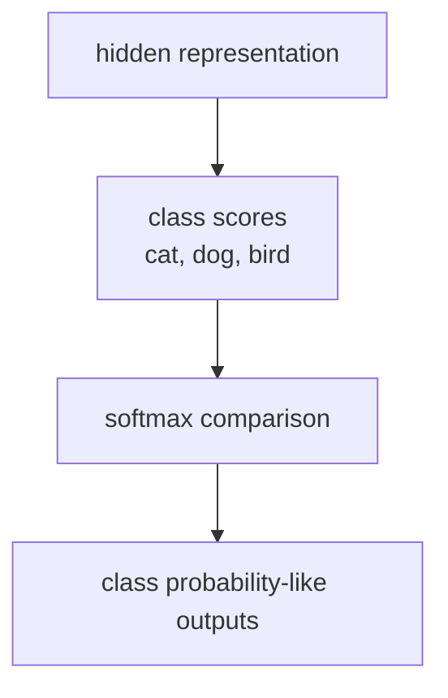

# P4-3.3 출력층(output layer)과 활성화의 선택

P4-3.1에서는 활성화 함수(activation function)가 왜 필요한지 보았고, P4-3.2에서는 ReLU, sigmoid, tanh가 어떻게 다르게 반응하는지 비교했습니다. 여기까지 오면 다음 질문이 자연스럽게 생깁니다.

은닉층에서는 ReLU 같은 함수를 많이 쓴다고 했는데, 마지막 출력층에서는 어떤 활성화를 써야 하는가?

이 질문은 곧바로 손실 함수(loss function)와 연결됩니다. 따라서 이 절은 활성화 함수 장의 마무리이면서, 다음 장으로 넘어가기 위한 다리 역할을 합니다.

출력층의 활성화는 모델이 무엇을 예측하는지에 따라 달라지며, 출력값이 어떤 의미를 가져야 하는지에 맞추어 선택한다.

## 이 절의 범위

이 절은 다음 질문에 답합니다.

- 은닉층 활성화와 출력층 활성화는 왜 같은 문제로 다루지 않는가?
- 회귀(regression), 이진 분류(binary classification), 다중 분류(multiclass classification)에서는 출력층을 어떻게 읽는가?
- 출력층 활성화와 손실 함수는 왜 함께 생각해야 하는가?
- `확률처럼 보이는 출력`과 `점수(score)`를 어떻게 구분해야 하는가?

이 절에서는 다음 내용을 깊게 다루지 않습니다.

- softmax의 미분 유도
- cross-entropy의 상세 수식 전개
- calibration과 uncertainty estimation의 심화 논의
- 다중 라벨 분류(multi-label classification)의 세부 구현

손실 함수 자체의 설계는 P4-4.1과 P4-4.2에서 이어서 다루고, calibration의 기초 읽기와 확률 출력 해석은 P3-6.4에서 다시 연결합니다. uncertainty estimation의 심화 논의와 다중 라벨 분류의 세부 구현은 이 책의 현재 본편 범위 밖에 둡니다.

## 이 절의 목표

- 출력층 활성화의 선택이 `모델이 무엇을 예측하는가`와 연결된다는 점을 설명할 수 있습니다.
- 회귀, 이진 분류, 다중 분류에서 출력층을 다르게 읽을 수 있습니다.
- 출력층 활성화와 손실 함수가 따로 놀지 않는다는 점을 이해할 수 있습니다.
- 작은 Python 예제로 출력 해석의 차이를 확인할 수 있습니다.

## 은닉층과 출력층은 왜 다르게 보아야 하나

은닉층(hidden layer)의 활성화는 주로 `표현을 더 풍부하게 만들기 위한 비선형성`과 관련됩니다. 반면 출력층(output layer)의 활성화는 `마지막 값이 어떤 의미를 가져야 하는가`와 더 직접적으로 연결됩니다.

즉:

- 은닉층 활성화는 내부 표현(representation)을 만드는 문제에 가깝고
- 출력층 활성화는 최종 출력의 해석(interpretation)을 정하는 문제에 가깝습니다

독자에게는 다음 구분으로 이해하면 충분합니다.

`은닉층은 복잡한 패턴을 만들기 위해 값을 바꾸고, 출력층은 그 값이 예측 결과로 어떤 뜻을 가져야 하는지 맞춘다.`

## 출력층은 예측 대상에 맞추어 선택한다

모델이 예측하려는 대상이 다르면, 마지막에 필요한 출력 형식도 달라집니다.

예를 들어:

- 집값처럼 연속값을 예측하면 숫자 하나를 그대로 내보내면 됩니다
- 이메일이 스팸인지 아닌지 판단하면 0과 1 사이 값처럼 읽히는 출력이 필요할 수 있습니다
- 사진이 고양이, 강아지, 새 중 무엇인지 고르면 여러 후보 중 하나를 비교하는 출력이 필요합니다

즉, 출력층은 단순히 `마지막 노드`가 아니라, `문제 정의가 출력값의 모양을 결정하는 자리`입니다.

## 회귀(regression)에서는 어떻게 읽나

회귀 문제에서는 예측값이 연속적인 수치입니다. 예를 들어:

- 내일 기온
- 집 가격
- 예상 수요량

같은 값을 예측합니다.

이 경우에는 출력층에서 특별한 비선형 활성화를 쓰지 않고, 선형 출력(linear output)으로 두는 경우가 많습니다. 이유는 간단합니다. 예측해야 할 숫자를 불필요하게 0과 1 사이, 혹은 -1과 1 사이로 눌러 버리면 표현 범위가 오히려 제한되기 때문입니다.

다음처럼 기억하면 좋습니다.

`연속값을 그대로 예측해야 하면, 출력도 가능한 한 그대로 내보내는 편이 자연스럽다.`

## 이진 분류(binary classification)에서는 어떻게 읽나

이진 분류는 두 가지 중 하나를 고르는 문제입니다.

- 스팸 / 정상
- 결제 사기 / 정상 거래
- 질병 있음 / 없음

이 경우에는 sigmoid가 자주 등장합니다. sigmoid는 출력을 0과 1 사이로 눌러 주기 때문에, 독자 입장에서는 `확률처럼 읽히는 값`이라는 직관을 주기 쉽습니다.

하지만 여기서 주의할 점이 있습니다.

`sigmoid 출력은 확률처럼 해석되기 쉬운 값이지, 모든 맥락에서 완전한 확률 보장을 자동으로 뜻하는 것은 아니다.`

실무에서는 threshold(임계값) 정책이 뒤에 따라붙습니다. 예를 들어:

- 0.5 이상이면 양성
- 0.9 이상이면 차단
- 0.6 이상 0.9 미만이면 검토

처럼 서비스 정책이 함께 붙을 수 있습니다.

즉, 출력층의 숫자와 서비스의 최종 결정은 구분해야 합니다.

## 다중 분류(multiclass classification)에서는 어떻게 읽나

다중 분류는 후보가 셋 이상인 문제입니다.

- 고양이 / 강아지 / 새
- 뉴스 / 스포츠 / 경제 / 문화
- 긍정 / 중립 / 부정

이 경우에는 각 클래스(class)에 대한 점수(logit)를 만든 뒤, softmax를 통해 서로 비교 가능한 비율 형태로 바꾸는 구성이 자주 등장합니다.

독자에게는 다음 감각으로 먼저 이해하면 충분합니다.

- 각 클래스는 먼저 자기 점수를 가집니다
- softmax는 그 점수들을 함께 비교해 `어느 쪽이 상대적으로 더 큰가`를 드러냅니다

즉, 다중 분류는 각 출력이 서로 독립적으로만 해석되는 것이 아니라, `후보들 사이의 경쟁 구조`로 읽어야 합니다.

이를 아주 단순하게 그리면 다음과 같습니다.



이 도식은 다중 분류 출력층을 `점수를 만든 뒤 비교하는 구조`로 읽게 해 줍니다. softmax는 단순히 숫자를 예쁘게 바꾸는 것이 아니라, 여러 클래스 후보 사이에서 어느 쪽이 상대적으로 더 강한지를 드러내는 단계입니다.

## 점수(score), 로짓(logit), 확률처럼 보이는 값은 같은가

여기서 독자가 많이 헷갈리는 표현이 세 가지입니다.

- 점수(score)
- 로짓(logit)
- 확률처럼 보이는 출력

이 절에서는 다음 정도로 구분하면 충분합니다.

| 표현 | 독자용 설명 |
| --- | --- |
| 점수(score) | 모델 내부에서 비교를 위해 만든 값 |
| 로짓(logit) | softmax나 sigmoid에 넣기 전의 마지막 점수 |
| 확률처럼 보이는 출력 | sigmoid나 softmax를 거쳐 해석이 쉬워진 값 |

이 구분이 중요한 이유는 다음 장의 손실 함수와 직접 연결되기 때문입니다. 어떤 손실 함수는 로짓을 직접 받도록 설계되고, 어떤 손실 함수는 활성화된 출력을 가정하기도 합니다.

## 출력층 활성화와 손실 함수는 왜 함께 보아야 하나

출력층 활성화만 따로 선택하면 설명이 반쯤 비게 됩니다. 손실 함수는 그 출력값이 `정답과 얼마나 어긋났는지`를 읽는 장치이기 때문입니다.

예를 들어:

- 회귀에서는 연속값 출력과 평균제곱오차(mean squared error)가 자연스럽게 연결되기 쉽고
- 이진 분류에서는 sigmoid와 binary cross-entropy가 자주 함께 언급되며
- 다중 분류에서는 softmax와 cross-entropy가 자주 함께 등장합니다

다음처럼 기억하면 좋습니다.

`출력층 활성화는 출력의 의미를 맞추고, 손실 함수는 그 의미를 기준으로 정답과의 차이를 읽는다.`

즉, 출력층과 손실 함수는 따로따로 외우기보다 `한 쌍의 설계`처럼 보는 편이 안전합니다.

## 사례로 보기

### 사례 1. 가격 예측

- 문제: 중고차 가격 예측
- 출력: 12,500,000원 같은 연속값
- 해석: 숫자를 그대로 비교해야 함

사람은 이런 문제에서 보통 `얼마인가`를 바로 알고 싶어 하지, 먼저 확률 범주를 고르게 하지는 않습니다. 그래서 0과 1 사이 값으로 눌러 놓는 출력보다 가격 숫자를 그대로 내보내는 쪽이 자연스럽습니다. 예를 들어 1,200만 원과 1,500만 원 중 어디에 더 가까운지가 중요하지, `비싼 차일 확률 0.8`처럼 우회된 값은 바로 쓰기 어렵습니다. 여기서 중요한 기준은 `어느 범주인가`가 아니라 `정답 숫자에서 얼마나 떨어졌는가`입니다. 이 경우에는 회귀 출력이 자연스럽습니다.

### 사례 2. 스팸 필터

- 문제: 이메일이 스팸인지 아닌지 판단
- 출력: 0.91
- 해석: 스팸일 가능성이 높다고 읽을 수 있음

사람은 이 장면에서 금액처럼 정확한 수치를 읽기보다 `막아야 하나 통과시켜야 하나`를 먼저 판단합니다. 즉, 이 문제는 연속값 하나를 그대로 예측하는 문제보다 `두 선택지 사이에서 얼마나 강하게 기우는가`를 읽는 쪽에 가깝습니다. 예를 들어 0.91이면 바로 차단하고 0.55면 사람 검토함으로 보내는 식으로, 출력값 뒤에 운영 정책이 곧바로 붙기 쉽습니다. 여기서 중요한 점은 sigmoid 출력이 곧바로 최종 정책이 아니라는 것입니다.

하지만 실제 서비스는 여기서 끝나지 않습니다.

- 0.91이면 자동 차단
- 0.65면 검토함으로 이동
- 0.30이면 통과

처럼 정책(policy)이 뒤에 붙습니다. 그래서 이 사례는 `출력 해석`과 `서비스 결정`을 분리해서 봐야 한다는 점을 보여 줍니다.

### 사례 3. 이미지 분류

- 문제: 사진 속 동물 분류
- 출력 후보: cat, dog, bird
- 해석: 세 후보가 경쟁한 뒤 가장 큰 쪽을 선택

예를 들어 `cat 0.70, dog 0.20, bird 0.10`처럼 나오면 사람은 `고양이 쪽으로 가장 강하게 기울었다`고 읽을 수 있습니다. 반대로 `cat 0.38, dog 0.34, bird 0.28`처럼 비슷하게 나오면 정답을 하나 고르더라도 모델 확신이 높지 않다고 볼 수 있습니다. 사람은 처음에 1등 클래스 이름만 보면 충분하다고 느끼기 쉽지만, 실제로는 `다른 후보와 얼마나 차이가 나는가`도 함께 중요합니다. 예를 들어 자동 분류를 바로 확정할지 사람 검토로 넘길지 같은 운영 판단은 이 차이에 크게 의존할 수 있습니다. 이 경우에는 여러 클래스 점수를 함께 읽는 다중 분류 구조가 자연스럽습니다.

## 작은 Python 예제로 출력 해석 차이 보기

이번 예제의 목표는 회귀 출력, sigmoid 출력, softmax 출력을 같은 절에서 나란히 보며 `출력의 의미`가 어떻게 달라지는지 확인하는 것입니다.

입력:

- 회귀용 숫자 하나
- 이진 분류용 로짓 하나
- 다중 분류용 클래스 점수 세 개

출력:

- 그대로 쓰이는 회귀 출력
- sigmoid 후 값
- softmax 후 값

```python
import math

def sigmoid(x):
    return 1 / (1 + math.exp(-x))

def softmax(values):
    exps = [math.exp(v) for v in values]
    total = sum(exps)
    return [v / total for v in exps]

# regression-style output
price_prediction = 12.7

# binary classification logit
spam_logit = 2.0
spam_score = sigmoid(spam_logit)

# multiclass logits
animal_logits = [1.2, 2.4, 0.3]
animal_probs = softmax(animal_logits)

print("regression output =", round(price_prediction, 3))
print("binary score =", round(spam_score, 3))
print("multiclass scores =", [round(v, 3) for v in animal_probs])
```

실행 결과 예시는 다음처럼 읽을 수 있습니다.

```text
regression output = 12.7
binary score = 0.881
multiclass scores = [0.214, 0.713, 0.072]
```

이 결과에서 읽어야 할 핵심은 다음과 같습니다.

- 회귀 출력은 숫자 자체가 예측값입니다
- 이진 분류 출력은 0과 1 사이 값으로 해석됩니다
- 다중 분류 출력은 여러 후보를 함께 비교한 결과입니다

## 역사와 커리큘럼 관점

초기 신경망과 통계적 분류 모델의 교육 흐름에서는 `마지막 출력을 어떻게 읽을 것인가`가 오래전부터 중요한 주제였습니다. 로지스틱 회귀(logistic regression)와 sigmoid의 연결, 다중 클래스 확률 해석, 손실 함수와의 결합은 딥러닝 이전부터 이어져 온 질문입니다.

딥러닝 커리큘럼에서 이 절이 필요한 이유도 여기에 있습니다.

- 활성화 함수를 은닉층의 비선형성으로만 보면
- 왜 마지막 출력이 문제에 따라 달라져야 하는지 놓치기 쉽고
- 손실 함수 장으로 넘어갈 때 갑자기 수식만 남게 됩니다

따라서 이 절은 다음 장의 손실 함수가 `갑자기 등장하는 규칙`이 아니라, `출력 해석과 연결된 설계`라는 점을 보여 주는 준비 절입니다.

## 다음 장과의 연결

여기까지 오면 다음 질문이 남습니다.

- 이런 출력이 정답과 얼마나 다른지는 무엇으로 계산하는가?
- 출력의 의미가 다르면, 손실도 왜 달라져야 하는가?

이 질문은 바로 P4-4.1 손실 함수(loss function)로 이어집니다.

## 이 절에서 기억할 관점

- 은닉층 활성화와 출력층 활성화는 역할이 다릅니다.
- 출력층 활성화는 문제 유형과 출력 해석에 맞추어 선택합니다.
- 회귀, 이진 분류, 다중 분류는 출력의 모양과 의미가 다릅니다.
- 출력층 활성화와 손실 함수는 함께 설계해야 자연스럽습니다.

## 체크리스트

- 은닉층 활성화와 출력층 활성화의 역할 차이를 설명할 수 있는가?
- 회귀, 이진 분류, 다중 분류의 출력 해석 차이를 말할 수 있는가?
- sigmoid나 softmax가 붙었다고 해서 서비스의 최종 결정과 같은 것은 아니라는 점을 설명할 수 있는가?
- 출력층 활성화와 손실 함수를 한 쌍으로 보아야 하는 이유를 말할 수 있는가?

## 출처와 참고 자료

- Ian Goodfellow, Yoshua Bengio, Aaron Courville, `Deep Learning`, MIT Press, 2016, 확인 날짜: 2026-06-29. [https://www.deeplearningbook.org/](https://www.deeplearningbook.org/){: target="_blank" rel="noopener noreferrer" }
- Christopher M. Bishop, `Pattern Recognition and Machine Learning`, Springer, 2006, 확인 날짜: 2026-06-29.
- Kevin P. Murphy, `Probabilistic Machine Learning: An Introduction`, MIT Press, 2022, 확인 날짜: 2026-06-29.
