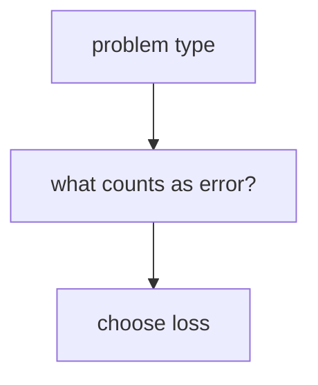

# P4-4.2 문제 유형별 손실

P4-4.1에서는 손실 함수(loss function)를 `모델의 현재 출력이 목표와 얼마나 어긋나는지 숫자로 만드는 기준`으로 보았습니다. 이제 자연스럽게 다음 질문이 생깁니다.

모든 문제에서 같은 손실 함수를 쓰는가?

답은 그렇지 않다는 것입니다.

손실 함수는 문제 유형에 따라 달라진다. 왜냐하면 회귀(regression), 분류(classification), 생성(generation)은 틀림의 모양 자체가 다르기 때문이다.

## 이 절의 범위

이 절은 다음 질문에 답합니다.

- 회귀와 분류는 왜 다른 손실 기준을 쓰는가?
- 숫자를 맞히는 문제와 확률을 맞히는 문제는 어떻게 다르게 읽어야 하는가?
- 생성 문제에서는 `다음 토큰을 얼마나 그럴듯하게 맞히는가`가 왜 손실로 연결되는가?
- 손실 함수 선택이 모델 학습 방향에 어떤 차이를 만드는가?

이 절에서는 다음 내용을 깊게 다루지 않습니다.

- MSE, MAE, cross-entropy의 엄밀한 유도
- KL divergence와 maximum likelihood의 상세 연결
- label smoothing, focal loss, CTC loss 같은 특수 손실

MSE, MAE, cross-entropy의 엄밀한 유도와 KL divergence, maximum likelihood의 상세 연결은 여기서 수식 전개로 다루지 않습니다. 대신 손실의 미분과 학습 갱신 흐름은 P4-5.1, P4-5.2에서 다시 연결합니다. label smoothing, focal loss, CTC loss 같은 특수 손실은 이 책의 현재 본편 범위 밖에 둡니다.

이 절에서는 공식을 많이 보여 주기보다, `왜 문제마다 손실이 달라지는가`를 설명합니다. 손실의 미분과 학습 갱신 흐름은 P4-5.1, P4-5.2에서 다시 연결하고, label smoothing, focal loss, CTC loss 같은 특수 손실은 이 책의 현재 본편 범위 밖에 둡니다.

## 이 절의 목표

- 회귀, 분류, 생성 문제의 손실 관점을 구분할 수 있습니다.
- 회귀에서는 오차 크기, 분류에서는 정답 클래스 확신도, 생성에서는 다음 토큰 확률이 핵심이 된다는 점을 말할 수 있습니다.
- 손실 함수가 문제의 틀림 방식에 맞게 설계되어야 한다는 점을 이해할 수 있습니다.
- 작은 예제로 문제 유형별 손실 해석 차이를 설명할 수 있습니다.

## 왜 문제마다 손실이 달라지나

문제 유형이 다르면 `틀렸다`는 말의 의미도 달라집니다.

예를 들어:

- 주택 가격 예측은 `얼마나 벗어났는가`가 중요합니다.
- 스팸 메일 분류는 `정답 클래스에 얼마나 확신을 두었는가`가 중요합니다.
- 문장 생성은 `다음 단어를 얼마나 그럴듯하게 예측했는가`가 중요합니다.

즉, 손실 함수는 단순한 수학 공식이 아니라, `이 문제에서 무엇을 틀림으로 볼 것인가`를 정하는 규칙입니다.

이를 큰 흐름으로 줄이면 다음과 같습니다.



이 도식의 핵심은 모델보다 먼저 문제 구조를 봐야 한다는 점입니다.

## 회귀(regression)에서는 무엇이 중요하나

회귀는 보통 연속적인 숫자를 예측하는 문제입니다.

- 가격
- 온도
- 수요량
- 이동 거리

이런 문제에서는 `정답에서 얼마나 멀리 벗어났는가`가 중심이 됩니다.

즉, 회귀 손실은 오차(error)의 크기를 숫자로 모으는 방향으로 설계됩니다.

다음처럼 이해하면 충분합니다.

- 조금 틀리면 작은 손실
- 많이 틀리면 큰 손실

대표적으로는 평균제곱오차(mean squared error, MSE)나 평균절대오차(mean absolute error, MAE) 같은 관점이 나옵니다.

## 분류(classification)에서는 무엇이 중요하나

분류는 정답 클래스가 정해져 있는 문제입니다.

- 스팸 / 정상 메일
- 고양이 / 개
- 사기 거래 / 정상 거래

여기서는 단순히 맞았다/틀렸다도 중요하지만, 학습에서는 그보다 더 미세한 정보가 필요합니다.

예를 들어 모델이:

- 정답 클래스에 0.51 확률을 주었는지
- 정답 클래스에 0.99 확률을 주었는지

는 둘 다 맞았다고 볼 수 있지만, 학습 관점에서는 분명 차이가 있습니다.

즉, 분류 손실은 `정답 클래스에 얼마나 높은 확신을 주었는가`, 또는 `틀린 클래스에 얼마나 자신 있게 갔는가`를 더 민감하게 읽는 방향으로 설계됩니다.

이 때문에 cross-entropy가 대표 손실로 자주 등장합니다.

## 생성(generation)에서는 무엇이 중요하나

생성 문제는 분류와 닮은 듯 다릅니다. 특히 LLM 문맥에서는 한 번에 전체 문장을 맞히는 것이 아니라, 보통 `다음 토큰(next token)`을 예측하는 식으로 학습합니다.

즉, 생성 학습은 매우 자주 다음 구조로 읽을 수 있습니다.

- 현재까지의 문맥(context)을 보고
- 다음 토큰 후보들에 확률을 두고
- 실제 정답 토큰에 높은 확률을 주는 방향으로 학습

이 때문에 생성 문제의 손실도 분류와 가까운 확률적 손실을 쓰는 경우가 많습니다. 다만 차이는 이것이 한 번의 이진 판단이 아니라, 긴 시퀀스(sequence) 전체에 걸쳐 반복된다는 점입니다.

다음처럼 이해하면 충분합니다.

`생성 모델의 손실은 문장을 통째로 외우는 손실이 아니라, 매 위치에서 다음 토큰을 얼마나 잘 맞히는지를 쌓아 가는 손실이다.`

## 회귀와 분류를 비교해 보기

같은 `틀림`이라는 말이라도 회귀와 분류는 전혀 다르게 읽힙니다.

| 문제 유형 | 출력 형태 | 틀림을 읽는 핵심 |
| --- | --- | --- |
| 회귀 | 연속값 | 정답 숫자에서 얼마나 멀리 벗어났는가 |
| 분류 | 클래스 확률 | 정답 클래스에 얼마나 확신을 주었는가 |
| 생성 | 다음 토큰 확률 분포 | 정답 토큰을 얼마나 그럴듯하게 예측했는가 |

이 표를 이해하면 손실 함수가 단순한 구현 선택이 아니라, 문제 구조를 반영한다는 점이 선명해집니다.

## 사례로 보기

### 사례 1. 회귀

부동산 추천 서비스가 매물 하나의 적정 가격을 추정한다고 생각해 봅시다. 사람은 이 장면에서 먼저 `정답 가격과 얼마나 떨어져 있는가`를 봅니다.

- 실제 집값: 5.0억
- 예측 1: 4.9억
- 예측 2: 3.5억

여기서는 예측 1이 훨씬 덜 틀렸습니다. 사람도 `4.9억은 꽤 가깝고 3.5억은 많이 벗어났다`고 직관적으로 느끼기 쉽습니다. 회귀 문제에서 중요한 기준은 맞혔는가/틀렸는가가 아니라 `얼마나 멀리 벗어났는가`입니다. 그래서 손실은 보통 예측 1에 더 작은 숫자를 주고, 예측 2에는 더 큰 경고 신호를 주는 편이 자연스럽습니다. 이 차이가 있어야 가격 추천 서비스에서 `조금 보정하면 되는 모델`과 `전반적으로 다시 봐야 하는 모델`을 구분할 수 있습니다.
그래서 이 사례에서 확인해야 할 결과는 정답 여부가 아니라, 더 멀리 벗어난 예측에 실제로 더 큰 손실이 붙는가입니다.

### 사례 2. 분류

사진 자동 분류기가 반려동물 사진을 읽는다고 해 봅시다. 사람이 먼저 보는 기준은 보통 `맞혔는가`이지만, 실제 운영에서는 `얼마나 확신 있게 맞혔는가`도 함께 중요합니다. 정답 클래스가 `고양이`라고 합시다.

- 예측 1: 고양이 0.55, 개 0.45
- 예측 2: 고양이 0.95, 개 0.05

둘 다 정답을 맞혔지만, 학습 관점에서는 예측 2가 훨씬 더 낫다고 읽는 편이 자연스럽습니다. 사람은 둘 다 1등이 `고양이`이니 비슷하다고 보기 쉽지만, 분류 문제에서는 `얼마나 확신 있게 정답을 밀었는가`가 매우 중요합니다. 고객센터 자동 분류처럼 잘못 보내면 후속 처리 비용이 큰 문제에서는 `맞히긴 했지만 거의 헷갈린 상태`와 `확신 있게 맞힌 상태`를 같은 것으로 보면 다음 학습 방향이 흐려집니다. 예를 들어 자동 처리 임계치를 둘 때 0.55는 사람 검토로 보내고 0.95는 바로 확정하는 식의 차이가 생길 수 있습니다. 그래서 분류 손실은 단순 정오표보다 확률 분포를 더 세밀하게 봐야 합니다.
그래서 이 사례에서 확인해야 할 결과는 둘 다 정답이어도, 더 낮은 확신의 예측에 실제로 더 큰 손실이 남는가입니다.

### 사례 3. 생성

문장 자동완성이나 번역 모델이 다음 토큰을 고르는 장면을 떠올려 보겠습니다. 사람은 보통 `정답 단어를 1등으로 올렸는가`만 보면 충분하다고 느끼기 쉽지만, 실제 학습에서는 정답을 얼마나 강하게 밀었는지가 다음 업데이트를 바꿉니다. 다음 토큰 정답이 `apple`인데:

- 예측 1: apple 0.40, banana 0.35, orange 0.25
- 예측 2: apple 0.85, banana 0.10, orange 0.05

이 경우도 생성 손실은 예측 2를 더 좋은 상태로 읽는 편이 자연스럽습니다. 사람은 둘 다 `apple`을 1위로 올렸으니 비슷하다고 보기 쉽지만, 실제 생성에서는 정답 토큰에 얼마나 확신을 줬는지가 다음 업데이트 크기를 바꿉니다. 예를 들어 요약 문장이나 코드 토큰을 만들 때 이런 차이가 위치마다 계속 쌓이면 문장 전체 품질 차이로 이어질 수 있습니다. 즉, 생성 손실은 `맞혔는가`보다 `정답 토큰을 얼마나 강하게 밀어 주었는가`를 더 세밀하게 읽습니다. 그래서 이 사례에서 확인해야 할 결과는 같은 정답을 1위에 올렸더라도, 정답 토큰 확률을 더 강하게 준 예측이 실제 학습에서 더 작은 손실과 더 선명한 업데이트로 이어지는가입니다.

즉, 생성 손실은 `다음 토큰 정답에 얼마나 확률을 줬는가`와 밀접하게 연결됩니다.

머신러닝과 딥러닝 커리큘럼에서 문제 유형별 손실을 따로 설명하는 이유는, 모델 구조만 이해해서는 학습을 이해할 수 없기 때문입니다.

같은 신경망이라도:

- 마지막 출력이 연속값이면 회귀 쪽 손실을,
- 마지막 출력이 클래스 확률이면 분류 쪽 손실을,
- 마지막 출력이 토큰 분포면 생성 쪽 손실을

읽어야 합니다.

즉, 신경망의 내부 구조와 손실 함수는 분리된 주제가 아닙니다. 출력이 어떤 의미를 가지는지에 따라 손실도 함께 달라집니다.

이 흐름은 나중에 LLM을 볼 때 특히 중요합니다. LLM의 학습 손실이 `문장 품질 전체`를 직접 재는 것이 아니라, 많은 위치에서의 다음 토큰 예측 손실을 쌓아 가는 구조라는 점을 이해해야 하기 때문입니다.

## 실행 가능한 Python 예제로 회귀와 분류 차이 보기

이번 예제의 목표는 회귀와 분류에서 손실을 읽는 관점이 어떻게 다른지 아주 작은 숫자로 확인하는 것입니다.

입력:

- 회귀 예측과 목표
- 분류 정답 클래스 확률

출력:

- 회귀 오차 기반 손실
- 분류 확률 기반 손실

문제 상황:

- 회귀와 분류는 둘 다 손실을 쓰지만, 잘못됨을 숫자로 만드는 방식은 서로 다르다

확인할 개념:

- 회귀 손실은 값 차이를, 분류 손실은 정답 확률의 크기를 중심으로 읽는다
- 문제 유형이 바뀌면 손실 계산 방식도 같이 바뀐다는 점이 중요하다

입력(input):

위에 정리한 회귀 예측값·목표값과 분류 정답 확률을 사용합니다.

```python
import math

# regression-like view
target_value = 5.0
pred_value = 4.2
mse_like = (target_value - pred_value) ** 2

print("regression loss example =", round(mse_like, 3))

# classification-like view
true_class_probability = 0.8
cross_entropy_like = -math.log(true_class_probability)

print("classification loss example =", round(cross_entropy_like, 3))
```

실행 결과 예시는 다음처럼 읽을 수 있습니다.

```text
regression loss example = 0.64
classification loss example = 0.223
```

여기서 숫자의 크기를 서로 직접 비교하는 것이 목적은 아닙니다. 중요한 것은 무엇을 재고 있느냐입니다.

- 회귀 손실은 숫자 차이를 봅니다.
- 분류 손실은 정답 클래스 확률을 봅니다.

즉, 손실 함수의 숫자는 문제 구조에 따라 의미가 달라집니다.

## 생성 모델까지 연결하면 무엇이 보이나

생성 모델에서는 분류와 비슷한 손실을 긴 시퀀스에 걸쳐 반복합니다. 그래서 LLM도 구조적으로는 매우 큰 분류 문제를 다음 토큰마다 반복하는 것처럼 읽을 수 있습니다.

이 연결을 독자가 알면, Part 5에서 토큰(token), 다음 토큰 예측(next-token prediction), cross-entropy, perplexity 같은 말이 अचानक 등장해도 덜 낯설게 느껴집니다.

즉, Part 4의 손실 함수 설명은 Part 5의 LLM 학습 이해를 위한 준비이기도 합니다.

## 다음 장과의 연결

여기까지 오면 다음 질문이 남습니다.

- 손실이 계산되었다면, 그 손실은 앞쪽 층의 가중치까지 어떻게 전달되는가?
- 출력층에서 계산된 어긋남이 중간층과 초기층까지 어떻게 영향을 주는가?

이 질문은 바로 P4-5.1 역전파(backpropagation)의 직관으로 이어집니다.

## 이 절에서 기억할 관점

- 손실 함수는 문제 유형에 따라 달라집니다.
- 회귀는 보통 숫자 오차를, 분류는 정답 클래스 확률을, 생성은 다음 토큰 확률을 중심으로 읽습니다.
- 같은 신경망 구조라도 출력 의미가 다르면 손실 기준도 달라집니다.
- LLM 학습도 결국 다음 토큰 확률을 반복적으로 맞히는 손실 구조와 연결됩니다.

## 체크리스트

- 회귀, 분류, 생성 문제의 손실 관점을 구분할 수 있는가?
- 왜 회귀와 분류가 같은 손실을 그대로 쓰지 않는지 설명할 수 있는가?
- 분류 손실이 단순 정오표보다 확률을 더 세밀하게 본다는 점을 말할 수 있는가?
- 생성 모델 손실이 다음 토큰 예측과 연결된다는 점을 설명할 수 있는가?
- 다음 장에서 역전파로 이어진다는 흐름을 알고 있는가?

## 출처와 참고 자료

- Ian Goodfellow, Yoshua Bengio, Aaron Courville, `Deep Learning`, MIT Press, 2016, 확인 날짜: 2026-06-29. [https://www.deeplearningbook.org/](https://www.deeplearningbook.org/){: target="_blank" rel="noopener noreferrer" }
- Christopher M. Bishop, `Pattern Recognition and Machine Learning`, Springer, 2006, 확인 날짜: 2026-06-29.
