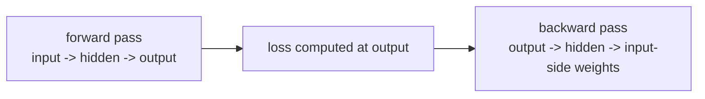

# P4-5.1 역전파(backpropagation)의 직관

P4-4장에서는 손실 함수(loss function)가 현재 출력과 목표 사이의 어긋남을 숫자로 만든다는 점을 보았습니다. 이제 다음 질문이 바로 이어집니다.

`손실이 계산되었다면, 그 손실은 앞쪽 층의 가중치를 어떻게 바꾸라고 알려 주는가?`

이 질문에 답하는 절차가 역전파(backpropagation)입니다.

초심자 기준에서는 다음 한 문장으로 먼저 잡으면 충분합니다.

`역전파는 출력 쪽에서 계산된 손실이 각 가중치에 얼마나 책임이 있는지, 뒤에서 앞으로 효율적으로 계산해 주는 절차이다.`

## 이 절의 범위

이 절은 다음 질문에 답합니다.

- 역전파는 무엇을 계산하는가?
- 왜 출력층에서 시작해 앞쪽 층으로 거꾸로 계산하는가?
- 연쇄 법칙(chain rule)은 왜 등장하는가?
- 역전파는 학습 전체와 어떻게 다르고, 어디에 들어가는가?

이 절은 다음 내용은 깊게 다루지 않습니다.

- 행렬 미분의 엄밀한 전개
- 다층 네트워크 전체의 상세 기호 유도
- 자동미분(automatic differentiation)의 일반 이론

복잡한 미분 흐름을 계산 그래프로 보는 관점은 P4-5.2에서 이어서 다룹니다.

## 이 절의 목표

- 역전파를 `손실이 각 가중치에 미치는 영향을 뒤에서 앞으로 계산하는 절차`로 설명할 수 있습니다.
- 역전파가 학습 전체가 아니라 gradient 계산 단계라는 점을 말할 수 있습니다.
- 연쇄 법칙(chain rule)이 왜 신경망에 자연스럽게 들어오는지 이해할 수 있습니다.
- 작은 예제로 손실 변화가 가중치 변화와 연결되는 감각을 읽을 수 있습니다.

## 왜 역전파가 필요한가

신경망은 층(layer)이 많아질수록 가중치(parameter)도 많아집니다. 손실(loss)이 하나 줄었다고 해서, 어느 가중치를 얼마나 바꿔야 하는지는 바로 보이지 않습니다.

예를 들어:

- 출력이 틀렸습니다.
- 그런데 그 틀림이 마지막 층 때문인지
- 중간 층 표현 때문인지
- 맨 앞 입력 가중치 때문인지

를 구분해야 합니다.

즉, 역전파는 `누가 얼마나 틀림에 기여했는가`를 계산하는 절차처럼 읽을 수 있습니다.

## 왜 뒤에서 앞으로 계산하나

출력층은 손실과 가장 직접적으로 연결되어 있습니다.

- 최종 출력이 있고
- 목표값이 있고
- 그 둘을 비교해 손실이 계산됩니다

따라서 `손실이 출력에 어떻게 반응하는가`는 먼저 알기 쉽습니다. 그다음에는 그 출력이 바로 앞 층 값들에 의존했다는 점을 이용해, 영향도를 한 단계씩 거꾸로 전달합니다.

즉, 역전파는 다음 흐름으로 읽으면 좋습니다.

> 최종 출력의 틀림을 본다
> -> 그 틀림이 마지막 층에 얼마나 연결되는지 계산한다
> -> 그 영향을 다시 앞층으로 넘긴다
> -> 처음 층까지 반복한다

이를 아주 단순하게 그리면 다음과 같습니다.



이 도식의 핵심은 순전파(forward pass)와 역전파(backward pass)가 방향이 다르다는 점입니다.

## 역전파는 학습 전체가 아니다

초심자는 자주 `역전파 = 학습`이라고 이해합니다. 하지만 엄밀히 말하면 둘은 같지 않습니다.

이 절에서 먼저 다음처럼 구분하면 충분합니다.

| 단계 | 역할 |
| --- | --- |
| 순전파(forward pass) | 현재 파라미터로 출력을 계산 |
| 손실 계산(loss computation) | 출력과 목표의 차이를 숫자로 계산 |
| 역전파(backpropagation) | 각 파라미터에 대한 gradient를 계산 |
| 옵티마이저(optimizer) | 그 gradient를 이용해 파라미터를 업데이트 |

즉, 역전파는 학습 전체가 아니라, `업데이트에 필요한 기울기(gradient)를 계산하는 단계`입니다.

이 구분은 뒤에서 SGD와 Adam을 볼 때 매우 중요합니다.

## 연쇄 법칙(chain rule)은 왜 등장하나

신경망은 함수가 여러 단계로 겹쳐 있는 구조입니다.

예를 들어 아주 단순하게 쓰면:

\[
x \rightarrow z \rightarrow a \rightarrow y \rightarrow loss
\]

즉, 손실은 직접적으로 처음 입력이나 가중치에 달려 있는 것이 아니라, 여러 중간 값을 거쳐 간접적으로 연결됩니다.

이런 구조에서는 한 단계 변화가 다음 단계에 어떤 영향을 주는지를 이어 붙여야 합니다. 이때 등장하는 것이 연쇄 법칙(chain rule)입니다.

초심자 기준에서는 다음처럼 이해하면 충분합니다.

`뒤쪽 결과가 앞쪽 값에 의존하고 있다면, 그 의존 관계를 단계별로 곱해 가며 영향도를 전파한다.`

즉, 역전파는 신경망의 깊은 함수 구조에 연쇄 법칙을 효율적으로 적용한 절차입니다.

## 작은 사례로 보기

아주 단순한 신경망을 생각해 봅니다.

- 입력 하나 \(x\)
- 가중치 하나 \(w\)
- 출력 \(y = wx\)
- 손실 \(L = (y - t)^2\)

이때 손실이 줄어들려면 `w`를 어떻게 바꿔야 하는지 알아야 합니다.

직접적인 감각으로 읽으면:

- 예측이 너무 크면 가중치를 줄여야 할 수 있고
- 예측이 너무 작으면 가중치를 키워야 할 수 있습니다

역전파는 이런 감각을 단순한 직관이 아니라, 모든 층에 대해 반복 가능한 계산으로 바꿉니다.

## 누가 얼마나 책임이 있는가를 계산한다는 뜻

역전파를 사람식으로 비유하면:

- 최종 결과가 틀렸을 때
- 마지막 단계가 얼마나 책임이 있는지 보고
- 그 마지막 단계가 앞단의 어떤 계산에 기대고 있었는지 다시 따지고
- 그 책임을 앞단까지 나누어 전달하는 과정

처럼 이해할 수 있습니다.

물론 실제 계산은 수학적으로 정확하게 이루어지지만, 초심자에게는 `책임 분해`라는 감각이 큰 도움이 됩니다.

## 작은 Python 예제로 gradient 감각 보기

이번 예제의 목표는 역전파 전체를 코드로 재구현하는 것이 아니라, 아주 작은 예에서 손실이 가중치에 어떤 방향 신호를 주는지 확인하는 것입니다.

입력:

- 입력값 `x`
- 목표값 `target`
- 현재 가중치 `w`

출력:

- 예측값
- 손실
- 가중치에 대한 gradient

```python
x = 2.0
target = 5.0
w = 1.5

# forward
prediction = w * x
loss = (prediction - target) ** 2

# backward
gradient_w = 2 * (prediction - target) * x

print("prediction =", round(prediction, 3))
print("loss =", round(loss, 3))
print("gradient_w =", round(gradient_w, 3))
```

실행 결과 예시는 다음처럼 읽을 수 있습니다.

```text
prediction = 3.0
loss = 4.0
gradient_w = -8.0
```

이 숫자의 핵심은 `-8.0`입니다.

- 현재 예측은 3.0이고 목표는 5.0입니다
- 즉, 예측이 너무 작습니다
- gradient가 음수라는 것은, 보통 `w`를 키우는 방향으로 업데이트하면 손실을 줄일 수 있다`는 신호로 읽을 수 있습니다

즉, 역전파는 각 파라미터에 대해 `어느 방향으로 바꾸는 것이 손실을 줄이는가`를 알려 줍니다.

## 다층 신경망에서는 무엇이 더 어려워지나

방금 예제는 가중치 하나뿐이라 단순했습니다. 하지만 다층 신경망에서는:

- 출력이 여러 층을 거쳐 오고
- 각 층마다 가중치가 많고
- 각 층의 값이 다음 층의 입력이 됩니다

따라서 손실의 영향도를 각 층에 다시 분배해 주는 절차가 필요합니다. 역전파는 바로 그 분배를 효율적으로 처리합니다.

초심자에게는 다음처럼 기억하면 충분합니다.

`층이 깊어질수록 gradient를 직접 손으로 쓰기는 어렵지만, 역전파는 그 계산을 체계적으로 뒤에서 앞으로 전달한다.`

## 역사와 커리큘럼 관점

역전파의 역사에서는 여러 전조와 기여가 있지만, 신경망 학습 맥락에서 가장 널리 알려진 전환점은 Rumelhart, Hinton, Williams의 1986년 논문입니다. 그 작업은 다층 신경망이 유용한 내부 표현을 학습할 수 있음을 널리 보여 주는 계기가 되었습니다.

더 넓게 보면, Paul Werbos의 1974년 박사 논문 같은 더 이른 작업도 자주 언급됩니다. 초심자 기준에서는 다음 정도로 기억하면 충분합니다.

- 더 이른 수학적/최적화적 아이디어가 있었고
- 1980년대 중반에 신경망 학습 절차로 널리 알려지며 큰 전환점이 되었다

커리큘럼 관점에서도 역전파는 매우 중요한 절입니다. 이유는 단순합니다.

- 손실 함수가 있어도
- 그 손실이 각 층에 어떻게 연결되는지 모르면
- 실제 학습 업데이트가 불가능하기 때문입니다

즉, 역전파는 `딥러닝이 실제로 학습된다`는 말을 가능하게 하는 계산 절차입니다.

## 다음 절과의 연결

여기까지 오면 다음 질문이 자연스럽게 남습니다.

- 이렇게 뒤에서 앞으로 계산하는 흐름을 더 복잡한 네트워크에서는 어떻게 체계적으로 정리하는가?
- 여러 연산이 섞인 구조를 무엇으로 이해하면 좋은가?

이 질문은 바로 P4-5.2 계산 그래프(computation graph)로 이어집니다.

## 이 절에서 기억할 관점

- 역전파는 손실이 각 가중치에 미치는 영향을 뒤에서 앞으로 계산하는 절차입니다.
- 역전파는 학습 전체가 아니라 gradient 계산 단계입니다.
- 연쇄 법칙(chain rule)은 깊은 함수 구조의 영향도를 단계별로 전파하게 해 줍니다.
- 역전파는 각 파라미터에 대해 손실을 줄이는 방향 신호를 제공합니다.

## 체크리스트

- 역전파를 `손실의 책임을 뒤에서 앞으로 분배하는 계산`으로 설명할 수 있는가?
- 역전파와 옵티마이저의 역할을 구분할 수 있는가?
- 연쇄 법칙이 왜 신경망에서 자연스럽게 등장하는지 말할 수 있는가?
- 작은 예제로 gradient가 어떤 방향 신호를 주는지 설명할 수 있는가?
- 다음 절에서 계산 그래프로 이어진다는 흐름을 알고 있는가?

## 출처와 참고 자료

- David E. Rumelhart, Geoffrey E. Hinton, Ronald J. Williams, `Learning representations by back-propagating errors`, Nature, 1986, 확인 날짜: 2026-06-29.
- Paul J. Werbos, `Beyond Regression: New Tools for Prediction and Analysis in the Behavioral Sciences`, Harvard University doctoral thesis, 1974, 확인 날짜: 2026-06-29.
- Ian Goodfellow, Yoshua Bengio, Aaron Courville, `Deep Learning`, MIT Press, 2016, 확인 날짜: 2026-06-29. [https://www.deeplearningbook.org/](https://www.deeplearningbook.org/){: target="_blank" rel="noopener noreferrer" }
