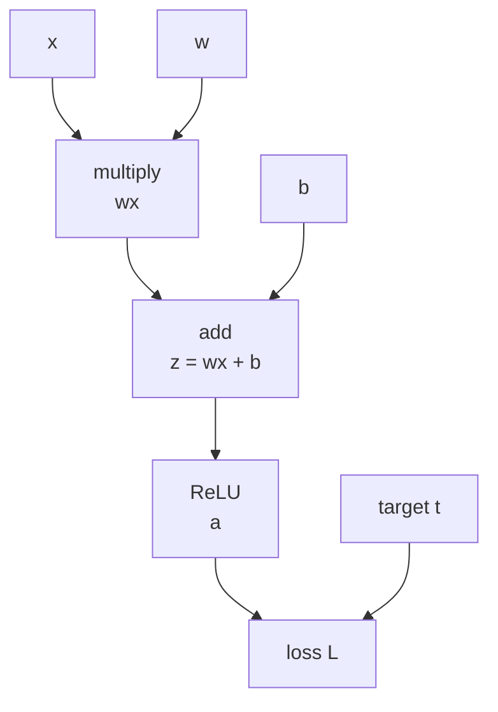

# P4-5.2 계산 그래프(computation graph)

P4-5.1에서는 역전파(backpropagation)를 `손실이 각 가중치에 얼마나 책임이 있는지 뒤에서 앞으로 계산하는 절차`로 설명했습니다. 여기까지 이해하면 다음 질문이 남습니다.

층이 많고 연산이 복잡해지면, 그 계산 관계를 어떻게 정리해야 역전파를 읽을 수 있는가?

이 질문에 답하는 관점이 계산 그래프(computation graph)입니다.

계산 그래프는 모델의 연산을 노드(node)와 연결(edge)로 펼쳐 놓아, 값이 어디서 만들어지고 gradient가 어디로 되돌아가는지 보이게 하는 표현이다.

## 이 절의 범위

이 절은 다음 질문에 답합니다.

- 계산 그래프는 무엇을 표현하는가?
- 왜 딥러닝에서 연산을 그래프로 보는가?
- 순전파(forward pass)와 역전파(backward pass)는 그래프에서 어떻게 읽히는가?
- 자동미분(automatic differentiation)과 어떤 관계가 있는가?

이 절에서는 다음 내용을 깊게 다루지 않습니다.

- 동적 계산 그래프와 정적 계산 그래프의 프레임워크별 구현 차이
- reverse-mode automatic differentiation의 엄밀한 수학 전개
- 대규모 프레임워크 내부 엔진 구현

동적 계산 그래프와 정적 계산 그래프의 구현 차이는 여기서 다루지 않습니다. 대신 gradient가 optimizer update로 이어지는 큰 흐름은 P4-7.1, P4-7.2에서 다시 회수합니다. reverse-mode automatic differentiation의 엄밀한 수학 전개와 대규모 프레임워크 내부 엔진 구현은 이 책의 현재 본편 범위 밖에 둡니다.

이 절에서는 그래프 이론 자체를 배우기보다, `딥러닝 계산을 그래프처럼 읽는 이유`를 설명합니다. 실제 학습 단계에서 gradient가 optimizer와 만나 파라미터를 바꾸는 흐름은 P4-7.1, P4-7.2에서 다시 연결합니다. 프레임워크별 구현 차이와 내부 엔진 구현은 이 책의 현재 본편 범위 밖에 둡니다.

Part 4 기준에서는 여기까지면 역전파를 이해하는 데 필요한 본문 책임이 이미 닫힙니다. 즉, 별도의 `역전파 수학 보충학습`을 더 두기보다, 현재 절까지에서 `손실 책임 분배`, `연쇄 법칙`, `계산 그래프` 감각을 잡고 이후 optimizer 절로 넘어가는 편이 이 책의 초심자 흐름에 더 맞습니다.

처음 읽을 때는 이 절이 `새 모델 구조를 소개하는 절`이 아니라, 이미 본 구조를 `어떻게 계산하고 어떻게 gradient를 되돌려 보내는가`를 읽는 절이라는 점을 먼저 구분해 두면 더 안전합니다.

| 지금 절에서 읽는 것 | 왜 여기서 필요한가 |
| --- | --- |
| 계산 구조의 연결 관계 | 어떤 중간값이 어디서 만들어지고 어디로 전달되는지 보여 주기 때문입니다. |
| 학습 절차의 backward 흐름 | 손실이 각 연산에 얼마나 책임을 나누는지 단계별로 읽게 해 주기 때문입니다. |
| 다음 optimizer 절과의 연결 | gradient가 계산된 뒤 실제 파라미터를 어떻게 바꿀지는 P4-7에서 다시 보기 때문입니다. |

## 이 절의 목표

- 계산 그래프를 `연산 의존 관계를 펼쳐 놓은 그림`으로 설명할 수 있습니다.
- 순전파는 값 계산, 역전파는 gradient 전달이라는 점을 그래프 위에서 읽을 수 있습니다.
- 계산 그래프가 복잡한 미분을 단계별로 잘게 나누게 해 준다는 점을 이해할 수 있습니다.
- 실행 가능한 Python 예제로 중간값 저장과 gradient 계산의 흐름을 확인할 수 있습니다.

## 계산 그래프는 무엇을 그리는가

신경망은 입력을 한 번에 정답으로 바꾸는 마법 상자가 아닙니다. 실제로는 많은 작은 연산이 연결된 구조입니다.

예를 들어:

- 입력 \(x\)를 받습니다
- 가중치 \(w\)를 곱합니다
- 편향 \(b\)를 더합니다
- 활성화 함수를 통과시킵니다
- 손실을 계산합니다

이 흐름을 글로만 읽으면 금방 복잡해집니다. 계산 그래프는 이 연산들을 `작은 단계들로 나누어 연결한 그림`입니다.

즉, 계산 그래프는 다음 두 가지를 동시에 보여 줍니다.

1. 값(value)이 어디서 만들어지는가
2. 의존 관계(dependency)가 어떻게 이어지는가

## 왜 그래프로 보아야 하나

종종 수식이 길어질수록 역전파가 추상적이라고 느낍니다. 그 이유는 전체 식을 한 덩어리로 보기 때문입니다.

하지만 계산 그래프로 바꾸면:

- 큰 식이 작은 연산 단위로 분해되고
- 각 노드가 누구에게 의존하는지 보이고
- gradient도 같은 경로를 거꾸로 따라간다는 점이 드러납니다

즉, 계산 그래프는 복잡한 미분을 새로 만드는 것이 아니라, `이미 있는 계산 흐름을 보이게` 합니다.

다음처럼 이해하면 충분합니다.

`계산 그래프는 큰 수식을 작은 박스로 나누어, forward에서는 값을 계산하고 backward에서는 영향도를 되돌려 보내게 한다.`

## 가장 작은 예로 보기

다음 식을 생각해 봅니다.

\[
z = wx + b
\]

\[
a = ReLU(z)
\]

\[
L = (a - t)^2
\]

이 식을 한 줄로만 보면 복잡하지 않아 보일 수 있습니다. 하지만 신경망에서는 이런 구조가 수천, 수만 번 반복됩니다. 그래서 작은 연산 단위를 노드로 나누는 관점이 중요해집니다.

이를 아주 단순하게 그리면 다음과 같습니다.



이 그림은 두 가지를 보여 줍니다.

- 순전파에서는 왼쪽에서 오른쪽으로 값이 계산됩니다
- 역전파에서는 손실에서 시작한 gradient가 오른쪽에서 왼쪽으로 전달됩니다

## 순전파는 그래프 위에서 어떻게 읽나

순전파(forward pass)는 그래프의 각 노드에서 실제 숫자를 계산하는 단계입니다.

예를 들어:

1. `multiply` 노드는 \(w\)와 \(x\)를 받아 \(wx\)를 만듭니다
2. `add` 노드는 그 결과에 \(b\)를 더해 \(z\)를 만듭니다
3. `ReLU` 노드는 \(z\)를 받아 \(a\)를 만듭니다
4. `loss` 노드는 \(a\)와 목표 \(t\)를 비교해 손실을 만듭니다

즉, 순전파는 그래프를 따라가며 중간값(intermediate value)을 채우는 과정입니다.

이 중간값 저장이 중요한 이유는, 역전파에서 바로 이 값들이 다시 필요하기 때문입니다.

## 역전파는 그래프 위에서 어떻게 읽나

역전파(backward pass)는 손실 노드에서 출발해, 각 이전 노드가 손실에 얼마나 기여했는지 gradient를 계산하며 되돌아가는 단계입니다.

예를 들어:

- 손실이 \(a\)에 얼마나 민감한지 먼저 봅니다
- \(a\)가 \(z\)에 얼마나 민감한지 봅니다
- \(z\)가 \(w\), \(x\), \(b\)에 얼마나 민감한지 다시 나눕니다

즉, 그래프는 다음 질문을 단계별로 분해합니다.

`이 값이 조금 바뀌면, 최종 손실은 얼마나 바뀌는가?`

이 분해가 바로 연쇄 법칙(chain rule)을 실제 계산 절차로 바꾸는 방식입니다.

## 계산 그래프는 연쇄 법칙을 어떻게 쉽게 만드나

P4-5.1에서 연쇄 법칙은 `단계별 영향도를 이어 붙이는 규칙`이라고 설명했습니다. 계산 그래프는 그 단계를 눈에 보이게 합니다.

예를 들어 손실 \(L\)이 \(a\)에 의존하고, \(a\)가 \(z\)에 의존하고, \(z\)가 \(w\)에 의존한다면:

\[
\frac{\partial L}{\partial w}
\]

를 한 번에 외우는 대신,

- \(L\)이 \(a\)에 얼마나 민감한지
- \(a\)가 \(z\)에 얼마나 민감한지
- \(z\)가 \(w\)에 얼마나 민감한지

를 차례대로 곱해 읽을 수 있습니다.

다음처럼 기억하면 충분합니다.

`계산 그래프는 미분을 거대한 공식으로 보지 않고, 노드마다 작은 국소 규칙(local rule)로 나누게 한다.`

## 자동미분(automatic differentiation)과의 관계

현대 딥러닝 프레임워크를 사용할 때는 우리가 역전파 공식을 일일이 손으로 쓰지 않는 경우가 많습니다. PyTorch, TensorFlow, JAX 같은 도구는 계산 그래프를 바탕으로 gradient를 자동으로 계산합니다.

여기서 중요한 점은 다음입니다.

`자동미분은 마법처럼 gradient를 만들어 내는 것이 아니라, 계산 그래프를 따라 국소 미분 규칙을 체계적으로 적용하는 절차다.`

즉, 자동미분을 이해하려면 먼저 계산 그래프를 이해하는 편이 자연스럽습니다.

다음 정도로 정리하면 충분합니다.

- 순전파: 값을 계산하고 기억한다
- 역전파: 기억한 흐름을 따라 gradient를 계산한다
- 자동미분: 이 두 단계를 프레임워크가 대신 조직해 준다

## 사례로 보기

### 사례 1. 스프레드시트와 비슷한 감각

계산 그래프는 스프레드시트(spreadsheet)와 비슷한 면이 있습니다.

- 어떤 셀은 다른 셀 값을 참조해 계산됩니다
- 뒤쪽 셀의 값이 바뀌면 앞단 입력 관계를 따라 영향을 추적할 수 있습니다

예를 들어 총매출 셀이 수량, 단가, 할인율 셀을 함께 참조한다고 해 봅시다. 최종 결과가 예상보다 작으면, 사람은 보통 마지막 결과 셀만 다시 보면서 `왜 작지?`라고 생각하기 쉽습니다. 하지만 실제 원인을 찾으려면 할인율이 커졌는지, 수량 입력이 잘못 들어갔는지, 단가 계산식이 바뀌었는지를 참조 관계를 따라 다시 봐야 합니다. 계산 그래프도 같은 식으로 `최종 결과만 본다`에서 멈추지 않고, 어떤 중간 계산이 어떤 입력에 기대고 있었는지를 펼쳐 보게 만듭니다. 물론 스프레드시트 자체가 역전파를 하는 것은 아니지만, `의존 관계가 있는 계산망`이라는 감각은 매우 비슷합니다.
그래서 이 사례에서 확인해야 할 결과는 마지막 결과값만 보는 것이 아니라, 어떤 중간 계산이 어떤 입력을 참조했는지를 실제로 거슬러 올라가 읽을 수 있는가입니다.

### 사례 2. 이미지 분류 네트워크

고양이와 강아지 사진을 분류하는 이미지 모델을 떠올려 보겠습니다. 사람은 마지막에 나온 `고양이 0.82` 같은 점수만 보면 충분하다고 느끼기 쉽지만, 실제 계산은 합성곱(convolution), 활성화(activation), 풀링(pooling), 완전연결층(fully connected layer), 손실 계산이 길게 이어진 흐름입니다.

이 전체를 한 줄 수식으로만 보면 읽기 어렵고, 중간에 어디서 값이 크게 바뀌었는지도 보이지 않습니다. 사람은 마지막 분류 점수만 보고 `틀렸으니 마지막 층만 고치면 되지 않을까`라고 생각하기 쉽지만, 실제로는 앞쪽 합성곱 층이 어떤 특징을 만들었는지, 중간 활성화가 어디서 크게 잘렸는지, 어느 블록 출력이 뒤 블록 입력으로 이어졌는지를 같이 봐야 합니다. 계산 그래프 관점은 이 긴 계산을 `연산 블록의 연결`로 읽게 해 주고, 어느 블록에서 값이 만들어지고 어디로 전달되는지 추적하기 쉽게 만듭니다. 그 결과 오류를 하나의 점수가 아니라 `연결된 계산 흐름의 문제`로 읽을 수 있게 됩니다.
그래서 이 사례에서 확인해야 할 결과는 마지막 점수 하나보다, 어느 연산 블록에서 값이 만들어지고 다음 블록으로 어떻게 전달되는지를 실제로 나눠 볼 수 있는가입니다.

## 실행 가능한 Python 예제로 중간값과 gradient 흐름 보기

이번 예제의 목표는 자동미분 라이브러리를 쓰지 않고, 아주 작은 식에서 `forward에서 어떤 중간값이 만들어지고`, `backward에서 어떤 gradient가 계산되는지`를 직접 확인하는 것입니다. 한 번의 값만 보는 대신 표 형태로 forward와 backward를 나누어 읽게 하겠습니다.

입력:

- `x`, `w`, `b`, `target`

출력:

- 순전파 중간값 `mul`, `z`, `a`, `loss`
- 역전파 gradient `d_loss_da`, `d_loss_dz`, `d_loss_dw`, `d_loss_db`
- 어떤 중간값이 어떤 gradient 계산에 다시 쓰이는지에 대한 연결

문제 상황:

- 역전파는 최종 손실에서 출발해 중간값을 거꾸로 따라가므로, 순전파와 역전파 값을 한 번에 보는 것이 이해에 도움이 된다

확인할 개념:

- 역전파 gradient는 순전파 중간값을 다시 사용해 계산된다
- 각 단계의 중간값과 gradient를 함께 출력하면 계산 연결을 추적하기 쉽다

입력(input):

위에 정리한 `x`, `w`, `b`, `target`을 사용합니다.

```python
def relu(value):
    return max(0.0, value)

x = 2.0
w = 1.5
b = -0.5
target = 4.0

# forward
mul = w * x
z = mul + b
a = relu(z)
loss = (a - target) ** 2

# backward
d_loss_da = 2 * (a - target)
d_a_dz = 1.0 if z > 0 else 0.0
d_loss_dz = d_loss_da * d_a_dz
d_z_dw = x
d_z_db = 1.0
d_loss_dw = d_loss_dz * d_z_dw
d_loss_db = d_loss_dz * d_z_db

forward_values = {
    "mul": round(mul, 3),
    "z": round(z, 3),
    "a": round(a, 3),
    "loss": round(loss, 3),
}
backward_values = {
    "d_loss_da": round(d_loss_da, 3),
    "d_loss_dz": round(d_loss_dz, 3),
    "d_loss_dw": round(d_loss_dw, 3),
    "d_loss_db": round(d_loss_db, 3),
}

print("[forward]")
for key, value in forward_values.items():
    print(key, "=", value)

print("[backward]")
for key, value in backward_values.items():
    print(key, "=", value)

print("[connections]")
print("z influences a, and a influences loss")
print("x flows into mul, mul flows into z, so gradient returns to w through z")
```

출력에서는 forward 값들, backward gradient들, 그리고 connections 설명을 순서대로 보면 됩니다.

```text
[forward]
mul = 3.0
z = 2.5
a = 2.5
loss = 2.25
[backward]
d_loss_da = -3.0
d_loss_dz = -3.0
d_loss_dw = -6.0
d_loss_db = -3.0
[connections]
z influences a, and a influences loss
x flows into mul, mul flows into z, so gradient returns to w through z
```

이 예제에서 중요한 것은 다음입니다.

- forward에서는 중간값이 단계별로 만들어집니다
- backward에서는 마지막 손실에서 시작한 변화량이 앞단 파라미터까지 분해됩니다
- 각 노드는 자기 앞뒤 관계만 알면 gradient 계산에 참여할 수 있습니다

즉, 계산 그래프는 큰 문제를 작은 국소 계산으로 쪼개게 합니다.

계산 그래프 관점은 단지 교육용 그림이 아닙니다. 현대 딥러닝 프레임워크의 자동미분과 학습 시스템을 이해하는 실질적인 입구입니다.

딥러닝이 널리 퍼지면서 신경망 구조는 점점 더 복잡해졌고, 사람 손으로 전체 미분을 전개하는 방식은 실용적이지 않게 되었습니다. 이때 연산을 그래프로 보고, 국소 미분 규칙을 조합하는 관점이 훨씬 더 실용적인 설명이 되었습니다.

커리큘럼 관점에서 이 절에서 확인해야 할 결과는 바로 앞의 P4-5.1 역전파 직관을 단순 공식 암기가 아니라, 연산 블록 연결과 국소 미분 규칙의 조합으로 더 체계적으로 읽게 되는가입니다.

- 역전파의 직관만 있으면 아직 계산 흐름이 흐릿할 수 있고
- 옵티마이저를 배우기 전에 gradient가 어디서 오는지 더 분명히 알아야 하며
- 이후 CNN, RNN, Attention 같은 구조도 사실은 연산 블록의 연결로 읽는 편이 자연스럽기 때문입니다

즉, 계산 그래프는 Part 4 전체의 공통 독해 도구라고 볼 수 있습니다.

## 다음 절과의 연결

여기까지 오면 다음 질문이 남습니다.

- gradient가 계산된 뒤, 실제 파라미터는 누가 바꾸는가?
- 학습 중과 배포 중은 왜 같은 모델이라도 다르게 다뤄야 하는가?

이 질문은 P4-6.1 학습(learning)과 모델 실행(inference)으로 이어집니다.

## 이 절에서 기억할 관점

- 계산 그래프는 연산 의존 관계를 펼쳐 놓은 표현입니다.
- 순전파는 그래프를 따라 값을 계산하는 단계입니다.
- 역전파는 손실에서 시작한 gradient를 그래프를 따라 되돌려 보내는 단계입니다.
- 계산 그래프를 읽을 때는 복잡한 전체 미분식 대신, 각 연산 블록의 국소 규칙을 연결해 gradient가 어떻게 전달되는지 확인합니다.
- 자동미분은 계산 그래프를 바탕으로 gradient 계산을 조직하는 방식입니다.

## 체크리스트

- 계산 그래프를 `연산 흐름과 의존 관계를 보이는 그림`으로 설명할 수 있는가?
- 순전파와 역전파를 그래프 위에서 방향 차이로 설명할 수 있는가?
- 중간값 저장이 왜 필요한지 말할 수 있는가?
- 자동미분이 계산 그래프와 어떤 관계가 있는지 입문 수준에서 설명할 수 있는가?

## 출처와 참고 자료

- Ian Goodfellow, Yoshua Bengio, Aaron Courville, `Deep Learning`, MIT Press, 2016, 확인 날짜: 2026-06-29. [https://www.deeplearningbook.org/](https://www.deeplearningbook.org/){: target="_blank" rel="noopener noreferrer" }
- Christopher M. Bishop, `Pattern Recognition and Machine Learning`, Springer, 2006, 확인 날짜: 2026-06-29.
- Andrej Karpathy, `micrograd`, GitHub, 확인 날짜: 2026-06-29. [https://github.com/karpathy/micrograd](https://github.com/karpathy/micrograd){: target="_blank" rel="noopener noreferrer" }
