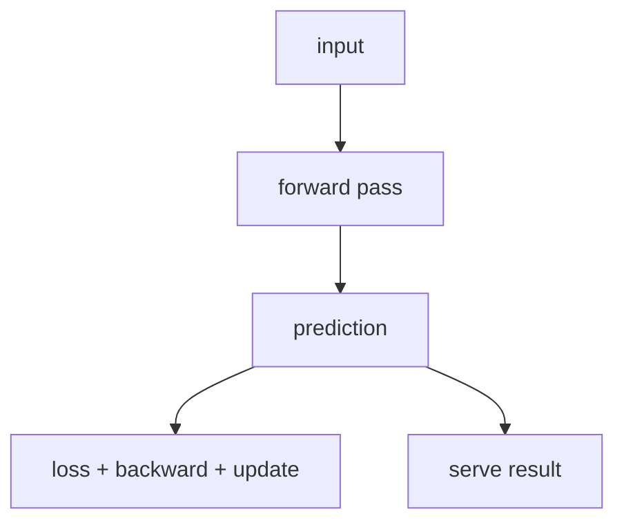

# P4-6.1 학습(learning)과 모델 실행(inference)

P4-5장에서는 손실(loss), 역전파(backpropagation), 계산 그래프(computation graph)를 통해 딥러닝 모델이 어떻게 gradient를 계산하는지 보았습니다. 여기까지 오면 다음 질문이 생깁니다.

gradient까지 계산했다면, 지금 이 모델은 학습 중인가, 아니면 그냥 사용 중인가?

이 질문은 매우 중요합니다. 독자는 모델이 언제나 같은 방식으로 작동한다고 생각하기 쉽지만, 딥러닝에서는 `파라미터를 바꾸는 단계`와 `이미 배운 파라미터를 사용하는 단계`를 분리해서 보는 것이 매우 중요합니다.

학습(learning)은 모델 파라미터를 바꾸는 단계이고, 모델 실행(inference)은 바꾸지 않고 현재 파라미터로 결과를 계산하는 단계이다.

## 이 절의 범위

이 절은 다음 질문에 답합니다.

- 학습과 모델 실행은 왜 구분해야 하는가?
- 딥러닝 문맥에서 학습 단계는 무엇을 포함하는가?
- 모델 실행 단계에서는 무엇이 달라지는가?
- 같은 모델이라도 학습 중과 사용 중에 읽는 관점이 왜 다른가?

이 절에서는 다음 내용을 깊게 다루지 않습니다.

- dropout과 batch normalization의 내부 수식
- 배포 인프라(inference serving) 세부 구조
- mixed precision, quantization 같은 시스템 최적화

학습 모드와 평가 모드의 구체적 차이는 P4-6.2에서 이어서 다루고, dropout과 regularization의 큰 의미는 P4-8.1, P4-8.2에서 다시 연결합니다. mixed precision, quantization, 배포 인프라 세부 구조는 이 책의 현재 본편 범위 밖에 둡니다.

## 이 절의 목표

- 학습과 모델 실행을 `파라미터 변경 여부`로 구분할 수 있습니다.
- 학습이 순전파만이 아니라 손실 계산, 역전파, 업데이트까지 포함한다는 점을 설명할 수 있습니다.
- 모델 실행은 결과를 계산하지만 파라미터를 바꾸지 않는 단계라는 점을 말할 수 있습니다.
- 작은 Python 예제로 두 단계의 차이를 확인할 수 있습니다.

## 왜 이 구분이 중요한가

딥러닝 입문에서 흔한 오해는 다음과 같습니다.

- 데이터를 넣고 결과가 나오면 그게 곧 학습이다
- 모델이 한 번 결과를 냈으니 이미 배웠다
- 예측을 여러 번 하면 모델이 점점 더 좋아진다

하지만 실제로는 그렇지 않습니다.

모델이 좋아지려면 다음 단계가 필요합니다.

1. 현재 파라미터로 예측을 만듭니다
2. 정답과 비교해 손실을 계산합니다
3. gradient를 계산합니다
4. optimizer가 파라미터를 업데이트합니다

즉, 단순히 `결과를 낸다`는 사실만으로는 학습이 일어나지 않습니다.

다음처럼 정리하면 충분합니다.

`결과 계산은 inference에서도 할 수 있지만, learning은 그 결과를 이용해 모델 내부 숫자를 실제로 바꾸는 과정까지 포함한다.`

## 딥러닝에서 학습(learning)은 무엇을 포함하나

이 책에서는 딥러닝 문맥의 학습을 다음 네 단계 묶음으로 이해하면 충분합니다.

| 단계 | 역할 |
| --- | --- |
| 순전파(forward pass) | 현재 파라미터로 예측을 계산 |
| 손실 계산(loss computation) | 예측과 정답의 차이를 숫자로 계산 |
| 역전파(backpropagation) | 각 파라미터에 대한 gradient를 계산 |
| 업데이트(update) | optimizer가 파라미터를 실제로 바꿈 |

이 네 단계가 모두 있어야 `학습이 한 번 일어났다`고 말할 수 있습니다.

즉, 딥러닝에서 learning은 단순히 데이터를 많이 보는 일이 아니라, `손실을 기준으로 파라미터를 반복적으로 조정하는 일`입니다.

## 모델 실행(inference)은 무엇을 하는가

모델 실행(inference)은 현재 파라미터를 고정한 채 입력에 대한 결과를 계산하는 단계입니다.

예를 들어:

- 사용자가 사진을 올리면 분류 결과를 보여 줍니다
- 고객 문장을 넣으면 감정 분석 결과를 돌려줍니다
- 문서 일부를 넣으면 다음 토큰을 생성합니다

이때 모델은 계산을 합니다. 하지만 그 계산이 곧바로 파라미터 업데이트를 뜻하지는 않습니다.

즉, inference는 `현재 알고 있는 것을 사용해 답을 만드는 단계`입니다.

다음처럼 기억하면 좋습니다.

`learning은 모델을 바꾸는 시간이고, inference는 바꾸지 않고 쓰는 시간이다.`

## 같은 순전파라도 의미가 다르다

여기서 중요한 점이 하나 더 있습니다. 학습과 실행 모두 순전파(forward pass)를 사용합니다. 그래서 독자는 둘이 비슷해 보일 수 있습니다.

하지만 목적이 다릅니다.

- 학습 중의 순전파: 손실 계산과 업데이트를 위한 중간 단계
- 실행 중의 순전파: 최종 결과를 내기 위한 계산

즉, `같은 계산처럼 보여도 왜 계산하는가`가 다릅니다.

이를 아주 단순하게 그리면 다음과 같습니다.



이 도식은 예측값(prediction) 이후의 갈림을 보여 줍니다.

- 학습에서는 예측이 손실 계산과 업데이트로 이어집니다
- 실행에서는 예측이 바로 사용자 결과로 이어집니다

## 왜 inference를 `추론`만으로 옮기면 혼동이 생기나

Part 1에서도 보았듯이 한국어 `추론`은 reasoning, inference, prediction을 한데 섞어 들리게 만들 수 있습니다. 딥러닝 문맥에서 inference는 보통 `학습된 모델을 실행해 출력값을 계산하는 단계`를 가리킵니다.

즉, 이 절에서 inference는 `깊은 사고`나 `논리 추론`보다 더 넓고 더 기계적인 의미를 가집니다.

- 입력을 넣고
- 현재 파라미터로 계산하고
- 출력을 만든다

이것이 기본 뜻입니다.

따라서 이 절에서는 `모델 실행(inference)`이라는 병기를 유지해 두는 편이 안전합니다.

## 사례로 보기

### 사례 1. 스팸 분류 모델

운영자가 새 이메일 한 통을 넣어 스팸 점수와 차단 여부를 보는 장면을 떠올려 볼 수 있습니다. 사람은 화면에 판정 결과가 바로 나오면 모델이 그 메일을 보고 곧바로 더 배웠다고 느끼기 쉽습니다. 하지만 그 장면에서 실제로 일어나는 일은 현재 파라미터로 점수를 계산해 차단, 통과, 검토 같은 후속 정책으로 넘기는 inference입니다. 학습은 별도의 데이터셋에서 과거 이메일과 정답 라벨을 비교하고, 손실과 gradient를 계산해 파라미터를 조정하는 절차를 포함해야만 일어납니다. 여기서 바뀌는 점은 `새 메일을 본다`가 아니라 `파라미터를 실제로 수정하느냐`이고, 결과적으로 운영 화면에 보이는 즉시 판정과 모델 재학습은 같은 일이 아닙니다.

### 사례 2. 이미지 분류 데모

이미지 분류 데모에서 사용자가 고양이 사진 한 장을 올렸는데 바로 `cat`이 나온다고 해 보겠습니다. 사람은 결과가 즉시 바뀌는 화면을 보면 방금 올린 이미지를 보고 모델이 새로 적응했다고 생각하기 쉽습니다. 하지만 그 순간에는 현재 파라미터로 한 장의 이미지를 계산해 가장 가능성 높은 클래스를 반환할 뿐입니다. 학습이라면 수천 장 이상의 이미지와 라벨을 기준으로 손실을 계산하고, 그 오차를 바탕으로 gradient와 optimizer가 작동해야 합니다. 즉, 데모 화면에서 확인되는 것은 `이 입력을 지금 어떻게 분류했는가`이지 `이 입력 덕분에 모델이 곧바로 더 좋아졌는가`가 아닙니다.

### 사례 3. LLM 채팅

채팅 서비스에서 같은 질문을 조금 다르게 쓰면 답변이 달라지는 장면이 자주 보입니다. 사람은 이 변화를 보고 대화 자체가 모델을 실시간으로 다시 학습시키는 것처럼 느끼기 쉽습니다. 하지만 일반적인 서비스 사용에서 일어나는 일은 대화 문맥이 달라져 다음 토큰 계산 경로가 바뀌는 inference입니다. 파라미터 업데이트가 실제로 일어나려면 대화 로그를 모으고, 정답 기준이나 선호 기준을 마련한 뒤, 별도 학습 파이프라인에서 다시 조정해야 합니다. 즉, 채팅창에서 보이는 변화는 `입력이 달라져 출력이 달라진 것`이지 `모델이 그 자리에서 새로 배운 것`이 아닙니다.

## 작은 Python 예제로 보기

이번 예제의 목표는 `같은 선형 모델이라도`, learning 단계에서는 가중치가 바뀌고 inference 단계에서는 바뀌지 않는다는 점을 숫자로 확인하는 것입니다.

입력:

- 입력값 `x`
- 정답 `target`
- 초기 가중치 `w`

출력:

- 학습 전 예측
- 한 번의 업데이트 후 가중치와 예측
- inference 단계의 예측

```python
x = 2.0
target = 6.0
w = 1.0
learning_rate = 0.1

def predict(x, w):
    return x * w

# learning step
before_prediction = predict(x, w)
loss = (before_prediction - target) ** 2
gradient_w = 2 * (before_prediction - target) * x
w = w - learning_rate * gradient_w
after_prediction = predict(x, w)

print("before_prediction =", round(before_prediction, 3))
print("loss =", round(loss, 3))
print("updated_weight =", round(w, 3))
print("after_prediction =", round(after_prediction, 3))

# inference step
inference_prediction = predict(3.0, w)
print("inference_prediction =", round(inference_prediction, 3))
```

실행 결과 예시는 다음처럼 읽을 수 있습니다.

```text
before_prediction = 2.0
loss = 16.0
updated_weight = 2.6
after_prediction = 5.2
inference_prediction = 7.8
```

이 예제에서 읽어야 할 핵심은 다음입니다.

- learning 단계에서는 `updated_weight`가 실제로 바뀝니다
- inference 단계에서는 이미 바뀐 가중치를 사용해 새 입력에 대한 출력만 계산합니다
- inference 자체는 새로운 업데이트를 만들지 않습니다

## 역사와 커리큘럼 관점

전통적인 통계 모델과 머신러닝 교육에서도 `학습용 데이터(training data)`와 `예측 단계(prediction stage)`를 구분하는 관점은 오래전부터 중요했습니다. 딥러닝에서는 여기에 역전파, optimizer, 모드 전환 같은 요소가 더해지면서 이 구분이 더 중요해졌습니다.

커리큘럼 관점에서 이 절이 필요한 이유도 분명합니다.

- 역전파를 배운 직후에는 모든 계산이 곧 학습처럼 느껴질 수 있고
- 모델 실행은 단지 `forward만 하는 단순한 단계`처럼 과소평가되기 쉽고
- 뒤에서 나올 dropout, batch normalization, evaluation mode를 이해하려면 먼저 `언제 업데이트가 일어나고 언제 안 일어나는가`를 분명히 알아야 합니다

즉, 이 절은 딥러닝 학습 절차를 운영 관점으로 읽기 시작하는 첫 절입니다.

## 다음 절과의 연결

여기까지 오면 다음 질문이 남습니다.

- 학습 모드(training mode)와 평가 모드(evaluation mode)에서는 실제 계산이 어떻게 달라지는가?
- 왜 어떤 층은 학습 중과 실행 중에 서로 다르게 동작하는가?

이 질문은 바로 P4-6.2 학습 모드와 평가 모드로 이어집니다.

## 이 절에서 기억할 관점

- learning은 파라미터를 바꾸는 단계이고, inference는 바꾸지 않고 사용하는 단계입니다.
- 딥러닝 학습은 순전파, 손실 계산, 역전파, 업데이트를 포함합니다.
- inference에서도 forward는 수행되지만, 목적과 후속 단계가 다릅니다.
- Part 4 이후의 모드 전환, optimizer, 배포 구조는 이 구분 위에 서 있습니다.

## 체크리스트

- learning과 inference를 파라미터 변경 여부로 구분할 수 있는가?
- learning 단계가 단순 예측이 아니라 업데이트까지 포함한다는 점을 설명할 수 있는가?
- inference가 실행 결과 계산이지 자동 학습을 뜻하지 않는다는 점을 말할 수 있는가?
- 다음 절에서 학습 모드와 평가 모드가 왜 필요한지 예측할 수 있는가?

## 출처와 참고 자료

- Ian Goodfellow, Yoshua Bengio, Aaron Courville, `Deep Learning`, MIT Press, 2016, 확인 날짜: 2026-06-29. [https://www.deeplearningbook.org/](https://www.deeplearningbook.org/){: target="_blank" rel="noopener noreferrer" }
- Christopher M. Bishop, `Pattern Recognition and Machine Learning`, Springer, 2006, 확인 날짜: 2026-06-29.
- Aurélien Géron, `Hands-On Machine Learning with Scikit-Learn, Keras, and TensorFlow`, 3rd ed., O'Reilly, 2022, 확인 날짜: 2026-06-29.
