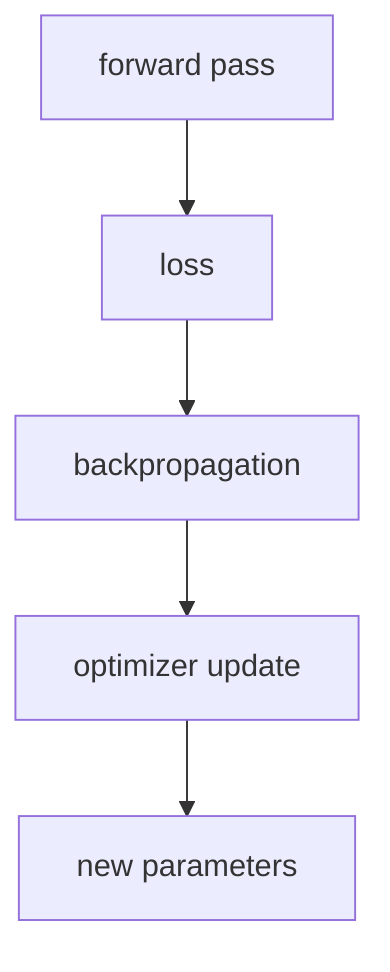

# P4-7.1 옵티마이저(optimizer)의 역할

P4-6장에서는 학습(learning)과 모델 실행(inference), 그리고 학습 모드(training mode)와 평가 모드(evaluation mode)를 구분했습니다. 여기까지 오면 이제 아주 직접적인 질문이 남습니다.

손실도 계산했고, gradient도 구했는데, 실제로 가중치는 누가 바꾸는가?

그 역할을 맡는 것이 옵티마이저(optimizer)입니다.

옵티마이저는 역전파가 계산한 gradient를 받아, 손실을 줄이는 방향으로 파라미터를 실제로 업데이트하는 규칙이다.

독자에게는 다음 세 문장을 먼저 붙잡게 하는 편이 좋습니다.

- 손실은 틀림을 숫자로 만듭니다.
- 역전파는 각 가중치의 방향 신호를 계산합니다.
- 옵티마이저는 그 신호를 실제 업데이트로 바꿉니다.

## 이 절의 범위

이 절은 다음 질문에 답합니다.

- 옵티마이저는 학습 절차에서 어떤 자리에 있는가?
- 손실 함수, 역전파, 학습률(learning rate)과 어떤 관계가 있는가?
- 왜 `좋은 gradient`만으로는 충분하지 않고 `업데이트 규칙`이 따로 필요한가?
- optimizer를 단순한 구현 함수가 아니라 학습 전략으로 읽으려면 무엇을 보아야 하는가?

이 절에서는 다음 내용을 깊게 다루지 않습니다.

- SGD, Momentum, Adam의 세부 공식 비교
- adaptive optimization의 이론적 수렴 분석
- optimizer state의 메모리 최적화

대표 옵티마이저 비교는 P4-7.2에서 이어서 다루고, regularization과의 역할 차이는 P4-8.1에서 다시 연결합니다. optimizer state의 메모리 최적화와 adaptive optimization의 이론적 수렴 분석은 이 책의 현재 본편 범위 밖에 둡니다.

## 이 절의 목표

- 옵티마이저를 `gradient를 실제 업데이트로 바꾸는 규칙`으로 설명할 수 있습니다.
- 손실 함수, 역전파, 옵티마이저의 역할을 구분할 수 있습니다.
- 학습률이 왜 중요한 설정값인지 말할 수 있습니다.
- 실행 가능한 Python 예제로 gradient와 update의 차이를 확인할 수 있습니다.

## 옵티마이저는 학습 절차의 어디에 있는가

Part 4 초반 흐름을 다시 묶어 보면 딥러닝 학습은 다음 순서로 진행됩니다.

1. 순전파(forward pass)로 예측을 계산합니다
2. 손실 함수(loss function)로 틀림을 숫자로 만듭니다
3. 역전파(backpropagation)로 gradient를 계산합니다
4. 옵티마이저(optimizer)가 파라미터를 업데이트합니다

즉, 옵티마이저는 gradient를 계산하는 장치가 아니라, `계산된 gradient를 보고 다음 파라미터를 정하는 장치`입니다.

이를 아주 단순하게 그리면 다음과 같습니다.



다음 구분을 먼저 잡아야 `틀림을 재는 단계`, `책임을 계산하는 단계`, `실제로 파라미터를 움직이는 단계`를 섞지 않게 됩니다.

- 손실 함수: 무엇이 틀렸는지 숫자로 말해 준다
- 역전파: 누가 얼마나 틀림에 기여했는지 계산해 준다
- 옵티마이저: 그래서 실제로 얼마만큼 바꿀지 결정한다

이 세 문장이 Part 4의 학습 계산 흐름을 읽는 가장 작은 지도입니다. 독자는 세 용어를 따로 외우기보다, `틀림 -> 책임 -> 실제 수정`의 순서로 묶어 기억하는 편이 훨씬 안전합니다.

## 왜 gradient만으로는 충분하지 않은가

gradient는 방향(direction)에 대한 정보입니다. 보통은 `어느 쪽으로 움직이면 손실이 줄어드는가`를 알려 줍니다. 하지만 실제 업데이트에는 방향만으로 부족합니다.

예를 들어 다음 질문이 남습니다.

- 한 번에 얼마나 크게 움직일 것인가?
- 이전 단계에서 움직이던 방향을 얼마나 참고할 것인가?
- 좌표마다 다른 속도로 움직일 것인가?

즉, gradient는 지도(map)에 가깝고, optimizer는 이동 규칙(rule of movement)에 가깝습니다.

다음처럼 이해하면 충분합니다.

`gradient가 길의 방향표지라면, optimizer는 얼마나 빠르게 어떤 방식으로 걸을지를 정하는 규칙이다.`

이 비유를 실제 문장으로 다시 쓰면 다음과 같습니다.

- gradient는 `어느 쪽이 내려가는가`를 알려 줍니다.
- optimizer는 `얼마나 움직일까`, `한 번에 얼마나 바꿀까`를 정합니다.
- 그래서 같은 gradient라도 optimizer와 learning rate가 다르면 실제 학습 모습이 달라질 수 있습니다.

## 학습률(learning rate)은 왜 중요한가

옵티마이저 설명에서 빠질 수 없는 값이 학습률(learning rate)입니다. 학습률은 한 번의 업데이트에서 얼마나 크게 움직일지를 정합니다.

너무 작으면:

- 학습이 매우 느려질 수 있고
- 손실이 줄어드는 데 오래 걸릴 수 있습니다

너무 크면:

- 좋은 방향을 알고도 지나쳐 버릴 수 있고
- 손실이 불안정하게 흔들릴 수 있습니다

즉, 학습률은 단순한 숫자가 아니라 `업데이트의 보폭(step size)`입니다.

Part 3에서 하이퍼파라미터(hyperparameter)를 다루었듯, 학습률은 학습으로 자동 생성되는 파라미터가 아니라 사람이 정하거나 탐색하는 설정값입니다.

독자에게는 다음 구분을 함께 잡는 편이 안전합니다.

| 값 | 역할 |
| --- | --- |
| gradient | 현재 위치에서 어느 방향이 내려가는지 알려 주는 신호 |
| learning rate | 그 방향으로 한 번에 얼마나 움직일지 정하는 보폭 |
| optimizer | 그 보폭과 규칙을 적용해 실제 이동을 만드는 절차 |

## 옵티마이저는 왜 하나만 있지 않은가

딥러닝 역사에서는 처음부터 모든 상황에 완벽한 optimizer 하나가 있었던 것이 아닙니다. 네트워크가 깊어지고, 데이터가 커지고, 파라미터 수가 늘어나면서 업데이트 규칙도 더 정교해질 필요가 있었습니다.

독자에게는 다음 이유만 먼저 잡아도 충분합니다.

- 어떤 문제는 단순하고 안정적인 업데이트가 중요합니다
- 어떤 문제는 학습 속도가 더 중요합니다
- 어떤 문제는 좌표별 스케일 차이나 잡음이 큽니다

즉, optimizer는 단순한 구현 취향이 아니라, `학습 문제를 어떤 방식으로 풀 것인가`에 대한 선택입니다.

독자용으로 더 줄이면 다음처럼 기억할 수 있습니다.

`옵티마이저는 가중치를 바꾸는 함수가 아니라, 학습이 얼마나 빠르고 안정적으로 움직일지를 정하는 전략이다.`

## 사례로 보기

### 사례 1. 손실은 줄고 있지만 너무 느린 경우

학습 로그에서 손실이 조금씩 내려가고 있다고 해 보겠습니다. 사람은 보통 `방향은 맞으니 더 오래 돌리면 되겠다`고 판단하기 쉽습니다. 하지만 몇 시간 동안 검증 성능이 거의 움직이지 않는다면, 실제 문제는 gradient의 방향보다 업데이트 보폭이 지나치게 작은 데 있을 수 있습니다. 이때 optimizer는 같은 방향 신호를 받아도 학습률이 너무 작거나 규칙이 너무 보수적이면 파라미터를 거의 못 움직입니다. 즉, `내려가고 있다`는 표면만으로는 충분하지 않고, `실용적인 속도로 실제 위치가 바뀌고 있는가`를 함께 봐야 합니다. 이 차이는 손실 곡선이 완만하게만 내려가고, 같은 시간 대비 검증 성능 개선이 거의 없다는 결과로 드러납니다. 그래서 이 사례에서 확인해야 할 결과는 손실이 줄고 있다는 사실만이 아니라, 같은 학습 시간 안에 검증 성능도 실제로 따라 올라오는가입니다.

### 사례 2. 손실이 계속 흔들리는 경우

반대로 손실이 내려가다가 다시 튀고, 한 배치에서는 좋아졌다가 다음 배치에서는 다시 나빠지는 경우도 있습니다. 사람은 이 장면을 보면 `모델이 전혀 못 배우는 것 아닌가`라고 느끼기 쉽습니다. 하지만 실제로는 내려가는 방향은 잡았는데 한 번에 너무 크게 움직여 좋은 지점을 계속 지나치는 경우가 많습니다. 이때는 gradient가 쓸모없어서가 아니라 학습률이 너무 크거나 optimizer 설정이 현재 문제에 비해 거칠어서 업데이트가 과격해진 것입니다. 즉, 사람이 보는 표면 현상은 `불안정한 손실`이지만, 구조적으로는 `방향을 알고도 보폭이 커서 흔들리는 상황`일 수 있습니다. 이 차이를 보면 손실 곡선이 들쭉날쭉하고 검증 성능도 안정적으로 쌓이지 않는 결과로 나타납니다. 그래서 이 사례에서 확인해야 할 결과는 학습이 아예 안 되는지보다, 업데이트 보폭이 커서 좋은 지점을 반복해서 지나치고 있는가입니다.

### 사례 3. 큰 모델 학습

모델이 커지면 사람은 `가중치가 많아졌을 뿐이니 같은 방식으로 업데이트하면 되지 않을까`라고 생각하기 쉽습니다. 하지만 실제 큰 모델에서는 어떤 층은 아주 민감하게 반응하고, 어떤 층은 거의 움직이지 않으며, gradient 스케일도 고르게 맞지 않는 경우가 많습니다. 이 상태에서 단순한 업데이트 규칙만 고수하면 일부 층은 과하게 흔들리고 다른 층은 거의 학습되지 않을 수 있습니다. 그래서 큰 모델에서는 `가중치 수`보다 `파라미터마다 움직임의 성격이 다르다`는 점이 더 중요하고, 더 정교한 optimizer가 실무적으로 자주 선택됩니다. 결과적으로 같은 학습 시간 안에서도 어떤 설정은 안정적으로 수렴하고, 어떤 설정은 일부 층만 불안정하게 흔들리는 차이로 드러납니다. 그래서 이 사례에서 확인해야 할 결과는 모델이 커질수록 모든 층이 비슷하게 배우는지가 아니라, 일부 층만 과하게 흔들리거나 멈추지 않고 전체 업데이트가 더 균형 있게 진행되는가입니다.

## 실행 가능한 Python 예제로 보기

이번 예제의 목표는 gradient 계산과 실제 update를 분리해서 보는 것입니다. 한 번의 업데이트뿐 아니라 여러 learning rate를 같이 비교해, gradient는 같아도 실제 이동 폭이 크게 달라질 수 있음을 눈으로 확인합니다.

입력:

- 현재 가중치 `w`
- 입력 `x`
- 목표값 `target`
- 학습률 `learning_rate`

출력:

- 예측값
- 손실
- gradient
- learning rate별 업데이트 후 가중치

문제 상황:

- learning rate는 gradient 자체를 바꾸지 않지만, 같은 gradient라도 가중치 이동 폭을 크게 바꾼다

확인할 개념:

- learning rate는 업데이트 크기를 조절하는 배율이다
- 같은 gradient라도 학습률 설정에 따라 이동 폭과 학습 안정성이 달라질 수 있다

입력(input):

위에 정리한 `x`, `target`, 초기 가중치 `w`와 여러 learning rate를 사용합니다.

```python
x = 2.0
target = 6.0
w = 1.0
prediction = x * w
loss = (prediction - target) ** 2
gradient_w = 2 * (prediction - target) * x

print("prediction =", round(prediction, 3))
print("loss =", round(loss, 3))
print("gradient_w =", round(gradient_w, 3))
for lr in [0.01, 0.1, 0.5]:
    updated_w = w - lr * gradient_w
    print("lr =", lr, "-> updated_w =", round(updated_w, 3))
```

출력에서는 prediction, loss, gradient_w를 먼저 보고, learning rate마다 updated_w가 얼마나 달라지는지 이어서 보면 됩니다.

```text
prediction = 2.0
loss = 16.0
gradient_w = -16.0
lr = 0.01 -> updated_w = 1.16
lr = 0.1 -> updated_w = 2.6
lr = 0.5 -> updated_w = 9.0
```

즉, 같은 gradient라도 optimizer 설정에 따라 실제 이동 폭은 크게 달라집니다.

이 예제에서 독자가 꼭 읽어야 할 것은 다음입니다.

- gradient는 그대로인데 결과는 달라질 수 있습니다.
- 달라지는 이유는 학습률과 업데이트 규칙이 다르기 때문입니다.
- 따라서 `gradient를 구했다`와 `학습이 잘 된다`는 같은 말이 아닙니다.

초기 신경망 학습에서는 가장 단순한 경사하강법(gradient descent)이나 확률적 경사하강법(stochastic gradient descent)이 기본 출발점이었습니다. 하지만 네트워크가 깊어지고 데이터가 커지면서, 학습 속도와 안정성을 개선하려는 다양한 시도가 이어졌습니다.

이 흐름 때문에 modern deep learning 커리큘럼에서는 optimizer를 단순한 구현 옵션이 아니라, `학습 동역학(training dynamics)`의 핵심 요소로 다룹니다.

독자 기준에서 이 절이 필요한 이유도 분명합니다.

- 손실 함수와 역전파만 배우면 학습이 이미 끝난 것처럼 느껴질 수 있고
- 실제 파라미터 업데이트를 누가 담당하는지 흐려질 수 있으며
- 뒤에서 SGD와 Adam을 비교할 때 무엇이 달라지는지 기준이 없어지기 때문입니다

즉, 이 절은 `gradient 계산`과 `업데이트 전략`을 분리해 읽게 만드는 기준 절입니다.

## 다음 절과의 연결

여기까지 오면 다음 질문이 남습니다.

- 가장 기본적인 optimizer인 SGD는 무엇인가?
- Adam은 왜 실무에서 자주 언급되는가?
- 둘의 차이는 학습 속도, 안정성, 설정 민감도에서 어떻게 보이는가?

이 질문은 바로 P4-7.2 SGD, Adam의 직관으로 이어집니다.

## 이 절에서 기억할 관점

- optimizer는 gradient를 실제 파라미터 업데이트로 바꾸는 규칙이며, 손실 함수, 역전파, optimizer는 각각 역할이 다릅니다.
- learning rate는 업데이트 보폭을 정하는 핵심 하이퍼파라미터이며, optimizer 선택은 단순 취향이 아니라 학습 전략의 일부입니다.

## 체크리스트

- optimizer를 손실 함수나 역전파와 구분해 설명할 수 있는가?
- gradient와 실제 update가 다른 단계라는 점을 설명할 수 있는가?
- learning rate가 왜 중요한지 말할 수 있는가?
- 다음 절에서 SGD와 Adam을 비교해야 하는 이유를 설명할 수 있는가?

## 출처와 참고 자료

- Ian Goodfellow, Yoshua Bengio, Aaron Courville, `Deep Learning`, MIT Press, 2016, 확인 날짜: 2026-06-29. [https://www.deeplearningbook.org/](https://www.deeplearningbook.org/){: target="_blank" rel="noopener noreferrer" }
- Léon Bottou, `Large-Scale Machine Learning with Stochastic Gradient Descent`, COMPSTAT, 2010, 확인 날짜: 2026-06-29.
- Sebastian Ruder, `An overview of gradient descent optimization algorithms`, arXiv, 2016, 확인 날짜: 2026-06-29.
