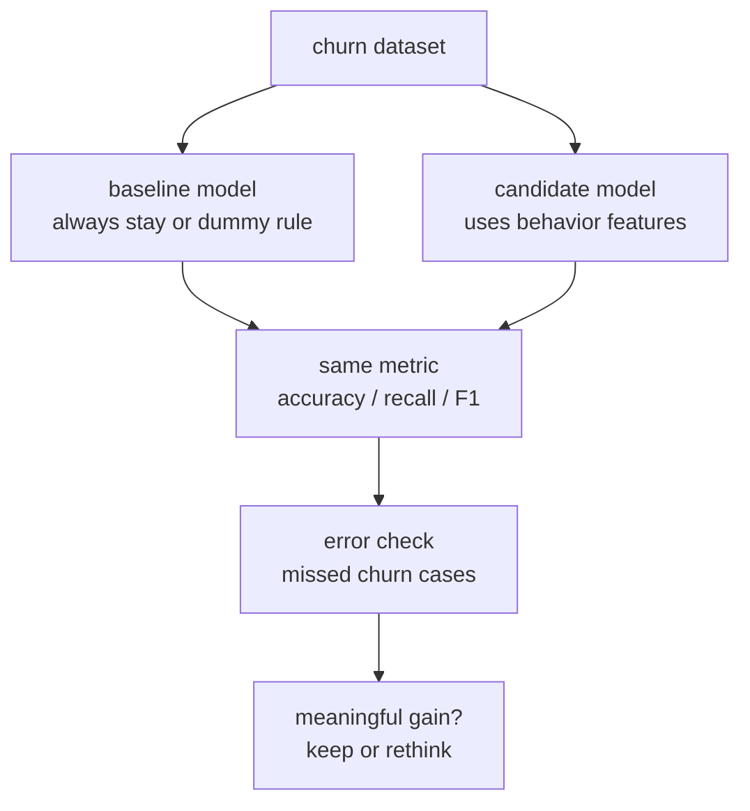
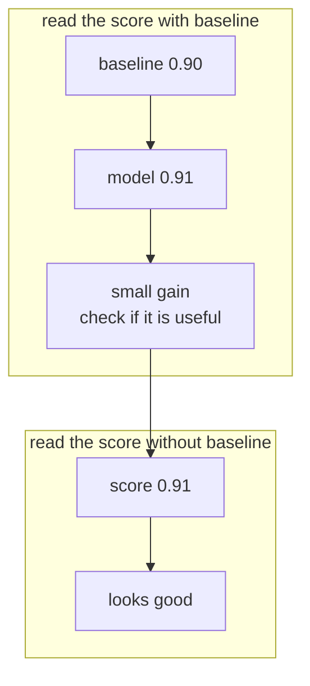
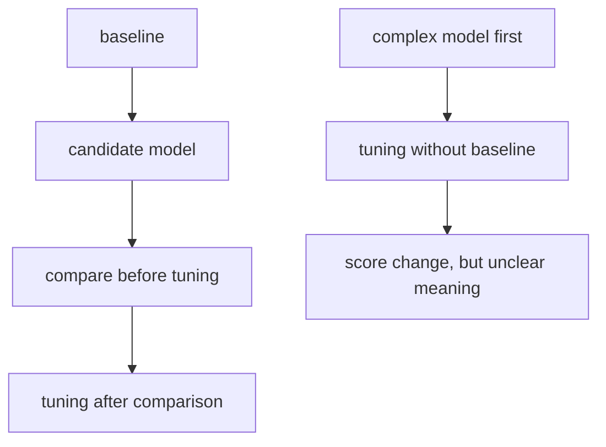
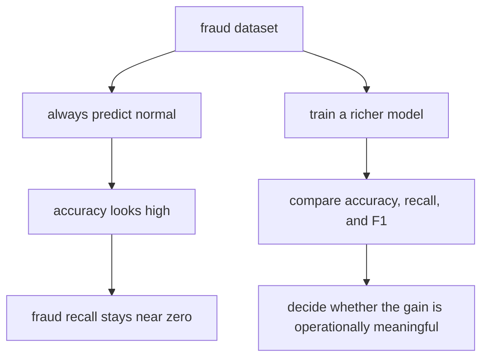

# P4-8.2 기준 모델(baseline)

> Section ID: `P4-8.2`
> Version: `v2026.07.09`

P4-8.1에서는 어떤 모델 계열을 후보로 올릴지 봤습니다. 이제 그 후보들을 바로 복잡한 순서대로 붙잡기보다, 먼저 비교의 출발점을 세우는 질문으로 넘어갑니다.

이 문제에서 가장 먼저 이겨야 할 가장 단순한 기준은 무엇인가?

이 질문이 바로 기준 모델(baseline)의 출발점입니다.

종종 기준 모델을 `성능이 낮은 임시 모델`처럼 이해합니다. 하지만 실제로는 그보다 훨씬 중요합니다. 기준 모델은 복잡한 모델이 정말로 의미 있는 개선을 만들고 있는지 확인하는 비교의 바닥선(floor)입니다.

학술 문맥과 실무 문맥 모두에서 baseline은 `좋은 모델`이 아니라 `비교를 가능하게 만드는 최소 기준`에 가깝습니다. 즉, baseline이 없으면 성능 숫자가 높아 보여도 그것이 쉬운 문제 덕분인지, 데이터 편향 덕분인지, 실제 모델링 덕분인지 구분하기 어렵습니다.

이 절은 `기준 모델(baseline)`의 뜻과 역할을 설명합니다. 뒤 절에서는 이 손잡이를 바탕으로 현재 맥락의 판단을 이어 가고, 복잡한 모델의 개선을 무엇과 비교해야 하는지에 대한 기준은 이 절과 [개념사전](../../../reference/concept-glossary.md)을 기준으로 다시 연결합니다.

여기서 고정해야 할 관점은 다음 한 문장입니다.

baseline은 단순히 이겨야 할 낮은 상대가 아니라, 점수의 의미를 읽기 위한 기준선입니다.

baseline 비교 순서는 아래처럼 짧게 고정해 둡니다.

| 먼저 볼 것 | 바로 다음에 붙는 질문 | 그다음에 판단할 것 |
| --- | --- | --- |
| baseline 점수 | 이 점수가 쉬운 착시인지, 실제 출발점인지 | 후보 모델이 같은 지표에서 얼마나 나아졌는가 |
| 혼동 행렬과 대표 오류 사례 | 어떤 실패가 줄었고 어떤 실패가 남았는가 | 이 변화가 운영상 의미 있는가 |
| 후보 모델 점수 | 정확도 외에 recall, F1, 오차 크기에서 무엇이 달라졌는가 | 튜닝으로 더 갈지, 후보를 바꿀지 정할 수 있는가 |

baseline을 실제로 세우려면 두 가지가 함께 필요합니다.

1. `무엇을 가장 단순한 비교 기준으로 둘 것인가`를 정하는 방법론
2. `왜 그런 단순 기준과 먼저 비교해야 하는가`를 설명하는 최소 이론

이 절은 이 가운데 `왜 먼저 필요한가`와 `무엇을 먼저 고정해야 하는가`를 맡고, 이어지는 `P4-8.3 보충학습`은 `어떤 대표 baseline을 어떻게 세울 것인가`를 예시와 예제로 이어서 다룹니다.

## 이 절의 범위

이 절은 다음 질문에 답합니다.

- 기준 모델(baseline)은 왜 먼저 필요한가?
- baseline이 없으면 어떤 착시가 생길 수 있는가?
- baseline과 후보 모델을 같은 조건에서 비교해야 하는 이유는 무엇인가?
- baseline을 세우는 실무 절차를 읽을 준비로서 무엇을 먼저 붙잡아야 하는가?

이 절은 다음 내용은 깊게 다루지 않습니다.

- 복잡한 벤치마크 설계
- 통계 검정 기반의 모델 비교 절차
- 대규모 리더보드 운영 방식

벤치마크와 리더보드의 운영 관점, 통계 검정 기반 모델 비교의 큰 그림은 P4-9.3 보충학습에서 다시 정리하고, 실제 하이퍼파라미터 비교 절차는 P4-9.2에서 바로 이어서 봅니다.

## 이 절의 목표

- baseline을 `복잡한 모델보다 먼저 세우는 비교 기준`으로 설명할 수 있습니다.
- baseline이 없을 때 왜 정확도 착시, 평균 예측 착시가 생기는지 말할 수 있습니다.
- DummyClassifier, DummyRegressor 같은 도구가 왜 교육적으로 유용한지 설명할 수 있습니다.
- 좋은 모델이란 단순히 높은 점수가 아니라, baseline보다 의미 있는 개선을 만든 모델이라는 관점을 가질 수 있습니다.
- 다음 절 P4-8.3에서 baseline을 실제로 세우는 방법을 왜 따로 보강하는지 설명할 수 있습니다.

## 학습 배경

P4-8.1에서 우리는 후보 모델군을 세웠습니다. 하지만 후보군을 세웠다고 바로 비교가 시작되는 것은 아닙니다. 비교에는 출발점이 필요합니다.

- 후보군이 있어도 비교 기준이 없으면 개선인지 착시인지 구분하기 어렵습니다.
- 평가 지표가 있어도, 그 점수가 쉬운 문제 덕분인지 모델 덕분인지 알기 어렵습니다.
- 전처리와 특징 선택을 했더라도, 단순 규칙보다 나은지 확인하지 않으면 실험이 공중에 뜹니다.

따라서 이 절은 커리큘럼상 다음 역할을 합니다.

| 커리큘럼 위치 | baseline 절의 역할 |
| --- | --- |
| 모델 선택 뒤 | 후보군을 실제 비교 가능한 형태로 바꿈 |
| 튜닝 전 | 튜닝이 의미 있는 개선인지 판별할 바닥선 제공 |
| 알고리즘 입문 전 | 복잡한 알고리즘이 단순 기준보다 왜 나은지 설명할 준비 |

즉, P4-8.1이 `무엇을 후보로 올릴까`를 다뤘다면, P4-8.2는 `무엇을 기준으로 이 후보를 비교할까`를 다룹니다.

이 절에서 가장 먼저 붙잡아야 할 질문은 다음 세 가지입니다.

- 아무 특징도 안 봐도 어느 정도 맞힐 수 있는 문제인가?
- 내가 만든 모델은 그 쉬운 기준보다 정말 나은가?
- 나아졌다면 어떤 지표에서 나아진 것인가?

여기서 한 가지를 더 붙여야 합니다. 분류 문제에서는 baseline보다 점수가 조금 높아졌다는 사실만으로 충분하지 않습니다. 혼동 행렬(confusion matrix)과 대표 오류 사례를 같이 놓고 `놓침이 줄었는가`, `괜한 경보가 늘었는가`, `중요한 소수 사례를 더 잘 잡는가`를 봐야만 baseline 비교가 살아납니다. 즉, baseline은 숫자 비교표이면서 동시에 오류 해석의 기준선입니다.

고객 이탈 사례로 바꾸면 baseline은 `점수 하나`보다 `지금 모델이 정말 쉬운 기준을 넘었는가`를 읽는 분기점으로 보입니다.

또 한 가지를 분리해서 기억할 필요가 있습니다. `기준 모델(baseline model)`과 `비교 기준선(baseline reference)`은 같은 문맥에서 만나지만 완전히 같은 대상은 아닙니다. 전자는 가장 단순한 예측기를 뜻하는 경우가 많고, 후자는 최근 결과를 평소 구간과 나란히 놓는 비교 프레임까지 포함할 수 있습니다. 이 절에서는 두 의미를 구분해 두어야 Part 6에서 프로젝트 회고 문서를 쓸 때도 문장이 헷갈리지 않습니다.

이 절은 이를 이렇게 나눠 읽습니다.

| 구분 | 먼저 묻는 질문 | 이 절에서의 역할 |
| --- | --- | --- |
| 기준 모델(baseline model) | `아무 특징을 깊게 안 써도 어느 정도 맞히는가?` | 후보 모델이 최소한 넘어야 할 점수 기준 |
| 비교 기준선(baseline reference) | `최근 결과를 무엇과 나란히 놓아야 변화가 보이는가?` | 숫자 변화와 오류 장면을 해석하는 비교 프레임 |

둘은 서로 다른 대상이지만, 공통점도 있습니다. 둘 다 `숫자를 해석 없이 단독으로 보지 않게 만드는 비교 기준`이라는 점입니다.

그래서 baseline 비교에서 가장 먼저 남겨야 할 확인 항목은 다음 네 가지입니다.

| 먼저 남길 것 | 왜 필요한가 |
| --- | --- |
| baseline 점수 | 출발점이 어느 정도였는지 알아야 하기 때문입니다. |
| 후보 모델 점수 | baseline보다 실제로 얼마나 나아졌는지 보기 위해서입니다. |
| 혼동 행렬의 문제 칸 또는 큰 오차 구간 | 점수 변화가 어떤 실패를 줄였는지 방향을 알아야 하기 때문입니다. |
| 대표 오류 사례(error case) | 여전히 같은 입력을 놓치는지, 다른 실패로 바뀌었는지 확인해야 하기 때문입니다. |

같은 기준을 기록 구조로 옮기면 더 분명해집니다.

| Part 4에서 남길 질문 | Part 6 회고 문서 언어 |
| --- | --- |
| baseline은 얼마였는가? | 사실(fact) |
| 무엇이 baseline보다 실제로 나아졌는가? | 해석(interpretation) |
| 다음 비교나 튜닝에서 무엇을 더 확인할 것인가? | 다음 질문(next question) |

이 흐름의 핵심은 baseline이 선택 이후, 튜닝 이전에 놓여야 한다는 점입니다. 먼저 후보 모델을 세우고, 그 후보를 baseline과 비교할 수 있어야 하며, 그다음에야 튜닝과 알고리즘별 확장 논의를 붙이는 순서가 자연스럽습니다.

## 주요 학습내용

### baseline을 세우기 전에 무엇을 먼저 고정해야 하는가

baseline을 세우는 실제 절차는 다음 절 P4-8.3에서 따로 자세히 봅니다. 다만 이 절에서도 먼저 고정해야 할 준비물은 분명히 잡아 둘 필요가 있습니다. baseline은 갑자기 떠오르는 규칙이 아니라, `무슨 문제를 푸는가`, `무엇을 한 샘플로 보는가`, `무슨 점수로 비교할 것인가`가 먼저 정해져야 세울 수 있기 때문입니다.

| baseline 전에 먼저 고정할 것 | 왜 여기서 먼저 고정해야 하는가 |
| --- | --- |
| 문제 유형 | 분류인지 회귀인지에 따라 단순 기준 자체가 달라지기 때문입니다. |
| 샘플 단위 | 한 행이 무엇을 뜻하는지 흔들리면 baseline 점수도 같이 흔들리기 때문입니다. |
| 평가 지표 | accuracy를 볼지, recall을 볼지, MAE를 볼지에 따라 baseline 해석이 달라지기 때문입니다. |
| 데이터 분포 | 클래스 불균형이나 목표값 분포를 알아야 무엇이 `쉬운 기준`인지 보이기 때문입니다. |
| 중요한 실패 장면 | baseline을 넘는 개선이 실제로 의미 있는지 판단하려면 운영상 중요한 오류를 먼저 알아야 하기 때문입니다. |

즉, baseline의 첫 단계는 `어떤 규칙을 바로 고를까`보다 `무슨 비교를 하려는가`를 고정하는 일입니다. 다음 절에서는 바로 이 준비물을 가지고 문제 유형별 대표 baseline을 실제로 세우는 법을 봅니다.

### baseline에 왜 이론적인 지식이 필요한가

baseline을 세우는 데 고급 수학이 먼저 필요한 것은 아닙니다. 하지만 최소한의 이론적 배경은 필요합니다. 그래야 baseline이 단순히 `대충 만든 약한 모델`이 아니라, 왜 먼저 필요한 비교 기준인지 설명할 수 있기 때문입니다.

직접 확인한 문서들에서 바로 잡히는 공통점은 분명합니다. scikit-learn은 `DummyClassifier`를 `더 복잡한 분류기와 비교하기 위한 simple baseline`으로, `DummyRegressor`를 `다른 회귀기와 비교하기 위한 simple baseline`으로 설명합니다. scikit-learn의 교차검증 문서는 평가 성능을 데이터 분할 위에서 확인하는 절차를 다루고, Raschka의 리뷰 문헌은 모델 평가와 선택 절차가 중요하다고 정리합니다. 여기서 이 절이 가져오는 최소 일반화는 `단순 기준과 후보 모델을 비교 가능한 조건 위에 올려야 점수 차이를 읽을 수 있다`는 정도입니다.

여기서 필요한 이론은 크게 세 가지입니다.

| 이 절에서 가져오는 해석 관점 | baseline과의 연결 |
| --- | --- |
| 대조 비교 관점 | 복잡한 모델의 개선이 정말 모델링 덕분인지 보려면 최소 비교 대상이 필요합니다. |
| 최소 기준 관점 | 입력을 거의 쓰지 않아도 나오는 기본 성능을 알아야 입력 특징의 실제 기여를 읽을 수 있습니다. |
| 비교 가능성 관점 | 같은 평가 절차와 지표 위에 올려야 점수 차이 해석이 덜 흔들립니다. |

이 세 가지를 아주 짧게 말하면 다음과 같습니다.

- baseline은 `입력을 거의 쓰지 않는 단순 비교 대상`으로 읽을 수 있습니다.
- baseline이 있어야 `입력이 실제로 도움을 줬는가`를 묻는 실험이 됩니다.
- baseline과 후보 모델을 비교 가능한 평가 조건에 올려야만 점수 차이를 해석하기 쉬워집니다.

즉, 이 절은 baseline을 특정 라이브러리 문법으로 읽기보다, `개선을 말하려면 먼저 단순 비교 대상을 고정하고 비교 가능한 조건에서 점수 차이를 읽어야 한다`는 해석 원리로 묶습니다.

### 기준 모델은 무엇을 하는가

scikit-learn의 `DummyClassifier` 문서는 입력 특징을 무시하고 예측하는 분류기를 `더 복잡한 분류기와 비교하기 위한 simple baseline`이라고 설명합니다. `DummyRegressor` 문서도 마찬가지로 평균(mean), 중앙값(median) 같은 단순 규칙으로 예측하는 회귀기를 `simple baseline`이라고 설명합니다.

이 설명을 가장 짧게 정리하면 다음과 같습니다.

`기준 모델은 입력을 깊게 이해하지 않더라도 만들 수 있는 가장 단순한 비교 기준이다.`

즉, baseline은 현실 문제를 잘 풀기 위한 완성형 모델이 아니라, `이 정도보다 낫지 않으면 복잡한 모델을 쓴 의미가 없다`는 최소 기준입니다.

조금 더 이론적으로 읽으면 baseline은 최소 비교 대상으로 기능합니다. 복잡한 구조를 넣고 튜닝을 많이 했더라도 baseline보다 의미 있게 낫지 않다면, 그 실험은 개선이 아니라 복잡도만 늘린 것일 수 있습니다.

### baseline이 없으면 어떤 착시가 생기는가

baseline이 없으면 높은 수치가 곧 좋은 모델처럼 보일 수 있습니다. 하지만 실제로는 그렇지 않을 수 있습니다.

예를 들어 이탈 고객이 10%뿐인 데이터에서 모두 `안 떠난다`라고 예측해도 정확도(accuracy)는 90%가 나올 수 있습니다. 이 경우 정확도만 보면 좋아 보이지만, 실제로는 중요한 소수 클래스를 전혀 잡지 못한 모델입니다.

즉, baseline이 없으면 다음 같은 착시가 생길 수 있습니다.

| 보이는 숫자 | 실제 문제 |
| --- | --- |
| 정확도가 높다 | 다수 클래스만 찍어도 높을 수 있음 |
| 회귀 오차가 작다 | 평균만 예측해도 비슷할 수 있음 |
| 새 모델이 복잡하다 | 복잡함이 개선을 뜻하지는 않음 |

그래서 baseline은 점수를 낮추기 위한 장치가 아니라, 점수를 `읽을 수 있게` 만드는 장치입니다.

이 책에서는 `기준 모델(baseline model)`과 `비교 기준선(baseline reference)`을 구분해서 읽습니다. 전자는 가장 단순한 예측 기준을 뜻하고, 후자는 최근 결과를 평소 기준과 나란히 놓아 해석하는 비교 프레임을 뜻합니다. 이런 비교 프레임을 따로 세우면 뒤에서 보는 규칙 기반 경고나 학습 모델의 점수도, 실제로 얼마나 의미 있는 변화인지 더 분명하게 읽을 수 있습니다.

다만 최근 구간과 기준선의 차이는 설명 후보를 좁혀 주는 비교 신호이지, 그 차이의 원인을 자동으로 확정하는 장치는 아닙니다.

즉, 이 책에서는 baseline이라는 말을 두 층위에서 함께 읽습니다.

| baseline이 놓이는 층위 | 예 | 이 절에서 읽는 방식 |
| --- | --- | --- |
| 기준 모델(baseline model) | 다수 클래스만 예측, 평균값만 예측 | 후보 모델이 최소 기준보다 나은지 확인 |
| 비교 기준선(baseline reference) | 최근 구간과 평소 구간 비교, 이전 버전 규칙과 현재 결과 비교 | 숫자 변화가 실제로 어떤 차이인지 해석 |

| 항목 | 최근 구간 | 평소 기준선 | 차이 | 읽기 |
| --- | ---: | ---: | ---: | --- |
| 중간 구간 평균 | 2.10 | 2.34 | -0.24 | 최근 값이 평소보다 낮다 |
| 후반 하강률 | -0.42 | -0.28 | -0.14 | 후반 하강이 더 가파르다 |
| 동작 수 | 18 | 20 | -2 | 비교는 가능하지만 표본 수는 함께 본다 |

이 표를 읽을 때도 중요한 것은 절대값 하나보다 비교 프레임입니다. 그리고 이런 비교가 가능하려면, 먼저 여러 시점의 원시 시계열을 동작 1회 요약 행으로 바꾸어 같은 단위끼리 나란히 놓을 수 있어야 합니다.

즉, 이 절에서의 baseline reference는 baseline model과 경쟁하는 별도 기술이라기보다, `비교 기준을 먼저 세운다`는 읽기 원칙을 운영 데이터 해석 장면까지 확장한 표현으로 보면 됩니다.

이 차이를 가장 단순하게 그리면 다음과 같습니다.

이 도식의 핵심은 같은 숫자도 baseline이 있을 때와 없을 때 전혀 다르게 읽힌다는 점입니다.

다음 표가 특히 중요합니다.

| 보이는 장면 | 독자가 하기 쉬운 오해 | baseline이 해 주는 일 |
| --- | --- | --- |
| 정확도 0.90 | `꽤 잘 맞춘다` | 다수 클래스만 찍은 값인지 확인 |
| 회귀 오차가 작다 | `입력을 잘 배웠다` | 평균 예측만으로도 비슷한지 확인 |
| 복잡한 모델이 점수를 조금 올렸다 | `역시 복잡한 모델이 낫다` | 개선 폭이 실제로 의미 있는지 확인 |

즉, baseline 비교는 점수표 하나를 더 붙이는 일이 아니라, `이 개선이 정말 구조를 더 잘 읽은 결과인가`를 묻는 해석 장치입니다.

그래서 baseline을 볼 때는 숫자만 적지 말고, 바로 다음 둘도 함께 남겨야 합니다.

- baseline이 놓치고 있는 대표 오류 장면은 무엇인가
- 후보 모델이 줄인 실패가 운영상 정말 중요한 실패인가

이 질문들이 바로 baseline 방법론의 마지막 단계입니다. baseline의 역할은 숫자를 한 줄 적는 데서 끝나는 것이 아니라, `그 숫자가 어떤 실패를 그대로 남기고 있는가`까지 보여 주는 데 있습니다.

### 대표적인 baseline 방법은 어디서 이어서 보는가

이 절에서 baseline의 필요성과 해석 원리를 먼저 잡았다면, 그다음 자연스러운 질문은 `그래서 어떤 baseline을 어떻게 세우는가`입니다. 그 질문은 `P4-8.3 보충학습: 문제 유형에 따라 baseline을 처음 세우는 법`에서 이어서 다룹니다.

다음 절에서는 특히 아래 내용을 실제 예시와 예제로 묶어 봅니다.

| 다음 절에서 이어서 볼 것 | 왜 바로 이어서 봐야 하는가 |
| --- | --- |
| 분류 baseline | 높은 정확도 착시를 어떤 단순 기준으로 먼저 드러낼지 알아야 하기 때문입니다. |
| 회귀 baseline | 평균/중앙값 기준이 입력 특징의 실제 기여를 판단하는 출발점이 되기 때문입니다. |
| 시계열 baseline | naive, seasonal naive 같은 기준이 시간 축 문제에서 왜 자주 쓰이는지 알아야 하기 때문입니다. |
| baseline 설정 절차 | 문제 유형 고정부터 오류 해석까지 어떤 순서로 비교를 시작할지 알아야 하기 때문입니다. |

### baseline은 왜 튜닝보다 먼저 와야 하는가

종종 이렇게 진행합니다.

1. 복잡한 모델을 고른다.
2. 파라미터를 많이 바꿔 본다.
3. 점수가 조금 오르면 성공으로 본다.

하지만 baseline이 없으면 이 개선이 정말 의미 있는지 알 수 없습니다.

이 도식은 먼저 baseline을 세우고 후보 모델을 비교한 뒤에 튜닝으로 들어가야 한다는 순서와, baseline 없이 바로 복잡한 모델을 튜닝하면 점수 변화의 의미를 해석하기 어려워진다는 점을 함께 보여 줍니다.

실무에서는 이 순서 차이가 곧 비용 차이로 이어집니다. baseline도 넘지 못하는 후보를 오래 튜닝하면, 실험 시간과 계산 비용만 쓰고도 설명할 수 있는 개선이 남지 않을 수 있습니다.

## 세부 학습내용

### DummyClassifier와 DummyRegressor를 어떻게 이해하면 좋은가

scikit-learn의 dummy 계열 모델은 교육적으로 특히 유용합니다.

| 도구 | 입문적 이해 |
| --- | --- |
| `DummyClassifier` | 특징을 무시하고 단순 규칙으로 분류하는 기준선 |
| `DummyRegressor` | 평균, 중앙값 같은 단순 규칙으로 예측하는 기준선 |

이 도구들의 가치는 실제 서비스에 쓰기 위한 것이 아니라, `진짜 모델이 최소한 어디까지는 이겨야 하는가`를 빠르게 보여 준다는 데 있습니다.

즉, baseline은 모델 선택의 일부이면서 동시에 평가 읽기의 일부입니다.

## 사례로 보기

### 사례 1. 정확도는 높아 보이는데 실제로는 아무것도 잡지 못하는 사기 탐지

결제 서비스 팀이 사기 거래를 잡는 분류 모델을 만들고 있습니다. 사람이 먼저 보던 기준은 `짧은 시간 내 반복 결제`, `평소와 다른 지역`, `이상한 시간대 결제` 같은 신호였습니다.

모델을 만들기 전, 팀은 우선 모든 거래를 `정상`이라고만 예측하는 아주 단순한 기준을 세워 봅니다. 사기 거래가 극히 적다면 이 baseline도 정확도는 높게 나올 수 있습니다. 그래서 baseline 없이 복잡한 모델의 정확도만 보면 성능이 좋아졌다고 착각하기 쉽습니다.

이 장면에서 baseline은 `복잡한 모델이 정말 의미 있게 나아졌는지`를 확인하는 바닥선이 됩니다. 실제 모델이 정확도를 조금 올렸더라도 사기 거래 재현율이 여전히 낮다면 운영 관점에서는 큰 개선이 아닐 수 있습니다. 반대로 recall과 F1이 baseline보다 분명히 좋아졌다면, 그때 비로소 복잡한 모델이 소수 클래스 문제를 더 잘 다룬다고 말할 수 있습니다.

확인 가능한 결과는 같은 지표로 baseline과 실제 모델을 나란히 비교할 때 드러납니다. 정확도만이 아니라 recall, F1까지 함께 놓고 보면 왜 baseline이 `낮은 성능 모델`이 아니라 `점수 해석 기준선`인지 분명해집니다.

## 이 절에서 기억할 관점

| 먼저 보인 신호 | 이 신호가 뜻하는 것 | 바로 이어질 다음 조치 |
| --- | --- | --- |
| baseline보다 조금 높은 점수, 그러나 비슷한 오류 구조 | 복잡도는 늘었지만 의미 있는 개선은 아직 약할 수 있다는 뜻 | 대표 오류 사례와 핵심 지표 차이를 다시 보고 튜닝할지 후보를 바꿀지 정한다 |

- baseline은 복잡한 모델 전에 세우는 비교 기준이다.
- 높은 점수도 baseline과 비교하지 않으면 해석하기 어렵다.
- 대표적인 baseline 종류와 실제 설정 절차는 다음 절 P4-8.3에서 문제 유형별로 다시 본다.
- 튜닝은 baseline보다 나은 후보가 있는지 확인한 뒤에 들어가야 한다.

이 절의 핵심은 baseline이 `점수 하나를 더 보는 절`이 아니라는 점입니다.

| baseline이 맡는 일 | 같이 남겨야 할 것 | 다음 절에서 이어질 것 |
| --- | --- | --- |
| 출발점 점수를 세운다 | 혼동 행렬의 문제 칸, 대표 오류 사례, 핵심 지표 차이 | 그 출발점 위에서 어떤 설정 변경이 실제 개선인지 튜닝으로 비교한다 |

## 짧은 점검

- baseline보다 높다는 사실만이 아니라 어떤 실패가 줄었는지도 함께 보고 있는가?
- 분류와 회귀, 시계열에서 baseline을 같은 방식으로 잡지 않고 문제 형태에 맞게 나누어 보고 있는가?
- 작은 점수 차이가 보일 때 혼동 행렬이나 대표 오류 사례로 실제 개선을 확인하고 있는가?

## 언제 이 관점을 먼저 떠올려야 하는가

- 복잡한 모델이 baseline보다 실제로 무엇을 줄였는지 점수와 오류 사례를 함께 읽어야 할 때 이 절을 떠올립니다.
- 분류와 회귀에서 baseline을 다른 방식으로 잡아야 한다는 점을 다시 설명할 때 이 절로 돌아옵니다.
- 작은 점수 차이가 의미 있는 개선인지 다시 검증해야 할 때 이 절이 기준이 됩니다.

- 지금 문제에 가장 단순한 baseline은 무엇인가?
- baseline 점수와 실제 모델 점수를 같은 지표로 비교하고 있는가?
- baseline보다 나은지, 아니면 단지 복잡하기만 한지 구분하고 있는가?
- 클래스 불균형이나 평균 예측 같은 쉬운 함정을 baseline으로 확인했는가?
- 튜닝 전에 먼저 baseline과 후보 모델의 차이를 읽었는가?

## 다음 절과의 연결

다음 절 `P4-8.3 보충학습: 문제 유형에 따라 baseline을 처음 세우는 법`에서는 분류, 회귀, 시계열에서 대표적인 baseline을 어떤 기준으로 고르고, 어떤 예시와 예제로 비교를 시작할지를 봅니다. 그다음 P4-9에서는 baseline보다 나은 후보가 생겼을 때, 그 후보를 어떻게 조정하고 비교할지를 다룹니다.

## 출처와 참고 자료

- scikit-learn developers, [`DummyClassifier`](https://scikit-learn.org/stable/modules/generated/sklearn.dummy.DummyClassifier.html){: target="_blank" rel="noopener noreferrer" }, scikit-learn API Reference, 확인 날짜: 2026-07-09.
- scikit-learn developers, [`DummyRegressor`](https://scikit-learn.org/stable/modules/generated/sklearn.dummy.DummyRegressor.html){: target="_blank" rel="noopener noreferrer" }, scikit-learn API Reference, 확인 날짜: 2026-07-09.
- scikit-learn developers, [`Cross-validation: evaluating estimator performance`](https://scikit-learn.org/stable/modules/cross_validation.html){: target="_blank" rel="noopener noreferrer" }, scikit-learn User Guide, 확인 날짜: 2026-07-09.
- Trevor Hastie, Robert Tibshirani, Jerome Friedman, [*The Elements of Statistical Learning*](https://hastie.su.domains/ElemStatLearn/){: target="_blank" rel="noopener noreferrer" }, 확인 날짜: 2026-07-09.
- Sebastian Raschka, [`Model Evaluation, Model Selection, and Algorithm Selection in Machine Learning`](https://arxiv.org/abs/1811.12808){: target="_blank" rel="noopener noreferrer" }, arXiv, 2018, 확인 날짜: 2026-07-09.
