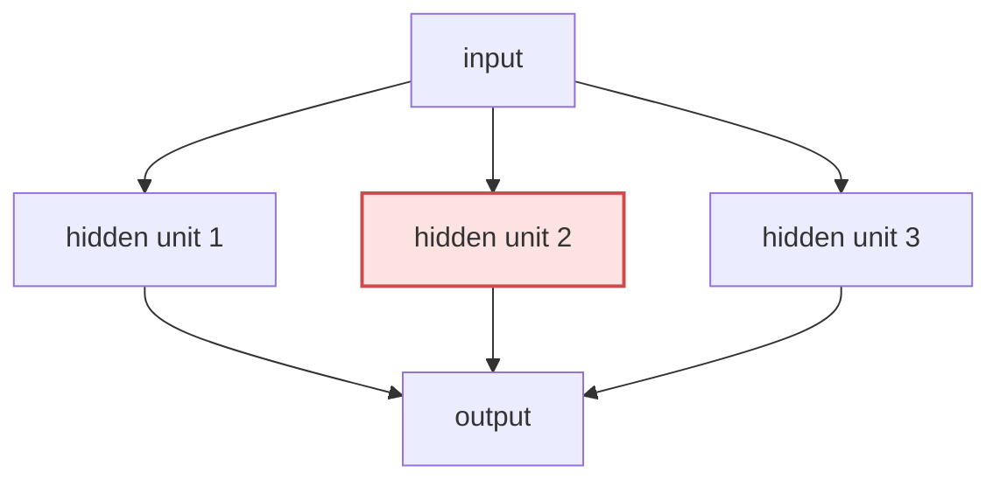

# P4-8.2 드롭아웃(dropout)

P4-8.1에서는 정규화(regularization)를 `과적합을 줄이기 위한 제약과 설계 철학`으로 설명했습니다. 여기서 다음 질문이 자연스럽게 이어집니다.

가중치에 벌점을 주는 것 말고, 신경망 구조 자체를 흔들어 과적합을 줄이는 방법도 있는가?

이 질문에 답하는 대표적 방법이 드롭아웃(dropout)입니다.

드롭아웃은 학습 중 일부 노드 출력이나 연결을 무작위로 끄면서, 모델이 특정 경로에 과하게 의존하지 않도록 만드는 정규화 기법이다.

## 이 절의 범위

이 절은 다음 질문에 답합니다.

- 드롭아웃은 왜 과적합 억제와 연결되는가?
- 학습 중 일부 연결을 끊는다는 말은 무엇을 뜻하는가?
- 왜 학습 모드와 평가 모드에서 동작이 달라지는가?
- 드롭아웃은 어떤 상황에서 직관적으로 도움이 되나?

이 절에서는 다음 내용을 깊게 다루지 않습니다.

- inverted dropout의 정확한 scaling 공식
- dropout 비율(rate) 튜닝 전략의 세밀한 경험칙
- variational dropout, Monte Carlo dropout 같은 확장 기법

inverted dropout 공식과 dropout 비율 조정 경험칙은 여기서 공식을 전개하지 않고 넘깁니다. 대신 학습 모드와 평가 모드의 차이는 P4-6.2에서 다시 연결하고, regularization의 큰 관점은 P4-8.1에서 이미 묶은 흐름 위에서 읽습니다. variational dropout, Monte Carlo dropout 같은 확장 기법은 이 책의 현재 본편 범위 밖에 둡니다.

여기서는 공식을 암기하기보다 `왜 무작위 제거가 일반화를 돕는가`를 먼저 설명합니다.

## 이 절의 목표

- 드롭아웃을 `특정 경로 의존을 줄이는 정규화 기법`으로 설명할 수 있습니다.
- 드롭아웃이 학습 중과 평가 중에 다르게 동작하는 이유를 말할 수 있습니다.
- 드롭아웃이 앙상블(ensemble) 비슷한 직관을 준다는 점을 입문 수준에서 이해할 수 있습니다.
- 작은 Python 예제로 드롭아웃 전후 값을 직접 확인할 수 있습니다.

## 드롭아웃은 왜 필요한가

딥러닝 모델은 어떤 특징 조합이나 특정 은닉 경로에 과하게 의존할 수 있습니다. 이런 상태에서는 훈련 데이터에서는 높은 성능이 나와도, 새로운 데이터에서는 쉽게 흔들릴 수 있습니다.

드롭아웃은 이 문제를 다음 방식으로 건드립니다.

- 학습 중 일부 노드 출력을 무작위로 끕니다
- 따라서 모델은 항상 같은 내부 경로만 믿고 학습할 수 없습니다
- 결과적으로 여러 경로와 표현을 더 고르게 사용하도록 압박받습니다

다음처럼 기억하면 충분합니다.

`드롭아웃은 학습할 때 네트워크 일부를 잠깐씩 비워 두어, 모델이 특정 연결 하나에만 기대지 않게 한다.`

## 일부 연결을 끊는다는 말은 무엇인가

드롭아웃을 처음 들으면 `정말로 네트워크 구조를 삭제하는가?`라는 질문이 생길 수 있습니다. 보통은 그렇지 않습니다.

학습 중에는:

- 일부 활성값을 0으로 만들거나
- 일부 노드 출력을 잠시 사용하지 않는 방식으로
- 현재 step에서만 경로를 쉬게 합니다

즉, 드롭아웃은 구조를 영구 삭제하는 것이 아니라 `학습 중 임시로 일부 경로를 빠지게 만드는 확률적 규칙`입니다.

이를 아주 단순하게 그리면 다음과 같습니다.



이 도식에서 `hidden unit 2`는 현재 학습 step에서 쉬고 있는 경로처럼 읽으면 됩니다.

## 왜 이런 무작위 제거가 도움이 되나

독자에게는 이 발상이 다소 역설적으로 들릴 수 있습니다.

`모델을 더 좋게 만들려면 더 많이 써야 할 것 같은데, 왜 일부를 일부러 끄는가?`

바로 여기서 확인해야 할 점은, 드롭아웃이 `항상 같은 경로만 믿는 학습`을 깨서 여러 경로에 걸친 더 견고한 표현을 만들게 한다는 것입니다.

예를 들어:

- 어떤 은닉 노드 하나가 훈련 데이터에서 매우 강한 지름길 역할을 하고 있다면
- 드롭아웃은 그 노드가 매 step마다 항상 존재한다고 가정하지 못하게 합니다

따라서 모델은 `하나의 쉬운 편법`보다, 더 여러 경로에서 견디는 표현을 배우도록 압박받습니다.

## 앙상블(ensemble)과 비슷한 직관

입문 설명에서 드롭아웃은 종종 `여러 부분 네트워크를 번갈아 학습하는 느낌`으로도 설명됩니다. 엄밀히 완전히 같은 것은 아니지만, 독자에게는 도움이 되는 직관입니다.

즉:

- 어떤 step에서는 어떤 노드가 켜지고
- 다음 step에서는 다른 조합이 켜지며
- 결과적으로 하나의 거대한 네트워크 안에서 여러 부분 구조가 번갈아 학습되는 느낌을 줄 수 있습니다

다음 정도로 정리하면 충분합니다.

`드롭아웃은 하나의 네트워크를 여러 부분 네트워크처럼 흔들어 가며 학습시키는 느낌을 준다.`

## 왜 평가 모드에서는 드롭아웃을 끄나

P4-6.2에서 이미 본 것처럼, 드롭아웃은 학습 모드(training mode)와 평가 모드(evaluation mode)에서 다르게 동작합니다. 이유는 간단합니다.

평가나 배포에서는:

- 현재 모델이 얼마나 잘하는지 안정적으로 재야 하고
- 같은 입력에 대해 불필요한 무작위 흔들림을 줄여야 하며
- 사용자가 받을 결과도 지나치게 들쭉날쭉하면 안 됩니다

즉, 드롭아웃은 `학습을 돕는 잡음`이지, 평가를 흔드는 잡음이 되어서는 안 됩니다.

## 어떤 상황에서 직관적으로 도움이 되나

## 사례로 보기

### 사례 1. 은닉층이 큰 분류 모델

상품 리뷰 분류 모델의 은닉층이 크고 파라미터 수가 많다고 해 보겠습니다. 사람은 보통 `표현을 많이 볼수록 더 잘 맞겠지`라고 기대하기 쉽습니다. 하지만 실제로는 훈련 데이터에서만 우연히 함께 나온 단어 조합까지 그대로 외워 검증 데이터에서 흔들릴 수 있습니다. 이때 드롭아웃을 넣으면 특정 은닉 노드나 경로 하나가 항상 결정적 역할을 하지 못하게 만들어, 모델이 여러 경로를 함께 쓰도록 압박합니다. 구조적으로 바뀌는 점은 `가장 쉬운 지름길 하나에 의존하는 학습`에서 `여러 부분 조합을 견디는 학습`으로 이동하는 것입니다. 그 결과 훈련 점수만 과하게 높고 검증 점수가 떨어지는 간극을 줄이는 데 도움이 될 수 있습니다.
그래서 이 사례에서 확인해야 할 결과는 훈련 점수 상승만 보는 것이 아니라, 검증 점수와의 간극이 실제로 줄어드는가입니다.

### 사례 2. 데이터가 상대적으로 적은 경우

의료 문서나 내부 품질 보고서처럼 데이터 수가 많지 않은 문제를 생각해 볼 수 있습니다. 사람은 표본이 적더라도 모델만 충분히 크면 복잡한 패턴을 더 잘 잡을 것이라고 기대하기 쉽습니다. 하지만 데이터가 적을수록 모델은 실제 규칙보다 훈련 예시에 우연히 붙어 있던 문장 패턴을 먼저 외워 버리기 쉽습니다. 이때 드롭아웃은 일부 경로를 임시로 끄면서 특정 패턴 암기에만 기대지 못하게 만들어, 새 문서에서도 버티는 표현을 조금 더 강하게 요구합니다. 즉, 사람이 보던 기준이 `훈련 데이터에서 얼마나 잘 맞는가`였다면, 드롭아웃은 `새 데이터에서도 유지되는가` 쪽으로 관심을 이동시키는 장치입니다.
그래서 이 사례에서 확인해야 할 결과는 훈련 예시 적합도보다, 처음 보는 문서에서도 분류 기준이 덜 무너지는가입니다.

### 사례 3. 완전연결층(fully connected layer) 중심 구조

초기 이미지 분류기나 탭형 데이터 분류기에서는 마지막 완전연결층이 매우 크게 잡히는 경우가 많았습니다. 사람은 마지막 층이 크면 더 많은 조합을 배울 수 있으니 무조건 유리하다고 보기 쉽습니다. 하지만 이런 구조에서는 일부 노드가 특정 특징 조합을 거의 통째로 외워 버려, 훈련 점수는 높은데 검증 점수는 떨어지는 일이 자주 생깁니다. 드롭아웃은 이 큰 완전연결층에서 일부 노드를 임시로 쉬게 해 특정 노드 하나에 대한 과한 집중을 줄이는 대표 기법이었습니다. 그래서 이 사례에서 확인해야 할 결과는 훈련 정확도만 빠르게 치솟는 대신 검증 정확도가 뒤처지던 패턴을 완화하는 방향으로 실제 변화가 나타나는가입니다.

## 작은 Python 예제로 보기

이번 예제의 목표는 학습 중 드롭아웃이 일부 활성값을 0으로 만들 수 있다는 점을 직접 확인하는 것입니다.

입력:

- 활성값 목록
- dropout 비율

출력:

- 드롭아웃 전 활성값
- 드롭아웃 후 활성값

```python
import random

activations = [0.9, 1.3, 0.4, 1.1, 0.7]
drop_rate = 0.4

def apply_dropout(values, drop_rate):
    result = []
    for v in values:
        if random.random() < drop_rate:
            result.append(0.0)
        else:
            result.append(v)
    return result

random.seed(11)
after_dropout = apply_dropout(activations, drop_rate)

print("before_dropout =", activations)
print("after_dropout =", after_dropout)
```

실행 결과 예시는 다음처럼 읽을 수 있습니다.

```text
before_dropout = [0.9, 1.3, 0.4, 1.1, 0.7]
after_dropout = [0.9, 1.3, 0.4, 0.0, 0.7]
```

이 예제에서 읽어야 할 핵심은 다음입니다.

- 어떤 활성값은 그대로 남고
- 어떤 활성값은 현재 학습 step에서는 0이 되며
- 그 결과 네트워크가 모든 경로를 항상 믿고 학습할 수 없게 됩니다

이 예제는 scaling을 포함한 실제 프레임워크의 모든 세부를 구현한 것은 아닙니다. 여기서는 `무작위로 일부 경로를 쉬게 한다`는 핵심 직관만 확인하면 충분합니다.

## 역사와 커리큘럼 관점

드롭아웃은 2010년대 초반 딥러닝이 다시 확산되던 시기에 과적합 억제의 대표적 실용 기법으로 널리 주목받았습니다. 특히 큰 fully connected network에서 일반화를 돕는 간단하면서 강력한 도구로 받아들여졌습니다.

커리큘럼 관점에서 드롭아웃이 중요한 이유는 다음과 같습니다.

- 바로 앞의 P4-8.1 정규화를 `벌점 공식`으로만 이해하는 것을 막아 주고
- 학습 중 잡음을 일부러 넣어 일반화를 돕는 사고를 소개하며
- 앞서 P4-6.2에서 본 학습 모드와 평가 모드의 차이가 왜 실질적으로 필요한지 다시 확인시켜 주기 때문입니다

즉, 드롭아웃은 Part 4 초반부의 여러 개념을 한 번에 연결합니다.

- regularization
- training/eval mode
- generalization
- model capacity

## 다음 절과의 연결

여기까지 오면 다음 질문이 남습니다.

- 지금까지 본 손실, 역전파, optimizer, regularization은 실제 학습 과정 안에서 어떤 순서로 함께 움직이는가?
- training mode와 evaluation mode는 이 학습 루프 안에서 왜 같이 읽어야 하는가?

이 질문은 바로 P4-8.3 학습 루프를 한 번에 다시 묶기로 이어집니다.

## 이 절에서 기억할 관점

- 드롭아웃은 학습 중 일부 경로를 무작위로 쉬게 하는 정규화 기법입니다.
- 목적은 특정 경로에 대한 과한 의존을 줄이고 일반화를 돕는 것입니다.
- 평가 모드에서는 같은 무작위 제거를 유지하지 않는 것이 보통입니다.
- 드롭아웃은 정규화, 모드 전환, 일반화 개념을 함께 연결하는 대표 사례입니다.

## 체크리스트

- 드롭아웃을 `일부 연결을 임시로 쉬게 하는 regularization`으로 설명할 수 있는가?
- 왜 평가 모드에서는 드롭아웃을 끄는지 말할 수 있는가?
- 드롭아웃이 특정 경로 의존을 줄인다는 직관을 설명할 수 있는가?
- 다음 절의 GPU와 병렬 처리로 왜 자연스럽게 넘어가는지 연결할 수 있는가?

## 출처와 참고 자료

- Nitish Srivastava et al., `Dropout: A Simple Way to Prevent Neural Networks from Overfitting`, JMLR, 2014, 확인 날짜: 2026-06-29.
- Ian Goodfellow, Yoshua Bengio, Aaron Courville, `Deep Learning`, MIT Press, 2016, 확인 날짜: 2026-06-29. [https://www.deeplearningbook.org/](https://www.deeplearningbook.org/){: target="_blank" rel="noopener noreferrer" }
- Aurélien Géron, `Hands-On Machine Learning with Scikit-Learn, Keras, and TensorFlow`, 3rd ed., O'Reilly, 2022, 확인 날짜: 2026-06-29.
