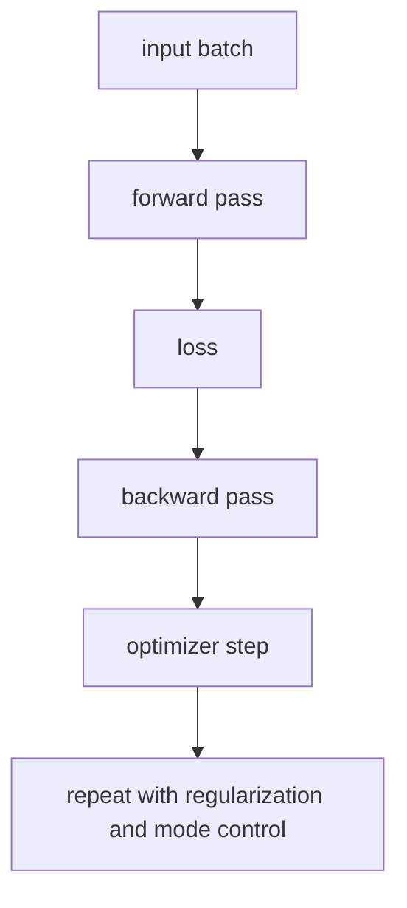

# P4-8.3 학습 루프를 한 번에 다시 묶기

P4-6장에서는 학습과 모델 실행을 구분했고, P4-7장에서는 옵티마이저를, P4-8장에서는 정규화와 드롭아웃을 보았습니다. 여기까지 오면 다음 질문이 자연스럽게 남습니다.

이 요소들은 실제 학습 과정 안에서 어떤 순서와 역할로 함께 움직이는가?

이 절은 그 질문에 답합니다.

딥러닝 학습 루프는 `forward -> loss -> backward -> optimizer step -> regularization/모드 제어`가 반복되는 구조로 읽는 편이 안전하다.

## 이 절의 범위

이 절은 다음 질문에 답합니다.

- 지금까지 본 손실, 역전파, 옵티마이저, 정규화는 하나의 학습 루프에서 어떻게 이어지는가?
- training mode와 evaluation mode는 왜 이 루프 안에서 같이 읽어야 하는가?
- 이 구분이 뒤의 CNN, RNN, Transformer 설명에 왜 중요한가?

이 절에서는 다음 내용을 깊게 다루지 않습니다.

- 분산 학습 루프 전체 구현
- mixed precision, gradient accumulation 세부 기법
- 프레임워크 내부 autograd 엔진 구현

분산 학습 루프, mixed precision, gradient accumulation은 이 책의 현재 본편 범위 밖으로 두고, 여기서는 단일 학습 루프의 공통 골격만 먼저 잡습니다. autograd 엔진의 내부 구현도 범위 밖으로 두되, gradient가 optimizer update로 이어지는 관점 자체는 앞선 P4-5.1, P4-5.2와 P4-7.1, P4-7.2에서 이미 회수한 흐름 위에서 다시 묶습니다.

이 절에서는 새 알고리즘을 더 추가하기보다, 이미 본 개념들을 `한 장면의 학습 흐름`으로 다시 묶습니다.

## 이 절의 목표

- 딥러닝 학습 루프를 한 번에 설명할 수 있습니다.
- forward, loss, backward, optimizer step의 순서를 말할 수 있습니다.
- regularization과 mode 전환이 왜 학습 루프와 함께 읽혀야 하는지 설명할 수 있습니다.
- 뒤 장의 구조 설명을 `학습 가능한 구조` 관점에서 읽을 수 있습니다.

## 가장 작은 학습 루프

딥러닝 모델을 학습시킬 때는 보통 다음 순서가 반복됩니다.

1. 입력을 넣고 출력값을 계산한다.
2. 출력과 정답 차이를 손실로 계산한다.
3. 손실이 각 가중치에 미친 영향을 뒤로 전달한다.
4. 옵티마이저가 그 영향을 바탕으로 가중치를 갱신한다.
5. 이 과정을 여러 배치(batch)에 대해 반복한다.

이 다섯 단계가 Part 4 초반부에서 따로 보았던 내용을 실제로 연결하는 가장 작은 골격입니다.

## 왜 모드 전환이 여기에 붙는가

training mode와 evaluation mode는 루프 바깥의 부가 설정이 아닙니다.

- training mode에서는 dropout이 켜질 수 있고
- batch normalization은 현재 배치 통계를 사용할 수 있으며
- optimizer step이 실제 업데이트를 일으킵니다

반대로 evaluation mode에서는:

- dropout은 꺼지고
- 평가용 동작이 고정되며
- 가중치 업데이트는 일어나지 않습니다

즉, `학습 루프가 언제 실제로 모델을 바꾸는가`를 읽으려면 모드 전환을 함께 봐야 합니다.

## 정규화는 어디에 들어가나

정규화(regularization)는 학습 루프 밖의 별도 철학이 아니라, 루프 안에서 `과하게 외우는 방향`을 제어하는 장치입니다.

예를 들어:

- 가중치 크기에 패널티를 주거나
- 일부 뉴런을 임시로 끄거나
- 데이터나 배치 통계를 다르게 읽게 하는 방식은

모두 `업데이트가 너무 특정 데이터에만 맞춰지는 것`을 줄이기 위한 장치입니다.

따라서 정규화는 손실과 optimizer 사이의 별도 주석이 아니라, 학습 루프 전체의 성격을 바꾸는 요소로 읽어야 합니다.

## 아주 단순하게 그리면



이 도식의 핵심은 지금까지 따로 본 개념들이 실제로는 한 반복 안에 묶여 있다는 점입니다.

## 사례로 보기

### 사례 1. 이미지 분류 학습

이미지를 넣고 분류 점수를 계산한 뒤 손실을 구하고, 역전파와 optimizer step으로 가중치를 갱신하는 흐름은 CNN에서도 그대로 유지됩니다. 사람은 CNN처럼 구조가 바뀌면 학습 방식도 완전히 새로 바뀐다고 느끼기 쉽습니다. 하지만 실제로 사람이 먼저 보던 기준이 `새 구조 이름이 붙었는가`였다면, 더 중요한 기준은 `그 구조가 forward 안에 어떤 계산 블록으로 들어가고 backward와 update는 그대로 이어지는가`입니다. 즉, 바뀌는 것은 합성곱 같은 내부 계산 블록이지 `forward -> loss -> backward -> update`라는 뼈대 자체는 아닙니다. 그래서 이 사례에서 확인해야 할 결과는 CNN이라는 이름을 외우는 것보다, 합성곱이 들어가도 학습 루프의 공통 골격은 유지된다는 점을 설명할 수 있는가입니다.

### 사례 2. 문장 분류 학습

입력을 텍스트로 바꾸고 구조를 RNN이나 Transformer로 바꿔도, 손실 계산과 backward, optimizer step이라는 루프는 그대로 남습니다. 사람은 텍스트 모델이 되면 완전히 다른 절차를 쓸 것처럼 느끼기 쉽습니다. 하지만 사람이 하던 단순 구분이 `이미지 모델`과 `텍스트 모델`처럼 입력 종류만 나누는 수준에 머물면, 토큰 길이, 임베딩, attention이 붙어도 공통으로 남는 학습 골격을 놓치기 쉽습니다. 실제로 바뀌는 것은 입력 구조와 내부 계산이고, 한 배치를 forward로 통과시키고 손실을 계산한 뒤 gradient를 되돌려 업데이트한다는 흐름은 같습니다. 그래서 이 사례에서 확인해야 할 결과는 모델 종류가 달라져도 `어디가 입력 표현 변화이고 어디가 공통 학습 단계인가`를 나눠 읽을 수 있는가입니다.

### 사례 3. 과적합 징후

학습 손실은 계속 내려가는데 검증 성능이 나빠진다면, 사람은 먼저 `모델 구조가 나쁘다`고 결론내리기 쉽습니다. 하지만 이런 경우에는 구조 자체보다 regularization이나 mode 설정을 다시 봐야 할 수 있습니다. 예를 들어 dropout이 학습에서는 켜지는데 평가에서는 꺼져야 하는데도 mode 전환이 잘못되어 있거나, 가중치가 훈련 데이터에만 과하게 맞춰지고 있을 수 있습니다. 학습 루프를 한 장면으로 묶어 보고 있으면 `구조 문제인가`, `업데이트 문제인가`, `평가 설정 문제인가`를 더 빨리 분리해 볼 수 있습니다. 그래서 이 사례에서 확인해야 할 결과는 구조 이름을 바꾸기 전에 regularization, mode, 평가 절차를 먼저 점검하는 순서가 실제 원인 분리에 더 도움이 되는가입니다.

## 작은 Python 예제로 보기

이번 예제의 목표는 실제 딥러닝 프레임워크를 다루는 것이 아니라, 학습 루프의 단계 이름을 한 번에 확인하는 것입니다.

```python
steps = [
    "forward pass",
    "compute loss",
    "backward pass",
    "optimizer step",
    "repeat on next batch",
]

for i, step in enumerate(steps, start=1):
    print(i, step)
```

실행 결과 예시는 다음처럼 읽을 수 있습니다.

```text
1 forward pass
2 compute loss
3 backward pass
4 optimizer step
5 repeat on next batch
```

이 예제에서 핵심은 다음입니다.

- 딥러닝 학습은 한 번의 계산이 아니라 반복 루프입니다
- 구조 설명과 학습 설명은 이 루프 안에서 다시 만나야 합니다

## 다음 장과의 연결

여기까지 오면 다음 질문은 더 분명해집니다.

- 이렇게 많은 파라미터와 연산을 가진 딥러닝은 왜 2010년대에 특히 크게 확산되었는가?
- 수학적 아이디어 외에 계산 자원은 어떤 역할을 했는가?

이 질문은 P4-9.1 GPU와 병렬 처리로 이어집니다.

## 이 절에서 기억할 관점

- 딥러닝 학습 루프는 forward, loss, backward, optimizer step의 반복입니다.
- training/evaluation mode는 이 루프와 분리된 장식이 아닙니다.
- regularization은 루프 전체의 일반화 성격을 바꾸는 장치입니다.
- 뒤 장의 구조 설명은 모두 `이 루프 안에서 학습되는 구조`로 읽어야 합니다.

## 체크리스트

- 딥러닝 학습 루프를 한 번에 설명할 수 있는가?
- 손실, 역전파, 옵티마이저의 순서를 말할 수 있는가?
- mode 전환과 regularization이 왜 루프 안에서 같이 읽혀야 하는지 설명할 수 있는가?
- 뒤 장의 CNN, RNN, Transformer를 왜 이제 더 잘 읽을 수 있는지 말할 수 있는가?

## 출처와 참고 자료

이 문서는 Part 4 내부 연결을 강화하기 위한 자체 구성 문서입니다. 외부 자료를 직접 인용하지 않았습니다.
