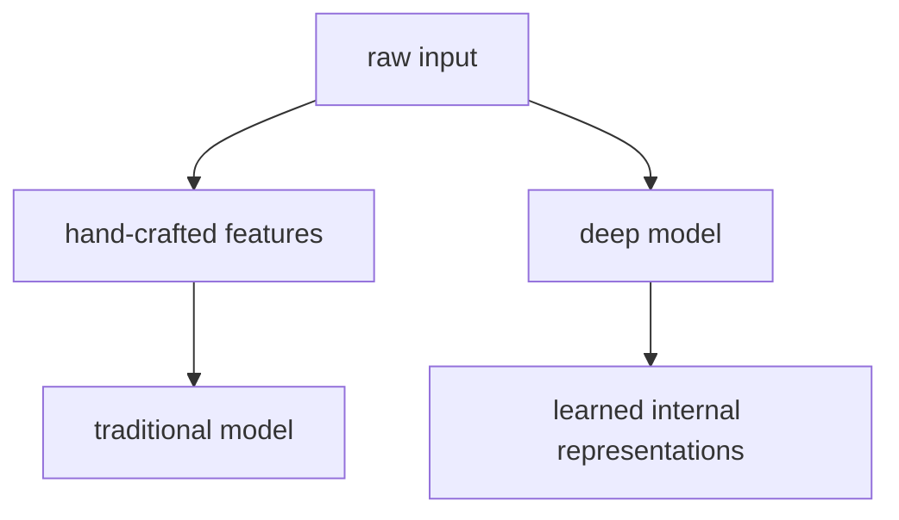

# P4-10.1 표현 학습(representation learning)

P4-9장까지 오면 딥러닝이 큰 텐서 계산을 배치 단위로 반복하며, GPU와 병렬 처리 덕분에 실용적인 규모로 확산되었다는 점을 보았습니다. 이제 다시 질문을 모델 안쪽으로 돌리면 다음 물음이 생깁니다.

이 많은 계산 끝에, 신경망은 도대체 무엇을 배우는가?

이 질문에 답할 때 핵심이 되는 표현이 표현 학습(representation learning)입니다.

표현 학습은 사람이 특징(feature)을 일일이 설계하는 대신, 모델이 데이터에서 유용한 내부 표현을 스스로 배우는 과정을 뜻한다.

## 이 절의 범위

이 절은 다음 질문에 답합니다.

- 표현(representation)은 무엇을 뜻하는가?
- 표현 학습은 특징 공학(feature engineering)과 어떻게 다른가?
- 딥러닝에서 표현 학습이 왜 전환점처럼 여겨지는가?
- 내부 표현을 배운다는 말은 독자에게 어떻게 설명할 수 있는가?

이 절에서는 다음 내용을 깊게 다루지 않습니다.

- 각 층에서 형성되는 표현의 정량 평가
- disentanglement 같은 심화 표현 학습 이론
- self-supervised representation learning의 최신 세부 기법

깊은 층에서 표현이 어떻게 점점 추상화되는지는 P4-10.2에서 이어서 다루고, 이미지 도메인 표현은 P4-11.1, P4-11.2에서, 시퀀스와 attention 기반 표현은 P4-12.1, P4-12.2, P4-13.1, P4-13.2에서 다시 연결합니다. self-supervised representation learning의 최신 세부 기법은 이 책의 현재 본편 범위 밖에 둡니다.

## 이 절의 목표

- 표현 학습을 `유용한 내부 특징을 모델이 스스로 형성하는 과정`으로 설명할 수 있습니다.
- 사람이 직접 특징을 만드는 방식과 딥러닝 방식의 차이를 비교할 수 있습니다.
- 딥러닝이 왜 표현 학습의 성공과 함께 크게 확산되었는지 말할 수 있습니다.
- 작은 Python 예제로 사람이 정의한 특징과 간단한 선형 변환 표현을 비교할 수 있습니다.

## 표현이란 무엇인가

표현(representation)은 독자에게 추상적으로 들리기 쉽습니다. 이 책에서는 먼저 다음처럼 이해하면 충분합니다.

`원래 데이터를 모델이 더 잘 다루기 쉬운 형태로 바꿔 놓은 내부 숫자 표현`

예를 들어 같은 고객 데이터를 두 가지 방식으로 볼 수 있습니다.

- 원본 입력: 나이, 구매 횟수, 최근 방문일
- 내부 표현: 모델이 계산 과정에서 조합한 활동성, 관심도, 위험도 같은 추상적 숫자 조합

물론 모델이 실제로 그런 이름을 붙이는 것은 아닙니다. 하지만 독자에게는 `원본보다 계산하기 쉬운 중간 표현을 만든다`는 감각이 중요합니다.

같은 생각을 입력, 사람이 읽는 설명, 모델이 쓰는 표현으로 다시 나누면 다음처럼 볼 수 있습니다.

| 층위(level) | 사람이 읽는 방식 | 모델이 다루는 방식 |
| --- | --- | --- |
| 원본 데이터 | 나이, 구매 횟수, 최근 방문일 같은 관측값 | 숫자 벡터나 텐서 입력 |
| 사람이 만든 설명 | 활동성이 높다, 관심이 줄었다 같은 해석 | 아직 모델 내부 계산은 아님 |
| 내부 표현 | 이름표가 없는 중간 숫자 조합 | 다음 층 계산과 최종 예측에 쓰이는 표현 |

즉, 표현 학습은 사람이 붙인 해석 문장을 그대로 배우는 것이 아니라, 예측에 유용한 내부 좌표계를 모델 안에서 형성하는 일에 가깝습니다.

## 특징 공학(feature engineering)과 무엇이 다른가

머신러닝 초창기와 전통적 접근에서는 사람이 직접 특징(feature)을 설계하는 일이 매우 중요했습니다.

예를 들어 이미지 문제에서는 사람이 다음 같은 특징을 만들 수도 있었습니다.

- edge count
- texture descriptor
- color histogram

텍스트 문제에서는:

- 단어 등장 빈도
- 길이
- 특정 패턴 포함 여부

같은 특징을 사람이 정리했습니다.

표현 학습의 전환점은, 모델이 이런 특징 조합을 상당 부분 데이터에서 직접 학습하게 되었다는 점입니다.

즉:

- 특징 공학은 사람이 `무엇을 볼지` 미리 정하는 방식에 가깝고
- 표현 학습은 모델이 `무엇이 유용한지` 학습 과정에서 내부적으로 찾아가는 방식에 가깝습니다

이 차이를 더 압축하면 다음 표처럼 읽을 수 있습니다.

| 질문 | 특징 공학 중심 접근 | 표현 학습 중심 접근 |
| --- | --- | --- |
| 누가 특징을 정하는가? | 사람이 먼저 정함 | 모델이 학습 과정에서 형성함 |
| 개발자의 중심 작업 | 도메인 지식으로 특징 설계 | 데이터, 구조, 학습 설정 설계 |
| 강점 | 해석이 비교적 직접적임 | 복잡한 조합을 더 넓게 포착할 수 있음 |
| 부담 | 문제마다 수작업 설계 비용이 큼 | 데이터와 계산 자원이 더 중요해짐 |

## 왜 이 차이가 중요했나

이 차이가 중요한 이유는 단순한 자동화 때문만이 아닙니다.

사람이 만든 특징에는 한계가 있습니다.

- 문제마다 다른 특징 설계가 필요하고
- 사람이 놓치는 조합이 있을 수 있으며
- 데이터가 복잡해질수록 수작업 특징 설계가 매우 어려워집니다

딥러닝은 많은 층과 비선형 변환을 통해, 원시 입력(raw input)에서 더 유용한 표현을 직접 배우려는 방향으로 발전했습니다.

다음처럼 기억하면 충분합니다.

`딥러닝의 강점은 단순히 큰 모델이 아니라, 특징을 스스로 형성하는 능력에 있다.`

## 이미지, 음성, 텍스트에서 표현 학습은 어떻게 보이나

표현 학습은 데이터 도메인이 달라도 비슷한 사고를 가집니다.

### 이미지

- 초기 층은 edge나 간단한 패턴
- 더 깊은 층은 모양, 부분 구조
- 더 뒤쪽은 객체 수준 정보

처럼 이어질 수 있습니다.

### 음성

- 단순 파형 자체보다
- 발음 패턴, 음절 단서, 화자 특성 같은

더 유용한 내부 표현으로 이어질 수 있습니다.

### 텍스트

- 문자나 토큰 자체보다
- 문맥, 구문, 의미적 관계를 더 잘 담는

내부 표현으로 이어질 수 있습니다.

즉, 표현 학습은 데이터 종류를 넘어 `입력을 더 유용한 중간 형태로 바꾸는 능력`이라는 공통 구조를 가집니다.

이 관점을 업무 장면으로 다시 옮기면 더 실감이 납니다.

| 장면 | 사람이 직접 만들기 쉬운 특징 | 모델이 더 잘 배울 수 있는 표현 |
| --- | --- | --- |
| 상품 추천 | 최근 구매 수, 클릭 수, 장바구니 수 | 비슷한 취향 묶음, 가격 민감도, 반복 구매 경향 같은 잠재 패턴 |
| 고객 이탈 예측 | 최근 방문 수, 최근 문의 수 | 시간에 따라 변하는 활동 저하 패턴, 여러 행동의 결합 신호 |
| 문서 분류 | 단어 빈도, 문서 길이 | 문맥에 따라 달라지는 주제 표현, 비슷한 문장 구조의 묶음 |

## 왜 딥러닝의 역사에서 전환점처럼 보이나

딥러닝이 크게 주목받은 이유는 단순히 층을 더 깊게 쌓았기 때문만은 아닙니다. 중요한 것은 `깊은 구조가 유용한 표현을 실제로 학습하기 시작했다`는 점이었습니다.

이미지 인식에서 AlexNet 이후 CNN이 주목받은 이유도, 사람이 직접 만든 특징보다 모델이 더 강력한 계층적 표현을 배우는 사례를 보여 주었기 때문입니다.

이 점은 Part 1에서 보았던 딥러닝 패러다임 확산과도 연결됩니다.

즉, 표현 학습은 딥러닝을 `특징 공학을 대체하는 계산 방식`으로 보이게 만든 핵심 요소 중 하나입니다.

## 이를 아주 단순하게 그리면



이 도식은 전통적 특징 공학과 딥러닝 표현 학습의 관점 차이를 압축합니다.

## 사례로 보기

### 사례 1. 이미지 분류

중고 의류를 `셔츠`, `바지`, `외투`로 나누는 장면을 떠올려 볼 수 있습니다. 사람은 먼저 색 분포, 윤곽선 길이, 단추 개수처럼 눈에 잘 띄는 특징을 세어 보려 할 수 있습니다. 하지만 옷이 접혀 있거나 일부가 가려지면 같은 셔츠도 윤곽선과 단추 위치가 크게 달라져 이런 규칙이 자주 흔들립니다. 표현 학습 기반 모델은 소매 모양, 주름 방향, 옷깃과 몸판의 조합처럼 여러 패턴을 함께 읽어 분류에 더 유용한 내부 표현을 만들 수 있습니다. 여기서 바뀌는 점은 `사람이 미리 적어 둔 몇 개 규칙`에서 `분류에 실제로 도움이 되는 조합을 모델이 내부에서 형성한다`로 중심이 이동하는 것입니다. 그 결과 사람이 정한 몇 개 규칙으로는 헷갈리던 이미지를 더 안정적으로 같은 범주로 묶을 수 있습니다. 그래서 이 사례에서 확인해야 할 결과는 접힘과 가림 때문에 규칙이 흔들리던 이미지도 내부 표현 조합을 쓰면 실제로 같은 옷 범주로 더 일관되게 묶이는가입니다.

### 사례 2. 추천 시스템

온라인 서점에서 사용자가 어떤 책을 좋아할지 예측한다고 해 봅시다. 사람은 먼저 `최근 7일 클릭 수`, `장바구니 추가 횟수`, `평균 구매 가격대` 같은 통계 열을 만들면 충분하다고 느끼기 쉽습니다. 하지만 실제로는 `입문서를 여러 권 본 뒤 특정 저자의 심화서를 고르는 흐름`처럼 숫자 하나로 잘 안 드러나는 조합이 중요할 수 있습니다. 표현 학습 모델은 사용자 행동과 상품 정보를 함께 보며 취향 묶음과 관심 전환 패턴을 더 압축된 표현으로 만들 수 있습니다. 그래서 단순 클릭 수 규칙보다 `지금 이 사용자에게 어떤 책이 이어질 가능성이 높은가`를 더 잘 잡을 수 있고, 추천 목록이 단순 인기순보다 더 맥락에 맞게 달라지는 결과로 이어집니다. 그래서 이 사례에서 확인해야 할 결과는 최근 클릭 수만 비슷한 사용자보다, 실제 관심 전환 흐름이 비슷한 사용자에게 같은 후속 도서가 더 앞쪽에 추천되는가입니다.

### 사례 3. 텍스트 임베딩

고객 문의를 비슷한 주제끼리 묶는 업무를 생각해 볼 수 있습니다. 사람은 `환불`, `배송`, `계정` 같은 단어가 몇 번 나오는지 세면 주제를 대충 나눌 수 있다고 느끼기 쉽습니다. 이 기준은 빠르지만, `돈이 다시 언제 들어오나요`와 `결제를 취소했는데 처리가 늦어요`처럼 핵심 단어가 다르면 같은 흐름의 문의도 떨어져 보일 수 있습니다. 표현 학습 기반 임베딩은 문장 전체 문맥을 반영해 이런 문장을 가까운 위치에 놓을 수 있습니다. 그래서 단어 빈도 표보다 `같은 뜻을 다른 말로 한 문장`을 더 잘 묶을 수 있고, 상담 분류나 검색 후보에서도 같은 주제 문의가 더 가깝게 모이는 차이가 생깁니다. 그래서 이 사례에서 확인해야 할 결과는 표면 단어가 달라도 같은 처리 흐름 문의가 실제로 더 가까운 후보군으로 모이는가입니다.

### 사례 4. 품질 검사 자동화

휴대폰 화면 검사 라인에서 작업자가 완성된 화면 사진을 보고 `금의 길이`와 `검은 점 개수`를 기준으로 불량 여부를 판단한다고 해 봅시다. 처음에는 이 기준이 단순하고 빠르지만, 금이 짧아도 여러 방향으로 갈라져 있거나 점이 모서리에 몰려 있으면 실제 사용 중 더 쉽게 문제가 생길 수 있습니다. 즉, 사람이 세는 두세 개 수치만으로는 `위치`, `방향`, `주변 밝기 변화`가 함께 만드는 패턴을 놓치기 쉽습니다. 표현 학습 기반 모델은 화면 전체에서 금의 방향 조합, 점의 위치, 주변 질감 변화를 함께 읽는 내부 표현을 만들 수 있습니다. 그래서 기준표만 보면 정상으로 넘길 화면을 다시 불량 후보로 잡아내는 식의 차이가 생기고, 사람이 놓치던 패턴을 재검토 대상으로 올릴 수 있습니다. 그래서 이 사례에서 확인해야 할 결과는 길이와 개수만으로는 정상처럼 보이던 화면이 위치와 방향 조합까지 반영했을 때 실제로 불량 후보로 다시 갈라지는가입니다.

## 작은 Python 예제로 보기

이번 예제의 목표는 사람이 직접 정의한 특징과, 간단한 선형 조합이 만든 중간 표현을 나란히 보는 것입니다.

입력:

- 고객 데이터 두 컬럼: 방문 횟수, 구매 금액

출력:

- 사람이 직접 만든 특징 하나
- 선형 조합으로 만든 간단한 중간 표현 하나

```python
import numpy as np

data = np.array([
    [2.0, 30.0],
    [5.0, 80.0],
    [1.0, 15.0],
])

# hand-crafted feature
activity_score = data[:, 0] * 10 + data[:, 1] * 0.1

# learned-representation-like linear transform intuition
weights = np.array([
    [0.6, 0.2],
    [0.1, 0.8],
])
representation = data @ weights.T

print("activity_score =", [round(v, 3) for v in activity_score])
print("representation shape =", representation.shape)
print("representation =")
print(np.round(representation, 3))
```

실행 결과 예시는 다음처럼 읽을 수 있습니다.

```text
activity_score = [23.0, 58.0, 11.5]
representation shape = (3, 2)
representation =
[[ 7.2 24.2]
 [19.  64.5]
 [ 3.6 12.1]]
```

이 결과에서 읽어야 할 핵심은 다음입니다.

- `activity_score`는 사람이 미리 정한 규칙입니다
- `representation`은 입력을 다른 좌표계로 바꾼 중간 표현처럼 볼 수 있습니다
- 실제 딥러닝은 이런 표현을 더 많은 층과 비선형성으로 더 유연하게 학습합니다

## 역사와 커리큘럼 관점

표현 학습(representation learning)은 딥러닝 교육에서 매우 중심적인 개념입니다. 왜냐하면 이 개념이 있어야:

- 딥러닝이 단순한 큰 선형회귀가 아니라는 점
- CNN, RNN, Transformer가 왜 강력한지
- 임베딩과 LLM이 왜 중요한지

를 하나의 축으로 설명할 수 있기 때문입니다.

역사적으로 이 개념에서 확인해야 할 전환은 feature engineering 중심 사고에서 data-driven internal representation 학습으로 무게중심이 옮겨 갔다는 점입니다. 딥러닝의 성과를 단순히 GPU나 규모로만 설명하면 절반만 설명한 셈이고, 표현 학습까지 함께 보아야 흐름이 완성됩니다.

## 다음 절과의 연결

여기까지 오면 다음 질문이 남습니다.

- 표현이 학습된다고 할 때, 깊은 층으로 갈수록 그 표현은 어떻게 달라지는가?
- 낮은 수준(low-level) 특징과 높은 수준(high-level) 표현이라는 말은 무슨 뜻인가?

이 질문은 바로 P4-10.2 깊은 층의 표현으로 이어집니다.

## 이 절에서 기억할 관점

- 표현 학습은 모델이 유용한 내부 특징을 스스로 형성하는 과정입니다.
- 전통적 특징 공학과 딥러닝의 차이는 `누가 특징을 설계하는가`에 있습니다.
- 딥러닝 확산의 핵심은 큰 계산만이 아니라, 강한 표현 학습 능력에도 있습니다.
- 표현 학습은 CNN, 임베딩, LLM으로 이어지는 공통 관점입니다.

## 체크리스트

- 표현 학습을 입문 수준에서 한 문장으로 설명할 수 있는가?
- 사람이 만든 특징과 모델이 학습한 표현의 차이를 말할 수 있는가?
- 딥러닝 역사에서 표현 학습이 왜 중요했는지 설명할 수 있는가?
- 다음 절에서 깊은 층의 표현으로 왜 자연스럽게 이어지는지 연결할 수 있는가?

## 출처와 참고 자료

- Yoshua Bengio, Aaron Courville, Pascal Vincent, `Representation Learning: A Review and New Perspectives`, IEEE TPAMI, 2013, 확인 날짜: 2026-06-29.
- Ian Goodfellow, Yoshua Bengio, Aaron Courville, `Deep Learning`, MIT Press, 2016, 확인 날짜: 2026-06-29. [https://www.deeplearningbook.org/](https://www.deeplearningbook.org/){: target="_blank" rel="noopener noreferrer" }
- Alex Krizhevsky, Ilya Sutskever, Geoffrey E. Hinton, `ImageNet Classification with Deep Convolutional Neural Networks`, NeurIPS 2012, 확인 날짜: 2026-06-29.
