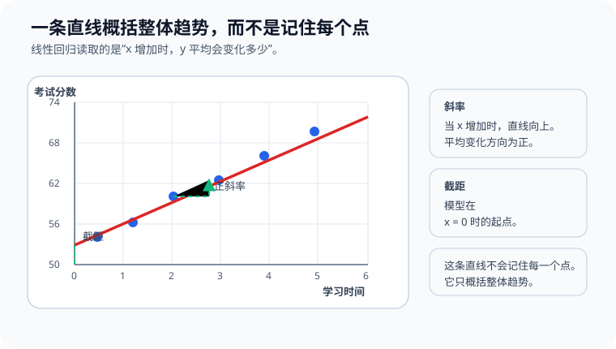

# P4-10.1 线性回归(linear regression)的直觉

> Section ID: `P4-10.1`
> Version: `v2026.07.12`

在 P4-9.2 里，我们通过 tuning 和 validation cost 讨论了 `应该怎样比较看起来不错的设置`。现在轮到把这个比较流程真正接到一个具体算法上。

把 linear regression 作为 Part 4 第一个算法来看的理由很明确。它既是 regression 问题最基础的出发点，也是最能用 `斜率` 与 `截距` 透明地展示输入和输出关系的模型。

本节的中心问题如下。

如果输入变大时输出也会跟着变大，或者输入变大时输出反而会变小，这种关系最简单可以怎样写成一个模型？

linear regression 对这个问题，首先用一条 `直线(line)` 来回答。

这一节会说明 `回归(regression)`、`线性回归(linear regression)`、`系数(coefficient)`、`截距(intercept)` 的基本含义。后面的章节会沿着这个抓手继续当前判断，而把连续值预测先读成一条直线的基础感觉，也会通过这一节和 [概念词汇表](../../../reference/concept-glossary.md) 再接回来。

## 本节范围

这一节回答下面这些问题。

- regression 处理的是哪一类问题？
- 为什么 linear regression 会被说成是用 `直线` 来表达关系？
- 应该怎样读取输入 feature 和输出 target 之间的方向与大小？
- 为什么 linear regression 会作为 Part 4 的第一个算法出现？

这一节不会深入讲下面这些内容。

- residual 的统计性质
- ordinary least squares 的严格推导
- multicollinearity、regularization、假设检验
- R²、MAE、RMSE 等评价指标的详细比较

评价指标和 residual 解读会在下一节 P4-10.2 立刻接着讲；multicollinearity、统计检验和 regression diagnostics 的基础阅读，会在 P4-10.3 补充学习里再整理。regularization 以及相关 hyperparameter 的更大视角，也会在 P4-9.1 和 P4-9.2 再接回来。

## 本节目标

- 能把 regression 解释成 `预测连续值的问题`。
- 能把 linear regression 说明成 `先用一条直线近似输入与输出关系的模型`。
- 能说明这里的 linear 指的是 `把整个输入读成一个加权和`。
- 能解释 slope 与 intercept 的直觉。
- 能在入门层面说明 linear regression 想要减少的到底是什么。
- 能理解为什么 linear regression 既是一个好 baseline，也是一个好起点。

## 学习背景

在 Part 4 前半段里，我们先整理了数据拆分、baseline、tuning 和评价标准。这样安排的原因，是希望读者学算法时，不是先背名字，而是先读懂 `它在用什么形式解决什么问题`。

在这套课程里，linear regression 起到下面这些作用。

| 课程位置 | linear regression 的作用 |
| --- | --- |
| 在 P4-4 的 regression / classification 之后 | 把 regression 问题接到实际 model 上 |
| 在 P4-8 的 baseline 之后 | 提供第一个简单但可解释的比较 model |
| 在 P4-11 之后的分类 model 之前 | 为连续值预测和概率分类之间的差别做准备 |

也就是说，linear regression 不是因为 `最简单` 才先出现，而是因为它是 `最容易说明输入与输出关系` 的算法。

## 主要学习内容

### regression 处理什么问题

regression 不是像 classification 那样去猜一个 class，而是去预测一个会连续变化的数值。

例如：

| 业务场景 | 要预测的值 |
| --- | --- |
| 根据房屋面积和位置预测房价 | 价格 |
| 根据广告费和季节信息预测销售额 | 销售额 |
| 根据运输距离和交通情况预测配送时间 | 时间 |
| 根据学习时间和作业分数预测最终成绩 | 分数 |

这些问题的共同点是：输出不是 `是/否`，而是一个数字。

`regression 是看着输入去估计一个连续值的问题。`

### 为什么 linear regression 用直线来表达关系

scikit-learn 的 linear model 文档把 linear regression 描述成学习观测值与 linear combination 之间关系的一类模型。本节把这个表述换成一个更容易进入的问题。

`如果输入稍微增加一点，输出平均会增加多少？`

最简单地回答这个问题的公式，就是下面这种形式。

\[
y = wx + b
\]

- `x`: 输入(input)
- `y`: 预测值(prediction)
- `w`: 系数(coefficient)
- `b`: 截距(intercept)

系数 `w` 表示 `当 x 改变 1 个单位时，y 会改变多少`。截距 `b` 是当输入为 0 时，model 设下的起点。

放到坐标上看，这个直觉会更清楚。即使数据点没有完美排成一条线，linear regression 也会去找一条最经济地概括这些点整体方向的直线。这里的 slope 读的是 `往右走时会上升多少`，intercept 读的是 `x = 0` 时 model 设下的起点。



如果再把这个结构压缩成流程图，可以读成下面这样。

```mermaid
--8<-- "assets/part-04/chapter-10/p4-10-1-mermaid-01-zh.mmd"
```

这张图把单变量 linear regression 表示成 `一个输入经过系数和截距，最后到达预测值` 的结构。这里首先要抓住的是：linear regression 不是一个把数据背下来的 model，而是一个用数字读取 `输入变化会怎样推动输出上升或下降` 的 model。

关键点在于，linear regression 不是在主张 `现实本来就是一条完美直线`，而是在问 `能不能先用一条直线去解释这个关系？`

不过，还需要再把一个常见记忆修正得更准确一点。读者常常把 linear regression 记成 `总是在二维图上画一条直线的 model`。这个记忆在单变量例子里是对的，但拿来说明整个算法就太窄了。

### linear 到底是什么意思

linear regression 里的 `linear`，通常会先用 `直线` 的图像来介绍，但从理论上说，它更接近 `把输入读成带权重的和` 这个意思。

当输入只有一个时，形式是

\[
y = wx + b
\]

当输入有多个时，就会扩展成下面这样。

\[
y = w_1x_1 + w_2x_2 + \cdots + w_nx_n + b
\]

也就是说，linear regression 会给每个 input feature 放上一个 coefficient，再把它们的贡献加起来，形成最后的 prediction。

`linear regression 是把多个输入各自分配一个数字影响，再把这些影响加起来，生成一个预测值的模型。`

把这一点简单画出来，就是下面这样。

```mermaid
--8<-- "assets/part-04/chapter-10/p4-10-1-mermaid-02-zh.mmd"
```

这张图说明：即使输入变成多个，linear regression 的核心结构也没有变。每个 feature 虽然各自有意义，但 model 最终还是把它们合成一个 weighted sum，再得到一个 prediction。这正是 `linear` 最核心的感觉。

所以，在单变量例子里，读者看到的是 `直线`；在两个以上变量里，读者会继续读成 `平面` 或更高维度的 `线性关系`。这里不需要一下子把所有维度数学都掌握住，只要先抓住 `输入变多了，结构仍然是加权和` 就足够了。

### 为什么直线这个假设有用

现实数据大多不会完美落在一条直线上。即使如此，linear regression 仍然重要，原因主要有三个。

1. 它让我们先尝试最简单的解释。
2. coefficient 和 intercept 相对容易解释。
3. 它能提供一个基准点，让我们判断复杂 model 是否真的有必要。

例如，如果学习时间增加时考试成绩也大致增加，那么 linear regression 就会先把这个关系浓缩成 `学习时间每增加一小时，成绩平均变化多少` 这样的问题。

即使这条直线并不完美，它仍然能让读者马上回答下面这些问题。

- 关系方向是正还是负？
- 变化幅度大还是小？
- 有没有被这个简单 summary 漏掉的模式？

也就是说，linear regression 更像是 `阅读现实的第一根坐标轴`，而不是什么一次性容纳全部现实的工具。

### linear regression 到底学什么

在算法章节里，只停在 `它用直线来读` 这个直觉还不够。还需要再固定住：model 实际在学什么。

linear regression 会先对数据点产生 prediction，然后去调整 coefficient 和 intercept，让 prediction 与 actual 之间的整体差距尽量变小。

这时，每个数据点都会出现

- actual
- prediction
- 以及两者之间的差，也就是 residual 或 error

linear regression 会朝着 `让这些差在整体上不要太大` 的方向去定下那条线。

scikit-learn 的 `LinearRegression` 默认使用的是对应 ordinary least squares 的解。把这个过程改写成一条更容易进入的句子，就是下面这样。

`它想找的是：在整个数据集上，留下的预测误差最少的那条线。`

此时最重要的不是严格证明或矩阵运算，而是抓住：这条线不是凭肉眼觉得 `看起来顺` 就决定，而是依据 `减少误差` 这个标准来决定。

把这个流程画得最简单，就是下面这样。

```mermaid
--8<-- "assets/part-04/chapter-10/p4-10-1-mermaid-03-zh.mmd"
```

这张图展示的是：linear regression 不是简单地画一条线，而是在 `减少误差` 的标准下，不断找一条更好的线。所以算法真正的核心，不是那条线的外形，而是 `它怎样在整体上减少 prediction 与 reality 的差距`。

也就是说，linear regression 既是 `画直线的 model`，也是 `减少误差的 model`。`算法` 这个词，正是在第二个角度下更清楚。

### 什么时候应该先把 linear regression 放上候选

linear regression 经常适合作为起点，不是因为它是 `最简单的 regression model`，而是因为它常常是 `最容易先读出关系方向和大小` 的起点。

| 当前问题状态 | 为什么先放 linear regression | 先检查什么 |
| --- | --- | --- |
| 目标是连续值预测 | 因为它作为 regression baseline 很容易解释 | 输出到底是不是数值而不是类别 |
| 想先读清输入和输出的方向性 | 因为关系很容易用 coefficient 与 intercept 解释 | 单位与 preprocessing 会怎样影响解释 |
| 还不知道复杂 model 是否真的必要 | 因为可以先测试简单 model 是否已经解释得差不多 | error 是否真的比 baseline 有改善 |
| explainability 很重要 | 因为每个 feature 的贡献容易用 weighted sum 说明 | 有没有把 correlation 混成 causality |
| 需要一个 regression 实验的首个比较 model | 因为它能给后面的复杂 model 建立出发点 | 有没有 nonlinear relationship 或重要缺失 feature |

这张表的核心不是把 linear regression 说成 `总是正确的 model`，而是把它看成 `最先揭示问题结构的比较 model`。

## 细部学习内容

### 在解释时最常见的误解是什么

学习 linear regression 时，失误更多出现在解释上，而不是公式本身。下面三种尤其常见。

### 1. 容易把大的 coefficient 直接误读成重要 feature

coefficient 的数字很大，并不自动代表这个 feature 一定更重要。

因为 coefficient 的大小会受到输入尺度(scale)与测量单位的影响。

- 如果输入是 `时间`，1 个单位就是 1 小时。
- 如果输入是 `金额`，1 个单位可能是 1 元，也可能是 1 万元。
- 如果输入是 `距离`，1 个单位可能是 1 公里。

所以，当 feature 的单位不同，只看 coefficient 数字本身去比较，解释就容易摇晃。

`coefficient 特别适合读取方向；比较大小时，必须把单位和 preprocessing 一起看。`

### 2. 容易把正斜率直接误读成原因(cause)

linear regression 首先展示的是 `一起移动的倾向`。这并不自动等于 causality。

例如，广告费和销售额一起增加，并不能仅靠这个数字就断定：广告费增加就是销售额增加的唯一原因。

中间还可能存在别的解释，例如

- 季节效应
- 促销时期
- 既有品牌认知
- 没有测到的外部变量

也就是说，linear regression 的 coefficient 首先是一个读取 `关系方向与大小` 的解释工具，而不是一个自动证明原因的工具。

### 3. 容易把 prediction 当成 actual 来读

linear regression 的输出不是对现实世界的直接复制，而是在当前数据和当前假设之上得到的 estimate。

例如，`学习 7 小时 -> 预测成绩 76.4` 这个输出，并不表示

- 一定会拿到正好 76.4 分

它表示的是

- 按当前学到的直线来看，可以期待一个接近那个位置的值

理解这个差别，才能为下一节阅读 residual 和 error 做准备。

### linear regression 暗中放下了哪些假设

学习算法时，比起先问性能，更重要的是先养成 `这个 model 是怎样简化世界的` 习惯。linear regression 主要做了下面这些简化。

### 1. 关系大体上是线性的

它假定输入变化时，输出也大体会按一个一致的方向和比例变化。

例如，学习时间增加时，成绩确实会上升，但现实里上升幅度可能会在某个区间之后变小。即便如此，linear regression 仍然会先用一条线概括整体方向。

### 2. 各输入的影响可以相加

当有多个 feature 时，linear regression 会先把它们看成 `各自贡献的总和`，而不是更复杂的交互作用。

例如，在房价问题里，如果面积、距离、房龄都会影响价格，那么 linear regression 就会先把最终价格读成这些因素分别贡献多少之后的和。

### 3. 误差作为未被解释的部分留下

model 不可能解释现实中的全部波动。linear regression 会把无法解释的差异留作 error，并把 model 放在能让这个 error 在整体上更小的位置。

这三点并没有覆盖全部严格统计假设，但它们已经足够帮助读者抓住 linear regression 的世界观。

`linear regression 是把关系简化成一个方向上的加和，并把剩余差异处理成误差的模型。`

### 为什么 linear regression 是一个好的首个 baseline

linear regression 常常会被用作 baseline model，原因就在于它兼具 explainability 和 simplicity。

在尝试更复杂的 model 之前，先跑一遍 linear regression，读者可以先检查：

- 单纯的线性关系是否已经能解释一部分问题？
- feature 和 target 的方向性是否符合预期？
- 复杂 model 的必要性到底有多大？

所以，linear regression 不只是一个追求更高性能的 model，也常常是一个先测试 `这个问题能在多大程度上线性地被读懂` 的参考 model。

linear regression 对解释训练尤其有用。更复杂的 model 也许能把性能再提一点，但往往很难直接说明为什么会出现那样的 prediction。相比之下，linear regression 至少比较容易直接回答下面这些问题。

- model 把关系读成了哪个方向？
- 哪些输入增加时，prediction 也会跟着增加？
- 这个问题是不是太粗糙，不适合只用一条线来说明？

也就是说，linear regression 不只是性能的起点，也是解释的起点。

这种比较还会继续连到后面的算法章节。

- 在 P4-11 的 logistic regression 里，这条线会再被读成概率分类边界。
- 在 P4-14 的 decision tree 里，关系会改用 branching rule 来读取，而不是直线。
- 在 P4-15 的 random forest 里，会把多棵树合起来处理 nonlinear relationship。

## 案例及示例

### 案例 1. `广告费增加时销售额也增加` 这句话，最简单能怎样表达

一个小型线上商店团队想先读懂 monthly ad spend 与 sales 之间的关系。人们最初看的标准，是诸如 `广告费增加的月份，订单数是否也一起增加`、`没有特殊活动的普通月份里，是否也能看到类似趋势` 这样的问题。

于是团队没有先上复杂 model，而是先试最简单的 linear regression。因为只要先用一条直线总结 `广告费增加时，销售额平均会一起变化多少`，就能马上读出关系方向到底是正还是负、变化幅度大致有多大。现实当然不一定是一条完美直线，但作为 `每增加一个单位，大致会带来什么变化` 的第一个参考点，它已经很有用。

在这个场景里，linear regression 不是在断言 `现实就是直线`，而是在问 `能不能先用直线来解释这个关系`。如果 ad spend 与 sales 大体上朝着同一个方向变动，那么 coefficient 和 intercept 就会成为这段关系最透明的第一层说明。

可确认的结果会在学出来的直线与 coefficient 解读里出现。如果 coefficient 为正，读者就可以读出广告费增加与销售额增加一起出现的趋势；再把 prediction 和 actual 的差拿来一起看，也能马上判断只用一条直线来解释这个场景到底有多粗糙。

```mermaid
--8<-- "assets/part-04/chapter-10/p4-10-1-mermaid-04-zh.mmd"
```

## 案例及示例

### 先用最简单的方式读取单变量 linear regression

先看一个学习时间和考试成绩的例子。

| study_hours | exam_score |
| --- | --- |
| 1 | 52 |
| 2 | 55 |
| 3 | 61 |
| 4 | 64 |
| 5 | 68 |
| 6 | 72 |

看这组数据时，成绩不会每次都以完全固定的幅度上涨，但整体上仍然是时间越多，成绩越高。linear regression 会看着这个场景，试着找出像下面这样的一条线。

`随着学习时间增加，分数平均也会上升的一条直线`

这里最重要的不是 `精确穿过所有点的直线`，而是 `最能稳妥说明整体方向的直线`。正如前面所说，linear regression 会依据减少 prediction 与 actual 差异的标准，选出一条更好的线，并把这个结果继续用在新输入的预测上。

如果把这个表达再稍微换成更理论一点的话，可以改写成下面这样。

- 每个单独数据点都可能留下 error。
- 但从整个数据集来看，有些线留下的整体 error 更小，有些线更大。
- linear regression 会选择 `整体上更能减少 error 的那条线`。

也就是说，linear regression 不是一个把每个点都对得严丝合缝的 model，而是一个 `以最经济的方式总结整体趋势的 model`。

### coefficient 和 intercept 应该怎样读

第一次学习 linear regression 时，很多读者会看到公式，却没有真正抓住意思。本节先固定解释，再谈计算。

### coefficient

coefficient 表示：当输入变化时，输出会朝什么方向、变化多少。

- coefficient > 0：输入变大时，输出也倾向于变大
- coefficient < 0：输入变大时，输出倾向于变小
- coefficient 绝对值越大：输入变化时，输出变化得越敏感

例如，如果广告费每增加 1 个单位，预期销售额平均增加约 3 个单位，那么 coefficient 就可以大致读成 `+3`。

但在解释时，必须把下面两点一起看。

- `方向`：它是在增加，还是在减少？
- `单位`：输入的 1 个单位到底代表什么？

例如，输入的 1 个单位如果是 `学习 1 小时`，和如果是 `广告费 1 万元`，即使同样是数字 3，意义也完全不同。所以读 coefficient 时，比起盯着数字本身，更应该把它读成一句话：`当什么增加 1 个单位时，另一个量会变化多少？`

### intercept

intercept 是当输入为 0 时，model 放下的起点。不过，intercept 并不总是容易被直接解释成现实意义。

例如，在学习时间等于 0 时去预测考试成绩，在语境里多少还能读；但如果是房屋面积 0 平方米时的房价，现实解释就可能很弱。

所以，intercept 更适合这样来读。

`它是模型的数学出发点，但能不能直接解释，要看 domain。`

## 练习与示例

### 用 Python 看一个很小的 linear regression

下面这个例子，是一个用 `study_hours` 预测 `exam_score` 的极小型 linear regression 练习。

- 问题场景：根据学习时间，大致预测考试成绩
- 输入(input)：学习时间
- 标签(label)：真实考试分数
- 要检查的概念：
  - linear regression 会学出一条直线
  - `coef_` 是 coefficient，`intercept_` 是起点
  - model 可以对新输入做连续值预测

```python
import numpy as np
from sklearn.linear_model import LinearRegression

study_hours = np.array([1, 2, 3, 4, 5, 6]).reshape(-1, 1)
exam_score = np.array([52, 55, 61, 64, 68, 72])

model = LinearRegression()
model.fit(study_hours, exam_score)

pred_2 = model.predict([[2]])[0]
pred_7 = model.predict([[7]])[0]

print("sample count      :", len(study_hours))
print("coefficient       :", round(model.coef_[0], 3))
print("intercept         :", round(model.intercept_, 3))
print("prediction at x=2 :", round(pred_2, 3))
print("prediction at x=7 :", round(pred_7, 3))
```

一个可能的输出如下。

```text
sample count      : 6
coefficient       : 4.114
intercept         : 47.6
prediction at x=2 : 55.829
prediction at x=7 : 76.4
```

这个结果可以这样读取。

- coefficient 大约 `4.114` 表示：学习时间每增加 1 小时，分数平均会上升大约 4 分。
- intercept 大约 `47.6` 是 model 放下的数学起点。
- `x=7` 的 prediction 说明：即使面对训练里没有直接出现过的新输入，model 也能沿着这条直线继续给出连续值预测。

这里暂时最重要的，不是 `到底精确对了多少分`，而是 `它是否已经用直线把关系的方向和大小读出来了`。

如果把解释写得再谨慎一点，可以改成下面这样。

- 在这个例子里，model 读出了 `学习时间增加时，分数也上升` 这个方向。
- 但这并不意味着所有区间都一定保持完全一样的增长幅度。
- 76.4 这个 prediction 的意思是 `当前直线 model 会这样估计`，而不是现实中一定会得到那个准确分数。

也就是说，linear regression 的第一层解释不是 `精确预言未来`，而是 `对关系做一个简单总结`。

### 用 Python 一起读取多个 coefficient

单变量例子适合抓住“直线”的感觉，但真实业务数据通常会有多个 feature。下面这个例子是一个小型多变量 linear regression 练习：用 `study_hours`、`attendance`、`assignment_score` 三个特征去预测 `final_score`。

- 问题场景：把学习时间、出勤、作业分数一起放进去，预测最终成绩
- 输入(input)：三个数值特征
- 标签(label)：最终成绩
- 要检查的概念：
  - linear regression 会给每个 feature 放一个 coefficient
  - coefficient 的符号可以用来读方向
  - coefficient 的大小必须连同单位一起谨慎地读

```python
import numpy as np
from sklearn.linear_model import LinearRegression

X = np.array([
    [2, 80, 60],
    [3, 82, 65],
    [4, 85, 70],
    [5, 88, 72],
    [6, 90, 78],
    [7, 93, 83],
])

y = np.array([58, 63, 67, 71, 77, 82])

feature_names = ["study_hours", "attendance", "assignment_score"]

model = LinearRegression()
model.fit(X, y)

new_student = np.array([[5, 89, 75]])
pred_new = model.predict(new_student)[0]

print("sample count :", len(X))
for name, coef in zip(feature_names, model.coef_):
    print(f"{name:17}: {coef:.3f}")
print("intercept         :", round(model.intercept_, 3))
print("prediction new    :", round(pred_new, 3))
```

一个可能的输出如下。

```text
sample count : 6
study_hours      : 2.174
attendance       : 0.609
assignment_score : 1.130
intercept         : -6.391
prediction new    : 73.12
```

这个结果可以这样读。

- `study_hours` 的 coefficient 是正的，所以在其他条件固定时，学习时间越多，预测分数也越高。
- `attendance` 和 `assignment_score` 也都是正值，所以在这个例子里，三个特征都朝着提高分数的方向被反映。
- 但不能因为 `2.174` 和 `0.609` 这两个数字，就立刻断言 `学习时间比出勤重要三倍以上`。两个特征的单位和分布可能完全不同。
- intercept 为负，并不表示 `现实里的分数会是负数`。这同样应该被读成模型的数学起点。

这个多变量例子再次把 linear regression 展示成下面这种模型。

`把多个特征各自的影响读出来，再把这些影响加起来，得到一个预测值的模型`

### 再改一个值试试：只提高一个输入时，什么保持不变，什么发生变化

这次保持同一个学生的 `attendance` 和 `assignment_score` 不变，只把 `study_hours` 从 `5` 提高到 `7`。

```python
import numpy as np
from sklearn.linear_model import LinearRegression

X = np.array([
    [2, 80, 60],
    [3, 82, 65],
    [4, 85, 70],
    [5, 88, 72],
    [6, 90, 78],
    [7, 93, 83],
])

y = np.array([58, 63, 67, 71, 77, 82])

model = LinearRegression()
model.fit(X, y)

student_base = np.array([[5, 89, 75]])
student_more_hours = np.array([[7, 89, 75]])

pred_base = model.predict(student_base)[0]
pred_more_hours = model.predict(student_more_hours)[0]

print("prediction at [5,89,75] :", round(pred_base, 3))
print("prediction at [7,89,75] :", round(pred_more_hours, 3))
print("difference              :", round(pred_more_hours - pred_base, 3))
```

一个可能的输出如下。

```text
prediction at [5,89,75] : 73.12
prediction at [7,89,75] : 77.468
difference              : 4.348
```

### 什么保持不变，什么发生变化

- 保持不变的点：当其他 feature 固定时，`study_hours` 的 coefficient 方向保持不变。学习时间增加，预测分数也会上升。
- 发生变化的点：只改了一个输入，prediction 就上升了大约 `4.348` 分。也就是说，linear regression 会让读者用 `输入变化量 x coefficient` 的感觉去理解变化。
- 最先应该留下的判断：这个变化是当前 model 给出的估计变化，并不保证现实里一定按同样幅度上升。单位和数据范围仍然要一起看。

这个练习把 linear regression 从 `记住一条直线的模型`，重新拉回到 `当一个输入改变时，prediction 会朝什么方向、以多大幅度变化` 这个阅读起点上。对 Part 4 来说，重要的不是只知道 coefficient 这个名字，而是能亲自改一个值，然后说明 `什么被固定了，什么被改变了`。只有经过这种反复练习，后面的 baseline 比较、residual 解读、是否增加 feature 的判断，才能继续沿用同一种语言。

| 共通记录语言 | 这次练习里应该立刻留下的内容 |
| --- | --- |
| 显示出来的结构 | 对同一个学生，只改一个 feature，prediction 就会沿着 coefficient 的方向连续移动 |
| 解释边界 | prediction 的差值不等于现实中的因果效果，也不等于确定的成绩提升幅度 |
| 下一步问题 | 这种变化在训练范围之外是否还成立？如果把 residual 和 baseline 比较也接上，解释是否仍然站得住？ |

### 在这一节里，读取数字的基本顺序

在算法章节里，一看到数字，人很容易立刻跳到 `性能很好` 或 `预测正确`。但在线性回归里，应该按下面这个顺序去读。

1. 先确认当前问题是不是 regression。
2. 确认输入和输出各是什么。
3. 通过 coefficient 的符号读取方向。
4. 通过 coefficient 的单位读取变化幅度。
5. 检查 intercept 在当前语境里是否真的有可解释性。
6. 记住 prediction 是 estimate，而不是 actual 本身。

关键在于：`读数字是有顺序的`。面对 linear regression，不能只是因为算出了结果就直接相信，而要按这样的解释规则去读。

## Checklist

- 你有没有清楚地区分：当前问题是 regression，不是 classification？
- 你有没有理解：linear regression 的输出是连续值，而不是类别？
- 你能不能把 linear regression 说明成：先用一条直线近似输入与输出关系的第一个可解释 baseline？
- 你能不能把 coefficient 和 intercept 讲成“意义”，而不是只讲成公式符号？
- 你是否没有立刻把 coefficient 数字读成重要性或原因，而是把单位和语境一起看？
- 你有没有记住：prediction 不是 actual，而是当前 model 给出的 estimate？
- 你能不能解释：即使直线不完美，它为什么仍然是一个有用的起点？

## 出处与参考资料

- scikit-learn, `1.1. Linear Models`, scikit-learn User Guide, 确认日期: 2026-06-26. [https://scikit-learn.org/stable/modules/linear_model.html](https://scikit-learn.org/stable/modules/linear_model.html){: target="_blank" rel="noopener noreferrer" }
- scikit-learn, `LinearRegression`, scikit-learn API Reference, 确认日期: 2026-06-26. [https://scikit-learn.org/stable/modules/generated/sklearn.linear_model.LinearRegression.html](https://scikit-learn.org/stable/modules/generated/sklearn.linear_model.LinearRegression.html){: target="_blank" rel="noopener noreferrer" }
