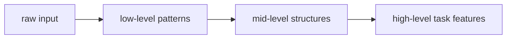

# P4-10.2 깊은 층의 표현

P4-10.1에서는 표현 학습(representation learning)을 `모델이 유용한 내부 특징을 스스로 배우는 과정`으로 설명했습니다. 이제 다음 질문이 자연스럽게 이어집니다.

그렇다면 깊은 신경망에서는 층이 깊어질수록 표현이 어떻게 달라진다고 말하는가?

이 절은 그 질문에 답합니다.

깊은 층으로 갈수록 표현은 보통 더 국소적이고 단순한 패턴에서, 더 추상적이고 과업(task)에 가까운 패턴으로 이동한다.

## 이 절의 범위

이 절은 다음 질문에 답합니다.

- 낮은 수준(low-level) 특징과 높은 수준(high-level) 표현은 무엇을 뜻하는가?
- 왜 여러 층을 쌓으면 더 추상적인 표현이 가능하다고 말하는가?
- 깊은 층의 표현은 데이터 도메인마다 어떻게 비슷하고 또 다르게 보이는가?
- 이 설명은 왜 완벽한 법칙이 아니라 직관적 경향으로 읽어야 하는가?

이 절에서는 다음 내용을 깊게 다루지 않습니다.

- 특정 층 표현의 시각화 기법 세부 구현
- self-supervised pretraining representation의 최신 연구 세부
- interpretability와 mechanistic analysis의 심화 이론

이 절의 목적은 `깊은 층 = 무조건 더 지능적` 같은 과장을 만드는 것이 아니라, 계층적 표현의 직관을 안전하게 설명하는 것입니다. 이미지의 계층적 표현은 P4-11.1, P4-11.2에서, 순차 데이터와 attention 기반 표현은 P4-12.1, P4-12.2, P4-13.1, P4-13.2, P4-14.1, P4-14.2에서 다시 연결합니다. interpretability와 mechanistic analysis의 심화 이론은 이 책의 현재 본편 범위 밖에 둡니다.

## 이 절의 목표

- 깊은 층 표현을 `단순 패턴에서 더 추상적 표현으로 이어지는 경향`으로 설명할 수 있습니다.
- 층을 쌓는 이유가 단순히 파라미터 수 증가만이 아니라 표현 수준 변화와도 연결된다는 점을 말할 수 있습니다.
- 이미지, 음성, 텍스트에서 계층적 표현 직관을 비교할 수 있습니다.
- 작은 Python 예제로 여러 선형 변환을 거치며 표현 공간이 바뀌는 감각을 확인할 수 있습니다.

## 낮은 수준과 높은 수준은 무엇을 뜻하나

입문 단계에서는 다음 구분으로 충분합니다.

- 낮은 수준(low-level) 특징: 가장 가까운 원시 패턴
- 높은 수준(high-level) 표현: 과업에 더 가까운 추상적 조합

예를 들어 이미지라면:

- 초반에는 edge, 방향, 간단한 질감
- 중간에는 부분 모양
- 더 뒤에서는 객체 단서

처럼 설명할 수 있습니다.

중요한 점은 이것이 완벽히 모든 네트워크에 동일하게 적용되는 공식이 아니라, 자주 관찰되는 교육적 직관이라는 것입니다.

같은 내용을 층별 역할로 더 또렷하게 쓰면 다음과 같습니다.

| 표현 수준 | 자주 드는 설명 | 과업과의 거리 |
| --- | --- | --- |
| 낮은 수준(low-level) | edge, 짧은 주파수 패턴, 토큰 주변 단서 | 아직 원시 입력에 가까움 |
| 중간 수준(mid-level) | 부분 모양, 음절 단서, 구문 패턴 | 입력과 과업 사이를 잇는 중간 구조 |
| 높은 수준(high-level) | 객체 단서, 화자 특성, 문장 의미 역할 | 과업 판단에 더 가까움 |

## 왜 층을 쌓으면 표현이 달라질 수 있나

한 층은 이전 층 출력 위에서 다시 조합을 만듭니다. 따라서 뒤쪽 층은 원본 입력을 직접 보기보다, 앞단이 만들어 놓은 표현을 재료로 사용합니다.

즉:

- 첫 층은 입력에 가까운 신호를 다루고
- 다음 층은 그 신호 조합을 다루며
- 더 깊은 층은 다시 그 조합의 조합을 다룹니다

이 반복 때문에 층이 깊어질수록 표현이 더 추상화된다고 설명하는 것입니다.

다음처럼 기억하면 충분합니다.

`깊은 층은 원본 데이터 그 자체보다, 이미 정리된 중간 표현을 다시 조합하며 더 과업에 가까운 표현을 만든다.`

이 과정을 작은 업무 비유로 바꾸면 더 쉽습니다.

- 첫 단계는 원시 기록에서 눈에 띄는 단서를 적어 둡니다.
- 다음 단계는 그 단서들을 묶어 더 의미 있는 중간 판단 재료를 만듭니다.
- 마지막 단계는 그 중간 재료를 사용해 실제 과업에 가까운 결론을 냅니다.

신경망의 각 층도 완전히 같은 방식은 아니지만, 입문 단계에서는 이와 비슷하게 `단서 -> 중간 구조 -> 과업 가까운 표현`으로 읽을 수 있습니다.

## 이미지에서의 계층적 표현 직관

이미지 영역은 이 설명이 가장 직관적으로 들리는 분야입니다.

예를 들어 CNN을 떠올리면:

- 초반 필터는 edge나 작은 패턴에 반응하고
- 중간 층은 눈, 귀, 바퀴 같은 부분 구조에 반응하며
- 뒤쪽 층은 고양이 얼굴, 자동차 형태 같은 더 큰 단서를 조합한다고 설명할 수 있습니다

물론 실제 네트워크 내부는 이보다 더 복잡합니다. 하지만 입문자에게는 `작은 패턴 -> 부분 구조 -> 큰 의미 단서`라는 흐름이 큰 도움이 됩니다.

## 음성과 텍스트에서의 계층적 표현 직관

이 직관은 이미지 밖에서도 유용합니다.

### 음성

- 원시 파형이나 짧은 주파수 단서
- 발음 조각
- 음절, 단어, 화자 특성 같은 단서

처럼 설명할 수 있습니다.

### 텍스트

- 토큰 수준 정보
- 인접 문맥 패턴
- 문장 수준 의미와 역할

처럼 설명할 수 있습니다.

즉, 데이터 도메인이 달라도 `앞단은 더 가까운 신호, 뒤쪽은 더 과업 가까운 구조`라는 계층적 설명이 자주 유효합니다.

도메인별로 나란히 두면 차이와 공통점이 더 분명합니다.

| 도메인 | 앞단에서 잘 보이는 것 | 뒤쪽으로 갈수록 더 잘 보이는 것 |
| --- | --- | --- |
| 이미지 | 경계, 방향, 작은 질감 | 부분 구조, 객체 단서 |
| 음성 | 짧은 주파수 패턴, 발음 조각 | 음절, 단어, 화자 특성 |
| 텍스트 | 토큰, 인접 문맥 | 문장 역할, 의미 관계, 과업 단서 |

## 하지만 이 설명을 과장하면 안 된다

독자 교육에서는 계층적 표현 직관이 매우 유용하지만, 다음 점도 함께 알아야 합니다.

- 모든 층이 딱 잘라 명확한 의미를 갖는 것은 아닙니다
- 도메인과 구조에 따라 표현 양상은 달라집니다
- 현대 모델에서는 단순한 한 줄 계층 구조보다 더 복잡한 상호작용이 생깁니다

즉, 이 절의 설명은 엄밀한 보편 법칙이라기보다 `학습 흐름을 읽기 위한 안전한 기본 지도`입니다.

특히 다음 오해는 피하는 편이 좋습니다.

| 흔한 오해 | 더 안전한 표현 |
| --- | --- |
| 깊은 층은 항상 더 똑똑하다 | 깊은 층은 더 과업 가까운 표현을 만들 경향이 있다 |
| 각 층은 의미가 딱 하나로 정해진다 | 층 표현은 겹치고 섞이며, 해석이 항상 깔끔하지는 않다 |
| 모든 모델이 같은 계층 구조를 보인다 | 계층적 직관은 유용하지만 구조와 도메인에 따라 달라진다 |

## 이를 아주 단순하게 그리면



이 도식은 깊은 층의 표현 직관을 가장 압축한 형태입니다.

## 사례로 보기

### 사례 1. 손글씨 숫자 분류

손글씨 숫자 3과 8은 둘 다 둥근 곡선을 가져 초반에는 비슷하게 보일 수 있습니다. 사람도 처음에는 `대충 둥글다`는 인상만 보고 헷갈릴 수 있지만, 실제 구분은 획(stroke) 방향이나 곡선 조각, `위쪽 고리와 아래쪽 고리가 어떻게 이어지는가` 같은 단서를 다시 보며 이루어집니다. 초기 층은 이런 작은 신호에 먼저 반응하고, 더 깊은 층은 큰 모양 단서를 조합하게 됩니다. 그래서 깊은 층으로 갈수록 단순 선 조각보다 숫자 전체 형태에 가까운 표현이 만들어진다고 설명할 수 있습니다.

### 사례 2. 얼굴 인식

얼굴 사진에서는 처음부터 `이 사람이 누구인가`를 바로 아는 것이 아니라, 사람도 먼저 edge, contour, local texture 같은 지역 단서를 보고 눈-코-입 배치 같은 더 큰 인상으로 넘어갑니다. 사람은 전체 얼굴 인상만 보면 바로 구분된다고 느끼기 쉽지만, 실제로는 작은 단서들이 쌓여야 더 안정적인 구분이 됩니다. 더 깊은 층으로 가면 이런 더 큰 구조가 묶이면서 identity 단서에 가까운 표현이 만들어집니다. 즉, 깊은 층은 작은 패턴을 단순 반복하는 것이 아니라 더 큰 얼굴 구조를 압축하는 방향으로 읽는 편이 자연스럽습니다.

### 사례 3. 문장 분류

문장 `배송이 너무 늦어서 환불하고 싶습니다`를 분류한다고 해 봅시다. 사람은 처음에 `배송`, `늦다`, `환불` 같은 단어만 보면 주제를 나눌 수 있다고 느끼기 쉽습니다. 하지만 실제 분류에서는 이 문장이 단순 배송 문의가 아니라 `불만 제기 + 환불 요청`이라는 더 큰 문맥 역할을 가진다는 점이 중요합니다. 초반 표현은 단어와 인접 토큰 관계를 강하게 담을 수 있고, 더 깊은 표현은 이런 문장 의도와 감정 방향성을 더 잘 반영하게 됩니다.

### 사례 4. 고객 행동 시계열

고객 행동 로그에서 사람은 최근 방문 수, 마지막 결제 간격, 최근 클릭 수만 봐도 상태를 알 수 있다고 느끼기 쉽습니다. 하지만 더 깊은 표현으로 가면 `이탈 직전 패턴`, `반복 구매 리듬`, `프로모션 반응성`처럼 단기 이벤트를 넘는 더 큰 행동 구조를 반영하는 쪽으로 설명할 수 있습니다. 이 사례는 깊은 표현이 단순 최근값 저장이 아니라 장기적 행동 특징 압축으로도 읽힐 수 있음을 보여 줍니다.

## 작은 Python 예제로 보기

이번 예제의 목표는 여러 선형 변환과 활성화를 거치며 입력이 다른 표현 공간으로 바뀌는 감각을 보는 것입니다.

입력:

- 두 개 feature를 가진 작은 데이터
- 두 단계의 가중치 변환

출력:

- 첫 번째 은닉 표현
- 두 번째 은닉 표현

```python
import numpy as np

def relu(x):
    return np.maximum(0, x)

x = np.array([
    [1.0, 2.0],
    [2.0, 1.0],
    [0.5, 3.0],
])

w1 = np.array([
    [0.8, 0.2, 0.5],
    [0.1, 0.7, 0.4],
])

w2 = np.array([
    [0.5, 0.3],
    [0.2, 0.9],
    [0.6, 0.1],
])

h1 = relu(x @ w1)
h2 = relu(h1 @ w2)

print("input shape =", x.shape)
print("h1 shape =", h1.shape)
print("h2 shape =", h2.shape)
print("h1 =")
print(np.round(h1, 3))
print("h2 =")
print(np.round(h2, 3))
```

실행 결과 예시는 다음처럼 읽을 수 있습니다.

```text
input shape = (3, 2)
h1 shape = (3, 3)
h2 shape = (3, 2)
h1 =
[[1.  1.6 1.3]
 [1.7 1.1 1.4]
 [0.7 2.2 1.45]]
h2 =
[[1.6   1.87 ]
 [1.91  1.64 ]
 [1.66  2.335]]
```

이 결과에서 읽어야 할 핵심은 다음입니다.

- 입력이 곧바로 정답으로 가지 않고
- 중간 표현 `h1`, `h2`를 거치며 다른 좌표 공간으로 바뀝니다
- 실제 딥러닝은 이런 변환을 훨씬 더 깊고 복잡하게 반복하며 유용한 표현을 학습합니다

## 역사와 커리큘럼 관점

깊은 층의 표현이라는 관점은 딥러닝이 왜 shallow model과 달랐는지를 설명하는 핵심 축입니다. 단순히 층이 많다는 것이 아니라, `계층적 표현을 형성한다`는 설명이 있어야 CNN, RNN, Transformer가 단순히 큰 함수가 아니라는 점이 드러납니다.

이 관점은 표현 학습 연구, 딥러닝 해석 가능성 연구, 그리고 LLM의 임베딩/은닉 표현 논의로도 이어집니다. 즉, Part 4의 이 절은 Part 5로 넘어갈 때 중요한 개념 다리 역할을 합니다.

## 다음 절과의 연결

여기까지 오면 다음 질문이 남습니다.

- 이런 계층적 표현을 이미지에서 특히 잘 다루는 구조는 무엇인가?
- 지역 패턴(local pattern)을 본다는 CNN은 왜 자연스러운 다음 주제가 되는가?

이 질문은 바로 P4-11.1 CNN의 직관으로 이어집니다.

## 이 절에서 기억할 관점

- 깊은 층의 표현은 단순 패턴에서 더 추상적이고 과업 가까운 표현으로 이동하는 경향이 있습니다.
- 여러 층을 쌓는 이유는 단순 파라미터 증가만이 아니라 표현 수준을 바꾸기 위해서이기도 합니다.
- 이미지, 음성, 텍스트 모두에서 계층적 표현 직관이 자주 유효합니다.
- 이 설명은 유용한 기본 지도이지만, 모든 내부 표현을 완전히 설명하는 보편 법칙은 아닙니다.

## 체크리스트

- 낮은 수준 특징과 높은 수준 표현의 차이를 설명할 수 있는가?
- 층을 깊게 쌓는 이유를 표현 수준 변화와 연결할 수 있는가?
- 이미지와 텍스트에서 계층적 표현 직관을 각각 예시로 말할 수 있는가?
- 다음 절의 CNN으로 왜 자연스럽게 이어지는지 설명할 수 있는가?

## 출처와 참고 자료

- Yoshua Bengio, Aaron Courville, Pascal Vincent, `Representation Learning: A Review and New Perspectives`, IEEE TPAMI, 2013, 확인 날짜: 2026-06-29.
- Ian Goodfellow, Yoshua Bengio, Aaron Courville, `Deep Learning`, MIT Press, 2016, 확인 날짜: 2026-06-29. [https://www.deeplearningbook.org/](https://www.deeplearningbook.org/){: target="_blank" rel="noopener noreferrer" }
- Dumitru Erhan et al., `Why Does Unsupervised Pre-training Help Deep Learning?`, JMLR, 2010, 확인 날짜: 2026-06-29.
