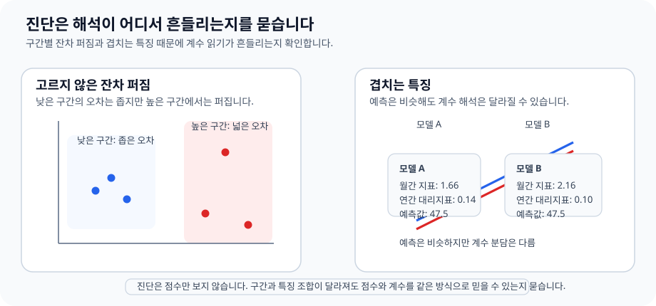

# P4-10.3 보충학습: 회귀 진단(regression diagnostics)을 처음 읽는 법

> Section ID: `P4-10.3`
> Version: `v2026.07.17`

P4-10.2까지 읽으면 선형회귀의 기본 평가는 갖춰집니다. 하지만 실제 문서나 강의에서는 곧 다음 표현을 만나게 됩니다.

- 통계적 유의성(significance)
- 잔차의 정규성(normality)
- 등분산성(homoscedasticity)
- 다중공선성(multicollinearity)

이 절의 목적은 이 모든 개념의 증명을 배우는 것이 아니라, 회귀 결과표를 읽다가 멈추지 않도록 `이 말들이 무엇을 걱정하는가`를 정리하는 데 있습니다.

이 보충학습은 선형회귀의 정의를 확장해서 다시 설명하는 절이 아닙니다. 기본 직관과 평가 손잡이는 P4-10.1, P4-10.2와 [개념사전](../../../reference/concept-glossary.md)에 두고, 여기서는 회귀 진단 용어들이 어떤 종류의 위험을 가리키는지만 정리합니다.

## 이 보충학습의 범위

이 절은 다음 질문에 답합니다.

- 회귀 진단(regression diagnostics)은 왜 선형회귀 뒤에 따라오는가?
- 통계적 유의성은 무엇을 조심해서 읽어야 하는가?
- 잔차의 정규성, 등분산성은 어떤 종류의 걱정인가?
- 다중공선성은 왜 계수 해석을 흔들 수 있는가?

이 보충학습에서는 회귀 진단을 `선형회귀 결과를 과신하지 않기 위해 어떤 종류의 위험을 점검하는가`라는 질문으로 먼저 닫고, P4-10.2에서 남긴 해석 안정성 질문을 회수하는 데 집중합니다.

각 검정 통계량의 수식 유도, p-value 해석 논쟁의 전체 역사, VIF 계산 실습과 고급 회귀 패키지 사용법은 현재 보충학습의 직접 범위를 넘어가므로 자세히 다루지 않습니다.

## 이 보충학습의 목표

- 회귀 진단을 `선형회귀 결과를 과신하지 않기 위한 점검`으로 설명할 수 있습니다.
- 유의성, 정규성, 등분산성, 다중공선성이 각각 무엇을 걱정하는지 구분할 수 있습니다.
- 회귀 계수 표를 읽을 때 `숫자가 있다`와 `해석이 안정적이다`를 같은 말로 보지 않을 수 있습니다.

## 회귀 진단은 왜 따로 나오나

선형회귀는 직선을 맞추는 모델이지만, 직선을 그렸다고 해석이 자동으로 안전해지는 것은 아닙니다. 그래서 회귀 진단은 보통 다음 질문으로 이어집니다.

1. 이 직선이 평균적으로 얼마나 빗나가는가?
2. 그 오차가 특정 방향으로 치우치지 않는가?
3. 입력 특징들이 서로 너무 겹쳐 계수 해석을 흔들지 않는가?
4. 계수 표의 숫자를 어느 정도까지 믿어도 되는가?

즉, 회귀 진단은 `성능 점수`가 아니라 `해석의 안정성`을 점검하는 언어입니다.

## 통계적 유의성은 무엇을 묻나

`이 계수나 관계가 우연한 흔들림만으로도 보일 수 있는가, 아니면 데이터 안에서 어느 정도 일관된 신호로 보이는가?`

중요한 것은 유의성이 곧 실무 중요도나 예측 성능을 뜻하지는 않는다는 점입니다.

| 표현 | 입문적 읽기 |
| --- | --- |
| 통계적으로 유의하다 | 우연만으로 보기 어렵다는 신호 |
| 실무적으로 중요하다 | 실제 의사결정에서 영향이 크다 |

이 둘은 다를 수 있습니다. 따라서 유의성은 `숫자의 존재 이유`를 묻는 한 축이지, 모델 품질 전체를 대신하지는 않습니다.

## 잔차의 정규성은 무엇을 걱정하나

잔차의 정규성은 아주 단순하게 말하면 `오차가 특정 이상한 모양으로 심하게 치우치지 않는가`를 보는 걱정입니다.

예측 자체를 하는 데는 정규성이 절대 조건처럼 느껴질 필요는 없습니다. 하지만 회귀 계수 해석이나 일부 통계 검정 문맥에서는 잔차 모양이 한쪽으로 심하게 찌그러져 있으면 해석이 덜 안정적일 수 있습니다.

- 잔차가 한쪽으로 매우 길게 치우치면 해석에 주의가 필요하다
- 큰 이상치(outlier)가 잔차 모양을 크게 흔들 수 있다

아주 작은 비교 실습으로 보면 다음처럼 읽을 수 있습니다.

```python
balanced_residuals = [-3, -1, 0, 1, 3]
skewed_residuals = [-1, 0, 1, 2, 12]

print("balanced residuals:", balanced_residuals)
print("skewed residuals  :", skewed_residuals)
print("balanced range    :", max(balanced_residuals) - min(balanced_residuals))
print("skewed range      :", max(skewed_residuals) - min(skewed_residuals))
```

실행 결과 예시는 다음과 같습니다.

```text
balanced residuals: [-3, -1, 0, 1, 3]
skewed residuals  : [-1, 0, 1, 2, 12]
balanced range    : 6
skewed range      : 13
```

이 비교는 정규성 검정을 대신하지는 않지만, `오차가 대체로 균형 있게 퍼진 장면`과 `한쪽 긴 꼬리가 생긴 장면`의 차이를 입문 수준에서 바로 보여 줍니다. 즉, 잔차의 정규성은 `오차가 한쪽으로 길게 늘어져 해석을 흔들지 않는가`를 먼저 걱정하는 언어로 받아들이면 충분합니다.

## 등분산성은 무엇을 걱정하나

등분산성은 오차의 퍼짐 정도가 입력 구간에 따라 너무 달라지지 않는가를 보는 걱정입니다.

예를 들어 작은 값에서는 오차가 작고, 큰 값으로 갈수록 오차가 점점 커진다면 다음 질문이 생깁니다.

- 모델이 특정 구간에서만 유난히 불안정한가?
- 직선 하나로 설명하기 어려운 구조가 숨어 있는가?

즉, 등분산성은 `오차가 모든 구간에서 비슷한 정도로 퍼지는가`를 보는 관점입니다.

아주 작은 비교 표로 보면 다음처럼 읽을 수 있습니다.

| 입력 구간 | 잔차 예시 | 먼저 드는 걱정 |
| --- | --- | --- |
| 낮은 가격대 | `-2, 1, 0` | 오차 퍼짐이 비교적 작다 |
| 높은 가격대 | `-15, 12, 18` | 특정 구간에서 오차 퍼짐이 훨씬 커진다 |

이런 장면에서는 `평균 성능이 괜찮다`보다 `어느 구간에서 설명이 무너지는가`를 먼저 확인해야 합니다.

회귀 진단을 한 장으로 압축하면, 한쪽에서는 `오차 퍼짐이 구간마다 달라지는가`, 다른 쪽에서는 `예측은 비슷한데 계수 해석만 흔들리는가`를 같이 보게 됩니다.



## 다중공선성은 왜 계수 해석을 흔드나

다중공선성은 입력 특징들끼리 너무 비슷한 정보를 담고 있을 때 등장합니다.

예를 들어:

- `monthly_spend`
- `quarterly_spend`
- `yearly_spend`

처럼 강하게 겹치는 특징들이 함께 들어오면, 모델은 예측 자체는 어느 정도 할 수 있어도 `어느 특징의 계수가 정말 더 중요했는가`를 안정적으로 말하기 어려워질 수 있습니다.

핵심은 이것입니다.

`예측이 된다`와 `계수 해석이 안정적이다`는 같은 말이 아니다.

## 사례 및 예시

### 사례 1. 집값 예측은 맞는 것 같은데 계수 해석이 계속 흔들릴 때

부동산 분석 팀이 집값 예측 회귀식을 만들고 있습니다. 사람이 먼저 보던 기준은 `면적이 크면 비싸지는가`, `역과 가까우면 가격이 오르는가`, `신축일수록 값이 높은가` 같은 질문이었습니다.

그런데 입력 칼럼에 `monthly_spend` 같은 단순 중복은 없더라도, `전용면적`, `공급면적`, `방 수`, `거실 수`처럼 서로 강하게 겹치는 정보가 함께 들어갑니다. 모델의 예측 자체는 그럴듯하지만, 어떤 실험에서는 면적 계수가 크게 나오고 다른 실험에서는 방 수 계수가 더 커지며, 계수 방향도 불안정해집니다. 이런 장면에서는 예측 성능과 계수 해석 안정성을 같은 말로 보면 안 됩니다.

```mermaid
--8<-- "assets/part-04/chapter-10/p4-10-3-mermaid-01-ko.mmd"
```

이때 회귀 진단은 `이 숫자를 어디까지 믿어도 되는가`를 묻습니다. 다중공선성은 비슷한 특징들이 서로 설명을 나눠 가지면서 계수 해석을 흔들 수 있고, 등분산성이 깨지면 특정 가격대에서 오차가 더 크게 퍼질 수 있으며, 잔차 모양이 한쪽으로 치우치면 해석을 더 조심해야 합니다. 즉, 직선을 하나 얻었다고 해서 그 계수 표 전체가 바로 안전한 설명이 되는 것은 아닙니다.

확인 가능한 결과는 잔차 분포와 입력 특징의 겹침 정도를 함께 볼 때 드러납니다. 예측은 비슷하게 유지되는데 계수 크기와 부호가 실험마다 흔들린다면, 그 회귀식은 `예측에는 쓸 수 있어도 설명에는 더 조심해야 하는 모델`일 수 있습니다.

## 연습 및 예제

### Python 예제로 겹치는 특징이 계수 해석을 어떻게 흔드는지 보기

아래 예제는 `monthly_spend`와 `yearly_spend_proxy`처럼 거의 같은 정보를 담는 두 특징이 함께 들어갈 때, 예측은 비슷해도 계수 해석이 얼마나 흔들릴 수 있는지 보여 줍니다.

- 문제 상황: 월 지출과 연 지출 추정치가 함께 들어간 회귀식을 읽는다.
- 입력(input): `monthly_spend`, `yearly_spend_proxy`
- 정답(label): 다음 달 매출
- 확인할 개념:
  - 서로 강하게 겹치는 특징이 함께 있으면 계수 역할이 나뉘어 보일 수 있습니다.
  - 예측이 유지되는 것과 계수 해석이 안정적인 것은 같은 말이 아닙니다.

```python
import numpy as np
from sklearn.linear_model import LinearRegression

monthly_spend = np.array([10, 12, 14, 16, 18, 20], dtype=float)
yearly_spend_proxy = np.array([121, 145, 167, 193, 215, 239], dtype=float)
y = np.array([30, 35, 40, 45, 50, 55], dtype=float)

X_two_features = np.column_stack([monthly_spend, yearly_spend_proxy])
X_one_feature = monthly_spend.reshape(-1, 1)

model_two = LinearRegression()
model_two.fit(X_two_features, y)

model_one = LinearRegression()
model_one.fit(X_one_feature, y)

query_two = np.array([[17, 203]], dtype=float)
query_one = np.array([[17]], dtype=float)

print("two-feature coefficients :", np.round(model_two.coef_, 3))
print("two-feature prediction   :", round(model_two.predict(query_two)[0], 3))
print("one-feature coefficient  :", round(model_one.coef_[0], 3))
print("one-feature prediction   :", round(model_one.predict(query_one)[0], 3))
```

실행 결과 예시는 다음과 같습니다.

```text
two-feature coefficients : [1.661 0.143]
two-feature prediction   : 47.517
one-feature coefficient  : 2.5
one-feature prediction   : 47.5
```

이 결과에서 먼저 읽어야 할 점은 다음과 같습니다.

- 두 모델의 예측은 거의 같습니다.
- 하지만 두 특징을 함께 넣었을 때는 계수 해석이 `1.661`과 `0.143`으로 나뉘어 보입니다.
- 즉, 예측은 유지돼도 `어느 특징이 정말 더 중요했는가`는 더 흔들릴 수 있습니다.

### 값 하나 더 바꿔 보기: 겹치는 특징 한 점만 흔들어도 무엇이 유지되고 무엇이 달라지는가

이번에는 `yearly_spend_proxy`의 마지막 값만 `239`에서 `233`으로 바꿔 다시 학습해 봅니다.

```python
import numpy as np
from sklearn.linear_model import LinearRegression

monthly_spend = np.array([10, 12, 14, 16, 18, 20], dtype=float)
yearly_spend_proxy = np.array([121, 145, 167, 193, 215, 239], dtype=float)
yearly_spend_shifted = np.array([121, 145, 167, 193, 215, 233], dtype=float)
y = np.array([30, 35, 40, 45, 50, 55], dtype=float)

query = np.array([[17, 203]], dtype=float)

model_original = LinearRegression().fit(
    np.column_stack([monthly_spend, yearly_spend_proxy]), y
)
model_shifted = LinearRegression().fit(
    np.column_stack([monthly_spend, yearly_spend_shifted]), y
)

print("original coefficients :", np.round(model_original.coef_, 3))
print("original prediction   :", round(model_original.predict(query)[0], 3))
print("shifted coefficients  :", np.round(model_shifted.coef_, 3))
print("shifted prediction    :", round(model_shifted.predict(query)[0], 3))
```

실행 결과 예시는 다음과 같습니다.

```text
original coefficients : [1.661 0.143]
original prediction   : 47.517
shifted coefficients  : [2.157 0.097]
shifted prediction    : 47.479
```

### 무엇이 유지되고 무엇이 달라지는가

- 유지된 점: 두 모델의 예측값은 여전히 거의 같습니다.
- 바뀐 점: 겹치는 특징의 값 하나를 조금만 바꿨는데도 계수 분배 방식은 꽤 크게 움직입니다.
- 먼저 남길 판단: 이런 장면에서는 `예측은 쓸 수 있지만 계수 해석은 더 조심해야 한다`는 회귀 진단의 경고를 먼저 떠올려야 합니다.

이 비교는 회귀 진단을 `나중에 배우는 통계 용어 목록`이 아니라 `모델 결과를 어디까지 믿어도 되는가를 다시 묻는 절차`로 보여 줍니다. 중요한 것은 점수와 계수 표를 그대로 받아들이는 것이 아니라, 어떤 변화에서는 예측이 흔들리고 어떤 변화에서는 해석만 흔들리는지를 구분하는 일입니다. 다중공선성은 바로 그 구분을 요구하는 대표 장면입니다.

| 공통 기록 언어 | 이번 연습에서 바로 남길 내용 |
| --- | --- |
| 보인 구조 | 겹치는 특징이 있으면 예측은 유지돼도 계수 해석은 쉽게 흔들릴 수 있었다 |
| 해석 경계 | 계수 변화만 보고 특정 특징의 실제 영향력이 갑자기 바뀌었다고 단정할 수는 없다 |
| 다음 질문 | 잔차 퍼짐과 구간별 실패까지 같이 보면 이 회귀식을 설명용으로 써도 되는지 다시 판단할 것인가 |

### 작은 비교로 등분산성도 같이 읽어 보기

다중공선성만 보는 것으로 끝내지 않고, 구간별 오차 퍼짐이 다른 장면도 아주 작게 비교해 보겠습니다.

```python
low_range_residuals = [-2, 1, 0]
high_range_residuals = [-15, 12, 18]

print("low-range spread  :", max(low_range_residuals) - min(low_range_residuals))
print("high-range spread :", max(high_range_residuals) - min(high_range_residuals))
```

실행 결과 예시는 다음과 같습니다.

```text
low-range spread  : 3
high-range spread : 33
```

이 숫자는 복잡한 검정을 대신하지는 않지만, `같은 회귀식이라도 어떤 구간에서는 오차가 훨씬 더 넓게 퍼질 수 있다`는 등분산성 걱정을 입문 수준에서 바로 보여 줍니다. 즉, 회귀 진단은 계수 해석 흔들림만이 아니라 `오차 퍼짐의 불균형`도 함께 묻는 절차입니다.

### 이 보충학습의 작은 실습들을 함께 읽으면

- 잔차의 정규성 비교는 `오차 모양이 한쪽으로 길게 치우치는가`를 먼저 보게 만듭니다.
- 등분산성 비교는 `어느 구간에서 오차 퍼짐이 커지는가`를 먼저 보게 만듭니다.
- 다중공선성 비교는 `예측은 유지되는데 계수 해석만 흔들리는가`를 먼저 보게 만듭니다.

즉, 회귀 진단은 한 가지 검정 이름을 외우는 절이 아니라, `오차 모양`, `오차 퍼짐`, `계수 해석 안정성` 중 어디가 흔들리는지 구분하는 절로 읽는 편이 맞습니다.

## 체크리스트

- 회귀 진단이 점수를 더 높이는 기술보다 해석을 더 조심하게 만드는 점검이라는 점을 이해했는가?
- 유의성과 실무 중요도를 같은 말로 보지 않을 수 있는가?
- 등분산성이 `오차 크기가 구간별로 달라지는가`를 걱정한다는 점을 말할 수 있는가?
- 다중공선성이 계수 해석을 왜 흔드는지 설명할 수 있는가?
- 예측 성능과 계수 해석 안정성을 같은 말로 보고 있지 않은가?
- 선형회귀 표를 읽을 때 `숫자가 있다`보다 `그 숫자를 어디까지 믿어도 되는가`를 함께 묻고 있는가?

## 출처와 참고 자료

- statsmodels developers, [Regression diagnostics](https://www.statsmodels.org/stable/examples/notebooks/generated/regression_diagnostics.html){: target="_blank" rel="noopener noreferrer" }, 확인 날짜: 2026-07-01.
- Gareth James, Daniela Witten, Trevor Hastie, Robert Tibshirani, [An Introduction to Statistical Learning](https://www.statlearning.com/){: target="_blank" rel="noopener noreferrer" }, 확인 날짜: 2026-07-01.
