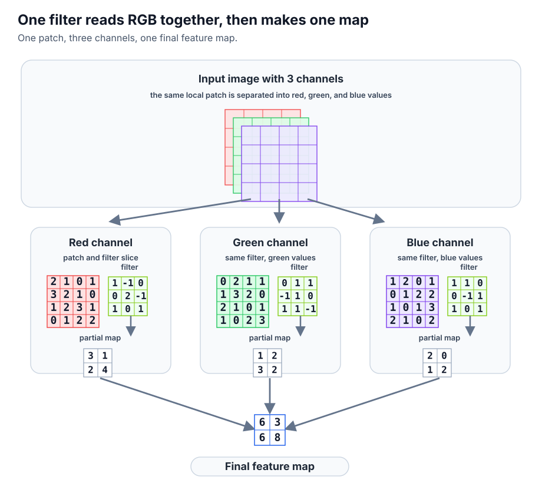
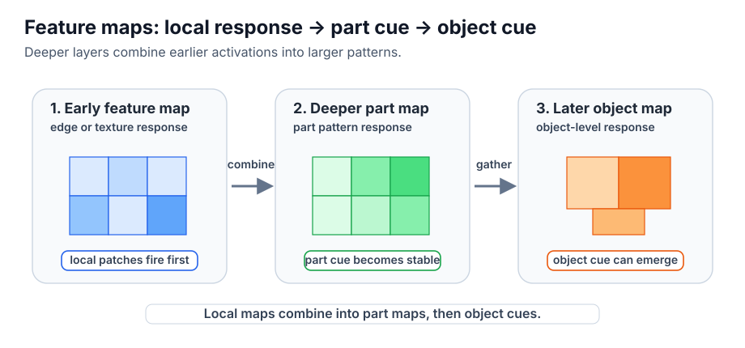
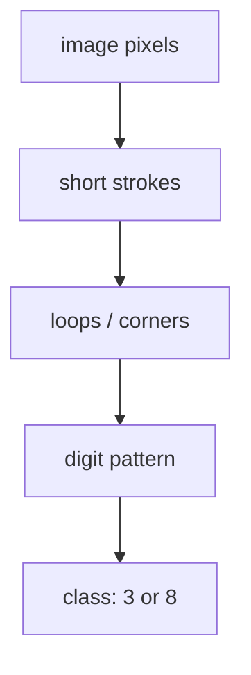
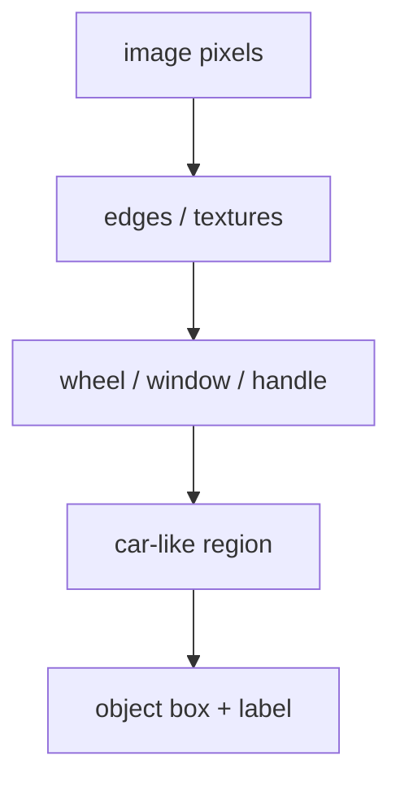
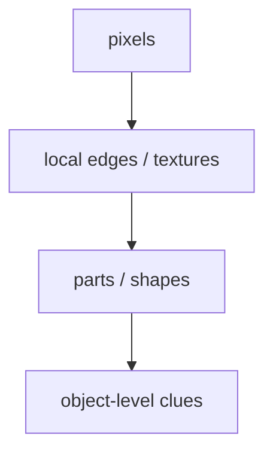

# P4-11.1 CNN의 직관

P4-10장에서는 깊은 신경망이 층을 거치며 더 유용한 표현(representation)을 학습할 수 있다는 점을 보았습니다. 이제 이 관점을 이미지 쪽으로 좁히면 다음 질문이 생깁니다.

이미지처럼 공간 구조가 있는 데이터에서는, 왜 일반적인 완전연결층(fully connected layer)보다 CNN이 더 자연스럽다고 말하는가?

이 질문에 답하는 구조가 CNN(convolutional neural network)입니다.

CNN은 이미지 전체를 한꺼번에 같은 방식으로 보지 않고, 작은 지역 패턴(local pattern)을 반복해서 살피며 더 큰 시각적 구조를 배우는 신경망이다.

## 이 절의 범위

이 절은 다음 질문에 답합니다.

- CNN은 왜 이미지와 잘 맞는가?
- 지역 패턴(local pattern)을 본다는 말은 무엇을 뜻하는가?
- 완전연결층만 쓰는 방식과 어떤 차이가 있는가?
- CNN이 표현 학습 관점에서 왜 중요한가?

이 절에서는 다음 내용을 깊게 다루지 않습니다.

- convolution 수식의 엄밀한 전개
- padding, stride, dilation의 세부 구현 차이
- 최신 vision architecture의 상세 비교

구체적 연산인 convolution과 pooling은 P4-11.2에서 이어서 다루고, 이미지 도메인 표현 학습의 큰 흐름은 앞의 P4-10.1, P4-10.2에서 이미 잡았습니다. 이 절에서는 그 큰 흐름을 이미지 장면 위에 다시 얹어 읽습니다. CNN 이후의 vision 구조 비교는 보충학습 P4-11.3에서 `CNN과 Vision Transformer(ViT)를 어떤 관점에서 비교하면 되는가` 수준으로 회수하고, 더 최신 세부 변형까지의 상세 비교는 이 책의 현재 본편 범위 밖에 둡니다.

## 이 절의 목표

- CNN을 `이미지의 지역 구조를 반복적으로 읽는 신경망`으로 설명할 수 있습니다.
- 왜 이미지에서는 위치와 근처 패턴이 중요한지 말할 수 있습니다.
- 완전연결층과 CNN의 차이를 입문 수준에서 비교할 수 있습니다.
- 작은 Python 예제로 지역 패턴을 읽는 감각을 확인할 수 있습니다.

## 왜 이미지에는 공간 구조가 중요할까

이미지는 단순한 숫자 목록이 아닙니다. 각 픽셀(pixel)은 주변 픽셀과 함께 의미를 만듭니다.

예를 들어:

- edge는 인접한 밝기 변화에서 나타나고
- 모서리(corner)는 여러 edge의 만남에서 나타나며
- 눈, 귀, 바퀴 같은 부분 구조도 근처 픽셀 조합에서 드러납니다

즉, 이미지에서는 `가까운 위치의 관계`가 매우 중요합니다.

다음처럼 이해하면 충분합니다.

`이미지는 값이 있는 것만 중요한 것이 아니라, 그 값이 어디에 있고 주변과 어떻게 이어지는지가 중요하다.`

## 완전연결층만 쓰면 왜 불편한가

이미지를 길게 펼쳐서(flatten) 완전연결층에 넣는 방법도 이론적으로는 가능합니다. 하지만 이 방식은 이미지의 공간 구조를 독자에게 직관적으로 보존하지 못합니다.

예를 들어:

- 서로 이웃한 픽셀 관계를 별도로 강조하지 못하고
- 위치마다 같은 패턴이 반복된다는 감각이 약해지며
- 파라미터 수도 매우 커질 수 있습니다

즉, 완전연결층은 `모든 입력을 한 번에 섞는 방식`에 가깝고, 이미지의 지역 구조를 먼저 보는 데에는 덜 자연스럽습니다.

같은 차이를 아주 짧게 표로 보면 다음과 같습니다.

| 관점 | 완전연결층만 사용 | CNN |
| --- | --- | --- |
| 입력을 보는 방식 | 전체를 한 번에 길게 펼쳐 본다 | 작은 지역을 반복해서 본다 |
| 위치 감각 | 이웃 픽셀 감각이 약해지기 쉽다 | 근처 픽셀 관계를 더 자연스럽게 본다 |
| 같은 패턴의 재사용 | 위치마다 별도 학습처럼 느껴진다 | 같은 필터를 여러 위치에 반복 적용한다 |
| 입문용 직관 | 모든 값을 한 번에 섞는다 | 작은 패턴에서 큰 구조로 올라간다 |

## CNN은 무엇을 다르게 하나

CNN은 이미지 전체를 한 번에 보기보다, 작은 창(window)이나 필터(filter)를 움직이며 지역 패턴을 찾는다는 직관으로 이해하면 좋습니다.

예를 들어 어떤 필터는:

- 세로 edge에 반응하고
- 어떤 필터는 가로 edge에 반응하며
- 어떤 필터는 더 복잡한 작은 모양에 반응할 수 있습니다

중요한 점은 이 필터가 이미지의 한 위치에서만 쓰이지 않고, 여러 위치에 반복 적용된다는 것입니다.

즉, CNN은 `같은 패턴이 이미지의 어디에 나타나든 비슷하게 볼 수 있게` 설계된 구조처럼 읽을 수 있습니다.

## 그림으로 먼저 보면

글자인식과 객체 검출은 CNN의 직관을 설명할 때 자주 쓰는 대표 장면입니다. 둘 다 처음부터 `이 글자다`, `이 물체다`를 한 번에 아는 것이 아니라, 작은 선과 경계, 모서리, 부분 모양을 먼저 읽고 그 조합을 더 큰 판단으로 올려 간다는 점이 잘 보이기 때문입니다.

먼저 `이미지 장면 -> 사람이 먼저 보는 단서 -> CNN이 쌓아 가는 표현`을 한 줄로 붙여 보면 다음과 같습니다.

| 장면 | 사람이 먼저 보는 단서 | CNN이 쌓아 가는 표현 |
| --- | --- | --- |
| 손글씨 숫자 이미지 | 짧은 획, 꺾이는 모서리, 고리 모양 | strokes -> loops/corners -> digit pattern |
| 자동차 사진 | 바퀴 윤곽, 창문 경계, 손잡이 모양 | edges/textures -> parts -> car-like region |

이 표의 핵심은 CNN을 `숫자 배열 연산`으로만 먼저 받아들이지 않고, 실제 이미지에서 어떤 작은 시각 단서가 더 큰 판단으로 연결되는지부터 보는 데 있습니다.

이제 그 흐름을 세 장의 자체 도식으로 나누어 보면 더 직관적입니다. 첫 그림은 `컬러 이미지의 여러 채널을 한 필터가 함께 읽어 하나의 feature map을 만든다`는 감각을 보여 줍니다. 두 번째 그림은 `같은 사진을 두고도 깊은 층일수록 더 넓은 영역을 함께 본다`는 점을 보여 줍니다. 세 번째 그림은 `그 넓어진 시야가 feature map 위에서 어떻게 더 큰 시각 단서로 합쳐지는가`를 따로 보여 줍니다. 아래 도식의 숫자와 배열은 외부 그림을 옮긴 것이 아니라, 채널 결합과 계층적 표현 개념만 설명하기 위해 새로 단순화한 예시입니다.



위 그림에서 먼저 봐야 할 것은 `채널이 셋이면 CNN이 이미지를 셋으로 완전히 따로 처리한다`가 아니라, `한 필터가 채널 전반의 같은 위치 패치를 함께 읽고 그 반응을 합쳐 하나의 feature map을 만든다`는 점입니다. 즉, 색 정보도 지역 패턴 안에서 함께 읽히며, 최종적으로는 `이 위치에서 어떤 패턴이 강하게 나타났는가`라는 반응 지도로 정리됩니다.


두 번째 그림은 같은 말 사진을 세 번 다시 써서, `입력 사진은 그대로인데 layer가 깊어질수록 receptive field가 넓어진다`는 점만 따로 보여 줍니다. 왼쪽 패널은 초기 convolution이 작은 지역 패치에서 잔디 질감과 다리 경계 같은 국소 단서를 읽는 상황이고, 가운데 패널은 더 넓은 영역을 함께 보며 머리와 목처럼 묶인 부분 구조를 읽는 상황이며, 오른쪽 패널은 여러 부분 단서를 함께 모아 몸통 전체 수준의 단서를 읽을 수 있는 상황입니다.



세 번째 그림은 이제 사진 대신 반응 지도로 시선을 옮깁니다. 초기 feature map에서는 특정 위치의 edge나 texture 반응이 먼저 강해지고, 더 깊은 part map에서는 인접한 반응이 함께 맞아떨어질 때 더 큰 부분 패턴이 안정적으로 나타나며, 더 뒤의 object map에서는 여러 부분 단서가 함께 맞을 때 객체 수준의 activation이 가능해집니다. 즉, CNN 설명에서 중요한 것은 `사진 전체를 한 번에 외웠는가`가 아니라 `초기 convolution 반응이 feature map을 거쳐 더 큰 객체 단서로 실제로 쌓이는가`입니다.

손글씨 숫자 이미지를 아주 단순한 흑백 장면으로 줄이면 다음처럼 생각할 수 있습니다.

| digit-like image patch | what stands out first |
| --- | --- |
| `[[0, 1, 1, 0], [1, 0, 0, 1], [1, 1, 1, 1], [0, 0, 0, 1]]` | 짧은 획, 꺾이는 부분, 닫힌 고리 후보 |

자동차 장면도 같은 식으로 볼 수 있습니다.

| car-like image patch | what stands out first |
| --- | --- |
| `[[sky, sky, body, body], [wheel, body, window, window], [wheel, body, body, light]]` | 둥근 바퀴 경계, 길게 이어진 차체, 네모난 창문 윤곽 |

이 두 표는 실제 고해상도 이미지를 그대로 그린 것은 아니지만, CNN 설명에서 먼저 잡아야 할 질문이 `이 장면에서 어느 작은 부분이 먼저 읽히는가`라는 점을 보여 줍니다.

손글씨 글자인식은 다음처럼 이해할 수 있습니다.



이 도식에서 확인해야 할 결과는 숫자 이미지를 처음부터 `3`, `8` 같은 라벨로 읽는 것이 아니라, 앞의 작은 이미지 장면에서 본 짧은 획과 고리, 모서리 같은 지역 단서가 먼저 쌓여 숫자 패턴 판단으로 올라간다는 점입니다.

객체 검출(object detection)은 다음처럼 볼 수 있습니다.



이 도식에서 확인해야 할 결과는 객체 검출도 전체 장면을 한 번에 외우는 일이 아니라, 앞의 장면 표에서 본 바퀴나 창문 같은 부분 단서를 먼저 읽고 그것이 모여 `car-like region`을 만든 뒤 최종 위치와 라벨 판단으로 이어진다는 점입니다.

## 지역 패턴에서 큰 구조로 간다

CNN의 직관은 Part 4에서 이미 본 계층적 표현 학습과도 자연스럽게 연결됩니다.

- 초기 층은 작은 지역 패턴
- 중간 층은 부분 구조
- 더 깊은 층은 더 큰 객체 단서

처럼 설명할 수 있습니다.

즉, CNN은 단순히 이미지용 연산이 아니라, `지역 패턴을 쌓아 더 큰 시각적 표현을 만드는 계층 구조`라고 볼 수 있습니다.

이를 아주 단순하게 그리면 다음과 같습니다.



이 도식에서 확인해야 할 결과는 CNN이 픽셀 자체를 바로 정답으로 연결하는 것이 아니라, `edge -> 부분 구조 -> 객체 단서`처럼 작은 지역 패턴에서 더 큰 시각적 단서로 올라가는 계층 구조를 만든다는 점입니다.

## 왜 CNN이 전환점처럼 보였나

딥러닝 역사에서 CNN이 크게 주목받은 이유는 이미지 인식에서 사람이 직접 만든 특징보다 더 강력한 계층적 표현을 학습하는 사례를 보여 주었기 때문입니다.

특히 AlexNet 이후 CNN은 다음을 함께 보여 주었습니다.

- 깊은 신경망이 이미지에서 실제로 강한 성능을 낼 수 있고
- GPU 학습과 결합해 규모를 키울 수 있으며
- 표현 학습이 수작업 특징 설계를 크게 대체할 수 있다는 점

즉, CNN은 딥러닝의 표현 학습 관점을 이미지 도메인에서 가장 인상적으로 보여 준 구조 중 하나입니다.

## 사례로 보기

### 사례 1. 손글씨 숫자 인식

손글씨 숫자 3과 8은 둘 다 둥근 곡선을 갖고 있어, 멀리서 보면 비슷하게 보일 수 있습니다. 사람은 처음에는 전체가 둥글다는 인상만 보고 헷갈리기 쉽습니다. 하지만 실제 판별에서는 `위쪽 고리와 아래쪽 고리가 어떻게 이어지는가`, `가운데 획이 닫혀 있는가` 같은 작은 차이를 다시 봐야 합니다. CNN은 이런 지역 구조를 먼저 읽고, 그 조합을 점차 더 큰 표현으로 이어 가는 방식과 잘 맞습니다. 그래서 이 사례에서 확인해야 할 결과는 전체 윤곽이 비슷해 보여도 지역 획 차이를 본 모델이 3과 8을 더 안정적으로 가른다는 점입니다.

### 사례 2. 얼굴 이미지

얼굴 사진을 분류할 때도 모델이 처음부터 `이 사람 누구인가`를 한 번에 아는 것은 아닙니다. 사람도 사진을 볼 때 얼굴 전체 인상만으로 먼저 판단하려 들 수 있지만, 실제로는 눈썹 경계, 눈 주변 그림자, 코선, 입 모양 같은 부분 단서를 보고 전체 인상으로 묶어 갑니다. 조명 각도나 배경 색이 달라지면 전체 분위기는 꽤 달라 보여도, 눈과 코 사이 거리나 입 주변 곡선처럼 더 안정적인 단서는 그대로 남는 경우가 많습니다. CNN도 이런 작은 지역 단서가 먼저 잡히고, 그 단서들이 쌓이면서 더 큰 얼굴 표현으로 이어질 수 있습니다. 그래서 이 사례에서 확인해야 할 결과는 조명이나 배경이 조금 달라져도 눈, 코, 입 주변 구조가 유지되면 같은 얼굴 후보로 더 안정적으로 묶이는가입니다.

### 사례 3. 산업 비전

공장 표면 검사에서는 전체 제품 사진이 비슷해 보여도, 특정 모서리의 작은 깨짐이나 표면의 미세한 스크래치가 불량을 가를 수 있습니다. 사람은 전체 모양이 비슷하면 같은 제품으로 보고 넘어가기 쉽고, 규칙을 몇 개 적어 두는 방식만으로는 이런 지역 이상을 빠짐없이 잡기 어렵습니다. CNN은 국소적인 스크래치, 얼룩, 깨짐 같은 신호를 부분 패턴으로 읽는 데 잘 맞기 때문에 산업 비전과 자주 연결됩니다. 그래서 이 사례에서 확인해야 할 결과는 전체 실루엣은 멀쩡해 보여도 작은 결함이 반복적으로 나타나는 위치가 실제로 불량 후보로 더 일관되게 올라오는가입니다.

세 사례를 한 줄로 묶으면 다음과 같습니다.

| 상황 | CNN이 잘 맞는 이유 |
| --- | --- |
| 손글씨 숫자 | 획과 곡선 같은 지역 패턴이 중요해서 |
| 얼굴 이미지 | 눈, 코, 입 주변의 부분 구조가 쌓여 더 큰 표현이 되어서 |
| 산업 비전 | 작은 결함과 질감 이상이 국소적으로 나타나서 |

## 작은 Python 예제로 지역 패턴 감각 보기

이번 예제의 목표는 이미지 전체가 아니라 작은 구역을 보며 값을 읽는 감각을 확인하는 것입니다.

입력:

- 4x4 작은 이미지 배열
- 2x2 크기의 작은 창

출력:

- 가능한 2x2 지역 패치들

```python
import numpy as np

image = np.array([
    [1, 2, 3, 4],
    [5, 6, 7, 8],
    [9, 10, 11, 12],
    [13, 14, 15, 16],
])

patches = []
for i in range(3):
    for j in range(3):
        patch = image[i:i+2, j:j+2]
        patches.append(patch)

print("image =")
print(image)
print()
print("number of 2x2 patches =", len(patches))
print("first patch =")
print(patches[0])
print("second patch =")
print(patches[1])
```

실행 결과 예시는 다음처럼 읽을 수 있습니다.

```text
image =
[[ 1  2  3  4]
 [ 5  6  7  8]
 [ 9 10 11 12]
 [13 14 15 16]]

number of 2x2 patches = 9
first patch =
[[1 2]
 [5 6]]
second patch =
[[2 3]
 [6 7]]
```

이 예제에서 읽어야 할 핵심은 다음입니다.

- CNN은 이미지 전체를 한 번에만 보는 것이 아니라
- 작은 지역 창을 반복해서 읽고
- 그런 지역 정보가 뒤에서 더 큰 표현으로 쌓일 수 있다는 점입니다

## Python으로 CNN 설명용 이미지를 만드는 예제

이번 예제의 목표는 모델을 학습하는 것이 아니라, `CNN이 어디를 먼저 볼지`를 설명하는 자산도 코드로 만들 수 있다는 점을 확인하는 것입니다.

입력:

- 원본 사진 한 장
- 강조할 지역 박스 좌표
- 박스별 라벨

출력:

- 원본 사진을 복사한 파일
- 그 위에 CNN 관점 주석을 얹은 SVG 오버레이

실제 생성 스크립트는 [generate_cnn_diagrams.py](../../../assets/part-04/chapter-11/generate_cnn_diagrams.py) 에 두었습니다. 말 사진을 직접 이용하는 `cnn-hierarchical-vision-flow.svg` 생성 흐름만 줄이면 다음과 같습니다.

```python
from pathlib import Path
import base64

PHOTO = Path("horse-field-photo.png")
SVG_OUT = Path("cnn-hierarchical-vision-flow.svg")

image_data = base64.b64encode(PHOTO.read_bytes()).decode("ascii")

SVG = f"""<svg xmlns="http://www.w3.org/2000/svg" viewBox="0 0 920 520">
  <image href="data:image/png;base64,{image_data}" x="640" y="190" width="240" height="160"/>
  <rect x="40" y="170" width="240" height="200" rx="16"/>
  <rect x="340" y="170" width="240" height="200" rx="16"/>
  <rect x="640" y="170" width="240" height="200" rx="16"/>
  <text x="40" y="130">1. Local clues</text>
  <text x="340" y="130">2. Part pattern</text>
  <text x="640" y="130">3. Object cue</text>
</svg>"""

SVG_OUT.write_text(SVG, encoding="utf-8")
```

실행 결과는 다음처럼 읽으면 충분합니다.

```text
horse-field-photo.png
cnn-hierarchical-vision-flow.svg
```

이 예제에서 확인해야 할 결과는 다음과 같습니다.

- 설명용 이미지도 손으로만 그리지 않고 코드로 재생성할 수 있습니다
- 같은 사진을 여러 패널로 다시 배치해 `작은 단서 -> 부분 구조 -> 객체 단서` 흐름을 직접 보여 줄 수 있습니다
- `CNN이 먼저 보는 지역 단서`를 문서 자산으로 반복 가능하게 남길 수 있습니다

## 역사와 커리큘럼 관점

CNN은 딥러닝 입문 커리큘럼에서 거의 항상 중요한 전환점으로 다뤄집니다. 이유는 단순합니다.

- 바로 앞의 P4-10.1, P4-10.2에서 본 표현 학습과 계층적 표현이 실제로 무엇을 뜻하는지 이미지 도메인에서 가장 직관적으로 보여 주고
- GPU와 대규모 데이터의 결합이 어떤 성능 전환을 만들었는지 설명할 수 있으며
- 이후 vision transformer 같은 구조를 배울 때도 CNN이 중요한 비교 기준이 되기 때문입니다

즉, CNN은 딥러닝의 역사, 구조, 실용성 세 축이 만나는 장입니다.

## 다음 절과의 연결

여기까지 오면 다음 질문이 남습니다.

- CNN의 핵심 연산인 convolution은 실제로 무엇을 계산하는가?
- pooling은 왜 등장하며, 어떤 정보를 남기고 어떤 정보를 줄이는가?

이 질문은 바로 P4-11.2 합성곱(convolution)과 풀링(pooling)으로 이어집니다.

## 이 절에서 기억할 관점

- CNN은 이미지의 지역 패턴을 반복적으로 읽는 신경망입니다.
- 이미지에서는 값뿐 아니라 위치와 주변 관계가 중요합니다.
- CNN은 완전연결층보다 이미지의 공간 구조를 더 자연스럽게 다룹니다.
- CNN을 볼 때는 사람이 특징을 직접 세지 않아도 지역 패턴에서 상위 시각 단서가 실제로 쌓여 올라가는지를 확인하는 대표 구조로 읽으면 됩니다.

## 체크리스트

- CNN을 입문 수준에서 한 문장으로 설명할 수 있는가?
- 이미지에서 지역 구조가 왜 중요한지 말할 수 있는가?
- 완전연결층과 CNN의 차이를 직관적으로 비교할 수 있는가?
- 다음 절의 convolution과 pooling으로 왜 자연스럽게 이어지는지 설명할 수 있는가?

## 출처와 참고 자료

- Yann LeCun et al., `Gradient-Based Learning Applied to Document Recognition`, Proceedings of the IEEE, 1998, 확인 날짜: 2026-06-29.
- Alex Krizhevsky, Ilya Sutskever, Geoffrey E. Hinton, `ImageNet Classification with Deep Convolutional Neural Networks`, NeurIPS 2012, 확인 날짜: 2026-06-29.
- Ian Goodfellow, Yoshua Bengio, Aaron Courville, `Deep Learning`, MIT Press, 2016, 확인 날짜: 2026-06-29. [https://www.deeplearningbook.org/](https://www.deeplearningbook.org/){: target="_blank" rel="noopener noreferrer" }
