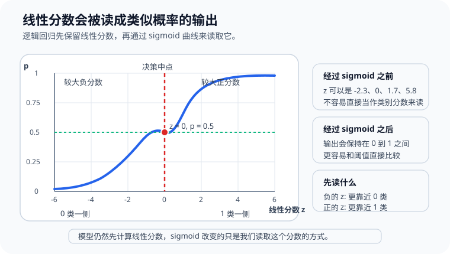
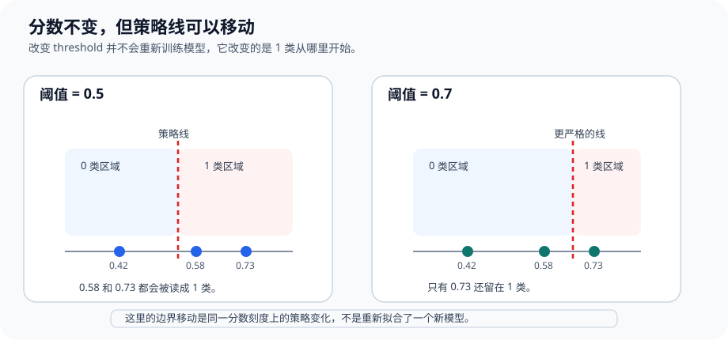

# P4-11.1 逻辑回归(logistic regression)的直觉

> Section ID: `P4-11.1`
> Version: `v2026.07.12`

在 P4-10 里，我们通过 linear regression 看到了 `怎样用一条直线预测连续值`。现在要接着看：同样是线性思路，到了 classification 问题时会怎样变化。

本节的中心问题如下。

如果想保留线性计算，但把输出读成 0 和 1 之间的值，应该怎么做？

这正是 logistic regression 的出发点。

这个名字经常会让人困惑。既然叫 `regression`，为什么最后做的是 classification？因为 logistic regression 的最终目的虽然是分类，但内部仍然先计算一个 linear combination，再把这个值变成可以像 probability 一样读取的形式，所以这个名字就保留了下来。

也就是说，logistic regression 不是 `把 linear regression 原样拿去做分类`，而是 `把线性计算的输出改写成可以按分类概率来解释的模型`。

这一节会说明 `logistic regression`、`sigmoid`、`predict_proba`、`threshold` 的基本含义。后面的章节会沿着这个抓手继续当前语境下的判断，而把线性计算先读成分类概率的基础感觉，也会通过这一节和 [概念词汇表](../../../reference/concept-glossary.md) 再接回来。

## 本节范围

这一节回答下面这些问题。

- logistic regression 为什么会用在 classification 问题里？
- 为什么名字里是 `regression`，结果却按分类来读？
- linear combination 是怎样变成 0 到 1 之间的值的？
- `predict_proba` 这样的输出到底表示什么？
- 为什么还需要 threshold？

这一节不会深入讲下面这些内容。

- log-odds 的严格推导
- 最大似然估计(maximum likelihood estimation, MLE)的完整公式展开
- 多类别(multinomial) logistic regression 的细节公式
- solver 差异和 regularization 设置

decision boundary 与 threshold 的空间解释，会在 P4-11.2 立刻继续；为什么会看到 log-odds，为什么会用 MLE，会在 P4-11.3 回收；二元分类怎样扩展到 multinomial，会在 P4-11.4 回收；solver 与 regularization 为什么会作为实现设置出现，会在 P4-11.5 回收。regularization 的更大视角以及 hyperparameter 的读取，也会在 P4-9.1、P4-9.2、P5-8.1 再接回来。

## 本节目标

- 能把 logistic regression 说明成 `在分类问题里生成可按概率读取输出的线性模型`。
- 能区分 linear regression 和 logistic regression 的共同点与差别。
- 能在入门层面解释为什么会出现 sigmoid。
- 能理解 `predict_proba` 和最终 class prediction 不是同一个阶段。
- 能说明 threshold 会介入分类判断。

## 学习背景

Part 4 的算法流程，是故意让回归到分类之间不要突然断开的。先看 linear regression，是为了说明 logistic regression 不是完全不同的新世界，而是同一个 linear model 家族里 `输出解释方式发生变化` 的一个例子。

| 课程位置 | logistic regression 的作用 |
| --- | --- |
| 在 P4-10 linear regression 之后 | 把线性思路扩展到 classification |
| 在 P4-6 评价指标之后 | 为概率输出与分类指标的连接做准备 |
| 在 P4-11.2 之前 | 引入 decision boundary 的概念 |

所以，P4-11.1 既是 `第一次正式介绍分类模型的 Section`，也是 `说明它与 linear regression 连续相接的 Section`。

## 主要学习内容

### logistic regression 处理什么问题

logistic regression 通常首先用 `二元分类(binary classification)` 来介绍，也就是在两个 class 里做选择的问题。

例如：

| 业务场景 | 要预测的值 |
| --- | --- |
| 客户会不会流失？ | 流失 / 不流失 |
| 邮件是不是垃圾邮件？ | 垃圾 / 正常 |
| 交易是不是欺诈？ | 欺诈 / 正常 |
| 患者是不是有较高疾病风险？ | 高风险 / 非高风险 |

这些问题的共同点是：输出不是连续数值，而是 `类别`。但内部计算仍然是数字。

`logistic regression 是先根据输入估计样本属于某个 class 的可能性，再把它读成 0 到 1 之间的分数，最后据此做分类判断的模型。`

### 为什么名字叫 regression，却在做 classification

这里首先要拆开的误解就是这一点。logistic regression 虽然用于分类，但内部仍然先计算一个 linear score。

最简单地可以把它想成下面这样。

\[
z = w_1x_1 + w_2x_2 + \cdots + w_nx_n + b
\]

这个结构和 linear regression 里看到的是一样的。不同之处在于，它不会停在这里。linear regression 想把这个值直接当成 prediction 来读，而 logistic regression 会把它送进 sigmoid，把它变成 0 到 1 之间的值。

所以，名字里的 `regression` 更像是保留了线性组合与数值估计方式的痕迹，而真正的使用目的则更接近 `classification`。

### 为什么需要 sigmoid

如果在分类问题里直接使用 linear formula 的输出，就可能得到 `1.7`、`-2.3`、`5.8` 这样的值。但分类场景里，这样的值并不好直接读取。我们通常更想把它读成 `属于这个 class 的可能性有多大`，而这个值最好落在 0 和 1 之间。

sigmoid 正是做这件事的函数。

- 很大的正输入会被送到接近 1 的值
- 很大的负输入会被送到接近 0 的值
- 中间值会被送到 0.5 附近

`sigmoid 是把线性计算结果压进 0 到 1 范围，让它更容易按分类分数读取的函数。`

放到坐标上看会更直观。当 linear score \(z\) 从负值变到正值时，sigmoid 输出会从接近 0 平滑移动到接近 1，并且在 `z = 0` 处遇到 `p = 0.5`。



这个流程可以简单画成下面这样。

```mermaid
--8<-- "assets/part-04/chapter-11/p4-11-1-mermaid-01-zh.mmd"
```

关键点在于，logistic regression 不是把直线丢掉，而是 `在直线式计算之后，再加上一层解释用的变换`。

### linear regression 和 logistic regression 有什么相同，又有什么不同

这两个模型都使用 linear combination，所以很像。但输出的意义不同。

| 项目 | linear regression | logistic regression |
| --- | --- | --- |
| 主要处理的问题 | regression | classification |
| 内部计算 | linear combination | linear combination |
| 最终输出 | 连续值 | 0 到 1 的分数，以及 class 决定 |
| 入门解释 | 预测多少分、多少分钟、多少钱 | 哪个 class 的可能性更大 |

所以 logistic regression 不是一个起点完全不同的模型，而是把同样的线性结构改写成分类读取方式的模型。

### `predict_proba` 显示的是什么

在 scikit-learn 的 logistic regression 文档里，一个很重要的输出就是 `predict_proba`。读者很容易直接把它当成最终答案，但实际上它是前一层的信息。

例如，如果看到 `0.82`，通常表示 `model 认为这个样本属于 positive class 的可能性相当高`。但最终到底是把 class 记成 0 还是 1，则由 threshold 决定。

也就是说：

- `predict_proba`：可能性的程度
- `predict`：最终的分类决定

如果忽略这个差别，就很容易把 `score` 和 `decision` 当成同一件事。

看一个很小的例子会更清楚。

| 用户 | 用 `predict_proba` 读到的 class 1 分数 | 以 0.5 为标准的判断 |
| --- | ---: | --- |
| A | 0.18 | class 0 |
| B | 0.49 | class 0 |
| C | 0.51 | class 1 |
| D | 0.87 | class 1 |

这个表里最重要的是 B 和 C。两个人的分数差距并不大，但在 threshold 0.5 下最终 class 已经分开了。也就是说，model 生成的 score 空间是连续的，而服务行为可能在上面不连续地分开。

### 为什么还需要 threshold

logistic regression 最常见的入门介绍，是把 `0.5` 当作分类标准。

- 如果概率样的值 `>= 0.5`，就判为 class 1
- 如果概率样的值 `< 0.5`，就判为 class 0

但这个标准并不是自然法则，而是被选择的 policy。

例如在 fraud detection 里，漏掉欺诈的代价可能很高，所以服务可能希望更积极地抓住可疑案例。反过来，如果服务不能过度阻挡正常用户，就可能把 threshold 设得更保守。

也就是说，logistic regression 负责生成 `像 probability 一样可读的分数`，而实际服务再在上面决定 `线到底画在哪里`。

这一点会直接连到 P4-6 的评价指标、P4-8 的 baseline、P4-9 的 tuning。

再看一个小例子。

| 客户 | 流失分数 | threshold = 0.5 | threshold = 0.7 |
| --- | ---: | --- | --- |
| E | 0.42 | 维持 | 维持 |
| F | 0.58 | 警告 | 维持 |
| G | 0.73 | 警告 | 警告 |

同样的 score，在 threshold 改变后，服务行为也会改变。所以读取 logistic regression 时，必须把 `模型分数` 和 `运营 policy` 分开来看。边界附近的案例首先应该被读成需要提高 review 优先级的信号，而不是把 threshold 一改就当作原因解释已经完成。

这里也要维持同样的比较框架。应该在相同的 baseline、相同的 score 区间、相同的代表失败案例上比较 threshold 前后，才能更清楚地分开 `哪些变化来自 policy`，`哪些问题来自特征表达不足`。

如果把这一点改写成项目记录语言，会更清楚。把 logistic regression 作为第一个比较模型时，不应该只留下 score 表，还应一起记录 `哪些 score 区间会被当作 review 对象`、`threshold 改变时哪些案例会改变行为`、`相比 baseline 到底改善了什么`。

| 需要一起留下的记录 | 为什么需要 |
| --- | --- |
| baseline 和 logistic regression 的 score 对比 | 为了看清到底比简单标准改善了什么 |
| 不同 threshold 下行为变化的案例 | 为了记录同样分数在服务 policy 下会怎样变化 |
| review 对象 score 区间 | 为了把边界附近案例重新读成需要人工检查的对象 |
| 下一步调整问题 | 为了决定是改 threshold、补 feature，还是比较其他候选模型 |

这样才能把 `分数提高了`、`threshold 改了`、`警告变多了` 这些事实分开读取。

如果把 `同样的 score 会因为 policy line 放在哪里而导致最终行为不同` 压缩到同一条 score 轴上，可以像下面这样读。



### 什么时候适合先把 logistic regression 放上候选

logistic regression 很常作为分类问题的第一个比较模型，但原因不是因为它单纯有名，而是因为它是一个比较容易把 score 和 policy 分开来读的线性分类模型。

| 当前问题状态 | 为什么先放 logistic regression | 先检查什么 |
| --- | --- | --- |
| 目标是 binary classification | 因为 0 到 1 的分数和最终 class 可以一起容易读取 | 输出到底是不是类别判断 |
| 需要一个可解释的首个分类模型 | 因为 linear score、coefficient、threshold 比较容易直接说明 | 线性边界是否足够 |
| 需要一个比 baseline 稍强的 score 模型 | 因为和多数类标准相比，实际提升比较容易看 | confusion matrix 里到底哪里变好了 |
| 想留下人工 review 对象 score 区间 | 因为可以把 `predict_proba` 与 threshold 分开，定义 review 对象 | 是否单独记录了边界附近案例 |
| 必须区分服务 policy 与模型输出 | 因为 `模型负责产出 score，policy 决定行为` 这个结构很清楚 | 是否把 threshold 变化和模型改进混在一起 |

这张表的核心，是把 logistic regression 既当成 `超过第一个分类 baseline 的比较模型`，也当成 `训练如何分开读取 score 与 policy 的练习模型`。

## 补充读取点

### 学术背景与历史

读到这里，自然会冒出一个问题：`为什么还需要专门有这样一个模型？` 因为名字的关系，logistic regression 很容易看起来只是 linear regression 的一个小变体，但实际上，它更接近于把 `解释连续值的线性模型` 扩展成 `读取二元结果的方式`。

- linear regression 擅长解释连续值。
- 但如果把它原样用在成功/失败这种二选一问题上，就会出现小于 0 或大于 1 的值，很难按 probability 去读取。
- 所以统计学整理出了一种方式：保留线性公式，但把它的输出改造成可以在 0 到 1 范围里解释的形式。

也就是说，logistic regression 的历史意义，更接近于 `把线性计算重新读成分类问题`，而不是 `把直线丢掉`。

从这个角度看，linear regression 和 logistic regression 的先后顺序也会更清楚。

- linear regression：解释连续值的代表性线性模型
- logistic regression：保留线性思路，但把输出解释成 binary classification 的模型

在现代机器学习语境里，它通常会被介绍成 `用于 classification 的 linear model`。与其把整段历史背下来，不如先抓住下面这句话。

`如果 linear regression 是解释连续值的代表性线性模型，那么 logistic regression 就是把同样的线性思路扩展到二元分类与 probability 解释的一种模型。`

### 主要讨论点通常从哪里出现

看完运作方式和一些例子后，下一个问题就会变成：`这个模型到底该信到哪里，又该从哪里开始小心？` logistic regression 常被当成入门模型，也经常被说成具有较高的可解释性。但在实际里，它也是 `越看起来容易解释，越容易被过度简化和误读的模型`。

### 1. score 和 decision 是同一回事吗

最常见的误解，就是把模型输出和服务行为当成同一回事。

- model 通常输出的是接近 `class 1 的可能性有多高` 的 score
- service 会在这个 score 之上决定 `拦截`、`警告`、`review`、`放行` 等行为

所以，围绕 logistic regression 的第一个讨论点就是：`model 说到哪里为止，service policy 又是从哪里开始介入？`

`logistic regression 会生成判断材料，但不会自动把最终行为规则也一起决定好。`

| 记录项 | 例子 |
| --- | --- |
| score | `0.58` |
| 当前 threshold | `0.50` |
| 当前行为 | `警告` |
| 是否需要 review | `靠近边界，因此需要复核` |
| 下一个问题 | `如果提高到 0.60 以上，FN 会增加多少？` |

### 2. 看起来像 probability 的值，到底到哪里还是 probability

即使输出是 `0.82`，也不代表它一定就完美等于现实世界里的真实概率。数据分布、训练方式、calibration 状态不同，`看起来像 probability 的 score` 和 `实际出现频率` 可能并不一样。

- 这个值更接近 `排序 score` 吗？
- 还是可以放心按 `现实概率` 来读？

这个差别在实践里很重要。如果任务只是给客户排优先级，顺序可能更重要；如果场景像医疗风险提示这样对概率解释很敏感，calibration 就会更重要。

`logistic regression 的输出是可以按 probability 来读的 score，但它不一定总是完美校准后的真实世界概率。`

### 3. coefficient 是解释，还是原因

logistic regression 被广泛使用的一个原因，是 coefficient 比较容易读。但 `能读` 和 `知道原因` 不是一回事。

- coefficient 的符号可以显示 score 朝哪个方向被推
- coefficient 的大小可以为 model 内部的相对影响提供线索
- 但这并不会直接证明现实世界里的因果关系

这个讨论点在社会数据、医疗数据、用户行为数据里尤其重要。如果把 correlation 和 causation 混在一起，说明看起来会很轻松，但结论会变得危险。

### 4. logistic regression 是因为简单而好，还是因为简单而弱

logistic regression 是 linear model。这种简单性同时是优点，也是限制。

- 优点：快，适合作 baseline，也比较容易解释
- 限制：当输入和结果的关系非常复杂或 nonlinear 时，表达能力可能不足

所以实践中常会出现这样的问题。

- 先用 logistic regression 起步，建立第一个基准线吗？
- 还是一开始就上更复杂的模型？

本书默认采用第一条路。logistic regression 重要，不是因为它是 `最好的模型`，而是因为它是 `最适合先把分类问题结构看清楚的模型之一`。

### 5. 为什么 threshold 0.5 常见，但不是绝对标准

`0.5` 只是常见的默认值。现实服务里，成本结构、class imbalance、policy 目标不同，更合适的 threshold 也会不同。

- 不能漏掉垃圾邮件的服务
- 不能误挡正常用户的服务
- 需要尽早更广泛捕捉风险信号的服务

即使建立在同一个 logistic regression 输出之上，也可能选择不同的 threshold。

所以，围绕 logistic regression 的一个重要讨论点就是：`好的 score` 和 `好的行为标准` 并不总是同一件事。

## 案例与示例

在看具体案例前，可以先把本节的公共比较框架整理成下面这样。

| 场景 | 人最容易先用的规则 | 这个规则的限制 | logistic regression 改变的点 | 要确认的结果 |
| --- | --- | --- | --- | --- |
| 流失预测 | 凭感觉挑出高风险客户 | 同一个客户可能因人而异地被判断 | 把概率样 score 与 threshold 一起保留下来 | 可以分开 review 对象和自动行为 |
| 垃圾邮件分类 | 强力拦截可疑邮件 | 容易把 FP 与 FN 成本混成一个粗规则 | 把 score 与 policy 标准 分开读 | 能解释不同服务的 threshold 差异 |
| 医疗风险分类 | 看起来危险就广泛预警 | 难以同时处理漏诊成本与过度预警成本 | 同一 score 也可用更敏感的 threshold 来读 | 会看见 accuracy 之外还需要别的判断标准 |
| 贷款 / 欺诈检测 | 用一两条规则直接放行或拦截 | 容易忽略领域里的成本结构差异 | 在同一个 model 上叠加不同运营 policy | model score 和行动 policy 能分开读取 |

### 案例 1. 为什么客户流失预测常把 logistic regression 作为第一个模型

在客户流失(churn)预测里，logistic regression 经常像 baseline 一样被先拿出来。

- 输出值是 `流失的可能性`
- 实际服务判断是 `从哪个 score 开始发 retention campaign`

例如，假设一个订阅服务先只看下面三个特征。

| 客户 | 最近 30 天登录天数 | 最近 30 天支付次数 | 是否有投诉 | class 1 score | 0.5 标准下的行动 |
| --- | ---: | ---: | --- | ---: | --- |
| A | 26 | 4 | 无 | 0.18 | 正常维持 |
| B | 9 | 1 | 有 | 0.61 | 流失挽回活动 |
| C | 4 | 0 | 有 | 0.84 | 优先复核 + 强干预 |

在这张表里，读者首先要抓住的是：`输入特征不会直接变成行动`。model 会先生成 score，service 再在这个 score 之上把 `正常维持`、`活动触发`、`人工 review` 之类的行动切开。

在这种场景里，之所以常先考虑 logistic regression，通常有三个原因：可以很快建立第一条基准线，较容易读出哪些特征在把 score 往上推，以及可以通过改变 threshold 立即比较多种运营场景。

```mermaid
--8<-- "assets/part-04/chapter-11/p4-11-1-mermaid-02-zh.mmd"
```

在这个场景里，真正关键的往往不是模型名字，而是 threshold policy。像 B 这种 `0.61` 的客户，要不要直接进入自动 campaign；还是像 C 这种 `0.80` 以上才进入强干预，都取决于成本结构。即使是同一张 score 表，`从哪里开始自动行动` 也是模型外部的运营决定。

### 案例 2. 为什么垃圾邮件过滤不能只看 probability

如果一封邮件的 spam score 是 `0.49`，在 threshold `0.5` 下它会留在正常收件箱里。但这并不等于它绝对安全，只表示在当前 threshold 下它落在 class 0 一侧。

服务仍然可以：

- 把它送进人工审核队列
- 给出更轻的提醒
- 或和代表性的 false-negative 案例再比较

这个场景说明：`像概率一样的输出` 与 `最终行为` 不能用同一句话来读。

### 案例 3. 医疗风险分类

在医疗场景里，漏掉阳性风险的成本可能非常高。此时服务可能需要用低于 `0.5` 的 threshold，让预警更敏感。

| 患者 | model 看到的信号例子 | class 1 score | 0.5 标准 | 0.3 标准 |
| --- | --- | ---: | --- | --- |
| P1 | 年龄较低，主要指标稳定 | 0.11 | 一般说明 | 一般说明 |
| P2 | 血压升高，有家族史 | 0.34 | 一般说明 | 建议追加检查 |
| P3 | 多项主要指标异常 | 0.79 | 建议追加检查 | 建议追加检查 |

这里最关键的是 P2。`0.34` 在 0.5 规则下看起来不高，但在漏诊成本很大的环境里，先建议追加检查可能更安全。

在这种场景里，单纯的 accuracy 并不够。更接近 sensitivity 的视角会更重要，所以 logistic regression 常被先当成 `score model` 使用，而真正的运营设计会与医疗规则一起另外处理。

### 案例 4. 贷款审核与欺诈检测有什么不同

在贷款审核里，误批和误拒都很昂贵；在欺诈交易检测里，误拦正常用户也有成本，但放过真实欺诈的代价可能更大。

- 贷款审核：可解释性和 policy 一致性可能更重要
- 欺诈检测：更快的预警和更高的 recall 可能更重要

| 场景 | 一个 0.62 的分数可能怎么被读取 |
| --- | --- |
| 贷款审核 | 可能先送去补充资料或审核员复查，而不是立刻拒绝 |
| 欺诈检测 | 可能更快触发暂缓支付或追加认证 |

`logistic regression 负责生成 score，而 service 会另外决定怎样把这个 score 变成行动。`

## 练习与示例

### Python 例子：先看一个很小的 logistic regression

下面这个例子，是用学习时间(`study_hours`)去预测考试是否通过(`passed`)的一个很小的二元分类练习。

- 问题场景：假设学习时间越长，通过概率越高
- 输入(input)：学习时间
- 标签(label)：通过(1) / 未通过(0)
- 要检查的概念：
  - linear score 经过 sigmoid 后会被读成 0 到 1 之间的值
  - `predict_proba` 和 `predict` 不是同一个阶段
  - coefficient 的符号会显示概率朝哪个方向上升

| 输入组 | 含义 |
| --- | --- |
| `study_hours` | 只有一个特征的一维输入 |
| `passed` | 通过 / 未通过标签 |
| `[[3], [5], [7]]` | 用来观察边界前、边界附近、边界后的样本 |

| 学生 | 学习时间 | 实际结果 |
| --- | ---: | --- |
| S1 | 1 | 未通过 |
| S2 | 2 | 未通过 |
| S3 | 3 | 未通过 |
| S4 | 4 | 未通过 |
| S5 | 5 | 通过 |
| S6 | 6 | 通过 |
| S7 | 7 | 通过 |
| S8 | 8 | 通过 |

```python
import numpy as np
from sklearn.linear_model import LogisticRegression

study_hours = np.array([1, 2, 3, 4, 5, 6, 7, 8]).reshape(-1, 1)
passed = np.array([0, 0, 0, 0, 1, 1, 1, 1])

model = LogisticRegression()
model.fit(study_hours, passed)

proba = model.predict_proba([[3], [5], [7]])
pred = model.predict([[3], [5], [7]])

print("coefficient      :", round(model.coef_[0][0], 3))
print("intercept        :", round(model.intercept_[0], 3))
print("proba at x=3     :", np.round(proba[0], 3))
print("proba at x=5     :", np.round(proba[1], 3))
print("proba at x=7     :", np.round(proba[2], 3))
print("class prediction :", pred)
```

示例输出如下。

```text
coefficient      : 1.236
intercept        : -5.561
proba at x=3     : [0.831 0.169]
proba at x=5     : [0.452 0.548]
proba at x=7     : [0.117 0.883]
class prediction : [0 1 1]
```

这个输出可以这样读。

- coefficient 为正，所以学习时间越长，score 越会朝通过 class 一侧移动
- 在 `x=3` 时，按 class 1 probability 来读的值较低，所以更接近未通过
- 在 `x=5` 时，会在 0.5 附近经过，从而让分类结果发生变化
- 在 `x=7` 时，model 更明显地偏向通过一侧

重要的是，如果看到像 `0.548` 这样的值，不要把它读成绝对事实，而应读成：`当前 model 在看到这些数据后，认为那个 class 更有可能。`

如果自己改值再看，还会更清楚。

- 如果把 `[[3], [5], [7]]` 换成更密一些的 `[[4], [5], [6]]`，更容易看到边界附近的 score 变化
- 如果略微改动 `passed` 里靠近边界的标签，coefficient 和 intercept 也会一起变化
- 同样的 score 在 threshold 改变后会导向不同的最终行为，这一点会直接接到下一个例子

### Python 例子：把 `predict_proba` 和 `predict` 分开读取

下面的例子说明 logistic regression 会先产出 score，然后再通过 threshold 把它变成 class。

```python
import numpy as np

scores = np.array([0.18, 0.49, 0.51, 0.87])
pred_05 = (scores >= 0.5).astype(int)

print("scores        :", scores)
print("threshold 0.5 :", pred_05)
```

示例输出如下。

```text
scores        : [0.18 0.49 0.51 0.87]
threshold 0.5 : [0 0 1 1]
```

这个输出说明：`0.49` 和 `0.51` 的 score 很接近，但只要 threshold 落下去，最终 class 就已经分开了。

### Python 例子：同时看 threshold 差异

这次直接观察：即使 score 相同，只要 threshold 改变，最终行为也会变化。

- 问题场景：假设已经得到了客户流失分数
- 输入(input)：已经算出的 class 1 分数
- 期待输出(output)：threshold 0.5 与 0.7 下判断如何改变
- 要检查的概念：
  - 即使 score 不变，policy 标准变化也会改变 class decision
  - 模型输出和服务行为必须分开读取

```python
import numpy as np

scores = np.array([0.42, 0.58, 0.73])

pred_05 = (scores >= 0.5).astype(int)
pred_07 = (scores >= 0.7).astype(int)

print("scores          :", scores)
print("threshold 0.5   :", pred_05)
print("threshold 0.7   :", pred_07)
```

示例输出如下。

```text
scores          : [0.42 0.58 0.73]
threshold 0.5   : [0 1 1]
threshold 0.7   : [0 0 1]
```

这个输出再次说明：是 model 负责生成 score，而是 operating rule 决定这个 score 如何变成行为。

### 再改一个值：如果边界附近的一个标签变了，分数解释会怎样摇晃

现在把训练数据里边界附近的 `study_hours = 4` 从 `不及格(0)` 改成 `及格(1)`。

```python
import numpy as np
from sklearn.linear_model import LogisticRegression

study_hours = np.array([1, 2, 3, 4, 5, 6, 7, 8]).reshape(-1, 1)
passed_original = np.array([0, 0, 0, 0, 1, 1, 1, 1])
passed_shifted = np.array([0, 0, 0, 1, 1, 1, 1, 1])

model_original = LogisticRegression()
model_original.fit(study_hours, passed_original)

model_shifted = LogisticRegression()
model_shifted.fit(study_hours, passed_shifted)

score_original = model_original.predict_proba([[4]])[0][1]
score_shifted = model_shifted.predict_proba([[4]])[0][1]

print("class 1 score at x=4, original labels :", round(score_original, 3))
print("class 1 score at x=4, shifted labels  :", round(score_shifted, 3))
```

示例输出如下。

```text
class 1 score at x=4, original labels : 0.327
class 1 score at x=4, shifted labels  : 0.579
```

### 什么保持了不变，什么发生了改变

- 保持不变的点：整体方向仍然是学习时间越多，越倾向于及格一侧。
- 发生变化的点：只改了一个边界附近标签，`x=4` 的 class 1 score 就从 `0.327` 大幅移动到 `0.579`。
- 首先要留下的判断：logistic regression 的分数不是从自然里发现的原始概率，而是当前数据边界所形成的解释结果。

这个练习让 logistic regression 不再只是 `打印 score 的模型`，而重新读成 `对边界附近案例很敏感的分类规则`。重要的不是单独相信某个数字，而是读取某个案例变化会怎样摇动 score 解释和 threshold 判断。把同一个例子反复改一处再看，会更清楚地看到：在 model output 和 service action 之间，始终还隔着一层数据解释。

| 通用记录语言 | 这次练习里应立刻留下的内容 |
| --- | --- |
| 看见的结构 | 只改了一个边界附近标签，同一输入的 class 1 score 解释就大幅变化 |
| 解释边界 | 不能只凭这个 score 变化就断定真实世界概率突然改变，仍要把 sample 与 data boundary 一起看 |
| 下一个问题 | 如果再收集更多边界附近案例，score 会不会更稳定？加上 threshold policy 后又会怎样变化？ |

| 先看到的信号 | 这个信号意味着什么 | 紧接着要做的动作 |
| --- | --- | --- |
| 很多分数都靠近 0.5，而且一改 threshold 判断就经常翻转 | 比起分数本身，运营边界设置正在造成更大的差异 | 先补更多边界附近案例，再按 FP 和 FN 成本重看 threshold |
| 分数看起来很高，但实际频率和体感风险还是对不上 | 把排序和概率解释当成同一件事可能有风险 | 重新检查是否需要 calibration，或是否只把 score 当作排序信号 |

## 检查清单

- 现在的问题是不是 binary classification，是否已经先确认？
- 能不能把 logistic regression 说明成在分类问题里生成可按概率来读的输出的线性模型？
- 能不能理解内部计算仍然是 linear combination，但最终解释会通过 sigmoid 变成 0 到 1 的范围？
- 有没有把 `predict_proba` 和最终 `predict` 当成同一件事来读？
- 能不能把 threshold 变化和模型本身的改进分开说明？
- 当 coefficient、sigmoid、像 probability 一样的输出缠在一起时，能不能重新说明这是 `线性计算后还要再经过一层解释` 的模型？

## 出处与参考资料

- scikit-learn, `1.1.11. Logistic regression`, scikit-learn User Guide, 确认日期: 2026-06-26. [https://scikit-learn.org/stable/modules/linear_model.html#logistic-regression](https://scikit-learn.org/stable/modules/linear_model.html#logistic-regression){: target="_blank" rel="noopener noreferrer" }
- scikit-learn, `LogisticRegression`, scikit-learn API Reference, 确认日期: 2026-06-26. [https://scikit-learn.org/stable/modules/generated/sklearn.linear_model.LogisticRegression.html](https://scikit-learn.org/stable/modules/generated/sklearn.linear_model.LogisticRegression.html){: target="_blank" rel="noopener noreferrer" }
